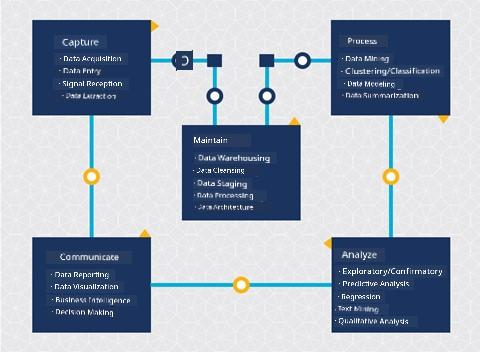
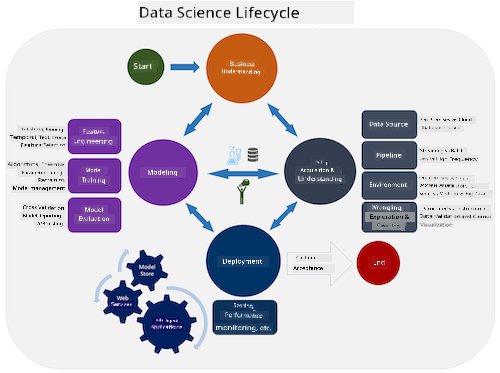
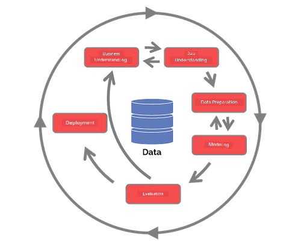

<!--
CO_OP_TRANSLATOR_METADATA:
{
  "original_hash": "07e12a25d20b8f191e3cb651c27fdb2b",
  "translation_date": "2025-11-18T18:39:34+00:00",
  "source_file": "4-Data-Science-Lifecycle/14-Introduction/README.md",
  "language_code": "pcm"
}
-->
# Introduction to the Data Science Lifecycle

| ](../../sketchnotes/14-DataScience-Lifecycle.png)|
|:---:|
| Introduction to the Data Science Lifecycle - _Sketchnote by [@nitya](https://twitter.com/nitya)_ |

## [Pre-Lecture Quiz](https://ff-quizzes.netlify.app/en/ds/quiz/26)

By now, you don dey realize say data science na process wey dem fit break down into 5 stages:

- Capturing
- Processing
- Analysis
- Communication
- Maintenance

Dis lesson go focus on 3 parts for di lifecycle: capturing, processing, and maintenance.

> Photo by [Berkeley School of Information](https://ischoolonline.berkeley.edu/data-science/what-is-data-science/)

## Capturing

Di first stage for di lifecycle na very important because di next stages go depend on am. E be like say na two stages wey dem join together: to collect di data and to define di purpose plus di problems wey dem wan solve.  
To define di goals for di project, you go need deep understanding of di problem or question. First, we go need to identify and gather di people wey get di problem wey dem wan solve. Dis people fit be stakeholders for business or sponsors for di project, wey fit help identify who or wetin go benefit from di project, plus wetin dem need and why dem need am. Well-defined goal suppose dey measurable and fit show clear result.

Questions wey data scientist fit ask:
- Dis problem don dey solved before? Wetin dem discover?
- Everybody understand di purpose and goal?
- Any confusion dey? How we go fit reduce am?
- Wetin be di constraints?
- Wetin di final result go look like?
- How much resources (time, people, computational) dey available?

Next na to identify, collect, and explore di data wey dem need to achieve di goals wey dem don define. For dis acquisition step, data scientists go also check di quantity and quality of di data. Dis one go need small data exploration to confirm say di data wey dem don gather go fit help dem reach di result wey dem dey find.

Questions wey data scientist fit ask about di data:
- Wetin data dey available for me already?
- Who get dis data?
- Wetin be di privacy concerns?
- I get enough data to solve dis problem?
- Di data dey good enough for dis problem?
- If I find new information from di data, we go need change or redefine di goals?

## Processing

Di processing stage for di lifecycle dey focus on finding patterns for di data plus modeling. Some techniques wey dem dey use for dis stage go need statistical methods to find di patterns. Normally, dis kind work go hard for human to do if di data plenty, so dem go use computer to make di work fast. Dis stage na where data science and machine learning go meet. As you don learn for di first lesson, machine learning na di process of building models to understand di data. Models na representation of di relationship between di variables for di data wey dey help predict outcomes.

Common techniques wey dem dey use for dis stage dey inside di ML for Beginners curriculum. Follow di links to learn more:

- [Classification](https://github.com/microsoft/ML-For-Beginners/tree/main/4-Classification): To arrange data into categories so e go dey easier to use.
- [Clustering](https://github.com/microsoft/ML-For-Beginners/tree/main/5-Clustering): To group data into similar groups.
- [Regression](https://github.com/microsoft/ML-For-Beginners/tree/main/2-Regression): To find di relationship between variables to predict or forecast values.

## Maintaining
For di lifecycle diagram, you go notice say maintenance dey between capturing and processing. Maintenance na di continuous process of managing, storing, and securing di data throughout di project, and e suppose dey considered from di beginning to di end of di project.

### Storing Data
How and where dem dey store di data fit affect di cost of storage plus how fast dem fit access di data. Decisions like dis no go dey made by data scientist alone, but dem fit need decide how dem go work with di data based on how e dey stored.

Here na some things wey dey affect modern data storage systems:

**On premise vs off premise vs public or private cloud**

On premise mean say you dey host and manage di data for your own equipment, like owning server wey get hard drives to store di data. Off premise mean say you dey use equipment wey no be your own, like data center. Public cloud na popular choice to store data wey no need knowledge of how or where di data dey stored. Public mean say di infrastructure dey shared by everybody wey dey use di cloud. Some organizations wey get strict security policies go prefer private cloud wey dey give dem full control over di equipment wey dey host di data. You go learn more about data for di cloud for [later lessons](https://github.com/microsoft/Data-Science-For-Beginners/tree/main/5-Data-Science-In-Cloud).

**Cold vs hot data**

When you dey train your models, you fit need more training data. If you don dey okay with your model, more data go still dey come for di model to do wetin e suppose do. Di cost of storing and accessing data go dey increase as di data plenty. To separate rarely used data (cold data) from frequently accessed data (hot data) fit be cheaper option for storage. If you need cold data, e fit take small time to retrieve compared to hot data.

### Managing Data
As you dey work with data, you fit discover say some of di data need cleaning using techniques wey dem cover for di lesson about [data preparation](https://github.com/microsoft/Data-Science-For-Beginners/tree/main/2-Working-With-Data/08-data-preparation) to build accurate models. When new data dey come, e go need di same cleaning to maintain quality. Some projects go use automated tools to clean, aggregate, and compress di data before dem move am to di final location. Azure Data Factory na example of one of dis tools.

### Securing the Data
One main goal for securing data na to make sure say di people wey dey work with di data dey control wetin dem dey collect and how dem dey use am. To keep data secure, you go limit access to only di people wey need am, follow local laws and regulations, and maintain ethical standards, as dem cover for di [ethics lesson](https://github.com/microsoft/Data-Science-For-Beginners/tree/main/1-Introduction/02-ethics).

Here na some things wey team fit do to secure data:
- Make sure say all data dey encrypted
- Tell customers how dem dey use their data
- Remove data access from people wey don leave di project
- Allow only certain project members to change di data

## 🚀 Challenge

Plenty versions of di Data Science Lifecycle dey, and di steps fit get different names or number of stages, but di processes wey dem mention for dis lesson go still dey inside.

Check di [Team Data Science Process lifecycle](https://docs.microsoft.com/en-us/azure/architecture/data-science-process/lifecycle) and di [Cross-industry standard process for data mining](https://www.datascience-pm.com/crisp-dm-2/). Name 3 similarities and differences between di two.

|Team Data Science Process (TDSP)|Cross-industry standard process for data mining (CRISP-DM)|
|--|--|
| |  |
| Image by [Microsoft](https://docs.microsoft.comazure/architecture/data-science-process/lifecycle) | Image by [Data Science Process Alliance](https://www.datascience-pm.com/crisp-dm-2/) |

## [Post-lecture quiz](https://ff-quizzes.netlify.app/en/ds/quiz/27)

## Review & Self Study

To apply di Data Science Lifecycle, e go involve different roles and tasks, and some people go focus on particular parts of di stages. Di Team Data Science Process dey provide resources wey explain di types of roles and tasks wey person fit get for project.

* [Team Data Science Process roles and tasks](https://docs.microsoft.com/en-us/azure/architecture/data-science-process/roles-tasks)
* [Execute data science tasks: exploration, modeling, and deployment](https://docs.microsoft.com/en-us/azure/architecture/data-science-process/execute-data-science-tasks)

## Assignment

[Assessing a Dataset](assignment.md)

---

<!-- CO-OP TRANSLATOR DISCLAIMER START -->
**Disclaimer**:  
Dis dokyument don use AI transleshion service [Co-op Translator](https://github.com/Azure/co-op-translator) do di transleshion. Even as we dey try make am accurate, abeg make you sabi say automatik transleshion fit get mistake or no dey correct well. Di original dokyument wey dey for im native language na di one wey you go take as di correct source. For important informashon, e good make you use professional human transleshion. We no go fit take blame for any misunderstanding or wrong interpretation wey fit happen because you use dis transleshion.
<!-- CO-OP TRANSLATOR DISCLAIMER END -->