<!--
CO_OP_TRANSLATOR_METADATA:
{
  "original_hash": "bd4da10766c64fce4294a98f6479dfb0",
  "translation_date": "2025-11-18T18:25:10+00:00",
  "source_file": "5-Data-Science-In-Cloud/18-Low-Code/README.md",
  "language_code": "pcm"
}
-->
# Data Science for Cloud: Di "Low code/No code" Way

| ](../../sketchnotes/18-DataScience-Cloud.png)|
|:---:|
| Data Science for Cloud: Low Code - _Sketchnote by [@nitya](https://twitter.com/nitya)_ |

Table of contents:

- [Data Science for Cloud: Di "Low code/No code" Way](../../../../5-Data-Science-In-Cloud/18-Low-Code)
  - [Pre-Lecture quiz](../../../../5-Data-Science-In-Cloud/18-Low-Code)
  - [1. Introduction](../../../../5-Data-Science-In-Cloud/18-Low-Code)
    - [1.1 Wetin be Azure Machine Learning?](../../../../5-Data-Science-In-Cloud/18-Low-Code)
    - [1.2 Di Heart Failure Prediction Project:](../../../../5-Data-Science-In-Cloud/18-Low-Code)
    - [1.3 Di Heart Failure Dataset:](../../../../5-Data-Science-In-Cloud/18-Low-Code)
  - [2. Low code/No code training of model for Azure ML Studio](../../../../5-Data-Science-In-Cloud/18-Low-Code)
    - [2.1 Create Azure ML workspace](../../../../5-Data-Science-In-Cloud/18-Low-Code)
    - [2.2 Compute Resources](../../../../5-Data-Science-In-Cloud/18-Low-Code)
      - [2.2.1 How to choose di correct options for your compute resources](../../../../5-Data-Science-In-Cloud/18-Low-Code)
      - [2.2.2 How to create compute cluster](../../../../5-Data-Science-In-Cloud/18-Low-Code)
    - [2.3 How to load di Dataset](../../../../5-Data-Science-In-Cloud/18-Low-Code)
    - [2.4 Low code/No Code training wit AutoML](../../../../5-Data-Science-In-Cloud/18-Low-Code)
  - [3. Low code/No Code model deployment and endpoint consumption](../../../../5-Data-Science-In-Cloud/18-Low-Code)
    - [3.1 Model deployment](../../../../5-Data-Science-In-Cloud/18-Low-Code)
    - [3.2 Endpoint consumption](../../../../5-Data-Science-In-Cloud/18-Low-Code)
  - [🚀 Challenge](../../../../5-Data-Science-In-Cloud/18-Low-Code)
  - [Post-Lecture Quiz](../../../../5-Data-Science-In-Cloud/18-Low-Code)
  - [Review & Self Study](../../../../5-Data-Science-In-Cloud/18-Low-Code)
  - [Assignment](../../../../5-Data-Science-In-Cloud/18-Low-Code)
  
## [Pre-Lecture quiz](https://ff-quizzes.netlify.app/en/ds/quiz/34)

## 1. Introduction
### 1.1 Wetin be Azure Machine Learning?

Di Azure cloud platform get more than 200 products and cloud services wey dem design to help you bring new solutions to life. Data scientists dey spend plenty time dey explore and process data, dey try different model-training algorithms to fit produce correct models. All dis work dey take time, and e fit waste expensive compute hardware.

[Azure ML](https://docs.microsoft.com/azure/machine-learning/overview-what-is-azure-machine-learning?WT.mc_id=academic-77958-bethanycheum&ocid=AID3041109) na cloud-based platform wey dem dey use to build and operate machine learning solutions for Azure. E get plenty features and tools wey dey help data scientists prepare data, train models, publish predictive services, and monitor how dem dey use am. Di main thing be say e dey help dem work faster by automating plenty of di time-consuming tasks wey dey follow model training; e also dey allow dem use cloud-based compute resources wey fit scale well, handle plenty data, and only dey cost money when you dey use am.

Azure ML get all di tools wey developers and data scientists need for their machine learning workflows. Dis tools include:

- **Azure Machine Learning Studio**: Na web portal for Azure Machine Learning wey dey give low-code and no-code options for model training, deployment, automation, tracking, and asset management. E dey work well wit di Azure Machine Learning SDK for smooth experience.
- **Jupyter Notebooks**: Quick way to test and prototype ML models.
- **Azure Machine Learning Designer**: E dey allow you drag-n-drop modules to build experiments and deploy pipelines for low-code environment.
- **Automated machine learning UI (AutoML)**: E dey automate di repetitive tasks for machine learning model development, so you fit build ML models wey dey scale well, dey efficient, and productive, while still dey maintain model quality.
- **Data Labelling**: Assisted ML tool wey dey help label data automatically.
- **Machine learning extension for Visual Studio Code**: E dey provide full development environment for building and managing ML projects.
- **Machine learning CLI**: E dey give commands to manage Azure ML resources from di command line.
- **Integration wit open-source frameworks** like PyTorch, TensorFlow, Scikit-learn and others for training, deploying, and managing di machine learning process from start to finish.
- **MLflow**: Na open-source library wey dey manage di life cycle of your machine learning experiments. **MLFlow Tracking** na part of MLflow wey dey log and track your training run metrics and model artifacts, no matter di environment wey you dey use.

### 1.2 Di Heart Failure Prediction Project:

E clear say di best way to test your skills and knowledge na to dey make and build projects. For dis lesson, we go look two different ways to build data science project wey dey predict heart failure attacks for Azure ML Studio, using Low code/No code and di Azure ML SDK as di schema show:

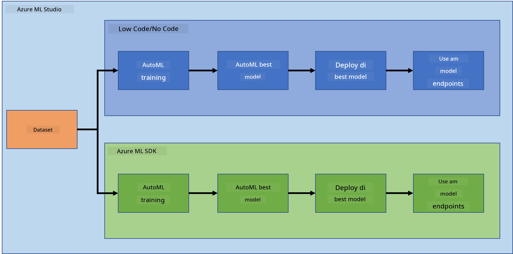

Each method get di own advantage and disadvantage. Di Low code/No code way easy to start because e dey use GUI (Graphical User Interface), and you no need sabi code before you fit use am. Dis method dey good for quick testing of di project idea and to create POC (Proof Of Concept). But as di project dey grow and you wan make am ready for production, e no go make sense to dey create resources through GUI. You go need programmatically automate everything, from di creation of resources to di deployment of di model. Na here di knowledge of how to use Azure ML SDK go dey very important.

|                   | Low code/No code | Azure ML SDK              |
|-------------------|------------------|---------------------------|
| Expertise for code | No need          | Need am                   |
| Time to develop   | Fast and easy    | Depend on code expertise |
| Production ready  | No               | Yes                       |

### 1.3 Di Heart Failure Dataset: 

Cardiovascular diseases (CVDs) na di number 1 cause of death for di world, e dey cause 31% of all deaths globally. Environmental and behavioral risk factors like tobacco use, bad diet and obesity, physical inactivity, and harmful alcohol use fit be features for estimation models. If we fit estimate di chance of CVD development, e go help prevent attacks for people wey dey high risk.

Kaggle don make [Heart Failure dataset](https://www.kaggle.com/andrewmvd/heart-failure-clinical-data) available for public use, and we go use am for dis project. You fit download di dataset now. Na tabular dataset wey get 13 columns (12 features and 1 target variable) and 299 rows.

|    | Variable name             | Type            | Description                                               | Example           |
|----|---------------------------|-----------------|-----------------------------------------------------------|-------------------|
| 1  | age                       | numerical       | age of di patient                                         | 25                |
| 2  | anaemia                   | boolean         | Reduction of red blood cells or haemoglobin               | 0 or 1            |
| 3  | creatinine_phosphokinase  | numerical       | Level of CPK enzyme for di blood                         | 542               |
| 4  | diabetes                  | boolean         | If di patient get diabetes                                | 0 or 1            |
| 5  | ejection_fraction         | numerical       | Percentage of blood wey dey leave di heart for each contraction | 45                |
| 6  | high_blood_pressure       | boolean         | If di patient get hypertension                           | 0 or 1            |
| 7  | platelets                 | numerical       | Platelets for di blood                                   | 149000            |
| 8  | serum_creatinine          | numerical       | Level of serum creatinine for di blood                   | 0.5               |
| 9  | serum_sodium              | numerical       | Level of serum sodium for di blood                       | jun               |
| 10 | sex                       | boolean         | woman or man                                             | 0 or 1            |
| 11 | smoking                   | boolean         | If di patient dey smoke                                  | 0 or 1            |
| 12 | time                      | numerical       | follow-up period (days)                                  | 4                 |
|----|---------------------------|-----------------|-----------------------------------------------------------|-------------------|
| 21 | DEATH_EVENT [Target]      | boolean         | if di patient die during di follow-up period             | 0 or 1            |

Once you don get di dataset, we fit start di project for Azure.

## 2. Low code/No code training of model for Azure ML Studio
### 2.1 Create Azure ML workspace
To train model for Azure ML, you first need to create Azure ML workspace. Di workspace na di top-level resource for Azure Machine Learning, e dey provide one place to manage all di artifacts wey you create when you dey use Azure Machine Learning. Di workspace dey keep history of all training runs, including logs, metrics, output, and snapshot of your scripts. You fit use dis information to know which training run produce di best model. [Learn more](https://docs.microsoft.com/azure/machine-learning/concept-workspace?WT.mc_id=academic-77958-bethanycheum&ocid=AID3041109)

E good make you use di latest browser wey dey compatible wit your operating system. Di browsers wey dey supported na:

- Microsoft Edge (Di new Microsoft Edge, latest version. No be di old Microsoft Edge)
- Safari (latest version, Mac only)
- Chrome (latest version)
- Firefox (latest version)

To use Azure Machine Learning, create workspace for your Azure subscription. You fit use dis workspace to manage data, compute resources, code, models, and other artifacts wey dey related to your machine learning work.

> **_NOTE:_** Your Azure subscription go dey charge small money for data storage as long as di Azure Machine Learning workspace dey your subscription, so e good make you delete di Azure Machine Learning workspace when you no dey use am again.

1. Sign into di [Azure portal](https://ms.portal.azure.com/) wit di Microsoft credentials wey dey your Azure subscription.
2. Select **＋Create a resource**
   
   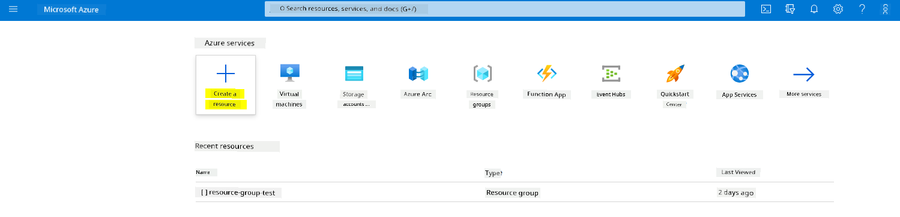

   Search for Machine Learning and select di Machine Learning tile

   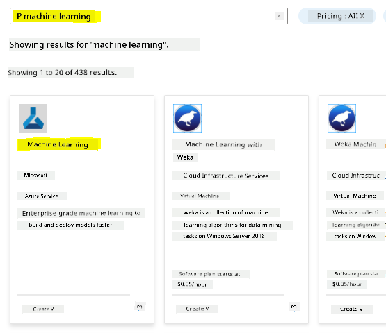

   Click di create button

   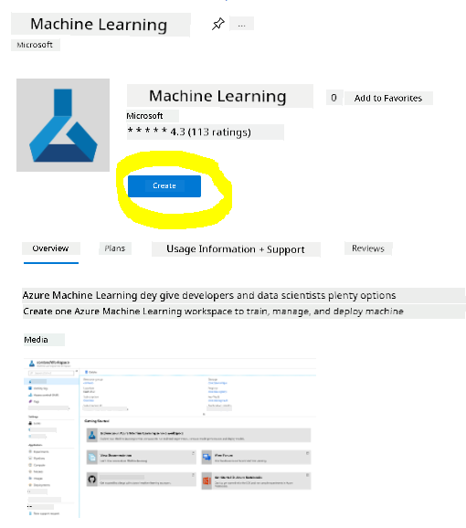

   Fill di settings like dis:
   - Subscription: Your Azure subscription
   - Resource group: Create or select resource group
   - Workspace name: Enter unique name for your workspace
   - Region: Select di geographical region wey dey near you
   - Storage account: Note di default new storage account wey dem go create for your workspace
   - Key vault: Note di default new key vault wey dem go create for your workspace
   - Application insights: Note di default new application insights resource wey dem go create for your workspace
   - Container registry: None (dem go create one automatically di first time you deploy model to container)

    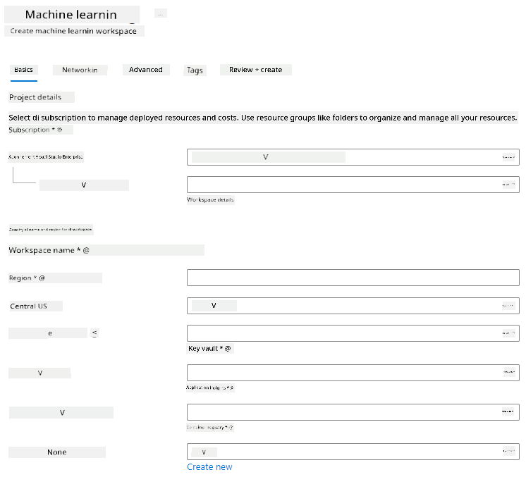

   - Click di create + review and then di create button
3. Wait make your workspace finish to create (e fit take few minutes). Then go di portal to find am. You fit find am through di Machine Learning Azure service.
4. For di Overview page for your workspace, launch Azure Machine Learning studio (or open new browser tab and go https://ml.azure.com), and sign into Azure Machine Learning studio wit your Microsoft account. If dem ask, select your Azure directory and subscription, and your Azure Machine Learning workspace.
   
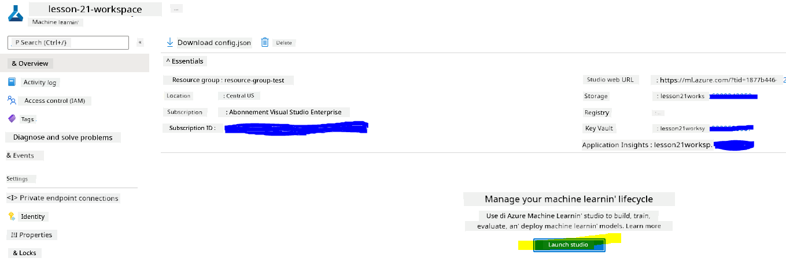

5. For Azure Machine Learning studio, toggle di ☰ icon for di top left to see di different pages for di interface. You fit use dis pages to manage di resources for your workspace.

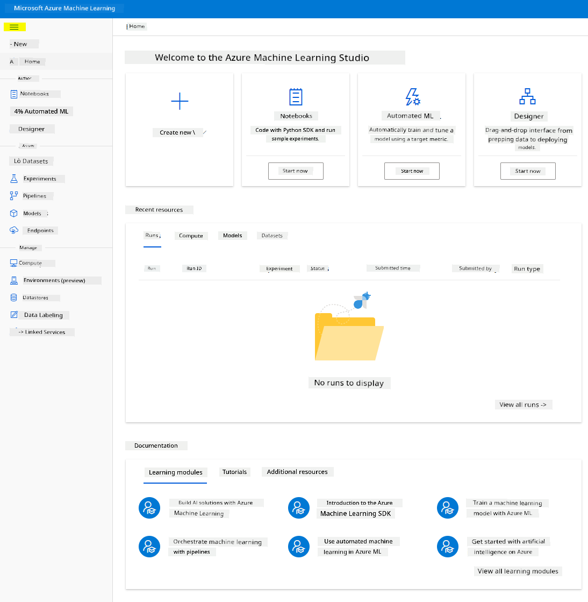

You fit manage your workspace wit di Azure portal, but for data scientists and Machine Learning operations engineers, Azure Machine Learning Studio dey provide better user interface to manage workspace resources.

### 2.2 Compute Resources

Compute Resources na cloud-based resources wey you fit use to run model training and data exploration processes. Four types of compute resource dey wey you fit create:

- **Compute Instances**: Development workstations wey data scientists fit use to work wit data and models. Dis one involve di creation of Virtual Machine (VM) and launch notebook instance. You fit train model by calling compute cluster from di notebook.
- **Compute Clusters**: Scalable clusters of VMs wey fit process experiment code on demand. You go need am when you dey train model. Compute clusters fit also use special GPU or CPU resources.
- **Inference Clusters**: Na di place wey predictive services go dey run wey go use di models wey you don train.
- **Attached Compute**: Na link to di Azure compute resources wey dey already, like Virtual Machines or Azure Databricks clusters.

#### 2.2.1 How to choose di correct options for your compute resources

Some important things dey to think about when you wan create compute resource, and di choices fit be big decision wey you go make.

**You need CPU or GPU?**

CPU (Central Processing Unit) na di electronic part wey dey run instructions wey dey inside computer program. GPU (Graphics Processing Unit) na special electronic part wey fit run graphics-related code very fast.

Di main difference between CPU and GPU na say CPU dey designed to handle plenty different tasks fast (di speed dey measured by CPU clock speed), but e no fit run many tasks at di same time. GPU dey designed for parallel computing, so e dey better for deep learning tasks.

| CPU                                     | GPU                         |
|-----------------------------------------|-----------------------------|
| E cheap pass                            | E cost pass                 |
| E no fit run many tasks at di same time | E fit run plenty tasks      |
| E slow for training deep learning models| E dey perfect for deep learning |

**Cluster Size**

Big clusters dey cost pass, but dem go make di system respond better. So, if you get time but money no plenty, start with small cluster. If you get money but time no dey, start with big cluster.

**VM Size**

Based on di time and money wey you get, you fit change di size of RAM, disk, number of cores, and clock speed. If you increase all di parameters, e go cost more, but e go make di performance better.

**Dedicated or Low-Priority Instances?**

Low-priority instance mean say e fit stop anytime: Microsoft Azure fit use di resources for another task, so e fit interrupt di job. Dedicated instance mean say di job no go stop unless you talk am. Dis one na another matter of time vs money, because low-priority instances dey cheaper pass dedicated ones.

#### 2.2.2 How to create compute cluster

For di [Azure ML workspace](https://ml.azure.com/) wey we don create before, go compute and you go see di different compute resources wey we don talk about (like compute instances, compute clusters, inference clusters, and attached compute). For dis project, we go need compute cluster to train di model. For di Studio, click di "Compute" menu, then di "Compute cluster" tab, and click di "+ New" button to create compute cluster.

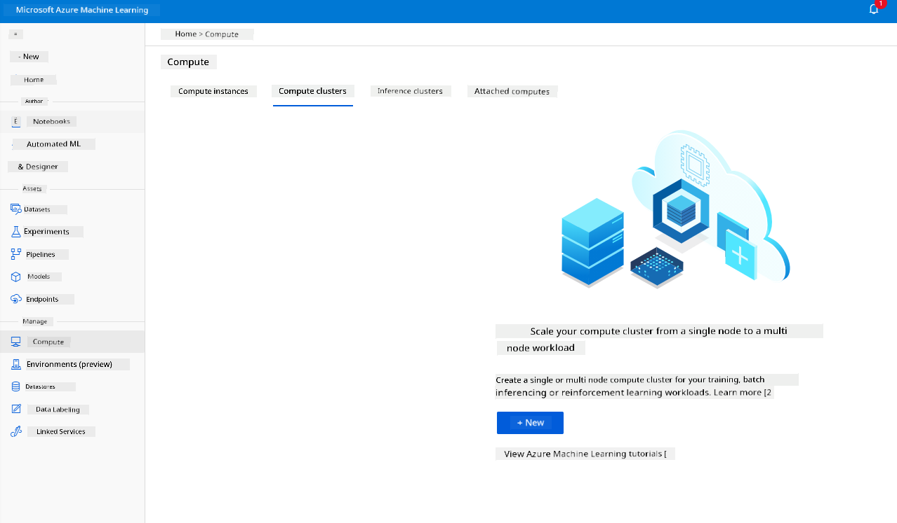

1. Choose your options: Dedicated vs Low priority, CPU or GPU, VM size and core number (you fit leave di default settings for dis project).
2. Click di Next button.

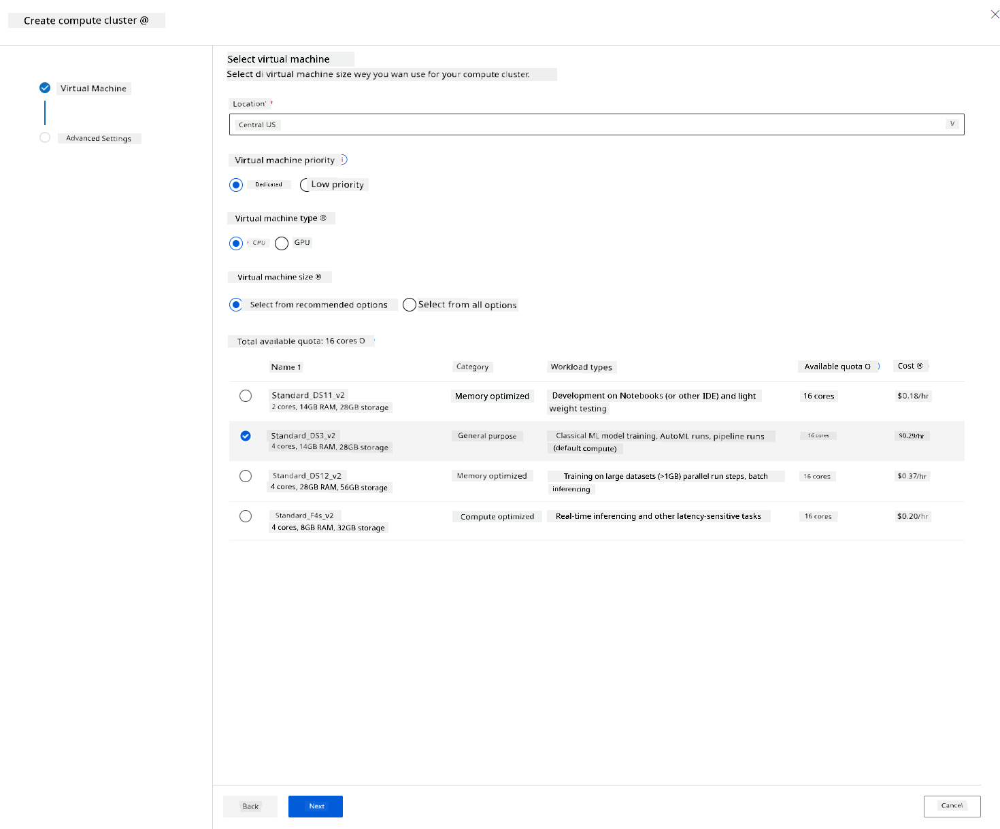

3. Give di cluster one compute name.
4. Choose your options: Minimum/Maximum number of nodes, Idle seconds before scale down, SSH access. If di minimum number of nodes na 0, you go save money when di cluster dey idle. Di higher di maximum number of nodes, di faster di training go be. Di maximum number of nodes wey dem recommend na 3.  
5. Click di "Create" button. Dis step fit take small time.

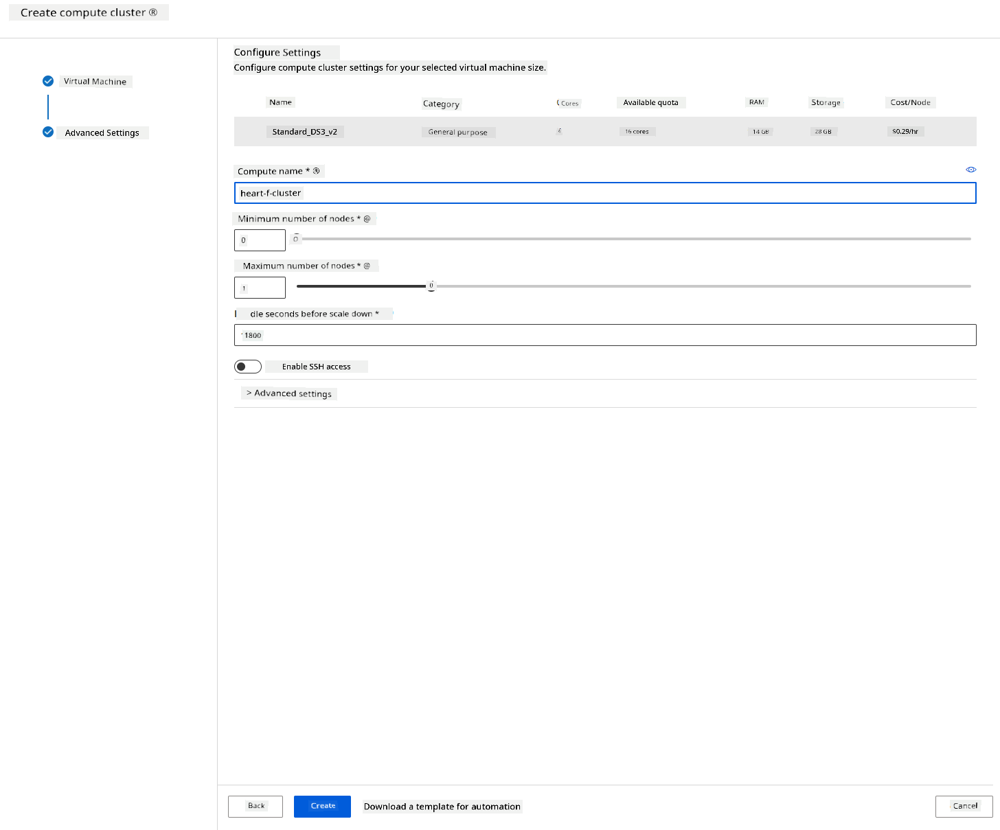

Nice one! Now we don get Compute cluster, we need to load di data go Azure ML Studio.

### 2.3 How to load di Dataset

1. For di [Azure ML workspace](https://ml.azure.com/) wey we don create before, click "Datasets" for di left menu and click di "+ Create dataset" button to create dataset. Choose di "From local files" option and select di Kaggle dataset wey we don download before.
   
   

2. Give your dataset name, type, and description. Click Next. Upload di data from files. Click Next.
   
   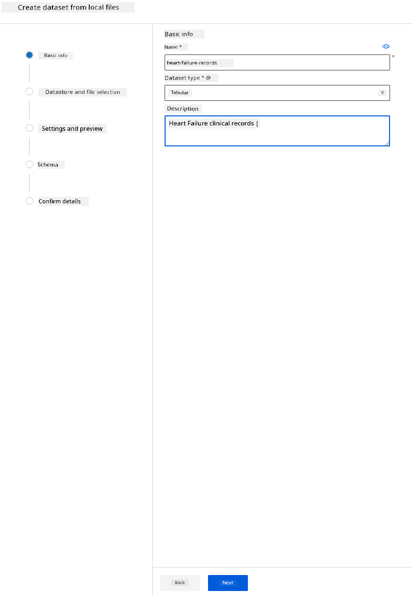

3. For di Schema, change di data type to Boolean for di following features: anaemia, diabetes, high blood pressure, sex, smoking, and DEATH_EVENT. Click Next and Click Create.
   
   

Good job! Now di dataset dey ready and di compute cluster don dey set, we fit start to train di model!

### 2.4 Low code/No Code training with AutoML 

Di normal way to develop machine learning model dey take plenty resources, need big domain knowledge, and dey take time to produce and compare plenty models. 
Automated machine learning (AutoML) na di process wey dey automate di time-consuming, repetitive tasks of machine learning model development. E dey help data scientists, analysts, and developers build ML models wey dey efficient and productive, while still keeping di model quality. E dey reduce di time wey e go take to get ML models wey ready for production, and e dey easy to use. [Learn more](https://docs.microsoft.com/azure/machine-learning/concept-automated-ml?WT.mc_id=academic-77958-bethanycheum&ocid=AID3041109)

1. For di [Azure ML workspace](https://ml.azure.com/) wey we don create before, click "Automated ML" for di left menu and select di dataset wey you just upload. Click Next.

   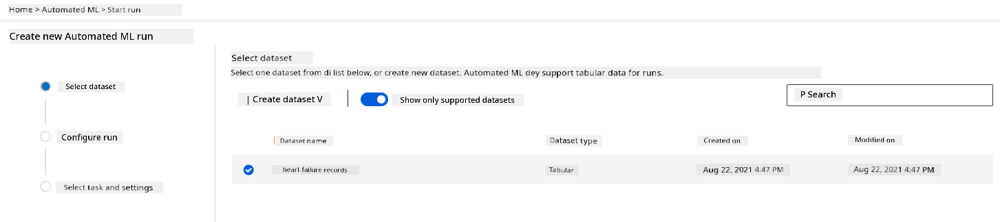

2. Enter new experiment name, di target column (DEATH_EVENT), and di compute cluster wey we don create. Click Next.
   
   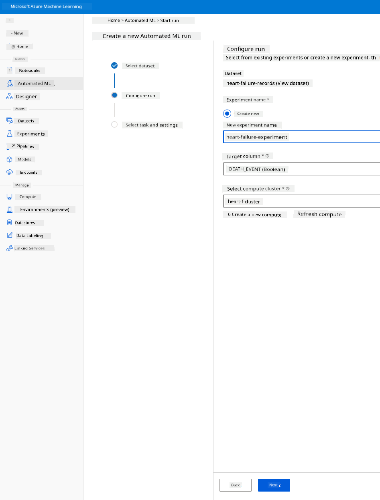

3. Choose "Classification" and Click Finish. Dis step fit take between 30 minutes to 1 hour, based on di size of your compute cluster.
    
    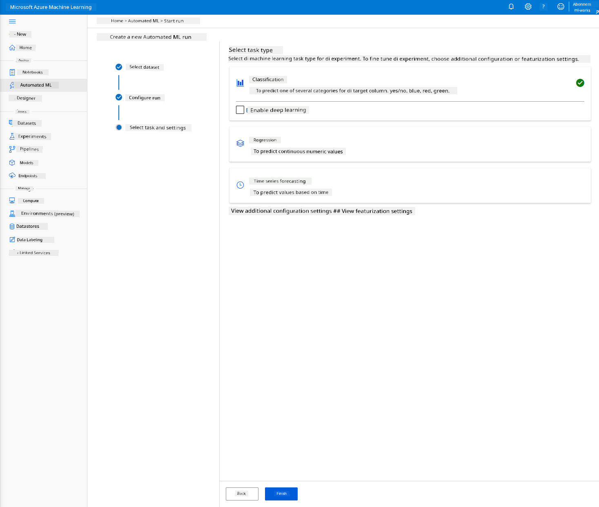

4. When di run don complete, click di "Automated ML" tab, click di run, and click di Algorithm for di "Best model summary" card.
    
    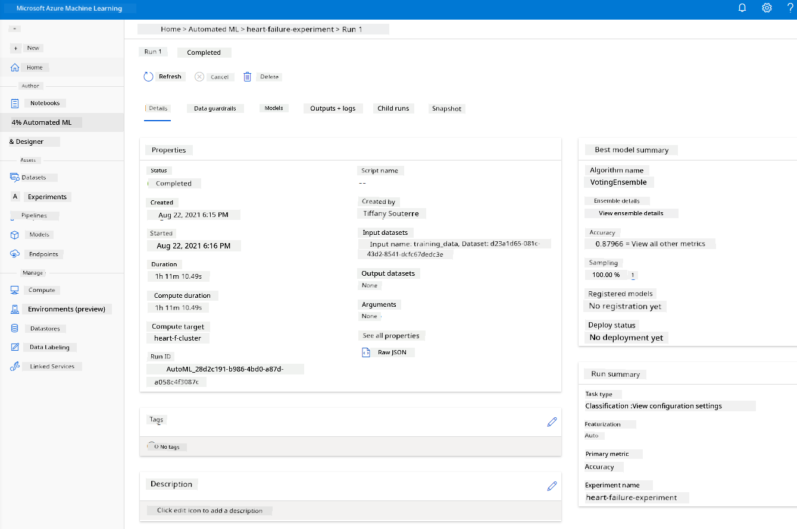

Here you go see detailed description of di best model wey AutoML generate. You fit also check di other models wey dey di Models tab. Take small time to explore di models for di Explanations (preview button). Once you don choose di model wey you wan use (for here we go choose di best model wey AutoML select), we go see how we fit deploy am.

## 3. Low code/No Code model deployment and endpoint consumption
### 3.1 Model deployment

Di automated machine learning interface dey allow you deploy di best model as web service in few steps. Deployment na di process wey go make di model fit dey use to make predictions based on new data and identify areas wey fit get opportunity. For dis project, deployment to web service mean say medical applications go fit use di model to make live predictions of di risk wey patients get to get heart attack.

For di best model description, click di "Deploy" button.
    
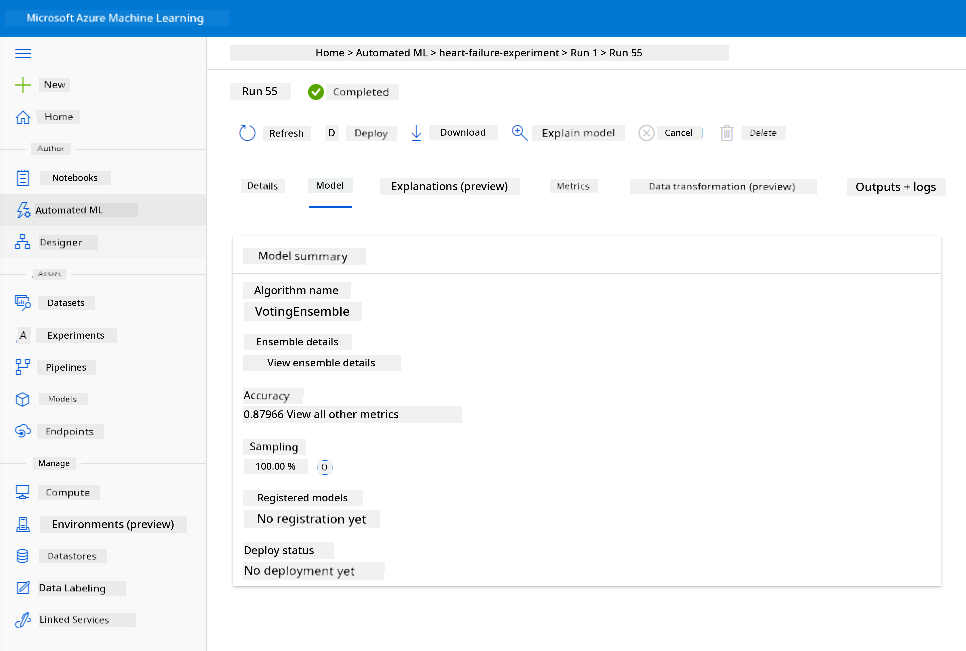

15. Give am name, description, compute type (Azure Container Instance), enable authentication, and click Deploy. Dis step fit take about 20 minutes to complete. Di deployment process get plenty steps like registering di model, generating resources, and configuring dem for di web service. Status message go show under Deploy status. Select Refresh from time to time to check di deployment status. E don deploy and dey run when di status na "Healthy".

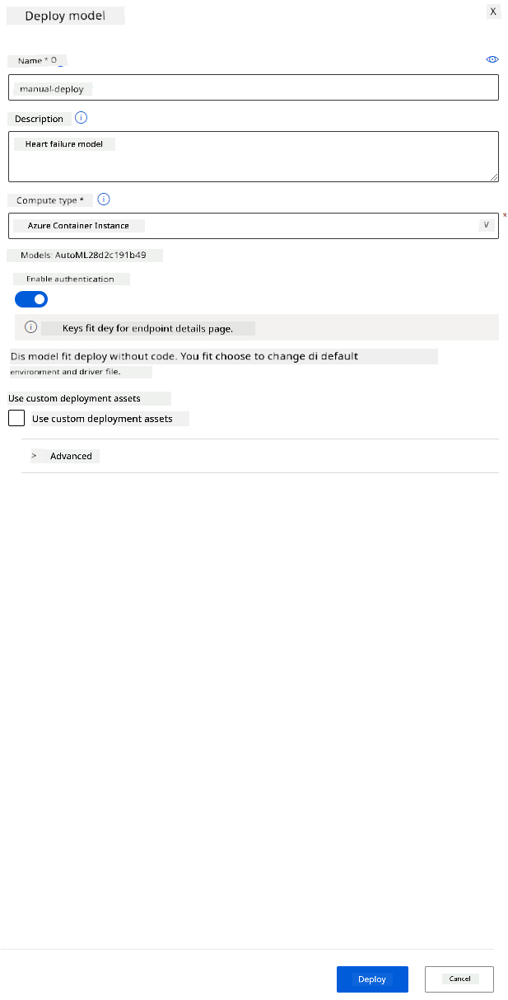

16. When e don deploy, click di Endpoint tab and click di endpoint wey you just deploy. You go see all di details wey you need to know about di endpoint.

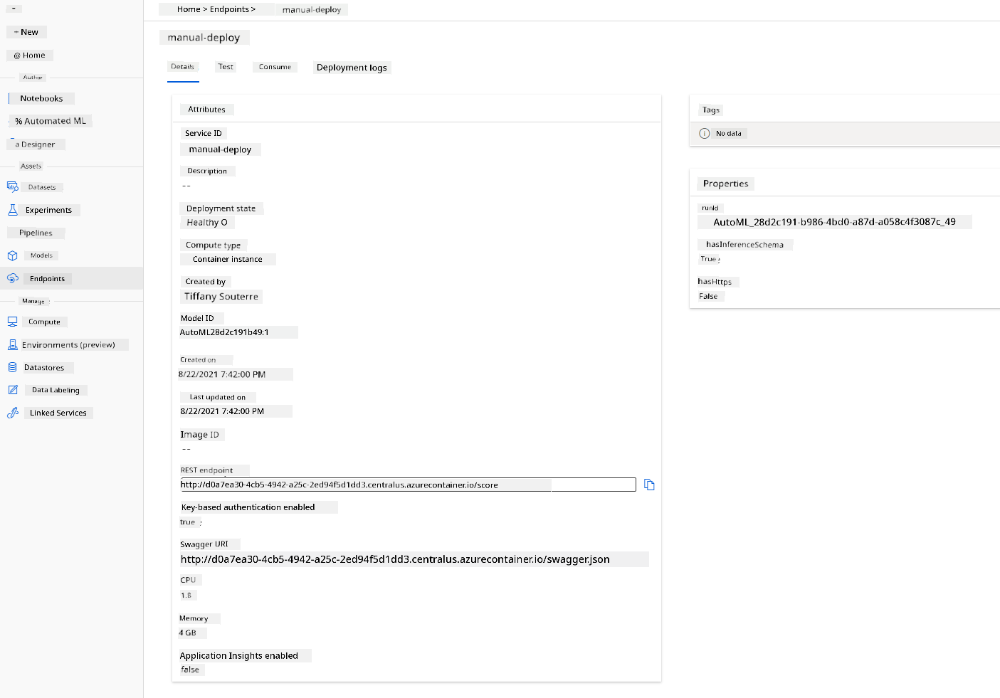

Nice one! Now we don deploy di model, we fit start to use di endpoint.

### 3.2 How to use di Endpoint

Click di "Consume" tab. Here you go see di REST endpoint and python script for di consumption option. Take small time to read di python code.

Dis script fit run directly from your local machine and e go use di endpoint.

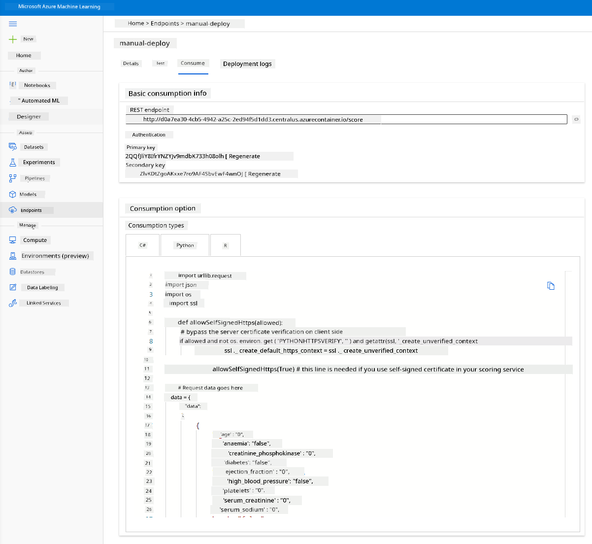

Check dis 2 lines of code:

```python
url = 'http://98e3715f-xxxx-xxxx-xxxx-9ec22d57b796.centralus.azurecontainer.io/score'
api_key = '' # Replace this with the API key for the web service
```
Di `url` variable na di REST endpoint wey dey di consume tab and di `api_key` variable na di primary key wey dey di consume tab (if you enable authentication). Na so di script fit use di endpoint.

18. When you run di script, you go see dis output:
    ```python
    b'"{\\"result\\": [true]}"'
    ```
E mean say di prediction of heart failure for di data wey dem give na true. E make sense because if you check di data wey di script generate automatically, everything dey 0 and false by default. You fit change di data with dis input sample:

```python
data = {
    "data":
    [
        {
            'age': "0",
            'anaemia': "false",
            'creatinine_phosphokinase': "0",
            'diabetes': "false",
            'ejection_fraction': "0",
            'high_blood_pressure': "false",
            'platelets': "0",
            'serum_creatinine': "0",
            'serum_sodium': "0",
            'sex': "false",
            'smoking': "false",
            'time': "0",
        },
        {
            'age': "60",
            'anaemia': "false",
            'creatinine_phosphokinase': "500",
            'diabetes': "false",
            'ejection_fraction': "38",
            'high_blood_pressure': "false",
            'platelets': "260000",
            'serum_creatinine': "1.40",
            'serum_sodium': "137",
            'sex': "false",
            'smoking': "false",
            'time': "130",
        },
    ],
}
```
Di script go return:
    ```python
    b'"{\\"result\\": [true, false]}"'
    ```

Congrats! You don use di model wey you deploy and train am for Azure ML!

> **_NOTE:_** When you don finish di project, no forget to delete all di resources.
## 🚀 Challenge

Look well at di model explanations and details wey AutoML generate for di top models. Try understand why di best model dey better pass di other ones. Which algorithms dem compare? Wetin be di difference between dem? Why di best one dey perform better for dis case?

## [Post-lecture quiz](https://ff-quizzes.netlify.app/en/ds/quiz/35)

## Review & Self Study

For dis lesson, you don learn how to train, deploy, and use model to predict heart failure risk in Low code/No code way for di cloud. If you never do am, check di model explanations wey AutoML generate for di top models and try understand why di best model dey better pass di others.

You fit learn more about Low code/No code AutoML by reading dis [documentation](https://docs.microsoft.com/azure/machine-learning/tutorial-first-experiment-automated-ml?WT.mc_id=academic-77958-bethanycheum&ocid=AID3041109).

## Assignment

[Low code/No code Data Science project on Azure ML](assignment.md)

---

<!-- CO-OP TRANSLATOR DISCLAIMER START -->
**Disclaimer**:  
Dis docu don dey translate wit AI translation service [Co-op Translator](https://github.com/Azure/co-op-translator). Even though we dey try make am accurate, abeg sabi say automated translation fit get mistake or no correct well. Di original docu for di native language na im you go take as di main correct one. For important information, e better make professional human translator check am. We no go fit take blame for any misunderstanding or wrong interpretation wey fit happen because you use dis translation.
<!-- CO-OP TRANSLATOR DISCLAIMER END -->