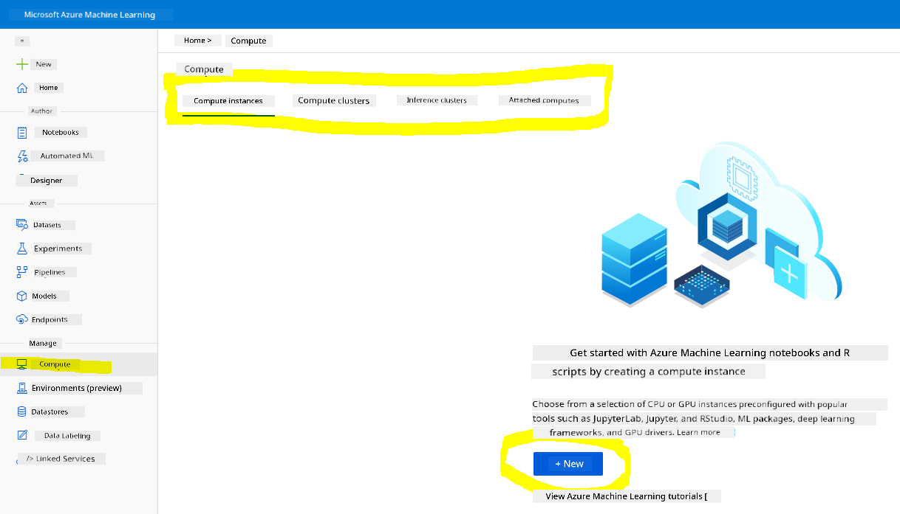
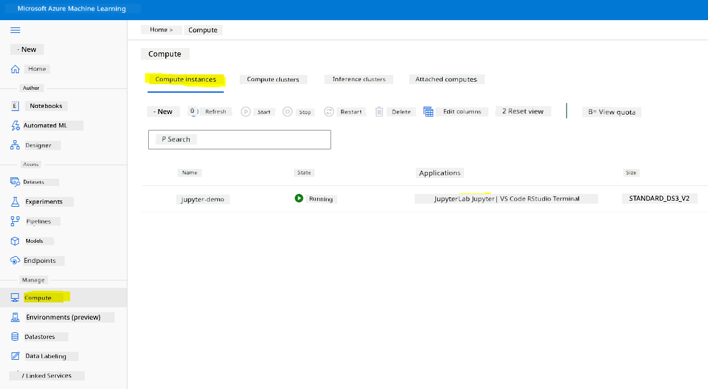
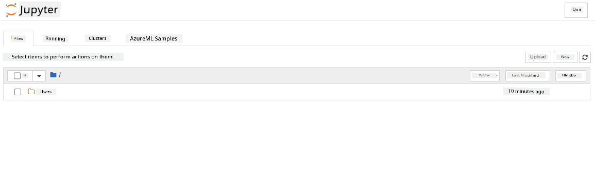

<!--
CO_OP_TRANSLATOR_METADATA:
{
  "original_hash": "472d3fab1c5be50f387336e7a686dbe1",
  "translation_date": "2025-11-18T18:27:57+00:00",
  "source_file": "5-Data-Science-In-Cloud/19-Azure/README.md",
  "language_code": "pcm"
}
-->
# Data Science for Cloud: Di "Azure ML SDK" Way

| ](../../sketchnotes/19-DataScience-Cloud.png)|
|:---:|
| Data Science for Cloud: Azure ML SDK - _Sketchnote by [@nitya](https://twitter.com/nitya)_ |

Table of contents:

- [Data Science for Cloud: Di "Azure ML SDK" Way](../../../../5-Data-Science-In-Cloud/19-Azure)
  - [Pre-Lecture Quiz](../../../../5-Data-Science-In-Cloud/19-Azure)
  - [1. Introduction](../../../../5-Data-Science-In-Cloud/19-Azure)
    - [1.1 Wetin be Azure ML SDK?](../../../../5-Data-Science-In-Cloud/19-Azure)
    - [1.2 Heart failure prediction project and dataset introduction](../../../../5-Data-Science-In-Cloud/19-Azure)
  - [2. How to train model wit Azure ML SDK](../../../../5-Data-Science-In-Cloud/19-Azure)
    - [2.1 Create Azure ML workspace](../../../../5-Data-Science-In-Cloud/19-Azure)
    - [2.2 Create compute instance](../../../../5-Data-Science-In-Cloud/19-Azure)
    - [2.3 Load di Dataset](../../../../5-Data-Science-In-Cloud/19-Azure)
    - [2.4 Create Notebooks](../../../../5-Data-Science-In-Cloud/19-Azure)
    - [2.5 Train model](../../../../5-Data-Science-In-Cloud/19-Azure)
      - [2.5.1 Setup Workspace, experiment, compute cluster and dataset](../../../../5-Data-Science-In-Cloud/19-Azure)
      - [2.5.2 AutoML Configuration and training](../../../../5-Data-Science-In-Cloud/19-Azure)
  - [3. Model deployment and endpoint consumption wit Azure ML SDK](../../../../5-Data-Science-In-Cloud/19-Azure)
    - [3.1 Save di best model](../../../../5-Data-Science-In-Cloud/19-Azure)
    - [3.2 Model Deployment](../../../../5-Data-Science-In-Cloud/19-Azure)
    - [3.3 Endpoint consumption](../../../../5-Data-Science-In-Cloud/19-Azure)
  - [🚀 Challenge](../../../../5-Data-Science-In-Cloud/19-Azure)
  - [Post-lecture quiz](../../../../5-Data-Science-In-Cloud/19-Azure)
  - [Review & Self Study](../../../../5-Data-Science-In-Cloud/19-Azure)
  - [Assignment](../../../../5-Data-Science-In-Cloud/19-Azure)

## [Pre-Lecture Quiz](https://ff-quizzes.netlify.app/en/ds/quiz/36)

## 1. Introduction

### 1.1 Wetin be Azure ML SDK?

Data scientists and AI developers dey use Azure Machine Learning SDK to build and run machine learning workflows wit di Azure Machine Learning service. You fit use am for any Python environment, like Jupyter Notebooks, Visual Studio Code, or any Python IDE wey you like.

Di main tins wey di SDK dey do include:

- Explore, prepare and manage di lifecycle of your datasets wey you go use for machine learning experiments.
- Manage cloud resources for monitoring, logging, and organizing your machine learning experiments.
- Train models either for your local machine or use cloud resources, including GPU-accelerated model training.
- Use automated machine learning, wey go take configuration parameters and training data, then automatically test different algorithms and hyperparameter settings to find di best model for predictions.
- Deploy web services to turn your trained models into RESTful services wey any application fit use.

[Learn more about di Azure Machine Learning SDK](https://docs.microsoft.com/python/api/overview/azure/ml?WT.mc_id=academic-77958-bethanycheum&ocid=AID3041109)

For di [previous lesson](../18-Low-Code/README.md), we see how to train, deploy and use model in Low code/No code way. We use di Heart Failure dataset to create Heart failure prediction model. For dis lesson, we go do di same thing but dis time we go use Azure Machine Learning SDK.


### 1.2 Heart failure prediction project and dataset introduction

Check [here](../18-Low-Code/README.md) for di Heart failure prediction project and dataset introduction.

## 2. How to train model wit Azure ML SDK
### 2.1 Create Azure ML workspace

To make am simple, we go work for jupyter notebook. Dis mean say you don already get Workspace and compute instance. If you don already get Workspace, you fit jump go section 2.3 Notebook creation.

If you never get, abeg follow di instructions for section **2.1 Create an Azure ML workspace** for di [previous lesson](../18-Low-Code/README.md) to create workspace.

### 2.2 Create compute instance

For di [Azure ML workspace](https://ml.azure.com/) wey we create before, go di compute menu and you go see di different compute resources wey dey available.



Make we create compute instance to set up jupyter notebook. 
1. Click di + New button. 
2. Give name to your compute instance.
3. Choose your options: CPU or GPU, VM size and core number.
4. Click di Create button.

Congrats, you don create compute instance! We go use dis compute instance to create Notebook for di [Creating Notebooks section](../../../../5-Data-Science-In-Cloud/19-Azure).

### 2.3 Load di Dataset
If you never upload di dataset, check di [previous lesson](../18-Low-Code/README.md) for section **2.3 Loading the Dataset**.

### 2.4 Create Notebooks

> **_NOTE:_** For di next step, you fit either create new notebook from scratch, or upload di [notebook wey we create](notebook.ipynb) for your Azure ML Studio. To upload am, just click di "Notebook" menu and upload di notebook.

Notebook na very important part of di data science process. You fit use am do Exploratory Data Analysis (EDA), call compute cluster to train model, or call inference cluster to deploy endpoint. 

To create Notebook, we need compute node wey go serve di jupyter notebook instance. Go back to di [Azure ML workspace](https://ml.azure.com/) and click Compute instances. For di list of compute instances, you go see di [compute instance wey we create before](../../../../5-Data-Science-In-Cloud/19-Azure). 

1. For di Applications section, click di Jupyter option. 
2. Tick di "Yes, I understand" box and click di Continue button.

3. Dis go open new browser tab wit your jupyter notebook instance. Click di "New" button to create notebook.



Now we don get Notebook, we fit start to train di model wit Azure ML SDK.

### 2.5 Train model

First, if you get any doubt, check di [Azure ML SDK documentation](https://docs.microsoft.com/python/api/overview/azure/ml?WT.mc_id=academic-77958-bethanycheum&ocid=AID3041109). E get all di information wey you need to understand di modules wey we go use for dis lesson.

#### 2.5.1 Setup Workspace, experiment, compute cluster and dataset

You need to load di `workspace` from di configuration file wit dis code:

```python
from azureml.core import Workspace
ws = Workspace.from_config()
```

Dis go return object of type `Workspace` wey represent di workspace. Then you go create `experiment` wit dis code:

```python
from azureml.core import Experiment
experiment_name = 'aml-experiment'
experiment = Experiment(ws, experiment_name)
```
To get or create experiment from workspace, you go request di experiment wit di experiment name. Experiment name must be 3-36 characters, start wit letter or number, and fit only contain letters, numbers, underscores, and dashes. If di experiment no dey for di workspace, new experiment go dey created.

Now you need to create compute cluster for di training wit dis code. Note say dis step fit take few minutes. 

```python
from azureml.core.compute import AmlCompute

aml_name = "heart-f-cluster"
try:
    aml_compute = AmlCompute(ws, aml_name)
    print('Found existing AML compute context.')
except:
    print('Creating new AML compute context.')
    aml_config = AmlCompute.provisioning_configuration(vm_size = "Standard_D2_v2", min_nodes=1, max_nodes=3)
    aml_compute = AmlCompute.create(ws, name = aml_name, provisioning_configuration = aml_config)
    aml_compute.wait_for_completion(show_output = True)

cts = ws.compute_targets
compute_target = cts[aml_name]
```

You fit get di dataset from di workspace wit di dataset name like dis:

```python
dataset = ws.datasets['heart-failure-records']
df = dataset.to_pandas_dataframe()
df.describe()
```
#### 2.5.2 AutoML Configuration and training

To set di AutoML configuration, use di [AutoMLConfig class](https://docs.microsoft.com/python/api/azureml-train-automl-client/azureml.train.automl.automlconfig(class)?WT.mc_id=academic-77958-bethanycheum&ocid=AID3041109).

As dem describe for di doc, e get plenty parameters wey you fit play wit. For dis project, we go use di following parameters:

- `experiment_timeout_minutes`: Di maximum time (for minutes) wey di experiment fit run before e go stop automatically and results go dey available.
- `max_concurrent_iterations`: Di maximum number of concurrent training iterations wey di experiment fit allow.
- `primary_metric`: Di main metric wey dem go use to check di experiment status.
- `compute_target`: Di Azure Machine Learning compute target to run di Automated Machine Learning experiment.
- `task`: Di type of task to run. E fit be 'classification', 'regression', or 'forecasting' depending on di type of automated ML problem wey you wan solve.
- `training_data`: Di training data wey di experiment go use. E suppose get both training features and label column (fit also get sample weights column).
- `label_column_name`: Di name of di label column.
- `path`: Di full path to di Azure Machine Learning project folder.
- `enable_early_stopping`: Whether to stop early if di score no dey improve for short term.
- `featurization`: Whether make di featurization step dey automatic or customized.
- `debug_log`: Di log file to write debug information.

```python
from azureml.train.automl import AutoMLConfig

project_folder = './aml-project'

automl_settings = {
    "experiment_timeout_minutes": 20,
    "max_concurrent_iterations": 3,
    "primary_metric" : 'AUC_weighted'
}

automl_config = AutoMLConfig(compute_target=compute_target,
                             task = "classification",
                             training_data=dataset,
                             label_column_name="DEATH_EVENT",
                             path = project_folder,  
                             enable_early_stopping= True,
                             featurization= 'auto',
                             debug_log = "automl_errors.log",
                             **automl_settings
                            )
```
Now wey you don set your configuration, you fit train di model wit dis code. Dis step fit take up to one hour depending on your cluster size.

```python
remote_run = experiment.submit(automl_config)
```
You fit run di RunDetails widget to show di different experiments.
```python
from azureml.widgets import RunDetails
RunDetails(remote_run).show()
```
## 3. Model deployment and endpoint consumption wit Azure ML SDK

### 3.1 Save di best model

Di `remote_run` na object of type [AutoMLRun](https://docs.microsoft.com/python/api/azureml-train-automl-client/azureml.train.automl.run.automlrun?WT.mc_id=academic-77958-bethanycheum&ocid=AID3041109). Dis object get method `get_output()` wey dey return di best run and di fitted model wey follow am.

```python
best_run, fitted_model = remote_run.get_output()
```
You fit see di parameters wey dem use for di best model by just printing di fitted_model and see di properties of di best model by using di [get_properties()](https://docs.microsoft.com/python/api/azureml-core/azureml.core.run(class)?view=azure-ml-py#azureml_core_Run_get_properties?WT.mc_id=academic-77958-bethanycheum&ocid=AID3041109) method.

```python
best_run.get_properties()
```

Now register di model wit di [register_model](https://docs.microsoft.com/python/api/azureml-train-automl-client/azureml.train.automl.run.automlrun?view=azure-ml-py#register-model-model-name-none--description-none--tags-none--iteration-none--metric-none-?WT.mc_id=academic-77958-bethanycheum&ocid=AID3041109) method.
```python
model_name = best_run.properties['model_name']
script_file_name = 'inference/score.py'
best_run.download_file('outputs/scoring_file_v_1_0_0.py', 'inference/score.py')
description = "aml heart failure project sdk"
model = best_run.register_model(model_name = model_name,
                                model_path = './outputs/',
                                description = description,
                                tags = None)
```
### 3.2 Model Deployment

Once you don save di best model, we fit deploy am wit di [InferenceConfig](https://docs.microsoft.com/python/api/azureml-core/azureml.core.model.inferenceconfig?view=azure-ml-py?ocid=AID3041109) class. InferenceConfig dey represent di configuration settings for custom environment wey dem go use for deployment. Di [AciWebservice](https://docs.microsoft.com/python/api/azureml-core/azureml.core.webservice.aciwebservice?view=azure-ml-py) class dey represent machine learning model wey dem deploy as web service endpoint for Azure Container Instances. Di deployed service go be load-balanced, HTTP endpoint wit REST API. You fit send data to dis API and get di prediction wey di model return.

Di model dey deploy wit di [deploy](https://docs.microsoft.com/python/api/azureml-core/azureml.core.model(class)?view=azure-ml-py#deploy-workspace--name--models--inference-config-none--deployment-config-none--deployment-target-none--overwrite-false--show-output-false-?WT.mc_id=academic-77958-bethanycheum&ocid=AID3041109) method.

```python
from azureml.core.model import InferenceConfig, Model
from azureml.core.webservice import AciWebservice

inference_config = InferenceConfig(entry_script=script_file_name, environment=best_run.get_environment())

aciconfig = AciWebservice.deploy_configuration(cpu_cores = 1,
                                               memory_gb = 1,
                                               tags = {'type': "automl-heart-failure-prediction"},
                                               description = 'Sample service for AutoML Heart Failure Prediction')

aci_service_name = 'automl-hf-sdk'
aci_service = Model.deploy(ws, aci_service_name, [model], inference_config, aciconfig)
aci_service.wait_for_deployment(True)
print(aci_service.state)
```
Dis step fit take few minutes.

### 3.3 Endpoint consumption

You fit use your endpoint by creating sample input:
```python
data = {
    "data":
    [
        {
            'age': "60",
            'anaemia': "false",
            'creatinine_phosphokinase': "500",
            'diabetes': "false",
            'ejection_fraction': "38",
            'high_blood_pressure': "false",
            'platelets': "260000",
            'serum_creatinine': "1.40",
            'serum_sodium': "137",
            'sex': "false",
            'smoking': "false",
            'time': "130",
        },
    ],
}

test_sample = str.encode(json.dumps(data))
```
And den you fit send dis input go ya model make e predict:

```python
response = aci_service.run(input_data=test_sample)
response
```
Dis one go show `'{"result": [false]}'`. Dis mean say di patient input wey we send go di endpoint generate di prediction `false`, wey mean say dis person no likely get heart attack.

Congrats! You don use di model wey dem deploy and train for Azure ML wit di Azure ML SDK!

> **_NOTE:_** When you don finish di project, no forget to delete all di resources.

## 🚀 Challenge

Plenty other things dey wey you fit do wit di SDK, but sadly, we no fit cover all for dis lesson. But beta news be say, if you sabi how to check di SDK documentation well, e go help you plenty. Go look di Azure ML SDK documentation and find di `Pipeline` class wey go allow you create pipelines. Pipeline na collection of steps wey fit run as workflow.

**HINT:** Go di [SDK documentation](https://docs.microsoft.com/python/api/overview/azure/ml/?view=azure-ml-py?WT.mc_id=academic-77958-bethanycheum&ocid=AID3041109) and type keywords for di search bar like "Pipeline". You suppose see di `azureml.pipeline.core.Pipeline` class for di search results.

## [Post-lecture quiz](https://ff-quizzes.netlify.app/en/ds/quiz/37)

## Review & Self Study

For dis lesson, you don learn how to train, deploy and use model to predict heart failure risk wit di Azure ML SDK for di cloud. Check dis [documentation](https://docs.microsoft.com/python/api/overview/azure/ml/?view=azure-ml-py?WT.mc_id=academic-77958-bethanycheum&ocid=AID3041109) for more information about di Azure ML SDK. Try create ya own model wit di Azure ML SDK.

## Assignment

[Data Science project using Azure ML SDK](assignment.md)

---

<!-- CO-OP TRANSLATOR DISCLAIMER START -->
**Disclaimer**:  
Dis document don use AI translation service [Co-op Translator](https://github.com/Azure/co-op-translator) take translate am. Even though we dey try make e accurate, abeg sabi say automated translations fit get mistake or no correct well. Di original document for di native language na di main correct source. For important information, e good make una use professional human translation. We no go fit take blame for any misunderstanding or wrong interpretation wey fit happen because of dis translation.
<!-- CO-OP TRANSLATOR DISCLAIMER END -->