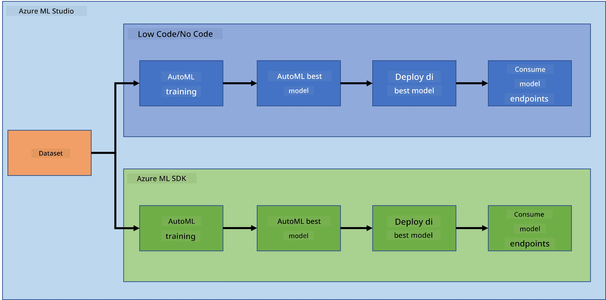

<!--
CO_OP_TRANSLATOR_METADATA:
{
  "original_hash": "8dfe141a0f46f7d253e07f74913c7f44",
  "translation_date": "2025-11-18T18:24:52+00:00",
  "source_file": "5-Data-Science-In-Cloud/README.md",
  "language_code": "pcm"
}
-->
# Data Science for Cloud

> Foto by [Jelleke Vanooteghem](https://unsplash.com/@ilumire) from [Unsplash](https://unsplash.com/s/photos/cloud?orientation=landscape)

Wen e reach to do data science wit big data, cloud fit change di game. For di next three lessons, we go see wetin cloud be and why e fit dey very helpful. We go still check one heart failure dataset and build one model wey go help us know di chance wey person fit get heart failure. We go use di power of cloud to train, deploy, and use di model for two different ways. One way na to use only di user interface for Low code/No code style, di other way na to use di Azure Machine Learning Software Developer Kit (Azure ML SDK).

### Topics

1. [Why use Cloud for Data Science?](17-Introduction/README.md)  
2. [Data Science for Cloud: Di "Low code/No code" way](18-Low-Code/README.md)  
3. [Data Science for Cloud: Di "Azure ML SDK" way](19-Azure/README.md)  

### Credits  
Dis lessons na dem write am wit ☁️ and 💕 by [Maud Levy](https://twitter.com/maudstweets) and [Tiffany Souterre](https://twitter.com/TiffanySouterre)  

Data for di Heart Failure Prediction project na from [
Larxel](https://www.kaggle.com/andrewmvd) for [Kaggle](https://www.kaggle.com/andrewmvd/heart-failure-clinical-data). E dey under di [Attribution 4.0 International (CC BY 4.0)](https://creativecommons.org/licenses/by/4.0/) license.

---

<!-- CO-OP TRANSLATOR DISCLAIMER START -->
**Disclaimer**:  
Dis docu wey you dey see don use AI translation service [Co-op Translator](https://github.com/Azure/co-op-translator) take translate am. Even though we dey try make sure say e correct, abeg no forget say machine translation fit get mistake or no too accurate. Di original docu for di language wey dem first write am na di main correct one. If na important matter, e go better make you use professional human translation. We no go fit take blame for any misunderstanding or wrong interpretation wey fit happen because you use dis translation.
<!-- CO-OP TRANSLATOR DISCLAIMER END -->