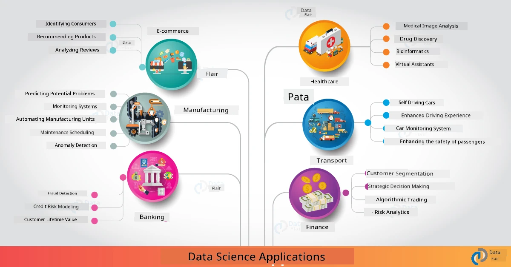

<!--
CO_OP_TRANSLATOR_METADATA:
{
  "original_hash": "0f67a4139454816631526779a456b734",
  "translation_date": "2025-11-18T18:38:10+00:00",
  "source_file": "6-Data-Science-In-Wild/20-Real-World-Examples/README.md",
  "language_code": "pcm"
}
-->
# Data Science for Real World

|  ](../../sketchnotes/20-DataScience-RealWorld.png) |
| :--------------------------------------------------------------------------------------------------------------: |
|               Data Science for Real World - _Sketchnote by [@nitya](https://twitter.com/nitya)_               |

We don dey near di end of dis learning journey!

We start wit di meaning of data science and ethics, check different tools & techniques for data analysis and visualization, review di data science lifecycle, and look how to scale and automate data science workflows wit cloud computing services. So, you fit dey wonder: _"How I go fit use all dis things wey I don learn for real-world situations?"_

For dis lesson, we go check how data science dey work for real-world industry and we go dive into examples for research, digital humanities, and sustainability. We go also look student project opportunities and end wit resources wey go help you continue your learning journey!

## Pre-Lecture Quiz

## [Pre-lecture quiz](https://ff-quizzes.netlify.app/en/ds/quiz/38)

## Data Science + Industry

Because AI don dey more accessible, developers don dey find am easy to design and add AI-driven decision-making and data-driven insights into user experiences and development workflows. Here be some examples of how data science dey "work" for real-world industry:

 * [Google Flu Trends](https://www.wired.com/2015/10/can-learn-epic-failure-google-flu-trends/) use data science to connect search terms wit flu trends. Even though di method get wahala, e show di possibilities (and challenges) of data-driven healthcare predictions.

 * [UPS Routing Predictions](https://www.technologyreview.com/2018/11/21/139000/how-ups-uses-ai-to-outsmart-bad-weather/) - explain how UPS dey use data science and machine learning to predict di best routes for delivery, dey consider weather conditions, traffic patterns, delivery deadlines and more.

 * [NYC Taxicab Route Visualization](http://chriswhong.github.io/nyctaxi/) - data wey dem gather using [Freedom Of Information Laws](https://chriswhong.com/open-data/foil_nyc_taxi/) help show how NYC cabs dey move around di city, di money dem dey make, and di time trips dey take for each 24-hour period.

 * [Uber Data Science Workbench](https://eng.uber.com/dsw/) - dey use data (like pickup & dropoff locations, trip duration, preferred routes etc.) wey dem gather from millions of Uber trips *everyday* to build data analytics tool wey dey help wit pricing, safety, fraud detection and navigation decisions.

 * [Sports Analytics](https://towardsdatascience.com/scope-of-analytics-in-sports-world-37ed09c39860) - dey focus on _predictive analytics_ (team and player analysis - like [Moneyball](https://datasciencedegree.wisconsin.edu/blog/moneyball-proves-importance-big-data-big-ideas/) - and fan management) and _data visualization_ (team & fan dashboards, games etc.) wit things like talent scouting, sports gambling and inventory/venue management.

 * [Data Science in Banking](https://data-flair.training/blogs/data-science-in-banking/) - dey show di importance of data science for finance industry wit things like risk modeling and fraud detection, customer segmentation, real-time prediction and recommender systems. Predictive analytics dey also drive important things like [credit scores](https://dzone.com/articles/using-big-data-and-predictive-analytics-for-credit).

 * [Data Science in Healthcare](https://data-flair.training/blogs/data-science-in-healthcare/) - dey show things like medical imaging (e.g., MRI, X-Ray, CT-Scan), genomics (DNA sequencing), drug development (risk assessment, success prediction), predictive analytics (patient care & supply logistics), disease tracking & prevention etc.

 Image Credit: [Data Flair: 6 Amazing Data Science Applications ](https://data-flair.training/blogs/data-science-applications/)

Di figure dey show other areas and examples of how data science techniques dey work. You wan check other applications? Look di [Review & Self Study](../../../../6-Data-Science-In-Wild/20-Real-World-Examples) section below.

## Data Science + Research

|  ](../../sketchnotes/20-DataScience-Research.png) |
| :---------------------------------------------------------------------------------------------------------------: |
|              Data Science & Research - _Sketchnote by [@nitya](https://twitter.com/nitya)_              |

While real-world applications dey focus on industry use cases for big scale, _research_ applications and projects fit dey useful for two reasons:

* _innovation opportunities_ - dey test advanced ideas fast and dey try user experiences for next-generation applications.
* _deployment challenges_ - dey check di possible wahala or unintended problems wey data science technologies fit cause for real-world situations.

For students, dis research projects fit give learning and collaboration opportunities wey fit help you understand di topic well, and make you sabi di people or teams wey dey work for areas wey you dey interested in. So, how research projects dey look and how dem fit make impact?

Make we check one example - di [MIT Gender Shades Study](http://gendershades.org/overview.html) from Joy Buolamwini (MIT Media Labs) wit one [important research paper](http://proceedings.mlr.press/v81/buolamwini18a/buolamwini18a.pdf) wey she write wit Timnit Gebru (wey dey Microsoft Research dat time) wey focus on:

 * **What:** Di aim of di research project na to _check di bias wey dey automated facial analysis algorithms and datasets_ based on gender and skin type. 
 * **Why:** Facial analysis dey used for areas like law enforcement, airport security, hiring systems and more - places wey wrong classifications (e.g., because of bias) fit cause economic and social wahala for di people or groups wey e affect. To understand (and remove or reduce) bias na di key to fairness for usage.
 * **How:** Researchers see say di benchmarks wey dem dey use before dey use mostly lighter-skinned people, so dem create new data set (1000+ images) wey _balance_ di gender and skin type. Di data set dey used to check di accuracy of three gender classification products (from Microsoft, IBM & Face++). 

Results show say even though di overall classification accuracy dey okay, di error rates dey different for di subgroups - wit **misgendering** higher for women or people wey get darker skin types, wey show say bias dey.

**Key Outcomes:** E show say data science need more _representative datasets_ (balanced subgroups) and more _inclusive teams_ (diverse backgrounds) to see and remove or reduce dis kind bias early for AI solutions. Research like dis dey help many organizations define principles and practices for _responsible AI_ to make fairness better for their AI products and processes.

**You wan learn about di research wey Microsoft dey do?** 

* Check [Microsoft Research Projects](https://www.microsoft.com/research/research-area/artificial-intelligence/?facet%5Btax%5D%5Bmsr-research-area%5D%5B%5D=13556&facet%5Btax%5D%5Bmsr-content-type%5D%5B%5D=msr-project) for Artificial Intelligence.
* Explore student projects from [Microsoft Research Data Science Summer School](https://www.microsoft.com/en-us/research/academic-program/data-science-summer-school/).
* Check di [Fairlearn](https://fairlearn.org/) project and [Responsible AI](https://www.microsoft.com/en-us/ai/responsible-ai?activetab=pivot1%3aprimaryr6) initiatives.

## Data Science + Humanities

|  ](../../sketchnotes/20-DataScience-Humanities.png) |
| :---------------------------------------------------------------------------------------------------------------: |
|              Data Science & Digital Humanities - _Sketchnote by [@nitya](https://twitter.com/nitya)_              |

Digital Humanities [dem define am](https://digitalhumanities.stanford.edu/about-dh-stanford) as "di way wey dem dey use computational methods join wit humanistic inquiry". [Stanford projects](https://digitalhumanities.stanford.edu/projects) like _"rebooting history"_ and _"poetic thinking"_ dey show di connection between [Digital Humanities and Data Science](https://digitalhumanities.stanford.edu/digital-humanities-and-data-science) - dey use techniques like network analysis, information visualization, spatial and text analysis wey fit help us look historical and literary data sets again to get new insights and perspective.

*You wan explore and expand project for dis area?*

Check ["Emily Dickinson and the Meter of Mood"](https://gist.github.com/jlooper/ce4d102efd057137bc000db796bfd671) - one good example from [Jen Looper](https://twitter.com/jenlooper) wey dey ask how we fit use data science to look poetry again and check di meaning and di contribution of di author for new ways. For example, _we fit predict di season wey dem write poem by analyzing di tone or sentiment_ - and wetin dis one dey tell us about di author's state of mind for dat time?

To answer di question, we go follow di steps of our data science lifecycle:
 * [`Data Acquisition`](https://gist.github.com/jlooper/ce4d102efd057137bc000db796bfd671#acquiring-the-dataset) - to collect di dataset wey we go analyze. Options dey like using API (e.g., [Poetry DB API](https://poetrydb.org/index.html)) or scraping web pages (e.g., [Project Gutenberg](https://www.gutenberg.org/files/12242/12242-h/12242-h.htm)) wit tools like [Scrapy](https://scrapy.org/).
 * [`Data Cleaning`](https://gist.github.com/jlooper/ce4d102efd057137bc000db796bfd671#clean-the-data) - dey explain how text fit dey formatted, sanitized and simplified wit basic tools like Visual Studio Code and Microsoft Excel.
 * [`Data Analysis`](https://gist.github.com/jlooper/ce4d102efd057137bc000db796bfd671#working-with-the-data-in-a-notebook) - dey explain how we fit import di dataset into "Notebooks" for analysis wit Python packages (like pandas, numpy and matplotlib) to organize and visualize di data.
 * [`Sentiment Analysis`](https://gist.github.com/jlooper/ce4d102efd057137bc000db796bfd671#sentiment-analysis-using-cognitive-services) - dey explain how we fit use cloud services like Text Analytics, wit low-code tools like [Power Automate](https://flow.microsoft.com/en-us/) for automated data processing workflows.

Wit dis workflow, we fit check di seasonal impact on di sentiment of di poems, and e go help us form our own perspective about di author. Try am yourself - then expand di notebook to ask other questions or visualize di data for new ways!

> You fit use some tools for di [Digital Humanities toolkit](https://github.com/Digital-Humanities-Toolkit) to follow dis kind inquiry.

## Data Science + Sustainability

|  ](../../sketchnotes/20-DataScience-Sustainability.png) |
| :---------------------------------------------------------------------------------------------------------------: |
|              Data Science & Sustainability - _Sketchnote by [@nitya](https://twitter.com/nitya)_              |

Di [2030 Agenda For Sustainable Development](https://sdgs.un.org/2030agenda) - wey all United Nations members adopt for 2015 - get 17 goals wey dey focus on **Protecting di Planet** from degradation and di impact of climate change. Di [Microsoft Sustainability](https://www.microsoft.com/en-us/sustainability) initiative dey support dis goals by dey find ways wey technology solutions fit help build better sustainable futures wit [focus on 4 goals](https://dev.to/azure/a-visual-guide-to-sustainable-software-engineering-53hh) - to be carbon negative, water positive, zero waste, and bio-diverse by 2030.

To handle dis challenges for big scale and fast time, e need cloud-scale thinking - and big data. Di [Planetary Computer](https://planetarycomputer.microsoft.com/) initiative dey provide 4 things to help data scientists and developers for dis work:

 * [Data Catalog](https://planetarycomputer.microsoft.com/catalog) - wit petabytes of Earth Systems data (free & Azure-hosted).
 * [Planetary API](https://planetarycomputer.microsoft.com/docs/reference/stac/) - to help users search for di data wey dem need across space and time.
 * [Hub](https://planetarycomputer.microsoft.com/docs/overview/environment/) - managed environment for scientists to process big geospatial datasets.
* [Applications](https://planetarycomputer.microsoft.com/applications) - show wetin people dey use am do & tools wey fit help for sustainability insights.

**Di Planetary Computer Project dey preview stage (as of Sep 2021)** - see how you fit start to dey contribute to sustainability solutions wit data science.

* [Request access](https://planetarycomputer.microsoft.com/account/request) to begin your exploration and connect wit oda people.
* [Explore documentation](https://planetarycomputer.microsoft.com/docs/overview/about) to sabi di datasets and APIs wey dem support.
* Check applications like [Ecosystem Monitoring](https://analytics-lab.org/ecosystemmonitoring/) to get ideas for wetin you fit do.

Think about how you fit use data visualization to show or make di insights wey dey important for areas like climate change and deforestation more clear. Or think about how di insights fit help create new user experiences wey go make people change di way dem dey live to dey more sustainable.

## Data Science + Students

We don talk about real-world applications for industry and research, and we don look examples of how data science dey work for digital humanities and sustainability. So how you fit take build your skills and share wetin you sabi as person wey dey start data science?

Here be some examples of data science student projects wey fit inspire you.

* [MSR Data Science Summer School](https://www.microsoft.com/en-us/research/academic-program/data-science-summer-school/#!projects) wit GitHub [projects](https://github.com/msr-ds3) wey dey explore topics like:
   - [Racial Bias in Police Use of Force](https://www.microsoft.com/en-us/research/video/data-science-summer-school-2019-replicating-an-empirical-analysis-of-racial-differences-in-police-use-of-force/) | [Github](https://github.com/msr-ds3/stop-question-frisk)
   - [Reliability of NYC Subway System](https://www.microsoft.com/en-us/research/video/data-science-summer-school-2018-exploring-the-reliability-of-the-nyc-subway-system/) | [Github](https://github.com/msr-ds3/nyctransit)
* [Digitizing Material Culture: Exploring socio-economic distributions in Sirkap](https://claremont.maps.arcgis.com/apps/Cascade/index.html?appid=bdf2aef0f45a4674ba41cd373fa23afc) - from [Ornella Altunyan](https://twitter.com/ornelladotcom) and team for Claremont, using [ArcGIS StoryMaps](https://storymaps.arcgis.com/).

## 🚀 Challenge

Search for articles wey dey recommend data science projects wey dey easy for beginners - like [these 50 topic areas](https://www.upgrad.com/blog/data-science-project-ideas-topics-beginners/) or [these 21 project ideas](https://www.intellspot.com/data-science-project-ideas) or [these 16 projects with source code](https://data-flair.training/blogs/data-science-project-ideas/) wey you fit break down and remix. No forget to blog about wetin you dey learn and share your insights wit all of us.

## Post-Lecture Quiz

## [Post-lecture quiz](https://ff-quizzes.netlify.app/en/ds/quiz/39)

## Review & Self Study

You wan explore more use cases? Here be some articles wey fit help:
* [17 Data Science Applications and Examples](https://builtin.com/data-science/data-science-applications-examples) - Jul 2021
* [11 Breathtaking Data Science Applications in Real World](https://myblindbird.com/data-science-applications-real-world/) - May 2021
* [Data Science In The Real World](https://towardsdatascience.com/data-science-in-the-real-world/home) - Article Collection
* [12 Real-World Data Science Applications with Examples](https://www.scaler.com/blog/data-science-applications/) - May 2024
* Data Science In: [Education](https://data-flair.training/blogs/data-science-in-education/), [Agriculture](https://data-flair.training/blogs/data-science-in-agriculture/), [Finance](https://data-flair.training/blogs/data-science-in-finance/), [Movies](https://data-flair.training/blogs/data-science-at-movies/), [Health Care](https://onlinedegrees.sandiego.edu/data-science-health-care/) & more.

## Assignment

[Explore A Planetary Computer Dataset](assignment.md)

---

<!-- CO-OP TRANSLATOR DISCLAIMER START -->
**Disclaimer**:  
Dis dokyument don use AI translation service [Co-op Translator](https://github.com/Azure/co-op-translator) do di translation. Even as we dey try make am correct, abeg sabi say machine translation fit get mistake or no dey accurate well. Di original dokyument for im native language na di main source wey you go trust. For important information, e better make professional human translation dey use. We no go fit take blame for any misunderstanding or wrong interpretation wey fit happen because you use dis translation.
<!-- CO-OP TRANSLATOR DISCLAIMER END -->