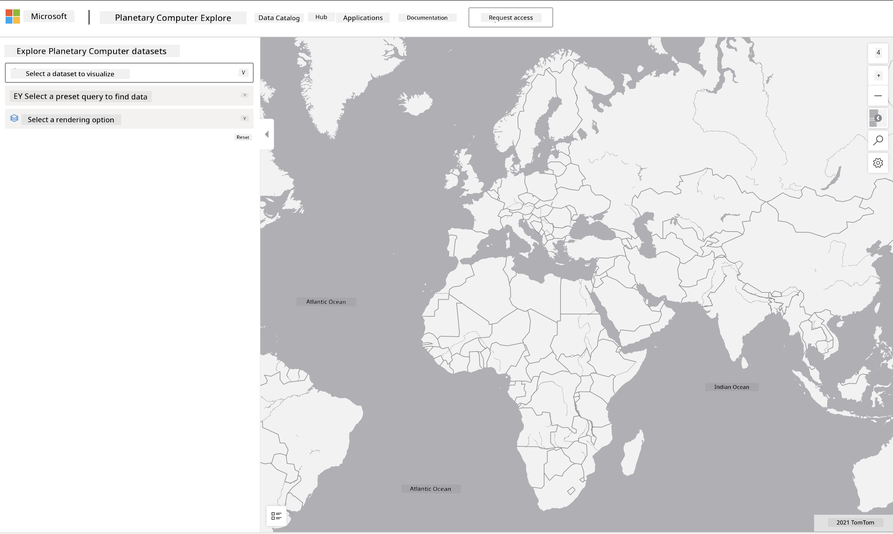

<!--
CO_OP_TRANSLATOR_METADATA:
{
  "original_hash": "d1e05715f9d97de6c4f1fb0c5a4702c0",
  "translation_date": "2025-11-18T18:39:02+00:00",
  "source_file": "6-Data-Science-In-Wild/20-Real-World-Examples/assignment.md",
  "language_code": "pcm"
}
-->
# Explore Planetary Computer Dataset

## Instructions

For dis lesson, we don talk about different area wey data science fit work - we go deep inside example wey relate to research, sustainability, and digital humanities. For dis assignment, you go look one of dis example well well, and use wetin you don learn about data visualizations and analysis to find insight about sustainability data.

Di [Planetary Computer](https://planetarycomputer.microsoft.com/) project get datasets and APIs wey you fit use if you get account - apply for account if you wan try di bonus part of dis assignment. Di site also get one [Explorer](https://planetarycomputer.microsoft.com/explore) feature wey you fit use even if you no get account.

`Steps:`  
Di Explorer interface (wey dey show for di screenshot below) go allow you choose dataset (from di options wey dem provide), preset query (to filter di data) and rendering option (to create di correct visualization). For dis assignment, your work na to:

1. Read di [Explorer documentation](https://planetarycomputer.microsoft.com/docs/overview/explorer/) - understand di options wey dey.  
2. Check di dataset [Catalog](https://planetarycomputer.microsoft.com/catalog) - learn wetin each one dey do.  
3. Use di Explorer - choose one dataset wey you like, pick query wey make sense & rendering option wey go fit am.  

`Your Task:`  
Now look di visualization wey show for di browser and answer dis questions:  
* Wetin be di _features_ wey dey di dataset?  
* Wetin be di _insights_ or result wey di visualization dey show?  
* Wetin be di _implications_ of di insights to di sustainability goals of di project?  
* Wetin be di _limitations_ of di visualization (like wetin insight you no fit get)?  
* If you fit get di raw data, wetin be di _alternative visualizations_ wey you go create, and why?  

`Bonus Points:`  
Apply for account - and login when dem accept you.  
* Use di _Launch Hub_ option to open di raw data inside Notebook.  
* Check di data well well, and do di alternative visualizations wey you think of.  
* Now analyze di custom visualizations wey you do - you fit find di insights wey you miss before?  

## Rubric

Exemplary | Adequate | Needs Improvement  
--- | --- | -- |  
Di student answer all di five core questions. Di student explain well how di current and alternative visualizations fit show insight about sustainability objectives or outcomes. | Di student answer at least di top 3 questions well, e show say dem don use di Explorer well. | Di student no answer plenty questions, or di answer no get enough detail - e show say dem no really try di project. |  

---

<!-- CO-OP TRANSLATOR DISCLAIMER START -->
**Disclaimer**:  
Dis docu wey you dey see don use AI translation service [Co-op Translator](https://github.com/Azure/co-op-translator) take translate am. Even though we dey try make sure say e correct, abeg no forget say machine translation fit get mistake or no too accurate. Di original docu for di language wey dem first write am na di main correct one. If na important information, e go better make you use professional human translation. We no go fit take blame for any misunderstanding or wrong interpretation wey fit happen because you use dis translation.
<!-- CO-OP TRANSLATOR DISCLAIMER END -->