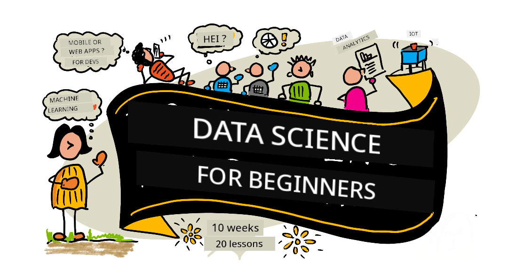

<!--
CO_OP_TRANSLATOR_METADATA:
{
  "original_hash": "26afff0d5c802e24a14f000c9c9f4614",
  "translation_date": "2025-11-18T18:14:13+00:00",
  "source_file": "README.md",
  "language_code": "pcm"
}
-->
# Data Science for Beginners - Curriculum

Azure Cloud Advocates for Microsoft don bring beta 10-week, 20-lesson curriculum wey dey teach Data Science. Each lesson get quiz before and after, written instructions to complete am, solution, and assignment. Dis project-based way of learning go help you sabi well as you dey build.

**Big thanks to our authors:** [Jasmine Greenaway](https://www.twitter.com/paladique), [Dmitry Soshnikov](http://soshnikov.com), [Nitya Narasimhan](https://twitter.com/nitya), [Jalen McGee](https://twitter.com/JalenMcG), [Jen Looper](https://twitter.com/jenlooper), [Maud Levy](https://twitter.com/maudstweets), [Tiffany Souterre](https://twitter.com/TiffanySouterre), [Christopher Harrison](https://www.twitter.com/geektrainer).

**🙏 Special thanks 🙏 to our [Microsoft Student Ambassador](https://studentambassadors.microsoft.com/) authors, reviewers and contributors,** like Aaryan Arora, [Aditya Garg](https://github.com/AdityaGarg00), [Alondra Sanchez](https://www.linkedin.com/in/alondra-sanchez-molina/), [Ankita Singh](https://www.linkedin.com/in/ankitasingh007), [Anupam Mishra](https://www.linkedin.com/in/anupam--mishra/), [Arpita Das](https://www.linkedin.com/in/arpitadas01/), ChhailBihari Dubey, [Dibri Nsofor](https://www.linkedin.com/in/dibrinsofor), [Dishita Bhasin](https://www.linkedin.com/in/dishita-bhasin-7065281bb), [Majd Safi](https://www.linkedin.com/in/majd-s/), [Max Blum](https://www.linkedin.com/in/max-blum-6036a1186/), [Miguel Correa](https://www.linkedin.com/in/miguelmque/), [Mohamma Iftekher (Iftu) Ebne Jalal](https://twitter.com/iftu119), [Nawrin Tabassum](https://www.linkedin.com/in/nawrin-tabassum), [Raymond Wangsa Putra](https://www.linkedin.com/in/raymond-wp/), [Rohit Yadav](https://www.linkedin.com/in/rty2423), Samridhi Sharma, [Sanya Sinha](https://www.linkedin.com/mwlite/in/sanya-sinha-13aab1200),
[Sheena Narula](https://www.linkedin.com/in/sheena-narua-n/), [Tauqeer Ahmad](https://www.linkedin.com/in/tauqeerahmad5201/), Yogendrasingh Pawar , [Vidushi Gupta](https://www.linkedin.com/in/vidushi-gupta07/), [Jasleen Sondhi](https://www.linkedin.com/in/jasleen-sondhi/)

||
|:---:|
| Data Science For Beginners - _Sketchnote by [@nitya](https://twitter.com/nitya)_ |

### 🌐 Multi-Language Support

#### Supported via GitHub Action (Automated & Always Up-to-Date)

[Arabic](../ar/README.md) | [Bengali](../bn/README.md) | [Bulgarian](../bg/README.md) | [Burmese (Myanmar)](../my/README.md) | [Chinese (Simplified)](../zh/README.md) | [Chinese (Traditional, Hong Kong)](../hk/README.md) | [Chinese (Traditional, Macau)](../mo/README.md) | [Chinese (Traditional, Taiwan)](../tw/README.md) | [Croatian](../hr/README.md) | [Czech](../cs/README.md) | [Danish](../da/README.md) | [Dutch](../nl/README.md) | [Estonian](../et/README.md) | [Finnish](../fi/README.md) | [French](../fr/README.md) | [German](../de/README.md) | [Greek](../el/README.md) | [Hebrew](../he/README.md) | [Hindi](../hi/README.md) | [Hungarian](../hu/README.md) | [Indonesian](../id/README.md) | [Italian](../it/README.md) | [Japanese](../ja/README.md) | [Korean](../ko/README.md) | [Lithuanian](../lt/README.md) | [Malay](../ms/README.md) | [Marathi](../mr/README.md) | [Nepali](../ne/README.md) | [Nigerian Pidgin](./README.md) | [Norwegian](../no/README.md) | [Persian (Farsi)](../fa/README.md) | [Polish](../pl/README.md) | [Portuguese (Brazil)](../br/README.md) | [Portuguese (Portugal)](../pt/README.md) | [Punjabi (Gurmukhi)](../pa/README.md) | [Romanian](../ro/README.md) | [Russian](../ru/README.md) | [Serbian (Cyrillic)](../sr/README.md) | [Slovak](../sk/README.md) | [Slovenian](../sl/README.md) | [Spanish](../es/README.md) | [Swahili](../sw/README.md) | [Swedish](../sv/README.md) | [Tagalog (Filipino)](../tl/README.md) | [Tamil](../ta/README.md) | [Thai](../th/README.md) | [Turkish](../tr/README.md) | [Ukrainian](../uk/README.md) | [Urdu](../ur/README.md) | [Vietnamese](../vi/README.md)

**If you wan add more translations, check [here](https://github.com/Azure/co-op-translator/blob/main/getting_started/supported-languages.md)**

#### Join Our Community 
We get Discord learn with AI series wey dey happen, learn more and join us for [Learn with AI Series](https://aka.ms/learnwithai/discord) from 18 - 30 September, 2025. You go learn tips and tricks for using GitHub Copilot for Data Science.

# You be student?

Start with dis resources:

- [Student Hub page](https://docs.microsoft.com/en-gb/learn/student-hub?WT.mc_id=academic-77958-bethanycheum) Dis page get beginner resources, Student packs and even ways to get free cert voucher. Bookmark am and dey check am as we dey change content monthly.
- [Microsoft Learn Student Ambassadors](https://studentambassadors.microsoft.com?WT.mc_id=academic-77958-bethanycheum) Join global community of student ambassadors, e fit be your way into Microsoft.

# How to Start

## 📚 Documentation

- **[Installation Guide](INSTALLATION.md)** - Step-by-step setup instructions for beginners
- **[Usage Guide](USAGE.md)** - Examples and common workflows
- **[Troubleshooting](TROUBLESHOOTING.md)** - Solutions to common issues
- **[Contributing Guide](CONTRIBUTING.md)** - How to contribute to dis project
- **[For Teachers](for-teachers.md)** - Teaching guidance and classroom resources

## 👨‍🎓 For Students
> **Complete Beginners**: You dey new to data science? Start with our [beginner-friendly examples](examples/README.md)! Dis simple, well-commented examples go help you understand the basics before you enter the full curriculum.
> **[Students](https://aka.ms/student-page)**: If you wan use dis curriculum by yourself, fork the repo and complete the exercises by yourself, start with pre-lecture quiz. Then read the lecture and complete the activities. Try to create the projects by understanding the lessons instead of copying the solution code; but the code dey available for /solutions folders for each project-oriented lesson. Another idea na to form study group with friends and go through the content together. For more study, we recommend [Microsoft Learn](https://docs.microsoft.com/en-us/users/jenlooper-2911/collections/qprpajyoy3x0g7?WT.mc_id=academic-77958-bethanycheum).

**Quick Start:**
1. Check the [Installation Guide](INSTALLATION.md) to set up your environment
2. Review the [Usage Guide](USAGE.md) to learn how to work with the curriculum
3. Start with Lesson 1 and work through sequentially
4. Join our [Discord community](https://aka.ms/ds4beginners/discord) for support

## 👩‍🏫 For Teachers

> **Teachers**: we don [add some suggestions](for-teachers.md) on how to use dis curriculum. We go like your feedback [for our discussion forum](https://github.com/microsoft/Data-Science-For-Beginners/discussions)!

## Meet the Team

**Gif by** [Mohit Jaisal](https://www.linkedin.com/in/mohitjaisal)

> 🎥 Click the image above for video about the project and the people wey create am!

## Pedagogy
We don pick two main teaching principles wen we dey use build dis curriculum: make sure say e dey project-based and e get plenty quizzes. By di end of dis series, students go sabi di basic principles of data science, including ethical concepts, how to prepare data, different ways to work with data, data visualization, data analysis, real-world examples of data science, and plenty more.

Plus, small quiz before class dey help set di student mind to learn di topic, and di second quiz after class go help dem remember wetin dem learn. Dis curriculum dey flexible and e dey fun, and you fit do am complete or just some parts. Di projects go start small and go dey more complex as di 10-week cycle dey go.

> Check our [Code of Conduct](CODE_OF_CONDUCT.md), [Contributing](CONTRIBUTING.md), and [Translation](TRANSLATIONS.md) guidelines. We go like hear your constructive feedback!

## Each lesson get:

- Optional sketchnote
- Optional extra video
- Warmup quiz before lesson
- Written lesson
- For project-based lessons, step-by-step guide on how to build di project
- Knowledge checks
- One challenge
- Extra reading
- Assignment
- [Post-lesson quiz](https://ff-quizzes.netlify.app/en/)

> **About quizzes**: All di quizzes dey inside di Quiz-App folder, total of 40 quizzes wey get three questions each. Dem dey linked inside di lessons, but you fit run di quiz app for your computer or deploy am to Azure; follow di instruction for di `quiz-app` folder. Dem dey localize di quizzes small small.

## 🎓 Beginner-Friendly Examples

**You new to Data Science?** We don create one special [examples directory](examples/README.md) wey get simple, well-explained code to help you start:

- 🌟 **Hello World** - Your first data science program
- 📂 **Loading Data** - Learn how to read and explore datasets
- 📊 **Simple Analysis** - Calculate statistics and find patterns
- 📈 **Basic Visualization** - Create charts and graphs
- 🔬 **Real-World Project** - Complete workflow from start to finish

Each example get detailed comments wey explain every step, e go perfect for people wey just dey start!

👉 **[Start with the examples](examples/README.md)** 👈

## Lessons

||
|:---:|
| Data Science For Beginners: Roadmap - _Sketchnote by [@nitya](https://twitter.com/nitya)_ |

| Lesson Number | Topic | Lesson Grouping | Learning Objectives | Linked Lesson | Author |
| :-----------: | :----------------------------------------: | :--------------------------------------------------: | :-----------------------------------------------------------------------------------------------------------------------------------------------------------------------: | :---------------------------------------------------------------------: | :----: |
| 01 | Wetin Be Data Science | [Introduction](1-Introduction/README.md) | Learn di basic concepts of data science and how e relate to artificial intelligence, machine learning, and big data. | [lesson](1-Introduction/01-defining-data-science/README.md) [video](https://youtu.be/beZ7Mb_oz9I) | [Dmitry](http://soshnikov.com) |
| 02 | Data Science Ethics | [Introduction](1-Introduction/README.md) | Data Ethics Concepts, Challenges & Frameworks. | [lesson](1-Introduction/02-ethics/README.md) | [Nitya](https://twitter.com/nitya) |
| 03 | Wetin Be Data | [Introduction](1-Introduction/README.md) | How dem dey classify data and di common sources. | [lesson](1-Introduction/03-defining-data/README.md) | [Jasmine](https://www.twitter.com/paladique) |
| 04 | Intro to Statistics & Probability | [Introduction](1-Introduction/README.md) | Di mathematical techniques of probability and statistics to understand data. | [lesson](1-Introduction/04-stats-and-probability/README.md) [video](https://youtu.be/Z5Zy85g4Yjw) | [Dmitry](http://soshnikov.com) |
| 05 | Working with Relational Data | [Working With Data](2-Working-With-Data/README.md) | Intro to relational data and di basics of exploring and analyzing relational data with SQL (Structured Query Language). | [lesson](2-Working-With-Data/05-relational-databases/README.md) | [Christopher](https://www.twitter.com/geektrainer) | | |
| 06 | Working with NoSQL Data | [Working With Data](2-Working-With-Data/README.md) | Intro to non-relational data, di different types and di basics of exploring and analyzing document databases. | [lesson](2-Working-With-Data/06-non-relational/README.md) | [Jasmine](https://twitter.com/paladique)|
| 07 | Working with Python | [Working With Data](2-Working-With-Data/README.md) | Basics of using Python for data exploration with libraries like Pandas. Foundational understanding of Python programming dey recommended. | [lesson](2-Working-With-Data/07-python/README.md) [video](https://youtu.be/dZjWOGbsN4Y) | [Dmitry](http://soshnikov.com) |
| 08 | Data Preparation | [Working With Data](2-Working-With-Data/README.md) | Topics on data techniques for cleaning and transforming data to handle challenges of missing, inaccurate, or incomplete data. | [lesson](2-Working-With-Data/08-data-preparation/README.md) | [Jasmine](https://www.twitter.com/paladique) |
| 09 | Visualizing Quantities | [Data Visualization](3-Data-Visualization/README.md) | Learn how to use Matplotlib to visualize bird data 🦆 | [lesson](3-Data-Visualization/09-visualization-quantities/README.md) | [Jen](https://twitter.com/jenlooper) |
| 10 | Visualizing Distributions of Data | [Data Visualization](3-Data-Visualization/README.md) | Visualizing observations and trends within an interval. | [lesson](3-Data-Visualization/10-visualization-distributions/README.md) | [Jen](https://twitter.com/jenlooper) |
| 11 | Visualizing Proportions | [Data Visualization](3-Data-Visualization/README.md) | Visualizing discrete and grouped percentages. | [lesson](3-Data-Visualization/11-visualization-proportions/README.md) | [Jen](https://twitter.com/jenlooper) |
| 12 | Visualizing Relationships | [Data Visualization](3-Data-Visualization/README.md) | Visualizing connections and correlations between sets of data and their variables. | [lesson](3-Data-Visualization/12-visualization-relationships/README.md) | [Jen](https://twitter.com/jenlooper) |
| 13 | Meaningful Visualizations | [Data Visualization](3-Data-Visualization/README.md) | Techniques and guidance for making your visualizations valuable for effective problem solving and insights. | [lesson](3-Data-Visualization/13-meaningful-visualizations/README.md) | [Jen](https://twitter.com/jenlooper) |
| 14 | Intro to di Data Science lifecycle | [Lifecycle](4-Data-Science-Lifecycle/README.md) | Intro to di data science lifecycle and di first step of acquiring and extracting data. | [lesson](4-Data-Science-Lifecycle/14-Introduction/README.md) | [Jasmine](https://twitter.com/paladique) |
| 15 | Analyzing | [Lifecycle](4-Data-Science-Lifecycle/README.md) | Dis phase of di data science lifecycle focus on techniques to analyze data. | [lesson](4-Data-Science-Lifecycle/15-analyzing/README.md) | [Jasmine](https://twitter.com/paladique) | | |
| 16 | Communication | [Lifecycle](4-Data-Science-Lifecycle/README.md) | Dis phase of di data science lifecycle focus on presenting di insights from di data in a way wey decision makers go understand. | [lesson](4-Data-Science-Lifecycle/16-communication/README.md) | [Jalen](https://twitter.com/JalenMcG) | | |
| 17 | Data Science in di Cloud | [Cloud Data](5-Data-Science-In-Cloud/README.md) | Dis series of lessons introduce data science in di cloud and di benefits. | [lesson](5-Data-Science-In-Cloud/17-Introduction/README.md) | [Tiffany](https://twitter.com/TiffanySouterre) and [Maud](https://twitter.com/maudstweets) |
| 18 | Data Science in di Cloud | [Cloud Data](5-Data-Science-In-Cloud/README.md) | Training models using Low Code tools. |[lesson](5-Data-Science-In-Cloud/18-Low-Code/README.md) | [Tiffany](https://twitter.com/TiffanySouterre) and [Maud](https://twitter.com/maudstweets) |
| 19 | Data Science in di Cloud | [Cloud Data](5-Data-Science-In-Cloud/README.md) | Deploying models with Azure Machine Learning Studio. | [lesson](5-Data-Science-In-Cloud/19-Azure/README.md)| [Tiffany](https://twitter.com/TiffanySouterre) and [Maud](https://twitter.com/maudstweets) |
| 20 | Data Science in di Wild | [In the Wild](6-Data-Science-In-Wild/README.md) | Data science driven projects in di real world. | [lesson](6-Data-Science-In-Wild/20-Real-World-Examples/README.md) | [Nitya](https://twitter.com/nitya) |

## GitHub Codespaces

Follow dis steps to open dis sample for Codespace:
1. Click di Code drop-down menu and select di Open with Codespaces option.
2. Select + New codespace for di bottom of di pane.
For more info, check di [GitHub documentation](https://docs.github.com/en/codespaces/developing-in-codespaces/creating-a-codespace-for-a-repository#creating-a-codespace).

## VSCode Remote - Containers
Follow dis steps to open dis repo for container using your local machine and VSCode with di VS Code Remote - Containers extension:

1. If na your first time to use development container, make sure say your system meet di pre-reqs (e.g. get Docker installed) for [di getting started documentation](https://code.visualstudio.com/docs/devcontainers/containers#_getting-started).

To use dis repository, you fit open di repository for isolated Docker volume:

**Note**: For di background, dis go use di Remote-Containers: **Clone Repository in Container Volume...** command to clone di source code for Docker volume instead of di local filesystem. [Volumes](https://docs.docker.com/storage/volumes/) na di preferred way to keep container data.

Or open a locally cloned or downloaded version of di repository:

- Clone dis repository to your local filesystem.
- Press F1 and select di **Remote-Containers: Open Folder in Container...** command.
- Select di cloned copy of dis folder, wait make di container start, and try things out.

## Offline access

You fit run dis documentation offline by using [Docsify](https://docsify.js.org/#/). Fork dis repo, [install Docsify](https://docsify.js.org/#/quickstart) for your local machine, then for di root folder of dis repo, type `docsify serve`. Di website go dey served for port 3000 for your localhost: `localhost:3000`.

> Note, notebooks no go render via Docsify, so when you need to run notebook, do am separately for VS Code wey dey run Python kernel.

## Other Curricula

Our team dey produce other curricula! Check dem out:

<!-- CO-OP TRANSLATOR OTHER COURSES START -->
### Azure / Edge / MCP / Agents

  
  

---

### Generative AI Series  
  
[-9333EA?style=for-the-badge&labelColor=E5E7EB&color=9333EA)](https://github.com/microsoft/Generative-AI-for-beginners-dotnet?WT.mc_id=academic-105485-koreyst)  
[-C084FC?style=for-the-badge&labelColor=E5E7EB&color=C084FC)](https://github.com/microsoft/generative-ai-for-beginners-java?WT.mc_id=academic-105485-koreyst)  
[-E879F9?style=for-the-badge&labelColor=E5E7EB&color=E879F9)](https://github.com/microsoft/generative-ai-with-javascript?WT.mc_id=academic-105485-koreyst)  

---

### Core Learning  
  
  
  
  
  
  
  

---

### Copilot Series  
  
  
  

## How You Go Fit Get Help  

**You dey face wahala?** Check our [Troubleshooting Guide](TROUBLESHOOTING.md) to see solution for common problems.  

If you dey stuck or you get any question about how to build AI apps, join other learners and developers wey sabi MCP. Na one kind supportive community wey dey welcome questions and dey share knowledge freely.  

  

If you get feedback about product or you dey see error when you dey build, visit:  

  

---

<!-- CO-OP TRANSLATOR DISCLAIMER START -->
**Disclaimer**:  
Dis docu don dey translate wit AI translation service [Co-op Translator](https://github.com/Azure/co-op-translator). Even though we dey try make e accurate, abeg sabi say automatic translation fit get mistake or no correct well. Di original docu for im native language na di main correct source. For important information, e better make una use professional human translation. We no go fit take blame for any misunderstanding or wrong interpretation wey fit happen because of dis translation.
<!-- CO-OP TRANSLATOR DISCLAIMER END -->