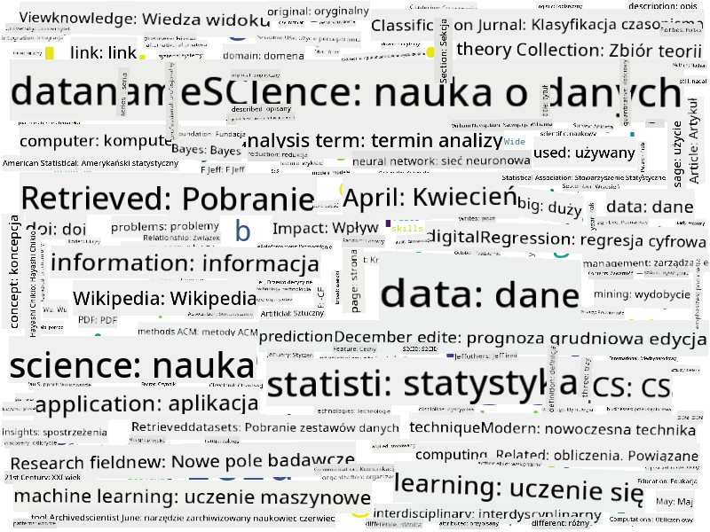

<!--
CO_OP_TRANSLATOR_METADATA:
{
  "original_hash": "8141e7195841682914be03ef930fe43d",
  "translation_date": "2025-09-03T20:14:38+00:00",
  "source_file": "1-Introduction/01-defining-data-science/README.md",
  "language_code": "pl"
}
-->
## Definiowanie Data Science

|  ](../../sketchnotes/01-Definitions.png) |
| :----------------------------------------------------------------------------------------------------------: |
|              Definiowanie Data Science - _Sketchnote autorstwa [@nitya](https://twitter.com/nitya)_           |

---

## [Quiz przed wykładem](https://purple-hill-04aebfb03.1.azurestaticapps.net/quiz/0)

## Co to jest dane?
W naszym codziennym życiu jesteśmy nieustannie otoczeni danymi. Tekst, który teraz czytasz, to dane. Lista numerów telefonów Twoich znajomych w smartfonie to dane, podobnie jak aktualny czas wyświetlany na zegarku. Jako ludzie naturalnie operujemy danymi, licząc pieniądze, które posiadamy, czy pisząc listy do znajomych.

Jednak dane stały się znacznie bardziej istotne wraz z powstaniem komputerów. Główną rolą komputerów jest wykonywanie obliczeń, ale potrzebują one danych, aby na nich operować. Dlatego musimy zrozumieć, jak komputery przechowują i przetwarzają dane.

Wraz z pojawieniem się Internetu rola komputerów jako urządzeń do obsługi danych wzrosła. Jeśli się nad tym zastanowić, obecnie używamy komputerów coraz częściej do przetwarzania danych i komunikacji, a nie do samych obliczeń. Pisząc e-mail do znajomego czy szukając informacji w Internecie, w istocie tworzymy, przechowujemy, przesyłamy i manipulujemy danymi.
> Czy pamiętasz, kiedy ostatni raz używałeś komputera do faktycznego obliczania czegoś?

## Co to jest Data Science?

Na [Wikipedii](https://en.wikipedia.org/wiki/Data_science), **Data Science** jest definiowane jako *dziedzina naukowa, która wykorzystuje metody naukowe do wydobywania wiedzy i wniosków ze strukturalnych i niestrukturalnych danych oraz stosowania wiedzy i praktycznych wniosków z danych w szerokim zakresie dziedzin zastosowań*.

Ta definicja podkreśla następujące ważne aspekty Data Science:

* Głównym celem Data Science jest **wydobywanie wiedzy** z danych, innymi słowy - **zrozumienie** danych, odnalezienie ukrytych zależności i stworzenie **modelu**.
* Data Science wykorzystuje **metody naukowe**, takie jak prawdopodobieństwo i statystyka. W rzeczywistości, gdy termin *Data Science* został po raz pierwszy wprowadzony, niektórzy twierdzili, że to tylko nowa, modna nazwa dla statystyki. Obecnie stało się jasne, że dziedzina ta jest znacznie szersza.
* Uzyskana wiedza powinna być stosowana do tworzenia **praktycznych wniosków**, czyli takich, które można zastosować w rzeczywistych sytuacjach biznesowych.
* Powinniśmy być w stanie operować zarówno na danych **strukturalnych**, jak i **niestrukturalnych**. Do tego tematu wrócimy później w kursie.
* **Dziedzina zastosowania** to ważne pojęcie, a specjaliści od Data Science często potrzebują przynajmniej pewnego stopnia wiedzy w danej dziedzinie, na przykład: finansach, medycynie, marketingu itd.

> Kolejnym istotnym aspektem Data Science jest badanie, jak dane mogą być zbierane, przechowywane i przetwarzane za pomocą komputerów. Podczas gdy statystyka dostarcza nam matematycznych podstaw, Data Science stosuje te koncepcje matematyczne, aby faktycznie wyciągać wnioski z danych.

Jednym ze sposobów (przypisywanym [Jimowi Grayowi](https://en.wikipedia.org/wiki/Jim_Gray_(computer_scientist))) spojrzenia na Data Science jest traktowanie jej jako odrębnego paradygmatu nauki:
* **Empiryczny**, w którym polegamy głównie na obserwacjach i wynikach eksperymentów
* **Teoretyczny**, gdzie nowe koncepcje wyłaniają się z istniejącej wiedzy naukowej
* **Obliczeniowy**, gdzie odkrywamy nowe zasady na podstawie eksperymentów obliczeniowych
* **Oparty na danych**, bazujący na odkrywaniu zależności i wzorców w danych  

## Powiązane dziedziny

Ponieważ dane są wszechobecne, Data Science również jest szeroką dziedziną, która dotyka wielu innych dyscyplin.
Można argumentować, że takie podejście nie jest idealne, ponieważ moduły mogą mieć różne długości. Prawdopodobnie bardziej sprawiedliwe byłoby podzielenie czasu przez długość modułu (w liczbie znaków) i porównanie tych wartości zamiast tego.
Kiedy zaczynamy analizować wyniki testów wielokrotnego wyboru, możemy spróbować określić, które pojęcia sprawiają uczniom trudności w zrozumieniu, i wykorzystać te informacje do ulepszenia treści. Aby to zrobić, musimy zaprojektować testy w taki sposób, aby każde pytanie odnosiło się do konkretnego pojęcia lub fragmentu wiedzy.

Jeśli chcemy podejść do tego bardziej szczegółowo, możemy zestawić czas potrzebny na ukończenie każdego modułu z kategorią wiekową uczniów. Możemy odkryć, że dla niektórych grup wiekowych ukończenie modułu zajmuje nieproporcjonalnie dużo czasu lub że uczniowie rezygnują przed jego ukończeniem. To może pomóc nam w określeniu rekomendacji wiekowych dla modułu i zminimalizowaniu niezadowolenia wynikającego z niewłaściwych oczekiwań.

## 🚀 Wyzwanie

W tym wyzwaniu spróbujemy znaleźć pojęcia związane z dziedziną Data Science, analizując teksty. Pobierzemy artykuł z Wikipedii na temat Data Science, przetworzymy tekst, a następnie stworzymy chmurę słów, taką jak ta:

Odwiedź [`notebook.ipynb`](../../../../../../../../../1-Introduction/01-defining-data-science/notebook.ipynb ':ignore'), aby przejrzeć kod. Możesz również uruchomić kod i zobaczyć, jak w czasie rzeczywistym wykonuje wszystkie transformacje danych.

> Jeśli nie wiesz, jak uruchomić kod w Jupyter Notebook, zapoznaj się z [tym artykułem](https://soshnikov.com/education/how-to-execute-notebooks-from-github/).

## [Quiz po wykładzie](https://ff-quizzes.netlify.app/en/ds/)

## Zadania

* **Zadanie 1**: Zmodyfikuj powyższy kod, aby znaleźć powiązane pojęcia dla dziedzin **Big Data** i **Machine Learning**
* **Zadanie 2**: [Przemyśl scenariusze związane z Data Science](assignment.md)

## Podziękowania

Ta lekcja została napisana z ♥️ przez [Dmitry Soshnikov](http://soshnikov.com)

---

**Zastrzeżenie**:  
Ten dokument został przetłumaczony za pomocą usługi tłumaczenia AI [Co-op Translator](https://github.com/Azure/co-op-translator). Chociaż dokładamy wszelkich starań, aby zapewnić poprawność tłumaczenia, prosimy pamiętać, że automatyczne tłumaczenia mogą zawierać błędy lub nieścisłości. Oryginalny dokument w jego rodzimym języku powinien być uznawany za autorytatywne źródło. W przypadku informacji o kluczowym znaczeniu zaleca się skorzystanie z profesjonalnego tłumaczenia przez człowieka. Nie ponosimy odpowiedzialności za jakiekolwiek nieporozumienia lub błędne interpretacje wynikające z użycia tego tłumaczenia.