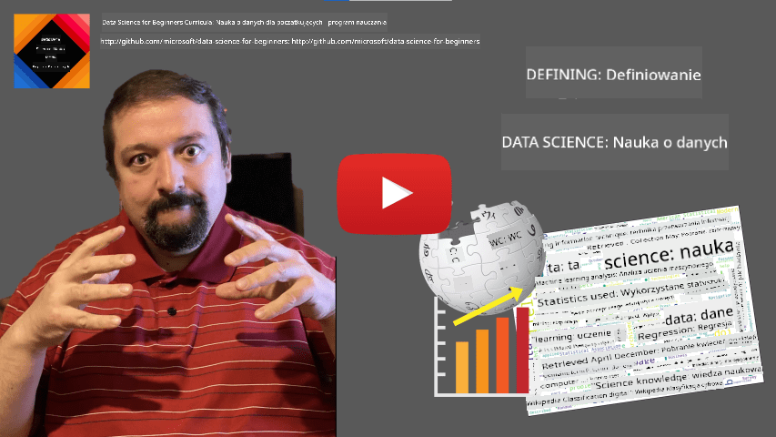

<!--
CO_OP_TRANSLATOR_METADATA:
{
  "original_hash": "a76ab694b1534fa57981311975660bfe",
  "translation_date": "2025-09-06T12:17:17+00:00",
  "source_file": "1-Introduction/01-defining-data-science/README.md",
  "language_code": "pl"
}
-->
## Definiowanie Data Science

|  ](../../sketchnotes/01-Definitions.png) |
| :----------------------------------------------------------------------------------------------------------: |
|              Definiowanie Data Science - _Sketchnote autorstwa [@nitya](https://twitter.com/nitya)_           |

---

## [Quiz przed wykładem](https://ff-quizzes.netlify.app/en/ds/quiz/0)

## Czym są dane?
W naszym codziennym życiu jesteśmy nieustannie otoczeni danymi. Tekst, który teraz czytasz, to dane. Lista numerów telefonów Twoich znajomych w smartfonie to dane, podobnie jak aktualny czas wyświetlany na zegarku. Jako ludzie naturalnie operujemy danymi, licząc pieniądze, które posiadamy, czy pisząc listy do znajomych.

Jednak dane stały się znacznie ważniejsze wraz z powstaniem komputerów. Główną rolą komputerów jest wykonywanie obliczeń, ale potrzebują one danych, aby działać. Dlatego musimy zrozumieć, jak komputery przechowują i przetwarzają dane.

Z pojawieniem się Internetu rola komputerów jako urządzeń do obsługi danych wzrosła. Jeśli się nad tym zastanowisz, obecnie używamy komputerów coraz częściej do przetwarzania i komunikacji danych, a nie tylko do obliczeń. Pisząc e-mail do znajomego czy szukając informacji w Internecie, w zasadzie tworzymy, przechowujemy, przesyłamy i manipulujemy danymi.
> Czy pamiętasz, kiedy ostatni raz używałeś komputera do faktycznego obliczania czegoś?

## Czym jest Data Science?

Na [Wikipedii](https://en.wikipedia.org/wiki/Data_science), **Data Science** jest definiowane jako *dziedzina nauki, która wykorzystuje metody naukowe do wydobywania wiedzy i wniosków z danych strukturalnych i niestrukturalnych oraz stosuje tę wiedzę i praktyczne wnioski w różnych dziedzinach zastosowań*.

Ta definicja podkreśla następujące kluczowe aspekty data science:

* Głównym celem data science jest **wydobywanie wiedzy** z danych, czyli **zrozumienie** danych, odkrywanie ukrytych zależności i budowanie **modeli**.
* Data science wykorzystuje **metody naukowe**, takie jak prawdopodobieństwo i statystyka. W rzeczywistości, gdy termin *data science* został po raz pierwszy wprowadzony, niektórzy twierdzili, że to tylko nowa, modna nazwa dla statystyki. Obecnie stało się jasne, że dziedzina ta jest znacznie szersza.
* Uzyskana wiedza powinna być stosowana do generowania **praktycznych wniosków**, czyli takich, które można zastosować w rzeczywistych sytuacjach biznesowych.
* Powinniśmy być w stanie operować zarówno na danych **strukturalnych**, jak i **niestrukturalnych**. Do różnych typów danych wrócimy później w kursie.
* **Dziedzina zastosowania** to ważny koncept, a data scientist często potrzebuje przynajmniej podstawowej wiedzy w danej dziedzinie, np. finansach, medycynie, marketingu itp.

> Kolejnym istotnym aspektem Data Science jest badanie, jak dane mogą być zbierane, przechowywane i przetwarzane za pomocą komputerów. Podczas gdy statystyka dostarcza nam podstaw matematycznych, data science stosuje te koncepcje matematyczne, aby faktycznie wyciągać wnioski z danych.

Jednym ze sposobów (przypisywanym [Jimowi Grayowi](https://en.wikipedia.org/wiki/Jim_Gray_(computer_scientist))) patrzenia na data science jest traktowanie jej jako odrębnego paradygmatu nauki:
* **Empirycznego**, w którym opieramy się głównie na obserwacjach i wynikach eksperymentów
* **Teoretycznego**, gdzie nowe koncepcje wyłaniają się z istniejącej wiedzy naukowej
* **Obliczeniowego**, gdzie odkrywamy nowe zasady na podstawie eksperymentów obliczeniowych
* **Opartego na danych**, bazującego na odkrywaniu relacji i wzorców w danych  

## Powiązane dziedziny

Ponieważ dane są wszechobecne, data science również jest szeroką dziedziną, która dotyka wielu innych dyscyplin.

## Rodzaje danych

Jak już wspomnieliśmy, dane są wszędzie. Wystarczy je odpowiednio uchwycić! Warto rozróżnić dane **strukturalne** i **niestrukturalne**. Dane strukturalne są zazwyczaj przedstawiane w dobrze zorganizowanej formie, często jako tabela lub zestaw tabel, podczas gdy dane niestrukturalne to po prostu zbiór plików. Czasami możemy również mówić o danych **półstrukturalnych**, które mają pewną strukturę, ale może się ona znacznie różnić.

| Strukturalne                                                               | Półstrukturalne                                                                                 | Niestrukturalne                        |
| -------------------------------------------------------------------------- | ------------------------------------------------------------------------------------------------ | -------------------------------------- |
| Lista osób z ich numerami telefonów                                        | Strony Wikipedii z linkami                                                                       | Tekst Encyklopedii Britannica          |
| Temperatura w każdym pomieszczeniu budynku co minutę przez ostatnie 20 lat | Zbiór artykułów naukowych w formacie JSON z autorami, datą publikacji i abstraktem               | Udostępnione pliki z dokumentami firmy |
| Dane o wieku i płci wszystkich osób wchodzących do budynku                 | Strony internetowe                                                                               | Surowy zapis wideo z kamery monitoringu|

## Skąd brać dane

Istnieje wiele możliwych źródeł danych i niemożliwe jest wymienienie ich wszystkich! Warto jednak wspomnieć o kilku typowych miejscach, z których można pozyskać dane:

* **Strukturalne**
  - **Internet rzeczy** (IoT), w tym dane z różnych czujników, takich jak czujniki temperatury czy ciśnienia, dostarcza wiele użytecznych danych. Na przykład, jeśli budynek biurowy jest wyposażony w czujniki IoT, możemy automatycznie kontrolować ogrzewanie i oświetlenie, aby zminimalizować koszty.
  - **Ankiety**, które prosimy użytkowników o wypełnienie po zakupie lub po odwiedzeniu strony internetowej.
  - **Analiza zachowań** może pomóc nam zrozumieć, jak głęboko użytkownik zagłębia się w stronę i co jest typowym powodem opuszczenia strony.
* **Niestrukturalne**
  - **Teksty** mogą być bogatym źródłem wniosków, takich jak ogólny **wskaźnik nastroju** lub wyodrębnianie słów kluczowych i znaczenia semantycznego.
  - **Obrazy** lub **wideo**. Nagranie z kamery monitoringu może być użyte do oszacowania ruchu na drodze i informowania ludzi o potencjalnych korkach.
  - **Logi serwerów internetowych** mogą być używane do zrozumienia, które strony naszej witryny są najczęściej odwiedzane i jak długo.
* **Półstrukturalne**
  - **Grafy sieci społecznościowych** mogą być świetnym źródłem danych o osobowościach użytkowników i potencjalnej skuteczności w rozpowszechnianiu informacji.
  - Gdy mamy zbiór zdjęć z imprezy, możemy spróbować wyodrębnić dane o **dynamice grupy**, budując graf osób robiących sobie wspólne zdjęcia.

Znając różne możliwe źródła danych, możesz spróbować pomyśleć o różnych scenariuszach, w których techniki data science mogą być zastosowane, aby lepiej poznać sytuację i usprawnić procesy biznesowe.

## Co można zrobić z danymi

W Data Science skupiamy się na następujących etapach pracy z danymi:

Oczywiście, w zależności od konkretnych danych, niektóre etapy mogą być pominięte (np. gdy dane są już w bazie danych lub gdy nie potrzebujemy trenowania modelu), a niektóre etapy mogą być powtarzane wielokrotnie (np. przetwarzanie danych).

## Cyfryzacja i transformacja cyfrowa

W ostatniej dekadzie wiele firm zaczęło dostrzegać znaczenie danych przy podejmowaniu decyzji biznesowych. Aby zastosować zasady data science w prowadzeniu biznesu, najpierw trzeba zebrać dane, czyli przekształcić procesy biznesowe w formę cyfrową. To nazywa się **cyfryzacją**. Zastosowanie technik data science do tych danych w celu podejmowania decyzji może prowadzić do znacznego wzrostu produktywności (lub nawet zmiany kierunku działalności), co nazywamy **transformacją cyfrową**.

Rozważmy przykład. Załóżmy, że mamy kurs data science (taki jak ten), który prowadzimy online dla studentów, i chcemy wykorzystać data science, aby go ulepszyć. Jak możemy to zrobić?

Możemy zacząć od pytania „Co można zdigitalizować?”. Najprostszym sposobem byłoby zmierzenie czasu, jaki zajmuje każdemu studentowi ukończenie każdego modułu, oraz sprawdzenie zdobytej wiedzy poprzez test wielokrotnego wyboru na końcu każdego modułu. Średnia czasu ukończenia wśród wszystkich studentów pozwoliłaby nam zidentyfikować moduły sprawiające największe trudności i popracować nad ich uproszczeniem.
Możesz argumentować, że takie podejście nie jest idealne, ponieważ moduły mogą mieć różną długość. Prawdopodobnie bardziej sprawiedliwe byłoby podzielenie czasu przez długość modułu (w liczbie znaków) i porównanie tych wartości zamiast tego.
Kiedy zaczynamy analizować wyniki testów wielokrotnego wyboru, możemy spróbować określić, które pojęcia sprawiają uczniom trudności w zrozumieniu, i wykorzystać te informacje do ulepszenia treści. Aby to zrobić, musimy zaprojektować testy w taki sposób, aby każde pytanie odnosiło się do konkretnego pojęcia lub fragmentu wiedzy.

Jeśli chcemy podejść do tego bardziej szczegółowo, możemy zestawić czas potrzebny na ukończenie każdego modułu z kategorią wiekową uczniów. Możemy odkryć, że dla niektórych grup wiekowych ukończenie modułu zajmuje nieproporcjonalnie dużo czasu lub że uczniowie rezygnują przed jego ukończeniem. To może pomóc nam w określeniu zaleceń wiekowych dla modułu i zminimalizowaniu niezadowolenia wynikającego z niewłaściwych oczekiwań.

## 🚀 Wyzwanie

W tym wyzwaniu spróbujemy znaleźć pojęcia związane z dziedziną Data Science, analizując teksty. Weźmiemy artykuł z Wikipedii na temat Data Science, pobierzemy i przetworzymy tekst, a następnie stworzymy chmurę słów, taką jak ta:

Odwiedź [`notebook.ipynb`](../../../../1-Introduction/01-defining-data-science/notebook.ipynb ':ignore'), aby przejrzeć kod. Możesz również uruchomić kod i zobaczyć, jak w czasie rzeczywistym wykonuje wszystkie transformacje danych.

> Jeśli nie wiesz, jak uruchomić kod w Jupyter Notebook, zapoznaj się z [tym artykułem](https://soshnikov.com/education/how-to-execute-notebooks-from-github/).

## [Quiz po wykładzie](https://ff-quizzes.netlify.app/en/ds/quiz/1)

## Zadania

* **Zadanie 1**: Zmodyfikuj powyższy kod, aby znaleźć powiązane pojęcia dla dziedzin **Big Data** i **Machine Learning**
* **Zadanie 2**: [Przemyśl scenariusze związane z Data Science](assignment.md)

## Podziękowania

Ta lekcja została stworzona z ♥️ przez [Dmitry Soshnikov](http://soshnikov.com)

---

**Zastrzeżenie**:  
Ten dokument został przetłumaczony za pomocą usługi tłumaczeniowej AI [Co-op Translator](https://github.com/Azure/co-op-translator). Chociaż dokładamy wszelkich starań, aby tłumaczenie było precyzyjne, prosimy pamiętać, że automatyczne tłumaczenia mogą zawierać błędy lub nieścisłości. Oryginalny dokument w jego języku źródłowym powinien być uznawany za autorytatywne źródło. W przypadku informacji o kluczowym znaczeniu zaleca się skorzystanie z profesjonalnego tłumaczenia przez człowieka. Nie ponosimy odpowiedzialności za jakiekolwiek nieporozumienia lub błędne interpretacje wynikające z użycia tego tłumaczenia.