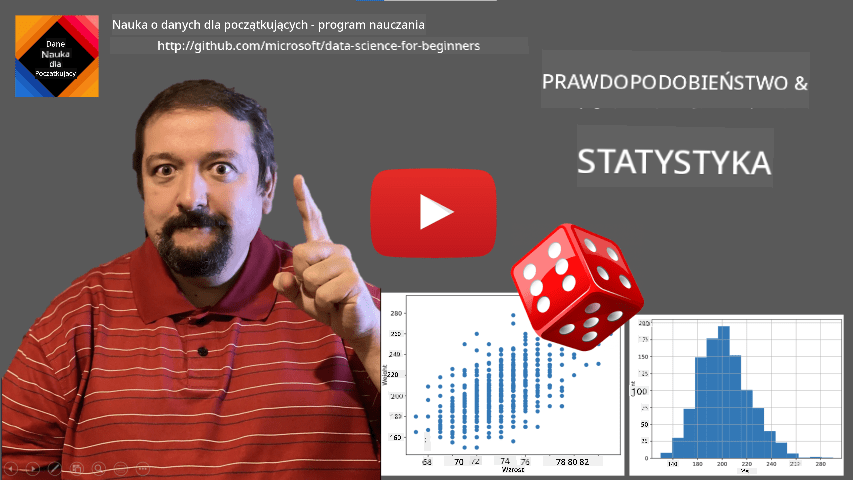
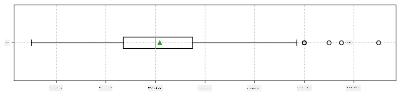
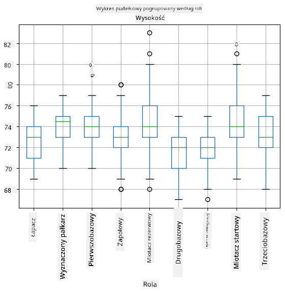
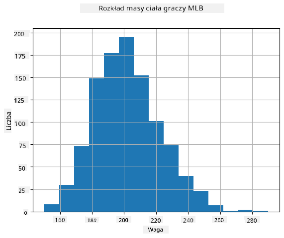
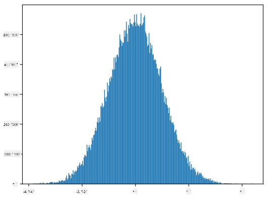
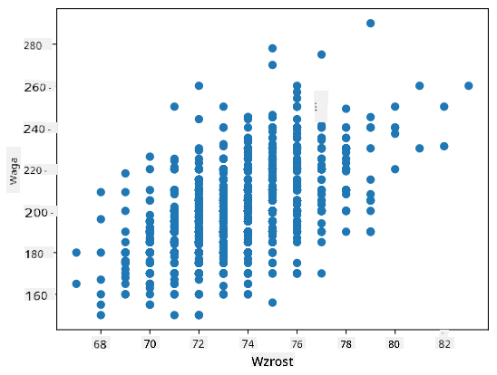

<!--
CO_OP_TRANSLATOR_METADATA:
{
  "original_hash": "ce95884566a74db72572cd51f0cb25ad",
  "translation_date": "2025-09-06T13:30:16+00:00",
  "source_file": "1-Introduction/04-stats-and-probability/README.md",
  "language_code": "pl"
}
-->
# Krótkie wprowadzenie do statystyki i teorii prawdopodobieństwa

| ](../../sketchnotes/04-Statistics-Probability.png)|
|:---:|
| Statystyka i prawdopodobieństwo - _Sketchnote autorstwa [@nitya](https://twitter.com/nitya)_ |

Statystyka i teoria prawdopodobieństwa to dwie ściśle powiązane dziedziny matematyki, które mają ogromne znaczenie w nauce o danych. Można pracować z danymi bez głębokiej wiedzy matematycznej, ale warto znać przynajmniej podstawowe pojęcia. Poniżej przedstawiamy krótkie wprowadzenie, które pomoże Ci zacząć.

[](https://youtu.be/Z5Zy85g4Yjw)

## [Quiz przed wykładem](https://ff-quizzes.netlify.app/en/ds/quiz/6)

## Prawdopodobieństwo i zmienne losowe

**Prawdopodobieństwo** to liczba z przedziału od 0 do 1, która wyraża, jak bardzo prawdopodobne jest wystąpienie danego **zdarzenia**. Definiuje się je jako liczbę pozytywnych wyników (prowadzących do zdarzenia) podzieloną przez całkowitą liczbę możliwych wyników, zakładając, że wszystkie wyniki są jednakowo prawdopodobne. Na przykład, gdy rzucamy kostką, prawdopodobieństwo wyrzucenia liczby parzystej wynosi 3/6 = 0,5.

Mówiąc o zdarzeniach, używamy **zmiennych losowych**. Na przykład zmienna losowa reprezentująca liczbę wyrzuconą na kostce przyjmuje wartości od 1 do 6. Zbiór liczb od 1 do 6 nazywamy **przestrzenią próbek**. Możemy mówić o prawdopodobieństwie, że zmienna losowa przyjmie określoną wartość, np. P(X=3)=1/6.

Zmienna losowa w powyższym przykładzie jest nazywana **dyskretną**, ponieważ jej przestrzeń próbek jest przeliczalna, tj. istnieją oddzielne wartości, które można wyliczyć. Istnieją jednak przypadki, gdy przestrzeń próbek to zakres liczb rzeczywistych lub cały zbiór liczb rzeczywistych. Takie zmienne nazywamy **ciągłymi**. Dobrym przykładem jest czas przyjazdu autobusu.

## Rozkład prawdopodobieństwa

W przypadku dyskretnych zmiennych losowych łatwo jest opisać prawdopodobieństwo każdego zdarzenia za pomocą funkcji P(X). Dla każdej wartości *s* z przestrzeni próbek *S* funkcja ta zwraca liczbę z przedziału od 0 do 1, taką że suma wszystkich wartości P(X=s) dla wszystkich zdarzeń wynosi 1.

Najbardziej znanym dyskretnym rozkładem jest **rozkład jednostajny**, w którym przestrzeń próbek składa się z N elementów, a każde z nich ma jednakowe prawdopodobieństwo wynoszące 1/N.

Trudniej jest opisać rozkład prawdopodobieństwa zmiennej ciągłej, której wartości pochodzą z pewnego przedziału [a,b] lub całego zbioru liczb rzeczywistych ℝ. Rozważmy przypadek czasu przyjazdu autobusu. W rzeczywistości prawdopodobieństwo, że autobus przyjedzie dokładnie o określonej godzinie *t*, wynosi 0!

> Teraz wiesz, że zdarzenia o prawdopodobieństwie 0 się zdarzają, i to bardzo często! Przynajmniej za każdym razem, gdy przyjeżdża autobus!

Możemy mówić jedynie o prawdopodobieństwie, że zmienna przyjmie wartość z określonego przedziału, np. P(t<sub>1</sub>≤X<t<sub>2</sub>). W takim przypadku rozkład prawdopodobieństwa opisuje **funkcja gęstości prawdopodobieństwa** p(x), taka że


Ciągłym odpowiednikiem rozkładu jednostajnego jest **rozkład jednostajny ciągły**, który jest zdefiniowany na skończonym przedziale. Prawdopodobieństwo, że wartość X znajdzie się w przedziale o długości l, jest proporcjonalne do l i rośnie do 1.

Innym ważnym rozkładem jest **rozkład normalny**, o którym powiemy więcej poniżej.

## Średnia, wariancja i odchylenie standardowe

Załóżmy, że mamy ciąg n próbek zmiennej losowej X: x<sub>1</sub>, x<sub>2</sub>, ..., x<sub>n</sub>. Możemy zdefiniować **średnią** (lub **średnią arytmetyczną**) tego ciągu w tradycyjny sposób jako (x<sub>1</sub>+x<sub>2</sub>+...+x<sub>n</sub>)/n. W miarę zwiększania rozmiaru próby (tj. w granicy, gdy n→∞), otrzymamy średnią (nazywaną również **wartością oczekiwaną**) rozkładu. Wartość oczekiwaną oznaczamy jako **E**(x).

> Można wykazać, że dla dowolnego rozkładu dyskretnego o wartościach {x<sub>1</sub>, x<sub>2</sub>, ..., x<sub>N</sub>} i odpowiadających im prawdopodobieństwach p<sub>1</sub>, p<sub>2</sub>, ..., p<sub>N</sub>, wartość oczekiwana wynosi E(X)=x<sub>1</sub>p<sub>1</sub>+x<sub>2</sub>p<sub>2</sub>+...+x<sub>N</sub>p<sub>N</sub>.

Aby określić, jak bardzo wartości są rozproszone, możemy obliczyć wariancję σ<sup>2</sup> = ∑(x<sub>i</sub> - μ)<sup>2</sup>/n, gdzie μ to średnia ciągu. Wartość σ nazywamy **odchyleniem standardowym**, a σ<sup>2</sup> nazywamy **wariancją**.

## Dominanta, mediana i kwartyle

Czasami średnia nie oddaje dobrze "typowej" wartości danych. Na przykład, gdy istnieje kilka skrajnych wartości, które są zupełnie poza zakresem, mogą one wpłynąć na średnią. Innym dobrym wskaźnikiem jest **mediana**, czyli wartość, dla której połowa punktów danych jest mniejsza, a druga połowa - większa.

Aby lepiej zrozumieć rozkład danych, warto mówić o **kwartylach**:

* Pierwszy kwartyl, czyli Q1, to wartość, poniżej której znajduje się 25% danych
* Trzeci kwartyl, czyli Q3, to wartość, poniżej której znajduje się 75% danych

Graficznie możemy przedstawić zależność między medianą a kwartylami na diagramie zwanym **box plot**:


Tutaj obliczamy również **rozstęp międzykwartylowy** IQR=Q3-Q1 oraz tzw. **wartości odstające** - wartości, które znajdują się poza granicami [Q1-1.5*IQR, Q3+1.5*IQR].

Dla skończonego rozkładu zawierającego niewielką liczbę możliwych wartości dobrą "typową" wartością jest ta, która występuje najczęściej, czyli **dominanta**. Często stosuje się ją do danych kategorycznych, takich jak kolory. Wyobraźmy sobie sytuację, w której mamy dwie grupy ludzi - jedni zdecydowanie wolą czerwony, a inni niebieski. Jeśli zakodujemy kolory liczbami, średnia wartość ulubionego koloru znajdzie się gdzieś w spektrum pomarańczowo-zielonym, co nie oddaje rzeczywistych preferencji żadnej z grup. Natomiast dominanta będzie jednym z kolorów lub oboma kolorami, jeśli liczba osób głosujących na nie jest równa (w takim przypadku próbkę nazywamy **wielomodalną**).

## Dane rzeczywiste

Analizując dane z rzeczywistości, często nie są one zmiennymi losowymi w sensie ścisłym, ponieważ nie przeprowadzamy eksperymentów z nieznanym wynikiem. Na przykład, rozważmy drużynę baseballową i ich dane fizyczne, takie jak wzrost, waga i wiek. Te liczby nie są dokładnie losowe, ale nadal możemy stosować te same pojęcia matematyczne. Na przykład ciąg wag ludzi można uznać za ciąg wartości pochodzących z pewnej zmiennej losowej. Poniżej znajduje się ciąg wag rzeczywistych graczy baseballowych z [Major League Baseball](http://mlb.mlb.com/index.jsp), zaczerpnięty z [tego zbioru danych](http://wiki.stat.ucla.edu/socr/index.php/SOCR_Data_MLB_HeightsWeights) (dla wygody pokazano tylko pierwsze 20 wartości):

```
[180.0, 215.0, 210.0, 210.0, 188.0, 176.0, 209.0, 200.0, 231.0, 180.0, 188.0, 180.0, 185.0, 160.0, 180.0, 185.0, 197.0, 189.0, 185.0, 219.0]
```

> **Uwaga**: Aby zobaczyć przykład pracy z tym zbiorem danych, zajrzyj do [dołączonego notatnika](notebook.ipynb). W trakcie tej lekcji znajdziesz również kilka wyzwań, które możesz rozwiązać, dodając kod do tego notatnika. Jeśli nie wiesz, jak operować na danych, nie martw się - wrócimy do pracy z danymi w Pythonie w późniejszym czasie. Jeśli nie wiesz, jak uruchamiać kod w Jupyter Notebook, zapoznaj się z [tym artykułem](https://soshnikov.com/education/how-to-execute-notebooks-from-github/).

Oto wykres pudełkowy pokazujący średnią, medianę i kwartyle dla naszych danych:



Ponieważ nasze dane zawierają informacje o różnych **rolach** graczy, możemy również stworzyć wykres pudełkowy według roli - pozwoli nam to zorientować się, jak wartości parametrów różnią się w zależności od roli. Tym razem rozważymy wzrost:



Ten diagram sugeruje, że średni wzrost pierwszobazowych jest wyższy niż wzrost drugobazowych. Później w tej lekcji dowiemy się, jak formalniej przetestować tę hipotezę i jak wykazać, że nasze dane są statystycznie istotne, aby to pokazać.

> Pracując z danymi rzeczywistymi, zakładamy, że wszystkie punkty danych są próbkami pochodzącymi z pewnego rozkładu prawdopodobieństwa. To założenie pozwala nam stosować techniki uczenia maszynowego i budować działające modele predykcyjne.

Aby zobaczyć, jaki jest rozkład naszych danych, możemy narysować wykres zwany **histogramem**. Oś X zawiera liczbę różnych przedziałów wag (tzw. **koszyków**), a oś pionowa pokazuje liczbę przypadków, w których próbka zmiennej losowej znalazła się w danym przedziale.



Z tego histogramu można zauważyć, że wszystkie wartości są skoncentrowane wokół pewnej średniej wagi, a im dalej od tej wagi, tym rzadziej spotykamy takie wartości. Innymi słowy, jest bardzo mało prawdopodobne, aby waga gracza baseballowego znacznie różniła się od średniej wagi. Wariancja wag pokazuje, w jakim stopniu wagi mogą różnić się od średniej.

> Jeśli weźmiemy wagi innych osób, nie z ligi baseballowej, rozkład prawdopodobnie będzie inny. Jednak kształt rozkładu pozostanie taki sam, ale średnia i wariancja ulegną zmianie. Dlatego jeśli nauczymy nasz model na graczach baseballowych, prawdopodobnie da on błędne wyniki, gdy zostanie zastosowany do studentów uniwersytetu, ponieważ podstawowy rozkład jest inny.

## Rozkład normalny

Rozkład wag, który widzieliśmy powyżej, jest bardzo typowy, a wiele pomiarów z rzeczywistości podąża za tym samym typem rozkładu, ale z różnymi średnimi i wariancjami. Ten rozkład nazywamy **rozkładem normalnym** i odgrywa on bardzo ważną rolę w statystyce.

Użycie rozkładu normalnego to właściwy sposób na generowanie losowych wag potencjalnych graczy baseballowych. Gdy znamy średnią wagę `mean` i odchylenie standardowe `std`, możemy wygenerować 1000 próbek wag w następujący sposób:
```python
samples = np.random.normal(mean,std,1000)
``` 

Jeśli narysujemy histogram wygenerowanych próbek, zobaczymy obraz bardzo podobny do tego pokazanego powyżej. A jeśli zwiększymy liczbę próbek i liczbę koszyków, możemy wygenerować obraz rozkładu normalnego, który jest bliższy ideałowi:



*Rozkład normalny ze średnią=0 i odch.std.=1*

## Przedziały ufności

Mówiąc o wagach graczy baseballowych, zakładamy, że istnieje pewna **zmienna losowa W**, która odpowiada idealnemu rozkładowi prawdopodobieństwa wag wszystkich graczy baseballowych (tzw. **populacja**). Nasz ciąg wag odpowiada podzbiorowi wszystkich graczy baseballowych, który nazywamy **próbką**. Interesującym pytaniem jest, czy możemy poznać parametry rozkładu W, tj. średnią i wariancję populacji?

Najprostszą odpowiedzią byłoby obliczenie średniej i wariancji naszej próbki. Jednak może się zdarzyć, że nasza losowa próbka nie odzwierciedla dokładnie całej populacji. Dlatego sensowne jest mówienie o **przedziale ufności**.

> **Przedział ufności** to oszacowanie prawdziwej średniej populacji na podstawie naszej próbki, które jest dokładne z określonym prawdopodobieństwem (lub **poziomem ufności**).

Załóżmy, że mamy próbkę X...

1</sub>, ..., X<sub>n</sub> z naszej dystrybucji. Za każdym razem, gdy pobieramy próbkę z naszej dystrybucji, otrzymujemy inną wartość średnią μ. W związku z tym μ można uznać za zmienną losową. **Przedział ufności** z ufnością p to para wartości (L<sub>p</sub>,R<sub>p</sub>), taka że **P**(L<sub>p</sub>≤μ≤R<sub>p</sub>) = p, czyli prawdopodobieństwo, że zmierzona wartość średnia mieści się w przedziale, wynosi p.

Nie omawiamy szczegółowo, jak obliczane są te przedziały ufności, ponieważ wykracza to poza nasz krótki wstęp. Więcej szczegółów można znaleźć [na Wikipedii](https://en.wikipedia.org/wiki/Confidence_interval). W skrócie, definiujemy rozkład obliczonej średniej próbki względem prawdziwej średniej populacji, który nazywany jest **rozkładem Studenta**.

> **Ciekawostka**: Rozkład Studenta został nazwany na cześć matematyka Williama Sealy'ego Gosseta, który opublikował swoje prace pod pseudonimem "Student". Pracował w browarze Guinness, a według jednej z wersji jego pracodawca nie chciał, aby opinia publiczna wiedziała, że używają testów statystycznych do oceny jakości surowców.

Jeśli chcemy oszacować średnią μ naszej populacji z ufnością p, musimy wziąć *(1-p)/2-ty percentyl* rozkładu Studenta A, który można znaleźć w tabelach lub obliczyć za pomocą wbudowanych funkcji oprogramowania statystycznego (np. Python, R itp.). Wtedy przedział dla μ będzie dany przez X±A*D/√n, gdzie X to uzyskana średnia próbki, a D to odchylenie standardowe.

> **Uwaga**: Pomijamy również omówienie ważnego pojęcia [stopni swobody](https://en.wikipedia.org/wiki/Degrees_of_freedom_(statistics)), które jest istotne w kontekście rozkładu Studenta. Aby lepiej zrozumieć ten koncept, warto sięgnąć po bardziej kompletne książki o statystyce.

Przykład obliczania przedziału ufności dla wagi i wzrostu znajduje się w [dołączonych notatnikach](notebook.ipynb).

| p | Średnia wagi |
|-----|-----------|
| 0.85 | 201.73±0.94 |
| 0.90 | 201.73±1.08 |
| 0.95 | 201.73±1.28 |

Zauważ, że im wyższe prawdopodobieństwo ufności, tym szerszy przedział ufności.

## Testowanie hipotez

W naszym zbiorze danych o graczach baseballowych istnieją różne role zawodników, które można podsumować poniżej (zobacz [dołączony notatnik](notebook.ipynb), aby zobaczyć, jak można obliczyć tę tabelę):

| Rola | Wzrost | Waga | Liczba |
|------|--------|--------|-------|
| Catcher | 72.723684 | 204.328947 | 76 |
| Designated_Hitter | 74.222222 | 220.888889 | 18 |
| First_Baseman | 74.000000 | 213.109091 | 55 |
| Outfielder | 73.010309 | 199.113402 | 194 |
| Relief_Pitcher | 74.374603 | 203.517460 | 315 |
| Second_Baseman | 71.362069 | 184.344828 | 58 |
| Shortstop | 71.903846 | 182.923077 | 52 |
| Starting_Pitcher | 74.719457 | 205.163636 | 221 |
| Third_Baseman | 73.044444 | 200.955556 | 45 |

Możemy zauważyć, że średni wzrost pierwszych bazowych jest wyższy niż drugich bazowych. Możemy więc być skłonni stwierdzić, że **pierwsi bazowi są wyżsi niż drudzy bazowi**.

> To stwierdzenie nazywane jest **hipotezą**, ponieważ nie wiemy, czy jest ono faktycznie prawdziwe.

Jednak nie zawsze jest oczywiste, czy możemy wyciągnąć taki wniosek. Z wcześniejszej dyskusji wiemy, że każda średnia ma związany z nią przedział ufności, a zatem różnica ta może być tylko błędem statystycznym. Potrzebujemy bardziej formalnego sposobu na przetestowanie naszej hipotezy.

Obliczmy przedziały ufności osobno dla wzrostu pierwszych i drugich bazowych:

| Ufność | Pierwsi bazowi | Drudzy bazowi |
|------------|---------------|----------------|
| 0.85 | 73.62..74.38 | 71.04..71.69 |
| 0.90 | 73.56..74.44 | 70.99..71.73 |
| 0.95 | 73.47..74.53 | 70.92..71.81 |

Widzimy, że przy żadnym poziomie ufności przedziały się nie nakładają. To dowodzi naszej hipotezy, że pierwsi bazowi są wyżsi niż drudzy bazowi.

Bardziej formalnie, problem, który rozwiązujemy, polega na sprawdzeniu, czy **dwa rozkłady prawdopodobieństwa są takie same**, lub przynajmniej mają te same parametry. W zależności od rozkładu musimy użyć różnych testów. Jeśli wiemy, że nasze rozkłady są normalne, możemy zastosować **[test t Studenta](https://en.wikipedia.org/wiki/Student%27s_t-test)**.

W teście t Studenta obliczamy tzw. **wartość t**, która wskazuje różnicę między średnimi, uwzględniając wariancję. Udowodniono, że wartość t podąża za **rozkładem Studenta**, co pozwala nam uzyskać wartość progową dla danego poziomu ufności **p** (można ją obliczyć lub znaleźć w tabelach numerycznych). Następnie porównujemy wartość t z tą wartością progową, aby zatwierdzić lub odrzucić hipotezę.

W Pythonie możemy użyć pakietu **SciPy**, który zawiera funkcję `ttest_ind` (oprócz wielu innych przydatnych funkcji statystycznych!). Funkcja ta oblicza wartość t za nas, a także wykonuje odwrotne wyszukiwanie wartości p ufności, dzięki czemu możemy po prostu spojrzeć na poziom ufności, aby wyciągnąć wnioski.

Na przykład nasze porównanie wzrostu pierwszych i drugich bazowych daje następujące wyniki:
```python
from scipy.stats import ttest_ind

tval, pval = ttest_ind(df.loc[df['Role']=='First_Baseman',['Height']], df.loc[df['Role']=='Designated_Hitter',['Height']],equal_var=False)
print(f"T-value = {tval[0]:.2f}\nP-value: {pval[0]}")
```
```
T-value = 7.65
P-value: 9.137321189738925e-12
```
W naszym przypadku wartość p jest bardzo niska, co oznacza, że istnieją silne dowody na poparcie tezy, że pierwsi bazowi są wyżsi.

Istnieją również inne rodzaje hipotez, które możemy chcieć przetestować, na przykład:
* Udowodnienie, że dana próbka podąża za jakimś rozkładem. W naszym przypadku założyliśmy, że wzrosty są rozkładem normalnym, ale to wymaga formalnej weryfikacji statystycznej.
* Udowodnienie, że średnia wartość próbki odpowiada jakiejś z góry określonej wartości.
* Porównanie średnich kilku próbek (np. jaka jest różnica w poziomach szczęścia w różnych grupach wiekowych).

## Prawo wielkich liczb i twierdzenie centralne graniczne

Jednym z powodów, dla których rozkład normalny jest tak ważny, jest tzw. **twierdzenie centralne graniczne**. Załóżmy, że mamy dużą próbkę niezależnych wartości N X<sub>1</sub>, ..., X<sub>N</sub>, pobranych z dowolnego rozkładu o średniej μ i wariancji σ<sup>2</sup>. Wtedy, dla wystarczająco dużego N (innymi słowy, gdy N→∞), średnia Σ<sub>i</sub>X<sub>i</sub> będzie miała rozkład normalny, ze średnią μ i wariancją σ<sup>2</sup>/N.

> Innym sposobem interpretacji twierdzenia centralnego granicznego jest stwierdzenie, że niezależnie od rozkładu, gdy obliczasz średnią sumy dowolnych wartości zmiennych losowych, kończysz z rozkładem normalnym.

Z twierdzenia centralnego granicznego wynika również, że gdy N→∞, prawdopodobieństwo, że średnia próbki będzie równa μ, staje się 1. Jest to znane jako **prawo wielkich liczb**.

## Kowariancja i korelacja

Jednym z zadań Data Science jest znajdowanie relacji między danymi. Mówimy, że dwie sekwencje **korelują**, gdy wykazują podobne zachowanie w tym samym czasie, tj. albo rosną/spadają jednocześnie, albo jedna sekwencja rośnie, gdy druga spada i odwrotnie. Innymi słowy, wydaje się, że istnieje jakaś relacja między dwiema sekwencjami.

> Korelacja niekoniecznie wskazuje na związek przyczynowy między dwiema sekwencjami; czasami obie zmienne mogą zależeć od jakiejś zewnętrznej przyczyny, lub może to być czysty przypadek, że dwie sekwencje korelują. Jednak silna matematyczna korelacja jest dobrym wskaźnikiem, że dwie zmienne są jakoś powiązane.

Matematycznie głównym pojęciem, które pokazuje relację między dwiema zmiennymi losowymi, jest **kowariancja**, która jest obliczana w następujący sposób: Cov(X,Y) = **E**\[(X-**E**(X))(Y-**E**(Y))\]. Obliczamy odchylenie obu zmiennych od ich wartości średnich, a następnie iloczyn tych odchyleń. Jeśli obie zmienne odchylają się razem, iloczyn zawsze będzie wartością dodatnią, która doda się do dodatniej kowariancji. Jeśli obie zmienne odchylają się niesynchronicznie (tj. jedna spada poniżej średniej, gdy druga rośnie powyżej średniej), zawsze otrzymamy liczby ujemne, które dodadzą się do ujemnej kowariancji. Jeśli odchylenia nie są zależne, dodadzą się do wartości bliskiej zeru.

Wartość bezwzględna kowariancji nie mówi nam wiele o tym, jak duża jest korelacja, ponieważ zależy od wielkości rzeczywistych wartości. Aby ją znormalizować, możemy podzielić kowariancję przez odchylenie standardowe obu zmiennych, aby uzyskać **korelację**. Dobrą rzeczą jest to, że korelacja zawsze mieści się w zakresie [-1,1], gdzie 1 wskazuje na silną dodatnią korelację między wartościami, -1 - silną ujemną korelację, a 0 - brak korelacji (zmienne są niezależne).

**Przykład**: Możemy obliczyć korelację między wagą a wzrostem graczy baseballowych z wspomnianego zbioru danych:
```python
print(np.corrcoef(weights,heights))
```
W rezultacie otrzymujemy **macierz korelacji** podobną do tej:
```
array([[1.        , 0.52959196],
       [0.52959196, 1.        ]])
```

> Macierz korelacji C można obliczyć dla dowolnej liczby sekwencji wejściowych S<sub>1</sub>, ..., S<sub>n</sub>. Wartość C<sub>ij</sub> to korelacja między S<sub>i</sub> a S<sub>j</sub>, a elementy diagonalne zawsze wynoszą 1 (co jest również autokorelacją S<sub>i</sub>).

W naszym przypadku wartość 0.53 wskazuje, że istnieje pewna korelacja między wagą a wzrostem osoby. Możemy również wykonać wykres punktowy jednej wartości względem drugiej, aby zobaczyć relację wizualnie:



> Więcej przykładów korelacji i kowariancji można znaleźć w [dołączonym notatniku](notebook.ipynb).

## Podsumowanie

W tej sekcji nauczyliśmy się:

* podstawowych właściwości statystycznych danych, takich jak średnia, wariancja, moda i kwartyle
* różnych rozkładów zmiennych losowych, w tym rozkładu normalnego
* jak znaleźć korelację między różnymi właściwościami
* jak używać solidnego aparatu matematyki i statystyki do udowadniania hipotez
* jak obliczać przedziały ufności dla zmiennej losowej na podstawie próbki danych

Chociaż to zdecydowanie nie jest wyczerpująca lista tematów istniejących w zakresie prawdopodobieństwa i statystyki, powinna wystarczyć, aby dać Ci dobry start w tym kursie.

## 🚀 Wyzwanie

Użyj przykładowego kodu w notatniku, aby przetestować inne hipotezy:
1. Pierwsi bazowi są starsi niż drudzy bazowi
2. Pierwsi bazowi są wyżsi niż trzeci bazowi
3. Shortstopy są wyższe niż drudzy bazowi

## [Quiz po wykładzie](https://ff-quizzes.netlify.app/en/ds/quiz/7)

## Przegląd i samodzielna nauka

Prawdopodobieństwo i statystyka to tak szeroki temat, że zasługuje na osobny kurs. Jeśli chcesz zgłębić teorię, możesz kontynuować czytanie niektórych z poniższych książek:

1. [Carlos Fernandez-Granda](https://cims.nyu.edu/~cfgranda/) z New York University ma świetne notatki z wykładów [Probability and Statistics for Data Science](https://cims.nyu.edu/~cfgranda/pages/stuff/probability_stats_for_DS.pdf) (dostępne online)
1. [Peter and Andrew Bruce. Practical Statistics for Data Scientists.](https://www.oreilly.com/library/view/practical-statistics-for/9781491952955/) [[przykładowy kod w R](https://github.com/andrewgbruce/statistics-for-data-scientists)]. 
1. [James D. Miller. Statistics for Data Science](https://www.packtpub.com/product/statistics-for-data-science/9781788290678) [[przykładowy kod w R](https://github.com/PacktPublishing/Statistics-for-Data-Science)]

## Zadanie

[Małe badanie cukrzycy](assignment.md)

## Podziękowania

Ta lekcja została napisana z ♥️ przez [Dmitry Soshnikov](http://soshnikov.com)

---

**Zastrzeżenie**:  
Ten dokument został przetłumaczony za pomocą usługi tłumaczenia AI [Co-op Translator](https://github.com/Azure/co-op-translator). Chociaż dokładamy wszelkich starań, aby zapewnić dokładność, prosimy pamiętać, że automatyczne tłumaczenia mogą zawierać błędy lub nieścisłości. Oryginalny dokument w jego rodzimym języku powinien być uznawany za wiarygodne źródło. W przypadku informacji krytycznych zaleca się skorzystanie z profesjonalnego tłumaczenia wykonanego przez człowieka. Nie ponosimy odpowiedzialności za jakiekolwiek nieporozumienia lub błędne interpretacje wynikające z korzystania z tego tłumaczenia.