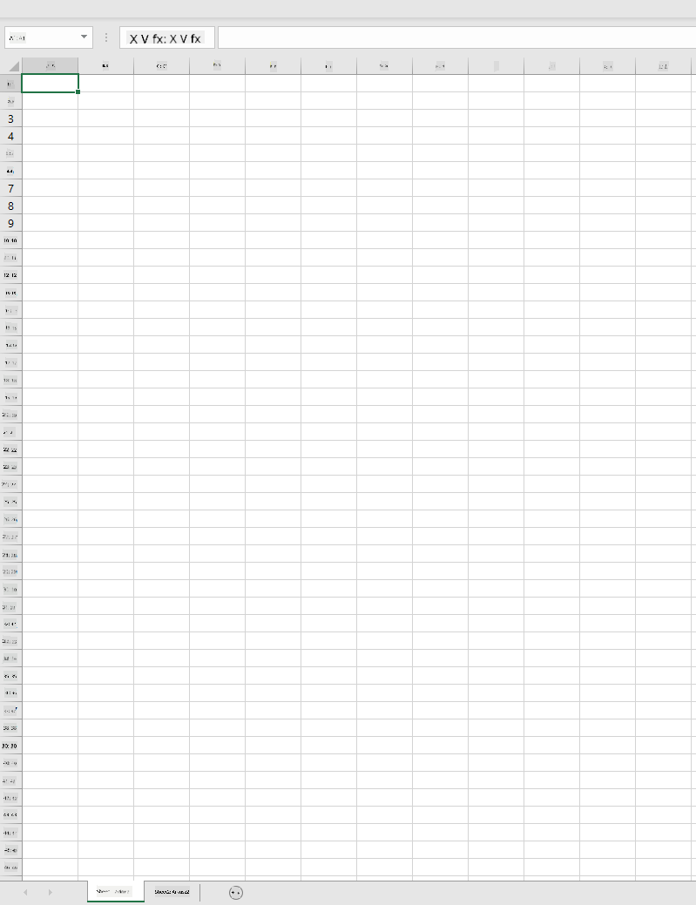
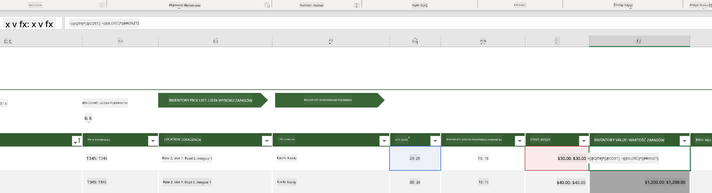
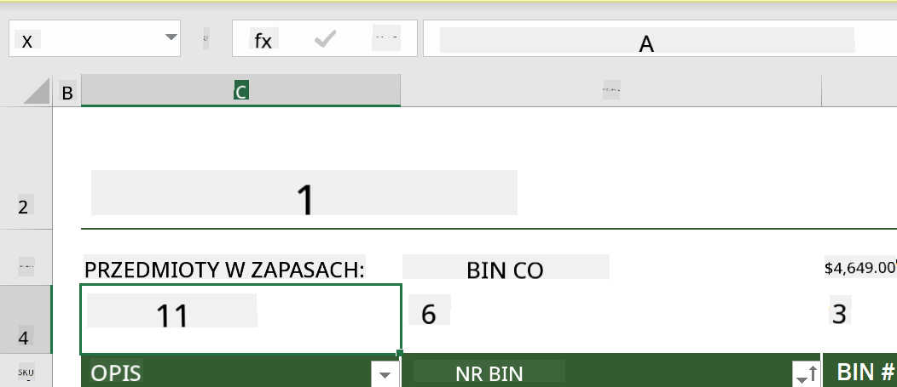
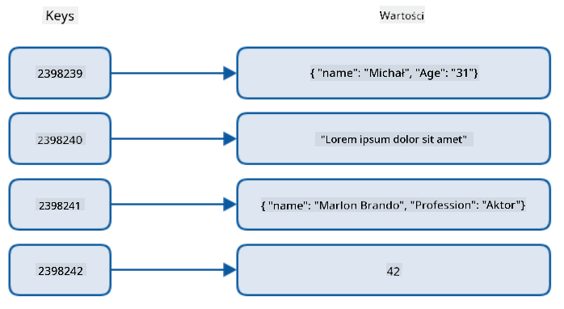
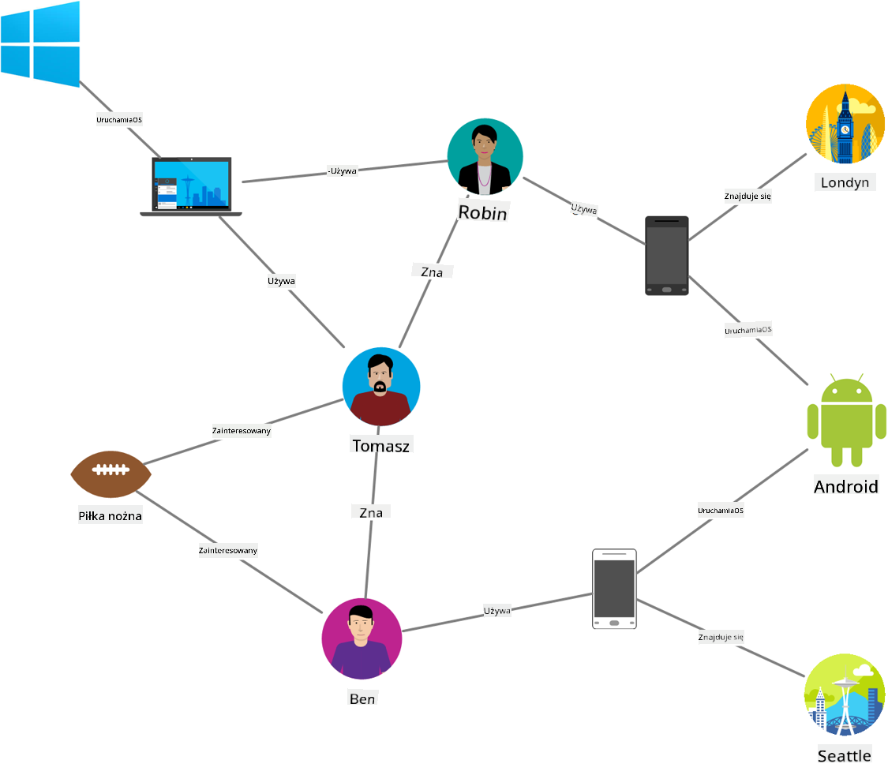
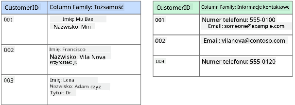
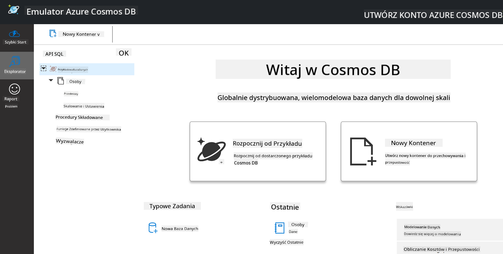
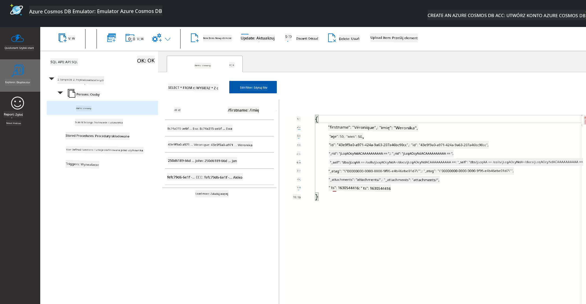
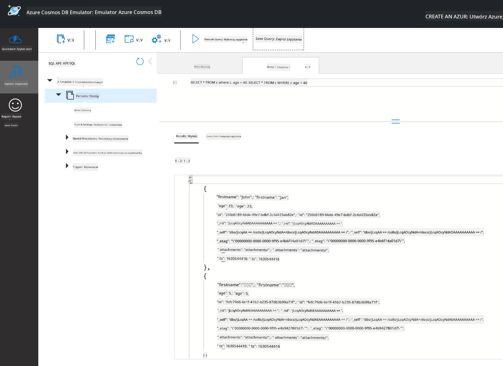

<!--
CO_OP_TRANSLATOR_METADATA:
{
  "original_hash": "32ddfef8121650f2ca2f3416fd283c37",
  "translation_date": "2025-08-24T21:12:03+00:00",
  "source_file": "2-Working-With-Data/06-non-relational/README.md",
  "language_code": "pl"
}
-->
# Praca z danymi: Dane nierelacyjne

| ](../../sketchnotes/06-NoSQL.png)|
|:---:|
|Praca z danymi NoSQL - _Sketchnote autorstwa [@nitya](https://twitter.com/nitya)_ |

## [Quiz przed wykładem](https://purple-hill-04aebfb03.1.azurestaticapps.net/quiz/10)

Dane nie ograniczają się tylko do relacyjnych baz danych. Ta lekcja koncentruje się na danych nierelacyjnych i obejmuje podstawy arkuszy kalkulacyjnych oraz NoSQL.

## Arkusze kalkulacyjne

Arkusze kalkulacyjne są popularnym sposobem przechowywania i eksploracji danych, ponieważ wymagają mniej pracy na etapie konfiguracji i rozpoczęcia pracy. W tej lekcji poznasz podstawowe elementy arkusza kalkulacyjnego, a także formuły i funkcje. Przykłady zostaną zilustrowane za pomocą Microsoft Excel, ale większość elementów i tematów będzie miała podobne nazwy i kroki w porównaniu z innym oprogramowaniem do obsługi arkuszy kalkulacyjnych.



Arkusz kalkulacyjny to plik, który będzie dostępny w systemie plików komputera, urządzenia lub w chmurowym systemie plików. Samo oprogramowanie może być przeglądarkowe lub aplikacją, którą należy zainstalować na komputerze lub pobrać jako aplikację. W Excelu te pliki są również definiowane jako **skoroszyty**, i to określenie będzie używane w dalszej części tej lekcji.

Skoroszyt zawiera jeden lub więcej **arkuszy**, z których każdy jest oznaczony zakładkami. W obrębie arkusza znajdują się prostokąty zwane **komórkami**, które zawierają właściwe dane. Komórka to przecięcie wiersza i kolumny, gdzie kolumny są oznaczone literami alfabetu, a wiersze numerami. Niektóre arkusze kalkulacyjne zawierają nagłówki w pierwszych kilku wierszach, które opisują dane w komórce.

Mając te podstawowe elementy skoroszytu Excel, wykorzystamy przykład z [Microsoft Templates](https://templates.office.com/) dotyczący inwentarza, aby przejść przez dodatkowe elementy arkusza kalkulacyjnego.

### Zarządzanie inwentarzem

Plik arkusza kalkulacyjnego o nazwie "InventoryExample" to sformatowany arkusz zawierający przedmioty w inwentarzu, który zawiera trzy arkusze, gdzie zakładki są oznaczone jako "Inventory List", "Inventory Pick List" i "Bin Lookup". Wiersz 4 arkusza Inventory List to nagłówek, który opisuje wartość każdej komórki w kolumnie nagłówka.



Zdarzają się sytuacje, w których wartość komórki zależy od wartości innych komórek. Arkusz Inventory List śledzi koszt każdego przedmiotu w inwentarzu, ale co jeśli chcemy znać wartość całego inwentarza? [**Formuły**](https://support.microsoft.com/en-us/office/overview-of-formulas-34519a4e-1e8d-4f4b-84d4-d642c4f63263) wykonują operacje na danych w komórkach i są używane do obliczania kosztu inwentarza w tym przykładzie. W tym arkuszu użyto formuły w kolumnie Inventory Value, aby obliczyć wartość każdego przedmiotu, mnożąc ilość w kolumnie QTY przez koszt w kolumnie COST. Podwójne kliknięcie lub zaznaczenie komórki pokaże formułę. Zauważysz, że formuły zaczynają się od znaku równości, po którym następuje obliczenie lub operacja.



Możemy użyć innej formuły, aby dodać wszystkie wartości z kolumny Inventory Value i uzyskać ich sumę. Można to obliczyć, dodając każdą komórkę, ale byłoby to żmudne zadanie. Excel posiada [**funkcje**](https://support.microsoft.com/en-us/office/sum-function-043e1c7d-7726-4e80-8f32-07b23e057f89), czyli predefiniowane formuły do wykonywania obliczeń na wartościach komórek. Funkcje wymagają argumentów, czyli wartości potrzebnych do wykonania obliczeń. Gdy funkcje wymagają więcej niż jednego argumentu, muszą być one podane w określonej kolejności, w przeciwnym razie funkcja może nie obliczyć poprawnej wartości. W tym przykładzie użyto funkcji SUM, która wykorzystuje wartości z kolumny Inventory Value jako argument, aby obliczyć sumę podaną w wierszu 3, kolumnie B (również określanej jako B3).

## NoSQL

NoSQL to ogólny termin obejmujący różne sposoby przechowywania danych nierelacyjnych i może być interpretowany jako "non-SQL", "nierelacyjne" lub "nie tylko SQL". Tego typu systemy baz danych można podzielić na 4 kategorie.


> Źródło: [Blog Michała Białeckiego](https://www.michalbialecki.com/2018/03/18/azure-cosmos-db-key-value-database-cloud/)

Bazy danych [klucz-wartość](https://docs.microsoft.com/en-us/azure/architecture/data-guide/big-data/non-relational-data#keyvalue-data-stores) łączą unikalne klucze, które są unikalnym identyfikatorem powiązanym z wartością. Te pary są przechowywane za pomocą [tablicy mieszającej](https://www.hackerearth.com/practice/data-structures/hash-tables/basics-of-hash-tables/tutorial/) z odpowiednią funkcją mieszającą.


> Źródło: [Microsoft](https://docs.microsoft.com/en-us/azure/cosmos-db/graph/graph-introduction#graph-database-by-example)

Bazy danych [grafowe](https://docs.microsoft.com/en-us/azure/architecture/data-guide/big-data/non-relational-data#graph-data-stores) opisują relacje w danych i są reprezentowane jako zbiór węzłów i krawędzi. Węzeł reprezentuje jednostkę, coś, co istnieje w rzeczywistości, na przykład studenta lub wyciąg bankowy. Krawędzie reprezentują relacje między dwiema jednostkami. Każdy węzeł i krawędź mają właściwości, które dostarczają dodatkowych informacji o węzłach i krawędziach.



Bazy danych [kolumnowe](https://docs.microsoft.com/en-us/azure/architecture/data-guide/big-data/non-relational-data#columnar-data-stores) organizują dane w kolumny i wiersze, podobnie jak struktura relacyjna, ale każda kolumna jest podzielona na grupy zwane rodzinami kolumn, gdzie wszystkie dane w jednej kolumnie są powiązane i mogą być pobierane oraz zmieniane jako jedna jednostka.

### Bazy danych dokumentowe z Azure Cosmos DB

Bazy danych [dokumentowe](https://docs.microsoft.com/en-us/azure/architecture/data-guide/big-data/non-relational-data#document-data-stores) opierają się na koncepcji bazy danych klucz-wartość i składają się z serii pól i obiektów. W tej sekcji przyjrzymy się bazom danych dokumentowych za pomocą emulatora Cosmos DB.

Baza danych Cosmos DB spełnia definicję "Nie tylko SQL", ponieważ baza dokumentowa Cosmos DB wykorzystuje SQL do zapytań o dane. [Poprzednia lekcja](../05-relational-databases/README.md) dotycząca SQL obejmuje podstawy tego języka, a tutaj będziemy mogli zastosować niektóre z tych samych zapytań w bazie dokumentowej. Użyjemy emulatora Cosmos DB, który pozwala na tworzenie i eksplorację bazy dokumentowej lokalnie na komputerze. Więcej informacji o emulatorze znajdziesz [tutaj](https://docs.microsoft.com/en-us/azure/cosmos-db/local-emulator?tabs=ssl-netstd21).

Dokument to zbiór pól i wartości obiektów, gdzie pola opisują, co reprezentuje wartość obiektu. Poniżej znajduje się przykład dokumentu.

```json
{
    "firstname": "Eva",
    "age": 44,
    "id": "8c74a315-aebf-4a16-bb38-2430a9896ce5",
    "_rid": "bHwDAPQz8s0BAAAAAAAAAA==",
    "_self": "dbs/bHwDAA==/colls/bHwDAPQz8s0=/docs/bHwDAPQz8s0BAAAAAAAAAA==/",
    "_etag": "\"00000000-0000-0000-9f95-010a691e01d7\"",
    "_attachments": "attachments/",
    "_ts": 1630544034
}
```

Pola, które nas interesują w tym dokumencie, to: `firstname`, `id` i `age`. Pozostałe pola z podkreśleniami zostały wygenerowane przez Cosmos DB.

#### Eksploracja danych za pomocą emulatora Cosmos DB

Możesz pobrać i zainstalować emulator [dla systemu Windows tutaj](https://aka.ms/cosmosdb-emulator). Zapoznaj się z tą [dokumentacją](https://docs.microsoft.com/en-us/azure/cosmos-db/local-emulator?tabs=ssl-netstd21#run-on-linux-macos), aby dowiedzieć się, jak uruchomić emulator na macOS i Linux.

Emulator uruchamia okno przeglądarki, w którym widok Explorer pozwala na eksplorację dokumentów.



Jeśli podążasz za instrukcjami, kliknij "Start with Sample", aby wygenerować przykładową bazę danych o nazwie SampleDB. Jeśli rozwiniesz SampleDB, klikając strzałkę, znajdziesz kontener o nazwie `Persons`. Kontener przechowuje kolekcję elementów, które są dokumentami w kontenerze. Możesz eksplorować cztery indywidualne dokumenty w sekcji `Items`.



#### Zapytania o dane dokumentowe za pomocą emulatora Cosmos DB

Możemy również wykonywać zapytania o przykładowe dane, klikając przycisk "New SQL Query" (drugi przycisk od lewej).

`SELECT * FROM c` zwraca wszystkie dokumenty w kontenerze. Dodajmy klauzulę WHERE, aby znaleźć wszystkich, którzy mają mniej niż 40 lat.

`SELECT * FROM c where c.age < 40`



Zapytanie zwraca dwa dokumenty, zauważ, że wartość pola age dla każdego dokumentu jest mniejsza niż 40.

#### JSON i dokumenty

Jeśli znasz JavaScript Object Notation (JSON), zauważysz, że dokumenty wyglądają podobnie do JSON. W tym katalogu znajduje się plik `PersonsData.json` z dodatkowymi danymi, które możesz przesłać do kontenera Persons w emulatorze za pomocą przycisku `Upload Item`.

W większości przypadków API zwracające dane w formacie JSON mogą być bezpośrednio przeniesione i przechowywane w bazach danych dokumentowych. Poniżej znajduje się kolejny dokument, który reprezentuje tweety z konta Microsoft na Twitterze, pobrane za pomocą API Twittera, a następnie wstawione do Cosmos DB.

```json
{
    "created_at": "2021-08-31T19:03:01.000Z",
    "id": "1432780985872142341",
    "text": "Blank slate. Like this tweet if you’ve ever painted in Microsoft Paint before. https://t.co/cFeEs8eOPK",
    "_rid": "dhAmAIUsA4oHAAAAAAAAAA==",
    "_self": "dbs/dhAmAA==/colls/dhAmAIUsA4o=/docs/dhAmAIUsA4oHAAAAAAAAAA==/",
    "_etag": "\"00000000-0000-0000-9f84-a0958ad901d7\"",
    "_attachments": "attachments/",
    "_ts": 1630537000
```

Pola, które nas interesują w tym dokumencie, to: `created_at`, `id` i `text`.

## 🚀 Wyzwanie

W katalogu znajduje się plik `TwitterData.json`, który możesz przesłać do bazy danych SampleDB. Zaleca się dodanie go do osobnego kontenera. Można to zrobić, wykonując następujące kroki:

1. Kliknij przycisk "New Container" w prawym górnym rogu.
2. Wybierz istniejącą bazę danych (SampleDB), utwórz identyfikator kontenera.
3. Ustaw klucz partycji na `/id`.
4. Kliknij OK (możesz zignorować resztę informacji w tym widoku, ponieważ jest to mały zbiór danych uruchamiany lokalnie na Twoim komputerze).
5. Otwórz nowy kontener i prześlij plik Twitter Data za pomocą przycisku `Upload Item`.

Spróbuj wykonać kilka zapytań SELECT, aby znaleźć dokumenty zawierające słowo "Microsoft" w polu text. Wskazówka: spróbuj użyć [słowa kluczowego LIKE](https://docs.microsoft.com/en-us/azure/cosmos-db/sql/sql-query-keywords#using-like-with-the--wildcard-character).

## [Quiz po wykładzie](https://purple-hill-04aebfb03.1.azurestaticapps.net/quiz/11)

## Przegląd i samodzielna nauka

- W tym arkuszu kalkulacyjnym dodano dodatkowe formatowanie i funkcje, które nie zostały omówione w tej lekcji. Microsoft posiada [obszerną bibliotekę dokumentacji i filmów](https://support.microsoft.com/excel) na temat Excela, jeśli chcesz dowiedzieć się więcej.

- Ta dokumentacja architektoniczna szczegółowo opisuje cechy różnych typów danych nierelacyjnych: [Dane nierelacyjne i NoSQL](https://docs.microsoft.com/en-us/azure/architecture/data-guide/big-data/non-relational-data).

- Cosmos DB to chmurowa baza danych nierelacyjnych, która może również przechowywać różne typy NoSQL wspomniane w tej lekcji. Dowiedz się więcej o tych typach w tym [module Microsoft Learn dotyczącym Cosmos DB](https://docs.microsoft.com/en-us/learn/paths/work-with-nosql-data-in-azure-cosmos-db/).

## Zadanie

[Soda Profits](assignment.md)

**Zastrzeżenie**:  
Ten dokument został przetłumaczony za pomocą usługi tłumaczenia AI [Co-op Translator](https://github.com/Azure/co-op-translator). Chociaż staramy się zapewnić dokładność, prosimy mieć na uwadze, że automatyczne tłumaczenia mogą zawierać błędy lub nieścisłości. Oryginalny dokument w jego rodzimym języku powinien być uznawany za wiarygodne źródło. W przypadku informacji krytycznych zaleca się skorzystanie z profesjonalnego tłumaczenia przez człowieka. Nie ponosimy odpowiedzialności za jakiekolwiek nieporozumienia lub błędne interpretacje wynikające z użycia tego tłumaczenia.