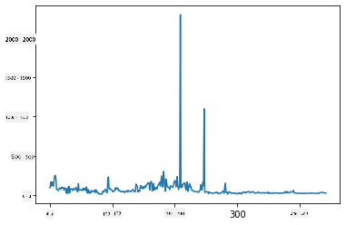
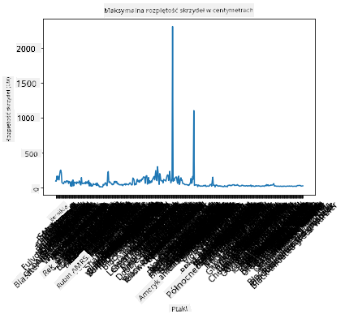
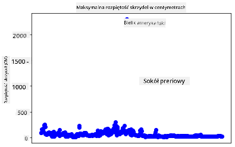
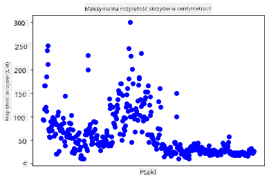
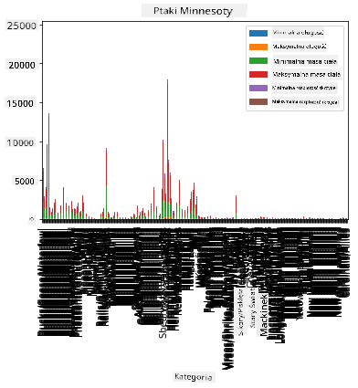
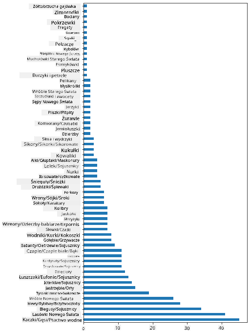
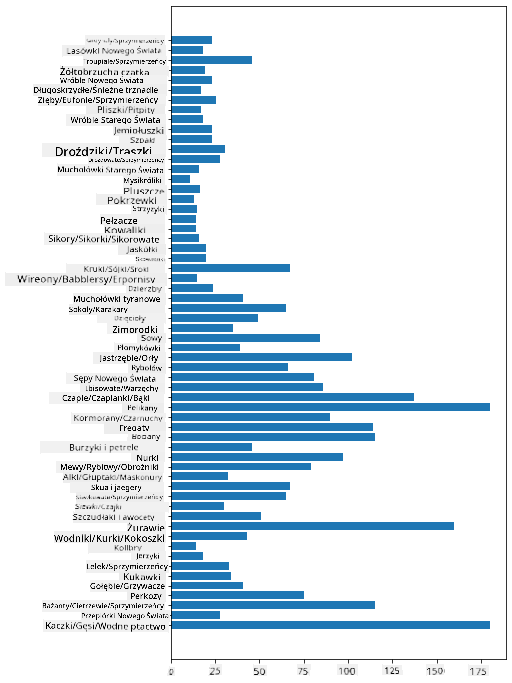
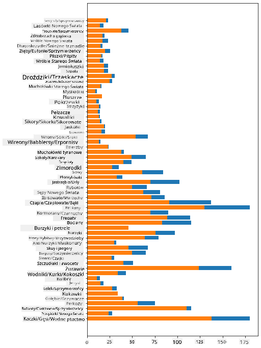

<!--
CO_OP_TRANSLATOR_METADATA:
{
  "original_hash": "43c402d9d90ae6da55d004519ada5033",
  "translation_date": "2025-08-24T23:02:26+00:00",
  "source_file": "3-Data-Visualization/09-visualization-quantities/README.md",
  "language_code": "pl"
}
-->
# Wizualizacja ilości

| ](../../sketchnotes/09-Visualizing-Quantities.png)|
|:---:|
| Wizualizacja ilości - _Sketchnote autorstwa [@nitya](https://twitter.com/nitya)_ |

W tej lekcji dowiesz się, jak korzystać z jednej z wielu dostępnych bibliotek Pythona, aby tworzyć interesujące wizualizacje związane z pojęciem ilości. Korzystając z oczyszczonego zbioru danych o ptakach z Minnesoty, możesz odkryć wiele ciekawych faktów o lokalnej faunie.  
## [Quiz przed wykładem](https://purple-hill-04aebfb03.1.azurestaticapps.net/quiz/16)

## Obserwacja rozpiętości skrzydeł za pomocą Matplotlib

Doskonałą biblioteką do tworzenia zarówno prostych, jak i zaawansowanych wykresów i diagramów jest [Matplotlib](https://matplotlib.org/stable/index.html). Ogólnie rzecz biorąc, proces tworzenia wykresów za pomocą tych bibliotek obejmuje identyfikację części ramki danych, które chcesz przeanalizować, wykonanie niezbędnych transformacji danych, przypisanie wartości osi x i y, wybór rodzaju wykresu oraz jego wyświetlenie. Matplotlib oferuje szeroką gamę wizualizacji, ale w tej lekcji skupimy się na tych najbardziej odpowiednich do wizualizacji ilości: wykresach liniowych, punktowych i słupkowych.

> ✅ Wybierz najlepszy wykres, który pasuje do struktury danych i historii, którą chcesz opowiedzieć.  
> - Aby analizować trendy w czasie: wykres liniowy  
> - Aby porównywać wartości: wykres słupkowy, kolumnowy, kołowy, punktowy  
> - Aby pokazać, jak części odnoszą się do całości: wykres kołowy  
> - Aby pokazać rozkład danych: wykres punktowy, słupkowy  
> - Aby pokazać trendy: wykres liniowy, kolumnowy  
> - Aby pokazać relacje między wartościami: wykres liniowy, punktowy, bąbelkowy  

Jeśli masz zbiór danych i chcesz dowiedzieć się, ile jest danego elementu, jednym z pierwszych zadań będzie sprawdzenie jego wartości.

✅ Dostępne są bardzo dobre „ściągi” dla Matplotlib [tutaj](https://matplotlib.org/cheatsheets/cheatsheets.pdf).

## Tworzenie wykresu liniowego dla wartości rozpiętości skrzydeł ptaków

Otwórz plik `notebook.ipynb` znajdujący się w głównym katalogu tej lekcji i dodaj komórkę.

> Uwaga: dane są przechowywane w głównym katalogu tego repozytorium w folderze `/data`.

```python
import pandas as pd
import matplotlib.pyplot as plt
birds = pd.read_csv('../../data/birds.csv')
birds.head()
```  
Te dane to mieszanka tekstu i liczb:

|      | Nazwa                        | NazwaNaukowa           | Kategoria             | Rząd         | Rodzina  | Rodzaj      | StatusOchrony       | MinDługość | MaxDługość | MinMasaCiała | MaxMasaCiała | MinRozpiętość | MaxRozpiętość |
| ---: | :--------------------------- | :--------------------- | :-------------------- | :----------- | :------- | :---------- | :----------------- | --------: | --------: | ----------: | ----------: | ----------: | ----------: |
|    0 | Czarnobrzuchy gwizdacz       | Dendrocygna autumnalis | Kaczki/Gęsi/Wodnoptaki | Anseriformes | Anatidae | Dendrocygna | LC                 |        47 |        56 |         652 |        1020 |          76 |          94 |
|    1 | Płowy gwizdacz               | Dendrocygna bicolor    | Kaczki/Gęsi/Wodnoptaki | Anseriformes | Anatidae | Dendrocygna | LC                 |        45 |        53 |         712 |        1050 |          85 |          93 |
|    2 | Śnieżna gęś                  | Anser caerulescens     | Kaczki/Gęsi/Wodnoptaki | Anseriformes | Anatidae | Anser       | LC                 |        64 |        79 |        2050 |        4050 |         135 |         165 |
|    3 | Gęś Rossa                    | Anser rossii           | Kaczki/Gęsi/Wodnoptaki | Anseriformes | Anatidae | Anser       | LC                 |      57.3 |        64 |        1066 |        1567 |         113 |         116 |
|    4 | Białoczelna gęś              | Anser albifrons        | Kaczki/Gęsi/Wodnoptaki | Anseriformes | Anatidae | Anser       | LC                 |        64 |        81 |        1930 |        3310 |         130 |         165 |

Zacznijmy od wykreślenia niektórych danych liczbowych za pomocą podstawowego wykresu liniowego. Załóżmy, że chcesz zobaczyć maksymalną rozpiętość skrzydeł tych interesujących ptaków.

```python
wingspan = birds['MaxWingspan'] 
wingspan.plot()
```  


Co zauważasz od razu? Wydaje się, że jest przynajmniej jeden punkt odstający – to całkiem imponująca rozpiętość skrzydeł! Rozpiętość skrzydeł wynosząca 2300 centymetrów to 23 metry – czy w Minnesocie latają pterodaktyle? Zbadajmy to.

Chociaż możesz szybko posortować dane w Excelu, aby znaleźć te punkty odstające, kontynuuj proces wizualizacji, pracując bezpośrednio na wykresie.

Dodaj etykiety do osi x, aby pokazać, o jakie ptaki chodzi:

```
plt.title('Max Wingspan in Centimeters')
plt.ylabel('Wingspan (CM)')
plt.xlabel('Birds')
plt.xticks(rotation=45)
x = birds['Name'] 
y = birds['MaxWingspan']

plt.plot(x, y)

plt.show()
```  


Nawet przy obrocie etykiet o 45 stopni jest ich zbyt wiele, aby były czytelne. Spróbujmy innej strategii: oznacz tylko te punkty odstające i ustaw etykiety na wykresie. Możesz użyć wykresu punktowego, aby zrobić więcej miejsca na etykiety:

```python
plt.title('Max Wingspan in Centimeters')
plt.ylabel('Wingspan (CM)')
plt.tick_params(axis='both',which='both',labelbottom=False,bottom=False)

for i in range(len(birds)):
    x = birds['Name'][i]
    y = birds['MaxWingspan'][i]
    plt.plot(x, y, 'bo')
    if birds['MaxWingspan'][i] > 500:
        plt.text(x, y * (1 - 0.05), birds['Name'][i], fontsize=12)
    
plt.show()
```  
Co tu się dzieje? Użyłeś `tick_params`, aby ukryć dolne etykiety, a następnie stworzyłeś pętlę nad zbiorem danych o ptakach. Tworząc wykres z małymi niebieskimi kropkami za pomocą `bo`, sprawdziłeś, czy którykolwiek ptak ma maksymalną rozpiętość skrzydeł powyżej 500, i wyświetliłeś jego etykietę obok kropki, jeśli tak. Przesunąłeś etykiety nieco na osi y (`y * (1 - 0.05)`) i użyłeś nazwy ptaka jako etykiety.

Co odkryłeś?

  
## Filtrowanie danych

Zarówno Bielik amerykański, jak i Sokoł preriowy, choć prawdopodobnie bardzo duże ptaki, wydają się mieć błędnie oznaczone dane, z dodatkowym `0` w maksymalnej rozpiętości skrzydeł. Mało prawdopodobne, abyś spotkał Bielika o rozpiętości skrzydeł 25 metrów, ale jeśli tak, daj nam znać! Stwórzmy nową ramkę danych bez tych dwóch punktów odstających:

```python
plt.title('Max Wingspan in Centimeters')
plt.ylabel('Wingspan (CM)')
plt.xlabel('Birds')
plt.tick_params(axis='both',which='both',labelbottom=False,bottom=False)
for i in range(len(birds)):
    x = birds['Name'][i]
    y = birds['MaxWingspan'][i]
    if birds['Name'][i] not in ['Bald eagle', 'Prairie falcon']:
        plt.plot(x, y, 'bo')
plt.show()
```  

Po odfiltrowaniu punktów odstających dane są teraz bardziej spójne i zrozumiałe.



Teraz, gdy mamy czystszy zbiór danych przynajmniej pod względem rozpiętości skrzydeł, odkryjmy więcej o tych ptakach.

Chociaż wykresy liniowe i punktowe mogą przedstawiać informacje o wartościach danych i ich rozkładzie, chcemy zastanowić się nad wartościami zawartymi w tym zbiorze danych. Możesz stworzyć wizualizacje, aby odpowiedzieć na następujące pytania dotyczące ilości:

> Ile jest kategorii ptaków i jakie są ich liczby?  
> Ile ptaków jest wymarłych, zagrożonych, rzadkich lub pospolitych?  
> Ile jest różnych rodzajów i rzędów w terminologii Linneusza?  
## Eksploracja wykresów słupkowych

Wykresy słupkowe są praktyczne, gdy chcesz pokazać grupowanie danych. Przyjrzyjmy się kategoriom ptaków w tym zbiorze danych, aby zobaczyć, która z nich jest najliczniejsza.

W pliku notebooka stwórz podstawowy wykres słupkowy.

✅ Uwaga, możesz albo odfiltrować dwa ptaki odstające, które zidentyfikowaliśmy w poprzedniej sekcji, poprawić błąd w ich rozpiętości skrzydeł, albo pozostawić je w danych do tych ćwiczeń, które nie zależą od wartości rozpiętości skrzydeł.

Jeśli chcesz stworzyć wykres słupkowy, możesz wybrać dane, na których chcesz się skupić. Wykresy słupkowe można tworzyć z surowych danych:

```python
birds.plot(x='Category',
        kind='bar',
        stacked=True,
        title='Birds of Minnesota')

```  


Ten wykres słupkowy jest jednak nieczytelny, ponieważ zawiera zbyt wiele niepogrupowanych danych. Musisz wybrać tylko dane, które chcesz przedstawić, więc przyjrzyjmy się długości ptaków w zależności od ich kategorii.

Przefiltruj dane, aby uwzględnić tylko kategorię ptaków.

✅ Zauważ, że używasz Pandas do zarządzania danymi, a następnie pozwalasz Matplotlib na tworzenie wykresów.

Ponieważ istnieje wiele kategorii, możesz wyświetlić ten wykres pionowo i dostosować jego wysokość, aby uwzględnić wszystkie dane:

```python
category_count = birds.value_counts(birds['Category'].values, sort=True)
plt.rcParams['figure.figsize'] = [6, 12]
category_count.plot.barh()
```  


Ten wykres słupkowy pokazuje dobry obraz liczby ptaków w każdej kategorii. Na pierwszy rzut oka widać, że największa liczba ptaków w tym regionie należy do kategorii Kaczki/Gęsi/Wodnoptaki. Minnesota to „kraina 10 000 jezior”, więc to nie jest zaskakujące!

✅ Wypróbuj inne liczenia w tym zbiorze danych. Czy coś Cię zaskoczyło?

## Porównywanie danych

Możesz spróbować różnych porównań pogrupowanych danych, tworząc nowe osie. Spróbuj porównać MaxDługość ptaka w zależności od jego kategorii:

```python
maxlength = birds['MaxLength']
plt.barh(y=birds['Category'], width=maxlength)
plt.rcParams['figure.figsize'] = [6, 12]
plt.show()
```  


Nic zaskakującego tutaj: kolibry mają najmniejszą MaxDługość w porównaniu do pelikanów czy gęsi. Dobrze, gdy dane mają logiczny sens!

Możesz tworzyć bardziej interesujące wizualizacje wykresów słupkowych, nakładając dane. Nałóż Minimalną i Maksymalną Długość na daną kategorię ptaków:

```python
minLength = birds['MinLength']
maxLength = birds['MaxLength']
category = birds['Category']

plt.barh(category, maxLength)
plt.barh(category, minLength)

plt.show()
```  
Na tym wykresie możesz zobaczyć zakres dla każdej kategorii ptaków w odniesieniu do Minimalnej i Maksymalnej Długości. Możesz śmiało powiedzieć, że na podstawie tych danych, im większy ptak, tym większy zakres jego długości. Fascynujące!



## 🚀 Wyzwanie

Ten zbiór danych o ptakach oferuje bogactwo informacji o różnych typach ptaków w danym ekosystemie. Poszukaj w internecie innych zbiorów danych dotyczących ptaków. Ćwicz tworzenie wykresów i diagramów dotyczących tych ptaków, aby odkryć fakty, których wcześniej nie znałeś.  
## [Quiz po wykładzie](https://purple-hill-04aebfb03.1.azurestaticapps.net/quiz/17)

## Przegląd i samodzielna nauka

Ta pierwsza lekcja dostarczyła Ci informacji o tym, jak korzystać z Matplotlib do wizualizacji ilości. Poszukaj innych sposobów pracy ze zbiorami danych w celu wizualizacji. [Plotly](https://github.com/plotly/plotly.py) to narzędzie, którego nie omówimy w tych lekcjach, więc sprawdź, co może zaoferować.  
## Zadanie

[Linie, punkty i słupki](assignment.md)  

**Zastrzeżenie**:  
Ten dokument został przetłumaczony za pomocą usługi tłumaczenia AI [Co-op Translator](https://github.com/Azure/co-op-translator). Chociaż dokładamy wszelkich starań, aby zapewnić poprawność tłumaczenia, prosimy pamiętać, że automatyczne tłumaczenia mogą zawierać błędy lub nieścisłości. Oryginalny dokument w jego rodzimym języku powinien być uznawany za wiarygodne źródło. W przypadku informacji o kluczowym znaczeniu zaleca się skorzystanie z profesjonalnego tłumaczenia przez człowieka. Nie ponosimy odpowiedzialności za jakiekolwiek nieporozumienia lub błędne interpretacje wynikające z użycia tego tłumaczenia.