<!--
CO_OP_TRANSLATOR_METADATA:
{
  "original_hash": "02ce904bc1e2bfabb7dc05c25aae375c",
  "translation_date": "2025-09-04T14:47:13+00:00",
  "source_file": "3-Data-Visualization/10-visualization-distributions/README.md",
  "language_code": "pl"
}
-->
# Wizualizacja rozkładów

| ](../../sketchnotes/10-Visualizing-Distributions.png)|
|:---:|
| Wizualizacja rozkładów - _Sketchnote autorstwa [@nitya](https://twitter.com/nitya)_ |

W poprzedniej lekcji poznałeś kilka interesujących faktów dotyczących zbioru danych o ptakach z Minnesoty. Zidentyfikowałeś błędne dane, wizualizując wartości odstające, oraz przyjrzałeś się różnicom między kategoriami ptaków na podstawie ich maksymalnej długości.

## [Quiz przed wykładem](https://purple-hill-04aebfb03.1.azurestaticapps.net/quiz/18)
## Eksploracja zbioru danych o ptakach

Innym sposobem na zgłębianie danych jest analiza ich rozkładu, czyli tego, jak dane są zorganizowane wzdłuż osi. Być może chciałbyś dowiedzieć się, jak wygląda ogólny rozkład maksymalnej rozpiętości skrzydeł lub maksymalnej masy ciała ptaków z Minnesoty w tym zbiorze danych.

Odkryjmy kilka faktów dotyczących rozkładów danych w tym zbiorze. W pliku _notebook.ipynb_ znajdującym się w głównym folderze tej lekcji zaimportuj Pandas, Matplotlib i swoje dane:

```python
import pandas as pd
import matplotlib.pyplot as plt
birds = pd.read_csv('../../data/birds.csv')
birds.head()
```

|      | Nazwa                        | NazwaNaukowa           | Kategoria             | Rząd         | Rodzina  | Rodzaj      | StatusOchrony       | MinDługość | MaxDługość | MinMasaCiała | MaxMasaCiała | MinRozpiętość | MaxRozpiętość |
| ---: | :--------------------------- | :--------------------- | :-------------------- | :----------- | :------- | :---------- | :----------------- | --------: | --------: | ----------: | ----------: | ----------: | ----------: |
|    0 | Czarnobrzuchy gwizdacz       | Dendrocygna autumnalis | Kaczki/Gęsi/Wodniczki | Anseriformes | Anatidae | Dendrocygna | LC                 |        47 |        56 |         652 |        1020 |          76 |          94 |
|    1 | Płowy gwizdacz               | Dendrocygna bicolor    | Kaczki/Gęsi/Wodniczki | Anseriformes | Anatidae | Dendrocygna | LC                 |        45 |        53 |         712 |        1050 |          85 |          93 |
|    2 | Gęś śnieżna                  | Anser caerulescens     | Kaczki/Gęsi/Wodniczki | Anseriformes | Anatidae | Anser       | LC                 |        64 |        79 |        2050 |        4050 |         135 |         165 |
|    3 | Gęś Rossa                    | Anser rossii           | Kaczki/Gęsi/Wodniczki | Anseriformes | Anatidae | Anser       | LC                 |      57.3 |        64 |        1066 |        1567 |         113 |         116 |
|    4 | Gęś białoczelna              | Anser albifrons        | Kaczki/Gęsi/Wodniczki | Anseriformes | Anatidae | Anser       | LC                 |        64 |        81 |        1930 |        3310 |         130 |         165 |

Ogólnie rzecz biorąc, możesz szybko przyjrzeć się rozkładowi danych, używając wykresu punktowego, jak to zrobiliśmy w poprzedniej lekcji:

```python
birds.plot(kind='scatter',x='MaxLength',y='Order',figsize=(12,8))

plt.title('Max Length per Order')
plt.ylabel('Order')
plt.xlabel('Max Length')

plt.show()
```
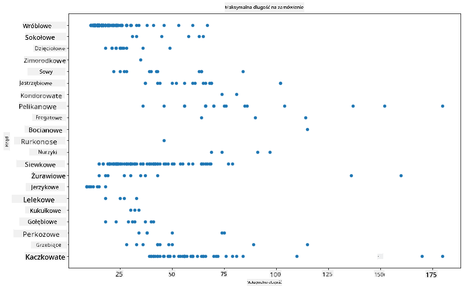

To daje ogólny obraz rozkładu długości ciała w zależności od rzędu ptaków, ale nie jest to optymalny sposób na przedstawienie prawdziwych rozkładów. Do tego celu najlepiej nadaje się histogram.

## Praca z histogramami

Matplotlib oferuje bardzo dobre narzędzia do wizualizacji rozkładów danych za pomocą histogramów. Ten typ wykresu przypomina wykres słupkowy, gdzie rozkład można zobaczyć poprzez wzrost i spadek słupków. Aby stworzyć histogram, potrzebujesz danych liczbowych. Histogram można utworzyć, definiując typ wykresu jako 'hist'. Taki wykres pokazuje rozkład maksymalnej masy ciała w całym zakresie danych liczbowych w zbiorze. Dzieląc tablicę danych na mniejsze przedziały (tzw. bins), można zobaczyć rozkład wartości danych:

```python
birds['MaxBodyMass'].plot(kind = 'hist', bins = 10, figsize = (12,12))
plt.show()
```
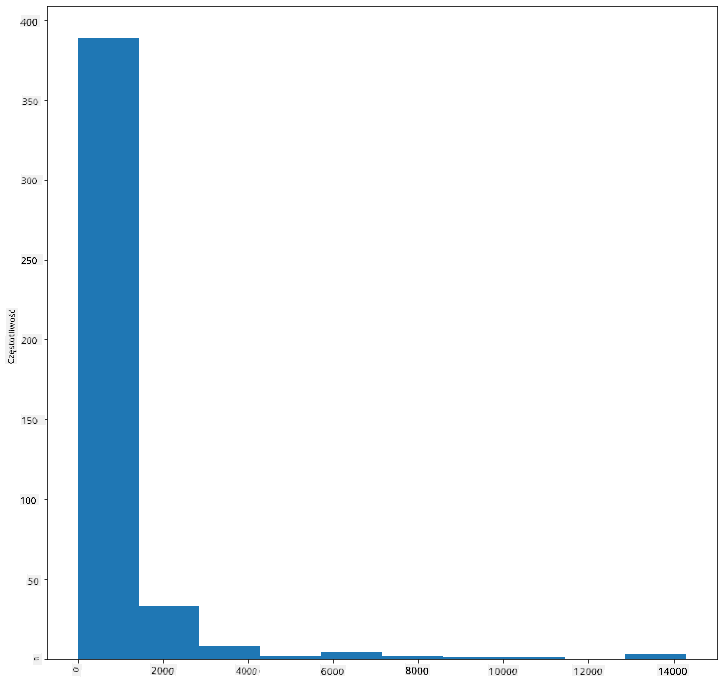

Jak widać, większość z ponad 400 ptaków w tym zbiorze danych ma maksymalną masę ciała poniżej 2000. Możesz uzyskać więcej informacji, zmieniając parametr `bins` na wyższą wartość, na przykład 30:

```python
birds['MaxBodyMass'].plot(kind = 'hist', bins = 30, figsize = (12,12))
plt.show()
```
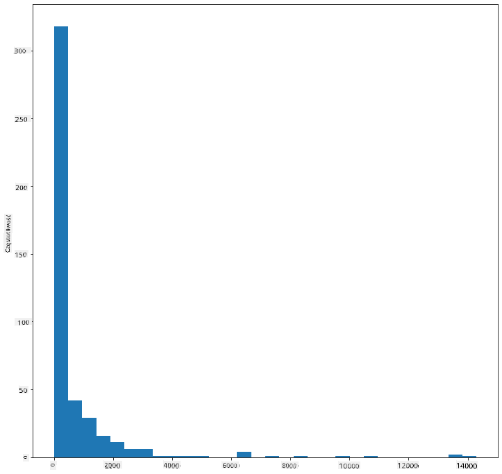

Ten wykres pokazuje rozkład w bardziej szczegółowy sposób. Można stworzyć mniej przesunięty w lewo wykres, wybierając dane tylko z określonego zakresu:

Przefiltruj dane, aby uzyskać tylko te ptaki, których masa ciała jest mniejsza niż 60, i pokaż 40 `bins`:

```python
filteredBirds = birds[(birds['MaxBodyMass'] > 1) & (birds['MaxBodyMass'] < 60)]      
filteredBirds['MaxBodyMass'].plot(kind = 'hist',bins = 40,figsize = (12,12))
plt.show()     
```
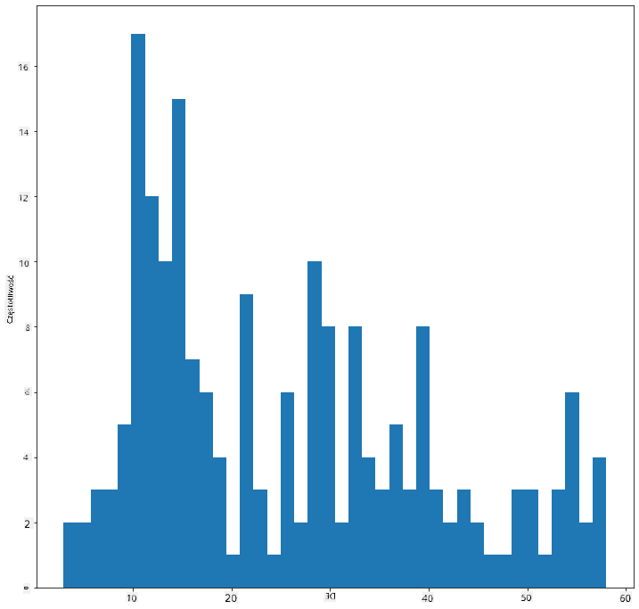

✅ Wypróbuj inne filtry i punkty danych. Aby zobaczyć pełny rozkład danych, usuń filtr `['MaxBodyMass']`, aby pokazać rozkłady z etykietami.

Histogram oferuje również ciekawe opcje kolorystyczne i etykietowania:

Stwórz histogram 2D, aby porównać relację między dwoma rozkładami. Porównajmy `MaxBodyMass` z `MaxLength`. Matplotlib oferuje wbudowany sposób na pokazanie zbieżności za pomocą jaśniejszych kolorów:

```python
x = filteredBirds['MaxBodyMass']
y = filteredBirds['MaxLength']

fig, ax = plt.subplots(tight_layout=True)
hist = ax.hist2d(x, y)
```
Widać oczekiwaną korelację między tymi dwoma elementami wzdłuż przewidywanej osi, z jednym szczególnie silnym punktem zbieżności:

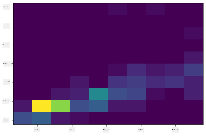

Histogramy dobrze sprawdzają się w przypadku danych liczbowych. Co jednak, jeśli chcesz zobaczyć rozkłady według danych tekstowych? 
## Eksploracja zbioru danych pod kątem rozkładów z użyciem danych tekstowych 

Ten zbiór danych zawiera również informacje o kategorii ptaków, ich rodzaju, gatunku, rodzinie oraz statusie ochrony. Przyjrzyjmy się bliżej informacjom o statusie ochrony. Jaki jest rozkład ptaków według ich statusu ochrony?

> ✅ W zbiorze danych używane są różne skróty opisujące status ochrony. Skróty te pochodzą z [Czerwonej Listy IUCN](https://www.iucnredlist.org/), organizacji katalogującej status gatunków.
> 
> - CR: Krytycznie zagrożony
> - EN: Zagrożony
> - EX: Wymarły
> - LC: Najmniejszej troski
> - NT: Bliski zagrożenia
> - VU: Wrażliwy

Są to wartości tekstowe, więc konieczna będzie ich transformacja, aby stworzyć histogram. Używając ramki danych `filteredBirds`, wyświetl jej status ochrony w zestawieniu z minimalną rozpiętością skrzydeł. Co zauważasz? 

```python
x1 = filteredBirds.loc[filteredBirds.ConservationStatus=='EX', 'MinWingspan']
x2 = filteredBirds.loc[filteredBirds.ConservationStatus=='CR', 'MinWingspan']
x3 = filteredBirds.loc[filteredBirds.ConservationStatus=='EN', 'MinWingspan']
x4 = filteredBirds.loc[filteredBirds.ConservationStatus=='NT', 'MinWingspan']
x5 = filteredBirds.loc[filteredBirds.ConservationStatus=='VU', 'MinWingspan']
x6 = filteredBirds.loc[filteredBirds.ConservationStatus=='LC', 'MinWingspan']

kwargs = dict(alpha=0.5, bins=20)

plt.hist(x1, **kwargs, color='red', label='Extinct')
plt.hist(x2, **kwargs, color='orange', label='Critically Endangered')
plt.hist(x3, **kwargs, color='yellow', label='Endangered')
plt.hist(x4, **kwargs, color='green', label='Near Threatened')
plt.hist(x5, **kwargs, color='blue', label='Vulnerable')
plt.hist(x6, **kwargs, color='gray', label='Least Concern')

plt.gca().set(title='Conservation Status', ylabel='Min Wingspan')
plt.legend();
```

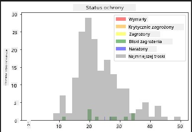

Nie wydaje się, aby istniała wyraźna korelacja między minimalną rozpiętością skrzydeł a statusem ochrony. Przetestuj inne elementy zbioru danych, używając tej metody. Możesz również wypróbować różne filtry. Czy znajdujesz jakąś korelację?

## Wykresy gęstości

Być może zauważyłeś, że histogramy, które do tej pory oglądaliśmy, są „schodkowe” i nie tworzą płynnego łuku. Aby pokazać bardziej płynny wykres gęstości, możesz spróbować wykresu gęstości.

Aby pracować z wykresami gęstości, zapoznaj się z nową biblioteką do tworzenia wykresów, [Seaborn](https://seaborn.pydata.org/generated/seaborn.kdeplot.html). 

Ładując Seaborn, spróbuj stworzyć podstawowy wykres gęstości:

```python
import seaborn as sns
import matplotlib.pyplot as plt
sns.kdeplot(filteredBirds['MinWingspan'])
plt.show()
```
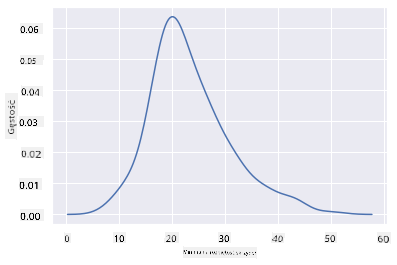

Widać, że wykres odzwierciedla poprzedni dla danych o minimalnej rozpiętości skrzydeł; jest po prostu bardziej płynny. Według dokumentacji Seaborn: „W porównaniu do histogramu, KDE może stworzyć wykres, który jest mniej zagracony i bardziej czytelny, szczególnie przy rysowaniu wielu rozkładów. Jednak może wprowadzać zniekształcenia, jeśli rozkład bazowy jest ograniczony lub nie jest płynny. Podobnie jak histogram, jakość reprezentacji zależy również od wyboru odpowiednich parametrów wygładzania.” [źródło](https://seaborn.pydata.org/generated/seaborn.kdeplot.html) Innymi słowy, wartości odstające, jak zawsze, mogą negatywnie wpłynąć na wykresy.

Jeśli chciałbyś ponownie przyjrzeć się temu poszarpanemu wykresowi maksymalnej masy ciała z drugiego wykresu, możesz go bardzo dobrze wygładzić, odtwarzając go za pomocą tej metody:

```python
sns.kdeplot(filteredBirds['MaxBodyMass'])
plt.show()
```
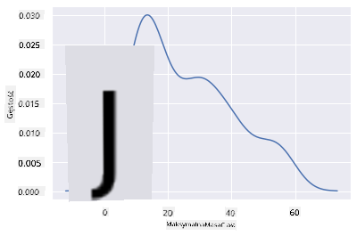

Jeśli chciałbyś uzyskać linię płynną, ale nie zbyt płynną, edytuj parametr `bw_adjust`: 

```python
sns.kdeplot(filteredBirds['MaxBodyMass'], bw_adjust=.2)
plt.show()
```
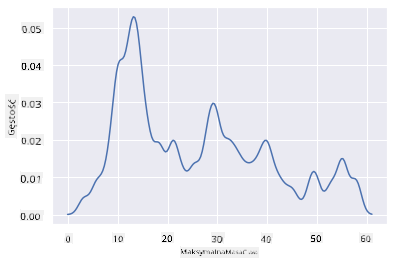

✅ Przeczytaj o dostępnych parametrach dla tego typu wykresu i eksperymentuj!

Ten typ wykresu oferuje piękne i wyjaśniające wizualizacje. Na przykład za pomocą kilku linii kodu możesz pokazać gęstość maksymalnej masy ciała w zależności od rzędu ptaków:

```python
sns.kdeplot(
   data=filteredBirds, x="MaxBodyMass", hue="Order",
   fill=True, common_norm=False, palette="crest",
   alpha=.5, linewidth=0,
)
```

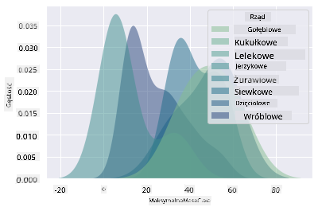

Możesz również mapować gęstość kilku zmiennych na jednym wykresie. Porównaj maksymalną i minimalną długość ptaka w zależności od jego statusu ochrony:

```python
sns.kdeplot(data=filteredBirds, x="MinLength", y="MaxLength", hue="ConservationStatus")
```

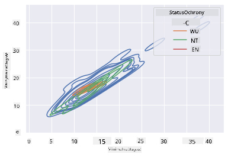

Być może warto zbadać, czy skupisko ptaków „wrażliwych” według ich długości ma jakieś znaczenie.

## 🚀 Wyzwanie

Histogramy to bardziej zaawansowany typ wykresu niż podstawowe wykresy punktowe, słupkowe czy liniowe. Poszukaj w internecie dobrych przykładów użycia histogramów. Jak są wykorzystywane, co pokazują i w jakich dziedzinach lub obszarach badań są najczęściej stosowane?

## [Quiz po wykładzie](https://ff-quizzes.netlify.app/en/ds/)

## Przegląd i samodzielna nauka

W tej lekcji używałeś Matplotlib i zacząłeś pracować z Seaborn, aby tworzyć bardziej zaawansowane wykresy. Przeprowadź badania na temat `kdeplot` w Seaborn, „ciągłej krzywej gęstości prawdopodobieństwa w jednym lub więcej wymiarach”. Przeczytaj [dokumentację](https://seaborn.pydata.org/generated/seaborn.kdeplot.html), aby zrozumieć, jak to działa.

## Zadanie

[Zastosuj swoje umiejętności](assignment.md)

---

**Zastrzeżenie**:  
Ten dokument został przetłumaczony za pomocą usługi tłumaczeniowej AI [Co-op Translator](https://github.com/Azure/co-op-translator). Chociaż dokładamy wszelkich starań, aby tłumaczenie było precyzyjne, prosimy pamiętać, że automatyczne tłumaczenia mogą zawierać błędy lub nieścisłości. Oryginalny dokument w jego rodzimym języku powinien być uznawany za wiarygodne źródło. W przypadku informacji krytycznych zaleca się skorzystanie z profesjonalnego tłumaczenia wykonanego przez człowieka. Nie ponosimy odpowiedzialności za jakiekolwiek nieporozumienia lub błędne interpretacje wynikające z korzystania z tego tłumaczenia.