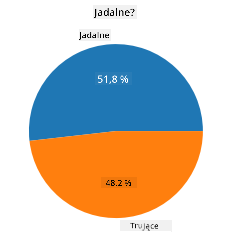
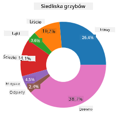
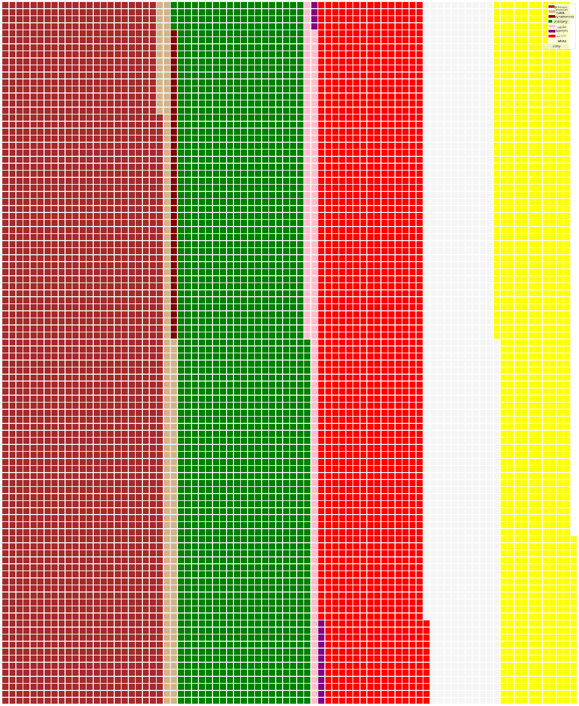

<!--
CO_OP_TRANSLATOR_METADATA:
{
  "original_hash": "af6a12015c6e250e500b570a9fa42593",
  "translation_date": "2025-08-24T23:06:00+00:00",
  "source_file": "3-Data-Visualization/11-visualization-proportions/README.md",
  "language_code": "pl"
}
-->
# Wizualizacja Proporcji

| ](../../sketchnotes/11-Visualizing-Proportions.png)|
|:---:|
|Wizualizacja Proporcji - _Sketchnote autorstwa [@nitya](https://twitter.com/nitya)_ |

W tej lekcji użyjesz innego zestawu danych związanego z naturą, aby wizualizować proporcje, na przykład ile różnych rodzajów grzybów znajduje się w danym zestawie danych o pieczarkach. Przyjrzyjmy się tym fascynującym grzybom, korzystając z zestawu danych pochodzącego z Audubon, zawierającego szczegóły dotyczące 23 gatunków grzybów blaszkowych z rodzin Agaricus i Lepiota. Będziesz eksperymentować z apetycznymi wizualizacjami, takimi jak:

- Wykresy kołowe 🥧
- Wykresy pierścieniowe 🍩
- Wykresy "goferowe" 🧇

> 💡 Bardzo ciekawy projekt o nazwie [Charticulator](https://charticulator.com) stworzony przez Microsoft Research oferuje darmowy interfejs typu "przeciągnij i upuść" do wizualizacji danych. W jednym z ich samouczków również używany jest ten zestaw danych o grzybach! Możesz więc jednocześnie eksplorować dane i uczyć się obsługi biblioteki: [Samouczek Charticulator](https://charticulator.com/tutorials/tutorial4.html).

## [Quiz przed lekcją](https://purple-hill-04aebfb03.1.azurestaticapps.net/quiz/20)

## Poznaj swoje grzyby 🍄

Grzyby są bardzo interesujące. Zaimportujmy zestaw danych, aby je zbadać:

```python
import pandas as pd
import matplotlib.pyplot as plt
mushrooms = pd.read_csv('../../data/mushrooms.csv')
mushrooms.head()
```
Tabela zostaje wyświetlona z danymi idealnymi do analizy:


| class     | cap-shape | cap-surface | cap-color | bruises | odor    | gill-attachment | gill-spacing | gill-size | gill-color | stalk-shape | stalk-root | stalk-surface-above-ring | stalk-surface-below-ring | stalk-color-above-ring | stalk-color-below-ring | veil-type | veil-color | ring-number | ring-type | spore-print-color | population | habitat |
| --------- | --------- | ----------- | --------- | ------- | ------- | --------------- | ------------ | --------- | ---------- | ----------- | ---------- | ------------------------ | ------------------------ | ---------------------- | ---------------------- | --------- | ---------- | ----------- | --------- | ----------------- | ---------- | ------- |
| Trujący   | Wypukły   | Gładki      | Brązowy   | Siniaki | Ostry   | Wolny           | Bliski       | Wąski     | Czarny     | Rozszerzający| Równy      | Gładki                   | Gładki                   | Biały                  | Biały                  | Częściowy | Biały      | Jeden       | Wiszący   | Czarny            | Rozproszony| Miejski |
| Jadalny   | Wypukły   | Gładki      | Żółty     | Siniaki | Migdałowy| Wolny           | Bliski       | Szeroki   | Czarny     | Rozszerzający| Maczugowaty| Gładki                   | Gładki                   | Biały                  | Biały                  | Częściowy | Biały      | Jeden       | Wiszący   | Brązowy           | Liczny     | Trawy   |
| Jadalny   | Dzwonkowaty| Gładki     | Biały     | Siniaki | Anyżowy | Wolny           | Bliski       | Szeroki   | Brązowy    | Rozszerzający| Maczugowaty| Gładki                   | Gładki                   | Biały                  | Biały                  | Częściowy | Biały      | Jeden       | Wiszący   | Brązowy           | Liczny     | Łąki    |
| Trujący   | Wypukły   | Łuskowaty   | Biały     | Siniaki | Ostry   | Wolny           | Bliski       | Wąski     | Brązowy    | Rozszerzający| Równy      | Gładki                   | Gładki                   | Biały                  | Biały                  | Częściowy | Biały      | Jeden       | Wiszący   | Czarny            | Rozproszony| Miejski |

Od razu zauważasz, że wszystkie dane są tekstowe. Musisz je przekonwertować, aby móc użyć ich na wykresie. Większość danych jest w rzeczywistości reprezentowana jako obiekt:

```python
print(mushrooms.select_dtypes(["object"]).columns)
```

Wynik to:

```output
Index(['class', 'cap-shape', 'cap-surface', 'cap-color', 'bruises', 'odor',
       'gill-attachment', 'gill-spacing', 'gill-size', 'gill-color',
       'stalk-shape', 'stalk-root', 'stalk-surface-above-ring',
       'stalk-surface-below-ring', 'stalk-color-above-ring',
       'stalk-color-below-ring', 'veil-type', 'veil-color', 'ring-number',
       'ring-type', 'spore-print-color', 'population', 'habitat'],
      dtype='object')
```
Weź te dane i przekonwertuj kolumnę 'class' na kategorię:

```python
cols = mushrooms.select_dtypes(["object"]).columns
mushrooms[cols] = mushrooms[cols].astype('category')
```

```python
edibleclass=mushrooms.groupby(['class']).count()
edibleclass
```

Teraz, jeśli wyświetlisz dane o grzybach, zobaczysz, że zostały one pogrupowane w kategorie według klasy trujący/jadalny:


|           | cap-shape | cap-surface | cap-color | bruises | odor | gill-attachment | gill-spacing | gill-size | gill-color | stalk-shape | ... | stalk-surface-below-ring | stalk-color-above-ring | stalk-color-below-ring | veil-type | veil-color | ring-number | ring-type | spore-print-color | population | habitat |
| --------- | --------- | ----------- | --------- | ------- | ---- | --------------- | ------------ | --------- | ---------- | ----------- | --- | ------------------------ | ---------------------- | ---------------------- | --------- | ---------- | ----------- | --------- | ----------------- | ---------- | ------- |
| class     |           |             |           |         |      |                 |              |           |            |             |     |                          |                        |                        |           |            |             |           |                   |            |         |
| Jadalny   | 4208      | 4208        | 4208      | 4208    | 4208 | 4208            | 4208         | 4208      | 4208       | 4208        | ... | 4208                     | 4208                   | 4208                   | 4208      | 4208       | 4208        | 4208      | 4208              | 4208       | 4208    |
| Trujący   | 3916      | 3916        | 3916      | 3916    | 3916 | 3916            | 3916         | 3916      | 3916       | 3916        | ... | 3916                     | 3916                   | 3916                   | 3916      | 3916       | 3916        | 3916      | 3916              | 3916       | 3916    |

Jeśli postępujesz zgodnie z kolejnością przedstawioną w tej tabeli, aby stworzyć etykiety kategorii klasy, możesz stworzyć wykres kołowy:

## Koło!

```python
labels=['Edible','Poisonous']
plt.pie(edibleclass['population'],labels=labels,autopct='%.1f %%')
plt.title('Edible?')
plt.show()
```
Voila, wykres kołowy pokazujący proporcje tych danych według dwóch klas grzybów. Bardzo ważne jest, aby kolejność etykiet była poprawna, szczególnie tutaj, więc upewnij się, że weryfikujesz kolejność podczas budowania tablicy etykiet!



## Pierścienie!

Nieco bardziej interesującym wizualnie wykresem kołowym jest wykres pierścieniowy, czyli wykres kołowy z dziurą w środku. Przyjrzyjmy się naszym danym za pomocą tej metody.

Spójrz na różne siedliska, w których rosną grzyby:

```python
habitat=mushrooms.groupby(['habitat']).count()
habitat
```
Tutaj grupujesz dane według siedliska. Jest ich 7, więc użyj ich jako etykiet dla wykresu pierścieniowego:

```python
labels=['Grasses','Leaves','Meadows','Paths','Urban','Waste','Wood']

plt.pie(habitat['class'], labels=labels,
        autopct='%1.1f%%', pctdistance=0.85)
  
center_circle = plt.Circle((0, 0), 0.40, fc='white')
fig = plt.gcf()

fig.gca().add_artist(center_circle)
  
plt.title('Mushroom Habitats')
  
plt.show()
```



Ten kod rysuje wykres i środkowe koło, a następnie dodaje to koło do wykresu. Zmień szerokość środkowego koła, zmieniając `0.40` na inną wartość.

Wykresy pierścieniowe można dostosowywać na różne sposoby, aby zmieniać etykiety. Etykiety w szczególności można wyróżniać dla lepszej czytelności. Dowiedz się więcej w [dokumentacji](https://matplotlib.org/stable/gallery/pie_and_polar_charts/pie_and_donut_labels.html?highlight=donut).

Teraz, gdy wiesz, jak grupować dane i wyświetlać je jako koło lub pierścień, możesz eksplorować inne rodzaje wykresów. Spróbuj wykresu "goferowego", który jest po prostu innym sposobem wizualizacji ilości.

## Gofry!

Wykres typu "goferowego" to inny sposób wizualizacji ilości w postaci 2D tablicy kwadratów. Spróbuj zwizualizować różne ilości kolorów kapeluszy grzybów w tym zestawie danych. Aby to zrobić, musisz zainstalować bibliotekę pomocniczą o nazwie [PyWaffle](https://pypi.org/project/pywaffle/) i użyć Matplotlib:

```python
pip install pywaffle
```

Wybierz segment swoich danych do pogrupowania:

```python
capcolor=mushrooms.groupby(['cap-color']).count()
capcolor
```

Stwórz wykres "goferowy", tworząc etykiety, a następnie grupując swoje dane:

```python
import pandas as pd
import matplotlib.pyplot as plt
from pywaffle import Waffle
  
data ={'color': ['brown', 'buff', 'cinnamon', 'green', 'pink', 'purple', 'red', 'white', 'yellow'],
    'amount': capcolor['class']
     }
  
df = pd.DataFrame(data)
  
fig = plt.figure(
    FigureClass = Waffle,
    rows = 100,
    values = df.amount,
    labels = list(df.color),
    figsize = (30,30),
    colors=["brown", "tan", "maroon", "green", "pink", "purple", "red", "whitesmoke", "yellow"],
)
```

Za pomocą wykresu "goferowego" możesz wyraźnie zobaczyć proporcje kolorów kapeluszy w tym zestawie danych o grzybach. Co ciekawe, jest wiele grzybów z zielonymi kapeluszami!



✅ Pywaffle obsługuje ikony w wykresach, które wykorzystują dowolne ikony dostępne w [Font Awesome](https://fontawesome.com/). Poeksperymentuj, aby stworzyć jeszcze ciekawszy wykres "goferowy" z ikonami zamiast kwadratów.

W tej lekcji nauczyłeś się trzech sposobów wizualizacji proporcji. Najpierw musisz pogrupować swoje dane w kategorie, a następnie zdecydować, który sposób ich wyświetlenia - koło, pierścień czy gofr - jest najlepszy. Wszystkie są "smaczne" i dostarczają użytkownikowi natychmiastowego wglądu w zestaw danych.

## 🚀 Wyzwanie

Spróbuj odtworzyć te apetyczne wykresy w [Charticulator](https://charticulator.com).
## [Quiz po lekcji](https://purple-hill-04aebfb03.1.azurestaticapps.net/quiz/21)

## Przegląd i samodzielna nauka

Czasami nie jest oczywiste, kiedy użyć wykresu kołowego, pierścieniowego czy "goferowego". Oto kilka artykułów na ten temat:

https://www.beautiful.ai/blog/battle-of-the-charts-pie-chart-vs-donut-chart

https://medium.com/@hypsypops/pie-chart-vs-donut-chart-showdown-in-the-ring-5d24fd86a9ce

https://www.mit.edu/~mbarker/formula1/f1help/11-ch-c6.htm

https://medium.datadriveninvestor.com/data-visualization-done-the-right-way-with-tableau-waffle-chart-fdf2a19be402

Poszukaj więcej informacji na temat tego trudnego wyboru.

## Zadanie

[Spróbuj w Excelu](assignment.md)

**Zastrzeżenie**:  
Ten dokument został przetłumaczony za pomocą usługi tłumaczenia AI [Co-op Translator](https://github.com/Azure/co-op-translator). Chociaż dokładamy wszelkich starań, aby tłumaczenie było precyzyjne, prosimy pamiętać, że automatyczne tłumaczenia mogą zawierać błędy lub nieścisłości. Oryginalny dokument w jego rodzimym języku powinien być uznawany za wiarygodne źródło. W przypadku informacji o kluczowym znaczeniu zaleca się skorzystanie z profesjonalnego tłumaczenia przez człowieka. Nie ponosimy odpowiedzialności za jakiekolwiek nieporozumienia lub błędne interpretacje wynikające z użycia tego tłumaczenia.