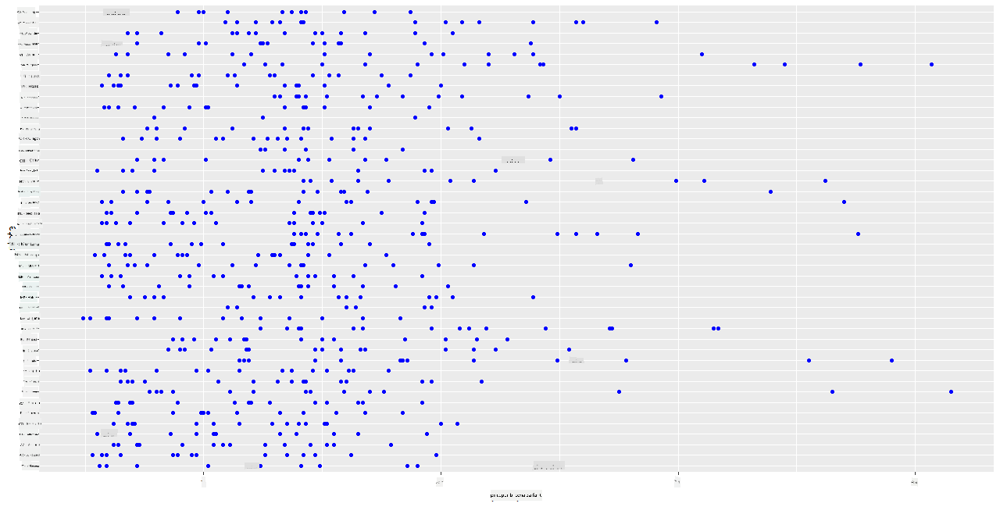
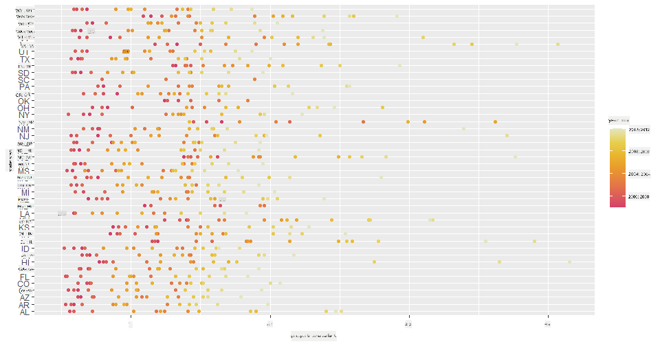
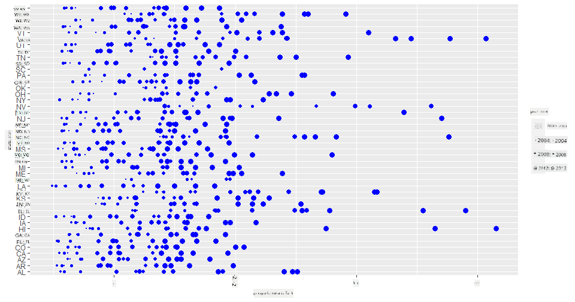
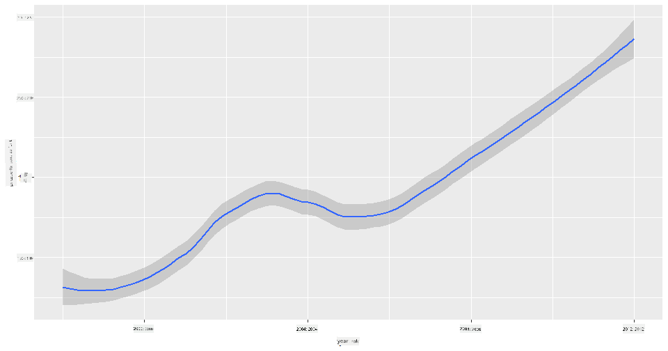
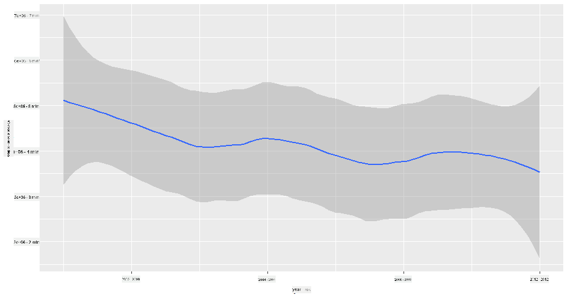
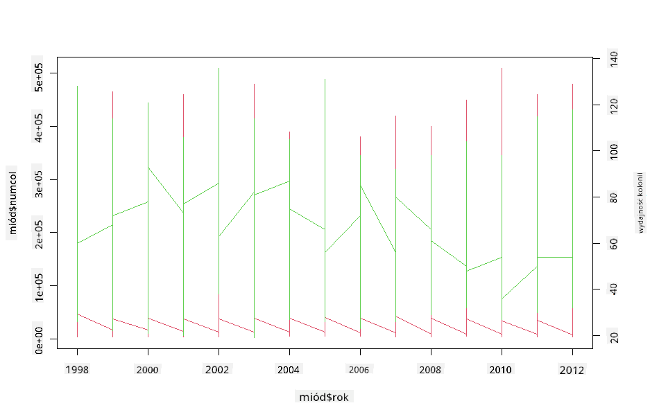

<!--
CO_OP_TRANSLATOR_METADATA:
{
  "original_hash": "a33c5d4b4156a2b41788d8720b6f724c",
  "translation_date": "2025-08-24T22:47:42+00:00",
  "source_file": "3-Data-Visualization/R/12-visualization-relationships/README.md",
  "language_code": "pl"
}
-->
# Wizualizacja Zależności: Wszystko o Miodzie 🍯

| ](../../../sketchnotes/12-Visualizing-Relationships.png)|
|:---:|
|Wizualizacja Zależności - _Sketchnote autorstwa [@nitya](https://twitter.com/nitya)_ |

Kontynuując nasz fokus na naturę w badaniach, odkryjmy ciekawe wizualizacje, które pokazują zależności między różnymi rodzajami miodu, zgodnie z danymi pochodzącymi z [Departamentu Rolnictwa Stanów Zjednoczonych](https://www.nass.usda.gov/About_NASS/index.php).

Ten zestaw danych, zawierający około 600 pozycji, przedstawia produkcję miodu w wielu stanach USA. Na przykład można przeanalizować liczbę kolonii, wydajność na kolonię, całkowitą produkcję, zapasy, cenę za funt oraz wartość wyprodukowanego miodu w danym stanie w latach 1998-2012, z jednym wierszem na rok dla każdego stanu.

Ciekawie będzie zwizualizować zależność między produkcją w danym stanie w danym roku a, na przykład, ceną miodu w tym stanie. Alternatywnie można zwizualizować zależność między wydajnością miodu na kolonię w różnych stanach. Ten zakres lat obejmuje niszczycielski 'CCD' lub 'Colony Collapse Disorder', który po raz pierwszy zaobserwowano w 2006 roku (http://npic.orst.edu/envir/ccd.html), co czyni ten zestaw danych szczególnie interesującym do analizy. 🐝

## [Quiz przed lekcją](https://purple-hill-04aebfb03.1.azurestaticapps.net/quiz/22)

W tej lekcji możesz użyć ggplot2, który już wcześniej stosowałeś, jako świetnej biblioteki do wizualizacji zależności między zmiennymi. Szczególnie interesujące jest użycie funkcji `geom_point` i `qplot` w ggplot2, które pozwalają na szybkie tworzenie wykresów punktowych i liniowych, aby zwizualizować '[zależności statystyczne](https://ggplot2.tidyverse.org/)'. Dzięki temu naukowiec danych może lepiej zrozumieć, jak zmienne się ze sobą wiążą.

## Wykresy punktowe

Użyj wykresu punktowego, aby pokazać, jak cena miodu zmieniała się rok po roku w poszczególnych stanach. ggplot2, korzystając z `ggplot` i `geom_point`, wygodnie grupuje dane stanowe i wyświetla punkty danych zarówno dla danych kategorycznych, jak i numerycznych.

Zacznijmy od zaimportowania danych i biblioteki Seaborn:

```r
honey=read.csv('../../data/honey.csv')
head(honey)
```
Zauważ, że dane o miodzie zawierają kilka interesujących kolumn, w tym rok i cenę za funt. Przyjrzyjmy się tym danym, pogrupowanym według stanów USA:

| stan | liczba_kol | wydajność_na_kol | całkowita_prod | zapasy   | cena_za_funt | wartość_prod | rok |
| ----- | ---------- | ---------------- | -------------- | -------- | ------------ | ------------ | ---- |
| AL    | 16000      | 71              | 1136000        | 159000   | 0.72         | 818000       | 1998 |
| AZ    | 55000      | 60              | 3300000        | 1485000  | 0.64         | 2112000      | 1998 |
| AR    | 53000      | 65              | 3445000        | 1688000  | 0.59         | 2033000      | 1998 |
| CA    | 450000     | 83              | 37350000       | 12326000 | 0.62         | 23157000     | 1998 |
| CO    | 27000      | 72              | 1944000        | 1594000  | 0.7          | 1361000      | 1998 |
| FL    | 230000     | 98              | 22540000       | 4508000  | 0.64         | 14426000     | 1998 |

Stwórz podstawowy wykres punktowy, aby pokazać zależność między ceną za funt miodu a stanem jego pochodzenia. Ustaw oś `y` wystarczająco wysoką, aby wyświetlić wszystkie stany:

```r
library(ggplot2)
ggplot(honey, aes(x = priceperlb, y = state)) +
  geom_point(colour = "blue")
```


Teraz pokaż te same dane z kolorystyką inspirowaną miodem, aby zobrazować, jak cena zmienia się na przestrzeni lat. Możesz to zrobić, dodając parametr 'scale_color_gradientn', który pokazuje zmiany rok po roku:

> ✅ Dowiedz się więcej o [scale_color_gradientn](https://www.rdocumentation.org/packages/ggplot2/versions/0.9.1/topics/scale_colour_gradientn) - wypróbuj piękną tęczową paletę kolorów!

```r
ggplot(honey, aes(x = priceperlb, y = state, color=year)) +
  geom_point()+scale_color_gradientn(colours = colorspace::heat_hcl(7))
```


Dzięki tej zmianie kolorystyki można zauważyć wyraźny postęp w cenie miodu za funt na przestrzeni lat. Jeśli spojrzysz na próbkę danych, aby to zweryfikować (na przykład wybierając stan Arizona), można dostrzec wzorzec wzrostu cen rok po roku, z kilkoma wyjątkami:

| stan | liczba_kol | wydajność_na_kol | całkowita_prod | zapasy  | cena_za_funt | wartość_prod | rok |
| ----- | ---------- | ---------------- | -------------- | ------- | ------------ | ------------ | ---- |
| AZ    | 55000      | 60              | 3300000        | 1485000 | 0.64         | 2112000      | 1998 |
| AZ    | 52000      | 62              | 3224000        | 1548000 | 0.62         | 1999000      | 1999 |
| AZ    | 40000      | 59              | 2360000        | 1322000 | 0.73         | 1723000      | 2000 |
| AZ    | 43000      | 59              | 2537000        | 1142000 | 0.72         | 1827000      | 2001 |
| AZ    | 38000      | 63              | 2394000        | 1197000 | 1.08         | 2586000      | 2002 |
| AZ    | 35000      | 72              | 2520000        | 983000  | 1.34         | 3377000      | 2003 |
| AZ    | 32000      | 55              | 1760000        | 774000  | 1.11         | 1954000      | 2004 |
| AZ    | 36000      | 50              | 1800000        | 720000  | 1.04         | 1872000      | 2005 |
| AZ    | 30000      | 65              | 1950000        | 839000  | 0.91         | 1775000      | 2006 |
| AZ    | 30000      | 64              | 1920000        | 902000  | 1.26         | 2419000      | 2007 |
| AZ    | 25000      | 64              | 1600000        | 336000  | 1.26         | 2016000      | 2008 |
| AZ    | 20000      | 52              | 1040000        | 562000  | 1.45         | 1508000      | 2009 |
| AZ    | 24000      | 77              | 1848000        | 665000  | 1.52         | 2809000      | 2010 |
| AZ    | 23000      | 53              | 1219000        | 427000  | 1.55         | 1889000      | 2011 |
| AZ    | 22000      | 46              | 1012000        | 253000  | 1.79         | 1811000      | 2012 |

Innym sposobem wizualizacji tego postępu jest użycie rozmiaru zamiast koloru. Dla osób z daltonizmem może to być lepsza opcja. Zmień swoją wizualizację, aby pokazać wzrost ceny poprzez zwiększenie obwodu punktów:

```r
ggplot(honey, aes(x = priceperlb, y = state)) +
  geom_point(aes(size = year),colour = "blue") +
  scale_size_continuous(range = c(0.25, 3))
```
Widać, że rozmiar punktów stopniowo się zwiększa.



Czy to prosty przypadek podaży i popytu? Z powodu takich czynników jak zmiany klimatyczne i zjawisko zaniku kolonii, czy dostępność miodu na sprzedaż zmniejsza się rok po roku, a co za tym idzie, cena wzrasta?

Aby odkryć korelację między niektórymi zmiennymi w tym zestawie danych, przyjrzyjmy się wykresom liniowym.

## Wykresy liniowe

Pytanie: Czy można zauważyć wyraźny wzrost ceny miodu za funt rok po roku? Najłatwiej to odkryć, tworząc pojedynczy wykres liniowy:

```r
qplot(honey$year,honey$priceperlb, geom='smooth', span =0.5, xlab = "year",ylab = "priceperlb")
```
Odpowiedź: Tak, z pewnymi wyjątkami w okolicach roku 2003:



Pytanie: Czy w 2003 roku można również zauważyć wzrost podaży miodu? Co jeśli spojrzysz na całkowitą produkcję rok po roku?

```python
qplot(honey$year,honey$totalprod, geom='smooth', span =0.5, xlab = "year",ylab = "totalprod")
```



Odpowiedź: Niekoniecznie. Jeśli spojrzysz na całkowitą produkcję, wydaje się, że faktycznie wzrosła w tym konkretnym roku, mimo że ogólnie rzecz biorąc ilość produkowanego miodu maleje w tych latach.

Pytanie: W takim razie, co mogło spowodować wzrost ceny miodu w okolicach roku 2003?

Aby to odkryć, możesz użyć siatki wykresów.

## Siatki wykresów

Siatki wykresów pozwalają na podział danych na jeden aspekt (w naszym przypadku możesz wybrać 'rok', aby uniknąć zbyt wielu podziałów). Seaborn może następnie stworzyć wykres dla każdego z tych aspektów, z wybranymi współrzędnymi x i y, co ułatwia porównanie. Czy rok 2003 wyróżnia się w tego typu porównaniu?

Stwórz siatkę wykresów, używając `facet_wrap`, jak zaleca [dokumentacja ggplot2](https://ggplot2.tidyverse.org/reference/facet_wrap.html).

```r
ggplot(honey, aes(x=yieldpercol, y = numcol,group = 1)) + 
  geom_line() + facet_wrap(vars(year))
```
Na tej wizualizacji możesz porównać wydajność na kolonię i liczbę kolonii rok po roku, obok siebie, z ustawieniem wrap na 3 dla kolumn:


Dla tego zestawu danych nic szczególnego nie wyróżnia się w odniesieniu do liczby kolonii i ich wydajności rok po roku oraz stan po stanie. Czy istnieje inny sposób na znalezienie korelacji między tymi dwoma zmiennymi?

## Wykresy z dwiema liniami

Spróbuj wykresu wieloliniowego, nakładając na siebie dwa wykresy liniowe, używając funkcji `par` i `plot` w R. Będziemy wykreślać rok na osi x i wyświetlać dwie osie y. Wyświetl wydajność na kolonię i liczbę kolonii, nałożone na siebie:

```r
par(mar = c(5, 4, 4, 4) + 0.3)              
plot(honey$year, honey$numcol, pch = 16, col = 2,type="l")              
par(new = TRUE)                             
plot(honey$year, honey$yieldpercol, pch = 17, col = 3,              
     axes = FALSE, xlab = "", ylab = "",type="l")
axis(side = 4, at = pretty(range(y2)))      
mtext("colony yield", side = 4, line = 3)   
```


Chociaż nic szczególnego nie rzuca się w oczy w okolicach roku 2003, pozwala nam to zakończyć tę lekcję na nieco bardziej optymistycznej nucie: mimo ogólnego spadku liczby kolonii, liczba kolonii stabilizuje się, nawet jeśli ich wydajność na kolonię maleje.

Naprzód, pszczoły, naprzód!

🐝❤️
## 🚀 Wyzwanie

W tej lekcji dowiedziałeś się nieco więcej o innych zastosowaniach wykresów punktowych i siatek wykresów, w tym siatek wykresów. Podejmij wyzwanie i stwórz siatkę wykresów, używając innego zestawu danych, być może takiego, którego używałeś wcześniej w tych lekcjach. Zwróć uwagę, ile czasu zajmuje ich stworzenie i jak ważne jest ostrożne podejście do liczby siatek, które chcesz narysować, korzystając z tych technik.
## [Quiz po lekcji](https://purple-hill-04aebfb03.1.azurestaticapps.net/quiz/23)

## Przegląd i Samodzielna Nauka

Wykresy liniowe mogą być proste lub dość złożone. Przeczytaj trochę więcej w [dokumentacji ggplot2](https://ggplot2.tidyverse.org/reference/geom_path.html#:~:text=geom_line()%20connects%20them%20in,which%20cases%20are%20connected%20together) o różnych sposobach ich budowy. Spróbuj ulepszyć wykresy liniowe, które stworzyłeś w tej lekcji, korzystając z innych metod wymienionych w dokumentacji.
## Zadanie

[Zanurz się w ulu](assignment.md)

**Zastrzeżenie**:  
Ten dokument został przetłumaczony za pomocą usługi tłumaczenia AI [Co-op Translator](https://github.com/Azure/co-op-translator). Chociaż staramy się zapewnić dokładność, prosimy mieć na uwadze, że automatyczne tłumaczenia mogą zawierać błędy lub nieścisłości. Oryginalny dokument w jego rodzimym języku powinien być uznawany za wiarygodne źródło. W przypadku informacji krytycznych zaleca się skorzystanie z profesjonalnego tłumaczenia przez człowieka. Nie ponosimy odpowiedzialności za jakiekolwiek nieporozumienia lub błędne interpretacje wynikające z użycia tego tłumaczenia.