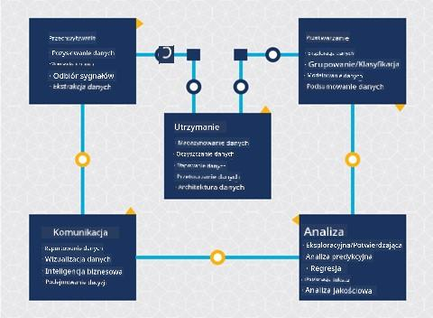
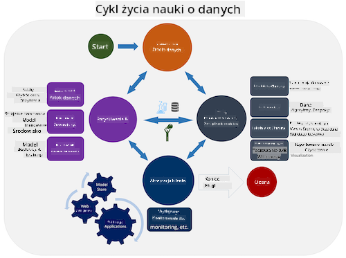
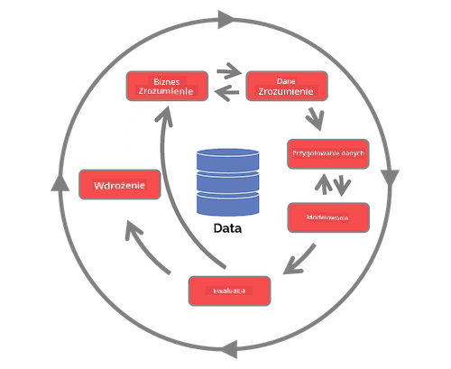

<!--
CO_OP_TRANSLATOR_METADATA:
{
  "original_hash": "07e12a25d20b8f191e3cb651c27fdb2b",
  "translation_date": "2025-09-06T20:55:46+00:00",
  "source_file": "4-Data-Science-Lifecycle/14-Introduction/README.md",
  "language_code": "pl"
}
-->
# Wprowadzenie do cyklu życia nauki o danych

| ](../../sketchnotes/14-DataScience-Lifecycle.png)|
|:---:|
| Wprowadzenie do cyklu życia nauki o danych - _Sketchnote autorstwa [@nitya](https://twitter.com/nitya)_ |

## [Quiz przed wykładem](https://ff-quizzes.netlify.app/en/ds/quiz/26)

Na tym etapie prawdopodobnie zdajesz sobie sprawę, że nauka o danych to proces. Proces ten można podzielić na 5 etapów:

- Zbieranie
- Przetwarzanie
- Analiza
- Komunikacja
- Utrzymanie

Ta lekcja skupia się na 3 częściach cyklu życia: zbieraniu, przetwarzaniu i utrzymaniu.

  
> Zdjęcie autorstwa [Berkeley School of Information](https://ischoolonline.berkeley.edu/data-science/what-is-data-science/)

## Zbieranie

Pierwszy etap cyklu życia jest bardzo ważny, ponieważ kolejne etapy są od niego zależne. W praktyce łączy on dwa etapy w jeden: pozyskiwanie danych oraz definiowanie celu i problemów, które należy rozwiązać.  
Definiowanie celów projektu wymaga głębszego zrozumienia problemu lub pytania. Najpierw musimy zidentyfikować i pozyskać osoby, które potrzebują rozwiązania swojego problemu. Mogą to być interesariusze w firmie lub sponsorzy projektu, którzy pomogą określić, kto lub co skorzysta na tym projekcie, a także co i dlaczego jest potrzebne. Dobrze zdefiniowany cel powinien być mierzalny i możliwy do określenia w kategoriach akceptowalnego wyniku.

Pytania, które może zadać naukowiec danych:
- Czy ten problem był już wcześniej rozwiązywany? Co odkryto?
- Czy cel i zamierzenia są zrozumiałe dla wszystkich zaangażowanych?
- Czy istnieje niejasność i jak ją zredukować?
- Jakie są ograniczenia?
- Jak może wyglądać końcowy rezultat?
- Jakie zasoby (czas, ludzie, obliczenia) są dostępne?

Następnie należy zidentyfikować, zebrać, a na końcu zbadać dane potrzebne do osiągnięcia zdefiniowanych celów. Na tym etapie pozyskiwania naukowcy danych muszą również ocenić ilość i jakość danych. Wymaga to pewnej eksploracji danych, aby potwierdzić, że zebrane dane pozwolą osiągnąć pożądany wynik.

Pytania, które może zadać naukowiec danych o dane:
- Jakie dane są już dostępne?
- Kto jest właścicielem tych danych?
- Jakie są obawy dotyczące prywatności?
- Czy mam wystarczająco dużo danych, aby rozwiązać ten problem?
- Czy dane są wystarczającej jakości dla tego problemu?
- Jeśli odkryję dodatkowe informacje w tych danych, czy powinniśmy rozważyć zmianę lub redefinicję celów?

## Przetwarzanie

Etap przetwarzania w cyklu życia koncentruje się na odkrywaniu wzorców w danych oraz modelowaniu. Niektóre techniki stosowane na tym etapie wymagają metod statystycznych do odkrywania wzorców. Zazwyczaj byłoby to żmudne zadanie dla człowieka przy dużym zbiorze danych, dlatego wykorzystuje się komputery, aby przyspieszyć ten proces. Na tym etapie nauka o danych i uczenie maszynowe się przecinają. Jak dowiedziałeś się w pierwszej lekcji, uczenie maszynowe to proces budowania modeli w celu zrozumienia danych. Modele są reprezentacją relacji między zmiennymi w danych, które pomagają przewidywać wyniki.

Typowe techniki stosowane na tym etapie są omówione w programie nauczania ML dla początkujących. Skorzystaj z poniższych linków, aby dowiedzieć się więcej:

- [Klasyfikacja](https://github.com/microsoft/ML-For-Beginners/tree/main/4-Classification): Organizowanie danych w kategorie dla bardziej efektywnego wykorzystania.
- [Klasteryzacja](https://github.com/microsoft/ML-For-Beginners/tree/main/5-Clustering): Grupowanie danych w podobne grupy.
- [Regresja](https://github.com/microsoft/ML-For-Beginners/tree/main/2-Regression): Określanie relacji między zmiennymi w celu przewidywania lub prognozowania wartości.

## Utrzymanie

Na diagramie cyklu życia mogłeś zauważyć, że utrzymanie znajduje się pomiędzy zbieraniem a przetwarzaniem. Utrzymanie to ciągły proces zarządzania, przechowywania i zabezpieczania danych w trakcie realizacji projektu i powinno być brane pod uwagę przez cały czas trwania projektu.

### Przechowywanie danych

Sposób i miejsce przechowywania danych mogą wpływać na koszty ich przechowywania, a także na wydajność dostępu do danych. Decyzje tego typu nie są podejmowane wyłącznie przez naukowca danych, ale mogą one wpływać na sposób pracy z danymi w zależności od tego, jak są przechowywane.

Oto kilka aspektów współczesnych systemów przechowywania danych, które mogą wpływać na te decyzje:

**Na miejscu vs poza miejscem vs chmura publiczna lub prywatna**

Na miejscu oznacza zarządzanie danymi na własnym sprzęcie, np. posiadanie serwera z dyskami twardymi przechowującymi dane, podczas gdy poza miejscem oznacza korzystanie ze sprzętu, którego nie posiadasz, np. centrum danych. Chmura publiczna to popularny wybór do przechowywania danych, który nie wymaga wiedzy o tym, jak i gdzie dokładnie dane są przechowywane. Publiczna oznacza wspólną infrastrukturę, z której korzystają wszyscy użytkownicy chmury. Niektóre organizacje mają ścisłe polityki bezpieczeństwa, które wymagają pełnego dostępu do sprzętu, na którym przechowywane są dane, i korzystają z prywatnej chmury oferującej własne usługi chmurowe. Więcej o danych w chmurze dowiesz się w [późniejszych lekcjach](https://github.com/microsoft/Data-Science-For-Beginners/tree/main/5-Data-Science-In-Cloud).

**Zimne vs gorące dane**

Podczas trenowania modeli możesz potrzebować więcej danych treningowych. Jeśli jesteś zadowolony z modelu, nowe dane będą napływać, aby model mógł spełniać swoje zadanie. W każdym przypadku koszty przechowywania i dostępu do danych będą rosły wraz z ich akumulacją. Oddzielenie rzadko używanych danych, znanych jako zimne dane, od często używanych gorących danych może być tańszą opcją przechowywania dzięki sprzętowi lub usługom programowym. Jeśli zimne dane muszą zostać uzyskane, może to zająć trochę więcej czasu w porównaniu do gorących danych.

### Zarządzanie danymi

Podczas pracy z danymi możesz odkryć, że niektóre z nich wymagają oczyszczenia za pomocą technik omówionych w lekcji dotyczącej [przygotowania danych](https://github.com/microsoft/Data-Science-For-Beginners/tree/main/2-Working-With-Data/08-data-preparation), aby zbudować dokładne modele. Gdy pojawią się nowe dane, będą wymagały podobnych działań, aby zachować spójność jakości. Niektóre projekty będą wymagały użycia zautomatyzowanego narzędzia do oczyszczania, agregacji i kompresji przed przeniesieniem danych do ich ostatecznej lokalizacji. Przykładem takiego narzędzia jest Azure Data Factory.

### Zabezpieczanie danych

Jednym z głównych celów zabezpieczania danych jest zapewnienie, że osoby pracujące z nimi mają kontrolę nad tym, co jest zbierane i w jakim kontekście jest używane. Utrzymanie bezpieczeństwa danych obejmuje ograniczenie dostępu tylko do osób, które go potrzebują, przestrzeganie lokalnych przepisów i regulacji oraz utrzymanie standardów etycznych, jak omówiono w lekcji dotyczącej [etyki](https://github.com/microsoft/Data-Science-For-Beginners/tree/main/1-Introduction/02-ethics).

Oto kilka działań, które zespół może podjąć, mając na uwadze bezpieczeństwo:
- Upewnienie się, że wszystkie dane są zaszyfrowane
- Informowanie klientów o tym, jak ich dane są wykorzystywane
- Usuwanie dostępu do danych osobom, które opuściły projekt
- Pozwolenie tylko wybranym członkom zespołu na modyfikowanie danych

## 🚀 Wyzwanie

Istnieje wiele wersji cyklu życia nauki o danych, gdzie każdy etap może mieć inne nazwy i liczbę etapów, ale zawiera te same procesy omówione w tej lekcji.

Zapoznaj się z [cyklem życia procesu nauki o danych zespołu](https://docs.microsoft.com/en-us/azure/architecture/data-science-process/lifecycle) oraz [standardowym procesem dla eksploracji danych w różnych branżach](https://www.datascience-pm.com/crisp-dm-2/). Wymień 3 podobieństwa i różnice między nimi.

|Proces nauki o danych zespołu (TDSP)|Standardowy proces dla eksploracji danych (CRISP-DM)|
|--|--|
| |  |
| Obraz autorstwa [Microsoft](https://docs.microsoft.comazure/architecture/data-science-process/lifecycle) | Obraz autorstwa [Data Science Process Alliance](https://www.datascience-pm.com/crisp-dm-2/) |

## [Quiz po wykładzie](https://ff-quizzes.netlify.app/en/ds/quiz/27)

## Przegląd i samodzielna nauka

Zastosowanie cyklu życia nauki o danych obejmuje wiele ról i zadań, gdzie niektóre osoby mogą skupiać się na określonych częściach każdego etapu. Proces nauki o danych zespołu dostarcza kilka zasobów wyjaśniających rodzaje ról i zadań, jakie ktoś może mieć w projekcie.

* [Role i zadania w procesie nauki o danych zespołu](https://docs.microsoft.com/en-us/azure/architecture/data-science-process/roles-tasks)  
* [Wykonywanie zadań nauki o danych: eksploracja, modelowanie i wdrażanie](https://docs.microsoft.com/en-us/azure/architecture/data-science-process/execute-data-science-tasks)

## Zadanie

[Ocena zbioru danych](assignment.md)

---

**Zastrzeżenie**:  
Ten dokument został przetłumaczony za pomocą usługi tłumaczeniowej AI [Co-op Translator](https://github.com/Azure/co-op-translator). Chociaż dokładamy wszelkich starań, aby tłumaczenie było precyzyjne, prosimy pamiętać, że automatyczne tłumaczenia mogą zawierać błędy lub nieścisłości. Oryginalny dokument w jego rodzimym języku powinien być uznawany za wiarygodne źródło. W przypadku informacji krytycznych zaleca się skorzystanie z profesjonalnego tłumaczenia wykonanego przez człowieka. Nie ponosimy odpowiedzialności za jakiekolwiek nieporozumienia lub błędne interpretacje wynikające z korzystania z tego tłumaczenia.