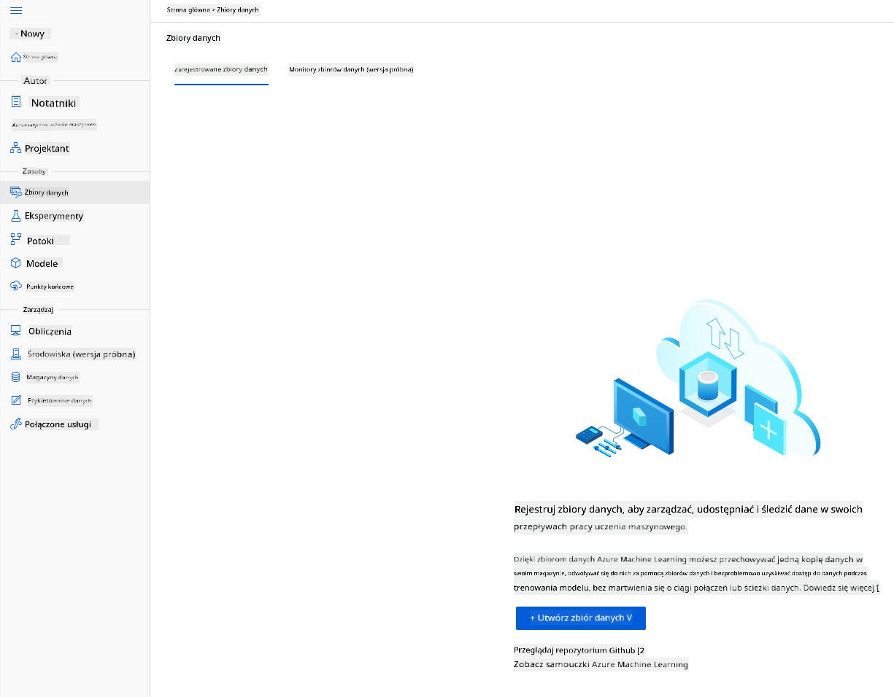

<!--
CO_OP_TRANSLATOR_METADATA:
{
  "original_hash": "14b2a7f1c63202920bd98eeb913f5614",
  "translation_date": "2025-08-24T21:57:30+00:00",
  "source_file": "5-Data-Science-In-Cloud/18-Low-Code/README.md",
  "language_code": "pl"
}
-->
# Data Science w Chmurze: Podejście "Low code/No code"

| ](../../sketchnotes/18-DataScience-Cloud.png)|
|:---:|
| Data Science w Chmurze: Low Code - _Sketchnote autorstwa [@nitya](https://twitter.com/nitya)_ |

Spis treści:

- [Data Science w Chmurze: Podejście "Low code/No code"](../../../../5-Data-Science-In-Cloud/18-Low-Code)
  - [Quiz przed wykładem](../../../../5-Data-Science-In-Cloud/18-Low-Code)
  - [1. Wprowadzenie](../../../../5-Data-Science-In-Cloud/18-Low-Code)
    - [1.1 Czym jest Azure Machine Learning?](../../../../5-Data-Science-In-Cloud/18-Low-Code)
    - [1.2 Projekt przewidywania niewydolności serca:](../../../../5-Data-Science-In-Cloud/18-Low-Code)
    - [1.3 Zbiór danych dotyczących niewydolności serca:](../../../../5-Data-Science-In-Cloud/18-Low-Code)
  - [2. Trenowanie modelu w Azure ML Studio metodą Low code/No code](../../../../5-Data-Science-In-Cloud/18-Low-Code)
    - [2.1 Tworzenie przestrzeni roboczej Azure ML](../../../../5-Data-Science-In-Cloud/18-Low-Code)
    - [2.2 Zasoby obliczeniowe](../../../../5-Data-Science-In-Cloud/18-Low-Code)
      - [2.2.1 Wybór odpowiednich opcji dla zasobów obliczeniowych](../../../../5-Data-Science-In-Cloud/18-Low-Code)
      - [2.2.2 Tworzenie klastra obliczeniowego](../../../../5-Data-Science-In-Cloud/18-Low-Code)
    - [2.3 Ładowanie zbioru danych](../../../../5-Data-Science-In-Cloud/18-Low-Code)
    - [2.4 Trenowanie metodą Low code/No code z AutoML](../../../../5-Data-Science-In-Cloud/18-Low-Code)
  - [3. Wdrażanie modelu metodą Low code/No code i wykorzystanie punktu końcowego](../../../../5-Data-Science-In-Cloud/18-Low-Code)
    - [3.1 Wdrażanie modelu](../../../../5-Data-Science-In-Cloud/18-Low-Code)
    - [3.2 Wykorzystanie punktu końcowego](../../../../5-Data-Science-In-Cloud/18-Low-Code)
  - [🚀 Wyzwanie](../../../../5-Data-Science-In-Cloud/18-Low-Code)
  - [Quiz po wykładzie](../../../../5-Data-Science-In-Cloud/18-Low-Code)
  - [Przegląd i samodzielna nauka](../../../../5-Data-Science-In-Cloud/18-Low-Code)
  - [Zadanie domowe](../../../../5-Data-Science-In-Cloud/18-Low-Code)
  
## [Quiz przed wykładem](https://purple-hill-04aebfb03.1.azurestaticapps.net/quiz/34)
## 1. Wprowadzenie
### 1.1 Czym jest Azure Machine Learning?

Platforma chmurowa Azure to ponad 200 produktów i usług chmurowych zaprojektowanych, aby pomóc w realizacji nowych rozwiązań. Data scientist poświęcają dużo czasu na eksplorację i wstępne przetwarzanie danych oraz testowanie różnych algorytmów trenowania modeli, aby uzyskać dokładne modele. Te zadania są czasochłonne i często nieefektywnie wykorzystują kosztowny sprzęt obliczeniowy.

[Azure ML](https://docs.microsoft.com/azure/machine-learning/overview-what-is-azure-machine-learning?WT.mc_id=academic-77958-bethanycheum&ocid=AID3041109) to platforma chmurowa do budowania i obsługi rozwiązań uczenia maszynowego w Azure. Oferuje szeroki zakres funkcji i możliwości, które pomagają data scientist w przygotowaniu danych, trenowaniu modeli, publikowaniu usług predykcyjnych oraz monitorowaniu ich użycia. Najważniejsze jest to, że zwiększa efektywność pracy, automatyzując wiele czasochłonnych zadań związanych z trenowaniem modeli, oraz umożliwia korzystanie z zasobów obliczeniowych w chmurze, które skutecznie skalują się, obsługując duże ilości danych, przy kosztach ponoszonych tylko w momencie ich użycia.

Azure ML dostarcza wszystkie narzędzia potrzebne programistom i data scientist do realizacji ich procesów uczenia maszynowego. Obejmują one:

- **Azure Machine Learning Studio**: portal internetowy w Azure Machine Learning oferujący opcje low-code i no-code dla trenowania modeli, wdrażania, automatyzacji, śledzenia i zarządzania zasobami. Studio integruje się z Azure Machine Learning SDK, zapewniając płynne doświadczenie.
- **Jupyter Notebooks**: szybkie prototypowanie i testowanie modeli ML.
- **Azure Machine Learning Designer**: umożliwia przeciąganie i upuszczanie modułów w celu budowania eksperymentów i wdrażania pipeline'ów w środowisku low-code.
- **Automated machine learning UI (AutoML)**: automatyzuje iteracyjne zadania związane z rozwojem modeli uczenia maszynowego, pozwalając na budowanie modeli ML na dużą skalę, z wysoką efektywnością i produktywnością, przy jednoczesnym utrzymaniu jakości modeli.
- **Data Labelling**: narzędzie wspomagane ML do automatycznego etykietowania danych.
- **Rozszerzenie uczenia maszynowego dla Visual Studio Code**: zapewnia pełne środowisko programistyczne do budowania i zarządzania projektami ML.
- **Machine learning CLI**: oferuje polecenia do zarządzania zasobami Azure ML z poziomu wiersza poleceń.
- **Integracja z frameworkami open-source**, takimi jak PyTorch, TensorFlow, Scikit-learn i wiele innych, do trenowania, wdrażania i zarządzania procesem uczenia maszynowego od początku do końca.
- **MLflow**: biblioteka open-source do zarządzania cyklem życia eksperymentów uczenia maszynowego. **MLFlow Tracking** to komponent MLflow, który rejestruje i śledzi metryki treningowe oraz artefakty modelu, niezależnie od środowiska eksperymentu.

### 1.2 Projekt przewidywania niewydolności serca:

Nie ma wątpliwości, że tworzenie i budowanie projektów to najlepszy sposób na sprawdzenie swoich umiejętności i wiedzy. W tej lekcji będziemy eksplorować dwa różne sposoby budowania projektu data science dotyczącego przewidywania ataków niewydolności serca w Azure ML Studio: metodą Low code/No code oraz za pomocą Azure ML SDK, jak pokazano na poniższym schemacie:


Każda metoda ma swoje zalety i wady. Podejście Low code/No code jest łatwiejsze na początek, ponieważ polega na interakcji z GUI (Graficzny Interfejs Użytkownika) i nie wymaga wcześniejszej znajomości kodu. Ta metoda umożliwia szybkie testowanie wykonalności projektu i tworzenie POC (Proof Of Concept). Jednakże, gdy projekt się rozwija i musi być gotowy do produkcji, tworzenie zasobów za pomocą GUI staje się niepraktyczne. Wtedy konieczne jest programowe zautomatyzowanie wszystkiego, od tworzenia zasobów po wdrażanie modelu. Właśnie wtedy znajomość Azure ML SDK staje się kluczowa.

|                   | Low code/No code | Azure ML SDK              |
|-------------------|------------------|---------------------------|
| Znajomość kodu    | Nie wymagana     | Wymagana                  |
| Czas tworzenia    | Szybko i łatwo   | Zależy od znajomości kodu |
| Gotowość produkcyjna | Nie               | Tak                       |

### 1.3 Zbiór danych dotyczących niewydolności serca: 

Choroby sercowo-naczyniowe (CVD) są główną przyczyną zgonów na świecie, odpowiadając za 31% wszystkich zgonów globalnie. Czynniki ryzyka środowiskowe i behawioralne, takie jak używanie tytoniu, niezdrowa dieta i otyłość, brak aktywności fizycznej oraz szkodliwe używanie alkoholu, mogą być wykorzystane jako cechy w modelach estymacyjnych. Możliwość oszacowania prawdopodobieństwa rozwoju CVD może być bardzo przydatna w zapobieganiu atakom u osób wysokiego ryzyka.

Kaggle udostępniło publicznie [zbiór danych dotyczący niewydolności serca](https://www.kaggle.com/andrewmvd/heart-failure-clinical-data), który wykorzystamy w tym projekcie. Możesz pobrać zbiór danych już teraz. Jest to zbiór danych tabelarycznych z 13 kolumnami (12 cech i 1 zmienna docelowa) oraz 299 wierszami. 

|    | Nazwa zmiennej            | Typ             | Opis                                                      | Przykład          |
|----|---------------------------|-----------------|-----------------------------------------------------------|-------------------|
| 1  | age                       | numeryczny      | wiek pacjenta                                             | 25                |
| 2  | anaemia                   | logiczny        | Zmniejszenie liczby czerwonych krwinek lub hemoglobiny    | 0 lub 1           |
| 3  | creatinine_phosphokinase  | numeryczny      | Poziom enzymu CPK we krwi                                 | 542               |
| 4  | diabetes                  | logiczny        | Czy pacjent ma cukrzycę                                   | 0 lub 1           |
| 5  | ejection_fraction         | numeryczny      | Procent krwi opuszczającej serce przy każdym skurczu      | 45                |
| 6  | high_blood_pressure       | logiczny        | Czy pacjent ma nadciśnienie                               | 0 lub 1           |
| 7  | platelets                 | numeryczny      | Płytki krwi we krwi                                       | 149000            |
| 8  | serum_creatinine          | numeryczny      | Poziom kreatyniny w surowicy krwi                         | 0.5               |
| 9  | serum_sodium              | numeryczny      | Poziom sodu w surowicy krwi                               | jun               |
| 10 | sex                       | logiczny        | kobieta lub mężczyzna                                     | 0 lub 1           |
| 11 | smoking                   | logiczny        | Czy pacjent pali                                          | 0 lub 1           |
| 12 | time                      | numeryczny      | okres obserwacji (dni)                                    | 4                 |
|----|---------------------------|-----------------|-----------------------------------------------------------|-------------------|
| 21 | DEATH_EVENT [Target]      | logiczny        | czy pacjent zmarł w okresie obserwacji                    | 0 lub 1           |

Po pobraniu zbioru danych możemy rozpocząć projekt w Azure.

## 2. Trenowanie modelu w Azure ML Studio metodą Low code/No code
### 2.1 Tworzenie przestrzeni roboczej Azure ML
Aby trenować model w Azure ML, najpierw musisz utworzyć przestrzeń roboczą Azure ML. Przestrzeń robocza to zasób najwyższego poziomu w Azure Machine Learning, zapewniający centralne miejsce do pracy ze wszystkimi artefaktami tworzonymi podczas korzystania z Azure Machine Learning. Przestrzeń robocza przechowuje historię wszystkich uruchomień treningowych, w tym logi, metryki, wyniki i migawkę skryptów. Informacje te są wykorzystywane do określenia, które uruchomienie treningowe daje najlepszy model. [Dowiedz się więcej](https://docs.microsoft.com/azure/machine-learning/concept-workspace?WT.mc_id=academic-77958-bethanycheum&ocid=AID3041109)

Zaleca się korzystanie z najnowszej wersji przeglądarki kompatybilnej z Twoim systemem operacyjnym. Obsługiwane są następujące przeglądarki:

- Microsoft Edge (Nowy Microsoft Edge, najnowsza wersja. Nie Microsoft Edge legacy)
- Safari (najnowsza wersja, tylko Mac)
- Chrome (najnowsza wersja)
- Firefox (najnowsza wersja)

Aby korzystać z Azure Machine Learning, utwórz przestrzeń roboczą w swojej subskrypcji Azure. Następnie możesz używać tej przestrzeni roboczej do zarządzania danymi, zasobami obliczeniowymi, kodem, modelami i innymi artefaktami związanymi z obciążeniami uczenia maszynowego.

> **_UWAGA:_** Twoja subskrypcja Azure zostanie obciążona niewielką opłatą za przechowywanie danych, dopóki przestrzeń robocza Azure Machine Learning istnieje w Twojej subskrypcji, dlatego zalecamy usunięcie przestrzeni roboczej Azure Machine Learning, gdy nie będziesz już z niej korzystać.

1. Zaloguj się do [portalu Azure](https://ms.portal.azure.com/) za pomocą danych logowania Microsoft powiązanych z Twoją subskrypcją Azure.
2. Wybierz **＋Utwórz zasób**
   
   

   Wyszukaj Machine Learning i wybierz kafelek Machine Learning

   

   Kliknij przycisk utwórz

   

   Wypełnij ustawienia w następujący sposób:
   - Subskrypcja: Twoja subskrypcja Azure
   - Grupa zasobów: Utwórz lub wybierz grupę zasobów
   - Nazwa przestrzeni roboczej: Wprowadź unikalną nazwę dla swojej przestrzeni roboczej
   - Region: Wybierz najbliższy region geograficzny
   - Konto magazynu: Zwróć uwagę na domyślne nowe konto magazynu, które zostanie utworzone dla Twojej przestrzeni roboczej
   - Key vault: Zwróć uwagę na domyślny nowy key vault, który zostanie utworzony dla Twojej przestrzeni roboczej
   - Application insights: Zwróć uwagę na domyślny nowy zasób Application Insights, który zostanie utworzony dla Twojej przestrzeni roboczej
   - Rejestr kontenerów: Brak (zostanie utworzony automatycznie przy pierwszym wdrożeniu modelu do kontenera)

    

   - Kliknij przycisk utwórz + recenzja, a następnie przycisk utwórz
3. Poczekaj, aż Twoja przestrzeń robocza zostanie utworzona (może to potrwać kilka minut). Następnie przejdź do niej w portalu. Możesz ją znaleźć poprzez usługę Machine Learning w Azure.
4. Na stronie Przegląd dla Twojej przestrzeni roboczej uruchom Azure Machine Learning Studio (lub otwórz nową kartę przeglądarki i przejdź do https://ml.azure.com), a następnie zaloguj się do Azure Machine Learning Studio za pomocą swojego konta Microsoft. Jeśli zostaniesz poproszony, wybierz katalog i subskrypcję Azure oraz swoją przestrzeń roboczą Azure Machine Learning.
   


5. W Azure Machine Learning Studio przełącz ikonę ☰ w lewym górnym rogu, aby zobaczyć różne strony w interfejsie. Możesz używać tych stron do zarządzania zasobami w swojej przestrzeni roboczej.


Możesz zarządzać swoją przestrzenią roboczą za pomocą portalu Azure, ale dla data scientist i inżynierów operacji uczenia maszynowego Azure Machine Learning Studio oferuje bardziej skoncentrowany interfejs użytkownika do zarządzania zasobami przestrzeni roboczej.

### 2.2 Zasoby obliczeniowe

Zasoby obliczeniowe to zasoby w chmurze, na których możesz uruchamiać procesy trenowania modeli i eksploracji danych. Istnieją cztery rodzaje zasobów obliczeniowych, które możesz utworzyć:

- **Compute Instances**: Stacje robocze dla data scientist do pracy z danymi i modelami. Obejmuje to utworzenie maszyny wirtualnej (VM) i uruchomienie instancji notebooka. Następnie możesz trenować model, wywołując klaster obliczeniowy z notebooka.
- **Compute Clusters**: Skalowalne klastry maszyn wirtualnych do przetwarzania kodu eksperymentów na żądanie. Będziesz ich potrzebować podczas trenowania modelu. Compute Clusters mogą również korzystać ze specjalistycznych zasobów GPU lub CPU.
- **Inference Clusters**: Cele wdrożeniowe dla usług predykcyjnych wykorzystujących Twoje wytrenowane modele.
- **Attached Compute**: Łączy z istniejącymi zasobami obliczeniowymi Azure, takimi jak maszyny wirtualne czy klastry Azure Databricks.

#### 2.2.1 Wybór odpowiednich opcji dla zasobów obliczeniowych

Podczas tworzenia zasobu obliczeniowego należy wziąć pod uwagę kilka kluczowych czynników, które mogą być istotne dla podjęcia decyzji.

**Potrzebujesz CPU czy GPU?**

CPU (Central Processing Unit) to układ elektroniczny wykonujący instrukcje składające się na program komputerowy. GPU (Graphics Processing Unit) to wyspecjalizowany układ elektroniczny, który może wykonywać kod związany z grafiką w bardzo szybkim tempie.

Główna różnica między architekturą CPU a GPU polega na tym, że CPU jest zaprojektowane do szybkiego wykonywania szerokiego zakresu zadań (mierzonego prędkością zegara CPU), ale ma ograniczoną równoległość zadań, które mogą być wykonywane jednocześnie. GPU są zaprojektowane do obliczeń równoległych, dzięki czemu znacznie lepiej nadają się do zadań związanych z uczeniem głębokim.

| CPU                                     | GPU                         |
|-----------------------------------------|-----------------------------|
| Mniej kosztowne                         | Bardziej kosztowne          |
| Niższy poziom równoległości             | Wyższy poziom równoległości |
| Wolniejsze w trenowaniu modeli uczenia głębokiego | Optymalne dla uczenia głębokiego |

**Rozmiar klastra**

Większe klastry są droższe, ale zapewniają lepszą responsywność. Dlatego, jeśli masz czas, ale ograniczony budżet, powinieneś zacząć od małego klastra. Z kolei, jeśli masz środki finansowe, ale mało czasu, powinieneś zacząć od większego klastra.

**Rozmiar maszyny wirtualnej (VM)**

W zależności od ograniczeń czasowych i budżetowych możesz dostosować rozmiar pamięci RAM, dysku, liczbę rdzeni i prędkość zegara. Zwiększenie tych parametrów będzie droższe, ale zapewni lepszą wydajność.

**Dedykowane czy instancje o niskim priorytecie?**

Instancja o niskim priorytecie oznacza, że jest przerywalna: Microsoft Azure może przejąć te zasoby i przypisać je do innego zadania, przerywając pracę. Instancja dedykowana, czyli nieprzerywalna, oznacza, że zadanie nigdy nie zostanie zakończone bez Twojej zgody. To kolejny aspekt wyboru między czasem a kosztami, ponieważ instancje przerywalne są tańsze niż dedykowane.

#### 2.2.2 Tworzenie klastra obliczeniowego

W [Azure ML workspace](https://ml.azure.com/), który utworzyliśmy wcześniej, przejdź do sekcji "Compute", gdzie zobaczysz różne zasoby obliczeniowe, o których właśnie rozmawialiśmy (tj. instancje obliczeniowe, klastry obliczeniowe, klastry inferencyjne i podłączone zasoby obliczeniowe). W tym projekcie będziemy potrzebować klastra obliczeniowego do trenowania modelu. W Studio kliknij menu "Compute", następnie zakładkę "Compute cluster" i kliknij przycisk "+ New", aby utworzyć klaster obliczeniowy.


1. Wybierz opcje: Dedykowane vs Niski priorytet, CPU lub GPU, rozmiar VM i liczbę rdzeni (możesz zachować domyślne ustawienia dla tego projektu).
2. Kliknij przycisk "Next".


3. Nadaj klastrowi nazwę obliczeniową.
4. Wybierz opcje: Minimalna/maksymalna liczba węzłów, czas bezczynności przed skalowaniem w dół, dostęp SSH. Zauważ, że jeśli minimalna liczba węzłów wynosi 0, zaoszczędzisz pieniądze, gdy klaster będzie bezczynny. Zauważ, że im większa liczba maksymalnych węzłów, tym krótszy czas trenowania. Zalecana maksymalna liczba węzłów to 3.  
5. Kliknij przycisk "Create". Ten krok może zająć kilka minut.


Świetnie! Teraz, gdy mamy klaster obliczeniowy, musimy załadować dane do Azure ML Studio.

### 2.3 Ładowanie zestawu danych

1. W [Azure ML workspace](https://ml.azure.com/), który utworzyliśmy wcześniej, kliknij "Datasets" w lewym menu i kliknij przycisk "+ Create dataset", aby utworzyć zestaw danych. Wybierz opcję "From local files" i wybierz zestaw danych Kaggle, który wcześniej pobraliśmy.
   
   

2. Nadaj zestawowi danych nazwę, typ i opis. Kliknij "Next". Prześlij dane z plików. Kliknij "Next".
   
   

3. W sekcji "Schema" zmień typ danych na Boolean dla następujących cech: anaemia, diabetes, high blood pressure, sex, smoking, i DEATH_EVENT. Kliknij "Next" i "Create".
   
   

Świetnie! Teraz, gdy zestaw danych jest gotowy, a klaster obliczeniowy utworzony, możemy rozpocząć trenowanie modelu!

### 2.4 Trenowanie bez kodu lub z minimalnym kodem za pomocą AutoML

Tradycyjny rozwój modeli uczenia maszynowego jest zasobożerny, wymaga znaczącej wiedzy dziedzinowej i czasu na stworzenie oraz porównanie dziesiątek modeli. Automatyczne uczenie maszynowe (AutoML) to proces automatyzacji czasochłonnych, iteracyjnych zadań związanych z rozwojem modeli uczenia maszynowego. Pozwala naukowcom danych, analitykom i programistom budować modele ML na dużą skalę, efektywnie i produktywnie, jednocześnie utrzymując wysoką jakość modeli. Skraca czas potrzebny na uzyskanie modeli ML gotowych do produkcji, zapewniając łatwość i efektywność. [Dowiedz się więcej](https://docs.microsoft.com/azure/machine-learning/concept-automated-ml?WT.mc_id=academic-77958-bethanycheum&ocid=AID3041109)

1. W [Azure ML workspace](https://ml.azure.com/), który utworzyliśmy wcześniej, kliknij "Automated ML" w lewym menu i wybierz zestaw danych, który właśnie przesłałeś. Kliknij "Next".

   

2. Wprowadź nazwę nowego eksperymentu, kolumnę docelową (DEATH_EVENT) oraz klaster obliczeniowy, który utworzyliśmy. Kliknij "Next".
   
   

3. Wybierz "Classification" i kliknij "Finish". Ten krok może zająć od 30 minut do 1 godziny, w zależności od rozmiaru klastra obliczeniowego.
    
    

4. Po zakończeniu uruchomienia kliknij zakładkę "Automated ML", wybierz swoje uruchomienie i kliknij algorytm w karcie "Best model summary".
    
    

Tutaj możesz zobaczyć szczegółowy opis najlepszego modelu wygenerowanego przez AutoML. Możesz również eksplorować inne modele w zakładce "Models". Poświęć kilka minut na zapoznanie się z modelami w sekcji "Explanations (preview)". Po wybraniu modelu, który chcesz użyć (tutaj wybierzemy najlepszy model wybrany przez AutoML), zobaczymy, jak można go wdrożyć.

## 3. Wdrożenie modelu bez kodu lub z minimalnym kodem i konsumpcja punktu końcowego
### 3.1 Wdrożenie modelu

Interfejs automatycznego uczenia maszynowego pozwala na wdrożenie najlepszego modelu jako usługi internetowej w kilku krokach. Wdrożenie to integracja modelu, aby mógł dokonywać prognoz na podstawie nowych danych i identyfikować potencjalne obszary możliwości. W tym projekcie wdrożenie jako usługi internetowej oznacza, że aplikacje medyczne będą mogły korzystać z modelu, aby dokonywać prognoz na żywo dotyczących ryzyka zawału serca u pacjentów.

W opisie najlepszego modelu kliknij przycisk "Deploy".
    


15. Nadaj nazwę, opis, typ obliczeń (Azure Container Instance), włącz uwierzytelnianie i kliknij "Deploy". Ten krok może zająć około 20 minut. Proces wdrożenia obejmuje kilka kroków, w tym rejestrację modelu, generowanie zasobów i ich konfigurację dla usługi internetowej. Pod wiadomością "Deploy status" pojawi się status. Wybierz "Refresh" okresowo, aby sprawdzić status wdrożenia. Model jest wdrożony i działa, gdy status to "Healthy".


16. Po wdrożeniu kliknij zakładkę "Endpoint" i wybierz punkt końcowy, który właśnie wdrożyłeś. Znajdziesz tutaj wszystkie szczegóły dotyczące punktu końcowego.


Niesamowite! Teraz, gdy mamy wdrożony model, możemy rozpocząć konsumpcję punktu końcowego.

### 3.2 Konsumpcja punktu końcowego

Kliknij zakładkę "Consume". Tutaj znajdziesz punkt końcowy REST oraz skrypt w Pythonie w opcji konsumpcji. Poświęć chwilę na przeczytanie kodu w Pythonie.

Ten skrypt można uruchomić bezpośrednio z lokalnego komputera i będzie konsumował Twój punkt końcowy.


Zwróć uwagę na te dwie linie kodu:

```python
url = 'http://98e3715f-xxxx-xxxx-xxxx-9ec22d57b796.centralus.azurecontainer.io/score'
api_key = '' # Replace this with the API key for the web service
```
Zmienna `url` to punkt końcowy REST znaleziony w zakładce "Consume", a zmienna `api_key` to klucz główny również znaleziony w zakładce "Consume" (tylko w przypadku, gdy włączyłeś uwierzytelnianie). Tak właśnie skrypt konsumuje punkt końcowy.

18. Po uruchomieniu skryptu powinieneś zobaczyć następujący wynik:
    ```python
    b'"{\\"result\\": [true]}"'
    ```
Oznacza to, że prognoza niewydolności serca dla podanych danych jest prawdziwa. To ma sens, ponieważ jeśli przyjrzysz się bliżej danym automatycznie wygenerowanym w skrypcie, wszystko jest ustawione na 0 i fałsz domyślnie. Możesz zmienić dane na następujący przykład wejściowy:

```python
data = {
    "data":
    [
        {
            'age': "0",
            'anaemia': "false",
            'creatinine_phosphokinase': "0",
            'diabetes': "false",
            'ejection_fraction': "0",
            'high_blood_pressure': "false",
            'platelets': "0",
            'serum_creatinine': "0",
            'serum_sodium': "0",
            'sex': "false",
            'smoking': "false",
            'time': "0",
        },
        {
            'age': "60",
            'anaemia': "false",
            'creatinine_phosphokinase': "500",
            'diabetes': "false",
            'ejection_fraction': "38",
            'high_blood_pressure': "false",
            'platelets': "260000",
            'serum_creatinine': "1.40",
            'serum_sodium': "137",
            'sex': "false",
            'smoking': "false",
            'time': "130",
        },
    ],
}
```
Skrypt powinien zwrócić:
    ```python
    b'"{\\"result\\": [true, false]}"'
    ```

Gratulacje! Właśnie skonsumowałeś wdrożony model i wytrenowałeś go na Azure ML!

> **_NOTE:_** Po zakończeniu projektu nie zapomnij usunąć wszystkich zasobów.
## 🚀 Wyzwanie

Przyjrzyj się dokładnie wyjaśnieniom modelu i szczegółom, które AutoML wygenerował dla najlepszych modeli. Spróbuj zrozumieć, dlaczego najlepszy model jest lepszy od pozostałych. Jakie algorytmy zostały porównane? Jakie są różnice między nimi? Dlaczego najlepszy model działa lepiej w tym przypadku?

## [Post-Lecture Quiz](https://purple-hill-04aebfb03.1.azurestaticapps.net/quiz/35)

## Przegląd i samodzielna nauka

W tej lekcji nauczyłeś się, jak trenować, wdrażać i konsumować model do prognozowania ryzyka niewydolności serca w sposób bez kodu lub z minimalnym kodem w chmurze. Jeśli jeszcze tego nie zrobiłeś, zagłęb się w wyjaśnienia modelu wygenerowane przez AutoML dla najlepszych modeli i spróbuj zrozumieć, dlaczego najlepszy model jest lepszy od pozostałych.

Możesz zgłębić temat AutoML bez kodu lub z minimalnym kodem, czytając tę [dokumentację](https://docs.microsoft.com/azure/machine-learning/tutorial-first-experiment-automated-ml?WT.mc_id=academic-77958-bethanycheum&ocid=AID3041109).

## Zadanie

[Projekt Data Science bez kodu lub z minimalnym kodem na Azure ML](assignment.md)

**Zastrzeżenie**:  
Ten dokument został przetłumaczony za pomocą usługi tłumaczenia AI [Co-op Translator](https://github.com/Azure/co-op-translator). Chociaż dokładamy wszelkich starań, aby tłumaczenie było precyzyjne, prosimy pamiętać, że automatyczne tłumaczenia mogą zawierać błędy lub nieścisłości. Oryginalny dokument w jego rodzimym języku powinien być uznawany za wiarygodne źródło. W przypadku informacji o kluczowym znaczeniu zaleca się skorzystanie z profesjonalnego tłumaczenia przez człowieka. Nie ponosimy odpowiedzialności za jakiekolwiek nieporozumienia lub błędne interpretacje wynikające z użycia tego tłumaczenia.