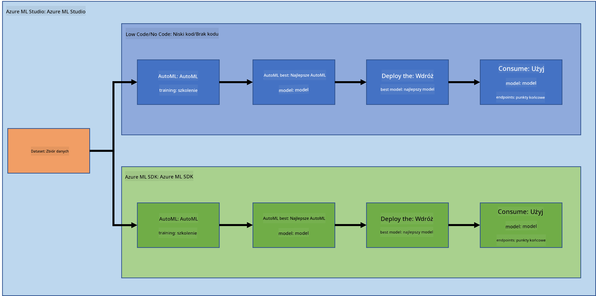
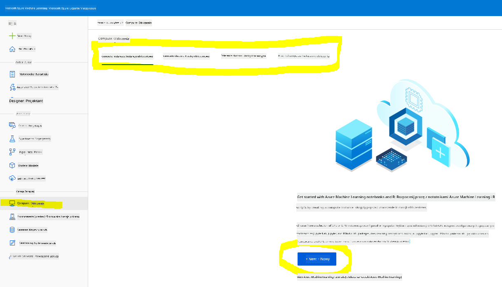
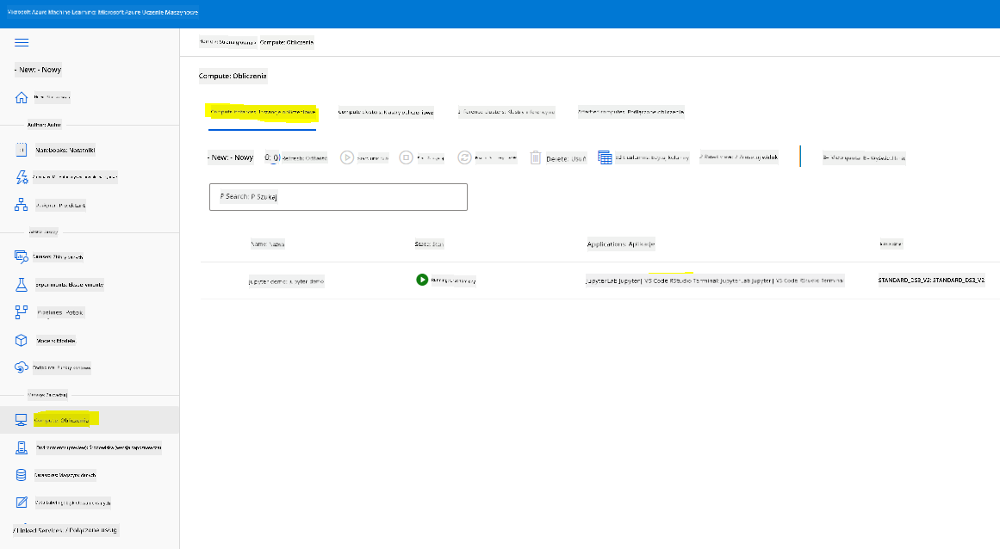
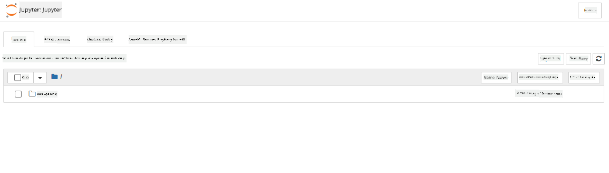

<!--
CO_OP_TRANSLATOR_METADATA:
{
  "original_hash": "5da2d6b3736f6d668b89de9bf3bdd31b",
  "translation_date": "2025-09-04T14:36:10+00:00",
  "source_file": "5-Data-Science-In-Cloud/19-Azure/README.md",
  "language_code": "pl"
}
-->
# Data Science w Chmurze: Podejście "Azure ML SDK"

| ](../../sketchnotes/19-DataScience-Cloud.png)|
|:---:|
| Data Science w Chmurze: Azure ML SDK - _Sketchnote autorstwa [@nitya](https://twitter.com/nitya)_ |

Spis treści:

- [Data Science w Chmurze: Podejście "Azure ML SDK"](../../../../5-Data-Science-In-Cloud/19-Azure)
  - [Quiz przed wykładem](../../../../5-Data-Science-In-Cloud/19-Azure)
  - [1. Wprowadzenie](../../../../5-Data-Science-In-Cloud/19-Azure)
    - [1.1 Co to jest Azure ML SDK?](../../../../5-Data-Science-In-Cloud/19-Azure)
    - [1.2 Projekt przewidywania niewydolności serca i wprowadzenie do zbioru danych](../../../../5-Data-Science-In-Cloud/19-Azure)
  - [2. Trenowanie modelu za pomocą Azure ML SDK](../../../../5-Data-Science-In-Cloud/19-Azure)
    - [2.1 Tworzenie przestrzeni roboczej Azure ML](../../../../5-Data-Science-In-Cloud/19-Azure)
    - [2.2 Tworzenie instancji obliczeniowej](../../../../5-Data-Science-In-Cloud/19-Azure)
    - [2.3 Ładowanie zbioru danych](../../../../5-Data-Science-In-Cloud/19-Azure)
    - [2.4 Tworzenie notebooków](../../../../5-Data-Science-In-Cloud/19-Azure)
    - [2.5 Trenowanie modelu](../../../../5-Data-Science-In-Cloud/19-Azure)
      - [2.5.1 Konfiguracja przestrzeni roboczej, eksperymentu, klastra obliczeniowego i zbioru danych](../../../../5-Data-Science-In-Cloud/19-Azure)
      - [2.5.2 Konfiguracja AutoML i trenowanie](../../../../5-Data-Science-In-Cloud/19-Azure)
  - [3. Wdrażanie modelu i korzystanie z punktu końcowego za pomocą Azure ML SDK](../../../../5-Data-Science-In-Cloud/19-Azure)
    - [3.1 Zapisywanie najlepszego modelu](../../../../5-Data-Science-In-Cloud/19-Azure)
    - [3.2 Wdrażanie modelu](../../../../5-Data-Science-In-Cloud/19-Azure)
    - [3.3 Konsumpcja punktu końcowego](../../../../5-Data-Science-In-Cloud/19-Azure)
  - [🚀 Wyzwanie](../../../../5-Data-Science-In-Cloud/19-Azure)
  - [Quiz po wykładzie](../../../../5-Data-Science-In-Cloud/19-Azure)
  - [Przegląd i samodzielna nauka](../../../../5-Data-Science-In-Cloud/19-Azure)
  - [Zadanie domowe](../../../../5-Data-Science-In-Cloud/19-Azure)

## [Quiz przed wykładem](https://purple-hill-04aebfb03.1.azurestaticapps.net/quiz/36)

## 1. Wprowadzenie

### 1.1 Co to jest Azure ML SDK?

Data scientist i deweloperzy AI używają Azure Machine Learning SDK do budowania i uruchamiania przepływów pracy związanych z uczeniem maszynowym za pomocą usługi Azure Machine Learning. Możesz korzystać z tej usługi w dowolnym środowisku Python, w tym Jupyter Notebooks, Visual Studio Code lub ulubionym IDE dla Pythona.

Kluczowe obszary SDK obejmują:

- Eksplorację, przygotowanie i zarządzanie cyklem życia zbiorów danych używanych w eksperymentach uczenia maszynowego.
- Zarządzanie zasobami chmurowymi w celu monitorowania, logowania i organizowania eksperymentów uczenia maszynowego.
- Trenowanie modeli lokalnie lub z wykorzystaniem zasobów chmurowych, w tym przyspieszonego trenowania modeli na GPU.
- Korzystanie z automatycznego uczenia maszynowego, które akceptuje parametry konfiguracji i dane treningowe. Automatycznie iteruje przez algorytmy i ustawienia hiperparametrów, aby znaleźć najlepszy model do przewidywań.
- Wdrażanie usług internetowych w celu przekształcenia wytrenowanych modeli w usługi RESTful, które mogą być używane w dowolnej aplikacji.

[Dowiedz się więcej o Azure Machine Learning SDK](https://docs.microsoft.com/python/api/overview/azure/ml?WT.mc_id=academic-77958-bethanycheum&ocid=AID3041109)

W [poprzedniej lekcji](../18-Low-Code/README.md) zobaczyliśmy, jak trenować, wdrażać i korzystać z modelu w sposób Low code/No code. Użyliśmy zbioru danych dotyczącego niewydolności serca, aby wygenerować model przewidywania niewydolności serca. W tej lekcji zrobimy dokładnie to samo, ale używając Azure Machine Learning SDK.



### 1.2 Projekt przewidywania niewydolności serca i wprowadzenie do zbioru danych

Sprawdź [tutaj](../18-Low-Code/README.md) wprowadzenie do projektu przewidywania niewydolności serca i zbioru danych.

## 2. Trenowanie modelu za pomocą Azure ML SDK
### 2.1 Tworzenie przestrzeni roboczej Azure ML

Dla uproszczenia będziemy pracować w notebooku Jupyter. Zakładamy, że masz już przestrzeń roboczą i instancję obliczeniową. Jeśli masz już przestrzeń roboczą, możesz przejść bezpośrednio do sekcji 2.3 Tworzenie notebooków.

Jeśli nie, postępuj zgodnie z instrukcjami w sekcji **2.1 Tworzenie przestrzeni roboczej Azure ML** w [poprzedniej lekcji](../18-Low-Code/README.md), aby utworzyć przestrzeń roboczą.

### 2.2 Tworzenie instancji obliczeniowej

W [przestrzeni roboczej Azure ML](https://ml.azure.com/), którą utworzyliśmy wcześniej, przejdź do menu Compute, gdzie zobaczysz różne dostępne zasoby obliczeniowe.



Stwórzmy instancję obliczeniową, aby uruchomić notebook Jupyter. 
1. Kliknij przycisk + New. 
2. Nadaj nazwę swojej instancji obliczeniowej.
3. Wybierz opcje: CPU lub GPU, rozmiar maszyny wirtualnej i liczbę rdzeni.
4. Kliknij przycisk Create.

Gratulacje, właśnie utworzyłeś instancję obliczeniową! Użyjemy tej instancji do stworzenia notebooka w sekcji [Tworzenie notebooków](../../../../5-Data-Science-In-Cloud/19-Azure).

### 2.3 Ładowanie zbioru danych
Jeśli jeszcze nie załadowałeś zbioru danych, odwołaj się do sekcji **2.3 Ładowanie zbioru danych** w [poprzedniej lekcji](../18-Low-Code/README.md).

### 2.4 Tworzenie notebooków

> **_UWAGA:_** W kolejnym kroku możesz stworzyć nowy notebook od podstaw lub załadować [notebook, który stworzyliśmy](notebook.ipynb) w Azure ML Studio. Aby go załadować, po prostu kliknij menu "Notebook" i załaduj notebook.

Notebooki są bardzo ważnym elementem procesu data science. Mogą być używane do przeprowadzania eksploracyjnej analizy danych (EDA), wywoływania klastra obliczeniowego w celu trenowania modelu, wywoływania klastra inferencyjnego w celu wdrożenia punktu końcowego.

Aby stworzyć notebook, potrzebujemy węzła obliczeniowego, który obsługuje instancję notebooka Jupyter. Wróć do [przestrzeni roboczej Azure ML](https://ml.azure.com/) i kliknij na Instancje obliczeniowe. Na liście instancji obliczeniowych powinieneś zobaczyć [instancję obliczeniową, którą stworzyliśmy wcześniej](../../../../5-Data-Science-In-Cloud/19-Azure). 

1. W sekcji Applications kliknij opcję Jupyter. 
2. Zaznacz pole "Yes, I understand" i kliknij przycisk Continue.

3. Powinno otworzyć się nowe okno przeglądarki z instancją notebooka Jupyter. Kliknij przycisk "New", aby stworzyć nowy notebook.



Teraz, gdy mamy notebook, możemy rozpocząć trenowanie modelu za pomocą Azure ML SDK.

### 2.5 Trenowanie modelu

Przede wszystkim, jeśli masz jakiekolwiek wątpliwości, odwołaj się do [dokumentacji Azure ML SDK](https://docs.microsoft.com/python/api/overview/azure/ml?WT.mc_id=academic-77958-bethanycheum&ocid=AID3041109). Zawiera ona wszystkie niezbędne informacje, aby zrozumieć moduły, które zobaczymy w tej lekcji.

#### 2.5.1 Konfiguracja przestrzeni roboczej, eksperymentu, klastra obliczeniowego i zbioru danych

Musisz załadować `workspace` z pliku konfiguracyjnego za pomocą następującego kodu:

```python
from azureml.core import Workspace
ws = Workspace.from_config()
```

To zwraca obiekt typu `Workspace`, który reprezentuje przestrzeń roboczą. Następnie musisz stworzyć `experiment` za pomocą następującego kodu:

```python
from azureml.core import Experiment
experiment_name = 'aml-experiment'
experiment = Experiment(ws, experiment_name)
```
Aby uzyskać lub stworzyć eksperyment w przestrzeni roboczej, należy odwołać się do eksperymentu za pomocą jego nazwy. Nazwa eksperymentu musi mieć od 3 do 36 znaków, zaczynać się od litery lub cyfry i może zawierać tylko litery, cyfry, podkreślenia i myślniki. Jeśli eksperyment nie zostanie znaleziony w przestrzeni roboczej, zostanie utworzony nowy eksperyment.

Teraz musisz stworzyć klaster obliczeniowy do trenowania za pomocą następującego kodu. Zauważ, że ten krok może zająć kilka minut. 

```python
from azureml.core.compute import AmlCompute

aml_name = "heart-f-cluster"
try:
    aml_compute = AmlCompute(ws, aml_name)
    print('Found existing AML compute context.')
except:
    print('Creating new AML compute context.')
    aml_config = AmlCompute.provisioning_configuration(vm_size = "Standard_D2_v2", min_nodes=1, max_nodes=3)
    aml_compute = AmlCompute.create(ws, name = aml_name, provisioning_configuration = aml_config)
    aml_compute.wait_for_completion(show_output = True)

cts = ws.compute_targets
compute_target = cts[aml_name]
```

Możesz pobrać zbiór danych z przestrzeni roboczej, używając nazwy zbioru danych w następujący sposób:

```python
dataset = ws.datasets['heart-failure-records']
df = dataset.to_pandas_dataframe()
df.describe()
```
#### 2.5.2 Konfiguracja AutoML i trenowanie

Aby skonfigurować AutoML, użyj klasy [AutoMLConfig](https://docs.microsoft.com/python/api/azureml-train-automl-client/azureml.train.automl.automlconfig(class)?WT.mc_id=academic-77958-bethanycheum&ocid=AID3041109).

Jak opisano w dokumentacji, istnieje wiele parametrów, z którymi możesz eksperymentować. W tym projekcie użyjemy następujących parametrów:

- `experiment_timeout_minutes`: Maksymalny czas (w minutach), przez jaki eksperyment może być uruchamiany, zanim zostanie automatycznie zatrzymany, a wyniki automatycznie udostępnione.
- `max_concurrent_iterations`: Maksymalna liczba równoczesnych iteracji treningowych dozwolona dla eksperymentu.
- `primary_metric`: Główny wskaźnik używany do określenia statusu eksperymentu.
- `compute_target`: Cel obliczeniowy Azure Machine Learning, na którym ma być uruchomiony eksperyment AutoML.
- `task`: Typ zadania do wykonania. Wartości mogą być 'classification', 'regression' lub 'forecasting', w zależności od rodzaju problemu AutoML do rozwiązania.
- `training_data`: Dane treningowe do wykorzystania w eksperymencie. Powinny zawierać zarówno cechy treningowe, jak i kolumnę etykiet (opcjonalnie kolumnę wag próbek).
- `label_column_name`: Nazwa kolumny etykiet.
- `path`: Pełna ścieżka do folderu projektu Azure Machine Learning.
- `enable_early_stopping`: Czy włączyć wczesne zakończenie, jeśli wynik nie poprawia się w krótkim okresie.
- `featurization`: Wskaźnik, czy etap featuryzacji powinien być wykonywany automatycznie, czy nie, lub czy powinna być używana niestandardowa featuryzacja.
- `debug_log`: Plik logów do zapisywania informacji debugowych.

```python
from azureml.train.automl import AutoMLConfig

project_folder = './aml-project'

automl_settings = {
    "experiment_timeout_minutes": 20,
    "max_concurrent_iterations": 3,
    "primary_metric" : 'AUC_weighted'
}

automl_config = AutoMLConfig(compute_target=compute_target,
                             task = "classification",
                             training_data=dataset,
                             label_column_name="DEATH_EVENT",
                             path = project_folder,  
                             enable_early_stopping= True,
                             featurization= 'auto',
                             debug_log = "automl_errors.log",
                             **automl_settings
                            )
```
Teraz, gdy konfiguracja jest ustawiona, możesz wytrenować model za pomocą następującego kodu. Ten krok może zająć do godziny, w zależności od rozmiaru klastra.

```python
remote_run = experiment.submit(automl_config)
```
Możesz uruchomić widget RunDetails, aby wyświetlić różne eksperymenty.
```python
from azureml.widgets import RunDetails
RunDetails(remote_run).show()
```
## 3. Wdrażanie modelu i korzystanie z punktu końcowego za pomocą Azure ML SDK

### 3.1 Zapisywanie najlepszego modelu

Obiekt `remote_run` jest typu [AutoMLRun](https://docs.microsoft.com/python/api/azureml-train-automl-client/azureml.train.automl.run.automlrun?WT.mc_id=academic-77958-bethanycheum&ocid=AID3041109). Ten obiekt zawiera metodę `get_output()`, która zwraca najlepszy przebieg i odpowiadający mu wytrenowany model.

```python
best_run, fitted_model = remote_run.get_output()
```
Możesz zobaczyć parametry użyte dla najlepszego modelu, po prostu drukując fitted_model, oraz zobaczyć właściwości najlepszego modelu, używając metody [get_properties()](https://docs.microsoft.com/python/api/azureml-core/azureml.core.run(class)?view=azure-ml-py#azureml_core_Run_get_properties?WT.mc_id=academic-77958-bethanycheum&ocid=AID3041109).

```python
best_run.get_properties()
```

Teraz zarejestruj model za pomocą metody [register_model](https://docs.microsoft.com/python/api/azureml-train-automl-client/azureml.train.automl.run.automlrun?view=azure-ml-py#register-model-model-name-none--description-none--tags-none--iteration-none--metric-none-?WT.mc_id=academic-77958-bethanycheum&ocid=AID3041109).
```python
model_name = best_run.properties['model_name']
script_file_name = 'inference/score.py'
best_run.download_file('outputs/scoring_file_v_1_0_0.py', 'inference/score.py')
description = "aml heart failure project sdk"
model = best_run.register_model(model_name = model_name,
                                model_path = './outputs/',
                                description = description,
                                tags = None)
```
### 3.2 Wdrażanie modelu

Gdy najlepszy model zostanie zapisany, możemy go wdrożyć za pomocą klasy [InferenceConfig](https://docs.microsoft.com/python/api/azureml-core/azureml.core.model.inferenceconfig?view=azure-ml-py?ocid=AID3041109). InferenceConfig reprezentuje ustawienia konfiguracji dla niestandardowego środowiska używanego do wdrożenia. Klasa [AciWebservice](https://docs.microsoft.com/python/api/azureml-core/azureml.core.webservice.aciwebservice?view=azure-ml-py) reprezentuje model uczenia maszynowego wdrożony jako punkt końcowy usługi internetowej na Azure Container Instances. Wdrożona usługa jest zrównoważonym obciążeniem, punktem końcowym HTTP z interfejsem REST API. Możesz wysyłać dane do tego API i otrzymywać przewidywania zwracane przez model.

Model jest wdrażany za pomocą metody [deploy](https://docs.microsoft.com/python/api/azureml-core/azureml.core.model(class)?view=azure-ml-py#deploy-workspace--name--models--inference-config-none--deployment-config-none--deployment-target-none--overwrite-false--show-output-false-?WT.mc_id=academic-77958-bethanycheum&ocid=AID3041109).

```python
from azureml.core.model import InferenceConfig, Model
from azureml.core.webservice import AciWebservice

inference_config = InferenceConfig(entry_script=script_file_name, environment=best_run.get_environment())

aciconfig = AciWebservice.deploy_configuration(cpu_cores = 1,
                                               memory_gb = 1,
                                               tags = {'type': "automl-heart-failure-prediction"},
                                               description = 'Sample service for AutoML Heart Failure Prediction')

aci_service_name = 'automl-hf-sdk'
aci_service = Model.deploy(ws, aci_service_name, [model], inference_config, aciconfig)
aci_service.wait_for_deployment(True)
print(aci_service.state)
```
Ten krok powinien zająć kilka minut.

### 3.3 Konsumpcja punktu końcowego

Możesz korzystać z punktu końcowego, tworząc przykładowe dane wejściowe:

```python
data = {
    "data":
    [
        {
            'age': "60",
            'anaemia': "false",
            'creatinine_phosphokinase': "500",
            'diabetes': "false",
            'ejection_fraction': "38",
            'high_blood_pressure': "false",
            'platelets': "260000",
            'serum_creatinine': "1.40",
            'serum_sodium': "137",
            'sex': "false",
            'smoking': "false",
            'time': "130",
        },
    ],
}

test_sample = str.encode(json.dumps(data))
```
A następnie możesz wysłać te dane wejściowe do swojego modelu w celu przewidywania:
```python
response = aci_service.run(input_data=test_sample)
response
```
To powinno zwrócić `'{"result": [false]}'`. Oznacza to, że dane pacjenta, które przesłaliśmy do punktu końcowego, wygenerowały predykcję `false`, co oznacza, że ta osoba prawdopodobnie nie jest zagrożona zawałem serca.

Gratulacje! Właśnie skorzystałeś z modelu wdrożonego i wytrenowanego na Azure ML za pomocą Azure ML SDK!

> **_NOTE:_** Po zakończeniu projektu nie zapomnij usunąć wszystkich zasobów.

## 🚀 Wyzwanie

Jest wiele innych rzeczy, które można zrobić za pomocą SDK, niestety nie możemy omówić ich wszystkich w tej lekcji. Ale dobra wiadomość: nauczenie się, jak przeszukiwać dokumentację SDK, może zaprowadzić Cię daleko na własną rękę. Sprawdź dokumentację Azure ML SDK i znajdź klasę `Pipeline`, która pozwala tworzyć potoki. Potok to zbiór kroków, które można wykonać jako przepływ pracy.

**Wskazówka:** Przejdź do [dokumentacji SDK](https://docs.microsoft.com/python/api/overview/azure/ml/?view=azure-ml-py?WT.mc_id=academic-77958-bethanycheum&ocid=AID3041109) i wpisz słowa kluczowe w pasku wyszukiwania, takie jak "Pipeline". Powinieneś znaleźć klasę `azureml.pipeline.core.Pipeline` w wynikach wyszukiwania.

## [Quiz po wykładzie](https://ff-quizzes.netlify.app/en/ds/)

## Przegląd i samodzielna nauka

W tej lekcji nauczyłeś się, jak trenować, wdrażać i korzystać z modelu do przewidywania ryzyka niewydolności serca za pomocą Azure ML SDK w chmurze. Sprawdź tę [dokumentację](https://docs.microsoft.com/python/api/overview/azure/ml/?view=azure-ml-py?WT.mc_id=academic-77958-bethanycheum&ocid=AID3041109), aby uzyskać więcej informacji o Azure ML SDK. Spróbuj stworzyć własny model za pomocą Azure ML SDK.

## Zadanie

[Projekt Data Science z użyciem Azure ML SDK](assignment.md)

---

**Zastrzeżenie**:  
Ten dokument został przetłumaczony za pomocą usługi tłumaczenia AI [Co-op Translator](https://github.com/Azure/co-op-translator). Chociaż dokładamy wszelkich starań, aby tłumaczenie było precyzyjne, prosimy pamiętać, że automatyczne tłumaczenia mogą zawierać błędy lub nieścisłości. Oryginalny dokument w jego języku źródłowym powinien być uznawany za autorytatywne źródło. W przypadku informacji o kluczowym znaczeniu zaleca się skorzystanie z profesjonalnego tłumaczenia przez człowieka. Nie ponosimy odpowiedzialności za jakiekolwiek nieporozumienia lub błędne interpretacje wynikające z użycia tego tłumaczenia.