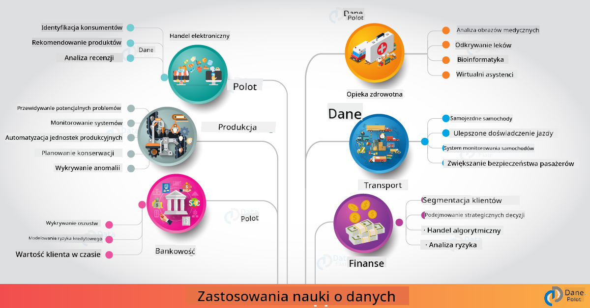

<!--
CO_OP_TRANSLATOR_METADATA:
{
  "original_hash": "67076ed50f54e7d26ba1ba378d6078f1",
  "translation_date": "2025-08-24T21:49:22+00:00",
  "source_file": "6-Data-Science-In-Wild/20-Real-World-Examples/README.md",
  "language_code": "pl"
}
-->
# Data Science w Rzeczywistym Świecie

|  ](../../sketchnotes/20-DataScience-RealWorld.png) |
| :--------------------------------------------------------------------------------------------------------------: |
|               Data Science w Rzeczywistym Świecie - _Sketchnote by [@nitya](https://twitter.com/nitya)_               |

Jesteśmy prawie na końcu tej podróży edukacyjnej!

Zaczęliśmy od definicji data science i etyki, zbadaliśmy różne narzędzia i techniki analizy oraz wizualizacji danych, przeanalizowaliśmy cykl życia data science, a także przyjrzeliśmy się skalowaniu i automatyzacji procesów data science za pomocą usług chmurowych. Pewnie zastanawiasz się: _"Jak dokładnie mogę przełożyć te wszystkie nauki na rzeczywiste konteksty?"_

W tej lekcji zbadamy zastosowania data science w różnych branżach i przyjrzymy się konkretnym przykładom w obszarach badań, humanistyki cyfrowej i zrównoważonego rozwoju. Omówimy również możliwości projektów studenckich i zakończymy przydatnymi zasobami, które pomogą Ci kontynuować naukę!

## Quiz Przed Lekcją

[Quiz przed lekcją](https://purple-hill-04aebfb03.1.azurestaticapps.net/quiz/38)

## Data Science + Przemysł

Dzięki demokratyzacji AI, programiści mają teraz łatwiejszy dostęp do projektowania i integracji decyzji opartych na AI oraz wniosków opartych na danych w doświadczeniach użytkowników i procesach rozwoju. Oto kilka przykładów, jak data science jest "stosowane" w rzeczywistych aplikacjach w przemyśle:

 * [Google Flu Trends](https://www.wired.com/2015/10/can-learn-epic-failure-google-flu-trends/) wykorzystało data science do korelacji wyszukiwanych haseł z trendami grypy. Choć podejście miało wady, zwróciło uwagę na możliwości (i wyzwania) prognozowania zdrowotnego opartego na danych.

 * [UPS Routing Predictions](https://www.technologyreview.com/2018/11/21/139000/how-ups-uses-ai-to-outsmart-bad-weather/) - opisuje, jak UPS wykorzystuje data science i uczenie maszynowe do przewidywania optymalnych tras dostaw, uwzględniając warunki pogodowe, wzorce ruchu, terminy dostaw i inne czynniki.

 * [NYC Taxicab Route Visualization](http://chriswhong.github.io/nyctaxi/) - dane zebrane dzięki [Freedom Of Information Laws](https://chriswhong.com/open-data/foil_nyc_taxi/) pomogły zwizualizować dzień z życia taksówek w Nowym Jorku, pokazując, jak poruszają się po zatłoczonym mieście, ile zarabiają i jak długo trwają ich kursy w ciągu 24 godzin.

 * [Uber Data Science Workbench](https://eng.uber.com/dsw/) - wykorzystuje dane (o miejscach odbioru i dowozu, czasie trwania podróży, preferowanych trasach itp.) zebrane z milionów codziennych przejazdów Ubera do budowy narzędzia analitycznego wspierającego wyceny, bezpieczeństwo, wykrywanie oszustw i decyzje nawigacyjne.

 * [Sports Analytics](https://towardsdatascience.com/scope-of-analytics-in-sports-world-37ed09c39860) - koncentruje się na _analizie predykcyjnej_ (analiza drużyn i zawodników - jak w [Moneyball](https://datasciencedegree.wisconsin.edu/blog/moneyball-proves-importance-big-data-big-ideas/) - oraz zarządzanie fanami) i _wizualizacji danych_ (dashboardy drużyn i fanów, gry itp.) z zastosowaniami takimi jak scouting talentów, zakłady sportowe i zarządzanie obiektami/wydarzeniami.

 * [Data Science w Bankowości](https://data-flair.training/blogs/data-science-in-banking/) - podkreśla wartość data science w branży finansowej, z zastosowaniami od modelowania ryzyka i wykrywania oszustw, po segmentację klientów, prognozowanie w czasie rzeczywistym i systemy rekomendacji. Analiza predykcyjna wspiera również kluczowe miary, takie jak [oceny kredytowe](https://dzone.com/articles/using-big-data-and-predictive-analytics-for-credit).

 * [Data Science w Ochronie Zdrowia](https://data-flair.training/blogs/data-science-in-healthcare/) - podkreśla zastosowania takie jak obrazowanie medyczne (np. MRI, RTG, tomografia komputerowa), genomika (sekwencjonowanie DNA), rozwój leków (ocena ryzyka, prognozowanie sukcesu), analiza predykcyjna (opieka nad pacjentem i logistyka dostaw), śledzenie i zapobieganie chorobom itp.

 Źródło obrazu: [Data Flair: 6 Amazing Data Science Applications ](https://data-flair.training/blogs/data-science-applications/)

Rysunek pokazuje inne dziedziny i przykłady zastosowania technik data science. Chcesz zbadać inne zastosowania? Sprawdź sekcję [Przegląd i Samodzielna Nauka](../../../../6-Data-Science-In-Wild/20-Real-World-Examples) poniżej.

## Data Science + Badania

|  ](../../sketchnotes/20-DataScience-Research.png) |
| :---------------------------------------------------------------------------------------------------------------: |
|              Data Science & Badania - _Sketchnote by [@nitya](https://twitter.com/nitya)_              |

Podczas gdy rzeczywiste zastosowania często koncentrują się na przypadkach użycia w przemyśle na dużą skalę, zastosowania i projekty _badawcze_ mogą być użyteczne z dwóch perspektyw:

* _możliwości innowacji_ - eksploracja szybkiego prototypowania zaawansowanych koncepcji i testowanie doświadczeń użytkowników dla aplikacji nowej generacji.
* _wyzwania wdrożeniowe_ - badanie potencjalnych szkód lub niezamierzonych konsekwencji technologii data science w rzeczywistych kontekstach.

Dla studentów projekty badawcze mogą dostarczyć zarówno możliwości nauki, jak i współpracy, które poprawią zrozumienie tematu oraz poszerzą świadomość i zaangażowanie w pracę z odpowiednimi osobami lub zespołami w obszarach zainteresowań. Jak więc wyglądają projekty badawcze i jaki mogą mieć wpływ?

Przyjrzyjmy się jednemu przykładowi - [MIT Gender Shades Study](http://gendershades.org/overview.html) autorstwa Joy Buolamwini (MIT Media Labs) z [kluczowym artykułem badawczym](http://proceedings.mlr.press/v81/buolamwini18a/buolamwini18a.pdf) współautorstwa Timnit Gebru (wówczas w Microsoft Research), który koncentrował się na:

 * **Co:** Celem projektu badawczego była _ocena uprzedzeń obecnych w algorytmach i zbiorach danych do analizy twarzy_ w oparciu o płeć i typ skóry.
 * **Dlaczego:** Analiza twarzy jest wykorzystywana w takich obszarach jak egzekwowanie prawa, bezpieczeństwo na lotniskach, systemy rekrutacyjne i inne - konteksty, w których nieprawidłowe klasyfikacje (np. z powodu uprzedzeń) mogą powodować potencjalne szkody ekonomiczne i społeczne dla dotkniętych osób lub grup. Zrozumienie (i eliminowanie lub łagodzenie) uprzedzeń jest kluczowe dla sprawiedliwości w użytkowaniu.
 * **Jak:** Badacze zauważyli, że istniejące benchmarki wykorzystywały głównie osoby o jaśniejszej karnacji, i stworzyli nowy zbiór danych (ponad 1000 obrazów), który był _bardziej zrównoważony_ pod względem płci i typu skóry. Zbiór danych został użyty do oceny dokładności trzech produktów do klasyfikacji płci (od Microsoft, IBM i Face++).

Wyniki pokazały, że choć ogólna dokładność klasyfikacji była dobra, zauważono znaczną różnicę w wskaźnikach błędów między różnymi podgrupami - z **błędnym przypisaniem płci** częściej występującym u kobiet lub osób o ciemniejszej karnacji, co wskazuje na uprzedzenia.

**Kluczowe Wyniki:** Zwrócono uwagę, że data science potrzebuje bardziej _reprezentatywnych zbiorów danych_ (zrównoważone podgrupy) i bardziej _inkluzji zespołów_ (różnorodne tła), aby wcześniej rozpoznawać i eliminować lub łagodzić takie uprzedzenia w rozwiązaniach AI. Takie badania są również kluczowe dla wielu organizacji w definiowaniu zasad i praktyk dla _odpowiedzialnej AI_, aby poprawić sprawiedliwość w ich produktach i procesach AI.

**Chcesz dowiedzieć się więcej o odpowiednich badaniach w Microsoft?**

* Sprawdź [Projekty Badawcze Microsoft](https://www.microsoft.com/research/research-area/artificial-intelligence/?facet%5Btax%5D%5Bmsr-research-area%5D%5B%5D=13556&facet%5Btax%5D%5Bmsr-content-type%5D%5B%5D=msr-project) dotyczące sztucznej inteligencji.
* Odkryj projekty studenckie z [Microsoft Research Data Science Summer School](https://www.microsoft.com/en-us/research/academic-program/data-science-summer-school/).
* Sprawdź projekt [Fairlearn](https://fairlearn.org/) i inicjatywy [Responsible AI](https://www.microsoft.com/en-us/ai/responsible-ai?activetab=pivot1%3aprimaryr6).

## Data Science + Humanistyka

|  ](../../sketchnotes/20-DataScience-Humanities.png) |
| :---------------------------------------------------------------------------------------------------------------: |
|              Data Science & Humanistyka Cyfrowa - _Sketchnote by [@nitya](https://twitter.com/nitya)_              |

Humanistyka Cyfrowa [została zdefiniowana](https://digitalhumanities.stanford.edu/about-dh-stanford) jako "zbiór praktyk i podejść łączących metody obliczeniowe z badaniami humanistycznymi". [Projekty Stanforda](https://digitalhumanities.stanford.edu/projects) takie jak _"rebooting history"_ i _"poetic thinking"_ ilustrują powiązanie między [Humanistyką Cyfrową a Data Science](https://digitalhumanities.stanford.edu/digital-humanities-and-data-science) - podkreślając techniki takie jak analiza sieci, wizualizacja informacji, analiza przestrzenna i tekstowa, które mogą pomóc nam ponownie przeanalizować historyczne i literackie zbiory danych, aby uzyskać nowe wnioski i perspektywy.

*Chcesz zbadać i rozwinąć projekt w tej dziedzinie?*

Sprawdź ["Emily Dickinson and the Meter of Mood"](https://gist.github.com/jlooper/ce4d102efd057137bc000db796bfd671) - świetny przykład od [Jen Looper](https://twitter.com/jenlooper), który pyta, jak możemy wykorzystać data science, aby ponownie przeanalizować znaną poezję i ocenić jej znaczenie oraz wkład autora w nowych kontekstach. Na przykład, _czy możemy przewidzieć porę roku, w której wiersz został napisany, analizując jego ton lub nastrój_ - i co to mówi nam o stanie umysłu autora w danym okresie?

Aby odpowiedzieć na to pytanie, podążamy za krokami cyklu życia data science:
 * [`Pozyskiwanie Danych`](https://gist.github.com/jlooper/ce4d102efd057137bc000db796bfd671#acquiring-the-dataset) - aby zebrać odpowiedni zbiór danych do analizy. Opcje obejmują korzystanie z API (np. [Poetry DB API](https://poetrydb.org/index.html)) lub skrobanie stron internetowych (np. [Project Gutenberg](https://www.gutenberg.org/files/12242/12242-h/12242-h.htm)) za pomocą narzędzi takich jak [Scrapy](https://scrapy.org/).
 * [`Czyszczenie Danych`](https://gist.github.com/jlooper/ce4d102efd057137bc000db796bfd671#clean-the-data) - wyjaśnia, jak tekst może być formatowany, oczyszczany i upraszczany za pomocą podstawowych narzędzi, takich jak Visual Studio Code i Microsoft Excel.
 * [`Analiza Danych`](https://gist.github.com/jlooper/ce4d102efd057137bc000db796bfd671#working-with-the-data-in-a-notebook) - wyjaśnia, jak możemy teraz zaimportować zbiór danych do "Notatników" w celu analizy za pomocą pakietów Python (takich jak pandas, numpy i matplotlib) do organizowania i wizualizacji danych.
 * [`Analiza Nastrojów`](https://gist.github.com/jlooper/ce4d102efd057137bc000db796bfd671#sentiment-analysis-using-cognitive-services) - wyjaśnia, jak możemy zintegrować usługi chmurowe, takie jak Text Analytics, używając narzędzi niskokodowych, takich jak [Power Automate](https://flow.microsoft.com/en-us/) do zautomatyzowanych przepływów pracy przetwarzania danych.

Korzystając z tego przepływu pracy, możemy zbadać sezonowe wpływy na nastrój wierszy i pomóc nam wyrobić własne opinie na temat autora. Wypróbuj to sam - a następnie rozbuduj notatnik, aby zadać inne pytania lub zwizualizować dane w nowy sposób!

> Możesz użyć niektórych narzędzi z [Digital Humanities toolkit](https://github.com/Digital-Humanities-Toolkit), aby realizować te kierunki badań.

## Data Science + Zrównoważony Rozwój

|  ](../../sketchnotes/20-DataScience-Sustainability.png) |
| :---------------------------------------------------------------------------------------------------------------: |
|              Data Science & Zrównoważony Rozwój - _Sketchnote by [@nitya](https://twitter.com/nitya)_              |

[Agenda na Rzecz Zrównoważonego Rozwoju 2030](https://sdgs.un.org/2030agenda) - przyjęta przez wszystkich członków ONZ w 2015 roku - identyfikuje 17 celów, w tym te, które koncentrują się na **Ochronie Planety** przed degradacją i skutkami zmian klimatycznych. Inicjatywa [Microsoft Sustainability](https://www.microsoft.com/en-us/sustainability) wspiera te cele, badając, w jaki sposób rozwiązania technologiczne mogą wspierać i budować bardziej zrównoważoną przyszłość, z [fokusem na 4 cele](https://dev.to/azure/a-visual-guide-to-sustainable-software-engineering-53hh) - bycie neutralnym węglowo, pozytywnym wodnie, bezodpadowym i bioróżnorodnym do 2030 roku.

Rozwiązywanie tych wyzwań w sposób skalowalny i terminowy wymaga myślenia w skali chmury - oraz dużych zbiorów danych. Inicjatywa [Planetary Computer](https://planetarycomputer.microsoft.com/) oferuje 4 komponenty, które pomagają data scientistom i programistom w tym wysiłku:
 
 * [Katalog Danych](https://planetarycomputer.microsoft.com/catalog) - z petabajtami danych o systemach Ziemi (dostępnych za darmo i hostowanych na Azure).
 * [Planetary API](https://planetarycomputer.microsoft.com/docs/reference/stac/) - aby pomóc użytkownikom w wyszukiwaniu odpowiednich danych w przestrzeni i czasie.
 * [Hub](https://planetarycomputer.microsoft.com/docs/overview/environment/) - zarządzane środowisko dla naukowców do przetwarzania ogromnych zbiorów danych geospołecznych.
 * [Aplikacje](https://planetarycomputer.microsoft.com/applications) - prezentują przypadki użycia i narzędzia do uzyskiwania wniosków dotyczących zrównoważonego rozwoju.
**Projekt Planetary Computer jest obecnie w fazie testowej (stan na wrzesień 2021)** - oto jak możesz zacząć przyczyniać się do rozwiązań na rzecz zrównoważonego rozwoju, wykorzystując naukę o danych.

* [Poproś o dostęp](https://planetarycomputer.microsoft.com/account/request), aby rozpocząć eksplorację i nawiązać kontakt z innymi użytkownikami.
* [Przeglądaj dokumentację](https://planetarycomputer.microsoft.com/docs/overview/about), aby zrozumieć obsługiwane zestawy danych i interfejsy API.
* Odkrywaj aplikacje, takie jak [Monitorowanie ekosystemu](https://analytics-lab.org/ecosystemmonitoring/), aby znaleźć inspirację do tworzenia własnych pomysłów na aplikacje.

Zastanów się, jak możesz wykorzystać wizualizację danych, aby ujawnić lub wzmocnić istotne spostrzeżenia dotyczące takich obszarów jak zmiany klimatyczne czy wylesianie. Albo pomyśl, jak te spostrzeżenia mogą być użyte do tworzenia nowych doświadczeń użytkownika, które motywują do zmiany zachowań na bardziej zrównoważone.

## Nauka o danych + Studenci

Rozmawialiśmy o zastosowaniach w przemyśle i badaniach, a także o przykładach aplikacji nauki o danych w humanistyce cyfrowej i zrównoważonym rozwoju. Jak więc możesz rozwijać swoje umiejętności i dzielić się wiedzą jako początkujący w nauce o danych?

Oto kilka przykładów projektów studenckich z zakresu nauki o danych, które mogą Cię zainspirować.

 * [Letnia szkoła nauki o danych MSR](https://www.microsoft.com/en-us/research/academic-program/data-science-summer-school/#!projects) z projektami na GitHubie [projects](https://github.com/msr-ds3), które eksplorują takie tematy jak:
    - [Rasowe uprzedzenia w użyciu siły przez policję](https://www.microsoft.com/en-us/research/video/data-science-summer-school-2019-replicating-an-empirical-analysis-of-racial-differences-in-police-use-of-force/) | [Github](https://github.com/msr-ds3/stop-question-frisk)
    - [Niezawodność systemu metra w Nowym Jorku](https://www.microsoft.com/en-us/research/video/data-science-summer-school-2018-exploring-the-reliability-of-the-nyc-subway-system/) | [Github](https://github.com/msr-ds3/nyctransit)
 * [Cyfryzacja kultury materialnej: Badanie rozkładów społeczno-ekonomicznych w Sirkap](https://claremont.maps.arcgis.com/apps/Cascade/index.html?appid=bdf2aef0f45a4674ba41cd373fa23afc) - od [Ornella Altunyan](https://twitter.com/ornelladotcom) i zespołu z Claremont, wykorzystując [ArcGIS StoryMaps](https://storymaps.arcgis.com/).

## 🚀 Wyzwanie

Poszukaj artykułów, które polecają projekty z zakresu nauki o danych przyjazne dla początkujących - na przykład [te 50 obszarów tematycznych](https://www.upgrad.com/blog/data-science-project-ideas-topics-beginners/) lub [te 21 pomysłów na projekty](https://www.intellspot.com/data-science-project-ideas) albo [te 16 projektów z kodem źródłowym](https://data-flair.training/blogs/data-science-project-ideas/), które możesz rozłożyć na części i przerobić. Nie zapomnij również blogować o swoich doświadczeniach w nauce i dzielić się swoimi spostrzeżeniami z nami wszystkimi.

## Quiz po wykładzie

[Quiz po wykładzie](https://purple-hill-04aebfb03.1.azurestaticapps.net/quiz/39)

## Przegląd i samodzielna nauka

Chcesz zgłębić więcej przypadków użycia? Oto kilka interesujących artykułów:
 * [17 zastosowań i przykładów nauki o danych](https://builtin.com/data-science/data-science-applications-examples) - lipiec 2021
 * [11 zapierających dech w piersiach zastosowań nauki o danych w rzeczywistości](https://myblindbird.com/data-science-applications-real-world/) - maj 2021
 * [Nauka o danych w rzeczywistości](https://towardsdatascience.com/data-science-in-the-real-world/home) - kolekcja artykułów
 * Nauka o danych w: [Edukacji](https://data-flair.training/blogs/data-science-in-education/), [Rolnictwie](https://data-flair.training/blogs/data-science-in-agriculture/), [Finansach](https://data-flair.training/blogs/data-science-in-finance/), [Filmach](https://data-flair.training/blogs/data-science-at-movies/) i innych.

## Zadanie

[Zbadaj zestaw danych Planetary Computer](assignment.md)

**Zastrzeżenie**:  
Ten dokument został przetłumaczony za pomocą usługi tłumaczenia AI [Co-op Translator](https://github.com/Azure/co-op-translator). Chociaż staramy się zapewnić dokładność, prosimy mieć na uwadze, że automatyczne tłumaczenia mogą zawierać błędy lub nieścisłości. Oryginalny dokument w jego rodzimym języku powinien być uznawany za wiarygodne źródło. W przypadku informacji krytycznych zaleca się skorzystanie z profesjonalnego tłumaczenia wykonanego przez człowieka. Nie ponosimy odpowiedzialności za jakiekolwiek nieporozumienia lub błędne interpretacje wynikające z użycia tego tłumaczenia.