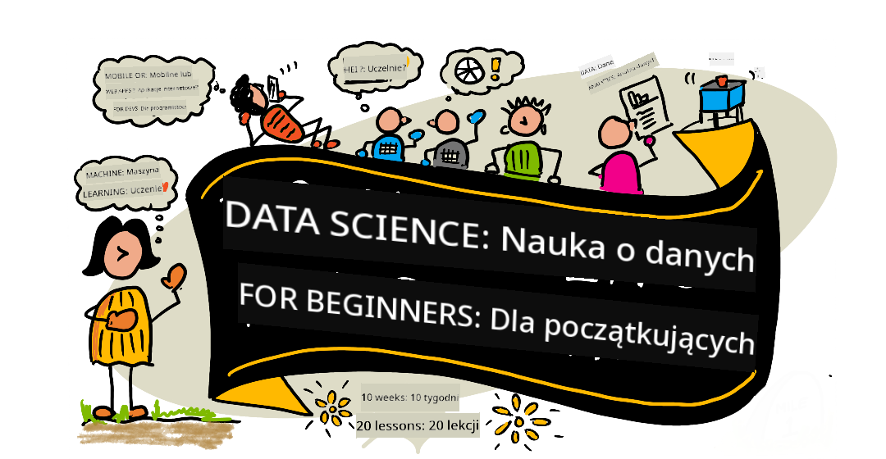

<!--
CO_OP_TRANSLATOR_METADATA:
{
  "original_hash": "dd9a1deb4da680b2cf11ba2e9f5a0a6e",
  "translation_date": "2025-09-29T21:48:52+00:00",
  "source_file": "README.md",
  "language_code": "pl"
}
-->
# Data Science dla Początkujących - Program Nauczania

Azure Cloud Advocates w Microsoft z przyjemnością oferują 10-tygodniowy, 20-lekcyjny program nauczania dotyczący Data Science. Każda lekcja zawiera quizy przed i po lekcji, pisemne instrukcje do wykonania lekcji, rozwiązanie oraz zadanie. Nasze podejście oparte na projektach pozwala uczyć się poprzez tworzenie, co jest sprawdzonym sposobem na trwałe przyswojenie nowych umiejętności.

**Serdeczne podziękowania dla naszych autorów:** [Jasmine Greenaway](https://www.twitter.com/paladique), [Dmitry Soshnikov](http://soshnikov.com), [Nitya Narasimhan](https://twitter.com/nitya), [Jalen McGee](https://twitter.com/JalenMcG), [Jen Looper](https://twitter.com/jenlooper), [Maud Levy](https://twitter.com/maudstweets), [Tiffany Souterre](https://twitter.com/TiffanySouterre), [Christopher Harrison](https://www.twitter.com/geektrainer).

**🙏 Specjalne podziękowania 🙏 dla naszych [Microsoft Student Ambassador](https://studentambassadors.microsoft.com/) autorów, recenzentów i współtwórców treści,** w szczególności Aaryan Arora, [Aditya Garg](https://github.com/AdityaGarg00), [Alondra Sanchez](https://www.linkedin.com/in/alondra-sanchez-molina/), [Ankita Singh](https://www.linkedin.com/in/ankitasingh007), [Anupam Mishra](https://www.linkedin.com/in/anupam--mishra/), [Arpita Das](https://www.linkedin.com/in/arpitadas01/), ChhailBihari Dubey, [Dibri Nsofor](https://www.linkedin.com/in/dibrinsofor), [Dishita Bhasin](https://www.linkedin.com/in/dishita-bhasin-7065281bb), [Majd Safi](https://www.linkedin.com/in/majd-s/), [Max Blum](https://www.linkedin.com/in/max-blum-6036a1186/), [Miguel Correa](https://www.linkedin.com/in/miguelmque/), [Mohamma Iftekher (Iftu) Ebne Jalal](https://twitter.com/iftu119), [Nawrin Tabassum](https://www.linkedin.com/in/nawrin-tabassum), [Raymond Wangsa Putra](https://www.linkedin.com/in/raymond-wp/), [Rohit Yadav](https://www.linkedin.com/in/rty2423), Samridhi Sharma, [Sanya Sinha](https://www.linkedin.com/mwlite/in/sanya-sinha-13aab1200),
[Sheena Narula](https://www.linkedin.com/in/sheena-narua-n/), [Tauqeer Ahmad](https://www.linkedin.com/in/tauqeerahmad5201/), Yogendrasingh Pawar , [Vidushi Gupta](https://www.linkedin.com/in/vidushi-gupta07/), [Jasleen Sondhi](https://www.linkedin.com/in/jasleen-sondhi/)

||
|:---:|
| Data Science dla Początkujących - _Sketchnote autorstwa [@nitya](https://twitter.com/nitya)_ |

### 🌐 Wsparcie wielojęzyczne

#### Obsługiwane przez GitHub Action (Automatyczne i zawsze aktualne)

[Francuski](../fr/README.md) | [Hiszpański](../es/README.md) | [Niemiecki](../de/README.md) | [Rosyjski](../ru/README.md) | [Arabski](../ar/README.md) | [Perski (Farsi)](../fa/README.md) | [Urdu](../ur/README.md) | [Chiński (uproszczony)](../zh/README.md) | [Chiński (tradycyjny, Makau)](../mo/README.md) | [Chiński (tradycyjny, Hongkong)](../hk/README.md) | [Chiński (tradycyjny, Tajwan)](../tw/README.md) | [Japoński](../ja/README.md) | [Koreański](../ko/README.md) | [Hindi](../hi/README.md) | [Bengalski](../bn/README.md) | [Marathi](../mr/README.md) | [Nepalski](../ne/README.md) | [Punjabi (Gurmukhi)](../pa/README.md) | [Portugalski (Portugalia)](../pt/README.md) | [Portugalski (Brazylia)](../br/README.md) | [Włoski](../it/README.md) | [Polski](./README.md) | [Turecki](../tr/README.md) | [Grecki](../el/README.md) | [Tajski](../th/README.md) | [Szwedzki](../sv/README.md) | [Duński](../da/README.md) | [Norweski](../no/README.md) | [Fiński](../fi/README.md) | [Holenderski](../nl/README.md) | [Hebrajski](../he/README.md) | [Wietnamski](../vi/README.md) | [Indonezyjski](../id/README.md) | [Malajski](../ms/README.md) | [Tagalog (Filipiński)](../tl/README.md) | [Suahili](../sw/README.md) | [Węgierski](../hu/README.md) | [Czeski](../cs/README.md) | [Słowacki](../sk/README.md) | [Rumuński](../ro/README.md) | [Bułgarski](../bg/README.md) | [Serbski (cyrylica)](../sr/README.md) | [Chorwacki](../hr/README.md) | [Słoweński](../sl/README.md) | [Ukraiński](../uk/README.md) | [Birmański (Myanmar)](../my/README.md)

**Jeśli chcesz, aby obsługiwane były dodatkowe języki, lista dostępnych języków znajduje się [tutaj](https://github.com/Azure/co-op-translator/blob/main/getting_started/supported-languages.md)**

#### Dołącz do naszej społeczności 

Mamy trwającą serię nauki z AI na Discordzie, dowiedz się więcej i dołącz do nas na [Learn with AI Series](https://aka.ms/learnwithai/discord) od 18 do 30 września 2025. Otrzymasz wskazówki i triki dotyczące korzystania z GitHub Copilot w Data Science.

# Jesteś studentem?

Rozpocznij od następujących zasobów:

- [Strona Student Hub](https://docs.microsoft.com/en-gb/learn/student-hub?WT.mc_id=academic-77958-bethanycheum) Na tej stronie znajdziesz zasoby dla początkujących, pakiety dla studentów, a nawet sposoby na zdobycie darmowego vouchera certyfikacyjnego. To strona, którą warto dodać do zakładek i sprawdzać od czasu do czasu, ponieważ zmieniamy treści co najmniej raz w miesiącu.
- [Microsoft Learn Student Ambassadors](https://studentambassadors.microsoft.com?WT.mc_id=academic-77958-bethanycheum) Dołącz do globalnej społeczności ambasadorów studentów, to może być Twoja droga do Microsoft.

# Rozpoczęcie

> **Nauczyciele**: [dołączyliśmy kilka sugestii](for-teachers.md) dotyczących korzystania z tego programu nauczania. Chętnie poznamy Wasze opinie [na naszym forum dyskusyjnym](https://github.com/microsoft/Data-Science-For-Beginners/discussions)!

> **[Studenci](https://aka.ms/student-page)**: aby korzystać z tego programu nauczania samodzielnie, zrób fork całego repozytorium i wykonaj ćwiczenia samodzielnie, zaczynając od quizu przed lekcją. Następnie przeczytaj lekcję i wykonaj pozostałe aktywności. Spróbuj tworzyć projekty, rozumiejąc lekcje, zamiast kopiować kod rozwiązania; jednak ten kod jest dostępny w folderach /solutions w każdej lekcji opartej na projekcie. Innym pomysłem może być utworzenie grupy naukowej z przyjaciółmi i wspólne przechodzenie przez treści. Do dalszej nauki polecamy [Microsoft Learn](https://docs.microsoft.com/en-us/users/jenlooper-2911/collections/qprpajyoy3x0g7?WT.mc_id=academic-77958-bethanycheum).

## Poznaj zespół

**Gif autorstwa** [Mohit Jaisal](https://www.linkedin.com/in/mohitjaisal)

> 🎥 Kliknij obrazek powyżej, aby obejrzeć film o projekcie i ludziach, którzy go stworzyli!

## Pedagogika

Podczas tworzenia tego programu nauczania wybraliśmy dwa główne założenia pedagogiczne: zapewnienie, że jest on oparty na projektach oraz że zawiera częste quizy. Pod koniec tej serii studenci nauczą się podstawowych zasad data science, w tym koncepcji etycznych, przygotowania danych, różnych sposobów pracy z danymi, wizualizacji danych, analizy danych, rzeczywistych przypadków użycia data science i więcej.

Dodatkowo, quiz o niskim poziomie trudności przed zajęciami ustawia intencję studenta na naukę danego tematu, podczas gdy drugi quiz po zajęciach zapewnia dalsze utrwalenie wiedzy. Ten program nauczania został zaprojektowany tak, aby był elastyczny i przyjemny, i można go realizować w całości lub częściowo. Projekty zaczynają się od prostych i stają się coraz bardziej złożone pod koniec 10-tygodniowego cyklu.

> Znajdź nasze [Kodeks Postępowania](CODE_OF_CONDUCT.md), [Wskazówki dotyczące współtworzenia](CONTRIBUTING.md), [Wskazówki dotyczące tłumaczenia](TRANSLATIONS.md). Czekamy na Wasze konstruktywne opinie!

## Każda lekcja zawiera:

- Opcjonalny sketchnote
- Opcjonalny film uzupełniający
- Quiz rozgrzewkowy przed lekcją
- Pisemną lekcję
- W przypadku lekcji opartych na projektach, przewodniki krok po kroku dotyczące budowy projektu
- Sprawdzanie wiedzy
- Wyzwanie
- Lekturę uzupełniającą
- Zadanie
- [Quiz po lekcji](https://ff-quizzes.netlify.app/en/)

> **Uwaga dotycząca quizów**: Wszystkie quizy znajdują się w folderze Quiz-App, w sumie 40 quizów po trzy pytania każdy. Są one połączone z lekcjami, ale aplikację quizową można uruchomić lokalnie lub wdrożyć na Azure; postępuj zgodnie z instrukcjami w folderze `quiz-app`. Quizy są stopniowo lokalizowane.

## Lekcje
||
|:---:|
| Data Science dla początkujących: Plan działania - _Sketchnote autorstwa [@nitya](https://twitter.com/nitya)_ |

| Numer lekcji | Temat | Grupa lekcji | Cele nauki | Powiązana lekcja | Autor |
| :-----------: | :----------------------------------------: | :--------------------------------------------------: | :-----------------------------------------------------------------------------------------------------------------------------------------------------------------------: | :---------------------------------------------------------------------: | :----: |
| 01 | Definiowanie Data Science | [Wprowadzenie](1-Introduction/README.md) | Poznaj podstawowe pojęcia związane z data science oraz jego powiązania z sztuczną inteligencją, uczeniem maszynowym i big data. | [lekcja](1-Introduction/01-defining-data-science/README.md) [wideo](https://youtu.be/beZ7Mb_oz9I) | [Dmitry](http://soshnikov.com) |
| 02 | Etyka w Data Science | [Wprowadzenie](1-Introduction/README.md) | Koncepcje etyki danych, wyzwania i ramy działania. | [lekcja](1-Introduction/02-ethics/README.md) | [Nitya](https://twitter.com/nitya) |
| 03 | Definiowanie danych | [Wprowadzenie](1-Introduction/README.md) | Jak klasyfikować dane i jakie są ich najczęstsze źródła. | [lekcja](1-Introduction/03-defining-data/README.md) | [Jasmine](https://www.twitter.com/paladique) |
| 04 | Wprowadzenie do statystyki i prawdopodobieństwa | [Wprowadzenie](1-Introduction/README.md) | Matematyczne techniki prawdopodobieństwa i statystyki w celu zrozumienia danych. | [lekcja](1-Introduction/04-stats-and-probability/README.md) [wideo](https://youtu.be/Z5Zy85g4Yjw) | [Dmitry](http://soshnikov.com) |
| 05 | Praca z danymi relacyjnymi | [Praca z danymi](2-Working-With-Data/README.md) | Wprowadzenie do danych relacyjnych oraz podstawy eksploracji i analizy danych relacyjnych za pomocą języka SQL (wymawiane „si-kłel”). | [lekcja](2-Working-With-Data/05-relational-databases/README.md) | [Christopher](https://www.twitter.com/geektrainer) | | |
| 06 | Praca z danymi NoSQL | [Praca z danymi](2-Working-With-Data/README.md) | Wprowadzenie do danych nierelacyjnych, ich różnych typów oraz podstawy eksploracji i analizy baz dokumentów. | [lekcja](2-Working-With-Data/06-non-relational/README.md) | [Jasmine](https://twitter.com/paladique)|
| 07 | Praca z Pythonem | [Praca z danymi](2-Working-With-Data/README.md) | Podstawy używania Pythona do eksploracji danych z wykorzystaniem bibliotek takich jak Pandas. Zalecane jest podstawowe zrozumienie programowania w Pythonie. | [lekcja](2-Working-With-Data/07-python/README.md) [wideo](https://youtu.be/dZjWOGbsN4Y) | [Dmitry](http://soshnikov.com) |
| 08 | Przygotowanie danych | [Praca z danymi](2-Working-With-Data/README.md) | Tematy dotyczące technik czyszczenia i transformacji danych w celu radzenia sobie z wyzwaniami związanymi z brakującymi, niedokładnymi lub niekompletnymi danymi. | [lekcja](2-Working-With-Data/08-data-preparation/README.md) | [Jasmine](https://www.twitter.com/paladique) |
| 09 | Wizualizacja ilości | [Wizualizacja danych](3-Data-Visualization/README.md) | Naucz się używać Matplotlib do wizualizacji danych o ptakach 🦆 | [lekcja](3-Data-Visualization/09-visualization-quantities/README.md) | [Jen](https://twitter.com/jenlooper) |
| 10 | Wizualizacja rozkładów danych | [Wizualizacja danych](3-Data-Visualization/README.md) | Wizualizacja obserwacji i trendów w przedziale. | [lekcja](3-Data-Visualization/10-visualization-distributions/README.md) | [Jen](https://twitter.com/jenlooper) |
| 11 | Wizualizacja proporcji | [Wizualizacja danych](3-Data-Visualization/README.md) | Wizualizacja procentów dyskretnych i grupowych. | [lekcja](3-Data-Visualization/11-visualization-proportions/README.md) | [Jen](https://twitter.com/jenlooper) |
| 12 | Wizualizacja relacji | [Wizualizacja danych](3-Data-Visualization/README.md) | Wizualizacja połączeń i korelacji między zestawami danych i ich zmiennymi. | [lekcja](3-Data-Visualization/12-visualization-relationships/README.md) | [Jen](https://twitter.com/jenlooper) |
| 13 | Znaczące wizualizacje | [Wizualizacja danych](3-Data-Visualization/README.md) | Techniki i wskazówki dotyczące tworzenia wartościowych wizualizacji dla skutecznego rozwiązywania problemów i uzyskiwania wniosków. | [lekcja](3-Data-Visualization/13-meaningful-visualizations/README.md) | [Jen](https://twitter.com/jenlooper) |
| 14 | Wprowadzenie do cyklu życia Data Science | [Cykl życia](4-Data-Science-Lifecycle/README.md) | Wprowadzenie do cyklu życia Data Science i jego pierwszego kroku, czyli pozyskiwania i ekstrakcji danych. | [lekcja](4-Data-Science-Lifecycle/14-Introduction/README.md) | [Jasmine](https://twitter.com/paladique) |
| 15 | Analiza | [Cykl życia](4-Data-Science-Lifecycle/README.md) | Ta faza cyklu życia Data Science koncentruje się na technikach analizy danych. | [lekcja](4-Data-Science-Lifecycle/15-analyzing/README.md) | [Jasmine](https://twitter.com/paladique) | | |
| 16 | Komunikacja | [Cykl życia](4-Data-Science-Lifecycle/README.md) | Ta faza cyklu życia Data Science koncentruje się na prezentowaniu wniosków z danych w sposób ułatwiający ich zrozumienie decydentom. | [lekcja](4-Data-Science-Lifecycle/16-communication/README.md) | [Jalen](https://twitter.com/JalenMcG) | | |
| 17 | Data Science w chmurze | [Dane w chmurze](5-Data-Science-In-Cloud/README.md) | Seria lekcji wprowadzająca do Data Science w chmurze i jego korzyści. | [lekcja](5-Data-Science-In-Cloud/17-Introduction/README.md) | [Tiffany](https://twitter.com/TiffanySouterre) i [Maud](https://twitter.com/maudstweets) |
| 18 | Data Science w chmurze | [Dane w chmurze](5-Data-Science-In-Cloud/README.md) | Trenowanie modeli za pomocą narzędzi Low Code. |[lekcja](5-Data-Science-In-Cloud/18-Low-Code/README.md) | [Tiffany](https://twitter.com/TiffanySouterre) i [Maud](https://twitter.com/maudstweets) |
| 19 | Data Science w chmurze | [Dane w chmurze](5-Data-Science-In-Cloud/README.md) | Wdrażanie modeli za pomocą Azure Machine Learning Studio. | [lekcja](5-Data-Science-In-Cloud/19-Azure/README.md)| [Tiffany](https://twitter.com/TiffanySouterre) i [Maud](https://twitter.com/maudstweets) |
| 20 | Data Science w praktyce | [W praktyce](6-Data-Science-In-Wild/README.md) | Projekty oparte na Data Science w rzeczywistym świecie. | [lekcja](6-Data-Science-In-Wild/20-Real-World-Examples/README.md) | [Nitya](https://twitter.com/nitya) |

## GitHub Codespaces

Postępuj zgodnie z poniższymi krokami, aby otworzyć ten przykład w Codespace:
1. Kliknij menu rozwijane Code i wybierz opcję Open with Codespaces.
2. Wybierz + New codespace na dole panelu.
Więcej informacji znajdziesz w [dokumentacji GitHub](https://docs.github.com/en/codespaces/developing-in-codespaces/creating-a-codespace-for-a-repository#creating-a-codespace).

## VSCode Remote - Containers
Postępuj zgodnie z poniższymi krokami, aby otworzyć to repozytorium w kontenerze za pomocą lokalnego komputera i VSCode, korzystając z rozszerzenia VS Code Remote - Containers:

1. Jeśli korzystasz z kontenerów deweloperskich po raz pierwszy, upewnij się, że Twój system spełnia wymagania wstępne (np. zainstalowany Docker) zgodnie z [dokumentacją wprowadzającą](https://code.visualstudio.com/docs/devcontainers/containers#_getting-started).

Aby użyć tego repozytorium, możesz otworzyć je w izolowanym wolumenie Dockera:

**Uwaga**: W tle zostanie użyte polecenie Remote-Containers: **Clone Repository in Container Volume...**, aby sklonować kod źródłowy w wolumenie Dockera zamiast lokalnego systemu plików. [Wolumeny](https://docs.docker.com/storage/volumes/) są preferowanym mechanizmem do przechowywania danych kontenera.

Lub otwórz lokalnie sklonowaną lub pobraną wersję repozytorium:

- Sklonuj to repozytorium na lokalny system plików.
- Naciśnij F1 i wybierz polecenie **Remote-Containers: Open Folder in Container...**.
- Wybierz sklonowaną kopię tego folderu, poczekaj na uruchomienie kontenera i wypróbuj różne funkcje.

## Dostęp offline

Możesz uruchomić tę dokumentację offline, korzystając z [Docsify](https://docsify.js.org/#/). Sforkuj to repozytorium, [zainstaluj Docsify](https://docsify.js.org/#/quickstart) na swoim lokalnym komputerze, a następnie w katalogu głównym tego repozytorium wpisz `docsify serve`. Strona internetowa zostanie uruchomiona na porcie 3000 na Twoim localhost: `localhost:3000`.

> Uwaga, notatniki nie będą renderowane za pomocą Docsify, więc jeśli potrzebujesz uruchomić notatnik, zrób to osobno w VS Code, uruchamiając jądro Pythona.

## Inne programy nauczania

Nasz zespół tworzy inne programy nauczania! Sprawdź:

- [Edge AI dla początkujących](https://aka.ms/edgeai-for-beginners)
- [Agent AI dla początkujących](https://aka.ms/ai-agents-beginners)
- [Generatywna AI dla początkujących](https://aka.ms/genai-beginners)
- [Generatywna AI dla początkujących .NET](https://github.com/microsoft/Generative-AI-for-beginners-dotnet)
- [Generatywna AI z JavaScript](https://github.com/microsoft/generative-ai-with-javascript)
- [Generatywna AI z Java](https://aka.ms/genaijava)
- [AI dla początkujących](https://aka.ms/ai-beginners)
- [Data Science dla początkujących](https://aka.ms/datascience-beginners)
- [Bash dla początkujących](https://github.com/microsoft/bash-for-beginners)
- [ML dla początkujących](https://aka.ms/ml-beginners)
- [Cyberbezpieczeństwo dla początkujących](https://github.com/microsoft/Security-101) 
- [Web Dev dla początkujących](https://aka.ms/webdev-beginners)
- [IoT dla początkujących](https://aka.ms/iot-beginners)
- [Uczenie maszynowe dla początkujących](https://aka.ms/ml-beginners)
- [Rozwój XR dla początkujących](https://aka.ms/xr-dev-for-beginners)
- [Opanowanie GitHub Copilot dla programowania w parach z AI](https://aka.ms/GitHubCopilotAI)
- [Rozwój XR dla początkujących](https://github.com/microsoft/xr-development-for-beginners)
- [Opanowanie GitHub Copilot dla programistów C#/.NET](https://github.com/microsoft/mastering-github-copilot-for-dotnet-csharp-developers)
- [Wybierz swoją własną przygodę z Copilotem](https://github.com/microsoft/CopilotAdventures)

---

**Zastrzeżenie**:  
Ten dokument został przetłumaczony za pomocą usługi tłumaczenia AI [Co-op Translator](https://github.com/Azure/co-op-translator). Chociaż staramy się zapewnić dokładność, prosimy pamiętać, że automatyczne tłumaczenia mogą zawierać błędy lub nieścisłości. Oryginalny dokument w jego języku źródłowym powinien być uznawany za autorytatywne źródło. W przypadku informacji krytycznych zaleca się skorzystanie z profesjonalnego tłumaczenia przez człowieka. Nie ponosimy odpowiedzialności za jakiekolwiek nieporozumienia lub błędne interpretacje wynikające z użycia tego tłumaczenia.