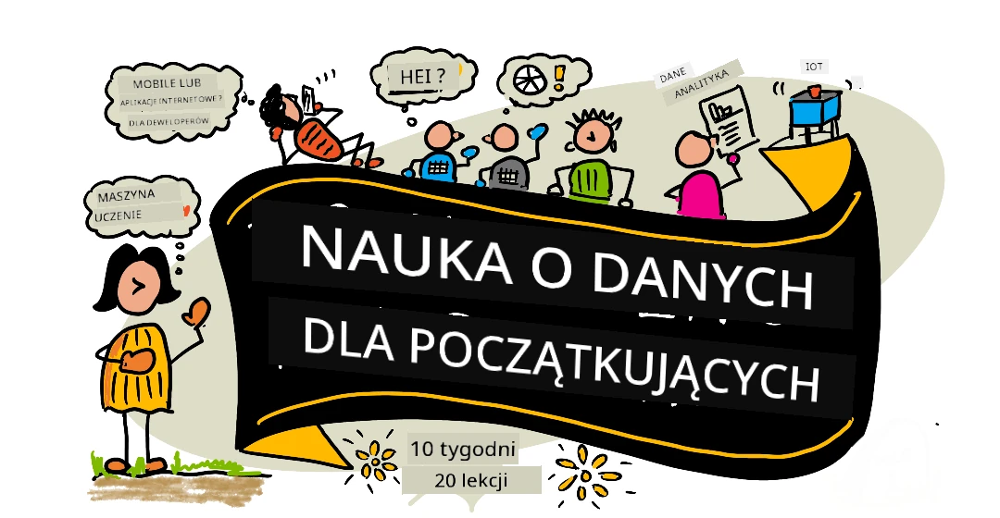
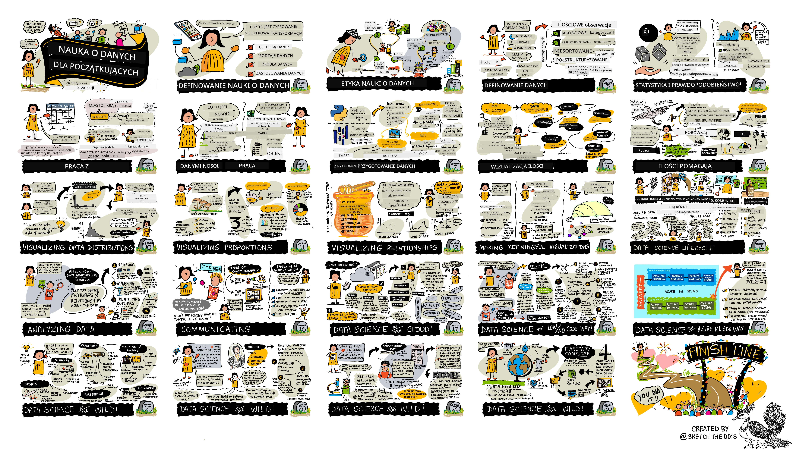

# Data Science dla początkujących - program nauczania

[](https://github.com/codespaces/new?hide_repo_select=true&ref=main&repo=344191198)

[](https://github.com/microsoft/Data-Science-For-Beginners/blob/master/LICENSE)
[](https://GitHub.com/microsoft/Data-Science-For-Beginners/graphs/contributors/)
[](https://GitHub.com/microsoft/Data-Science-For-Beginners/issues/)
[](https://GitHub.com/microsoft/Data-Science-For-Beginners/pulls/)
[](http://makeapullrequest.com)

[](https://GitHub.com/microsoft/Data-Science-For-Beginners/watchers/)
[](https://GitHub.com/microsoft/Data-Science-For-Beginners/network/)
[](https://GitHub.com/microsoft/Data-Science-For-Beginners/stargazers/)


[](https://discord.gg/nTYy5BXMWG)

[](https://aka.ms/foundry/forum)

Zespół Azure Cloud Advocates w Microsoft ma przyjemność zaoferować 10-tygodniowy, 20-lekcyjny program nauczania w całości poświęcony Data Science. Każda lekcja zawiera quizy przed i po lekcji, pisemne instrukcje do wykonania lekcji, rozwiązanie oraz zadanie. Nasza metodyka oparta na projektach pozwala uczyć się poprzez tworzenie, co jest sprawdzonym sposobem na trwałe przyswojenie nowych umiejętności.

**Serdeczne podziękowania dla naszych autorów:** [Jasmine Greenaway](https://www.twitter.com/paladique), [Dmitry Soshnikov](http://soshnikov.com), [Nitya Narasimhan](https://twitter.com/nitya), [Jalen McGee](https://twitter.com/JalenMcG), [Jen Looper](https://twitter.com/jenlooper), [Maud Levy](https://twitter.com/maudstweets), [Tiffany Souterre](https://twitter.com/TiffanySouterre), [Christopher Harrison](https://www.twitter.com/geektrainer).

**🙏 Szczególne podziękowania 🙏 dla naszych autorów, recenzentów i współtwórców treści z [Microsoft Student Ambassador](https://studentambassadors.microsoft.com/),** w szczególności Aaryana Arora, [Adityę Garg](https://github.com/AdityaGarg00), [Alondrę Sanchez](https://www.linkedin.com/in/alondra-sanchez-molina/), [Ankitę Singh](https://www.linkedin.com/in/ankitasingh007), [Anupama Mishrę](https://www.linkedin.com/in/anupam--mishra/), [Arpitę Das](https://www.linkedin.com/in/arpitadas01/), ChhailBihari Dubeya, [Dibri Nsofor](https://www.linkedin.com/in/dibrinsofor), [Dishitę Bhasin](https://www.linkedin.com/in/dishita-bhasin-7065281bb), [Majda Safi](https://www.linkedin.com/in/majd-s/), [Maxa Bluma](https://www.linkedin.com/in/max-blum-6036a1186/), [Miguela Correę](https://www.linkedin.com/in/miguelmque/), [Mohammę Iftekher (Iftu) Ebne Jalal](https://twitter.com/iftu119), [Nawrin Tabassum](https://www.linkedin.com/in/nawrin-tabassum), [Raymonda Wangsa Putrę](https://www.linkedin.com/in/raymond-wp/), [Rohita Yadava](https://www.linkedin.com/in/rty2423), Samridhiego Sharma, [Sanya Sinhę](https://www.linkedin.com/mwlite/in/sanya-sinha-13aab1200),
[Sheenę Narula](https://www.linkedin.com/in/sheena-narua-n/), [Tauqeera Ahmada](https://www.linkedin.com/in/tauqeerahmad5201/), Yogendrasingha Pawara , [Vidushi Guptę](https://www.linkedin.com/in/vidushi-gupta07/), [Jasleen Sondhi](https://www.linkedin.com/in/jasleen-sondhi/)

||
|:---:|
| Data Science dla początkujących - _Sketchnotka autorstwa [@nitya](https://twitter.com/nitya)_ |

### 🌐 Wsparcie wielojęzyczne

#### Obsługiwane przez GitHub Action (automatyczne i zawsze aktualne)

<!-- CO-OP TRANSLATOR LANGUAGES TABLE START -->
[Arabski](../ar/README.md) | [Bengalski](../bn/README.md) | [Bułgarski](../bg/README.md) | [Birmański (Myanmar)](../my/README.md) | [Chiński (uproszczony)](../zh-CN/README.md) | [Chiński (tradycyjny, Hongkong)](../zh-HK/README.md) | [Chiński (tradycyjny, Makau)](../zh-MO/README.md) | [Chiński (tradycyjny, Tajwan)](../zh-TW/README.md) | [Chorwacki](../hr/README.md) | [Czeski](../cs/README.md) | [Duński](../da/README.md) | [Niderlandzki](../nl/README.md) | [Estoński](../et/README.md) | [Fiński](../fi/README.md) | [Francuski](../fr/README.md) | [Niemiecki](../de/README.md) | [Grecki](../el/README.md) | [Hebrajski](../he/README.md) | [Hinduski](../hi/README.md) | [Węgierski](../hu/README.md) | [Indonezyjski](../id/README.md) | [Włoski](../it/README.md) | [Japoński](../ja/README.md) | [Kannada](../kn/README.md) | [Khmer](../km/README.md) | [Koreański](../ko/README.md) | [Litewski](../lt/README.md) | [Malajski](../ms/README.md) | [Malajalam](../ml/README.md) | [Marathi](../mr/README.md) | [Nepalski](../ne/README.md) | [Nigeryjski pidżin](../pcm/README.md) | [Norweski](../no/README.md) | [Perski (Farsi)](../fa/README.md) | [Polski](./README.md) | [Portugalski (Brazylia)](../pt-BR/README.md) | [Portugalski (Portugalia)](../pt-PT/README.md) | [Pendżabski (Gurmukhi)](../pa/README.md) | [Rumuński](../ro/README.md) | [Rosyjski](../ru/README.md) | [Serbski (cyrylica)](../sr/README.md) | [Słowacki](../sk/README.md) | [Słoweński](../sl/README.md) | [Hiszpański](../es/README.md) | [Suahili](../sw/README.md) | [Szwedzki](../sv/README.md) | [Tagalog (Filipino)](../tl/README.md) | [Tamilski](../ta/README.md) | [Telugu](../te/README.md) | [Tajski](../th/README.md) | [Turecki](../tr/README.md) | [Ukraiński](../uk/README.md) | [Urdu](../ur/README.md) | [Wietnamski](../vi/README.md)

> **Wolisz sklonować lokalnie?**
>
> To repozytorium zawiera ponad 50 tłumaczeń językowych, co znacznie zwiększa rozmiar pobrania. Aby sklonować bez tłumaczeń, użyj sparse checkout:
>
> **Bash / macOS / Linux:**
> ```bash
> git clone --filter=blob:none --sparse https://github.com/microsoft/Data-Science-For-Beginners.git
> cd Data-Science-For-Beginners
> git sparse-checkout set --no-cone '/*' '!translations' '!translated_images'
> ```
>
> **CMD (Windows):**
> ```cmd
> git clone --filter=blob:none --sparse https://github.com/microsoft/Data-Science-For-Beginners.git
> cd Data-Science-For-Beginners
> git sparse-checkout set --no-cone "/*" "!translations" "!translated_images"
> ```
>
> Dzięki temu pobierzesz wszystko, czego potrzebujesz do ukończenia kursu znacznie szybciej.
<!-- CO-OP TRANSLATOR LANGUAGES TABLE END -->

**Jeśli chcesz mieć obsługę dodatkowych języków tłumaczeń, są one wymienione [tutaj](https://github.com/Azure/co-op-translator/blob/main/getting_started/supported-languages.md)**

#### Dołącz do naszej społeczności 
[](https://discord.gg/nTYy5BXMWG)

Organizujemy serię na Discordzie „ucz się z AI”, dowiedz się więcej i dołącz do nas na [Learn with AI Series](https://aka.ms/learnwithai/discord) w dniach 18 - 30 września 2025. Otrzymasz wskazówki i triki dotyczące korzystania z GitHub Copilot do Data Science.


# Jesteś studentem?

Rozpocznij z następującymi zasobami:

- [Strona Student Hub](https://docs.microsoft.com/en-gb/learn/student-hub?WT.mc_id=academic-77958-bethanycheum) Na tej stronie znajdziesz materiały dla początkujących, pakiety dla studentów, a nawet sposoby na zdobycie darmowego vouchera na certyfikat. To strona, którą warto dodać do zakładek i od czasu do czasu sprawdzać, ponieważ regularnie aktualizujemy zawartość co najmniej raz w miesiącu.
- [Microsoft Learn Student Ambassadors](https://studentambassadors.microsoft.com?WT.mc_id=academic-77958-bethanycheum) Dołącz do globalnej społeczności ambasadorów studentów – to może być Twoja droga do Microsoftu.

# Zaczynamy

## 📚 Dokumentacja

- **[Przewodnik instalacji](INSTALLATION.md)** - Instrukcje krok po kroku dla początkujących
- **[Przewodnik użytkowania](USAGE.md)** - Przykłady i typowe workflow
- **[Rozwiązywanie problemów](TROUBLESHOOTING.md)** - Rozwiązania najczęstszych problemów
- **[Przewodnik kontrybucji](CONTRIBUTING.md)** - Jak wnieść wkład do tego projektu
- **[Dla nauczycieli](for-teachers.md)** - Porady dydaktyczne i zasoby do klasy

## 👨‍🎓 Dla studentów
> **Całkowici początkujący**: Nowy w Data Science? Zacznij od naszych [przyjaznych przykładów dla początkujących](examples/README.md)! Te proste, dobrze skomentowane przykłady pomogą Ci zrozumieć podstawy zanim zagłębisz się w cały program nauczania.
> **[Studenci](https://aka.ms/student-page)**: aby korzystać z tego programu na własną rękę, sforkuj całe repozytorium i wykonaj ćwiczenia samodzielnie, zaczynając od quizu przed wykładem. Następnie przeczytaj wykład i zrób resztę aktywności. Staraj się tworzyć projekty, rozumiejąc lekcje, a nie tylko kopiując kod rozwiązania; jednakże ten kod jest dostępny w folderach /solutions w każdej lekcji zorientowanej na projekt. Innym pomysłem jest utworzenie grupy naukowej z przyjaciółmi i wspólne przerabianie materiału. Na dalszą naukę polecamy [Microsoft Learn](https://docs.microsoft.com/en-us/users/jenlooper-2911/collections/qprpajyoy3x0g7?WT.mc_id=academic-77958-bethanycheum).

**Szybki start:**
1. Sprawdź [Przewodnik instalacji](INSTALLATION.md), aby skonfigurować środowisko
2. Zapoznaj się z [Przewodnikiem użytkowania](USAGE.md), by nauczyć się pracy z kursem
3. Zacznij od Lekcji 1 i kontynuuj kolejno
4. Dołącz do naszej [społeczności na Discordzie](https://aka.ms/ds4beginners/discord) po wsparcie

## 👩‍🏫 Dla nauczycieli
> **Nauczyciele**: zamieściliśmy [kilka sugestii](for-teachers.md) dotyczących korzystania z tego programu nauczania. Chętnie poznamy Wasze opinie [na naszym forum dyskusyjnym](https://github.com/microsoft/Data-Science-For-Beginners/discussions)!

## Poznaj Zespół

[](https://youtu.be/8mzavjQSMM4 "Wideo promocyjne")

**Gif autorstwa** [Mohit Jaisal](https://www.linkedin.com/in/mohitjaisal)

> 🎥 Kliknij powyższy obraz, aby obejrzeć wideo o projekcie i ludziach, którzy go stworzyli!

## Pedagogika

Podczas tworzenia tego programu nauczania wybraliśmy dwa założenia pedagogiczne: aby był oparty na projektach oraz by zawierał częste quizy. Po ukończeniu tego cyklu uczniowie poznają podstawowe zasady data science, w tym zagadnienia etyczne, przygotowanie danych, różne sposoby pracy z danymi, wizualizację danych, analizę danych, zastosowania data science w rzeczywistych przypadkach i więcej.

Dodatkowo quiz o niskiej stawce przed zajęciami nastawia ucznia na naukę tematu, natomiast drugi quiz po zajęciach zapewnia lepsze utrwalenie wiedzy. Ten program został zaprojektowany tak, aby był elastyczny i przyjemny, i można go realizować w całości lub częściowo. Projekty zaczynają się od prostych, a kończą się coraz bardziej złożonymi pod koniec 10-tygodniowego cyklu.

> Znajdź nasze [Zasady postępowania](CODE_OF_CONDUCT.md), [Wkład](CONTRIBUTING.md), [Tłumaczenia](TRANSLATIONS.md). Czekamy na Wasze konstruktywne opinie!

## Każda lekcja zawiera:

- Opcjonalny szkic notatek
- Opcjonalny uzupełniający film
- Quiz rozgrzewkowy przed lekcją
- Pisemną lekcję
- Dla lekcji opartych na projekcie, przewodniki krok po kroku, jak zbudować projekt
- Sprawdziany wiedzy
- Wyzwanie
- Lektury uzupełniające
- Zadanie domowe
- [Quiz po lekcji](https://ff-quizzes.netlify.app/en/)

> **Uwagi o quizach**: Wszystkie quizy znajdują się w folderze Quiz-App, łącznie 40 quizów po trzy pytania każdy. Są połączone w lekcjach, ale aplikację quizową można uruchomić lokalnie lub wdrożyć na Azure; postępuj zgodnie z instrukcjami w folderze `quiz-app`. Są stopniowo lokalizowane.

## 🎓 Przykłady dla początkujących

**Nowy w Data Science?** Stworzyliśmy specjalny [katalog przykładów](examples/README.md) z prostym, dobrze skomentowanym kodem, który pomoże Ci zacząć:

- 🌟 **Hello World** – Twój pierwszy program do data science
- 📂 **Wczytywanie danych** – Naucz się czytać i eksplorować zestawy danych
- 📊 **Prosta analiza** – Obliczaj statystyki i znajdź wzory
- 📈 **Podstawowa wizualizacja** – Twórz wykresy i diagramy
- 🔬 **Projekt z rzeczywistego świata** – Kompletny przebieg pracy od początku do końca

Każdy przykład zawiera szczegółowe komentarze wyjaśniające każdy krok, co czyni go idealnym dla absolutnych początkujących!

👉 **[Zacznij od przykładów](examples/README.md)** 👈

## Lekcje


||
|:---:|
| Data Science dla początkujących: mapa drogowa – _Notatka wizualna autorstwa [@nitya](https://twitter.com/nitya)_ |


| Numer lekcji | Temat | Grupa lekcji | Cele nauczania | Powiązana lekcja | Autor |
| :-----------: | :----------------------------------------: | :--------------------------------------------------: | :-----------------------------------------------------------------------------------------------------------------------------------------------------------------------: | :---------------------------------------------------------------------: | :----: |
| 01 | Definiowanie Data Science | [Wprowadzenie](1-Introduction/README.md) | Poznaj podstawowe koncepcje data science oraz jak jest ono powiązane ze sztuczną inteligencją, uczeniem maszynowym i big data. | [lekcja](1-Introduction/01-defining-data-science/README.md) [wideo](https://youtu.be/beZ7Mb_oz9I) | [Dmitry](http://soshnikov.com) |
| 02 | Etyka Data Science | [Wprowadzenie](1-Introduction/README.md) | Pojęcia, wyzwania i ramy etyki danych. | [lekcja](1-Introduction/02-ethics/README.md) | [Nitya](https://twitter.com/nitya) |
| 03 | Definiowanie danych | [Wprowadzenie](1-Introduction/README.md) | Jak klasyfikuje się dane i jakie są ich typowe źródła. | [lekcja](1-Introduction/03-defining-data/README.md) | [Jasmine](https://www.twitter.com/paladique) |
| 04 | Wprowadzenie do statystyki i rachunku prawdopodobieństwa | [Wprowadzenie](1-Introduction/README.md) | Techniki matematyczne z dziedziny prawdopodobieństwa i statystyki do rozumienia danych. | [lekcja](1-Introduction/04-stats-and-probability/README.md) [wideo](https://youtu.be/Z5Zy85g4Yjw) | [Dmitry](http://soshnikov.com) |
| 05 | Praca z danymi relacyjnymi | [Praca z danymi](2-Working-With-Data/README.md) | Wprowadzenie do danych relacyjnych oraz podstawy eksploracji i analizy danych relacyjnych za pomocą języka zapytań strukturalnych SQL (wym. „see-quell”). | [lekcja](2-Working-With-Data/05-relational-databases/README.md) | [Christopher](https://www.twitter.com/geektrainer) | | |
| 06 | Praca z danymi NoSQL | [Praca z danymi](2-Working-With-Data/README.md) | Wprowadzenie do danych nierelacyjnych, ich różnych typów oraz podstawy eksploracji i analizy baz dokumentów. | [lekcja](2-Working-With-Data/06-non-relational/README.md) | [Jasmine](https://twitter.com/paladique)|
| 07 | Praca z Pythonem | [Praca z danymi](2-Working-With-Data/README.md) | Podstawy używania Pythona do eksploracji danych z bibliotekami takimi jak Pandas. Zalecane podstawowe zrozumienie programowania w Pythonie. | [lekcja](2-Working-With-Data/07-python/README.md) [wideo](https://youtu.be/dZjWOGbsN4Y) | [Dmitry](http://soshnikov.com) |
| 08 | Przygotowanie danych | [Praca z danymi](2-Working-With-Data/README.md) | Tematy dotyczące technik czyszczenia i transformacji danych, aby radzić sobie z wyzwaniami brakujących, nieprecyzyjnych lub niepełnych danych. | [lekcja](2-Working-With-Data/08-data-preparation/README.md) | [Jasmine](https://www.twitter.com/paladique) |
| 09 | Wizualizacja ilościowa | [Wizualizacja danych](3-Data-Visualization/README.md) | Naucz się używać Matplotlib do wizualizacji danych ptaków 🦆 | [lekcja](3-Data-Visualization/09-visualization-quantities/README.md) | [Jen](https://twitter.com/jenlooper) |
| 10 | Wizualizacja rozkładów danych | [Wizualizacja danych](3-Data-Visualization/README.md) | Wizualizacja obserwacji i trendów w przedziale. | [lekcja](3-Data-Visualization/10-visualization-distributions/README.md) | [Jen](https://twitter.com/jenlooper) |
| 11 | Wizualizacja proporcji | [Wizualizacja danych](3-Data-Visualization/README.md) | Wizualizacja dyskretnych i grupowanych procentów. | [lekcja](3-Data-Visualization/11-visualization-proportions/README.md) | [Jen](https://twitter.com/jenlooper) |
| 12 | Wizualizacja zależności | [Wizualizacja danych](3-Data-Visualization/README.md) | Wizualizacja połączeń i korelacji między zbiorami danych i ich zmiennymi. | [lekcja](3-Data-Visualization/12-visualization-relationships/README.md) | [Jen](https://twitter.com/jenlooper) |
| 13 | Sensowne wizualizacje | [Wizualizacja danych](3-Data-Visualization/README.md) | Techniki i wskazówki, jak uczynić wizualizacje wartościowymi dla skutecznego rozwiązywania problemów i uzyskiwania wglądów. | [lekcja](3-Data-Visualization/13-meaningful-visualizations/README.md) | [Jen](https://twitter.com/jenlooper) |
| 14 | Wprowadzenie do cyklu życia data science | [Cykl życia](4-Data-Science-Lifecycle/README.md) | Wprowadzenie do cyklu życia data science i jego pierwszego etapu – pozyskiwania i wydobywania danych. | [lekcja](4-Data-Science-Lifecycle/14-Introduction/README.md) | [Jasmine](https://twitter.com/paladique) |
| 15 | Analiza | [Cykl życia](4-Data-Science-Lifecycle/README.md) | Ta faza cyklu życia data science koncentruje się na technikach analizy danych. | [lekcja](4-Data-Science-Lifecycle/15-analyzing/README.md) | [Jasmine](https://twitter.com/paladique) | | |
| 16 | Komunikacja | [Cykl życia](4-Data-Science-Lifecycle/README.md) | Ta faza cyklu życia data science skupia się na przedstawianiu wniosków płynących z danych w sposób ułatwiający ich zrozumienie decydentom. | [lekcja](4-Data-Science-Lifecycle/16-communication/README.md) | [Jalen](https://twitter.com/JalenMcG) | | |
| 17 | Data Science w chmurze | [Dane w chmurze](5-Data-Science-In-Cloud/README.md) | Ten cykl lekcji wprowadza data science w chmurze i jej korzyści. | [lekcja](5-Data-Science-In-Cloud/17-Introduction/README.md) | [Tiffany](https://twitter.com/TiffanySouterre) i [Maud](https://twitter.com/maudstweets) |
| 18 | Data Science w chmurze | [Dane w chmurze](5-Data-Science-In-Cloud/README.md) | Trenowanie modeli przy użyciu narzędzi Low Code. |[lekcja](5-Data-Science-In-Cloud/18-Low-Code/README.md) | [Tiffany](https://twitter.com/TiffanySouterre) i [Maud](https://twitter.com/maudstweets) |
| 19 | Data Science w chmurze | [Dane w chmurze](5-Data-Science-In-Cloud/README.md) | Wdrażanie modeli z Azure Machine Learning Studio. | [lekcja](5-Data-Science-In-Cloud/19-Azure/README.md)| [Tiffany](https://twitter.com/TiffanySouterre) i [Maud](https://twitter.com/maudstweets) |
| 20 | Data Science w praktyce | [W praktyce](6-Data-Science-In-Wild/README.md) | Projekty napędzane data science w rzeczywistym świecie. | [lekcja](6-Data-Science-In-Wild/20-Real-World-Examples/README.md) | [Nitya](https://twitter.com/nitya) |

## GitHub Codespaces

Wykonaj następujące kroki, aby otworzyć tę próbkę w Codespace:
1. Kliknij menu rozwijane Kod i wybierz opcję Otwórz w Codespaces.
2. W dolnej części panelu wybierz + Nowy codespace.
Więcej informacji znajdziesz w [dokumentacji GitHub](https://docs.github.com/en/codespaces/developing-in-codespaces/creating-a-codespace-for-a-repository#creating-a-codespace).

## VSCode Remote - Kontenery
Wykonaj następujące kroki, aby otworzyć to repozytorium w kontenerze na swoim lokalnym komputerze za pomocą VSCode i rozszerzenia VS Code Remote - Containers:

1. Jeśli używasz kontenera deweloperskiego po raz pierwszy, upewnij się, że Twój system spełnia wymagania wstępne (np. zainstalowany Docker) zgodnie z [dokumentacją dotyczącą rozpoczęcia](https://code.visualstudio.com/docs/devcontainers/containers#_getting-started).

Aby użyć tego repozytorium, możesz albo otworzyć repozytorium w izolowanym wolumenie Dockera:

**Uwaga**: Pod maską użyje to polecenia Remote-Containers: **Klonuj repozytorium w wolumenie kontenera...** aby sklonować kod źródłowy w wolumenie Dockera zamiast na lokalnym systemie plików. [Wolumeny](https://docs.docker.com/storage/volumes/) są preferowanym mechanizmem do przechowywania danych kontenera.

Lub otworzyć lokalnie sklonowaną lub pobraną wersję repozytorium:

- Sklonuj to repozytorium na swój lokalny system plików.
- Naciśnij F1 i wybierz polecenie **Remote-Containers: Otwórz folder w kontenerze...**.
- Wybierz sklonowaną kopię tego folderu, poczekaj na uruchomienie kontenera i przetestuj.

## Dostęp offline

Możesz uruchomić tę dokumentację offline, korzystając z [Docsify](https://docsify.js.org/#/). Wykonaj fork tego repozytorium, [zainstaluj Docsify](https://docsify.js.org/#/quickstart) na swoim lokalnym komputerze, a następnie w katalogu głównym tego repo wpisz `docsify serve`. Strona będzie dostępna pod adresem http://localhost:3000.

> Uwaga, notatniki (notebooks) nie będą renderowane za pomocą Docsify, więc gdy potrzebujesz uruchomić notatnik, zrób to osobno w VS Code z uruchomionym jądrem Pythona.

## Inne programy nauczania

Nasz zespół tworzy inne programy nauczania! Sprawdź:

<!-- CO-OP TRANSLATOR OTHER COURSES START -->
### LangChain
[](https://aka.ms/langchain4j-for-beginners)
[](https://aka.ms/langchainjs-for-beginners?WT.mc_id=m365-94501-dwahlin)
[](https://github.com/microsoft/langchain-for-beginners?WT.mc_id=m365-94501-dwahlin)
---

### Azure / Edge / MCP / Agenci
[](https://github.com/microsoft/AZD-for-beginners?WT.mc_id=academic-105485-koreyst)
[](https://github.com/microsoft/edgeai-for-beginners?WT.mc_id=academic-105485-koreyst)
[](https://github.com/microsoft/mcp-for-beginners?WT.mc_id=academic-105485-koreyst)
[](https://github.com/microsoft/ai-agents-for-beginners?WT.mc_id=academic-105485-koreyst)

---
 
### Seria Generatywnej Sztucznej Inteligencji
[](https://github.com/microsoft/generative-ai-for-beginners?WT.mc_id=academic-105485-koreyst)
[-9333EA?style=for-the-badge&labelColor=E5E7EB&color=9333EA)](https://github.com/microsoft/Generative-AI-for-beginners-dotnet?WT.mc_id=academic-105485-koreyst)
[-C084FC?style=for-the-badge&labelColor=E5E7EB&color=C084FC)](https://github.com/microsoft/generative-ai-for-beginners-java?WT.mc_id=academic-105485-koreyst)
[-E879F9?style=for-the-badge&labelColor=E5E7EB&color=E879F9)](https://github.com/microsoft/generative-ai-with-javascript?WT.mc_id=academic-105485-koreyst)

---
 
### Podstawowa Nauka
[](https://aka.ms/ml-beginners?WT.mc_id=academic-105485-koreyst)
[](https://aka.ms/datascience-beginners?WT.mc_id=academic-105485-koreyst)
[](https://aka.ms/ai-beginners?WT.mc_id=academic-105485-koreyst)
[](https://github.com/microsoft/Security-101?WT.mc_id=academic-96948-sayoung)
[](https://aka.ms/webdev-beginners?WT.mc_id=academic-105485-koreyst)
[](https://aka.ms/iot-beginners?WT.mc_id=academic-105485-koreyst)
[](https://github.com/microsoft/xr-development-for-beginners?WT.mc_id=academic-105485-koreyst)

---
 
### Seria Copilot
[](https://aka.ms/GitHubCopilotAI?WT.mc_id=academic-105485-koreyst)
[](https://github.com/microsoft/mastering-github-copilot-for-dotnet-csharp-developers?WT.mc_id=academic-105485-koreyst)
[](https://github.com/microsoft/CopilotAdventures?WT.mc_id=academic-105485-koreyst)
<!-- CO-OP TRANSLATOR OTHER COURSES END -->

## Uzyskiwanie pomocy

**Masz problemy?** Sprawdź nasz [Przewodnik rozwiązywania problemów](TROUBLESHOOTING.md) z rozwiązaniami najczęstszych problemów.

Jeśli utkniesz lub masz pytania dotyczące tworzenia aplikacji AI, dołącz do innych uczących się i doświadczonych deweloperów w dyskusjach o MCP. To wspierająca społeczność, w której pytania są mile widziane, a wiedza dzielona jest swobodnie.

[](https://discord.gg/nTYy5BXMWG)

Jeśli masz opinie o produkcie lub napotkasz błędy podczas tworzenia, odwiedź:

[](https://aka.ms/foundry/forum)

---

<!-- CO-OP TRANSLATOR DISCLAIMER START -->
**Zastrzeżenie**:  
Dokument ten został przetłumaczony za pomocą usługi tłumaczenia AI [Co-op Translator](https://github.com/Azure/co-op-translator). Choć dążymy do dokładności, prosimy mieć na uwadze, że automatyczne tłumaczenia mogą zawierać błędy lub nieścisłości. Oryginalny dokument w jego języku źródłowym powinien być uznawany za autorytatywne źródło. W przypadku informacji o krytycznym znaczeniu zalecane jest skorzystanie z profesjonalnego tłumaczenia wykonanego przez człowieka. Nie ponosimy odpowiedzialności za jakiekolwiek nieporozumienia lub błędne interpretacje wynikające z korzystania z tego tłumaczenia.
<!-- CO-OP TRANSLATOR DISCLAIMER END -->