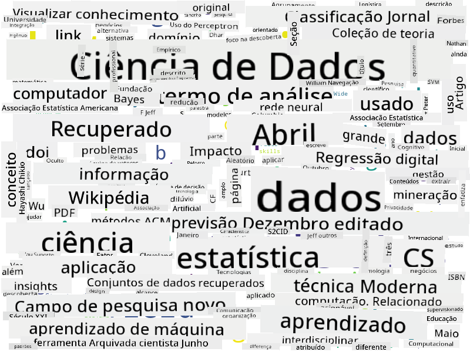

<!--
CO_OP_TRANSLATOR_METADATA:
{
  "original_hash": "2583a9894af7123b2fcae3376b14c035",
  "translation_date": "2025-08-24T21:26:14+00:00",
  "source_file": "1-Introduction/01-defining-data-science/README.md",
  "language_code": "pt"
}
-->
## Tipos de Dados

Como já mencionámos, os dados estão em todo o lado. Só precisamos de os capturar da forma certa! É útil distinguir entre dados **estruturados** e **não estruturados**. Os primeiros são normalmente representados de forma bem organizada, muitas vezes como uma tabela ou várias tabelas, enquanto os últimos são apenas uma coleção de ficheiros. Por vezes, também podemos falar de dados **semi-estruturados**, que têm algum tipo de estrutura que pode variar bastante.

| Estruturados                                                                | Semi-estruturados                                                                             | Não estruturados                        |
| ---------------------------------------------------------------------------- | --------------------------------------------------------------------------------------------- | --------------------------------------- |
| Lista de pessoas com os seus números de telefone                            | Páginas da Wikipédia com links                                                               | Texto da Enciclopédia Britânica         |
| Temperatura em todas as salas de um edifício a cada minuto nos últimos 20 anos | Coleção de artigos científicos em formato JSON com autores, data de publicação e resumo      | Partilha de ficheiros com documentos corporativos |
| Dados sobre idade e género de todas as pessoas que entram no edifício       | Páginas da Internet                                                                          | Vídeo bruto de uma câmara de vigilância |

## Onde Obter Dados

Existem muitas fontes possíveis de dados, e seria impossível listar todas! No entanto, vamos mencionar alguns dos locais típicos onde se podem obter dados:

* **Estruturados**
  - **Internet das Coisas** (IoT), incluindo dados de diferentes sensores, como sensores de temperatura ou pressão, fornece muitos dados úteis. Por exemplo, se um edifício de escritórios estiver equipado com sensores IoT, podemos controlar automaticamente o aquecimento e a iluminação para minimizar custos.
  - **Inquéritos** que pedimos aos utilizadores para preencherem após uma compra ou após visitarem um site.
  - **Análise de comportamento** pode, por exemplo, ajudar-nos a entender até que ponto um utilizador explora um site e qual é o motivo típico para abandonar o site.
* **Não estruturados**
  - **Textos** podem ser uma fonte rica de insights, como um **índice de sentimento geral**, ou a extração de palavras-chave e significado semântico.
  - **Imagens** ou **Vídeos**. Um vídeo de uma câmara de vigilância pode ser usado para estimar o tráfego na estrada e informar as pessoas sobre potenciais engarrafamentos.
  - **Registos** de servidores web podem ser usados para entender quais as páginas do nosso site que são mais visitadas e por quanto tempo.
* **Semi-estruturados**
  - **Grafos de Redes Sociais** podem ser ótimas fontes de dados sobre personalidades dos utilizadores e a sua potencial eficácia na disseminação de informações.
  - Quando temos um conjunto de fotografias de uma festa, podemos tentar extrair dados sobre **Dinâmica de Grupo** construindo um grafo de pessoas que tiraram fotos juntas.

Ao conhecer diferentes fontes possíveis de dados, pode pensar em diferentes cenários onde as técnicas de ciência de dados podem ser aplicadas para compreender melhor a situação e melhorar os processos empresariais.

## O que Pode Fazer com os Dados

Na Ciência de Dados, focamo-nos nos seguintes passos da jornada dos dados:

Claro, dependendo dos dados reais, alguns passos podem estar ausentes (por exemplo, quando já temos os dados na base de dados ou quando não precisamos de treinar um modelo), ou alguns passos podem ser repetidos várias vezes (como o processamento de dados).

## Digitalização e Transformação Digital

Na última década, muitas empresas começaram a perceber a importância dos dados na tomada de decisões empresariais. Para aplicar os princípios da ciência de dados à gestão de um negócio, é necessário primeiro recolher alguns dados, ou seja, traduzir os processos empresariais para uma forma digital. Isto é conhecido como **digitalização**. Aplicar técnicas de ciência de dados a esses dados para orientar decisões pode levar a aumentos significativos de produtividade (ou até mesmo a uma mudança de rumo no negócio), o que se chama **transformação digital**.

Vamos considerar um exemplo. Suponha que temos um curso de ciência de dados (como este) que oferecemos online aos estudantes, e queremos usar a ciência de dados para o melhorar. Como podemos fazê-lo?

Podemos começar por perguntar "O que pode ser digitalizado?" A forma mais simples seria medir o tempo que cada estudante demora a completar cada módulo e avaliar o conhecimento adquirido através de um teste de escolha múltipla no final de cada módulo. Ao calcular a média do tempo de conclusão entre todos os estudantes, podemos identificar quais os módulos que causam mais dificuldades e trabalhar na sua simplificação.
> Pode-se argumentar que esta abordagem não é ideal, porque os módulos podem ter comprimentos diferentes. Provavelmente seria mais justo dividir o tempo pelo comprimento do módulo (em número de caracteres) e comparar esses valores em vez disso.
Quando começamos a analisar os resultados de testes de escolha múltipla, podemos tentar determinar quais conceitos os alunos têm dificuldade em compreender e usar essa informação para melhorar o conteúdo. Para isso, precisamos projetar os testes de forma que cada pergunta esteja associada a um determinado conceito ou bloco de conhecimento.

Se quisermos ir ainda mais longe, podemos traçar o tempo gasto em cada módulo em relação à faixa etária dos alunos. Podemos descobrir que, para algumas faixas etárias, leva um tempo excessivamente longo para concluir o módulo, ou que os alunos desistem antes de terminá-lo. Isso pode ajudar-nos a fornecer recomendações de idade para o módulo e minimizar a insatisfação das pessoas devido a expectativas erradas.

## 🚀 Desafio

Neste desafio, tentaremos encontrar conceitos relevantes para o campo da Ciência de Dados analisando textos. Vamos pegar um artigo da Wikipédia sobre Ciência de Dados, descarregar e processar o texto, e depois construir uma nuvem de palavras como esta:

Visite [`notebook.ipynb`](../../../../../../../../../1-Introduction/01-defining-data-science/notebook.ipynb ':ignore') para ler o código. Também pode executar o código e ver como ele realiza todas as transformações de dados em tempo real.

> Se não sabe como executar código num Jupyter Notebook, veja [este artigo](https://soshnikov.com/education/how-to-execute-notebooks-from-github/).

## [Questionário pós-aula](https://purple-hill-04aebfb03.1.azurestaticapps.net/quiz/1)

## Tarefas

* **Tarefa 1**: Modifique o código acima para descobrir conceitos relacionados aos campos de **Big Data** e **Machine Learning**  
* **Tarefa 2**: [Pense em Cenários de Ciência de Dados](assignment.md)

## Créditos

Esta lição foi criada com ♥️ por [Dmitry Soshnikov](http://soshnikov.com)

**Aviso Legal**:  
Este documento foi traduzido utilizando o serviço de tradução por IA [Co-op Translator](https://github.com/Azure/co-op-translator). Embora nos esforcemos pela precisão, esteja ciente de que traduções automáticas podem conter erros ou imprecisões. O documento original na sua língua nativa deve ser considerado a fonte autoritária. Para informações críticas, recomenda-se a tradução profissional realizada por humanos. Não nos responsabilizamos por quaisquer mal-entendidos ou interpretações incorretas decorrentes do uso desta tradução.