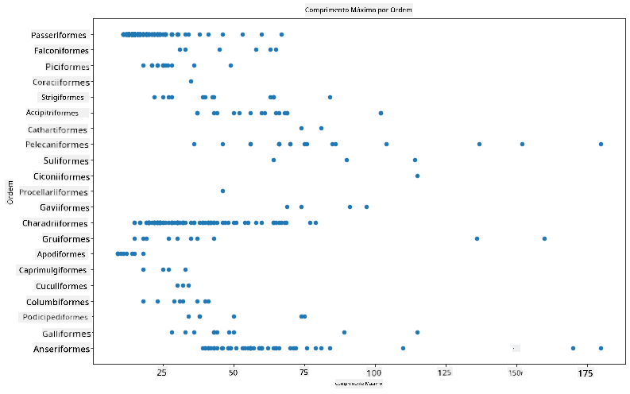
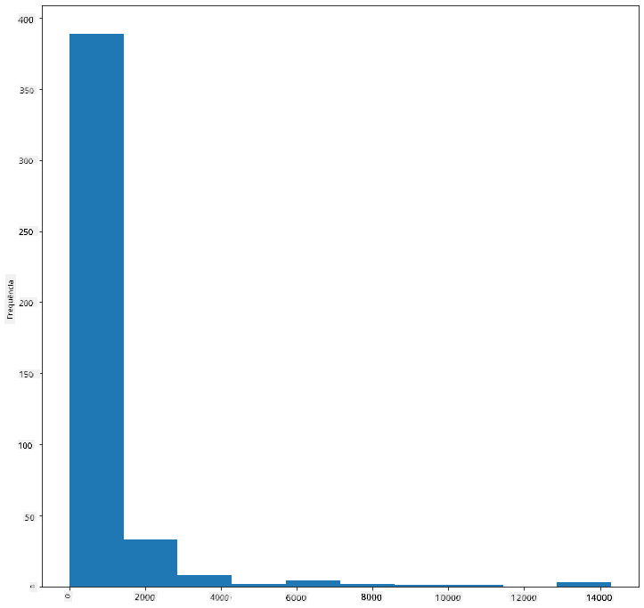
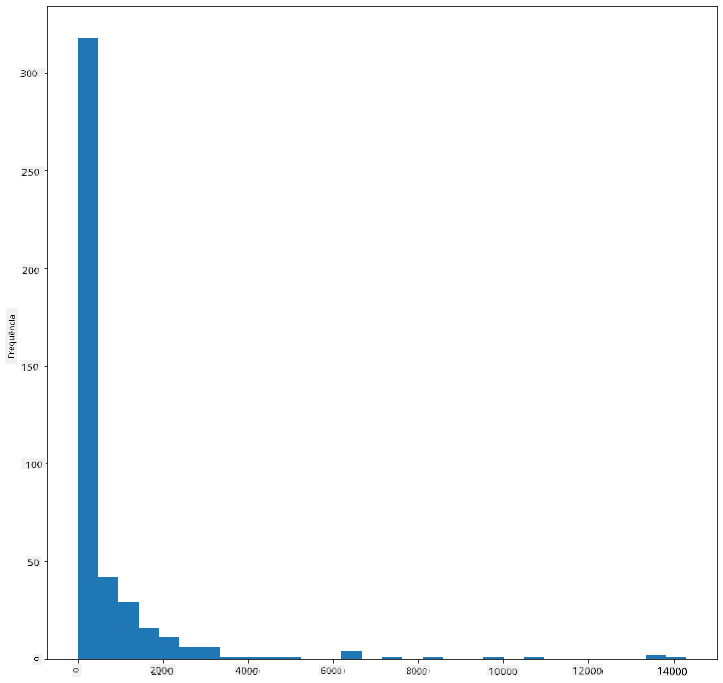
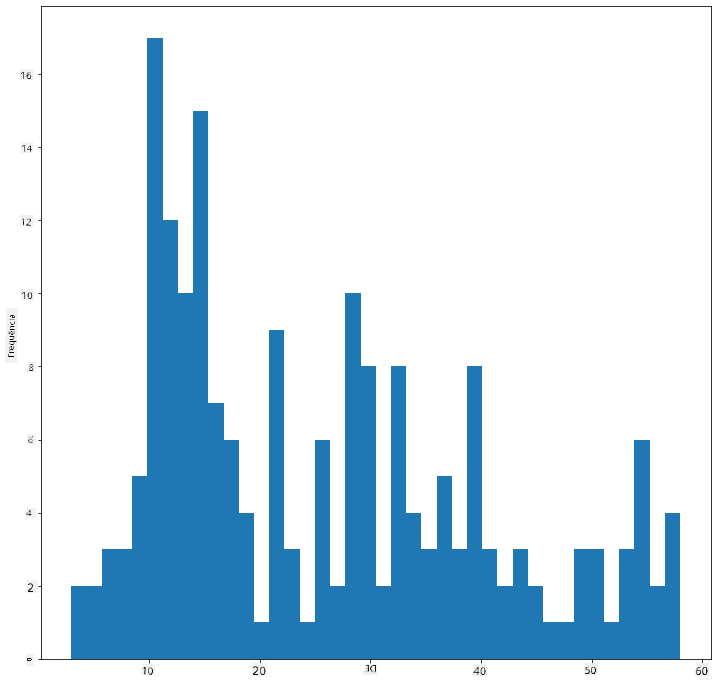
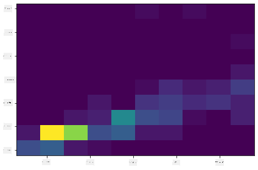
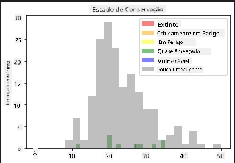
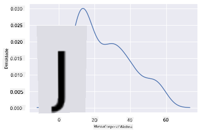
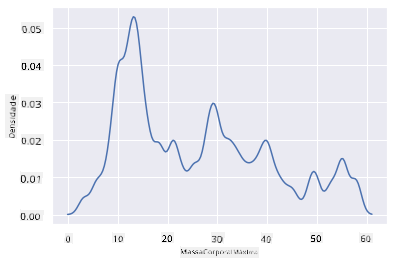
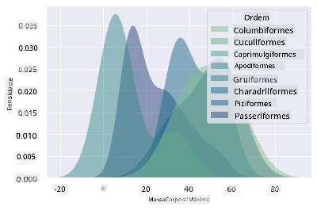

<!--
CO_OP_TRANSLATOR_METADATA:
{
  "original_hash": "02ce904bc1e2bfabb7dc05c25aae375c",
  "translation_date": "2025-09-04T13:47:15+00:00",
  "source_file": "3-Data-Visualization/10-visualization-distributions/README.md",
  "language_code": "pt"
}
-->
# Visualizar Distribuições

| ](../../sketchnotes/10-Visualizing-Distributions.png)|
|:---:|
| Visualizar Distribuições - _Sketchnote por [@nitya](https://twitter.com/nitya)_ |

Na lição anterior, aprendeste alguns factos interessantes sobre um conjunto de dados sobre as aves do Minnesota. Identificaste dados erróneos ao visualizar outliers e analisaste as diferenças entre categorias de aves com base no seu comprimento máximo.

## [Questionário pré-aula](https://purple-hill-04aebfb03.1.azurestaticapps.net/quiz/18)
## Explorar o conjunto de dados das aves

Outra forma de explorar os dados é analisando a sua distribuição, ou seja, como os dados estão organizados ao longo de um eixo. Talvez, por exemplo, queiras saber mais sobre a distribuição geral, neste conjunto de dados, da envergadura máxima ou da massa corporal máxima das aves do Minnesota.

Vamos descobrir alguns factos sobre as distribuições dos dados neste conjunto. No ficheiro _notebook.ipynb_ na raiz desta pasta da lição, importa Pandas, Matplotlib e os teus dados:

```python
import pandas as pd
import matplotlib.pyplot as plt
birds = pd.read_csv('../../data/birds.csv')
birds.head()
```

|      | Nome                        | NomeCientífico         | Categoria             | Ordem        | Família  | Género      | EstadoConservação | ComprMin | ComprMax | MassaMin | MassaMax | EnvergMin | EnvergMax |
| ---: | :-------------------------- | :--------------------- | :-------------------- | :----------- | :------- | :---------- | :---------------- | --------:| --------:| ---------:| ---------:| ----------:| ----------:|
|    0 | Pato-assobiador-de-barriga-preta | Dendrocygna autumnalis | Patos/Gansos/AvesAquáticas | Anseriformes | Anatidae | Dendrocygna | LC                 |        47 |        56 |         652 |        1020 |          76 |          94 |
|    1 | Pato-assobiador-fulvo       | Dendrocygna bicolor    | Patos/Gansos/AvesAquáticas | Anseriformes | Anatidae | Dendrocygna | LC                 |        45 |        53 |         712 |        1050 |          85 |          93 |
|    2 | Ganso-das-neves             | Anser caerulescens     | Patos/Gansos/AvesAquáticas | Anseriformes | Anatidae | Anser       | LC                 |        64 |        79 |        2050 |        4050 |         135 |         165 |
|    3 | Ganso-de-Ross               | Anser rossii           | Patos/Gansos/AvesAquáticas | Anseriformes | Anatidae | Anser       | LC                 |      57.3 |        64 |        1066 |        1567 |         113 |         116 |
|    4 | Ganso-de-testa-branca-maior | Anser albifrons        | Patos/Gansos/AvesAquáticas | Anseriformes | Anatidae | Anser       | LC                 |        64 |        81 |        1930 |        3310 |         130 |         165 |

De forma geral, podes rapidamente observar como os dados estão distribuídos utilizando um gráfico de dispersão, como fizemos na lição anterior:

```python
birds.plot(kind='scatter',x='MaxLength',y='Order',figsize=(12,8))

plt.title('Max Length per Order')
plt.ylabel('Order')
plt.xlabel('Max Length')

plt.show()
```


Isto dá uma visão geral da distribuição do comprimento corporal por Ordem das aves, mas não é a forma ideal de exibir distribuições reais. Essa tarefa é geralmente realizada criando um Histograma.

## Trabalhar com histogramas

O Matplotlib oferece formas muito boas de visualizar a distribuição de dados utilizando Histogramas. Este tipo de gráfico é semelhante a um gráfico de barras, onde a distribuição pode ser vista através do aumento e diminuição das barras. Para construir um histograma, precisas de dados numéricos. Para criar um Histograma, podes desenhar um gráfico definindo o tipo como 'hist' para Histograma. Este gráfico mostra a distribuição da MaxBodyMass para toda a gama de dados numéricos do conjunto. Dividindo o array de dados em pequenos intervalos (bins), é possível exibir a distribuição dos valores dos dados:

```python
birds['MaxBodyMass'].plot(kind = 'hist', bins = 10, figsize = (12,12))
plt.show()
```


Como podes ver, a maioria das mais de 400 aves neste conjunto de dados encontra-se na faixa abaixo de 2000 para a sua Massa Corporal Máxima. Obtém mais informações sobre os dados alterando o parâmetro `bins` para um número maior, como 30:

```python
birds['MaxBodyMass'].plot(kind = 'hist', bins = 30, figsize = (12,12))
plt.show()
```


Este gráfico mostra a distribuição de forma um pouco mais detalhada. Um gráfico menos enviesado para a esquerda poderia ser criado garantindo que apenas selecionas dados dentro de um determinado intervalo:

Filtra os teus dados para obter apenas as aves cuja massa corporal seja inferior a 60 e mostra 40 `bins`:

```python
filteredBirds = birds[(birds['MaxBodyMass'] > 1) & (birds['MaxBodyMass'] < 60)]      
filteredBirds['MaxBodyMass'].plot(kind = 'hist',bins = 40,figsize = (12,12))
plt.show()     
```


✅ Experimenta outros filtros e pontos de dados. Para ver a distribuição completa dos dados, remove o filtro `['MaxBodyMass']` para mostrar distribuições etiquetadas.

O histograma oferece também algumas melhorias de cor e etiquetagem interessantes para experimentar:

Cria um histograma 2D para comparar a relação entre duas distribuições. Vamos comparar `MaxBodyMass` vs. `MaxLength`. O Matplotlib oferece uma forma integrada de mostrar convergência utilizando cores mais brilhantes:

```python
x = filteredBirds['MaxBodyMass']
y = filteredBirds['MaxLength']

fig, ax = plt.subplots(tight_layout=True)
hist = ax.hist2d(x, y)
```
Parece haver uma correlação esperada entre estes dois elementos ao longo de um eixo esperado, com um ponto de convergência particularmente forte:



Os histogramas funcionam bem por padrão para dados numéricos. E se precisares de ver distribuições de acordo com dados textuais? 
## Explorar o conjunto de dados para distribuições usando dados textuais 

Este conjunto de dados também inclui boas informações sobre a categoria das aves, bem como o seu género, espécie, família e estado de conservação. Vamos explorar esta informação de conservação. Qual é a distribuição das aves de acordo com o seu estado de conservação?

> ✅ No conjunto de dados, são usados vários acrónimos para descrever o estado de conservação. Estes acrónimos vêm das [Categorias da Lista Vermelha da IUCN](https://www.iucnredlist.org/), uma organização que cataloga o estado das espécies.
> 
> - CR: Criticamente em Perigo
> - EN: Em Perigo
> - EX: Extinto
> - LC: Pouco Preocupante
> - NT: Quase Ameaçado
> - VU: Vulnerável

Estes são valores baseados em texto, por isso precisarás de fazer uma transformação para criar um histograma. Usando o dataframe filteredBirds, exibe o estado de conservação juntamente com a sua Envergadura Mínima. O que observas?

```python
x1 = filteredBirds.loc[filteredBirds.ConservationStatus=='EX', 'MinWingspan']
x2 = filteredBirds.loc[filteredBirds.ConservationStatus=='CR', 'MinWingspan']
x3 = filteredBirds.loc[filteredBirds.ConservationStatus=='EN', 'MinWingspan']
x4 = filteredBirds.loc[filteredBirds.ConservationStatus=='NT', 'MinWingspan']
x5 = filteredBirds.loc[filteredBirds.ConservationStatus=='VU', 'MinWingspan']
x6 = filteredBirds.loc[filteredBirds.ConservationStatus=='LC', 'MinWingspan']

kwargs = dict(alpha=0.5, bins=20)

plt.hist(x1, **kwargs, color='red', label='Extinct')
plt.hist(x2, **kwargs, color='orange', label='Critically Endangered')
plt.hist(x3, **kwargs, color='yellow', label='Endangered')
plt.hist(x4, **kwargs, color='green', label='Near Threatened')
plt.hist(x5, **kwargs, color='blue', label='Vulnerable')
plt.hist(x6, **kwargs, color='gray', label='Least Concern')

plt.gca().set(title='Conservation Status', ylabel='Min Wingspan')
plt.legend();
```



Não parece haver uma boa correlação entre a envergadura mínima e o estado de conservação. Testa outros elementos do conjunto de dados usando este método. Podes experimentar diferentes filtros também. Encontras alguma correlação?

## Gráficos de densidade

Podes ter notado que os histogramas que analisámos até agora são 'escalonados' e não fluem suavemente em forma de arco. Para mostrar um gráfico de densidade mais suave, podes experimentar um gráfico de densidade.

Para trabalhar com gráficos de densidade, familiariza-te com uma nova biblioteca de gráficos, [Seaborn](https://seaborn.pydata.org/generated/seaborn.kdeplot.html). 

Carregando o Seaborn, experimenta um gráfico de densidade básico:

```python
import seaborn as sns
import matplotlib.pyplot as plt
sns.kdeplot(filteredBirds['MinWingspan'])
plt.show()
```


Podes ver como o gráfico reflete o anterior para os dados de Envergadura Mínima; é apenas um pouco mais suave. De acordo com a documentação do Seaborn, "Em relação a um histograma, o KDE pode produzir um gráfico menos confuso e mais interpretável, especialmente ao desenhar múltiplas distribuições. Mas tem o potencial de introduzir distorções se a distribuição subjacente for limitada ou não for suave. Tal como um histograma, a qualidade da representação também depende da seleção de bons parâmetros de suavização." [fonte](https://seaborn.pydata.org/generated/seaborn.kdeplot.html) Em outras palavras, outliers, como sempre, farão com que os teus gráficos se comportem mal.

Se quisesses revisitar aquela linha irregular de MaxBodyMass no segundo gráfico que criaste, poderias suavizá-la muito bem recriando-a usando este método:

```python
sns.kdeplot(filteredBirds['MaxBodyMass'])
plt.show()
```


Se quisesses uma linha suave, mas não demasiado suave, edita o parâmetro `bw_adjust`: 

```python
sns.kdeplot(filteredBirds['MaxBodyMass'], bw_adjust=.2)
plt.show()
```


✅ Lê sobre os parâmetros disponíveis para este tipo de gráfico e experimenta!

Este tipo de gráfico oferece visualizações explicativas muito interessantes. Com algumas linhas de código, por exemplo, podes mostrar a densidade da massa corporal máxima por Ordem das aves:

```python
sns.kdeplot(
   data=filteredBirds, x="MaxBodyMass", hue="Order",
   fill=True, common_norm=False, palette="crest",
   alpha=.5, linewidth=0,
)
```



Também podes mapear a densidade de várias variáveis num único gráfico. Testa o Comprimento Máximo e o Comprimento Mínimo de uma ave em comparação com o seu estado de conservação:

```python
sns.kdeplot(data=filteredBirds, x="MinLength", y="MaxLength", hue="ConservationStatus")
```


Talvez valha a pena investigar se o agrupamento de aves 'Vulneráveis' de acordo com os seus comprimentos é significativo ou não.

## 🚀 Desafio

Os histogramas são um tipo de gráfico mais sofisticado do que gráficos de dispersão, gráficos de barras ou gráficos de linhas básicos. Faz uma pesquisa na internet para encontrar bons exemplos do uso de histogramas. Como são usados, o que demonstram e em que áreas ou campos de investigação tendem a ser utilizados?

## [Questionário pós-aula](https://ff-quizzes.netlify.app/en/ds/)

## Revisão e Autoestudo

Nesta lição, utilizaste o Matplotlib e começaste a trabalhar com o Seaborn para criar gráficos mais sofisticados. Faz uma pesquisa sobre `kdeplot` no Seaborn, uma "curva de densidade de probabilidade contínua em uma ou mais dimensões". Lê a [documentação](https://seaborn.pydata.org/generated/seaborn.kdeplot.html) para entender como funciona.

## Tarefa

[Aplica as tuas competências](assignment.md)

---

**Aviso Legal**:  
Este documento foi traduzido utilizando o serviço de tradução por IA [Co-op Translator](https://github.com/Azure/co-op-translator). Embora nos esforcemos para garantir a precisão, esteja ciente de que traduções automáticas podem conter erros ou imprecisões. O documento original no seu idioma nativo deve ser considerado a fonte oficial. Para informações críticas, recomenda-se uma tradução profissional realizada por humanos. Não nos responsabilizamos por quaisquer mal-entendidos ou interpretações incorretas resultantes do uso desta tradução.