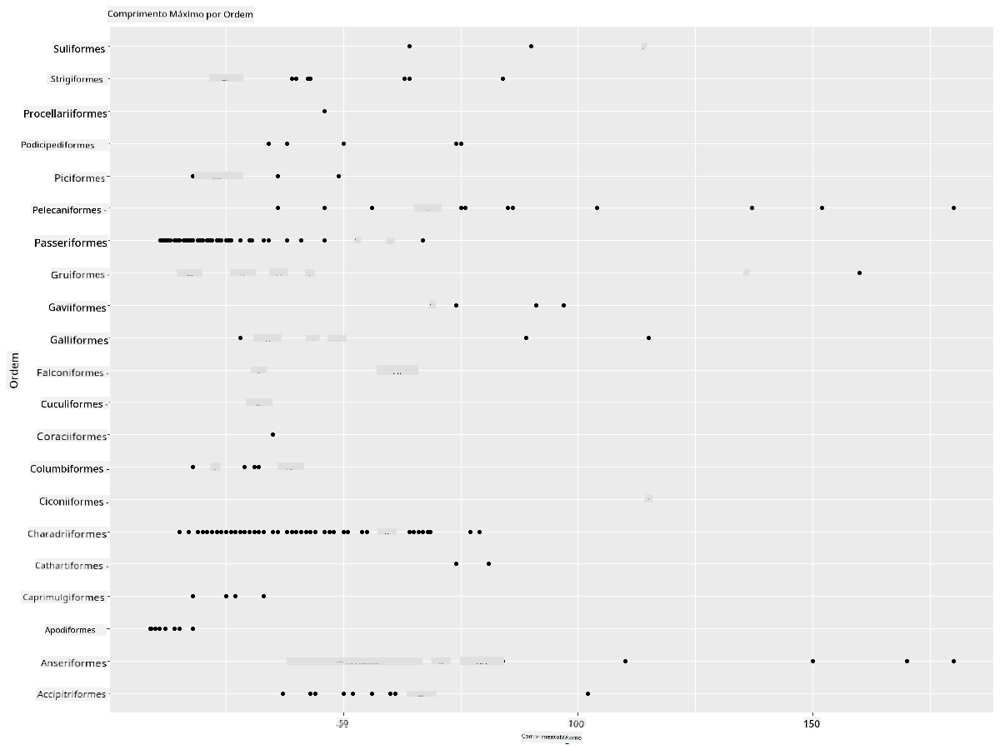
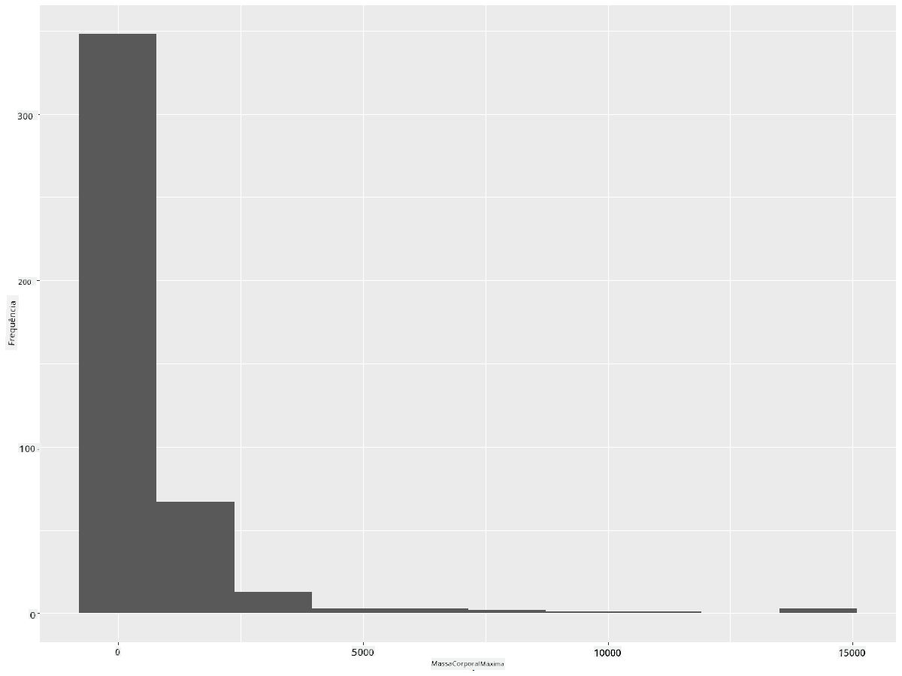
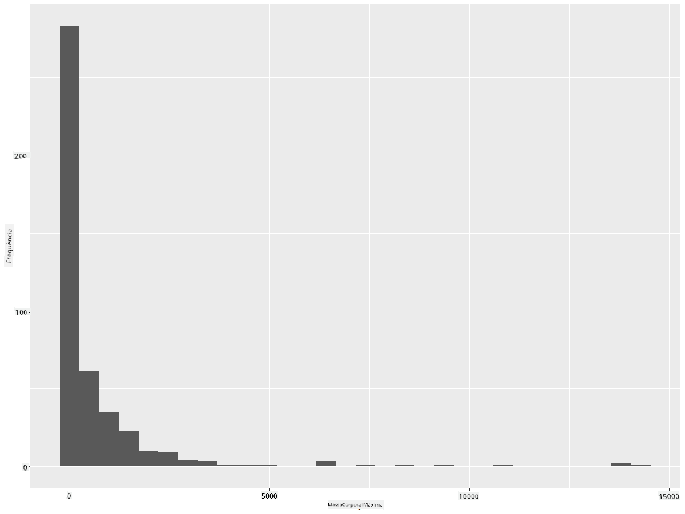
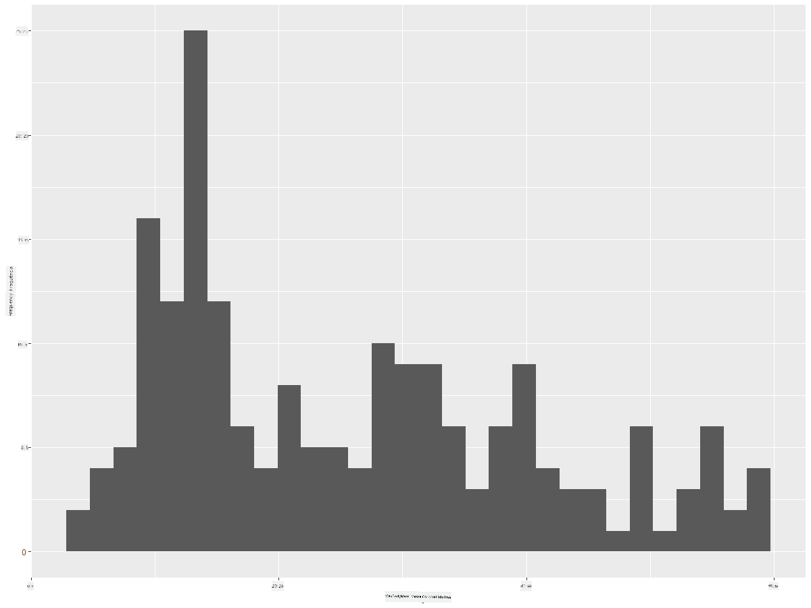
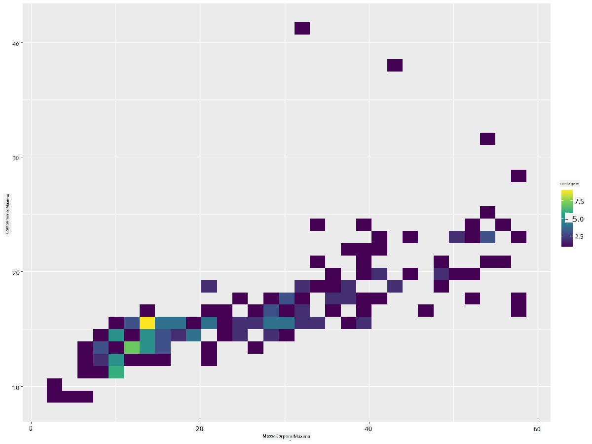
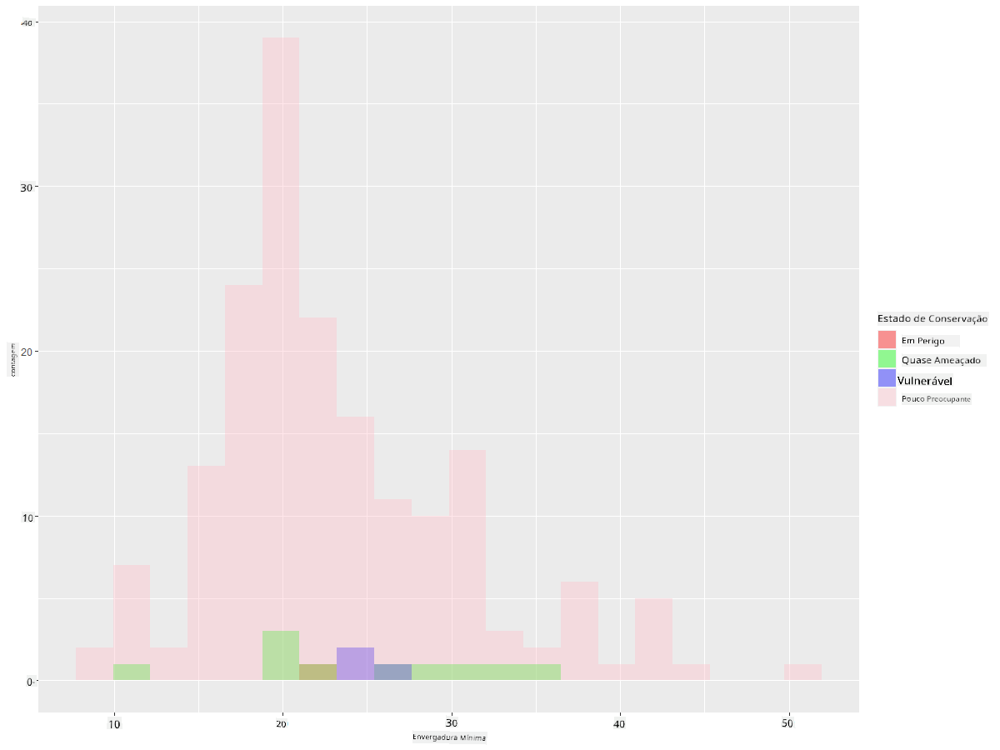
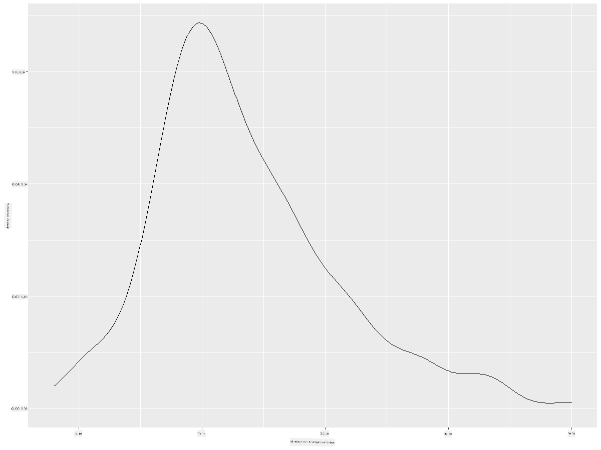
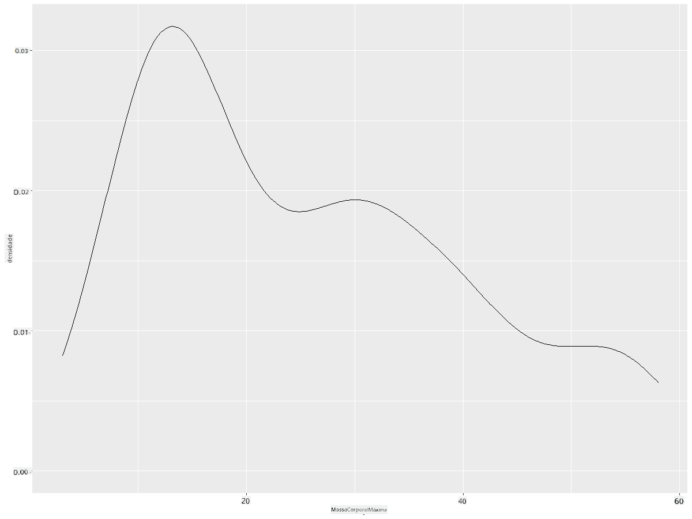
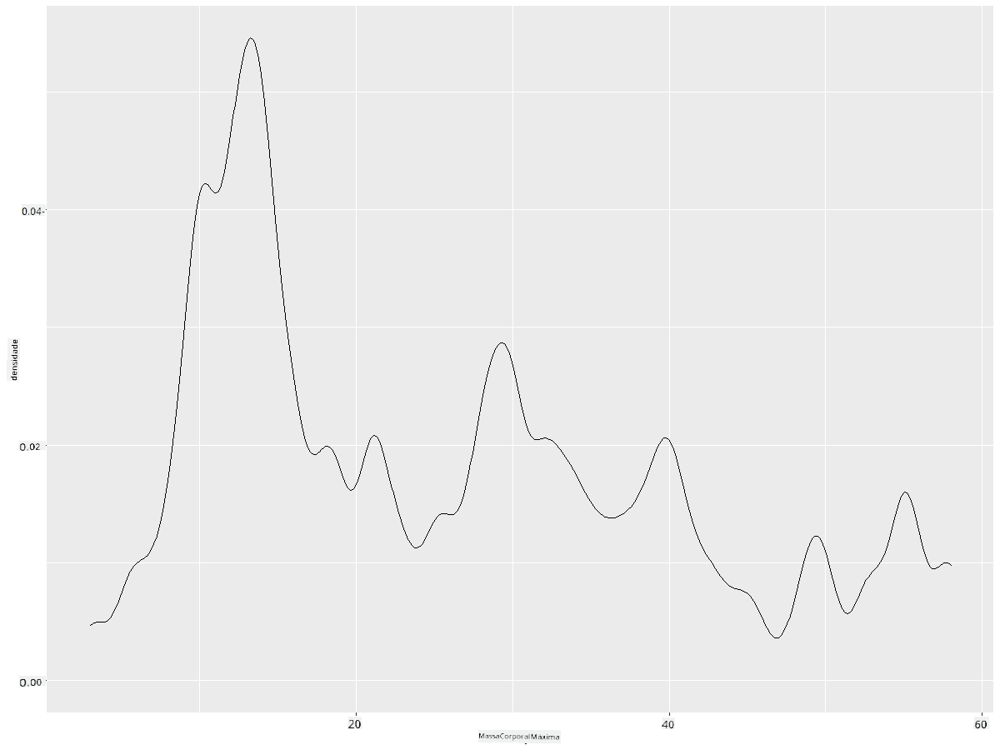
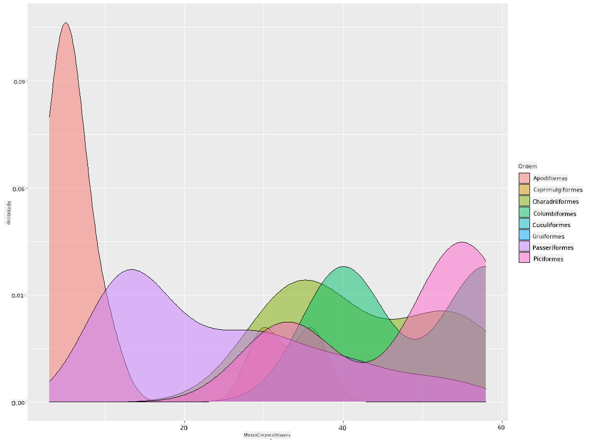

<!--
CO_OP_TRANSLATOR_METADATA:
{
  "original_hash": "ea67c0c40808fd723594de6896c37ccf",
  "translation_date": "2025-08-24T22:42:28+00:00",
  "source_file": "3-Data-Visualization/R/10-visualization-distributions/README.md",
  "language_code": "pt"
}
-->
# Visualizar Distribuições

| ](https://github.com/microsoft/Data-Science-For-Beginners/blob/main/sketchnotes/10-Visualizing-Distributions.png)|
|:---:|
| Visualizar Distribuições - _Sketchnote por [@nitya](https://twitter.com/nitya)_ |

Na lição anterior, aprendeste alguns factos interessantes sobre um conjunto de dados sobre as aves do Minnesota. Identificaste dados erróneos ao visualizar outliers e analisaste as diferenças entre categorias de aves com base no seu comprimento máximo.

## [Questionário pré-aula](https://purple-hill-04aebfb03.1.azurestaticapps.net/quiz/18)
## Explorar o conjunto de dados das aves

Outra forma de analisar os dados é observar a sua distribuição, ou seja, como os dados estão organizados ao longo de um eixo. Talvez, por exemplo, queiras saber sobre a distribuição geral, neste conjunto de dados, da envergadura máxima ou da massa corporal máxima das aves do Minnesota.

Vamos descobrir alguns factos sobre as distribuições de dados neste conjunto de dados. No teu console R, importa o `ggplot2` e a base de dados. Remove os outliers da base de dados, tal como fizeste no tópico anterior.

```r
library(ggplot2)

birds <- read.csv("../../data/birds.csv",fileEncoding="UTF-8-BOM")

birds_filtered <- subset(birds, MaxWingspan < 500)
head(birds_filtered)
```
|      | Nome                         | NomeCientífico         | Categoria             | Ordem        | Família  | Género      | EstadoConservação   | ComprMin | ComprMax | MassaMin | MassaMax | EnvergMin | EnvergMax |
| ---: | :--------------------------- | :--------------------- | :-------------------- | :----------- | :------- | :---------- | :----------------- | --------: | --------: | ----------: | ----------: | ----------: | ----------: |
|    0 | Pato-assobiador-de-barriga-preta | Dendrocygna autumnalis | Patos/Gansos/AvesAquáticas | Anseriformes | Anatidae | Dendrocygna | LC                 |        47 |        56 |         652 |        1020 |          76 |          94 |
|    1 | Pato-assobiador-fulvo       | Dendrocygna bicolor    | Patos/Gansos/AvesAquáticas | Anseriformes | Anatidae | Dendrocygna | LC                 |        45 |        53 |         712 |        1050 |          85 |          93 |
|    2 | Ganso-das-neves             | Anser caerulescens     | Patos/Gansos/AvesAquáticas | Anseriformes | Anatidae | Anser       | LC                 |        64 |        79 |        2050 |        4050 |         135 |         165 |
|    3 | Ganso-de-Ross               | Anser rossii           | Patos/Gansos/AvesAquáticas | Anseriformes | Anatidae | Anser       | LC                 |      57.3 |        64 |        1066 |        1567 |         113 |         116 |
|    4 | Ganso-de-testa-branca-maior | Anser albifrons        | Patos/Gansos/AvesAquáticas | Anseriformes | Anatidae | Anser       | LC                 |        64 |        81 |        1930 |        3310 |         130 |         165 |

De forma geral, podes rapidamente observar como os dados estão distribuídos utilizando um gráfico de dispersão, como fizemos na lição anterior:

```r
ggplot(data=birds_filtered, aes(x=Order, y=MaxLength,group=1)) +
  geom_point() +
  ggtitle("Max Length per order") + coord_flip()
```


Isto dá uma visão geral da distribuição do comprimento corporal por Ordem de aves, mas não é a forma ideal de exibir distribuições reais. Essa tarefa é geralmente realizada criando um Histograma.

## Trabalhar com histogramas

O `ggplot2` oferece ótimas formas de visualizar a distribuição de dados usando Histogramas. Este tipo de gráfico é semelhante a um gráfico de barras, onde a distribuição pode ser observada através do aumento e diminuição das barras. Para construir um histograma, precisas de dados numéricos. Para criar um Histograma, podes traçar um gráfico definindo o tipo como 'hist' para Histograma. Este gráfico mostra a distribuição de MaxBodyMass para todo o intervalo de dados numéricos do conjunto de dados. Dividindo o conjunto de dados em intervalos menores, é possível exibir a distribuição dos valores dos dados:

```r
ggplot(data = birds_filtered, aes(x = MaxBodyMass)) + 
  geom_histogram(bins=10)+ylab('Frequency')
```


Como podes ver, a maioria das mais de 400 aves neste conjunto de dados tem uma Massa Corporal Máxima inferior a 2000. Obtém mais informações sobre os dados alterando o parâmetro `bins` para um número maior, como 30:

```r
ggplot(data = birds_filtered, aes(x = MaxBodyMass)) + geom_histogram(bins=30)+ylab('Frequency')
```



Este gráfico mostra a distribuição de forma um pouco mais detalhada. Um gráfico menos enviesado para a esquerda pode ser criado garantindo que apenas selecionas dados dentro de um determinado intervalo:

Filtra os teus dados para obter apenas as aves cuja massa corporal seja inferior a 60 e mostra 30 `bins`:

```r
birds_filtered_1 <- subset(birds_filtered, MaxBodyMass > 1 & MaxBodyMass < 60)
ggplot(data = birds_filtered_1, aes(x = MaxBodyMass)) + 
  geom_histogram(bins=30)+ylab('Frequency')
```



✅ Experimenta outros filtros e pontos de dados. Para ver a distribuição completa dos dados, remove o filtro `['MaxBodyMass']` para mostrar distribuições rotuladas.

O histograma oferece também algumas melhorias de cor e rotulagem interessantes para experimentar:

Cria um histograma 2D para comparar a relação entre duas distribuições. Vamos comparar `MaxBodyMass` vs. `MaxLength`. O `ggplot2` oferece uma forma integrada de mostrar convergência usando cores mais brilhantes:

```r
ggplot(data=birds_filtered_1, aes(x=MaxBodyMass, y=MaxLength) ) +
  geom_bin2d() +scale_fill_continuous(type = "viridis")
```
Parece haver uma correlação esperada entre estes dois elementos ao longo de um eixo esperado, com um ponto de convergência particularmente forte:



Os histogramas funcionam bem por padrão para dados numéricos. E se precisares de ver distribuições de acordo com dados textuais? 

## Explorar o conjunto de dados para distribuições usando dados textuais 

Este conjunto de dados também inclui boas informações sobre a categoria da ave, o seu género, espécie e família, bem como o seu estado de conservação. Vamos explorar esta informação de conservação. Qual é a distribuição das aves de acordo com o seu estado de conservação?

> ✅ No conjunto de dados, são usados vários acrónimos para descrever o estado de conservação. Estes acrónimos vêm das [Categorias da Lista Vermelha da IUCN](https://www.iucnredlist.org/), uma organização que cataloga o estado das espécies.
> 
> - CR: Criticamente em Perigo
> - EN: Em Perigo
> - EX: Extinto
> - LC: Pouco Preocupante
> - NT: Quase Ameaçado
> - VU: Vulnerável

Estes são valores baseados em texto, por isso precisarás de fazer uma transformação para criar um histograma. Usando o dataframe filteredBirds, exibe o estado de conservação juntamente com a sua Envergadura Mínima. O que observas?

```r
birds_filtered_1$ConservationStatus[birds_filtered_1$ConservationStatus == 'EX'] <- 'x1' 
birds_filtered_1$ConservationStatus[birds_filtered_1$ConservationStatus == 'CR'] <- 'x2'
birds_filtered_1$ConservationStatus[birds_filtered_1$ConservationStatus == 'EN'] <- 'x3'
birds_filtered_1$ConservationStatus[birds_filtered_1$ConservationStatus == 'NT'] <- 'x4'
birds_filtered_1$ConservationStatus[birds_filtered_1$ConservationStatus == 'VU'] <- 'x5'
birds_filtered_1$ConservationStatus[birds_filtered_1$ConservationStatus == 'LC'] <- 'x6'

ggplot(data=birds_filtered_1, aes(x = MinWingspan, fill = ConservationStatus)) +
  geom_histogram(position = "identity", alpha = 0.4, bins = 20) +
  scale_fill_manual(name="Conservation Status",values=c("red","green","blue","pink"),labels=c("Endangered","Near Threathened","Vulnerable","Least Concern"))
```



Não parece haver uma boa correlação entre a envergadura mínima e o estado de conservação. Testa outros elementos do conjunto de dados usando este método. Podes experimentar diferentes filtros também. Encontras alguma correlação?

## Gráficos de densidade

Podes ter notado que os histogramas que vimos até agora são 'escalonados' e não fluem suavemente em forma de arco. Para mostrar um gráfico de densidade mais suave, podes experimentar um gráfico de densidade.

Vamos trabalhar agora com gráficos de densidade!

```r
ggplot(data = birds_filtered_1, aes(x = MinWingspan)) + 
  geom_density()
```


Podes ver como o gráfico reflete o anterior para os dados de Envergadura Mínima; é apenas um pouco mais suave. Se quisesses revisitar aquela linha irregular de MaxBodyMass no segundo gráfico que construíste, poderias suavizá-la muito bem recriando-a usando este método:

```r
ggplot(data = birds_filtered_1, aes(x = MaxBodyMass)) + 
  geom_density()
```


Se quiseres uma linha suave, mas não demasiado suave, edita o parâmetro `adjust`: 

```r
ggplot(data = birds_filtered_1, aes(x = MaxBodyMass)) + 
  geom_density(adjust = 1/5)
```


✅ Lê sobre os parâmetros disponíveis para este tipo de gráfico e experimenta!

Este tipo de gráfico oferece visualizações explicativas muito bonitas. Com algumas linhas de código, por exemplo, podes mostrar a densidade da massa corporal máxima por Ordem de aves:

```r
ggplot(data=birds_filtered_1,aes(x = MaxBodyMass, fill = Order)) +
  geom_density(alpha=0.5)
```


## 🚀 Desafio

Os histogramas são um tipo de gráfico mais sofisticado do que gráficos de dispersão, gráficos de barras ou gráficos de linhas básicos. Faz uma pesquisa na internet para encontrar bons exemplos do uso de histogramas. Como são usados, o que demonstram e em que áreas ou campos de estudo tendem a ser utilizados?

## [Questionário pós-aula](https://purple-hill-04aebfb03.1.azurestaticapps.net/quiz/19)

## Revisão e Autoestudo

Nesta lição, usaste o `ggplot2` e começaste a trabalhar para mostrar gráficos mais sofisticados. Faz uma pesquisa sobre `geom_density_2d()`, uma "curva de densidade de probabilidade contínua em uma ou mais dimensões". Lê a [documentação](https://ggplot2.tidyverse.org/reference/geom_density_2d.html) para entender como funciona.

## Tarefa

[Aplica as tuas competências](assignment.md)

**Aviso Legal**:  
Este documento foi traduzido utilizando o serviço de tradução por IA [Co-op Translator](https://github.com/Azure/co-op-translator). Embora nos esforcemos para garantir a precisão, tenha em atenção que traduções automáticas podem conter erros ou imprecisões. O documento original na sua língua nativa deve ser considerado a fonte autoritária. Para informações críticas, recomenda-se a tradução profissional realizada por humanos. Não nos responsabilizamos por quaisquer mal-entendidos ou interpretações incorretas decorrentes da utilização desta tradução.