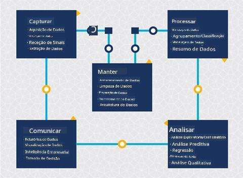
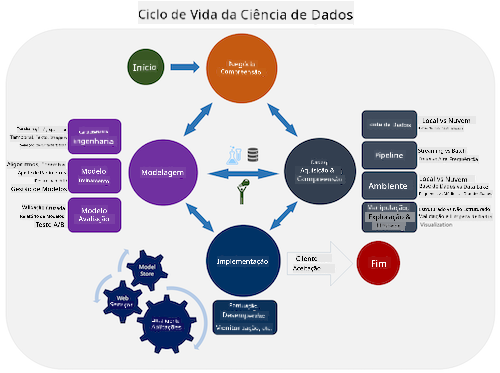
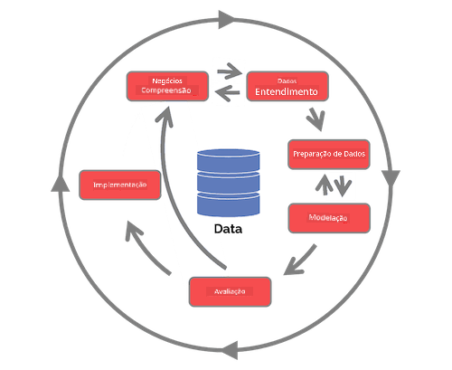

<!--
CO_OP_TRANSLATOR_METADATA:
{
  "original_hash": "07e12a25d20b8f191e3cb651c27fdb2b",
  "translation_date": "2025-09-06T20:49:16+00:00",
  "source_file": "4-Data-Science-Lifecycle/14-Introduction/README.md",
  "language_code": "pt"
}
-->
# Introdução ao Ciclo de Vida da Ciência de Dados

| ](../../sketchnotes/14-DataScience-Lifecycle.png)|
|:---:|
| Introdução ao Ciclo de Vida da Ciência de Dados - _Sketchnote por [@nitya](https://twitter.com/nitya)_ |

## [Questionário Pré-Aula](https://ff-quizzes.netlify.app/en/ds/quiz/26)

Neste ponto, provavelmente já percebeu que a ciência de dados é um processo. Este processo pode ser dividido em 5 etapas:

- Captura
- Processamento
- Análise
- Comunicação
- Manutenção

Esta lição foca-se em 3 partes do ciclo de vida: captura, processamento e manutenção.

  
> Foto por [Berkeley School of Information](https://ischoolonline.berkeley.edu/data-science/what-is-data-science/)

## Captura

A primeira etapa do ciclo de vida é muito importante, pois as etapas seguintes dependem dela. É praticamente duas etapas combinadas numa só: adquirir os dados e definir o propósito e os problemas que precisam ser abordados.  
Definir os objetivos do projeto exigirá um contexto mais profundo sobre o problema ou questão. Primeiro, precisamos identificar e envolver aqueles que precisam de uma solução para o seu problema. Estes podem ser partes interessadas de uma empresa ou patrocinadores do projeto, que podem ajudar a identificar quem ou o que irá beneficiar deste projeto, bem como o que e por que precisam dele. Um objetivo bem definido deve ser mensurável e quantificável para determinar um resultado aceitável.

Perguntas que um cientista de dados pode fazer:
- Este problema já foi abordado antes? O que foi descoberto?
- O propósito e o objetivo são compreendidos por todos os envolvidos?
- Existe ambiguidade e como reduzi-la?
- Quais são as restrições?
- Como será o resultado final?
- Quantos recursos (tempo, pessoas, computação) estão disponíveis?

A seguir, é necessário identificar, coletar e, finalmente, explorar os dados necessários para alcançar esses objetivos definidos. Nesta etapa de aquisição, os cientistas de dados também devem avaliar a quantidade e a qualidade dos dados. Isso exige alguma exploração dos dados para confirmar se o que foi adquirido ajudará a alcançar o resultado desejado.

Perguntas que um cientista de dados pode fazer sobre os dados:
- Que dados já estão disponíveis para mim?
- Quem é o proprietário desses dados?
- Quais são as preocupações com privacidade?
- Tenho dados suficientes para resolver este problema?
- Os dados têm qualidade aceitável para este problema?
- Se eu descobrir informações adicionais através destes dados, devemos considerar alterar ou redefinir os objetivos?

## Processamento

A etapa de processamento do ciclo de vida foca-se na descoberta de padrões nos dados, bem como na modelagem. Algumas técnicas utilizadas nesta etapa requerem métodos estatísticos para identificar os padrões. Normalmente, esta seria uma tarefa tediosa para um humano com um grande conjunto de dados e, por isso, recorre-se a computadores para acelerar o processo. Esta etapa também é onde a ciência de dados e o aprendizado de máquina se cruzam. Como aprendeu na primeira lição, o aprendizado de máquina é o processo de construir modelos para compreender os dados. Os modelos são representações da relação entre variáveis nos dados que ajudam a prever resultados.

Técnicas comuns utilizadas nesta etapa são abordadas no currículo de ML para Iniciantes. Siga os links para saber mais sobre elas:

- [Classificação](https://github.com/microsoft/ML-For-Beginners/tree/main/4-Classification): Organizar dados em categorias para uso mais eficiente.
- [Agrupamento](https://github.com/microsoft/ML-For-Beginners/tree/main/5-Clustering): Agrupar dados em grupos semelhantes.
- [Regressão](https://github.com/microsoft/ML-For-Beginners/tree/main/2-Regression): Determinar as relações entre variáveis para prever ou estimar valores.

## Manutenção

No diagrama do ciclo de vida, pode ter notado que a manutenção está entre captura e processamento. A manutenção é um processo contínuo de gestão, armazenamento e segurança dos dados ao longo do projeto e deve ser considerada durante toda a sua duração.

### Armazenamento de Dados

As decisões sobre como e onde os dados são armazenados podem influenciar o custo do armazenamento, bem como o desempenho de acesso aos dados. Decisões como estas provavelmente não serão feitas apenas pelo cientista de dados, mas ele pode ter que tomar decisões sobre como trabalhar com os dados com base em como estão armazenados.

Aqui estão alguns aspetos dos sistemas modernos de armazenamento de dados que podem influenciar essas escolhas:

**No local vs fora do local vs nuvem pública ou privada**

"No local" refere-se a hospedar e gerir os dados nos seus próprios equipamentos, como possuir um servidor com discos rígidos que armazenam os dados, enquanto "fora do local" depende de equipamentos que não são seus, como um centro de dados. A nuvem pública é uma escolha popular para armazenar dados que não requer conhecimento sobre como ou onde exatamente os dados estão armazenados, sendo que "pública" refere-se a uma infraestrutura unificada subjacente compartilhada por todos os que utilizam a nuvem. Algumas organizações têm políticas de segurança rigorosas que exigem acesso completo ao equipamento onde os dados estão hospedados e, por isso, optam por uma nuvem privada que oferece serviços próprios de nuvem. Aprenderá mais sobre dados na nuvem em [lições futuras](https://github.com/microsoft/Data-Science-For-Beginners/tree/main/5-Data-Science-In-Cloud).

**Dados frios vs dados quentes**

Ao treinar os seus modelos, pode precisar de mais dados de treino. Se estiver satisfeito com o seu modelo, mais dados chegarão para que o modelo cumpra o seu propósito. Em qualquer caso, o custo de armazenar e acessar dados aumentará à medida que acumular mais. Separar dados raramente usados, conhecidos como dados frios, de dados frequentemente acessados, conhecidos como dados quentes, pode ser uma opção mais económica de armazenamento através de serviços de hardware ou software. Se for necessário acessar dados frios, pode demorar um pouco mais em comparação com os dados quentes.

### Gestão de Dados

Ao trabalhar com dados, pode descobrir que alguns deles precisam ser limpos utilizando algumas das técnicas abordadas na lição sobre [preparação de dados](https://github.com/microsoft/Data-Science-For-Beginners/tree/main/2-Working-With-Data/08-data-preparation) para construir modelos precisos. Quando novos dados chegam, será necessário aplicar as mesmas técnicas para manter a consistência na qualidade. Alguns projetos envolvem o uso de ferramentas automatizadas para limpeza, agregação e compressão antes de os dados serem movidos para o local final. O Azure Data Factory é um exemplo de uma dessas ferramentas.

### Segurança dos Dados

Um dos principais objetivos de garantir a segurança dos dados é assegurar que aqueles que trabalham com eles têm controlo sobre o que é coletado e em que contexto está a ser utilizado. Manter os dados seguros envolve limitar o acesso apenas àqueles que precisam dele, aderir às leis e regulamentos locais, bem como manter padrões éticos, conforme abordado na [lição de ética](https://github.com/microsoft/Data-Science-For-Beginners/tree/main/1-Introduction/02-ethics).

Aqui estão algumas ações que uma equipa pode tomar com a segurança em mente:
- Confirmar que todos os dados estão encriptados
- Fornecer aos clientes informações sobre como os seus dados são utilizados
- Remover o acesso aos dados de pessoas que saíram do projeto
- Permitir que apenas certos membros do projeto alterem os dados

## 🚀 Desafio

Existem muitas versões do Ciclo de Vida da Ciência de Dados, onde cada etapa pode ter nomes diferentes e um número distinto de fases, mas conterá os mesmos processos mencionados nesta lição.

Explore o [Ciclo de Vida do Processo de Ciência de Dados em Equipa](https://docs.microsoft.com/en-us/azure/architecture/data-science-process/lifecycle) e o [Processo padrão da indústria para mineração de dados](https://www.datascience-pm.com/crisp-dm-2/). Nomeie 3 semelhanças e diferenças entre os dois.

|Processo de Ciência de Dados em Equipa (TDSP)|Processo padrão da indústria para mineração de dados (CRISP-DM)|
|--|--|
| |  |
| Imagem por [Microsoft](https://docs.microsoft.comazure/architecture/data-science-process/lifecycle) | Imagem por [Data Science Process Alliance](https://www.datascience-pm.com/crisp-dm-2/) |

## [Questionário Pós-Aula](https://ff-quizzes.netlify.app/en/ds/quiz/27)

## Revisão e Estudo Individual

Aplicar o Ciclo de Vida da Ciência de Dados envolve múltiplos papéis e tarefas, onde alguns podem focar-se em partes específicas de cada etapa. O Processo de Ciência de Dados em Equipa fornece alguns recursos que explicam os tipos de papéis e tarefas que alguém pode ter num projeto.

* [Papéis e tarefas no Processo de Ciência de Dados em Equipa](https://docs.microsoft.com/en-us/azure/architecture/data-science-process/roles-tasks)  
* [Executar tarefas de ciência de dados: exploração, modelagem e implementação](https://docs.microsoft.com/en-us/azure/architecture/data-science-process/execute-data-science-tasks)

## Tarefa

[Avaliar um Conjunto de Dados](assignment.md)

---

**Aviso Legal**:  
Este documento foi traduzido utilizando o serviço de tradução por IA [Co-op Translator](https://github.com/Azure/co-op-translator). Embora nos esforcemos para garantir a precisão, esteja ciente de que traduções automáticas podem conter erros ou imprecisões. O documento original na sua língua nativa deve ser considerado a fonte oficial. Para informações críticas, recomenda-se uma tradução profissional realizada por humanos. Não nos responsabilizamos por quaisquer mal-entendidos ou interpretações incorretas resultantes do uso desta tradução.