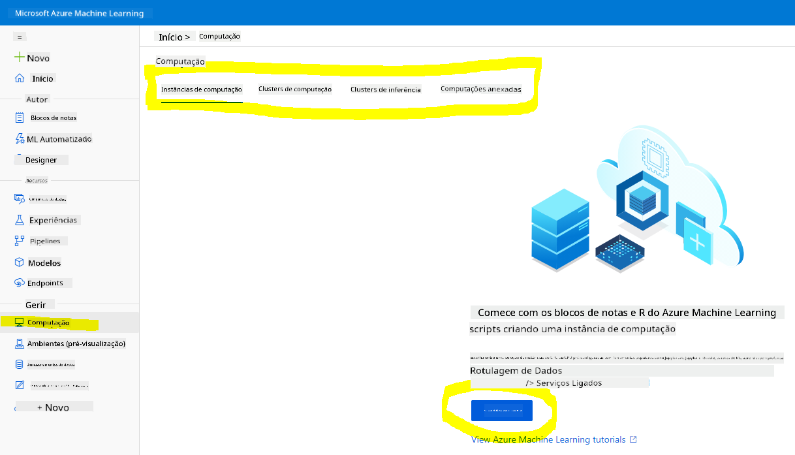
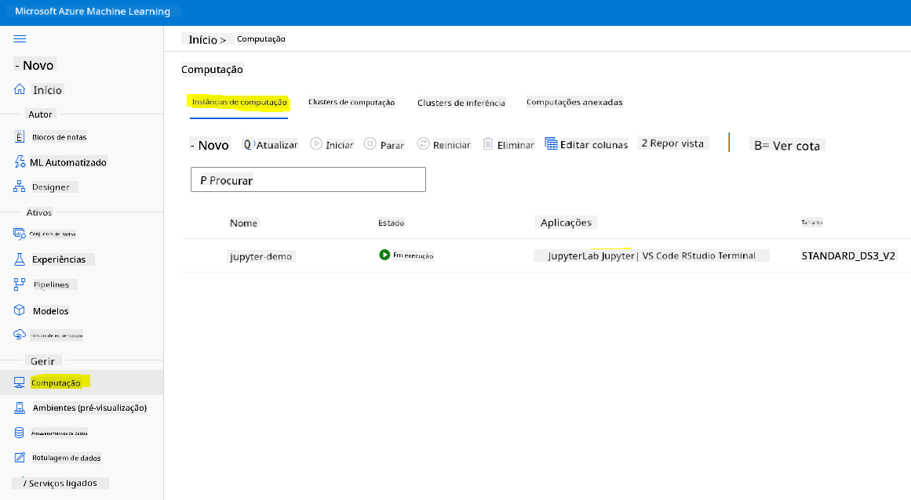
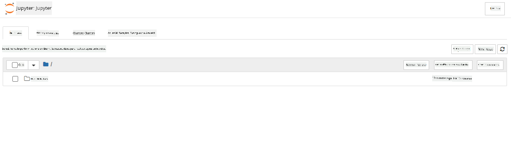

<!--
CO_OP_TRANSLATOR_METADATA:
{
  "original_hash": "73dead89dc2ddda4d6ec0232814a191e",
  "translation_date": "2025-08-24T22:05:22+00:00",
  "source_file": "5-Data-Science-In-Cloud/19-Azure/README.md",
  "language_code": "pt"
}
-->
# Ciência de Dados na Cloud: O caminho do "Azure ML SDK"

| ](../../sketchnotes/19-DataScience-Cloud.png)|
|:---:|
| Ciência de Dados na Cloud: Azure ML SDK - _Sketchnote por [@nitya](https://twitter.com/nitya)_ |

Índice:

- [Ciência de Dados na Cloud: O caminho do "Azure ML SDK"](../../../../5-Data-Science-In-Cloud/19-Azure)
  - [Questionário Pré-Aula](../../../../5-Data-Science-In-Cloud/19-Azure)
  - [1. Introdução](../../../../5-Data-Science-In-Cloud/19-Azure)
    - [1.1 O que é o Azure ML SDK?](../../../../5-Data-Science-In-Cloud/19-Azure)
    - [1.2 Introdução ao projeto de previsão de insuficiência cardíaca e ao conjunto de dados](../../../../5-Data-Science-In-Cloud/19-Azure)
  - [2. Treinando um modelo com o Azure ML SDK](../../../../5-Data-Science-In-Cloud/19-Azure)
    - [2.1 Criar um workspace do Azure ML](../../../../5-Data-Science-In-Cloud/19-Azure)
    - [2.2 Criar uma instância de computação](../../../../5-Data-Science-In-Cloud/19-Azure)
    - [2.3 Carregar o conjunto de dados](../../../../5-Data-Science-In-Cloud/19-Azure)
    - [2.4 Criar Notebooks](../../../../5-Data-Science-In-Cloud/19-Azure)
    - [2.5 Treinar um modelo](../../../../5-Data-Science-In-Cloud/19-Azure)
      - [2.5.1 Configurar Workspace, experimento, cluster de computação e conjunto de dados](../../../../5-Data-Science-In-Cloud/19-Azure)
      - [2.5.2 Configuração e treino com AutoML](../../../../5-Data-Science-In-Cloud/19-Azure)
  - [3. Implementação do modelo e consumo do endpoint com o Azure ML SDK](../../../../5-Data-Science-In-Cloud/19-Azure)
    - [3.1 Guardar o melhor modelo](../../../../5-Data-Science-In-Cloud/19-Azure)
    - [3.2 Implementação do modelo](../../../../5-Data-Science-In-Cloud/19-Azure)
    - [3.3 Consumo do endpoint](../../../../5-Data-Science-In-Cloud/19-Azure)
  - [🚀 Desafio](../../../../5-Data-Science-In-Cloud/19-Azure)
  - [Questionário Pós-Aula](../../../../5-Data-Science-In-Cloud/19-Azure)
  - [Revisão e Autoestudo](../../../../5-Data-Science-In-Cloud/19-Azure)
  - [Tarefa](../../../../5-Data-Science-In-Cloud/19-Azure)

## [Questionário Pré-Aula](https://purple-hill-04aebfb03.1.azurestaticapps.net/quiz/36)

## 1. Introdução

### 1.1 O que é o Azure ML SDK?

Cientistas de dados e desenvolvedores de IA utilizam o Azure Machine Learning SDK para criar e executar fluxos de trabalho de machine learning com o serviço Azure Machine Learning. Pode-se interagir com o serviço em qualquer ambiente Python, incluindo Jupyter Notebooks, Visual Studio Code ou o seu IDE Python favorito.

Áreas principais do SDK incluem:

- Explorar, preparar e gerir o ciclo de vida dos seus conjuntos de dados usados em experimentos de machine learning.
- Gerir recursos na cloud para monitorização, registo e organização dos seus experimentos de machine learning.
- Treinar modelos localmente ou utilizando recursos na cloud, incluindo treino acelerado por GPU.
- Usar machine learning automatizado, que aceita parâmetros de configuração e dados de treino. Ele itera automaticamente por algoritmos e configurações de hiperparâmetros para encontrar o melhor modelo para previsões.
- Implementar serviços web para converter os seus modelos treinados em serviços RESTful que podem ser consumidos em qualquer aplicação.

[Saiba mais sobre o Azure Machine Learning SDK](https://docs.microsoft.com/python/api/overview/azure/ml?WT.mc_id=academic-77958-bethanycheum&ocid=AID3041109)

Na [lição anterior](../18-Low-Code/README.md), vimos como treinar, implementar e consumir um modelo de forma Low code/No code. Usámos o conjunto de dados de insuficiência cardíaca para gerar um modelo de previsão de insuficiência cardíaca. Nesta lição, faremos exatamente o mesmo, mas utilizando o Azure Machine Learning SDK.


### 1.2 Introdução ao projeto de previsão de insuficiência cardíaca e ao conjunto de dados

Consulte [aqui](../18-Low-Code/README.md) a introdução ao projeto de previsão de insuficiência cardíaca e ao conjunto de dados.

## 2. Treinando um modelo com o Azure ML SDK
### 2.1 Criar um workspace do Azure ML

Para simplificar, vamos trabalhar num jupyter notebook. Isto implica que já tem um Workspace e uma instância de computação. Se já tiver um Workspace, pode saltar diretamente para a secção 2.3 Criação de Notebooks.

Caso contrário, siga as instruções na secção **2.1 Criar um workspace do Azure ML** na [lição anterior](../18-Low-Code/README.md) para criar um workspace.

### 2.2 Criar uma instância de computação

No [workspace do Azure ML](https://ml.azure.com/) que criámos anteriormente, vá ao menu de computação e verá os diferentes recursos de computação disponíveis.



Vamos criar uma instância de computação para provisionar um jupyter notebook. 
1. Clique no botão + Novo. 
2. Dê um nome à sua instância de computação.
3. Escolha as suas opções: CPU ou GPU, tamanho da VM e número de núcleos.
4. Clique no botão Criar.

Parabéns, acabou de criar uma instância de computação! Usaremos esta instância de computação para criar um Notebook na [secção Criação de Notebooks](../../../../5-Data-Science-In-Cloud/19-Azure).

### 2.3 Carregar o conjunto de dados
Consulte a [lição anterior](../18-Low-Code/README.md) na secção **2.3 Carregar o conjunto de dados** se ainda não tiver carregado o conjunto de dados.

### 2.4 Criar Notebooks

> **_NOTA:_** Para o próximo passo, pode criar um novo notebook do zero ou carregar o [notebook que criámos](../../../../5-Data-Science-In-Cloud/19-Azure/notebook.ipynb) no seu Azure ML Studio. Para carregá-lo, basta clicar no menu "Notebook" e carregar o notebook.

Os notebooks são uma parte muito importante do processo de ciência de dados. Eles podem ser usados para realizar Análise Exploratória de Dados (EDA), chamar um cluster de computação para treinar um modelo ou chamar um cluster de inferência para implementar um endpoint. 

Para criar um Notebook, precisamos de um nó de computação que esteja a servir a instância do jupyter notebook. Volte ao [workspace do Azure ML](https://ml.azure.com/) e clique em Instâncias de computação. Na lista de instâncias de computação, deverá ver a [instância de computação que criámos anteriormente](../../../../5-Data-Science-In-Cloud/19-Azure). 

1. Na secção Aplicações, clique na opção Jupyter. 
2. Marque a caixa "Sim, compreendo" e clique no botão Continuar.

3. Isto abrirá uma nova aba no navegador com a sua instância do jupyter notebook. Clique no botão "Novo" para criar um notebook.



Agora que temos um Notebook, podemos começar a treinar o modelo com o Azure ML SDK.

### 2.5 Treinar um modelo

Antes de mais, se tiver alguma dúvida, consulte a [documentação do Azure ML SDK](https://docs.microsoft.com/python/api/overview/azure/ml?WT.mc_id=academic-77958-bethanycheum&ocid=AID3041109). Ela contém todas as informações necessárias para entender os módulos que veremos nesta lição.

#### 2.5.1 Configurar Workspace, experimento, cluster de computação e conjunto de dados

Precisa de carregar o `workspace` a partir do ficheiro de configuração utilizando o seguinte código:

```python
from azureml.core import Workspace
ws = Workspace.from_config()
```

Isto retorna um objeto do tipo `Workspace` que representa o workspace. Depois, precisa de criar um `experimento` utilizando o seguinte código:

```python
from azureml.core import Experiment
experiment_name = 'aml-experiment'
experiment = Experiment(ws, experiment_name)
```
Para obter ou criar um experimento a partir de um workspace, solicita-se o experimento utilizando o nome do experimento. O nome do experimento deve ter entre 3 e 36 caracteres, começar com uma letra ou número e pode conter apenas letras, números, sublinhados e traços. Se o experimento não for encontrado no workspace, um novo experimento será criado.

Agora precisa de criar um cluster de computação para o treino utilizando o seguinte código. Note que este passo pode demorar alguns minutos. 

```python
from azureml.core.compute import AmlCompute

aml_name = "heart-f-cluster"
try:
    aml_compute = AmlCompute(ws, aml_name)
    print('Found existing AML compute context.')
except:
    print('Creating new AML compute context.')
    aml_config = AmlCompute.provisioning_configuration(vm_size = "Standard_D2_v2", min_nodes=1, max_nodes=3)
    aml_compute = AmlCompute.create(ws, name = aml_name, provisioning_configuration = aml_config)
    aml_compute.wait_for_completion(show_output = True)

cts = ws.compute_targets
compute_target = cts[aml_name]
```

Pode obter o conjunto de dados do workspace utilizando o nome do conjunto de dados da seguinte forma:

```python
dataset = ws.datasets['heart-failure-records']
df = dataset.to_pandas_dataframe()
df.describe()
```
#### 2.5.2 Configuração e treino com AutoML

Para configurar o AutoML, utilize a [classe AutoMLConfig](https://docs.microsoft.com/python/api/azureml-train-automl-client/azureml.train.automl.automlconfig(class)?WT.mc_id=academic-77958-bethanycheum&ocid=AID3041109).

Conforme descrito na documentação, existem muitos parâmetros com os quais pode experimentar. Para este projeto, utilizaremos os seguintes parâmetros:

- `experiment_timeout_minutes`: O tempo máximo (em minutos) que o experimento pode ser executado antes de ser automaticamente interrompido e os resultados disponibilizados.
- `max_concurrent_iterations`: O número máximo de iterações de treino simultâneas permitidas para o experimento.
- `primary_metric`: A métrica principal usada para determinar o estado do experimento.
- `compute_target`: O alvo de computação do Azure Machine Learning para executar o experimento de Machine Learning Automatizado.
- `task`: O tipo de tarefa a ser executada. Os valores podem ser 'classification', 'regression' ou 'forecasting', dependendo do tipo de problema de ML automatizado a ser resolvido.
- `training_data`: Os dados de treino a serem usados no experimento. Deve conter tanto as características de treino quanto uma coluna de rótulo (opcionalmente uma coluna de pesos de amostra).
- `label_column_name`: O nome da coluna de rótulo.
- `path`: O caminho completo para a pasta do projeto Azure Machine Learning.
- `enable_early_stopping`: Indica se a interrupção antecipada deve ser ativada caso a pontuação não melhore a curto prazo.
- `featurization`: Indicador para determinar se a etapa de featurização deve ser feita automaticamente ou não, ou se uma featurização personalizada deve ser usada.
- `debug_log`: O ficheiro de registo para gravar informações de depuração.

```python
from azureml.train.automl import AutoMLConfig

project_folder = './aml-project'

automl_settings = {
    "experiment_timeout_minutes": 20,
    "max_concurrent_iterations": 3,
    "primary_metric" : 'AUC_weighted'
}

automl_config = AutoMLConfig(compute_target=compute_target,
                             task = "classification",
                             training_data=dataset,
                             label_column_name="DEATH_EVENT",
                             path = project_folder,  
                             enable_early_stopping= True,
                             featurization= 'auto',
                             debug_log = "automl_errors.log",
                             **automl_settings
                            )
```
Agora que a configuração está definida, pode treinar o modelo utilizando o seguinte código. Este passo pode demorar até uma hora, dependendo do tamanho do cluster.

```python
remote_run = experiment.submit(automl_config)
```
Pode executar o widget RunDetails para mostrar os diferentes experimentos.
```python
from azureml.widgets import RunDetails
RunDetails(remote_run).show()
```
## 3. Implementação do modelo e consumo do endpoint com o Azure ML SDK

### 3.1 Guardar o melhor modelo

O `remote_run` é um objeto do tipo [AutoMLRun](https://docs.microsoft.com/python/api/azureml-train-automl-client/azureml.train.automl.run.automlrun?WT.mc_id=academic-77958-bethanycheum&ocid=AID3041109). Este objeto contém o método `get_output()` que retorna a melhor execução e o modelo ajustado correspondente.

```python
best_run, fitted_model = remote_run.get_output()
```
Pode ver os parâmetros usados para o melhor modelo simplesmente imprimindo o `fitted_model` e verificar as propriedades do melhor modelo utilizando o método [get_properties()](https://docs.microsoft.com/python/api/azureml-core/azureml.core.run(class)?view=azure-ml-py#azureml_core_Run_get_properties?WT.mc_id=academic-77958-bethanycheum&ocid=AID3041109).

```python
best_run.get_properties()
```

Agora registe o modelo com o método [register_model](https://docs.microsoft.com/python/api/azureml-train-automl-client/azureml.train.automl.run.automlrun?view=azure-ml-py#register-model-model-name-none--description-none--tags-none--iteration-none--metric-none-?WT.mc_id=academic-77958-bethanycheum&ocid=AID3041109).
```python
model_name = best_run.properties['model_name']
script_file_name = 'inference/score.py'
best_run.download_file('outputs/scoring_file_v_1_0_0.py', 'inference/score.py')
description = "aml heart failure project sdk"
model = best_run.register_model(model_name = model_name,
                                model_path = './outputs/',
                                description = description,
                                tags = None)
```
### 3.2 Implementação do modelo

Depois de guardar o melhor modelo, podemos implementá-lo com a classe [InferenceConfig](https://docs.microsoft.com/python/api/azureml-core/azureml.core.model.inferenceconfig?view=azure-ml-py?ocid=AID3041109). A InferenceConfig representa as configurações de ambiente personalizadas usadas para a implementação. A classe [AciWebservice](https://docs.microsoft.com/python/api/azureml-core/azureml.core.webservice.aciwebservice?view=azure-ml-py) representa um modelo de machine learning implementado como um endpoint de serviço web em Azure Container Instances. Um serviço implementado é criado a partir de um modelo, script e ficheiros associados. O serviço web resultante é um endpoint HTTP balanceado com uma API REST. Pode enviar dados para esta API e receber a previsão retornada pelo modelo.

O modelo é implementado utilizando o método [deploy](https://docs.microsoft.com/python/api/azureml-core/azureml.core.model(class)?view=azure-ml-py#deploy-workspace--name--models--inference-config-none--deployment-config-none--deployment-target-none--overwrite-false--show-output-false-?WT.mc_id=academic-77958-bethanycheum&ocid=AID3041109).

```python
from azureml.core.model import InferenceConfig, Model
from azureml.core.webservice import AciWebservice

inference_config = InferenceConfig(entry_script=script_file_name, environment=best_run.get_environment())

aciconfig = AciWebservice.deploy_configuration(cpu_cores = 1,
                                               memory_gb = 1,
                                               tags = {'type': "automl-heart-failure-prediction"},
                                               description = 'Sample service for AutoML Heart Failure Prediction')

aci_service_name = 'automl-hf-sdk'
aci_service = Model.deploy(ws, aci_service_name, [model], inference_config, aciconfig)
aci_service.wait_for_deployment(True)
print(aci_service.state)
```
Este passo deve demorar alguns minutos.

### 3.3 Consumo do endpoint

Pode consumir o seu endpoint criando uma entrada de exemplo:

```python
data = {
    "data":
    [
        {
            'age': "60",
            'anaemia': "false",
            'creatinine_phosphokinase': "500",
            'diabetes': "false",
            'ejection_fraction': "38",
            'high_blood_pressure': "false",
            'platelets': "260000",
            'serum_creatinine': "1.40",
            'serum_sodium': "137",
            'sex': "false",
            'smoking': "false",
            'time': "130",
        },
    ],
}

test_sample = str.encode(json.dumps(data))
```
E depois pode enviar esta entrada para o seu modelo para obter uma previsão:
```python
response = aci_service.run(input_data=test_sample)
response
```  
Isto deverá gerar `'{"result": [false]}'`. Isto significa que os dados do paciente que enviámos para o endpoint geraram a previsão `false`, o que indica que esta pessoa não tem probabilidade de sofrer um ataque cardíaco.

Parabéns! Acabaste de consumir o modelo implementado e treinado no Azure ML com o Azure ML SDK!

> **_NOTE:_** Quando terminares o projeto, não te esqueças de eliminar todos os recursos.

## 🚀 Desafio

Há muitas outras coisas que podes fazer através do SDK, mas infelizmente não conseguimos abordar todas nesta lição. Mas há boas notícias: aprender a navegar pela documentação do SDK pode levar-te muito longe por conta própria. Dá uma vista de olhos na documentação do Azure ML SDK e encontra a classe `Pipeline`, que te permite criar pipelines. Um Pipeline é uma coleção de passos que podem ser executados como um fluxo de trabalho.

**DICA:** Vai à [documentação do SDK](https://docs.microsoft.com/python/api/overview/azure/ml/?view=azure-ml-py?WT.mc_id=academic-77958-bethanycheum&ocid=AID3041109) e escreve palavras-chave na barra de pesquisa, como "Pipeline". Deverás encontrar a classe `azureml.pipeline.core.Pipeline` nos resultados da pesquisa.

## [Questionário pós-aula](https://purple-hill-04aebfb03.1.azurestaticapps.net/quiz/37)

## Revisão e Estudo Autónomo

Nesta lição, aprendeste a treinar, implementar e consumir um modelo para prever o risco de insuficiência cardíaca com o Azure ML SDK na cloud. Consulta esta [documentação](https://docs.microsoft.com/python/api/overview/azure/ml/?view=azure-ml-py?WT.mc_id=academic-77958-bethanycheum&ocid=AID3041109) para mais informações sobre o Azure ML SDK. Tenta criar o teu próprio modelo com o Azure ML SDK.

## Tarefa

[Projeto de Ciência de Dados usando o Azure ML SDK](assignment.md)

**Aviso Legal**:  
Este documento foi traduzido utilizando o serviço de tradução por IA [Co-op Translator](https://github.com/Azure/co-op-translator). Embora nos esforcemos para garantir a precisão, é importante notar que traduções automáticas podem conter erros ou imprecisões. O documento original na sua língua nativa deve ser considerado a fonte autoritária. Para informações críticas, recomenda-se a tradução profissional realizada por humanos. Não nos responsabilizamos por quaisquer mal-entendidos ou interpretações incorretas decorrentes da utilização desta tradução.