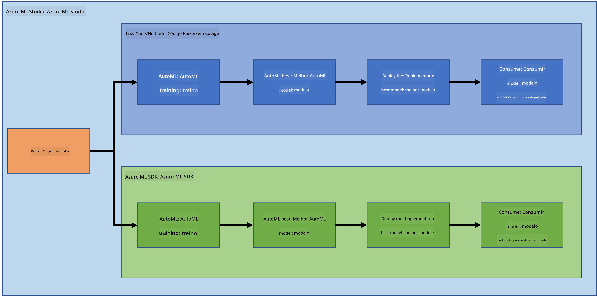

<!--
CO_OP_TRANSLATOR_METADATA:
{
  "original_hash": "8dfe141a0f46f7d253e07f74913c7f44",
  "translation_date": "2025-08-24T21:52:21+00:00",
  "source_file": "5-Data-Science-In-Cloud/README.md",
  "language_code": "pt"
}
-->
# Ciência de Dados na Cloud

> Foto de [Jelleke Vanooteghem](https://unsplash.com/@ilumire) no [Unsplash](https://unsplash.com/s/photos/cloud?orientation=landscape)

Quando se trata de fazer ciência de dados com big data, a cloud pode ser um divisor de águas. Nas próximas três lições, vamos explorar o que é a cloud e por que ela pode ser tão útil. Também vamos analisar um conjunto de dados sobre insuficiência cardíaca e construir um modelo para ajudar a avaliar a probabilidade de alguém sofrer de insuficiência cardíaca. Utilizaremos o poder da cloud para treinar, implementar e consumir um modelo de duas formas diferentes. Uma forma será utilizando apenas a interface de utilizador, num estilo de "Low code/No code", e a outra será através do Azure Machine Learning Software Developer Kit (Azure ML SDK).

### Tópicos

1. [Por que usar a Cloud para Ciência de Dados?](17-Introduction/README.md)  
2. [Ciência de Dados na Cloud: O método "Low code/No code"](18-Low-Code/README.md)  
3. [Ciência de Dados na Cloud: O método "Azure ML SDK"](19-Azure/README.md)  

### Créditos  
Estas lições foram escritas com ☁️ e 💕 por [Maud Levy](https://twitter.com/maudstweets) e [Tiffany Souterre](https://twitter.com/TiffanySouterre)  

Os dados para o projeto de Previsão de Insuficiência Cardíaca foram obtidos de [Larxel](https://www.kaggle.com/andrewmvd) no [Kaggle](https://www.kaggle.com/andrewmvd/heart-failure-clinical-data). Estão licenciados sob a [Attribution 4.0 International (CC BY 4.0)](https://creativecommons.org/licenses/by/4.0/).  

**Aviso Legal**:  
Este documento foi traduzido utilizando o serviço de tradução por IA [Co-op Translator](https://github.com/Azure/co-op-translator). Embora nos esforcemos para garantir a precisão, tenha em atenção que traduções automáticas podem conter erros ou imprecisões. O documento original na sua língua nativa deve ser considerado a fonte autoritária. Para informações críticas, recomenda-se a tradução profissional realizada por humanos. Não nos responsabilizamos por quaisquer mal-entendidos ou interpretações incorretas decorrentes da utilização desta tradução.