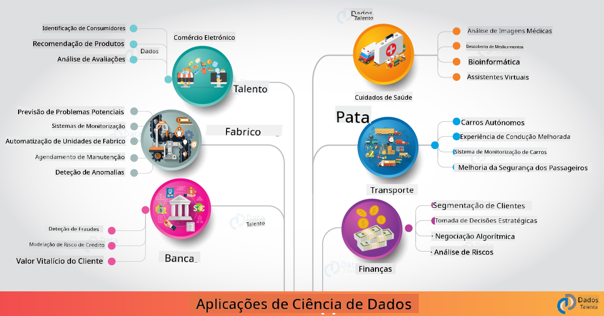

<!--
CO_OP_TRANSLATOR_METADATA:
{
  "original_hash": "f95679140c7cb39c30ccba535cd8f03f",
  "translation_date": "2025-09-04T13:49:14+00:00",
  "source_file": "6-Data-Science-In-Wild/20-Real-World-Examples/README.md",
  "language_code": "pt"
}
-->
# Ciência de Dados no Mundo Real

|  ](../../sketchnotes/20-DataScience-RealWorld.png) |
| :--------------------------------------------------------------------------------------------------------------: |
|               Ciência de Dados no Mundo Real - _Sketchnote por [@nitya](https://twitter.com/nitya)_               |

Estamos quase no fim desta jornada de aprendizagem!

Começámos com definições de ciência de dados e ética, explorámos várias ferramentas e técnicas para análise e visualização de dados, revisámos o ciclo de vida da ciência de dados e analisámos como escalar e automatizar fluxos de trabalho de ciência de dados com serviços de computação na nuvem. Então, provavelmente estás a perguntar-te: _"Como exatamente posso aplicar tudo o que aprendi em contextos do mundo real?"_

Nesta lição, vamos explorar aplicações reais da ciência de dados em diferentes indústrias e mergulhar em exemplos específicos nos contextos de investigação, humanidades digitais e sustentabilidade. Vamos também abordar oportunidades de projetos para estudantes e concluir com recursos úteis para continuar a tua jornada de aprendizagem!

## Questionário Pré-Aula

[Questionário pré-aula](https://ff-quizzes.netlify.app/en/ds/)

## Ciência de Dados + Indústria

Graças à democratização da IA, os desenvolvedores estão a encontrar formas mais fáceis de projetar e integrar decisões baseadas em IA e insights orientados por dados em experiências de utilizadores e fluxos de trabalho de desenvolvimento. Aqui estão alguns exemplos de como a ciência de dados é "aplicada" em contextos reais na indústria:

 * [Google Flu Trends](https://www.wired.com/2015/10/can-learn-epic-failure-google-flu-trends/) utilizou ciência de dados para correlacionar termos de pesquisa com tendências de gripe. Embora a abordagem tenha tido falhas, destacou as possibilidades (e desafios) das previsões de saúde baseadas em dados.

 * [Previsões de Rotas da UPS](https://www.technologyreview.com/2018/11/21/139000/how-ups-uses-ai-to-outsmart-bad-weather/) - explica como a UPS utiliza ciência de dados e aprendizagem automática para prever rotas ótimas de entrega, considerando condições meteorológicas, padrões de trânsito, prazos de entrega e mais.

 * [Visualização de Rotas de Táxis em NYC](http://chriswhong.github.io/nyctaxi/) - dados obtidos através das [Leis de Liberdade de Informação](https://chriswhong.com/open-data/foil_nyc_taxi/) ajudaram a visualizar um dia na vida dos táxis de NYC, permitindo compreender como navegam pela cidade movimentada, o dinheiro que geram e a duração das viagens ao longo de um período de 24 horas.

 * [Uber Data Science Workbench](https://eng.uber.com/dsw/) - utiliza dados (sobre locais de recolha e entrega, duração das viagens, rotas preferidas, etc.) recolhidos de milhões de viagens diárias para construir uma ferramenta de análise de dados que ajuda em decisões de preços, segurança, deteção de fraudes e navegação.

 * [Análise Desportiva](https://towardsdatascience.com/scope-of-analytics-in-sports-world-37ed09c39860) - foca-se em _análise preditiva_ (análise de equipas e jogadores - pensa em [Moneyball](https://datasciencedegree.wisconsin.edu/blog/moneyball-proves-importance-big-data-big-ideas/) - e gestão de fãs) e _visualização de dados_ (dashboards de equipas e fãs, jogos, etc.) com aplicações como recrutamento de talentos, apostas desportivas e gestão de inventário/locais.

 * [Ciência de Dados na Banca](https://data-flair.training/blogs/data-science-in-banking/) - destaca o valor da ciência de dados na indústria financeira com aplicações que vão desde modelagem de risco e deteção de fraudes, até segmentação de clientes, previsão em tempo real e sistemas de recomendação. A análise preditiva também impulsiona medidas críticas como [pontuações de crédito](https://dzone.com/articles/using-big-data-and-predictive-analytics-for-credit).

 * [Ciência de Dados na Saúde](https://data-flair.training/blogs/data-science-in-healthcare/) - destaca aplicações como imagiologia médica (e.g., ressonância magnética, raio-X, tomografia), genómica (sequenciamento de DNA), desenvolvimento de medicamentos (avaliação de risco, previsão de sucesso), análise preditiva (cuidados ao paciente e logística de fornecimento), rastreamento e prevenção de doenças, entre outros.

 Crédito da Imagem: [Data Flair: 6 Amazing Data Science Applications ](https://data-flair.training/blogs/data-science-applications/)

A figura mostra outros domínios e exemplos de aplicação de técnicas de ciência de dados. Queres explorar outras aplicações? Consulta a secção [Revisão e Autoestudo](../../../../6-Data-Science-In-Wild/20-Real-World-Examples) abaixo.

## Ciência de Dados + Investigação

|  ](../../sketchnotes/20-DataScience-Research.png) |
| :---------------------------------------------------------------------------------------------------------------: |
|              Ciência de Dados & Investigação - _Sketchnote por [@nitya](https://twitter.com/nitya)_              |

Embora as aplicações do mundo real frequentemente se concentrem em casos de uso na indústria em grande escala, as aplicações e projetos de _investigação_ podem ser úteis de duas perspetivas:

* _oportunidades de inovação_ - explorar protótipos rápidos de conceitos avançados e testar experiências de utilizadores para aplicações de próxima geração.
* _desafios de implementação_ - investigar potenciais danos ou consequências não intencionais das tecnologias de ciência de dados em contextos reais.

Para os estudantes, estes projetos de investigação podem proporcionar oportunidades de aprendizagem e colaboração que melhoram a compreensão do tema e ampliam a consciência e o envolvimento com pessoas ou equipas relevantes que trabalham em áreas de interesse. Então, como são os projetos de investigação e como podem ter impacto?

Vamos analisar um exemplo - o [Estudo MIT Gender Shades](http://gendershades.org/overview.html) de Joy Buolamwini (MIT Media Labs) com um [artigo de investigação de referência](http://proceedings.mlr.press/v81/buolamwini18a/buolamwini18a.pdf) coautorado com Timnit Gebru (então na Microsoft Research) que se focou em:

 * **O quê:** O objetivo do projeto de investigação era _avaliar o viés presente em algoritmos e conjuntos de dados de análise facial automatizada_ com base no género e tipo de pele. 
 * **Porquê:** A análise facial é usada em áreas como aplicação da lei, segurança em aeroportos, sistemas de recrutamento e mais - contextos onde classificações imprecisas (e.g., devido a viés) podem causar potenciais danos económicos e sociais a indivíduos ou grupos afetados. Compreender (e eliminar ou mitigar) os vieses é essencial para a equidade na utilização.
 * **Como:** Os investigadores reconheceram que os benchmarks existentes utilizavam predominantemente sujeitos de pele mais clara e criaram um novo conjunto de dados (mais de 1000 imagens) que era _mais equilibrado_ em termos de género e tipo de pele. O conjunto de dados foi usado para avaliar a precisão de três produtos de classificação de género (da Microsoft, IBM e Face++). 

Os resultados mostraram que, embora a precisão geral da classificação fosse boa, havia uma diferença notável nas taxas de erro entre vários subgrupos - com **erros de classificação de género** sendo mais elevados para mulheres ou pessoas com pele mais escura, indicativo de viés.

**Principais Resultados:** Destacou a necessidade de conjuntos de dados mais _representativos_ (subgrupos equilibrados) e equipas mais _inclusivas_ (com diferentes origens) para reconhecer e eliminar ou mitigar esses vieses mais cedo nas soluções de IA. Esforços de investigação como este também são fundamentais para muitas organizações definirem princípios e práticas para uma _IA responsável_ que melhore a equidade nos seus produtos e processos de IA.

**Queres saber mais sobre esforços de investigação relevantes na Microsoft?** 

* Consulta [Projetos de Investigação da Microsoft](https://www.microsoft.com/research/research-area/artificial-intelligence/?facet%5Btax%5D%5Bmsr-research-area%5D%5B%5D=13556&facet%5Btax%5D%5Bmsr-content-type%5D%5B%5D=msr-project) em Inteligência Artificial.
* Explora projetos de estudantes da [Microsoft Research Data Science Summer School](https://www.microsoft.com/en-us/research/academic-program/data-science-summer-school/).
* Consulta o projeto [Fairlearn](https://fairlearn.org/) e as iniciativas de [IA Responsável](https://www.microsoft.com/en-us/ai/responsible-ai?activetab=pivot1%3aprimaryr6).

## Ciência de Dados + Humanidades

|  ](../../sketchnotes/20-DataScience-Humanities.png) |
| :---------------------------------------------------------------------------------------------------------------: |
|              Ciência de Dados & Humanidades Digitais - _Sketchnote por [@nitya](https://twitter.com/nitya)_              |

Humanidades Digitais [são definidas](https://digitalhumanities.stanford.edu/about-dh-stanford) como "uma coleção de práticas e abordagens que combinam métodos computacionais com investigação humanística". Projetos da [Stanford](https://digitalhumanities.stanford.edu/projects) como _"rebooting history"_ e _"poetic thinking"_ ilustram a ligação entre [Humanidades Digitais e Ciência de Dados](https://digitalhumanities.stanford.edu/digital-humanities-and-data-science) - enfatizando técnicas como análise de redes, visualização de informação, análise espacial e textual que podem ajudar-nos a revisitar conjuntos de dados históricos e literários para obter novos insights e perspetivas.

*Queres explorar e expandir um projeto nesta área?*

Consulta ["Emily Dickinson and the Meter of Mood"](https://gist.github.com/jlooper/ce4d102efd057137bc000db796bfd671) - um excelente exemplo de [Jen Looper](https://twitter.com/jenlooper) que questiona como podemos usar ciência de dados para revisitar poesia familiar e reavaliar o seu significado e as contribuições do autor em novos contextos. Por exemplo, _podemos prever a estação em que um poema foi escrito analisando o seu tom ou sentimento_ - e o que isso nos diz sobre o estado de espírito do autor durante o período relevante?

Para responder a essa pergunta, seguimos os passos do ciclo de vida da ciência de dados:
 * [`Aquisição de Dados`](https://gist.github.com/jlooper/ce4d102efd057137bc000db796bfd671#acquiring-the-dataset) - para recolher um conjunto de dados relevante para análise. As opções incluem usar uma API (e.g., [Poetry DB API](https://poetrydb.org/index.html)) ou fazer scraping de páginas web (e.g., [Project Gutenberg](https://www.gutenberg.org/files/12242/12242-h/12242-h.htm)) usando ferramentas como [Scrapy](https://scrapy.org/).
 * [`Limpeza de Dados`](https://gist.github.com/jlooper/ce4d102efd057137bc000db796bfd671#clean-the-data) - explica como o texto pode ser formatado, sanitizado e simplificado usando ferramentas básicas como Visual Studio Code e Microsoft Excel.
 * [`Análise de Dados`](https://gist.github.com/jlooper/ce4d102efd057137bc000db796bfd671#working-with-the-data-in-a-notebook) - explica como podemos importar o conjunto de dados para "Notebooks" para análise usando pacotes Python (como pandas, numpy e matplotlib) para organizar e visualizar os dados.
 * [`Análise de Sentimento`](https://gist.github.com/jlooper/ce4d102efd057137bc000db796bfd671#sentiment-analysis-using-cognitive-services) - explica como podemos integrar serviços na nuvem como Text Analytics, usando ferramentas de baixo código como [Power Automate](https://flow.microsoft.com/en-us/) para fluxos de trabalho automatizados de processamento de dados.

Usando este fluxo de trabalho, podemos explorar os impactos sazonais no sentimento dos poemas e ajudar-nos a formar as nossas próprias perspetivas sobre o autor. Experimenta - depois expande o notebook para fazer outras perguntas ou visualizar os dados de novas formas!

> Podes usar algumas das ferramentas no [Digital Humanities toolkit](https://github.com/Digital-Humanities-Toolkit) para seguir estas linhas de investigação.

## Ciência de Dados + Sustentabilidade

|  ](../../sketchnotes/20-DataScience-Sustainability.png) |
| :---------------------------------------------------------------------------------------------------------------: |
|              Ciência de Dados & Sustentabilidade - _Sketchnote por [@nitya](https://twitter.com/nitya)_              |

A [Agenda 2030 para o Desenvolvimento Sustentável](https://sdgs.un.org/2030agenda) - adotada por todos os membros das Nações Unidas em 2015 - identifica 17 objetivos, incluindo aqueles que se concentram em **Proteger o Planeta** da degradação e do impacto das mudanças climáticas. A iniciativa [Microsoft Sustainability](https://www.microsoft.com/en-us/sustainability) apoia esses objetivos ao explorar formas como soluções tecnológicas podem apoiar e construir futuros mais sustentáveis com um [foco em 4 metas](https://dev.to/azure/a-visual-guide-to-sustainable-software-engineering-53hh) - ser carbono negativo, positivo em água, zero desperdício e biodiverso até 2030.

Enfrentar esses desafios de forma escalável e oportuna requer pensamento em escala de nuvem - e dados em grande escala. A iniciativa [Planetary Computer](https://planetarycomputer.microsoft.com/) fornece 4 componentes para ajudar cientistas de dados e desenvolvedores neste esforço:

 * [Catálogo de Dados](https://planetarycomputer.microsoft.com/catalog) - com petabytes de dados de sistemas terrestres (gratuitos e hospedados no Azure).
 * [API Planetária](https://planetarycomputer.microsoft.com/docs/reference/stac/) - para ajudar os utilizadores a pesquisar dados relevantes no espaço e no tempo.
 * [Hub](https://planetarycomputer.microsoft.com/docs/overview/environment/) - ambiente gerido para cientistas processarem conjuntos de dados geoespaciais massivos.
 * [Aplicações](https://planetarycomputer.microsoft.com/applications) - mostram casos de uso e ferramentas para insights de sustentabilidade.
**O Projeto Planetary Computer está atualmente em fase de pré-visualização (a partir de setembro de 2021)** - veja como pode começar a contribuir para soluções de sustentabilidade utilizando ciência de dados.

* [Solicite acesso](https://planetarycomputer.microsoft.com/account/request) para iniciar a exploração e conectar-se com outros utilizadores.
* [Explore a documentação](https://planetarycomputer.microsoft.com/docs/overview/about) para compreender os conjuntos de dados e APIs suportados.
* Explore aplicações como [Monitorização de Ecossistemas](https://analytics-lab.org/ecosystemmonitoring/) para inspiração em ideias de aplicações.

Pense em como pode usar visualização de dados para expor ou amplificar insights relevantes em áreas como alterações climáticas e desflorestação. Ou reflita sobre como esses insights podem ser utilizados para criar novas experiências de utilizador que motivem mudanças comportamentais para um estilo de vida mais sustentável.

## Ciência de Dados + Estudantes

Falámos sobre aplicações reais na indústria e na investigação, e explorámos exemplos de aplicações de ciência de dados nas humanidades digitais e na sustentabilidade. Então, como pode desenvolver as suas competências e partilhar a sua experiência como principiante em ciência de dados?

Aqui estão alguns exemplos de projetos de estudantes em ciência de dados para inspirá-lo.

 * [Escola de Verão de Ciência de Dados da MSR](https://www.microsoft.com/en-us/research/academic-program/data-science-summer-school/#!projects) com [projetos](https://github.com/msr-ds3) no GitHub que exploram tópicos como:
    - [Preconceito Racial no Uso da Força pela Polícia](https://www.microsoft.com/en-us/research/video/data-science-summer-school-2019-replicating-an-empirical-analysis-of-racial-differences-in-police-use-of-force/) | [Github](https://github.com/msr-ds3/stop-question-frisk)
    - [Fiabilidade do Sistema de Metro de Nova Iorque](https://www.microsoft.com/en-us/research/video/data-science-summer-school-2018-exploring-the-reliability-of-the-nyc-subway-system/) | [Github](https://github.com/msr-ds3/nyctransit)
 * [Digitalização da Cultura Material: Explorando distribuições socioeconómicas em Sirkap](https://claremont.maps.arcgis.com/apps/Cascade/index.html?appid=bdf2aef0f45a4674ba41cd373fa23afc) - de [Ornella Altunyan](https://twitter.com/ornelladotcom) e equipa em Claremont, utilizando [ArcGIS StoryMaps](https://storymaps.arcgis.com/).

## 🚀 Desafio

Procure artigos que recomendem projetos de ciência de dados adequados para principiantes - como [estas 50 áreas temáticas](https://www.upgrad.com/blog/data-science-project-ideas-topics-beginners/), [estas 21 ideias de projetos](https://www.intellspot.com/data-science-project-ideas) ou [estes 16 projetos com código fonte](https://data-flair.training/blogs/data-science-project-ideas/) que pode desconstruir e adaptar. E não se esqueça de escrever sobre as suas jornadas de aprendizagem e partilhar os seus insights connosco.

## Questionário Pós-Aula

## [Questionário pós-aula](https://ff-quizzes.netlify.app/en/ds/)

## Revisão & Autoestudo

Quer explorar mais casos de uso? Aqui estão alguns artigos relevantes:
 * [17 Aplicações e Exemplos de Ciência de Dados](https://builtin.com/data-science/data-science-applications-examples) - Jul 2021
 * [11 Aplicações Impressionantes de Ciência de Dados no Mundo Real](https://myblindbird.com/data-science-applications-real-world/) - Mai 2021
 * [Ciência de Dados no Mundo Real](https://towardsdatascience.com/data-science-in-the-real-world/home) - Coleção de Artigos
 * Ciência de Dados em: [Educação](https://data-flair.training/blogs/data-science-in-education/), [Agricultura](https://data-flair.training/blogs/data-science-in-agriculture/), [Finanças](https://data-flair.training/blogs/data-science-in-finance/), [Filmes](https://data-flair.training/blogs/data-science-at-movies/) e mais.

## Tarefa

[Explore um Conjunto de Dados do Planetary Computer](assignment.md)

---

**Aviso Legal**:  
Este documento foi traduzido utilizando o serviço de tradução por IA [Co-op Translator](https://github.com/Azure/co-op-translator). Embora nos esforcemos para garantir a precisão, esteja ciente de que traduções automáticas podem conter erros ou imprecisões. O documento original no seu idioma nativo deve ser considerado a fonte oficial. Para informações críticas, recomenda-se uma tradução profissional realizada por humanos. Não nos responsabilizamos por quaisquer mal-entendidos ou interpretações incorretas resultantes do uso desta tradução.