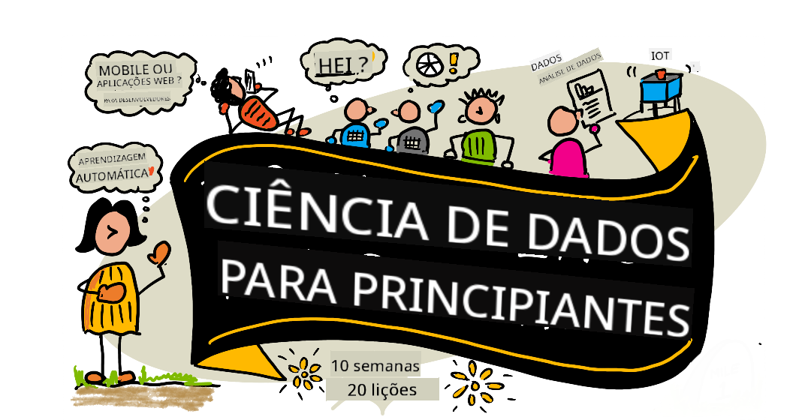

<!--
CO_OP_TRANSLATOR_METADATA:
{
  "original_hash": "7c31d1a22c746b1d0f0582d4f54702ba",
  "translation_date": "2025-12-24T23:21:48+00:00",
  "source_file": "README.md",
  "language_code": "pt"
}
-->
# Ciência de Dados para Iniciantes - Um Currículo

Os Azure Cloud Advocates da Microsoft têm o prazer de oferecer um currículo de 10 semanas, 20 aulas, inteiramente sobre Ciência de Dados. Cada aula inclui questionários pré-aula e pós-aula, instruções escritas para completar a lição, uma solução e um trabalho. A nossa pedagogia baseada em projetos permite que aprendas enquanto constróis, uma forma comprovada de as novas competências "ficarem".

**Um grande obrigado aos nossos autores:** [Jasmine Greenaway](https://www.twitter.com/paladique), [Dmitry Soshnikov](http://soshnikov.com), [Nitya Narasimhan](https://twitter.com/nitya), [Jalen McGee](https://twitter.com/JalenMcG), [Jen Looper](https://twitter.com/jenlooper), [Maud Levy](https://twitter.com/maudstweets), [Tiffany Souterre](https://twitter.com/TiffanySouterre), [Christopher Harrison](https://www.twitter.com/geektrainer).

**🙏 Agradecimentos especiais 🙏 aos nossos autores, revisores e contribuidores de conteúdo do [Microsoft Student Ambassador](https://studentambassadors.microsoft.com/),** nomeadamente Aaryan Arora, [Aditya Garg](https://github.com/AdityaGarg00), [Alondra Sanchez](https://www.linkedin.com/in/alondra-sanchez-molina/), [Ankita Singh](https://www.linkedin.com/in/ankitasingh007), [Anupam Mishra](https://www.linkedin.com/in/anupam--mishra/), [Arpita Das](https://www.linkedin.com/in/arpitadas01/), ChhailBihari Dubey, [Dibri Nsofor](https://www.linkedin.com/in/dibrinsofor), [Dishita Bhasin](https://www.linkedin.com/in/dishita-bhasin-7065281bb), [Majd Safi](https://www.linkedin.com/in/majd-s/), [Max Blum](https://www.linkedin.com/in/max-blum-6036a1186/), [Miguel Correa](https://www.linkedin.com/in/miguelmque/), [Mohamma Iftekher (Iftu) Ebne Jalal](https://twitter.com/iftu119), [Nawrin Tabassum](https://www.linkedin.com/in/nawrin-tabassum), [Raymond Wangsa Putra](https://www.linkedin.com/in/raymond-wp/), [Rohit Yadav](https://www.linkedin.com/in/rty2423), Samridhi Sharma, [Sanya Sinha](https://www.linkedin.com/mwlite/in/sanya-sinha-13aab1200),
[Sheena Narula](https://www.linkedin.com/in/sheena-narua-n/), [Tauqeer Ahmad](https://www.linkedin.com/in/tauqeerahmad5201/), Yogendrasingh Pawar , [Vidushi Gupta](https://www.linkedin.com/in/vidushi-gupta07/), [Jasleen Sondhi](https://www.linkedin.com/in/jasleen-sondhi/)

||
|:---:|
| Ciência de Dados para Iniciantes - _Sketchnote por [@nitya](https://twitter.com/nitya)_ |

### 🌐 Suporte Multilingue

#### Suportado via GitHub Action (Automatizado e Sempre Atualizado)

<!-- CO-OP TRANSLATOR LANGUAGES TABLE START -->
[Árabe](../ar/README.md) | [Bengalês](../bn/README.md) | [Búlgaro](../bg/README.md) | [Birmanês (Myanmar)](../my/README.md) | [Chinês (Simplificado)](../zh/README.md) | [Chinês (Tradicional, Hong Kong)](../hk/README.md) | [Chinês (Tradicional, Macau)](../mo/README.md) | [Chinês (Tradicional, Taiwan)](../tw/README.md) | [Croata](../hr/README.md) | [Checo](../cs/README.md) | [Dinamarquês](../da/README.md) | [Holandês](../nl/README.md) | [Estónio](../et/README.md) | [Finlandês](../fi/README.md) | [Francês](../fr/README.md) | [Alemão](../de/README.md) | [Grego](../el/README.md) | [Hebraico](../he/README.md) | [Hindi](../hi/README.md) | [Húngaro](../hu/README.md) | [Indonésio](../id/README.md) | [Italiano](../it/README.md) | [Japonês](../ja/README.md) | [Canarês](../kn/README.md) | [Coreano](../ko/README.md) | [Lituano](../lt/README.md) | [Malaio](../ms/README.md) | [Malayalam](../ml/README.md) | [Marathi](../mr/README.md) | [Nepalês](../ne/README.md) | [Pidgin Nigeriano](../pcm/README.md) | [Norueguês](../no/README.md) | [Persa (Farsi)](../fa/README.md) | [Polaco](../pl/README.md) | [Português (Brasil)](../br/README.md) | [Português (Portugal)](./README.md) | [Punjabi (Gurmukhi)](../pa/README.md) | [Romeno](../ro/README.md) | [Russo](../ru/README.md) | [Sérvio (Cirílico)](../sr/README.md) | [Eslovaco](../sk/README.md) | [Esloveno](../sl/README.md) | [Espanhol](../es/README.md) | [Suaíli](../sw/README.md) | [Sueco](../sv/README.md) | [Tagalo (Filipino)](../tl/README.md) | [Tamil](../ta/README.md) | [Telugu](../te/README.md) | [Tailandês](../th/README.md) | [Turco](../tr/README.md) | [Ucraniano](../uk/README.md) | [Urdu](../ur/README.md) | [Vietnamita](../vi/README.md)
<!-- CO-OP TRANSLATOR LANGUAGES TABLE END -->

**Se deseja suportar línguas adicionais, as línguas suportadas estão listadas [aqui](https://github.com/Azure/co-op-translator/blob/main/getting_started/supported-languages.md)**

#### Junte-se à Nossa Comunidade 

Temos uma série Discord "Learn with AI" em curso — saiba mais e junte-se a nós em [Learn with AI Series](https://aka.ms/learnwithai/discord) de 18 a 30 de setembro de 2025. Vai receber dicas e truques sobre como usar o GitHub Copilot para Ciência de Dados.

# És estudante?

Comece com os seguintes recursos:

- [Student Hub page](https://docs.microsoft.com/en-gb/learn/student-hub?WT.mc_id=academic-77958-bethanycheum) Nesta página, encontrará recursos para principiantes, pacotes para estudantes e até formas de obter um voucher de certificação gratuito. Esta é uma página que deve adicionar aos favoritos e verificar de tempos a tempos, pois alteramos o conteúdo pelo menos mensalmente.
- [Microsoft Learn Student Ambassadors](https://studentambassadors.microsoft.com?WT.mc_id=academic-77958-bethanycheum) Junte-se a uma comunidade global de embaixadores estudantis; esta pode ser a sua porta de entrada para a Microsoft.

# Começar

## 📚 Documentação

- **[Guia de Instalação](INSTALLATION.md)** - Instruções passo a passo para configurar o ambiente, para principiantes
- **[Guia de Utilização](USAGE.md)** - Exemplos e fluxos de trabalho comuns
- **[Resolução de Problemas](TROUBLESHOOTING.md)** - Soluções para problemas comuns
- **[Guia de Contribuição](CONTRIBUTING.md)** - Como contribuir para este projeto
- **[Para Professores](for-teachers.md)** - Orientações de ensino e recursos para a sala de aula

## 👨‍🎓 Para Estudantes
> **Iniciantes Completos**: Novo em ciência de dados? Comece com os nossos [exemplos para principiantes](examples/README.md)! Estes exemplos simples e bem comentados vão ajudá-lo a entender os fundamentos antes de se aprofundar no currículo completo.
> **[Estudantes](https://aka.ms/student-page)**: para usar este currículo por conta própria, faça um fork de todo o repositório e complete os exercícios sozinho, começando com um questionário pré-aula. Depois leia a aula e complete o resto das atividades. Tente criar os projetos compreendendo as lições em vez de copiar o código da solução; no entanto, esse código está disponível nas pastas /solutions em cada lição orientada a projetos. Outra ideia é formar um grupo de estudo com amigos e percorrer o conteúdo em conjunto. Para estudo adicional, recomendamos o [Microsoft Learn](https://docs.microsoft.com/en-us/users/jenlooper-2911/collections/qprpajyoy3x0g7?WT.mc_id=academic-77958-bethanycheum).

**Início Rápido:**
1. Consulte o [Guia de Instalação](INSTALLATION.md) para configurar o seu ambiente
2. Revise o [Guia de Utilização](USAGE.md) para aprender a trabalhar com o currículo
3. Comece com a Aula 1 e trabalhe sequencialmente
4. Junte-se à nossa [comunidade no Discord](https://aka.ms/ds4beginners/discord) para obter apoio

## 👩‍🏫 Para Professores

> **Professores**: incluímos algumas sugestões em [Para Professores](for-teachers.md) sobre como usar este currículo. Adoraríamos o seu feedback [no nosso fórum de discussão](https://github.com/microsoft/Data-Science-For-Beginners/discussions)!

## Conheça a Equipa

**Gif por** [Mohit Jaisal](https://www.linkedin.com/in/mohitjaisal)
> 🎥 Clique na imagem acima para ver um vídeo sobre o projeto  e as pessoas que o criaram!

## Pedagogia

Escolhemos dois princípios pedagógicos ao construir este currículo: garantir que seja baseado em projetos e que inclua questionários frequentes. No final desta série, os alunos terão aprendido princípios básicos de ciência de dados, incluindo conceitos éticos, preparação de dados, diferentes formas de trabalhar com dados, visualização de dados, análise de dados, casos de uso reais de ciência de dados e mais.

Além disso, um questionário de baixo risco antes de uma lição define a intenção do aluno em aprender um tópico, enquanto um segundo questionário após a aula garante uma retenção adicional. Este currículo foi desenhado para ser flexível e divertido e pode ser seguido na íntegra ou em parte. Os projetos começam pequenos e tornam-se progressivamente mais complexos até ao final do ciclo de 10 semanas.

> Encontre o nosso [Código de Conduta](CODE_OF_CONDUCT.md), [Contribuir](CONTRIBUTING.md),  [Tradução](TRANSLATIONS.md) diretrizes. Agradecemos o seu feedback construtivo!

## Cada lição inclui:

- Sketchnote opcional
- Vídeo suplementar opcional
- Questionário de aquecimento antes da lição
- Lição escrita
- Para lições baseadas em projetos, guias passo a passo sobre como construir o projeto
- Verificações de conhecimento
- Um desafio
- Leitura suplementar
- Tarefa
- [Questionário pós-lição](https://ff-quizzes.netlify.app/en/)

> **Uma nota sobre questionários**: Todos os questionários estão contidos na pasta Quiz-App, num total de 40 questionários de três perguntas cada. Eles estão ligados a partir das lições, mas a aplicação de questionários pode ser executada localmente ou implantada no Azure; siga as instruções na pasta `quiz-app`. Estão a ser gradualmente localizados.

## 🎓 Exemplos para Iniciantes

**Novo em Ciência de Dados?** Criámos um [diretório de exemplos](examples/README.md) especial com código simples e bem comentado para o ajudar a começar:

- 🌟 **Olá Mundo** - O seu primeiro programa de ciência de dados
- 📂 **Carregar Dados** - Aprenda a ler e explorar conjuntos de dados
- 📊 **Análise Simples** - Calcule estatísticas e encontre padrões
- 📈 **Visualização Básica** - Crie gráficos e diagramas
- 🔬 **Projeto do Mundo Real** - Fluxo de trabalho completo do início ao fim

Cada exemplo inclui comentários detalhados que explicam cada passo, tornando-o perfeito para iniciantes absolutos!

👉 **[Comece com os exemplos](examples/README.md)** 👈

## Lições

||
|:---:|
| Ciência de Dados para Iniciantes: Roteiro - _Sketchnote por [@nitya](https://twitter.com/nitya)_ |

| Número da lição | Tema | Agrupamento de lições | Objetivos de aprendizagem | Lição ligada | Autor |
| :-----------: | :----------------------------------------: | :--------------------------------------------------: | :-----------------------------------------------------------------------------------------------------------------------------------------------------------------------: | :---------------------------------------------------------------------: | :----: |
| 01 | Definição de Ciência de Dados | [Introdução](1-Introduction/README.md) | Aprenda os conceitos básicos por detrás da ciência de dados e como ela se relaciona com inteligência artificial, aprendizagem automática e big data. | [lição](1-Introduction/01-defining-data-science/README.md) [vídeo](https://youtu.be/beZ7Mb_oz9I) | [Dmitry](http://soshnikov.com) |
| 02 | Ética na Ciência de Dados | [Introdução](1-Introduction/README.md) | Conceitos, desafios e estruturas de ética de dados. | [lição](1-Introduction/02-ethics/README.md) | [Nitya](https://twitter.com/nitya) |
| 03 | Definição de Dados | [Introdução](1-Introduction/README.md) | Como os dados são classificados e as suas fontes comuns. | [lição](1-Introduction/03-defining-data/README.md) | [Jasmine](https://www.twitter.com/paladique) |
| 04 | Introdução à Estatística e Probabilidade | [Introdução](1-Introduction/README.md) | As técnicas matemáticas de probabilidade e estatística para compreender dados. | [lição](1-Introduction/04-stats-and-probability/README.md) [vídeo](https://youtu.be/Z5Zy85g4Yjw) | [Dmitry](http://soshnikov.com) |
| 05 | Trabalhar com Dados Relacionais | [Trabalhar com Dados](2-Working-With-Data/README.md) | Introdução aos dados relacionais e aos fundamentos de explorar e analisar dados relacionais com a Structured Query Language, também conhecida como SQL (pronunciada “see-quell”). | [lição](2-Working-With-Data/05-relational-databases/README.md) | [Christopher](https://www.twitter.com/geektrainer) | | |
| 06 | Trabalhar com Dados NoSQL | [Trabalhar com Dados](2-Working-With-Data/README.md) | Introdução aos dados não relacionais, aos seus vários tipos e aos fundamentos de exploração e análise de bases de dados de documentos. | [lição](2-Working-With-Data/06-non-relational/README.md) | [Jasmine](https://twitter.com/paladique)|
| 07 | Trabalhar com Python | [Trabalhar com Dados](2-Working-With-Data/README.md) | Noções básicas de uso do Python para exploração de dados com bibliotecas como o Pandas. Recomenda-se uma compreensão fundamental da programação em Python. | [lição](2-Working-With-Data/07-python/README.md) [vídeo](https://youtu.be/dZjWOGbsN4Y) | [Dmitry](http://soshnikov.com) |
| 08 | Preparação de Dados | [Trabalhar com Dados](2-Working-With-Data/README.md) | Tópicos sobre técnicas de dados para limpar e transformar os dados para lidar com desafios de dados em falta, imprecisos ou incompletos. | [lição](2-Working-With-Data/08-data-preparation/README.md) | [Jasmine](https://www.twitter.com/paladique) |
| 09 | Visualizar Quantidades | [Data Visualization](3-Data-Visualization/README.md) | Aprenda a usar o Matplotlib para visualizar dados de aves 🦆 | [lição](3-Data-Visualization/09-visualization-quantities/README.md) | [Jen](https://twitter.com/jenlooper) |
| 10 | Visualizar Distribuições de Dados | [Data Visualization](3-Data-Visualization/README.md) | Visualizar observações e tendências dentro de um intervalo. | [lição](3-Data-Visualization/10-visualization-distributions/README.md) | [Jen](https://twitter.com/jenlooper) |
| 11 | Visualizar Proporções | [Data Visualization](3-Data-Visualization/README.md) | Visualizar percentagens discretas e agrupadas. | [lição](3-Data-Visualization/11-visualization-proportions/README.md) | [Jen](https://twitter.com/jenlooper) |
| 12 | Visualizar Relações | [Data Visualization](3-Data-Visualization/README.md) | Visualizar ligações e correlações entre conjuntos de dados e as suas variáveis. | [lição](3-Data-Visualization/12-visualization-relationships/README.md) | [Jen](https://twitter.com/jenlooper) |
| 13 | Visualizações Significativas | [Data Visualization](3-Data-Visualization/README.md) | Técnicas e orientação para tornar as suas visualizações valiosas para resolução eficaz de problemas e obtenção de insights. | [lição](3-Data-Visualization/13-meaningful-visualizations/README.md) | [Jen](https://twitter.com/jenlooper) |
| 14 | Introdução ao ciclo de vida da ciência de dados | [Lifecycle](4-Data-Science-Lifecycle/README.md) | Introdução ao ciclo de vida da ciência de dados e ao seu primeiro passo de aquisição e extração de dados. | [lição](4-Data-Science-Lifecycle/14-Introduction/README.md) | [Jasmine](https://twitter.com/paladique) |
| 15 | Analisar | [Lifecycle](4-Data-Science-Lifecycle/README.md) | Esta fase do ciclo de vida da ciência de dados foca-se em técnicas para analisar dados. | [lição](4-Data-Science-Lifecycle/15-analyzing/README.md) | [Jasmine](https://twitter.com/paladique) | | |
| 16 | Comunicação | [Lifecycle](4-Data-Science-Lifecycle/README.md) | Esta fase do ciclo de vida da ciência de dados foca-se em apresentar os insights dos dados de uma forma que facilite a compreensão por parte dos decisores. | [lição](4-Data-Science-Lifecycle/16-communication/README.md) | [Jalen](https://twitter.com/JalenMcG) | | |
| 17 | Ciência de Dados na Nuvem | [Cloud Data](5-Data-Science-In-Cloud/README.md) | Esta série de lições introduz a ciência de dados na nuvem e os seus benefícios. | [lição](5-Data-Science-In-Cloud/17-Introduction/README.md) | [Tiffany](https://twitter.com/TiffanySouterre) and [Maud](https://twitter.com/maudstweets) |
| 18 | Ciência de Dados na Nuvem | [Cloud Data](5-Data-Science-In-Cloud/README.md) | Treinar modelos usando ferramentas Low Code. |[lição](5-Data-Science-In-Cloud/18-Low-Code/README.md) | [Tiffany](https://twitter.com/TiffanySouterre) and [Maud](https://twitter.com/maudstweets) |
| 19 | Ciência de Dados na Nuvem | [Cloud Data](5-Data-Science-In-Cloud/README.md) | Implantar modelos com o Azure Machine Learning Studio. | [lição](5-Data-Science-In-Cloud/19-Azure/README.md)| [Tiffany](https://twitter.com/TiffanySouterre) and [Maud](https://twitter.com/maudstweets) |
| 20 | Ciência de Dados no Mundo Real | [In the Wild](6-Data-Science-In-Wild/README.md) | Projetos impulsionados por ciência de dados no mundo real. | [lição](6-Data-Science-In-Wild/20-Real-World-Examples/README.md) | [Nitya](https://twitter.com/nitya) |

## GitHub Codespaces

Siga estes passos para abrir este exemplo num Codespace:
1. Clique no menu pendente Code e selecione a opção Open with Codespaces.
2. Selecione + New codespace na parte inferior do painel.
Para mais informações, consulte a [documentação do GitHub](https://docs.github.com/en/codespaces/developing-in-codespaces/creating-a-codespace-for-a-repository#creating-a-codespace).

## VSCode Remote - Containers
Siga estes passos para abrir este repositório num contentor usando a sua máquina local e o VSCode com a extensão VS Code Remote - Containers:

1. Se é a primeira vez que usa um contentor de desenvolvimento, certifique-se de que o seu sistema cumpre os pré-requisitos (p.ex. ter o Docker instalado) na [documentação de arranque](https://code.visualstudio.com/docs/devcontainers/containers#_getting-started).

Para usar este repositório, pode abrir o repositório num volume Docker isolado:

**Nota**: Por baixo do capô, isto utilizará o comando Remote-Containers: **Clone Repository in Container Volume...** para clonar o código-fonte num volume Docker em vez do sistema de ficheiros local. [Volumes](https://docs.docker.com/storage/volumes/) são o mecanismo preferido para persistir dados de contentor.

Ou abra uma cópia do repositório clonada localmente ou descarregada:

- Clone este repositório para o seu sistema de ficheiros local.
- Prima F1 e selecione o comando **Remote-Containers: Open Folder in Container...**.
- Selecione a cópia clonada desta pasta, aguarde que o contentor inicie, e experimente.

## Acesso offline

Pode executar esta documentação offline usando o [Docsify](https://docsify.js.org/#/). Faça um fork deste repositório, [instale o Docsify](https://docsify.js.org/#/quickstart) na sua máquina local,  então na pasta raiz deste repositório, escreva `docsify serve`. O website será servido na porta 3000 no seu localhost: `localhost:3000`.

> Nota, os notebooks não serão renderizados via Docsify, por isso quando precisar de executar um notebook, faça-o separadamente no VS Code a correr um kernel Python.

## Outros Currículos

A nossa equipa produz outros currículos! Confira:

<!-- CO-OP TRANSLATOR OTHER COURSES START -->
### LangChain

---

### Azure / Edge / MCP / Agents

---
 
### Série IA Generativa

[-9333EA?style=for-the-badge&labelColor=E5E7EB&color=9333EA)](https://github.com/microsoft/Generative-AI-for-beginners-dotnet?WT.mc_id=academic-105485-koreyst)
[-C084FC?style=for-the-badge&labelColor=E5E7EB&color=C084FC)](https://github.com/microsoft/generative-ai-for-beginners-java?WT.mc_id=academic-105485-koreyst)
[-E879F9?style=for-the-badge&labelColor=E5E7EB&color=E879F9)](https://github.com/microsoft/generative-ai-with-javascript?WT.mc_id=academic-105485-koreyst)

---
 
### Aprendizagem Essencial

---
 
### Série Copilot

<!-- CO-OP TRANSLATOR OTHER COURSES END -->

## Obter Ajuda

**Está a ter problemas?** Consulte o nosso [Guia de Resolução de Problemas](TROUBLESHOOTING.md) para soluções para problemas comuns.

Se ficar bloqueado ou tiver alguma dúvida sobre a criação de aplicações de IA. Junte-se a outros aprendizes e a desenvolvedores experientes nas discussões sobre MCP. É uma comunidade de apoio onde as perguntas são bem-vindas e o conhecimento é partilhado livremente.

Se tiver comentários sobre o produto ou encontrar erros durante o desenvolvimento, visite:

---

<!-- CO-OP TRANSLATOR DISCLAIMER START -->
**Aviso legal**:
Este documento foi traduzido utilizando o serviço de tradução automática por IA [Co-op Translator](https://github.com/Azure/co-op-translator). Embora nos esforcemos pela precisão, tenha em atenção que traduções automáticas podem conter erros ou imprecisões. O documento original, na sua língua original, deve ser considerado a fonte fidedigna. Para informações críticas, recomenda-se uma tradução profissional efetuada por tradutores humanos. Não nos responsabilizamos por quaisquer mal-entendidos ou interpretações incorretas decorrentes do uso desta tradução.
<!-- CO-OP TRANSLATOR DISCLAIMER END -->