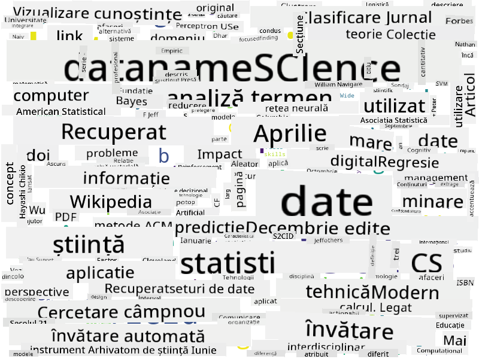

<!--
CO_OP_TRANSLATOR_METADATA:
{
  "original_hash": "8141e7195841682914be03ef930fe43d",
  "translation_date": "2025-09-03T20:29:12+00:00",
  "source_file": "1-Introduction/01-defining-data-science/README.md",
  "language_code": "ro"
}
-->
## Tipuri de Date

Așa cum am menționat deja, datele sunt peste tot. Trebuie doar să le captăm în mod corespunzător! Este util să facem diferența între datele **structurate** și **nestructurate**. Primele sunt de obicei reprezentate într-o formă bine organizată, adesea sub formă de tabel sau mai multe tabele, în timp ce celelalte sunt doar o colecție de fișiere. Uneori putem vorbi și despre date **semi-structurate**, care au un anumit tip de structură ce poate varia semnificativ.

| Structurate                                                                  | Semi-structurate                                                                               | Nestructurate                          |
| --------------------------------------------------------------------------- | --------------------------------------------------------------------------------------------- | -------------------------------------- |
| Lista persoanelor cu numerele lor de telefon                                 | Pagini Wikipedia cu linkuri                                                                   | Textul Enciclopediei Britannica        |
| Temperatura din toate camerele unei clădiri la fiecare minut din ultimii 20 de ani | Colecția de lucrări științifice în format JSON cu autori, data publicării și rezumat          | Fișiere corporative într-un folder     |
| Date despre vârsta și genul tuturor persoanelor care intră în clădire        | Pagini de internet                                                                            | Flux video brut de la o cameră de supraveghere |

## De unde să obții Date

Există multe surse posibile de date, și ar fi imposibil să le enumerăm pe toate! Totuși, să menționăm câteva dintre locurile tipice de unde poți obține date:

* **Structurate**
  - **Internet of Things** (IoT), inclusiv date de la diferiți senzori, cum ar fi senzori de temperatură sau presiune, oferă multe date utile. De exemplu, dacă o clădire de birouri este echipată cu senzori IoT, putem controla automat încălzirea și iluminarea pentru a minimiza costurile.
  - **Chestionare** pe care le cerem utilizatorilor să le completeze după o achiziție sau după vizitarea unui site web.
  - **Analiza comportamentului** poate, de exemplu, să ne ajute să înțelegem cât de profund explorează un utilizator un site și care este motivul tipic pentru părăsirea acestuia.
* **Nestructurate**
  - **Texte** pot fi o sursă bogată de informații, cum ar fi un scor general de **sentiment** sau extragerea de cuvinte-cheie și semnificații semantice.
  - **Imagini** sau **Video**. Un videoclip de la o cameră de supraveghere poate fi utilizat pentru a estima traficul pe drum și pentru a informa oamenii despre posibilele ambuteiaje.
  - **Loguri** de server web pot fi utilizate pentru a înțelege care pagini ale site-ului nostru sunt cele mai vizitate și pentru cât timp.
* **Semi-structurate**
  - Graficele de **Rețele Sociale** pot fi surse excelente de date despre personalitatea utilizatorilor și eficiența lor potențială în răspândirea informațiilor.
  - Când avem o mulțime de fotografii de la o petrecere, putem încerca să extragem date despre **Dinamica Grupului** construind un grafic al persoanelor care fac poze împreună.

Prin cunoașterea diferitelor surse posibile de date, poți încerca să te gândești la diverse scenarii în care tehnicile de știința datelor pot fi aplicate pentru a înțelege mai bine situația și pentru a îmbunătăți procesele de afaceri.

## Ce poți face cu Datele

În știința datelor, ne concentrăm pe următorii pași ai parcursului datelor:

Desigur, în funcție de datele reale, unii pași pot lipsi (de exemplu, atunci când avem deja datele în baza de date sau când nu este necesar să antrenăm un model), sau unii pași pot fi repetați de mai multe ori (cum ar fi procesarea datelor).

## Digitalizare și Transformare Digitală

În ultimul deceniu, multe afaceri au început să înțeleagă importanța datelor în luarea deciziilor de afaceri. Pentru a aplica principiile științei datelor în gestionarea unei afaceri, este necesar mai întâi să colectăm date, adică să traducem procesele de afaceri în formă digitală. Acest proces este cunoscut sub numele de **digitalizare**. Aplicarea tehnicilor de știința datelor asupra acestor date pentru a ghida deciziile poate duce la creșteri semnificative ale productivității (sau chiar la o schimbare majoră a afacerii), numită **transformare digitală**.

Să luăm un exemplu. Să presupunem că avem un curs de știința datelor (precum acesta) pe care îl livrăm online studenților și dorim să folosim știința datelor pentru a-l îmbunătăți. Cum putem face acest lucru?

Putem începe prin a ne întreba „Ce poate fi digitalizat?” Cea mai simplă metodă ar fi să măsurăm timpul necesar fiecărui student pentru a finaliza fiecare modul și să evaluăm cunoștințele obținute printr-un test cu variante multiple la sfârșitul fiecărui modul. Prin calcularea mediei timpului de finalizare pentru toți studenții, putem identifica modulele care cauzează cele mai mari dificultăți și să lucrăm la simplificarea lor.
> Ai putea argumenta că această abordare nu este ideală, deoarece modulele pot avea lungimi diferite. Probabil ar fi mai corect să împarți timpul la lungimea modulului (în număr de caractere) și să compari acele valori în schimb.
Când începem să analizăm rezultatele testelor cu răspunsuri multiple, putem încerca să determinăm care sunt conceptele pe care elevii le înțeleg cu dificultate și să folosim aceste informații pentru a îmbunătăți conținutul. Pentru a face acest lucru, trebuie să proiectăm testele astfel încât fiecare întrebare să fie asociată cu un anumit concept sau fragment de cunoștințe.

Dacă dorim să mergem și mai departe, putem analiza timpul necesar pentru fiecare modul în funcție de categoria de vârstă a elevilor. Am putea descoperi că, pentru anumite categorii de vârstă, finalizarea modulului durează prea mult sau că elevii renunță înainte de a-l termina. Acest lucru ne poate ajuta să oferim recomandări de vârstă pentru modul și să reducem nemulțumirea oamenilor cauzată de așteptări greșite.

## 🚀 Provocare

În această provocare, vom încerca să identificăm concepte relevante pentru domeniul Data Science analizând texte. Vom lua un articol de pe Wikipedia despre Data Science, vom descărca și procesa textul, apoi vom construi un nor de cuvinte asemănător cu acesta:

Vizitați [`notebook.ipynb`](../../../../../../../../../1-Introduction/01-defining-data-science/notebook.ipynb ':ignore') pentru a parcurge codul. Puteți, de asemenea, să rulați codul și să vedeți cum efectuează toate transformările de date în timp real.

> Dacă nu știți cum să rulați codul într-un Jupyter Notebook, consultați [acest articol](https://soshnikov.com/education/how-to-execute-notebooks-from-github/).

## [Quiz post-lectură](https://ff-quizzes.netlify.app/en/ds/)

## Sarcini

* **Sarcina 1**: Modificați codul de mai sus pentru a identifica concepte relevante pentru domeniile **Big Data** și **Machine Learning**.
* **Sarcina 2**: [Gândiți-vă la scenarii din Data Science](assignment.md)

## Credite

Această lecție a fost creată cu ♥️ de [Dmitry Soshnikov](http://soshnikov.com)

---

**Declinare de responsabilitate**:  
Acest document a fost tradus folosind serviciul de traducere AI [Co-op Translator](https://github.com/Azure/co-op-translator). Deși ne străduim să asigurăm acuratețea, vă rugăm să fiți conștienți că traducerile automate pot conține erori sau inexactități. Documentul original în limba sa natală ar trebui considerat sursa autoritară. Pentru informații critice, se recomandă traducerea profesională realizată de un specialist uman. Nu ne asumăm responsabilitatea pentru eventualele neînțelegeri sau interpretări greșite care pot apărea din utilizarea acestei traduceri.