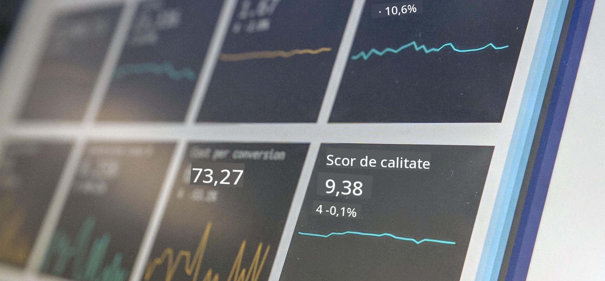

<!--
CO_OP_TRANSLATOR_METADATA:
{
  "original_hash": "696a8474a01054281704cbfb09148949",
  "translation_date": "2025-08-26T15:00:05+00:00",
  "source_file": "1-Introduction/README.md",
  "language_code": "ro"
}
-->
# Introducere în Știința Datelor

> Fotografie de <a href="https://unsplash.com/@dawson2406?utm_source=unsplash&utm_medium=referral&utm_content=creditCopyText">Stephen Dawson</a> pe <a href="https://unsplash.com/s/photos/data?utm_source=unsplash&utm_medium=referral&utm_content=creditCopyText">Unsplash</a>
  
În aceste lecții, vei descoperi cum este definită Știința Datelor și vei învăța despre considerațiile etice pe care trebuie să le ia în calcul un specialist în date. De asemenea, vei învăța cum sunt definite datele și vei afla câte ceva despre statistică și probabilitate, domeniile academice de bază ale Științei Datelor.

### Subiecte

1. [Definirea Științei Datelor](01-defining-data-science/README.md)
2. [Etica în Știința Datelor](02-ethics/README.md)
3. [Definirea Datelor](03-defining-data/README.md)
4. [Introducere în Statistică și Probabilitate](04-stats-and-probability/README.md)

### Credite

Aceste lecții au fost scrise cu ❤️ de [Nitya Narasimhan](https://twitter.com/nitya) și [Dmitry Soshnikov](https://twitter.com/shwars).

---

**Declinare de responsabilitate**:  
Acest document a fost tradus folosind serviciul de traducere AI [Co-op Translator](https://github.com/Azure/co-op-translator). Deși ne străduim să asigurăm acuratețea, vă rugăm să fiți conștienți că traducerile automate pot conține erori sau inexactități. Documentul original în limba sa natală ar trebui considerat sursa autoritară. Pentru informații critice, se recomandă traducerea profesională realizată de oameni. Nu ne asumăm responsabilitatea pentru eventualele neînțelegeri sau interpretări greșite care pot apărea din utilizarea acestei traduceri.