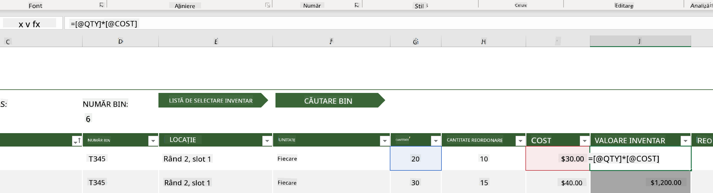
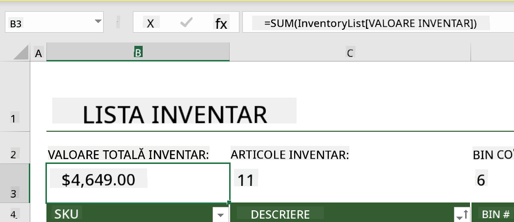
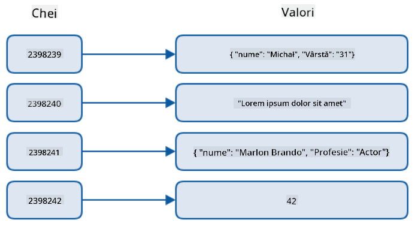
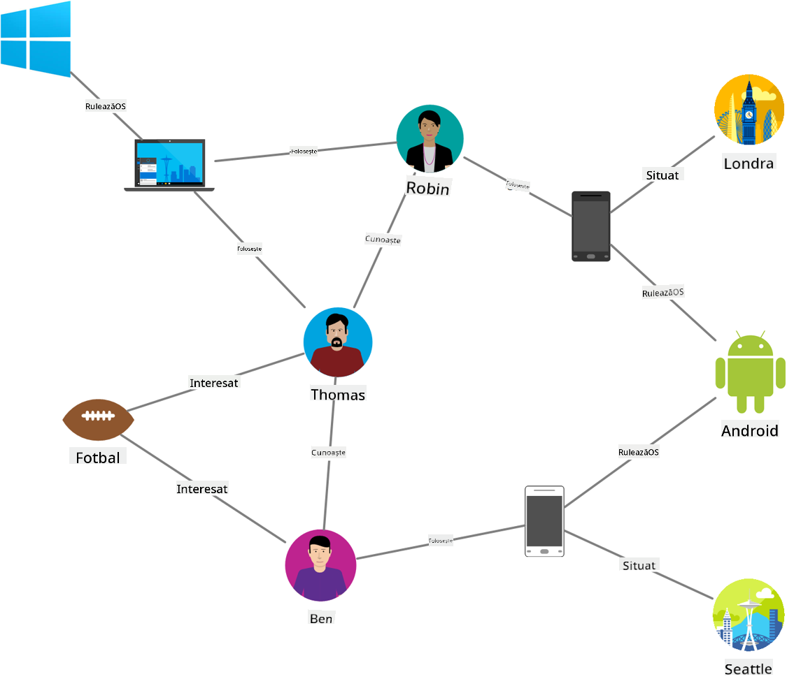
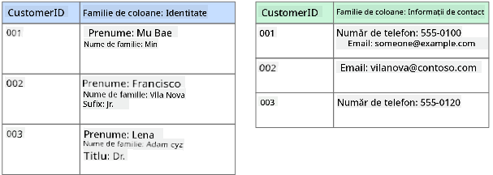
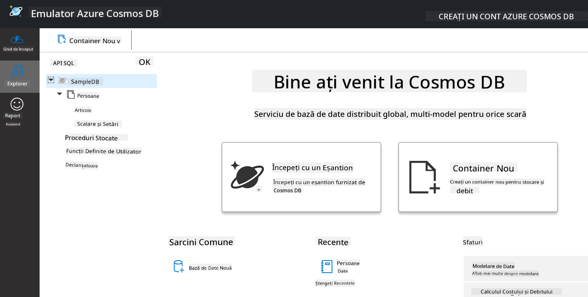
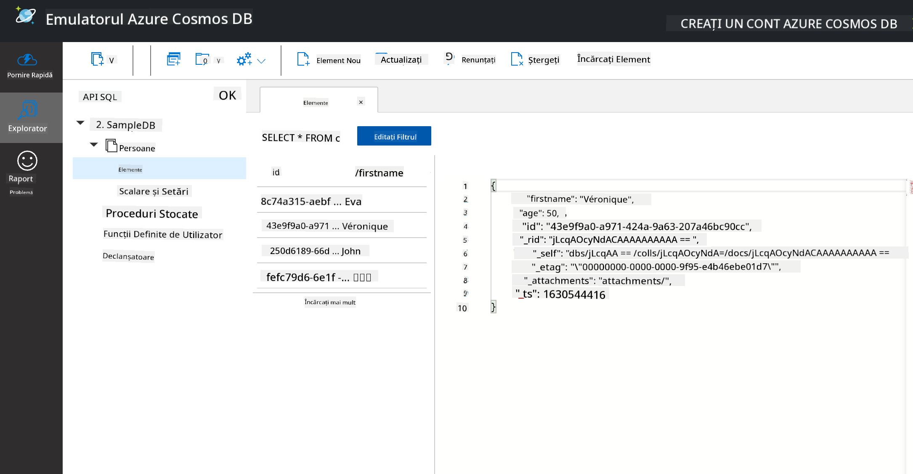
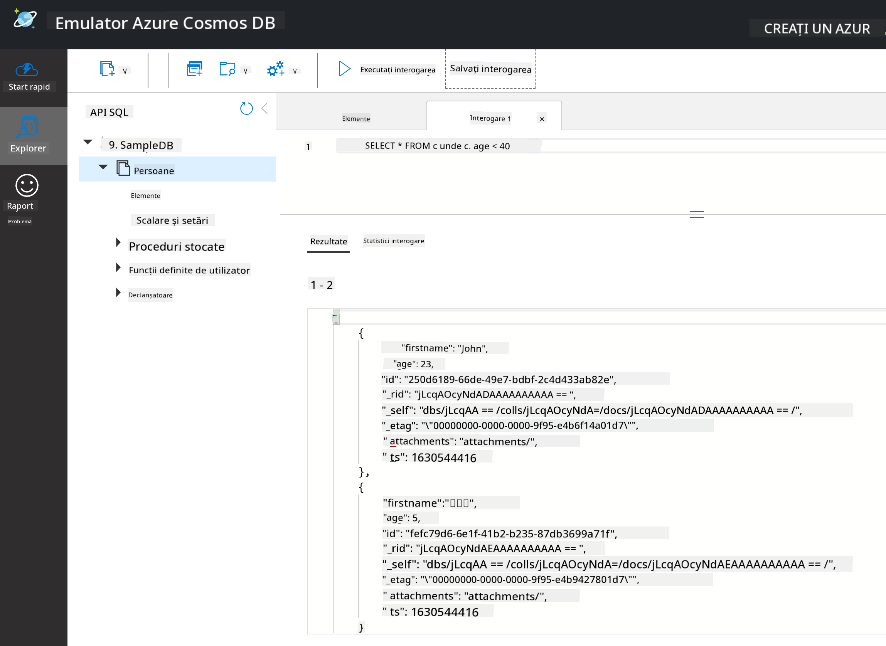

<!--
CO_OP_TRANSLATOR_METADATA:
{
  "original_hash": "32ddfef8121650f2ca2f3416fd283c37",
  "translation_date": "2025-08-26T14:55:31+00:00",
  "source_file": "2-Working-With-Data/06-non-relational/README.md",
  "language_code": "ro"
}
-->
# Lucrul cu Date: Date Non-Relationale

| ](../../sketchnotes/06-NoSQL.png)|
|:---:|
|Lucrul cu Date NoSQL - _Sketchnote de [@nitya](https://twitter.com/nitya)_ |

## [Chestionar Pre-Lecție](https://purple-hill-04aebfb03.1.azurestaticapps.net/quiz/10)

Datele nu sunt limitate la bazele de date relaționale. Această lecție se concentrează pe datele non-relaționale și va acoperi elementele de bază ale foilor de calcul și NoSQL.

## Foi de calcul

Foi de calcul sunt o metodă populară de stocare și explorare a datelor, deoarece necesită mai puțin efort pentru configurare și utilizare. În această lecție vei învăța componentele de bază ale unei foi de calcul, precum și formulele și funcțiile. Exemplele vor fi ilustrate cu Microsoft Excel, dar majoritatea părților și subiectelor vor avea denumiri și pași similari în comparație cu alte programe de foi de calcul.


O foaie de calcul este un fișier și va fi accesibil în sistemul de fișiere al unui computer, dispozitiv sau sistem de fișiere bazat pe cloud. Software-ul în sine poate fi bazat pe browser sau o aplicație care trebuie instalată pe un computer sau descărcată ca aplicație. În Excel, aceste fișiere sunt definite și ca **workbooks** (caiete de lucru), iar această terminologie va fi utilizată pe parcursul lecției.

Un caiet de lucru conține una sau mai multe **worksheets** (foi de lucru), fiecare fiind etichetată prin taburi. În cadrul unei foi de lucru se află dreptunghiuri numite **cells** (celule), care conțin datele propriu-zise. O celulă este intersecția dintre un rând și o coloană, unde coloanele sunt etichetate cu caractere alfabetice, iar rândurile sunt etichetate numeric. Unele foi de calcul vor conține anteturi în primele câteva rânduri pentru a descrie datele dintr-o celulă.

Cu aceste elemente de bază ale unui caiet de lucru Excel, vom folosi un exemplu din [Microsoft Templates](https://templates.office.com/) axat pe un inventar pentru a parcurge câteva părți suplimentare ale unei foi de calcul.

### Gestionarea unui Inventar

Fișierul de foaie de calcul numit "InventoryExample" este o foaie de calcul formatată cu articole dintr-un inventar care conține trei foi de lucru, unde taburile sunt etichetate "Inventory List", "Inventory Pick List" și "Bin Lookup". Rândul 4 din foaia de lucru Inventory List este antetul, care descrie valoarea fiecărei celule din coloana antetului.



Există cazuri în care o celulă depinde de valorile altor celule pentru a genera valoarea sa. Foaia de calcul Inventory List urmărește costul fiecărui articol din inventar, dar ce se întâmplă dacă trebuie să știm valoarea totală a inventarului? [**Formulele**](https://support.microsoft.com/en-us/office/overview-of-formulas-34519a4e-1e8d-4f4b-84d4-d642c4f63263) efectuează acțiuni asupra datelor din celule și sunt utilizate pentru a calcula costul inventarului în acest exemplu. Această foaie de calcul folosește o formulă în coloana Inventory Value pentru a calcula valoarea fiecărui articol prin înmulțirea cantității sub antetul QTY și costurile sub antetul COST. Dublu clic sau evidențierea unei celule va afișa formula. Vei observa că formulele încep cu un semn egal, urmat de calculul sau operația.



Putem folosi o altă formulă pentru a aduna toate valorile din Inventory Value pentru a obține valoarea totală. Acest lucru ar putea fi calculat prin adăugarea fiecărei celule pentru a genera suma, dar aceasta poate fi o sarcină obositoare. Excel are [**funcții**](https://support.microsoft.com/en-us/office/sum-function-043e1c7d-7726-4e80-8f32-07b23e057f89), sau formule predefinite pentru a efectua calcule asupra valorilor celulelor. Funcțiile necesită argumente, care sunt valorile necesare pentru a efectua aceste calcule. Când funcțiile necesită mai mult de un argument, acestea trebuie listate într-o anumită ordine sau funcția poate să nu calculeze valoarea corectă. Acest exemplu folosește funcția SUM și utilizează valorile din Inventory Value ca argument pentru a genera totalul listat sub rândul 3, coloana B (denumită și B3).

## NoSQL

NoSQL este un termen umbrelă pentru diferitele moduri de stocare a datelor non-relaționale și poate fi interpretat ca "non-SQL", "non-relațional" sau "nu doar SQL". Aceste tipuri de sisteme de baze de date pot fi clasificate în 4 tipuri.


> Sursa de la [Blogul Michał Białecki](https://www.michalbialecki.com/2018/03/18/azure-cosmos-db-key-value-database-cloud/)

[Key-value](https://docs.microsoft.com/en-us/azure/architecture/data-guide/big-data/non-relational-data#keyvalue-data-stores) baze de date asociază chei unice, care sunt identificatori unici asociați cu o valoare. Aceste perechi sunt stocate folosind o [hash table](https://www.hackerearth.com/practice/data-structures/hash-tables/basics-of-hash-tables/tutorial/) cu o funcție de hashing adecvată.


> Sursa de la [Microsoft](https://docs.microsoft.com/en-us/azure/cosmos-db/graph/graph-introduction#graph-database-by-example)

[Graph](https://docs.microsoft.com/en-us/azure/architecture/data-guide/big-data/non-relational-data#graph-data-stores) baze de date descriu relațiile în date și sunt reprezentate ca o colecție de noduri și muchii. Un nod reprezintă o entitate, ceva care există în lumea reală, cum ar fi un student sau un extras bancar. Muchiile reprezintă relația dintre două entități. Fiecare nod și muchie au proprietăți care oferă informații suplimentare despre fiecare nod și muchie.



[Columnar](https://docs.microsoft.com/en-us/azure/architecture/data-guide/big-data/non-relational-data#columnar-data-stores) magazine de date organizează datele în coloane și rânduri, similar unei structuri de date relaționale, dar fiecare coloană este împărțită în grupuri numite familie de coloane, unde toate datele sub o coloană sunt legate și pot fi recuperate și modificate într-o singură unitate.

### Magazine de Date Document cu Azure Cosmos DB

[Document](https://docs.microsoft.com/en-us/azure/architecture/data-guide/big-data/non-relational-data#document-data-stores) magazine de date se bazează pe conceptul unui magazin de date key-value și este format dintr-o serie de câmpuri și obiecte. Această secțiune va explora bazele de date document cu emulatorul Cosmos DB.

O bază de date Cosmos DB se potrivește definiției "Nu doar SQL", unde baza de date document Cosmos DB se bazează pe SQL pentru a interoga datele. [Lecția anterioară](../05-relational-databases/README.md) despre SQL acoperă elementele de bază ale limbajului, și vom putea aplica unele dintre aceleași interogări la o bază de date document aici. Vom folosi emulatorul Cosmos DB, care ne permite să creăm și să explorăm o bază de date document local pe un computer. Citește mai multe despre Emulator [aici](https://docs.microsoft.com/en-us/azure/cosmos-db/local-emulator?tabs=ssl-netstd21).

Un document este o colecție de câmpuri și valori de obiecte, unde câmpurile descriu ce reprezintă valoarea obiectului. Mai jos este un exemplu de document.

```json
{
    "firstname": "Eva",
    "age": 44,
    "id": "8c74a315-aebf-4a16-bb38-2430a9896ce5",
    "_rid": "bHwDAPQz8s0BAAAAAAAAAA==",
    "_self": "dbs/bHwDAA==/colls/bHwDAPQz8s0=/docs/bHwDAPQz8s0BAAAAAAAAAA==/",
    "_etag": "\"00000000-0000-0000-9f95-010a691e01d7\"",
    "_attachments": "attachments/",
    "_ts": 1630544034
}
```

Câmpurile de interes în acest document sunt: `firstname`, `id`, și `age`. Restul câmpurilor cu liniuțe de subliniere au fost generate de Cosmos DB.

#### Explorarea Datelor cu Emulatorul Cosmos DB

Poți descărca și instala emulatorul [pentru Windows aici](https://aka.ms/cosmosdb-emulator). Consultă această [documentație](https://docs.microsoft.com/en-us/azure/cosmos-db/local-emulator?tabs=ssl-netstd21#run-on-linux-macos) pentru opțiuni despre cum să rulezi Emulatorul pe macOS și Linux.

Emulatorul lansează o fereastră de browser, unde vizualizarea Explorer îți permite să explorezi documentele.



Dacă urmezi pașii, fă clic pe "Start with Sample" pentru a genera o bază de date de exemplu numită SampleDB. Dacă extinzi Sample DB făcând clic pe săgeată, vei găsi un container numit `Persons`. Un container conține o colecție de articole, care sunt documentele din container. Poți explora cele patru documente individuale sub `Items`.



#### Interogarea Datelor Document cu Emulatorul Cosmos DB

Putem, de asemenea, interoga datele de exemplu făcând clic pe butonul nou SQL Query (al doilea buton din stânga).

`SELECT * FROM c` returnează toate documentele din container. Să adăugăm o clauză where și să găsim toți cei mai tineri de 40 de ani.

`SELECT * FROM c where c.age < 40`



Interogarea returnează două documente, observă valoarea age pentru fiecare document este mai mică de 40.

#### JSON și Documente

Dacă ești familiarizat cu JavaScript Object Notation (JSON), vei observa că documentele arată similar cu JSON. Există un fișier `PersonsData.json` în acest director cu mai multe date pe care le poți încărca în containerul Persons din Emulator prin butonul `Upload Item`.

În majoritatea cazurilor, API-urile care returnează date JSON pot fi transferate direct și stocate în bazele de date document. Mai jos este un alt document, acesta reprezintă tweet-uri de pe contul de Twitter Microsoft care au fost recuperate folosind API-ul Twitter, apoi inserate în Cosmos DB.

```json
{
    "created_at": "2021-08-31T19:03:01.000Z",
    "id": "1432780985872142341",
    "text": "Blank slate. Like this tweet if you’ve ever painted in Microsoft Paint before. https://t.co/cFeEs8eOPK",
    "_rid": "dhAmAIUsA4oHAAAAAAAAAA==",
    "_self": "dbs/dhAmAA==/colls/dhAmAIUsA4o=/docs/dhAmAIUsA4oHAAAAAAAAAA==/",
    "_etag": "\"00000000-0000-0000-9f84-a0958ad901d7\"",
    "_attachments": "attachments/",
    "_ts": 1630537000
```

Câmpurile de interes în acest document sunt: `created_at`, `id`, și `text`.

## 🚀 Provocare

Există un fișier `TwitterData.json` pe care îl poți încărca în baza de date SampleDB. Este recomandat să îl adaugi într-un container separat. Acest lucru poate fi realizat prin:

1. Făcând clic pe butonul nou container din colțul din dreapta sus
1. Selectând baza de date existentă (SampleDB) și creând un id pentru container
1. Setând cheia de partiție la `/id`
1. Făcând clic pe OK (poți ignora restul informațiilor din această vizualizare, deoarece acesta este un set de date mic care rulează local pe computerul tău)
1. Deschide noul container și încarcă fișierul Twitter Data cu butonul `Upload Item`

Încearcă să rulezi câteva interogări select pentru a găsi documentele care au Microsoft în câmpul text. Indicație: încearcă să folosești [cuvântul cheie LIKE](https://docs.microsoft.com/en-us/azure/cosmos-db/sql/sql-query-keywords#using-like-with-the--wildcard-character).

## [Chestionar Post-Lecție](https://purple-hill-04aebfb03.1.azurestaticapps.net/quiz/11)

## Recapitulare și Studiu Individual

- Există câteva formate și funcții suplimentare adăugate acestei foi de calcul pe care lecția nu le acoperă. Microsoft are o [bibliotecă mare de documentație și videoclipuri](https://support.microsoft.com/excel) despre Excel dacă ești interesat să afli mai multe.

- Această documentație arhitecturală detaliază caracteristicile diferitelor tipuri de date non-relaționale: [Date Non-Relationale și NoSQL](https://docs.microsoft.com/en-us/azure/architecture/data-guide/big-data/non-relational-data).

- Cosmos DB este o bază de date non-relațională bazată pe cloud care poate stoca, de asemenea, diferitele tipuri NoSQL menționate în această lecție. Află mai multe despre aceste tipuri în acest [Modul Microsoft Learn despre Cosmos DB](https://docs.microsoft.com/en-us/learn/paths/work-with-nosql-data-in-azure-cosmos-db/).

## Temă

[Soda Profits](assignment.md)

---

**Declinare de responsabilitate**:  
Acest document a fost tradus folosind serviciul de traducere AI [Co-op Translator](https://github.com/Azure/co-op-translator). Deși ne străduim să asigurăm acuratețea, vă rugăm să fiți conștienți că traducerile automate pot conține erori sau inexactități. Documentul original în limba sa natală ar trebui considerat sursa autoritară. Pentru informații critice, se recomandă traducerea profesională realizată de un specialist uman. Nu ne asumăm responsabilitatea pentru eventualele neînțelegeri sau interpretări greșite care pot apărea din utilizarea acestei traduceri.