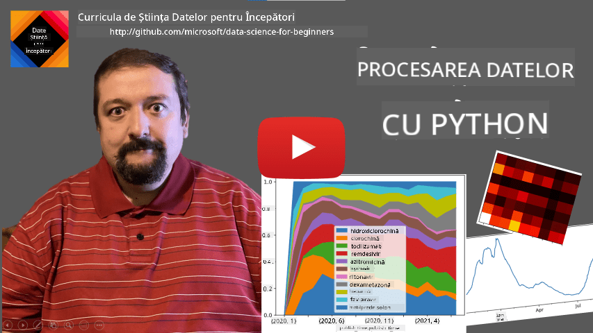
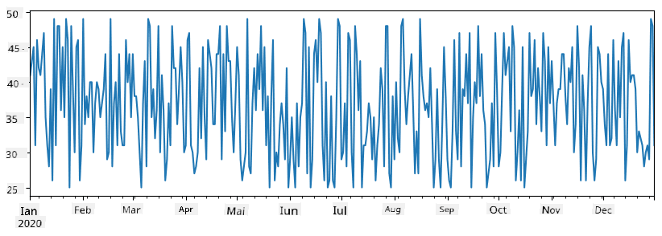
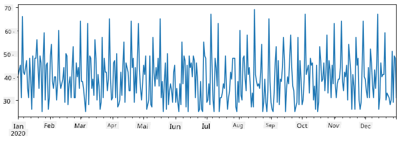
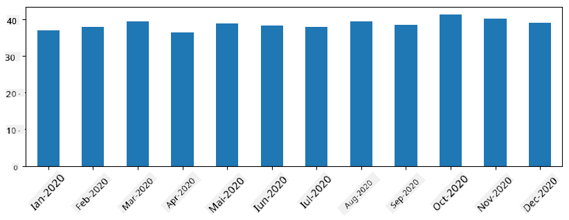
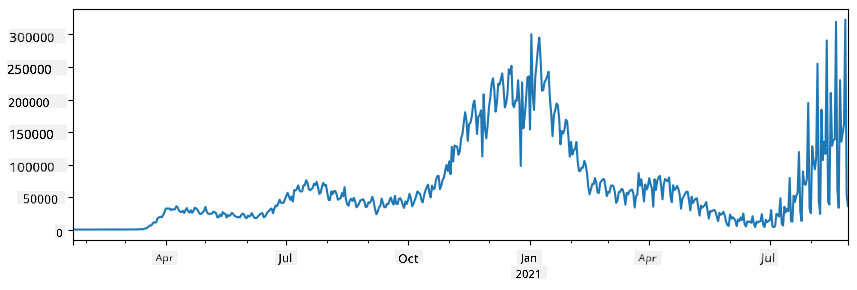
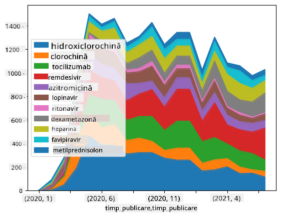

<!--
CO_OP_TRANSLATOR_METADATA:
{
  "original_hash": "116c5d361fbe812e59a73f37ce721d36",
  "translation_date": "2025-08-26T14:48:22+00:00",
  "source_file": "2-Working-With-Data/07-python/README.md",
  "language_code": "ro"
}
-->
# Lucrul cu Date: Python și Biblioteca Pandas

|  ](../../sketchnotes/07-WorkWithPython.png) |
| :-------------------------------------------------------------------------------------------------------: |
|                 Lucrul cu Python - _Sketchnote de [@nitya](https://twitter.com/nitya)_                   |

[](https://youtu.be/dZjWOGbsN4Y)

Deși bazele de date oferă modalități foarte eficiente de a stoca date și de a le interoga folosind limbaje de interogare, cea mai flexibilă metodă de procesare a datelor este scrierea propriului program pentru a manipula datele. În multe cazuri, o interogare în baza de date ar fi o metodă mai eficientă. Totuși, în unele situații, când este necesară o procesare mai complexă a datelor, aceasta nu poate fi realizată ușor folosind SQL. 
Procesarea datelor poate fi programată în orice limbaj de programare, dar există anumite limbaje care sunt mai potrivite pentru lucrul cu date. De obicei, oamenii de știință în domeniul datelor preferă unul dintre următoarele limbaje:

* **[Python](https://www.python.org/)**, un limbaj de programare general, considerat adesea una dintre cele mai bune opțiuni pentru începători datorită simplității sale. Python are multe biblioteci suplimentare care te pot ajuta să rezolvi diverse probleme practice, cum ar fi extragerea datelor dintr-un arhiv ZIP sau convertirea unei imagini în tonuri de gri. Pe lângă știința datelor, Python este utilizat frecvent și pentru dezvoltarea web. 
* **[R](https://www.r-project.org/)** este un instrument tradițional dezvoltat pentru procesarea datelor statistice. Acesta conține un depozit vast de biblioteci (CRAN), ceea ce îl face o alegere bună pentru procesarea datelor. Totuși, R nu este un limbaj de programare general și este rar utilizat în afara domeniului științei datelor.
* **[Julia](https://julialang.org/)** este un alt limbaj dezvoltat special pentru știința datelor. Acesta este conceput pentru a oferi performanțe mai bune decât Python, fiind un instrument excelent pentru experimente științifice.

În această lecție, ne vom concentra pe utilizarea Python pentru procesarea simplă a datelor. Vom presupune că ai o familiaritate de bază cu limbajul. Dacă dorești o introducere mai aprofundată în Python, poți consulta unul dintre următoarele resurse:

* [Învață Python într-un mod distractiv cu Turtle Graphics și Fractali](https://github.com/shwars/pycourse) - Curs introductiv rapid pe GitHub despre programarea în Python
* [Fă primii pași cu Python](https://docs.microsoft.com/en-us/learn/paths/python-first-steps/?WT.mc_id=academic-77958-bethanycheum) Parcurs de învățare pe [Microsoft Learn](http://learn.microsoft.com/?WT.mc_id=academic-77958-bethanycheum)

Datele pot avea multe forme. În această lecție, vom analiza trei forme de date - **date tabelare**, **text** și **imagini**.

Ne vom concentra pe câteva exemple de procesare a datelor, în loc să oferim o prezentare completă a tuturor bibliotecilor asociate. Acest lucru îți va permite să înțelegi principalele posibilități și să știi unde să găsești soluții pentru problemele tale atunci când ai nevoie.

> **Cel mai util sfat**. Când trebuie să efectuezi o anumită operațiune pe date și nu știi cum să o faci, încearcă să cauți pe internet. [Stackoverflow](https://stackoverflow.com/) conține de obicei multe exemple utile de cod în Python pentru diverse sarcini tipice.


## [Chestionar înainte de lecție](https://purple-hill-04aebfb03.1.azurestaticapps.net/quiz/12)

## Date Tabelare și Dataframes

Ai întâlnit deja date tabelare când am vorbit despre bazele de date relaționale. Când ai multe date, iar acestea sunt conținute în mai multe tabele interconectate, are sens să folosești SQL pentru a lucra cu ele. Totuși, există multe situații în care avem un tabel de date și trebuie să obținem o **înțelegere** sau **perspectivă** asupra acestor date, cum ar fi distribuția, corelația între valori etc. În știința datelor, există multe cazuri în care trebuie să efectuăm transformări ale datelor originale, urmate de vizualizare. Ambele etape pot fi realizate ușor folosind Python.

Există două biblioteci foarte utile în Python care te pot ajuta să lucrezi cu date tabelare:
* **[Pandas](https://pandas.pydata.org/)** îți permite să manipulezi așa-numitele **Dataframes**, care sunt analoge tabelelor relaționale. Poți avea coloane denumite și poți efectua diferite operațiuni pe rânduri, coloane și dataframes în general. 
* **[Numpy](https://numpy.org/)** este o bibliotecă pentru lucrul cu **tensori**, adică **matrici** multidimensionale. Matricele au valori de același tip de bază și sunt mai simple decât dataframes, dar oferă mai multe operațiuni matematice și creează mai puțin overhead.

Există și câteva alte biblioteci pe care ar trebui să le cunoști:
* **[Matplotlib](https://matplotlib.org/)** este o bibliotecă utilizată pentru vizualizarea datelor și crearea de grafice
* **[SciPy](https://www.scipy.org/)** este o bibliotecă cu funcții științifice suplimentare. Am întâlnit deja această bibliotecă când am vorbit despre probabilitate și statistici

Iată un fragment de cod pe care l-ai folosi de obicei pentru a importa aceste biblioteci la începutul programului Python:
```python
import numpy as np
import pandas as pd
import matplotlib.pyplot as plt
from scipy import ... # you need to specify exact sub-packages that you need
``` 

Pandas se concentrează pe câteva concepte de bază.

### Series 

**Series** este o secvență de valori, similară unei liste sau unui array numpy. Principala diferență este că series are și un **index**, iar când operăm pe series (de exemplu, le adunăm), indexul este luat în considerare. Indexul poate fi la fel de simplu ca numărul de rând (este indexul utilizat implicit când creăm un series dintr-o listă sau un array) sau poate avea o structură complexă, cum ar fi un interval de date.

> **Notă**: Există cod introductiv Pandas în notebook-ul asociat [`notebook.ipynb`](notebook.ipynb). Vom prezenta doar câteva exemple aici, dar ești binevenit să verifici notebook-ul complet.

Să luăm un exemplu: vrem să analizăm vânzările de la magazinul nostru de înghețată. Să generăm un series de numere de vânzări (numărul de produse vândute în fiecare zi) pentru o anumită perioadă de timp:

```python
start_date = "Jan 1, 2020"
end_date = "Mar 31, 2020"
idx = pd.date_range(start_date,end_date)
print(f"Length of index is {len(idx)}")
items_sold = pd.Series(np.random.randint(25,50,size=len(idx)),index=idx)
items_sold.plot()
```


Acum să presupunem că în fiecare săptămână organizăm o petrecere pentru prieteni și luăm 10 pachete suplimentare de înghețată pentru petrecere. Putem crea un alt series, indexat pe săptămână, pentru a demonstra acest lucru:
```python
additional_items = pd.Series(10,index=pd.date_range(start_date,end_date,freq="W"))
```
Când adunăm cele două series, obținem numărul total:
```python
total_items = items_sold.add(additional_items,fill_value=0)
total_items.plot()
```


> **Notă** că nu folosim sintaxa simplă `total_items+additional_items`. Dacă am fi făcut asta, am fi obținut multe valori `NaN` (*Not a Number*) în series-ul rezultat. Acest lucru se întâmplă deoarece există valori lipsă pentru unele puncte de index în series-ul `additional_items`, iar adunarea unui `NaN` cu orice altceva rezultă în `NaN`. Astfel, trebuie să specificăm parametrul `fill_value` în timpul adunării.

Cu seriile temporale, putem și **resampla** seria cu intervale de timp diferite. De exemplu, să presupunem că vrem să calculăm volumul mediu de vânzări lunar. Putem folosi următorul cod:
```python
monthly = total_items.resample("1M").mean()
ax = monthly.plot(kind='bar')
```


### DataFrame

Un DataFrame este, în esență, o colecție de series cu același index. Putem combina mai multe series într-un DataFrame:
```python
a = pd.Series(range(1,10))
b = pd.Series(["I","like","to","play","games","and","will","not","change"],index=range(0,9))
df = pd.DataFrame([a,b])
```
Acest lucru va crea un tabel orizontal ca acesta:
|     | 0   | 1    | 2   | 3   | 4      | 5   | 6      | 7    | 8    |
| --- | --- | ---- | --- | --- | ------ | --- | ------ | ---- | ---- |
| 0   | 1   | 2    | 3   | 4   | 5      | 6   | 7      | 8    | 9    |
| 1   | I   | like | to  | use | Python | and | Pandas | very | much |

Putem folosi și Series ca coloane și să specificăm numele coloanelor folosind un dicționar:
```python
df = pd.DataFrame({ 'A' : a, 'B' : b })
```
Acest lucru ne va oferi un tabel ca acesta:

|     | A   | B      |
| --- | --- | ------ |
| 0   | 1   | I      |
| 1   | 2   | like   |
| 2   | 3   | to     |
| 3   | 4   | use    |
| 4   | 5   | Python |
| 5   | 6   | and    |
| 6   | 7   | Pandas |
| 7   | 8   | very   |
| 8   | 9   | much   |

**Notă** că putem obține acest layout al tabelului și prin transpunerea tabelului anterior, de exemplu, scriind 
```python
df = pd.DataFrame([a,b]).T..rename(columns={ 0 : 'A', 1 : 'B' })
```
Aici `.T` înseamnă operația de transpunere a DataFrame-ului, adică schimbarea rândurilor și coloanelor, iar operația `rename` ne permite să redenumim coloanele pentru a se potrivi cu exemplul anterior.

Iată câteva dintre cele mai importante operațiuni pe care le putem efectua pe DataFrames:

**Selecția coloanelor**. Putem selecta coloane individuale scriind `df['A']` - această operațiune returnează un Series. Putem selecta și un subset de coloane într-un alt DataFrame scriind `df[['B','A']]` - aceasta returnează un alt DataFrame.

**Filtrarea** doar a anumitor rânduri după criterii. De exemplu, pentru a păstra doar rândurile cu coloana `A` mai mare decât 5, putem scrie `df[df['A']>5]`.

> **Notă**: Modul în care funcționează filtrarea este următorul. Expresia `df['A']<5` returnează un series boolean, care indică dacă expresia este `True` sau `False` pentru fiecare element al series-ului original `df['A']`. Când series-ul boolean este utilizat ca index, returnează subsetul de rânduri din DataFrame. Astfel, nu este posibil să folosești expresii boolean arbitrare din Python, de exemplu, scriind `df[df['A']>5 and df['A']<7]` ar fi greșit. În schimb, ar trebui să folosești operația specială `&` pe series boolean, scriind `df[(df['A']>5) & (df['A']<7)]` (*parantezele sunt importante aici*).

**Crearea de coloane calculabile noi**. Putem crea ușor coloane calculabile noi pentru DataFrame-ul nostru folosind expresii intuitive ca aceasta:
```python
df['DivA'] = df['A']-df['A'].mean() 
``` 
Acest exemplu calculează abaterea lui A față de valoarea sa medie. Ce se întâmplă de fapt aici este că calculăm un series și apoi atribuim acest series părții din stânga, creând o altă coloană. Astfel, nu putem folosi operațiuni care nu sunt compatibile cu series, de exemplu, codul de mai jos este greșit:
```python
# Wrong code -> df['ADescr'] = "Low" if df['A'] < 5 else "Hi"
df['LenB'] = len(df['B']) # <- Wrong result
``` 
Ultimul exemplu, deși este sintactic corect, ne oferă un rezultat greșit, deoarece atribuie lungimea series-ului `B` tuturor valorilor din coloană, și nu lungimea elementelor individuale, așa cum intenționam.

Dacă trebuie să calculăm expresii complexe ca aceasta, putem folosi funcția `apply`. Ultimul exemplu poate fi scris astfel:
```python
df['LenB'] = df['B'].apply(lambda x : len(x))
# or 
df['LenB'] = df['B'].apply(len)
```

După operațiunile de mai sus, vom avea următorul DataFrame:

|     | A   | B      | DivA | LenB |
| --- | --- | ------ | ---- | ---- |
| 0   | 1   | I      | -4.0 | 1    |
| 1   | 2   | like   | -3.0 | 4    |
| 2   | 3   | to     | -2.0 | 2    |
| 3   | 4   | use    | -1.0 | 3    |
| 4   | 5   | Python | 0.0  | 6    |
| 5   | 6   | and    | 1.0  | 3    |
| 6   | 7   | Pandas | 2.0  | 6    |
| 7   | 8   | very   | 3.0  | 4    |
| 8   | 9   | much   | 4.0  | 4    |

**Selecția rândurilor pe baza numerelor** poate fi realizată folosind construcția `iloc`. De exemplu, pentru a selecta primele 5 rânduri din DataFrame:
```python
df.iloc[:5]
```

**Gruparea** este adesea utilizată pentru a obține un rezultat similar cu *tabelele pivot* din Excel. Să presupunem că vrem să calculăm valoarea medie a coloanei `A` pentru fiecare număr dat de `LenB`. Atunci putem grupa DataFrame-ul nostru după `LenB` și să apelăm `mean`:
```python
df.groupby(by='LenB').mean()
```
Dacă trebuie să calculăm media și numărul de elemente din grup, atunci putem folosi funcția mai complexă `aggregate`:
```python
df.groupby(by='LenB') \
 .aggregate({ 'DivA' : len, 'A' : lambda x: x.mean() }) \
 .rename(columns={ 'DivA' : 'Count', 'A' : 'Mean'})
```
Aceasta ne oferă următorul tabel:

| LenB | Count | Mean     |
| ---- | ----- | -------- |
| 1    | 1     | 1.000000 |
| 2    | 1     | 3.000000 |
| 3    | 2     | 5.000000 |
| 4    | 3     | 6.333333 |
| 6    | 2     | 6.000000 |

### Obținerea Datelor
Am văzut cât de ușor este să construim Series și DataFrames din obiecte Python. Totuși, datele vin de obicei sub formă de fișier text sau tabel Excel. Din fericire, Pandas ne oferă o modalitate simplă de a încărca datele de pe disc. De exemplu, citirea unui fișier CSV este la fel de simplă ca aceasta:
```python
df = pd.read_csv('file.csv')
```
Vom vedea mai multe exemple de încărcare a datelor, inclusiv obținerea lor de pe site-uri web externe, în secțiunea "Provocare".

### Printarea și Vizualizarea

Un Data Scientist trebuie adesea să exploreze datele, așa că este important să le poată vizualiza. Când DataFrame-ul este mare, de multe ori vrem doar să ne asigurăm că facem totul corect prin printarea primelor câteva rânduri. Acest lucru se poate face apelând `df.head()`. Dacă îl rulați din Jupyter Notebook, acesta va afișa DataFrame-ul într-o formă tabelară plăcută.

Am văzut, de asemenea, utilizarea funcției `plot` pentru a vizualiza unele coloane. Deși `plot` este foarte util pentru multe sarcini și suportă multe tipuri diferite de grafice prin parametrul `kind=`, puteți întotdeauna folosi biblioteca `matplotlib` pentru a crea ceva mai complex. Vom acoperi vizualizarea datelor în detaliu în lecții separate ale cursului.

Această prezentare generală acoperă cele mai importante concepte ale Pandas, totuși, biblioteca este foarte bogată și nu există limite pentru ceea ce puteți face cu ea! Să aplicăm acum aceste cunoștințe pentru rezolvarea unei probleme specifice.

## 🚀 Provocarea 1: Analiza Răspândirii COVID

Prima problemă pe care ne vom concentra este modelarea răspândirii epidemiei de COVID-19. Pentru a face acest lucru, vom folosi datele despre numărul de persoane infectate în diferite țări, furnizate de [Center for Systems Science and Engineering](https://systems.jhu.edu/) (CSSE) de la [Johns Hopkins University](https://jhu.edu/). Setul de date este disponibil în [acest depozit GitHub](https://github.com/CSSEGISandData/COVID-19).

Deoarece dorim să demonstrăm cum să lucrăm cu datele, vă invităm să deschideți [`notebook-covidspread.ipynb`](notebook-covidspread.ipynb) și să îl citiți de la început până la sfârșit. Puteți, de asemenea, să executați celulele și să faceți unele provocări pe care le-am lăsat pentru voi la final.



> Dacă nu știți cum să rulați codul în Jupyter Notebook, consultați [acest articol](https://soshnikov.com/education/how-to-execute-notebooks-from-github/).

## Lucrul cu Date Nestructurate

Deși datele vin foarte des sub formă tabelară, în unele cazuri trebuie să lucrăm cu date mai puțin structurate, de exemplu, text sau imagini. În acest caz, pentru a aplica tehnicile de procesare a datelor pe care le-am văzut mai sus, trebuie să **extragem** cumva date structurate. Iată câteva exemple:

* Extracția cuvintelor cheie din text și analiza frecvenței apariției acestora
* Utilizarea rețelelor neuronale pentru a extrage informații despre obiectele dintr-o imagine
* Obținerea informațiilor despre emoțiile oamenilor din fluxul video al unei camere

## 🚀 Provocarea 2: Analiza Lucrărilor despre COVID

În această provocare, vom continua cu tema pandemiei COVID și ne vom concentra pe procesarea lucrărilor științifice pe acest subiect. Există [Setul de Date CORD-19](https://www.kaggle.com/allen-institute-for-ai/CORD-19-research-challenge) cu peste 7000 (la momentul scrierii) lucrări despre COVID, disponibile cu metadate și rezumate (și pentru aproximativ jumătate dintre ele este disponibil și textul complet).

Un exemplu complet de analiză a acestui set de date folosind serviciul cognitiv [Text Analytics for Health](https://docs.microsoft.com/azure/cognitive-services/text-analytics/how-tos/text-analytics-for-health/?WT.mc_id=academic-77958-bethanycheum) este descris [în acest articol de blog](https://soshnikov.com/science/analyzing-medical-papers-with-azure-and-text-analytics-for-health/). Vom discuta o versiune simplificată a acestei analize.

> **NOTE**: Nu oferim o copie a setului de date ca parte a acestui depozit. Este posibil să fie nevoie să descărcați mai întâi fișierul [`metadata.csv`](https://www.kaggle.com/allen-institute-for-ai/CORD-19-research-challenge?select=metadata.csv) din [acest set de date pe Kaggle](https://www.kaggle.com/allen-institute-for-ai/CORD-19-research-challenge). Este posibil să fie necesară înregistrarea pe Kaggle. De asemenea, puteți descărca setul de date fără înregistrare [de aici](https://ai2-semanticscholar-cord-19.s3-us-west-2.amazonaws.com/historical_releases.html), dar acesta va include toate textele complete în plus față de fișierul de metadate.

Deschideți [`notebook-papers.ipynb`](notebook-papers.ipynb) și citiți-l de la început până la sfârșit. Puteți, de asemenea, să executați celulele și să faceți unele provocări pe care le-am lăsat pentru voi la final.



## Procesarea Datelor din Imagini

Recent, au fost dezvoltate modele AI foarte puternice care ne permit să înțelegem imaginile. Există multe sarcini care pot fi rezolvate folosind rețele neuronale pre-antrenate sau servicii cloud. Câteva exemple includ:

* **Clasificarea Imaginilor**, care vă poate ajuta să categorizați imaginea într-una dintre clasele predefinite. Puteți antrena cu ușurință propriile clasificatoare de imagini folosind servicii precum [Custom Vision](https://azure.microsoft.com/services/cognitive-services/custom-vision-service/?WT.mc_id=academic-77958-bethanycheum)
* **Detectarea Obiectelor** pentru a identifica diferite obiecte din imagine. Servicii precum [computer vision](https://azure.microsoft.com/services/cognitive-services/computer-vision/?WT.mc_id=academic-77958-bethanycheum) pot detecta un număr de obiecte comune, iar modelul [Custom Vision](https://azure.microsoft.com/services/cognitive-services/custom-vision-service/?WT.mc_id=academic-77958-bethanycheum) poate fi antrenat pentru a detecta obiecte specifice de interes.
* **Detectarea Fețelor**, inclusiv vârsta, genul și emoțiile. Acest lucru poate fi realizat prin [Face API](https://azure.microsoft.com/services/cognitive-services/face/?WT.mc_id=academic-77958-bethanycheum).

Toate aceste servicii cloud pot fi apelate folosind [SDK-uri Python](https://docs.microsoft.com/samples/azure-samples/cognitive-services-python-sdk-samples/cognitive-services-python-sdk-samples/?WT.mc_id=academic-77958-bethanycheum) și, astfel, pot fi ușor integrate în fluxul de explorare a datelor.

Iată câteva exemple de explorare a datelor din surse de imagini:
* În articolul de blog [Cum să înveți Data Science fără programare](https://soshnikov.com/azure/how-to-learn-data-science-without-coding/) explorăm fotografii de pe Instagram, încercând să înțelegem ce determină oamenii să aprecieze mai mult o fotografie. Mai întâi extragem cât mai multe informații din imagini folosind [computer vision](https://azure.microsoft.com/services/cognitive-services/computer-vision/?WT.mc_id=academic-77958-bethanycheum), apoi folosim [Azure Machine Learning AutoML](https://docs.microsoft.com/azure/machine-learning/concept-automated-ml/?WT.mc_id=academic-77958-bethanycheum) pentru a construi un model interpretabil.
* În [Facial Studies Workshop](https://github.com/CloudAdvocacy/FaceStudies) folosim [Face API](https://azure.microsoft.com/services/cognitive-services/face/?WT.mc_id=academic-77958-bethanycheum) pentru a extrage emoțiile oamenilor din fotografii de la evenimente, pentru a încerca să înțelegem ce îi face fericiți.

## Concluzie

Indiferent dacă aveți deja date structurate sau nestructurate, folosind Python puteți efectua toate etapele legate de procesarea și înțelegerea datelor. Este probabil cea mai flexibilă modalitate de procesare a datelor, și acesta este motivul pentru care majoritatea data scientist-ilor folosesc Python ca instrument principal. Învățarea Python în profunzime este probabil o idee bună dacă sunteți serios în privința călătoriei voastre în data science!

## [Test de verificare după lecție](https://purple-hill-04aebfb03.1.azurestaticapps.net/quiz/13)

## Recapitulare & Studiu Individual

**Cărți**
* [Wes McKinney. Python for Data Analysis: Data Wrangling with Pandas, NumPy, and IPython](https://www.amazon.com/gp/product/1491957662)

**Resurse Online**
* Tutorialul oficial [10 minute pentru Pandas](https://pandas.pydata.org/pandas-docs/stable/user_guide/10min.html)
* [Documentația despre Vizualizarea Pandas](https://pandas.pydata.org/pandas-docs/stable/user_guide/visualization.html)

**Învățarea Python**
* [Învață Python într-un mod distractiv cu Turtle Graphics și Fractals](https://github.com/shwars/pycourse)
* [Fă primii pași cu Python](https://docs.microsoft.com/learn/paths/python-first-steps/?WT.mc_id=academic-77958-bethanycheum) Parcurs de învățare pe [Microsoft Learn](http://learn.microsoft.com/?WT.mc_id=academic-77958-bethanycheum)

## Temă

[Realizați un studiu mai detaliat al datelor pentru provocările de mai sus](assignment.md)

## Credite

Această lecție a fost scrisă cu ♥️ de [Dmitry Soshnikov](http://soshnikov.com)

---

**Declinare de responsabilitate**:  
Acest document a fost tradus folosind serviciul de traducere AI [Co-op Translator](https://github.com/Azure/co-op-translator). Deși ne străduim să asigurăm acuratețea, vă rugăm să fiți conștienți că traducerile automate pot conține erori sau inexactități. Documentul original în limba sa natală ar trebui considerat sursa autoritară. Pentru informații critice, se recomandă traducerea profesională realizată de un specialist uman. Nu ne asumăm responsabilitatea pentru eventualele neînțelegeri sau interpretări greșite care pot apărea din utilizarea acestei traduceri.