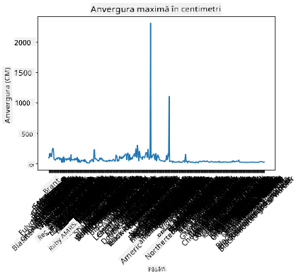
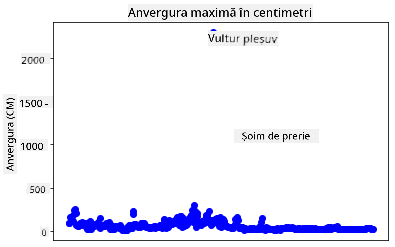
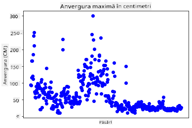
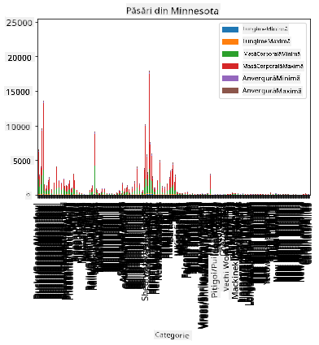
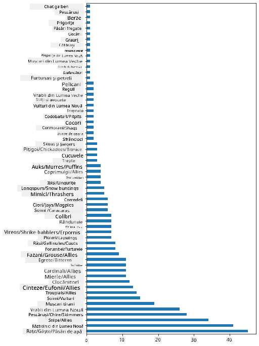
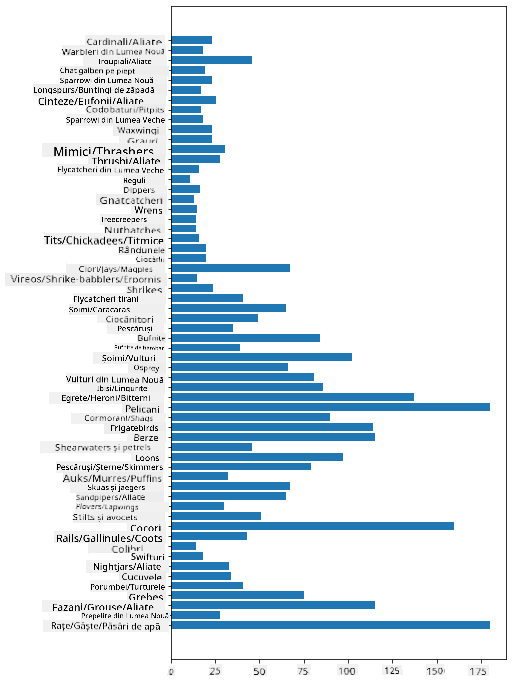
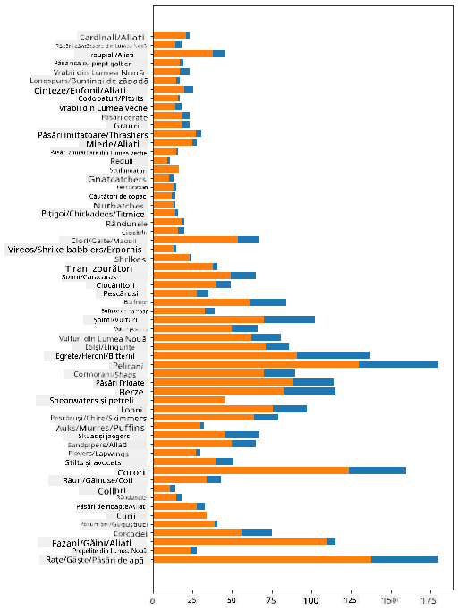

<!--
CO_OP_TRANSLATOR_METADATA:
{
  "original_hash": "43c402d9d90ae6da55d004519ada5033",
  "translation_date": "2025-08-26T17:24:47+00:00",
  "source_file": "3-Data-Visualization/09-visualization-quantities/README.md",
  "language_code": "ro"
}
-->
# Vizualizarea Cantităților

| ](../../sketchnotes/09-Visualizing-Quantities.png)|
|:---:|
| Vizualizarea Cantităților - _Sketchnote de [@nitya](https://twitter.com/nitya)_ |

În această lecție vei explora cum să folosești una dintre numeroasele biblioteci disponibile în Python pentru a învăța cum să creezi vizualizări interesante în jurul conceptului de cantitate. Folosind un set de date curățat despre păsările din Minnesota, poți descoperi multe informații interesante despre fauna locală.  
## [Chestionar înainte de lecție](https://purple-hill-04aebfb03.1.azurestaticapps.net/quiz/16)

## Observă anvergura aripilor cu Matplotlib

O bibliotecă excelentă pentru a crea atât grafice simple, cât și sofisticate de diverse tipuri este [Matplotlib](https://matplotlib.org/stable/index.html). În termeni generali, procesul de realizare a graficelor folosind aceste biblioteci include identificarea părților din cadrul de date pe care vrei să le analizezi, efectuarea transformărilor necesare asupra datelor, atribuirea valorilor pentru axele x și y, alegerea tipului de grafic și apoi afișarea acestuia. Matplotlib oferă o varietate mare de vizualizări, dar pentru această lecție, să ne concentrăm pe cele mai potrivite pentru vizualizarea cantităților: grafice liniare, scatterplots și grafice de tip bară.

> ✅ Folosește cel mai potrivit tip de grafic pentru structura datelor tale și povestea pe care vrei să o spui.  
> - Pentru a analiza tendințele în timp: grafic liniar  
> - Pentru a compara valori: grafic bară, coloană, plăcintă, scatterplot  
> - Pentru a arăta cum părțile se raportează la întreg: plăcintă  
> - Pentru a arăta distribuția datelor: scatterplot, grafic bară  
> - Pentru a arăta tendințe: grafic liniar, coloană  
> - Pentru a arăta relații între valori: grafic liniar, scatterplot, bubble  

Dacă ai un set de date și trebuie să descoperi cât de mult dintr-un anumit element este inclus, una dintre primele sarcini va fi să inspectezi valorile acestuia.  

✅ Există "fișe de ajutor" foarte bune pentru Matplotlib [aici](https://matplotlib.org/cheatsheets/cheatsheets.pdf).

## Construiește un grafic liniar despre valorile anvergurii aripilor păsărilor

Deschide fișierul `notebook.ipynb` aflat la rădăcina acestui folder de lecție și adaugă un celulă.

> Notă: datele sunt stocate la rădăcina acestui depozit în folderul `/data`.

```python
import pandas as pd
import matplotlib.pyplot as plt
birds = pd.read_csv('../../data/birds.csv')
birds.head()
```  
Aceste date sunt un amestec de text și numere:

|      | Nume                         | NumeȘtiințific         | Categorie             | Ordin        | Familie  | Gen         | StatusConservare    | LungimeMin | LungimeMax | MasăCorpMin | MasăCorpMax | AnvergurăMin | AnvergurăMax |
| ---: | :--------------------------- | :--------------------- | :-------------------- | :----------- | :------- | :---------- | :----------------- | --------: | --------: | ----------: | ----------: | ----------: | ----------: |
|    0 | Rața fluierătoare cu burtă neagră | Dendrocygna autumnalis | Rațe/Gâște/Păsări acvatice | Anseriformes | Anatidae | Dendrocygna | LC                 |        47 |        56 |         652 |        1020 |          76 |          94 |
|    1 | Rața fluierătoare cafenie       | Dendrocygna bicolor    | Rațe/Gâște/Păsări acvatice | Anseriformes | Anatidae | Dendrocygna | LC                 |        45 |        53 |         712 |        1050 |          85 |          93 |
|    2 | Gâsca de zăpadă                | Anser caerulescens     | Rațe/Gâște/Păsări acvatice | Anseriformes | Anatidae | Anser       | LC                 |        64 |        79 |        2050 |        4050 |         135 |         165 |
|    3 | Gâsca lui Ross                 | Anser rossii           | Rațe/Gâște/Păsări acvatice | Anseriformes | Anatidae | Anser       | LC                 |      57.3 |        64 |        1066 |        1567 |         113 |         116 |
|    4 | Gâsca albă cu frunte mare      | Anser albifrons        | Rațe/Gâște/Păsări acvatice | Anseriformes | Anatidae | Anser       | LC                 |        64 |        81 |        1930 |        3310 |         130 |         165 |

Să începem prin a reprezenta grafic câteva dintre datele numerice folosind un grafic liniar de bază. Să presupunem că vrei să vezi anvergura maximă a aripilor acestor păsări interesante.

```python
wingspan = birds['MaxWingspan'] 
wingspan.plot()
```  


Ce observi imediat? Pare să existe cel puțin un outlier - ce anvergură impresionantă! O anvergură de 2300 centimetri înseamnă 23 metri - sunt Pterodactili care zboară prin Minnesota? Să investigăm.

Deși ai putea face rapid un sortare în Excel pentru a găsi acești outlieri, care probabil sunt erori de tipar, continuă procesul de vizualizare lucrând direct din grafic.

Adaugă etichete pe axa x pentru a arăta ce tip de păsări sunt în discuție:

```
plt.title('Max Wingspan in Centimeters')
plt.ylabel('Wingspan (CM)')
plt.xlabel('Birds')
plt.xticks(rotation=45)
x = birds['Name'] 
y = birds['MaxWingspan']

plt.plot(x, y)

plt.show()
```  


Chiar și cu rotația etichetelor setată la 45 de grade, sunt prea multe pentru a fi citite. Să încercăm o strategie diferită: etichetează doar outlierii și setează etichetele în interiorul graficului. Poți folosi un grafic scatter pentru a face mai mult loc etichetării:

```python
plt.title('Max Wingspan in Centimeters')
plt.ylabel('Wingspan (CM)')
plt.tick_params(axis='both',which='both',labelbottom=False,bottom=False)

for i in range(len(birds)):
    x = birds['Name'][i]
    y = birds['MaxWingspan'][i]
    plt.plot(x, y, 'bo')
    if birds['MaxWingspan'][i] > 500:
        plt.text(x, y * (1 - 0.05), birds['Name'][i], fontsize=12)
    
plt.show()
```  
Ce se întâmplă aici? Ai folosit `tick_params` pentru a ascunde etichetele de jos și apoi ai creat un loop peste setul de date al păsărilor. Reprezentând graficul cu puncte mici albastre rotunde folosind `bo`, ai verificat orice pasăre cu o anvergură maximă mai mare de 500 și ai afișat eticheta acesteia lângă punct dacă este cazul. Ai offsetat etichetele puțin pe axa y (`y * (1 - 0.05)`) și ai folosit numele păsării ca etichetă.

Ce ai descoperit?

  
## Filtrează datele

Atât Vulturul Pleșuv, cât și Șoimul de Prerie, deși probabil păsări foarte mari, par să fie etichetate greșit, cu un `0` suplimentar adăugat la anvergura maximă a aripilor. Este puțin probabil să întâlnești un Vultur Pleșuv cu o anvergură de 25 metri, dar dacă da, te rugăm să ne anunți! Să creăm un nou cadru de date fără acești doi outlieri:

```python
plt.title('Max Wingspan in Centimeters')
plt.ylabel('Wingspan (CM)')
plt.xlabel('Birds')
plt.tick_params(axis='both',which='both',labelbottom=False,bottom=False)
for i in range(len(birds)):
    x = birds['Name'][i]
    y = birds['MaxWingspan'][i]
    if birds['Name'][i] not in ['Bald eagle', 'Prairie falcon']:
        plt.plot(x, y, 'bo')
plt.show()
```  

Filtrând outlierii, datele tale sunt acum mai coerente și mai ușor de înțeles.

  

Acum că avem un set de date mai curat, cel puțin în ceea ce privește anvergura aripilor, să descoperim mai multe despre aceste păsări.

Deși graficele liniare și scatter pot afișa informații despre valorile datelor și distribuțiile acestora, vrem să ne gândim la valorile inerente acestui set de date. Ai putea crea vizualizări pentru a răspunde la următoarele întrebări despre cantitate:

> Câte categorii de păsări există și care sunt numerele lor?  
> Câte păsări sunt dispărute, pe cale de dispariție, rare sau comune?  
> Câte sunt din diversele genuri și ordine din terminologia lui Linnaeus?  
## Explorează graficele de tip bară

Graficele de tip bară sunt practice atunci când trebuie să arăți grupări de date. Să explorăm categoriile de păsări care există în acest set de date pentru a vedea care este cea mai comună ca număr.

În fișierul notebook, creează un grafic de tip bară de bază.

✅ Notă, poți fie să filtrezi cele două păsări outlier pe care le-am identificat în secțiunea anterioară, să editezi eroarea din anvergura lor, sau să le lași în aceste exerciții care nu depind de valorile anvergurii.

Dacă vrei să creezi un grafic de tip bară, poți selecta datele pe care vrei să te concentrezi. Graficele de tip bară pot fi create din date brute:

```python
birds.plot(x='Category',
        kind='bar',
        stacked=True,
        title='Birds of Minnesota')

```  
  

Acest grafic de tip bară, totuși, este greu de citit deoarece există prea multe date negrupate. Trebuie să selectezi doar datele pe care vrei să le reprezinți grafic, așa că să ne uităm la lungimea păsărilor bazată pe categoria lor.  

Filtrează datele pentru a include doar categoria păsării.  

✅ Observă că folosești Pandas pentru a gestiona datele, iar apoi lași Matplotlib să se ocupe de graficare.

Deoarece există multe categorii, poți afișa acest grafic vertical și ajusta înălțimea pentru a include toate datele:

```python
category_count = birds.value_counts(birds['Category'].values, sort=True)
plt.rcParams['figure.figsize'] = [6, 12]
category_count.plot.barh()
```  
  

Acest grafic de tip bară oferă o vedere bună asupra numărului de păsări din fiecare categorie. Dintr-o privire, vezi că cel mai mare număr de păsări din această regiune sunt în categoria Rațe/Gâște/Păsări acvatice. Minnesota este "țara celor 10.000 de lacuri", așa că acest lucru nu este surprinzător!

✅ Încearcă alte numărători pe acest set de date. Te surprinde ceva?

## Compararea datelor

Poți încerca diferite comparații ale datelor grupate creând noi axe. Încearcă o comparație a LungimiiMaxime a unei păsări, bazată pe categoria sa:

```python
maxlength = birds['MaxLength']
plt.barh(y=birds['Category'], width=maxlength)
plt.rcParams['figure.figsize'] = [6, 12]
plt.show()
```  
  

Nimic nu este surprinzător aici: colibrii au cea mai mică LungimeMaximă comparativ cu Pelicanii sau Gâștele. Este bine când datele au sens logic!

Poți crea vizualizări mai interesante ale graficelor de tip bară suprapunând date. Să suprapunem LungimeaMinimă și LungimeaMaximă pe o categorie de păsări dată:

```python
minLength = birds['MinLength']
maxLength = birds['MaxLength']
category = birds['Category']

plt.barh(category, maxLength)
plt.barh(category, minLength)

plt.show()
```  
În acest grafic, poți vedea intervalul per categorie de păsări al LungimiiMinime și LungimiiMaxime. Poți spune cu siguranță că, având în vedere aceste date, cu cât pasărea este mai mare, cu atât intervalul lungimii sale este mai mare. Fascinant!

  

## 🚀 Provocare

Acest set de date despre păsări oferă o mulțime de informații despre diferite tipuri de păsări dintr-un anumit ecosistem. Caută pe internet și vezi dacă poți găsi alte seturi de date orientate spre păsări. Exersează construirea de grafice și diagrame în jurul acestor păsări pentru a descoperi fapte pe care nu le știai.  
## [Chestionar după lecție](https://purple-hill-04aebfb03.1.azurestaticapps.net/quiz/17)

## Recapitulare & Studiu Individual

Această primă lecție ți-a oferit câteva informații despre cum să folosești Matplotlib pentru a vizualiza cantități. Fă cercetări despre alte moduri de a lucra cu seturi de date pentru vizualizare. [Plotly](https://github.com/plotly/plotly.py) este unul pe care nu îl vom acoperi în aceste lecții, așa că aruncă o privire la ce poate oferi.  
## Temă

[Linii, Scatter și Bare](assignment.md)  

---

**Declinare de responsabilitate**:  
Acest document a fost tradus folosind serviciul de traducere AI [Co-op Translator](https://github.com/Azure/co-op-translator). Deși ne străduim să asigurăm acuratețea, vă rugăm să fiți conștienți că traducerile automate pot conține erori sau inexactități. Documentul original în limba sa natală ar trebui considerat sursa autoritară. Pentru informații critice, se recomandă traducerea profesională realizată de un specialist uman. Nu ne asumăm responsabilitatea pentru eventualele neînțelegeri sau interpretări greșite care pot apărea din utilizarea acestei traduceri.