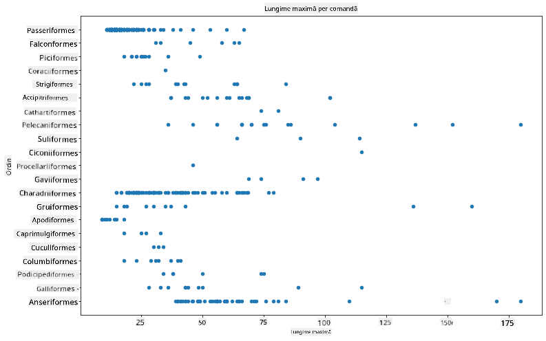
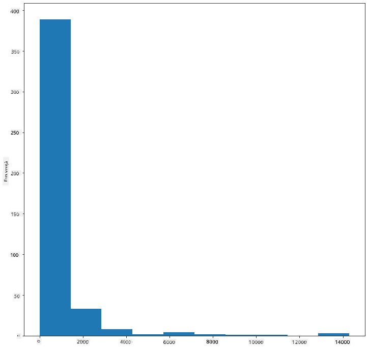
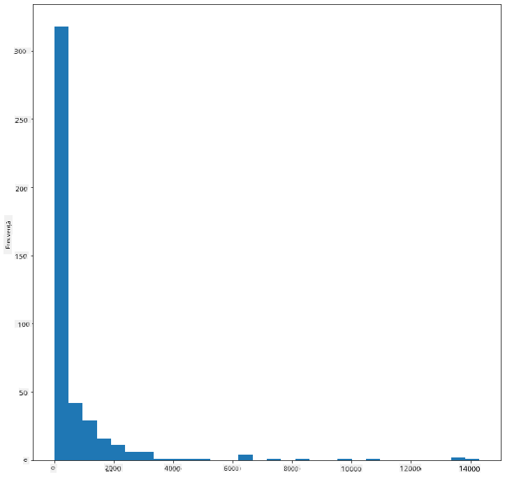
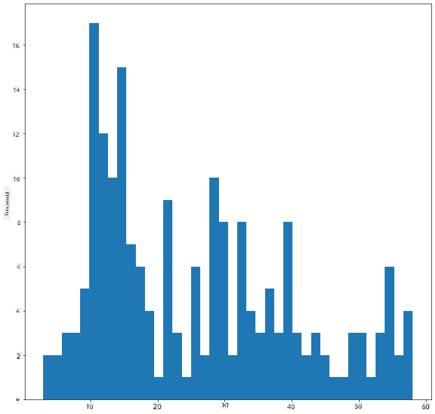
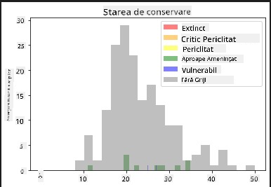
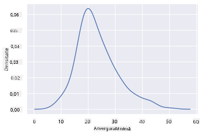
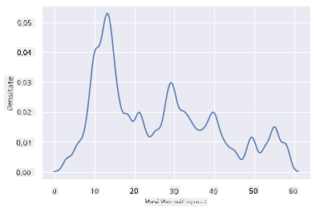
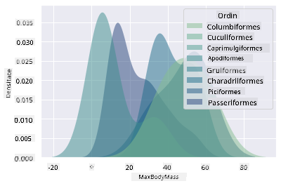
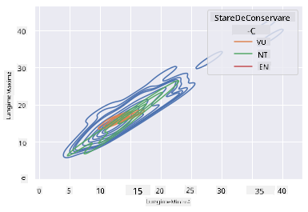

<!--
CO_OP_TRANSLATOR_METADATA:
{
  "original_hash": "87faccac113d772551486a67a607153e",
  "translation_date": "2025-08-26T16:51:24+00:00",
  "source_file": "3-Data-Visualization/10-visualization-distributions/README.md",
  "language_code": "ro"
}
-->
# Vizualizarea distribuțiilor

| ](../../sketchnotes/10-Visualizing-Distributions.png)|
|:---:|
| Vizualizarea distribuțiilor - _Sketchnote de [@nitya](https://twitter.com/nitya)_ |

În lecția anterioară, ai învățat câteva lucruri interesante despre un set de date despre păsările din Minnesota. Ai descoperit date eronate vizualizând valorile extreme și ai analizat diferențele dintre categoriile de păsări în funcție de lungimea lor maximă.

## [Chestionar înainte de lecție](https://purple-hill-04aebfb03.1.azurestaticapps.net/quiz/18)
## Explorează setul de date despre păsări

O altă modalitate de a analiza datele este prin examinarea distribuției lor, adică modul în care datele sunt organizate de-a lungul unui ax. De exemplu, poate vrei să afli despre distribuția generală, pentru acest set de date, a anvergurii maxime a aripilor sau a masei corporale maxime pentru păsările din Minnesota.

Hai să descoperim câteva informații despre distribuțiile datelor din acest set de date. În fișierul _notebook.ipynb_ aflat la rădăcina folderului acestei lecții, importă Pandas, Matplotlib și datele tale:

```python
import pandas as pd
import matplotlib.pyplot as plt
birds = pd.read_csv('../../data/birds.csv')
birds.head()
```

|      | Nume                         | NumeȘtiințific         | Categorie             | Ordin        | Familie  | Gen         | StatusConservare    | MinLungime | MaxLungime | MinMasăCorp | MaxMasăCorp | MinAnvergură | MaxAnvergură |
| ---: | :--------------------------- | :--------------------- | :-------------------- | :----------- | :------- | :---------- | :----------------- | --------: | --------: | ----------: | ----------: | ----------: | ----------: |
|    0 | Rața fluierătoare cu burtă neagră | Dendrocygna autumnalis | Rațe/Gâște/Păsări acvatice | Anseriformes | Anatidae | Dendrocygna | LC                 |        47 |        56 |         652 |        1020 |          76 |          94 |
|    1 | Rața fluierătoare cafenie       | Dendrocygna bicolor    | Rațe/Gâște/Păsări acvatice | Anseriformes | Anatidae | Dendrocygna | LC                 |        45 |        53 |         712 |        1050 |          85 |          93 |
|    2 | Gâsca de zăpadă                | Anser caerulescens     | Rațe/Gâște/Păsări acvatice | Anseriformes | Anatidae | Anser       | LC                 |        64 |        79 |        2050 |        4050 |         135 |         165 |
|    3 | Gâsca lui Ross                 | Anser rossii           | Rațe/Gâște/Păsări acvatice | Anseriformes | Anatidae | Anser       | LC                 |      57.3 |        64 |        1066 |        1567 |         113 |         116 |
|    4 | Gâsca albă cu frunte mare      | Anser albifrons        | Rațe/Gâște/Păsări acvatice | Anseriformes | Anatidae | Anser       | LC                 |        64 |        81 |        1930 |        3310 |         130 |         165 |

În general, poți analiza rapid modul în care datele sunt distribuite folosind un grafic de tip scatter, așa cum am făcut în lecția anterioară:

```python
birds.plot(kind='scatter',x='MaxLength',y='Order',figsize=(12,8))

plt.title('Max Length per Order')
plt.ylabel('Order')
plt.xlabel('Max Length')

plt.show()
```


Acest grafic oferă o privire de ansamblu asupra distribuției generale a lungimii corpului per Ordin de păsări, dar nu este cea mai bună modalitate de a afișa distribuțiile reale. Această sarcină este de obicei realizată prin crearea unui histogramă.
## Lucrul cu histograme

Matplotlib oferă modalități foarte bune de a vizualiza distribuția datelor folosind histograme. Acest tip de grafic este similar cu un grafic de tip bară, unde distribuția poate fi observată prin creșterea și scăderea barelor. Pentru a construi o histogramă, ai nevoie de date numerice. Pentru a construi o histogramă, poți crea un grafic definind tipul ca 'hist' pentru histogramă. Acest grafic arată distribuția masei corporale maxime pentru întregul interval de date numerice din setul de date. Prin împărțirea array-ului de date în secțiuni mai mici (bins), poate afișa distribuția valorilor datelor:

```python
birds['MaxBodyMass'].plot(kind = 'hist', bins = 10, figsize = (12,12))
plt.show()
```


După cum poți vedea, majoritatea celor 400+ păsări din acest set de date se încadrează în intervalul de sub 2000 pentru masa corporală maximă. Obține mai multe informații despre date modificând parametrul `bins` la un număr mai mare, cum ar fi 30:

```python
birds['MaxBodyMass'].plot(kind = 'hist', bins = 30, figsize = (12,12))
plt.show()
```


Acest grafic arată distribuția într-un mod puțin mai detaliat. Un grafic mai puțin înclinat spre stânga ar putea fi creat asigurându-te că selectezi doar datele dintr-un anumit interval:

Filtrează datele pentru a obține doar acele păsări a căror masă corporală este sub 60 și afișează 40 de `bins`:

```python
filteredBirds = birds[(birds['MaxBodyMass'] > 1) & (birds['MaxBodyMass'] < 60)]      
filteredBirds['MaxBodyMass'].plot(kind = 'hist',bins = 40,figsize = (12,12))
plt.show()     
```


✅ Încearcă alte filtre și puncte de date. Pentru a vedea distribuția completă a datelor, elimină filtrul `['MaxBodyMass']` pentru a afișa distribuțiile etichetate.

Histogramele oferă și câteva îmbunătățiri de culoare și etichetare pe care le poți încerca:

Creează o histogramă 2D pentru a compara relația dintre două distribuții. Să comparăm `MaxBodyMass` vs. `MaxLength`. Matplotlib oferă o modalitate integrată de a arăta convergența folosind culori mai luminoase:

```python
x = filteredBirds['MaxBodyMass']
y = filteredBirds['MaxLength']

fig, ax = plt.subplots(tight_layout=True)
hist = ax.hist2d(x, y)
```
Pare să existe o corelație așteptată între aceste două elemente de-a lungul unui ax previzibil, cu un punct de convergență deosebit de puternic:


Histogramele funcționează bine în mod implicit pentru date numerice. Ce se întâmplă dacă trebuie să vezi distribuții în funcție de date text? 
## Explorează setul de date pentru distribuții folosind date text 

Acest set de date include, de asemenea, informații bune despre categoria păsării, genul, specia și familia acesteia, precum și statusul de conservare. Să analizăm aceste informații despre conservare. Care este distribuția păsărilor în funcție de statusul lor de conservare?

> ✅ În setul de date, sunt folosite mai multe acronime pentru a descrie statusul de conservare. Aceste acronime provin de la [IUCN Red List Categories](https://www.iucnredlist.org/), o organizație care cataloghează statusul speciilor.
> 
> - CR: Critic Periclitat
> - EN: Periclitat
> - EX: Extinct
> - LC: Fără Griji
> - NT: Aproape Amenințat
> - VU: Vulnerabil

Acestea sunt valori bazate pe text, așa că va trebui să faci o transformare pentru a crea o histogramă. Folosind dataframe-ul filteredBirds, afișează statusul de conservare alături de anvergura minimă a aripilor. Ce observi? 

```python
x1 = filteredBirds.loc[filteredBirds.ConservationStatus=='EX', 'MinWingspan']
x2 = filteredBirds.loc[filteredBirds.ConservationStatus=='CR', 'MinWingspan']
x3 = filteredBirds.loc[filteredBirds.ConservationStatus=='EN', 'MinWingspan']
x4 = filteredBirds.loc[filteredBirds.ConservationStatus=='NT', 'MinWingspan']
x5 = filteredBirds.loc[filteredBirds.ConservationStatus=='VU', 'MinWingspan']
x6 = filteredBirds.loc[filteredBirds.ConservationStatus=='LC', 'MinWingspan']

kwargs = dict(alpha=0.5, bins=20)

plt.hist(x1, **kwargs, color='red', label='Extinct')
plt.hist(x2, **kwargs, color='orange', label='Critically Endangered')
plt.hist(x3, **kwargs, color='yellow', label='Endangered')
plt.hist(x4, **kwargs, color='green', label='Near Threatened')
plt.hist(x5, **kwargs, color='blue', label='Vulnerable')
plt.hist(x6, **kwargs, color='gray', label='Least Concern')

plt.gca().set(title='Conservation Status', ylabel='Min Wingspan')
plt.legend();
```



Nu pare să existe o corelație bună între anvergura minimă a aripilor și statusul de conservare. Testează alte elemente ale setului de date folosind această metodă. Poți încerca diferite filtre. Găsești vreo corelație?

## Grafice de densitate

Poate ai observat că histogramele pe care le-am analizat până acum sunt 'în trepte' și nu curg lin într-un arc. Pentru a afișa un grafic de densitate mai lin, poți încerca un grafic de densitate.

Pentru a lucra cu grafice de densitate, familiarizează-te cu o nouă bibliotecă de graficare, [Seaborn](https://seaborn.pydata.org/generated/seaborn.kdeplot.html). 

Încarcă Seaborn și încearcă un grafic de densitate de bază:

```python
import seaborn as sns
import matplotlib.pyplot as plt
sns.kdeplot(filteredBirds['MinWingspan'])
plt.show()
```


Poți vedea cum graficul reflectă cel anterior pentru datele despre anvergura minimă a aripilor; este doar puțin mai lin. Conform documentației Seaborn, "Comparativ cu o histogramă, KDE poate produce un grafic mai puțin aglomerat și mai ușor de interpretat, mai ales când se desenează mai multe distribuții. Dar are potențialul de a introduce distorsiuni dacă distribuția de bază este limitată sau nu este lină. La fel ca o histogramă, calitatea reprezentării depinde și de selecția unor parametri de netezire buni." [sursa](https://seaborn.pydata.org/generated/seaborn.kdeplot.html) Cu alte cuvinte, valorile extreme, ca întotdeauna, vor face ca graficele tale să se comporte ciudat.

Dacă ai vrea să revizitezi acea linie zimțată a masei corporale maxime din al doilea grafic pe care l-ai construit, ai putea să o netezești foarte bine recreând-o folosind această metodă:

```python
sns.kdeplot(filteredBirds['MaxBodyMass'])
plt.show()
```


Dacă ai vrea o linie netedă, dar nu prea netedă, editează parametrul `bw_adjust`: 

```python
sns.kdeplot(filteredBirds['MaxBodyMass'], bw_adjust=.2)
plt.show()
```


✅ Citește despre parametrii disponibili pentru acest tip de grafic și experimentează!

Acest tip de grafic oferă vizualizări explicative frumoase. Cu câteva linii de cod, de exemplu, poți arăta densitatea masei corporale maxime per Ordin de păsări:

```python
sns.kdeplot(
   data=filteredBirds, x="MaxBodyMass", hue="Order",
   fill=True, common_norm=False, palette="crest",
   alpha=.5, linewidth=0,
)
```



Poți, de asemenea, să mapezi densitatea mai multor variabile într-un singur grafic. Testează lungimea maximă și lungimea minimă a unei păsări în comparație cu statusul lor de conservare:

```python
sns.kdeplot(data=filteredBirds, x="MinLength", y="MaxLength", hue="ConservationStatus")
```



Poate merită cercetat dacă grupul de păsări 'Vulnerabile' în funcție de lungimile lor este semnificativ sau nu.

## 🚀 Provocare

Histogramele sunt un tip de grafic mai sofisticat decât graficele de tip scatter, bară sau linie. Caută pe internet exemple bune de utilizare a histogramelor. Cum sunt folosite, ce demonstrează și în ce domenii sau arii de cercetare tind să fie utilizate?

## [Chestionar după lecție](https://purple-hill-04aebfb03.1.azurestaticapps.net/quiz/19)

## Recapitulare și Studiu Individual

În această lecție, ai folosit Matplotlib și ai început să lucrezi cu Seaborn pentru a crea grafice mai sofisticate. Fă cercetări despre `kdeplot` în Seaborn, o "curbă de densitate a probabilității continue într-una sau mai multe dimensiuni". Citește [documentația](https://seaborn.pydata.org/generated/seaborn.kdeplot.html) pentru a înțelege cum funcționează.

## Temă

[Aplică-ți abilitățile](assignment.md)

---

**Declinarea responsabilității**:  
Acest document a fost tradus folosind serviciul de traducere AI [Co-op Translator](https://github.com/Azure/co-op-translator). Deși ne străduim să asigurăm acuratețea, vă rugăm să rețineți că traducerile automate pot conține erori sau inexactități. Documentul original în limba sa natală ar trebui considerat sursa autoritară. Pentru informații critice, se recomandă traducerea profesională realizată de un specialist uman. Nu ne asumăm răspunderea pentru eventualele neînțelegeri sau interpretări greșite care pot apărea din utilizarea acestei traduceri.