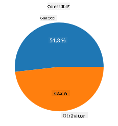
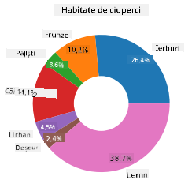
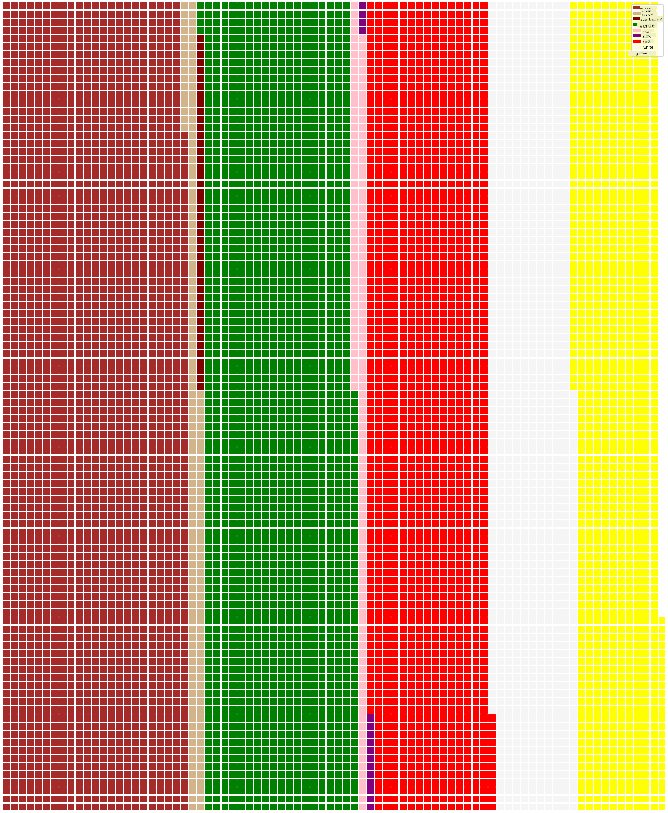

<!--
CO_OP_TRANSLATOR_METADATA:
{
  "original_hash": "af6a12015c6e250e500b570a9fa42593",
  "translation_date": "2025-08-26T17:29:37+00:00",
  "source_file": "3-Data-Visualization/11-visualization-proportions/README.md",
  "language_code": "ro"
}
-->
# Vizualizarea Proporțiilor

| ](../../sketchnotes/11-Visualizing-Proportions.png)|
|:---:|
|Vizualizarea Proporțiilor - _Sketchnote de [@nitya](https://twitter.com/nitya)_ |

În această lecție, vei folosi un set de date axat pe natură pentru a vizualiza proporții, cum ar fi câte tipuri diferite de ciuperci sunt prezente într-un set de date despre ciuperci. Hai să explorăm aceste ciuperci fascinante folosind un set de date provenit de la Audubon, care conține detalii despre 23 de specii de ciuperci cu lamele din familiile Agaricus și Lepiota. Vei experimenta cu vizualizări interesante precum:

- Grafice de tip plăcintă 🥧  
- Grafice de tip gogoașă 🍩  
- Grafice de tip vafă 🧇  

> 💡 Un proiect foarte interesant numit [Charticulator](https://charticulator.com) de la Microsoft Research oferă o interfață gratuită de tip drag-and-drop pentru vizualizări de date. În unul dintre tutorialele lor, folosesc și acest set de date despre ciuperci! Astfel, poți explora datele și învăța biblioteca în același timp: [Tutorial Charticulator](https://charticulator.com/tutorials/tutorial4.html).

## [Chestionar înainte de lecție](https://purple-hill-04aebfb03.1.azurestaticapps.net/quiz/20)

## Cunoaște-ți ciupercile 🍄

Ciupercile sunt foarte interesante. Hai să importăm un set de date pentru a le studia:

```python
import pandas as pd
import matplotlib.pyplot as plt
mushrooms = pd.read_csv('../../data/mushrooms.csv')
mushrooms.head()
```  
Se afișează un tabel cu date excelente pentru analiză:

| clasă     | formă pălărie | suprafață pălărie | culoare pălărie | vânătăi | miros    | atașare lamele | spațiere lamele | mărime lamele | culoare lamele | formă tulpină | rădăcină tulpină | suprafață tulpină deasupra inelului | suprafață tulpină sub inel | culoare tulpină deasupra inelului | culoare tulpină sub inel | tip voal | culoare voal | număr inele | tip inel | culoare spor | populație | habitat |
| --------- | ------------- | ----------------- | --------------- | ------- | -------- | -------------- | --------------- | ------------- | -------------- | ------------- | -------------- | ------------------------------- | -------------------------- | ------------------------------- | -------------------------- | -------- | ------------ | ----------- | -------- | ------------ | --------- | ------- |
| Otrăvitoare | Convexă      | Netedă            | Maro            | Vânătăi | Pungent  | Liber          | Apropiate       | Înguste       | Negru          | Lărgită       | Egal           | Netedă                          | Netedă                     | Albă                            | Albă                      | Parțial  | Alb          | Unul        | Pandantiv | Negru         | Răspândită | Urban   |
| Comestibilă | Convexă      | Netedă            | Galben          | Vânătăi | Migdale  | Liber          | Apropiate       | Late          | Negru          | Lărgită       | Club          | Netedă                          | Netedă                     | Albă                            | Albă                      | Parțial  | Alb          | Unul        | Pandantiv | Maro          | Numeroasă | Iarbă   |
| Comestibilă | Clopot       | Netedă            | Alb             | Vânătăi | Anason   | Liber          | Apropiate       | Late          | Maro           | Lărgită       | Club          | Netedă                          | Netedă                     | Albă                            | Albă                      | Parțial  | Alb          | Unul        | Pandantiv | Maro          | Numeroasă | Pajiști |
| Otrăvitoare | Convexă      | Solzoasă          | Alb             | Vânătăi | Pungent  | Liber          | Apropiate       | Înguste       | Maro           | Lărgită       | Egal           | Netedă                          | Netedă                     | Albă                            | Albă                      | Parțial  | Alb          | Unul        | Pandantiv | Negru         | Răspândită | Urban   |

Imediat observi că toate datele sunt textuale. Va trebui să convertești aceste date pentru a le putea folosi într-un grafic. Majoritatea datelor, de fapt, sunt reprezentate ca un obiect:

```python
print(mushrooms.select_dtypes(["object"]).columns)
```  

Rezultatul este:

```output
Index(['class', 'cap-shape', 'cap-surface', 'cap-color', 'bruises', 'odor',
       'gill-attachment', 'gill-spacing', 'gill-size', 'gill-color',
       'stalk-shape', 'stalk-root', 'stalk-surface-above-ring',
       'stalk-surface-below-ring', 'stalk-color-above-ring',
       'stalk-color-below-ring', 'veil-type', 'veil-color', 'ring-number',
       'ring-type', 'spore-print-color', 'population', 'habitat'],
      dtype='object')
```  
Ia aceste date și convertește coloana 'clasă' într-o categorie:

```python
cols = mushrooms.select_dtypes(["object"]).columns
mushrooms[cols] = mushrooms[cols].astype('category')
```  

```python
edibleclass=mushrooms.groupby(['class']).count()
edibleclass
```  

Acum, dacă afișezi datele despre ciuperci, poți vedea că au fost grupate în categorii conform claselor comestibile/otrăvitoare:

|           | formă pălărie | suprafață pălărie | culoare pălărie | vânătăi | miros | atașare lamele | spațiere lamele | mărime lamele | culoare lamele | formă tulpină | ... | suprafață tulpină sub inel | culoare tulpină deasupra inelului | culoare tulpină sub inel | tip voal | culoare voal | număr inele | tip inel | culoare spor | populație | habitat |
| --------- | ------------- | ----------------- | --------------- | ------- | ----- | -------------- | --------------- | ------------- | -------------- | ------------- | --- | -------------------------- | ------------------------------- | -------------------------- | -------- | ------------ | ----------- | -------- | ------------ | --------- | ------- |
| clasă     |               |                   |                 |         |       |                |                 |               |                |               |     |                          |                               |                          |          |              |             |          |              |           |         |
| Comestibilă | 4208         | 4208             | 4208            | 4208    | 4208  | 4208           | 4208            | 4208          | 4208           | 4208          | ... | 4208                     | 4208                          | 4208                     | 4208     | 4208         | 4208        | 4208     | 4208         | 4208      | 4208    |
| Otrăvitoare | 3916         | 3916             | 3916            | 3916    | 3916  | 3916           | 3916            | 3916          | 3916           | 3916          | ... | 3916                     | 3916                          | 3916                     | 3916     | 3916         | 3916        | 3916     | 3916         | 3916      | 3916    |

Dacă urmezi ordinea prezentată în acest tabel pentru a crea etichetele categoriei clasă, poți construi un grafic de tip plăcintă:

## Plăcintă!

```python
labels=['Edible','Poisonous']
plt.pie(edibleclass['population'],labels=labels,autopct='%.1f %%')
plt.title('Edible?')
plt.show()
```  
Voila, un grafic de tip plăcintă care arată proporțiile acestor date conform celor două clase de ciuperci. Este foarte important să obții ordinea etichetelor corectă, mai ales aici, așa că asigură-te că verifici ordinea în care este construit array-ul de etichete!



## Gogoși!

Un grafic de tip gogoașă este o variantă mai interesantă vizual a graficului de tip plăcintă, fiind un grafic de plăcintă cu o gaură în mijloc. Hai să ne uităm la datele noastre folosind această metodă.

Aruncă o privire la diversele habitate în care cresc ciupercile:

```python
habitat=mushrooms.groupby(['habitat']).count()
habitat
```  
Aici, grupezi datele după habitat. Sunt 7 listate, așa că folosește-le ca etichete pentru graficul de tip gogoașă:

```python
labels=['Grasses','Leaves','Meadows','Paths','Urban','Waste','Wood']

plt.pie(habitat['class'], labels=labels,
        autopct='%1.1f%%', pctdistance=0.85)
  
center_circle = plt.Circle((0, 0), 0.40, fc='white')
fig = plt.gcf()

fig.gca().add_artist(center_circle)
  
plt.title('Mushroom Habitats')
  
plt.show()
```  



Acest cod desenează un grafic și un cerc central, apoi adaugă acel cerc central în grafic. Modifică lățimea cercului central schimbând `0.40` cu o altă valoare.

Graficele de tip gogoașă pot fi ajustate în mai multe moduri pentru a schimba etichetele. Etichetele, în special, pot fi evidențiate pentru lizibilitate. Află mai multe în [documentație](https://matplotlib.org/stable/gallery/pie_and_polar_charts/pie_and_donut_labels.html?highlight=donut).

Acum că știi cum să grupezi datele și să le afișezi ca plăcintă sau gogoașă, poți explora alte tipuri de grafice. Încearcă un grafic de tip vafă, care este doar o altă modalitate de a explora cantitățile.

## Vafe!

Un grafic de tip 'vafă' este o modalitate diferită de a vizualiza cantitățile ca o matrice 2D de pătrate. Încearcă să vizualizezi diferitele cantități de culori ale pălăriilor de ciuperci din acest set de date. Pentru a face acest lucru, trebuie să instalezi o bibliotecă auxiliară numită [PyWaffle](https://pypi.org/project/pywaffle/) și să folosești Matplotlib:

```python
pip install pywaffle
```  

Selectează un segment din datele tale pentru a le grupa:

```python
capcolor=mushrooms.groupby(['cap-color']).count()
capcolor
```  

Creează un grafic de tip vafă prin crearea etichetelor și apoi gruparea datelor:

```python
import pandas as pd
import matplotlib.pyplot as plt
from pywaffle import Waffle
  
data ={'color': ['brown', 'buff', 'cinnamon', 'green', 'pink', 'purple', 'red', 'white', 'yellow'],
    'amount': capcolor['class']
     }
  
df = pd.DataFrame(data)
  
fig = plt.figure(
    FigureClass = Waffle,
    rows = 100,
    values = df.amount,
    labels = list(df.color),
    figsize = (30,30),
    colors=["brown", "tan", "maroon", "green", "pink", "purple", "red", "whitesmoke", "yellow"],
)
```  

Folosind un grafic de tip vafă, poți vedea clar proporțiile culorilor pălăriilor din acest set de date despre ciuperci. Interesant, există multe ciuperci cu pălării verzi!



✅ Pywaffle suportă utilizarea de pictograme în grafice care folosesc orice pictogramă disponibilă în [Font Awesome](https://fontawesome.com/). Fă câteva experimente pentru a crea un grafic de tip vafă și mai interesant folosind pictograme în loc de pătrate.

În această lecție, ai învățat trei modalități de a vizualiza proporțiile. Mai întâi, trebuie să grupezi datele în categorii și apoi să decizi care este cea mai bună modalitate de a afișa datele - plăcintă, gogoașă sau vafă. Toate sunt delicioase și oferă utilizatorului o imagine instantanee a unui set de date.

## 🚀 Provocare

Încearcă să recreezi aceste grafice delicioase în [Charticulator](https://charticulator.com).  
## [Chestionar după lecție](https://purple-hill-04aebfb03.1.azurestaticapps.net/quiz/21)

## Recapitulare & Studiu Individual

Uneori nu este evident când să folosești un grafic de tip plăcintă, gogoașă sau vafă. Iată câteva articole pe acest subiect:

https://www.beautiful.ai/blog/battle-of-the-charts-pie-chart-vs-donut-chart  

https://medium.com/@hypsypops/pie-chart-vs-donut-chart-showdown-in-the-ring-5d24fd86a9ce  

https://www.mit.edu/~mbarker/formula1/f1help/11-ch-c6.htm  

https://medium.datadriveninvestor.com/data-visualization-done-the-right-way-with-tableau-waffle-chart-fdf2a19be402  

Fă cercetări pentru a găsi mai multe informații despre această decizie dificilă.  

## Temă

[Încearcă în Excel](assignment.md)  

---

**Declinare de responsabilitate**:  
Acest document a fost tradus folosind serviciul de traducere AI [Co-op Translator](https://github.com/Azure/co-op-translator). Deși ne străduim să asigurăm acuratețea, vă rugăm să fiți conștienți că traducerile automate pot conține erori sau inexactități. Documentul original în limba sa natală ar trebui considerat sursa autoritară. Pentru informații critice, se recomandă traducerea profesională realizată de un specialist uman. Nu ne asumăm responsabilitatea pentru eventualele neînțelegeri sau interpretări greșite care pot apărea din utilizarea acestei traduceri.