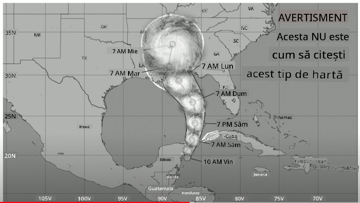
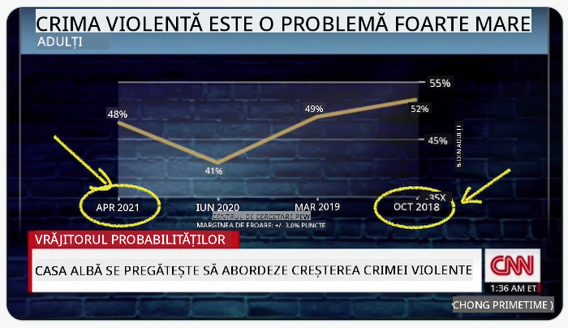
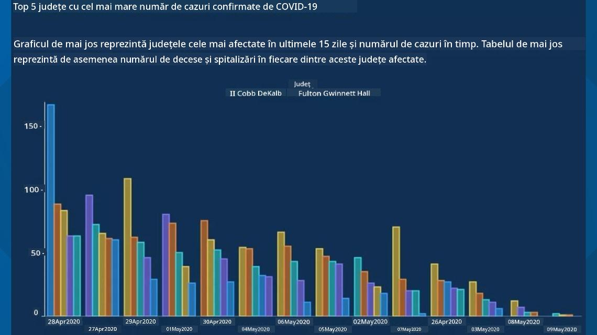
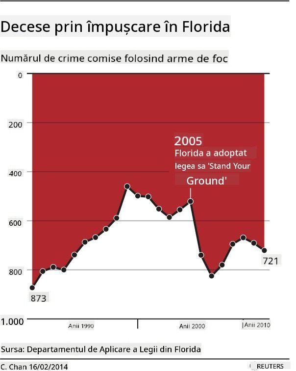
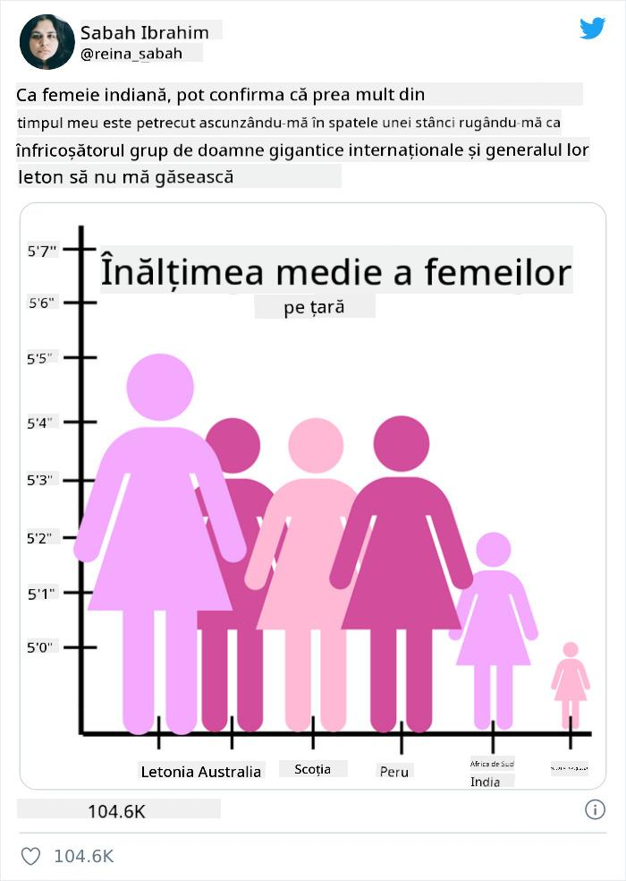
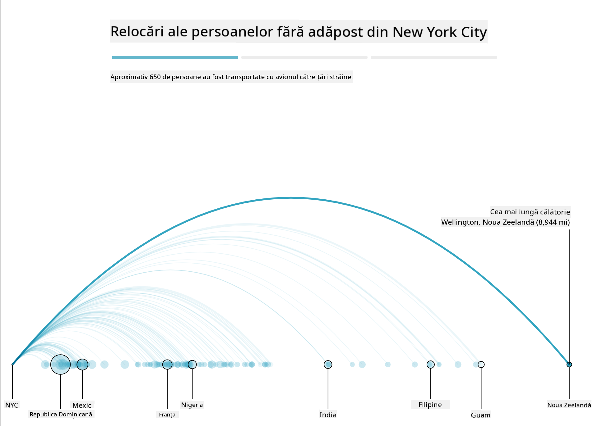
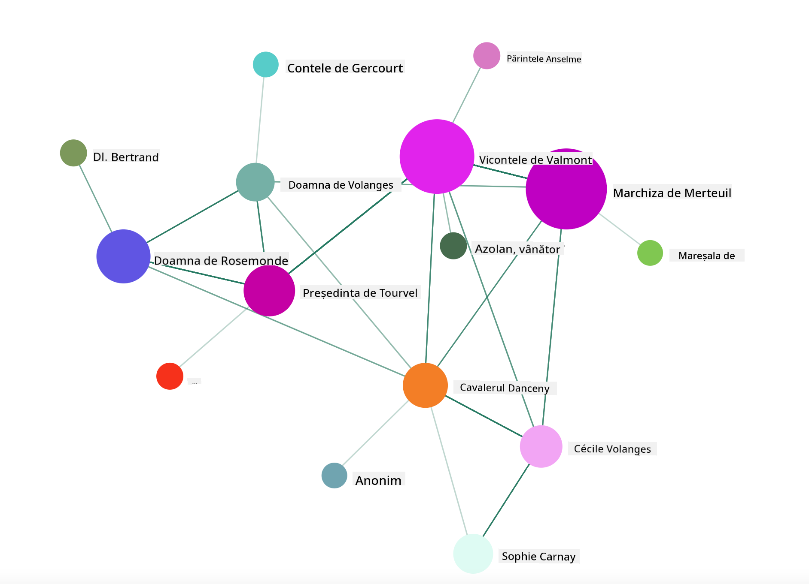

<!--
CO_OP_TRANSLATOR_METADATA:
{
  "original_hash": "4ec4747a9f4f7d194248ea29903ae165",
  "translation_date": "2025-08-26T16:45:13+00:00",
  "source_file": "3-Data-Visualization/13-meaningful-visualizations/README.md",
  "language_code": "ro"
}
-->
# Crearea Vizualizărilor Semnificative

| ](../../sketchnotes/13-MeaningfulViz.png)|
|:---:|
| Vizualizări Semnificative - _Sketchnote de [@nitya](https://twitter.com/nitya)_ |

> "Dacă torturezi datele suficient de mult, vor mărturisi orice" -- [Ronald Coase](https://en.wikiquote.org/wiki/Ronald_Coase)

Una dintre abilitățile de bază ale unui specialist în știința datelor este capacitatea de a crea o vizualizare semnificativă a datelor care să ajute la răspunsul întrebărilor pe care le ai. Înainte de a vizualiza datele, trebuie să te asiguri că acestea au fost curățate și pregătite, așa cum ai făcut în lecțiile anterioare. După aceea, poți începe să decizi cum să prezinți cel mai bine datele.

În această lecție, vei revizui:

1. Cum să alegi tipul potrivit de grafic
2. Cum să eviți graficele înșelătoare
3. Cum să lucrezi cu culorile
4. Cum să stilizezi graficele pentru lizibilitate
5. Cum să construiești soluții animate sau 3D pentru grafice
6. Cum să creezi o vizualizare creativă

## [Chestionar înainte de lecție](https://purple-hill-04aebfb03.1.azurestaticapps.net/quiz/24)

## Alege tipul potrivit de grafic

În lecțiile anterioare, ai experimentat construirea diferitelor tipuri de vizualizări interesante folosind Matplotlib și Seaborn. În general, poți selecta [tipul potrivit de grafic](https://chartio.com/learn/charts/how-to-select-a-data-vizualization/) pentru întrebarea pe care o pui, utilizând acest tabel:

| Ai nevoie să:              | Ar trebui să folosești:         |
| -------------------------- | ------------------------------- |
| Arăți tendințele în timp   | Linie                           |
| Compari categorii          | Bară, Plăcintă                 |
| Compari totaluri           | Plăcintă, Bară stivuită         |
| Arăți relații              | Puncte, Linie, Facet, Linie dublă |
| Arăți distribuții          | Puncte, Histogramă, Cutie       |
| Arăți proporții            | Plăcintă, Gogoșă, Waffle        |

> ✅ În funcție de structura datelor tale, s-ar putea să fie nevoie să le convertești din text în numeric pentru a putea utiliza un anumit tip de grafic.

## Evită înșelăciunea

Chiar dacă un specialist în știința datelor este atent să aleagă graficul potrivit pentru datele potrivite, există multe moduri în care datele pot fi prezentate pentru a susține un punct de vedere, deseori în detrimentul adevărului. Există numeroase exemple de grafice și infografice înșelătoare!

[](https://www.youtube.com/watch?v=oX74Nge8Wkw "Cum mint graficele")

> 🎥 Fă clic pe imaginea de mai sus pentru o prezentare despre graficele înșelătoare

Acest grafic inversează axa X pentru a arăta opusul adevărului, pe baza datelor:



[Acest grafic](https://media.firstcoastnews.com/assets/WTLV/images/170ae16f-4643-438f-b689-50d66ca6a8d8/170ae16f-4643-438f-b689-50d66ca6a8d8_1140x641.jpg) este și mai înșelător, deoarece privirea este atrasă spre dreapta pentru a concluziona că, în timp, cazurile de COVID au scăzut în diferite județe. De fapt, dacă te uiți atent la date, vei observa că acestea au fost rearanjate pentru a crea o tendință descendentă falsă.



Acest exemplu notoriu folosește culoarea ȘI o axă Y inversată pentru a induce în eroare: în loc să concluzionezi că decesele prin arme au crescut după adoptarea legislației favorabile armelor, privirea este păcălită să creadă opusul:



Acest grafic ciudat arată cum proporțiile pot fi manipulate, cu un efect hilar:



Compararea incomparabilului este o altă tactică dubioasă. Există un [site web minunat](https://tylervigen.com/spurious-correlations) dedicat 'corelațiilor false', care afișează 'fapte' ce corelează, de exemplu, rata divorțurilor din Maine cu consumul de margarină. Un grup de pe Reddit colectează, de asemenea, [utilizările urâte](https://www.reddit.com/r/dataisugly/top/?t=all) ale datelor.

Este important să înțelegi cât de ușor poate fi păcălită privirea de graficele înșelătoare. Chiar dacă intenția specialistului în date este bună, alegerea unui tip greșit de grafic, cum ar fi un grafic de tip plăcintă cu prea multe categorii, poate fi înșelătoare.

## Culoare

Ai văzut în graficul despre 'violența cu arme din Florida' cum culoarea poate adăuga un strat suplimentar de semnificație graficelor, mai ales celor care nu sunt create folosind biblioteci precum Matplotlib și Seaborn, care vin cu diverse palete de culori verificate. Dacă faci un grafic manual, studiază puțin [teoria culorilor](https://colormatters.com/color-and-design/basic-color-theory).

> ✅ Fii conștient, atunci când proiectezi grafice, că accesibilitatea este un aspect important al vizualizării. Unii dintre utilizatorii tăi ar putea fi daltoniști - graficul tău este vizibil pentru utilizatorii cu deficiențe vizuale?

Fii atent când alegi culorile pentru graficul tău, deoarece culoarea poate transmite un sens pe care nu intenționezi să-l comunici. 'Doamnele roz' din graficul despre 'înălțime' de mai sus transmit un sens distinct 'feminin', care adaugă la ciudățenia graficului în sine.

Deși [semnificația culorilor](https://colormatters.com/color-symbolism/the-meanings-of-colors) poate varia în diferite părți ale lumii și tinde să se schimbe în funcție de nuanță, în general, semnificațiile culorilor includ:

| Culoare | Semnificație         |
| ------- | -------------------- |
| roșu    | putere              |
| albastru| încredere, loialitate|
| galben  | fericire, precauție |
| verde   | ecologie, noroc, invidie |
| mov     | fericire            |
| portocaliu | vitalitate        |

Dacă trebuie să creezi un grafic cu culori personalizate, asigură-te că graficele tale sunt atât accesibile, cât și că culoarea aleasă coincide cu semnificația pe care încerci să o transmiți.

## Stilizarea graficelor pentru lizibilitate

Graficele nu sunt semnificative dacă nu sunt lizibile! Acordă-ți un moment pentru a considera stilizarea lățimii și înălțimii graficului astfel încât să se potrivească bine cu datele tale. Dacă trebuie să afișezi o variabilă (cum ar fi toate cele 50 de state), afișează-le vertical pe axa Y, dacă este posibil, pentru a evita un grafic care necesită derulare orizontală.

Etichetează axele, oferă o legendă dacă este necesar și adaugă tooltips pentru o mai bună înțelegere a datelor.

Dacă datele tale sunt textuale și verbose pe axa X, poți înclina textul pentru o mai bună lizibilitate. [Matplotlib](https://matplotlib.org/stable/tutorials/toolkits/mplot3d.html) oferă și graficare 3D, dacă datele tale o permit. Vizualizări sofisticate pot fi produse folosind `mpl_toolkits.mplot3d`.


## Animație și afișare grafică 3D

Unele dintre cele mai bune vizualizări de date de astăzi sunt animate. Shirley Wu are exemple uimitoare realizate cu D3, cum ar fi '[film flowers](http://bl.ocks.org/sxywu/raw/d612c6c653fb8b4d7ff3d422be164a5d/)', unde fiecare floare este o vizualizare a unui film. Un alt exemplu pentru The Guardian este 'bussed out', o experiență interactivă care combină vizualizările cu Greensock și D3, plus un format de articol narativ pentru a arăta cum NYC gestionează problema persoanelor fără adăpost, trimițându-le în afara orașului.



> "Bussed Out: Cum America își mută persoanele fără adăpost" de la [The Guardian](https://www.theguardian.com/us-news/ng-interactive/2017/dec/20/bussed-out-america-moves-homeless-people-country-study). Vizualizări de Nadieh Bremer & Shirley Wu

Deși această lecție nu este suficientă pentru a intra în detalii despre aceste biblioteci puternice de vizualizare, încearcă să folosești D3 într-o aplicație Vue.js utilizând o bibliotecă pentru a afișa o vizualizare a cărții "Legături Primejdioase" ca o rețea socială animată.

> "Les Liaisons Dangereuses" este un roman epistolar, sau un roman prezentat ca o serie de scrisori. Scris în 1782 de Choderlos de Laclos, povestește despre manevrele sociale viclene și lipsite de moralitate ale doi protagoniști rivali ai aristocrației franceze din secolul al XVIII-lea, Vicomte de Valmont și Marchiza de Merteuil. Ambii își găsesc sfârșitul în cele din urmă, dar nu înainte de a provoca multe daune sociale. Romanul se desfășoară ca o serie de scrisori scrise către diverse persoane din cercurile lor, complotând pentru răzbunare sau pur și simplu pentru a crea probleme. Creează o vizualizare a acestor scrisori pentru a descoperi personajele principale ale narațiunii, în mod vizual.

Vei finaliza o aplicație web care va afișa o vedere animată a acestei rețele sociale. Aceasta folosește o bibliotecă construită pentru a crea o [vizualizare a unei rețele](https://github.com/emiliorizzo/vue-d3-network) utilizând Vue.js și D3. Când aplicația rulează, poți trage nodurile pe ecran pentru a rearanja datele.



## Proiect: Construiește un grafic pentru a arăta o rețea folosind D3.js

> Acest folder al lecției include un folder `solution` unde poți găsi proiectul complet, pentru referință.

1. Urmează instrucțiunile din fișierul README.md din folderul rădăcină al starter-ului. Asigură-te că ai NPM și Node.js instalate pe mașina ta înainte de a instala dependențele proiectului.

2. Deschide folderul `starter/src`. Vei găsi un folder `assets` unde există un fișier .json cu toate scrisorile din roman, numerotate, cu o adnotare 'to' și 'from'.

3. Completează codul din `components/Nodes.vue` pentru a activa vizualizarea. Caută metoda numită `createLinks()` și adaugă următorul loop imbricat.

Parcurge obiectul .json pentru a captura datele 'to' și 'from' ale scrisorilor și construiește obiectul `links` astfel încât biblioteca de vizualizare să îl poată consuma:

```javascript
//loop through letters
      let f = 0;
      let t = 0;
      for (var i = 0; i < letters.length; i++) {
          for (var j = 0; j < characters.length; j++) {
              
            if (characters[j] == letters[i].from) {
              f = j;
            }
            if (characters[j] == letters[i].to) {
              t = j;
            }
        }
        this.links.push({ sid: f, tid: t });
      }
  ```

Rulează aplicația din terminal (npm run serve) și bucură-te de vizualizare!

## 🚀 Provocare

Fă un tur pe internet pentru a descoperi vizualizări înșelătoare. Cum păcălește autorul utilizatorul și este intenționat? Încearcă să corectezi vizualizările pentru a arăta cum ar trebui să arate.

## [Chestionar după lecție](https://purple-hill-04aebfb03.1.azurestaticapps.net/quiz/25)

## Recapitulare și Studiu Individual

Iată câteva articole despre vizualizările de date înșelătoare:

https://gizmodo.com/how-to-lie-with-data-visualization-1563576606

http://ixd.prattsi.org/2017/12/visual-lies-usability-in-deceptive-data-visualizations/

Aruncă o privire la aceste vizualizări interesante pentru active și artefacte istorice:

https://handbook.pubpub.org/

Citește acest articol despre cum animația poate îmbunătăți vizualizările:

https://medium.com/@EvanSinar/use-animation-to-supercharge-data-visualization-cd905a882ad4

## Temă

[Construiește propria ta vizualizare personalizată](assignment.md)

---

**Declinare de responsabilitate**:  
Acest document a fost tradus folosind serviciul de traducere AI [Co-op Translator](https://github.com/Azure/co-op-translator). Deși ne străduim să asigurăm acuratețea, vă rugăm să rețineți că traducerile automate pot conține erori sau inexactități. Documentul original în limba sa natală ar trebui considerat sursa autoritară. Pentru informații critice, se recomandă traducerea profesională realizată de un specialist uman. Nu ne asumăm responsabilitatea pentru eventualele neînțelegeri sau interpretări greșite care pot apărea din utilizarea acestei traduceri.