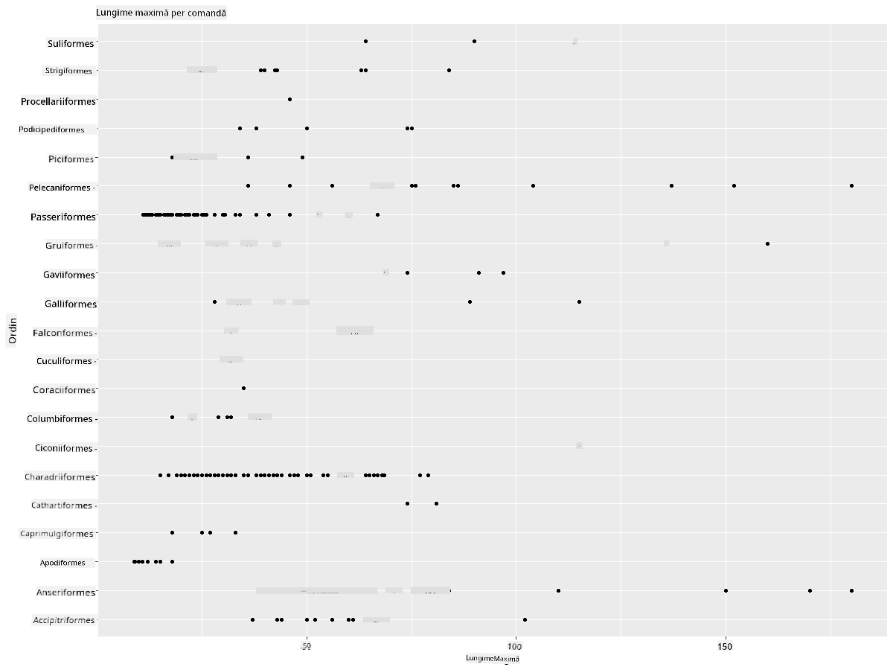
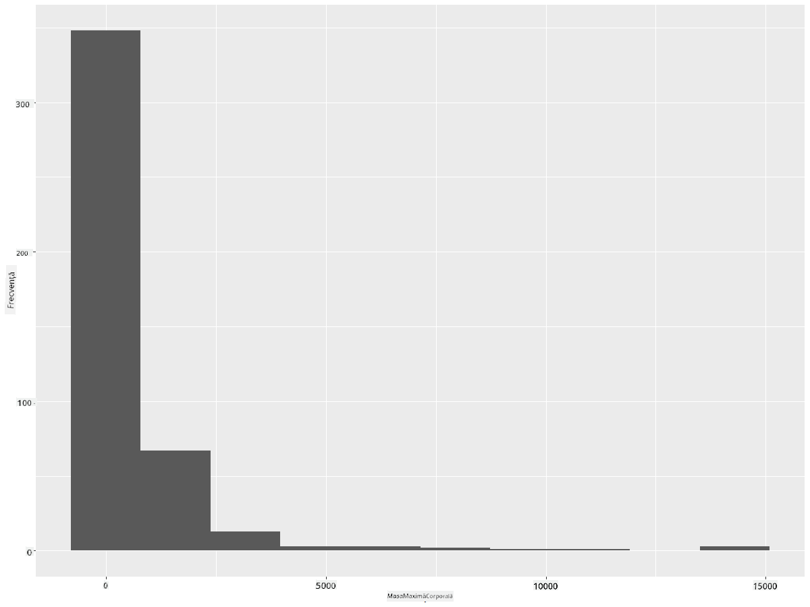
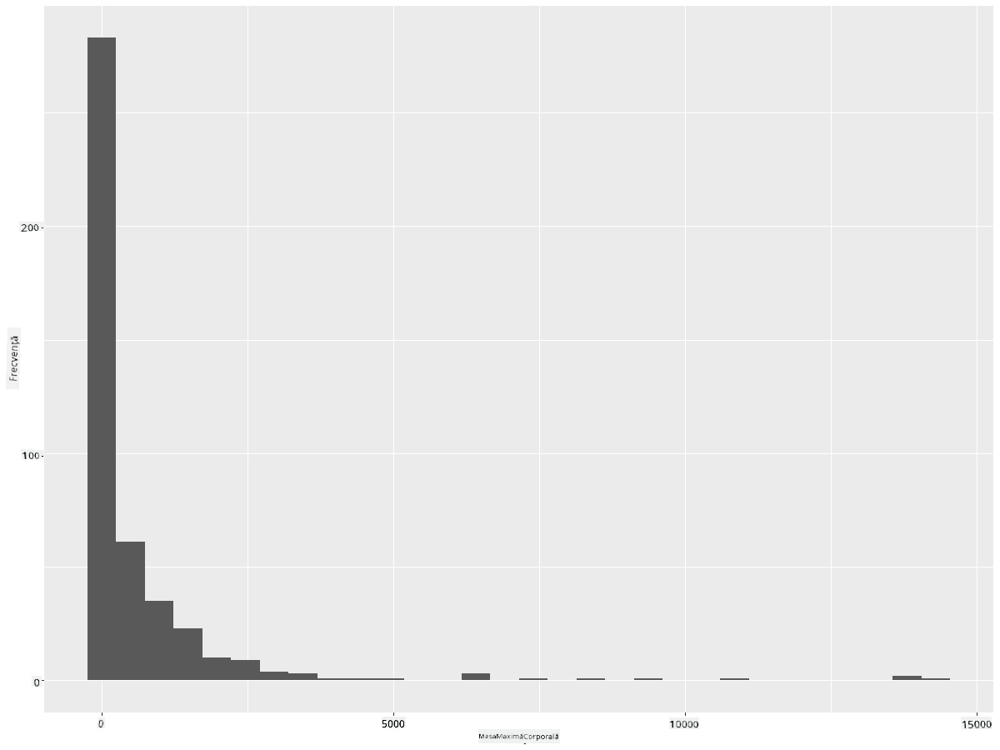
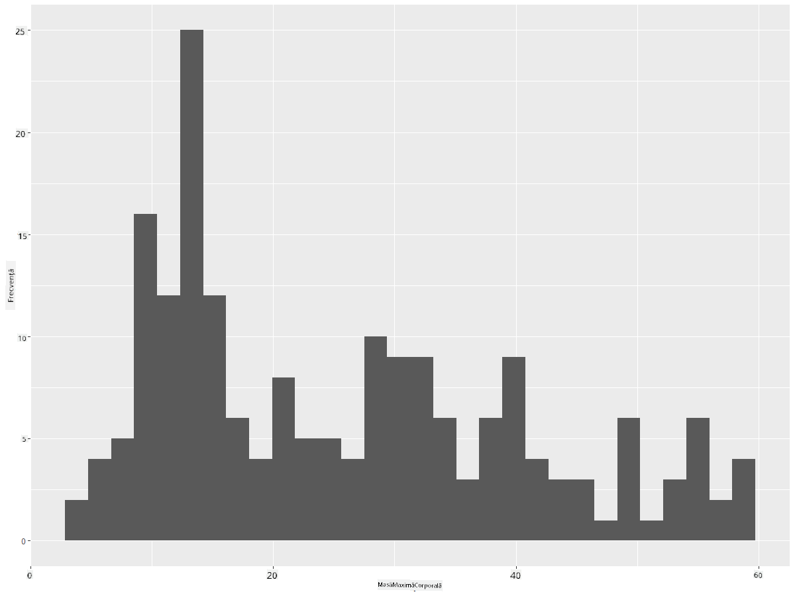
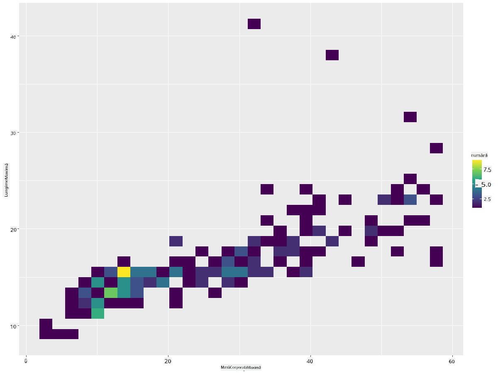
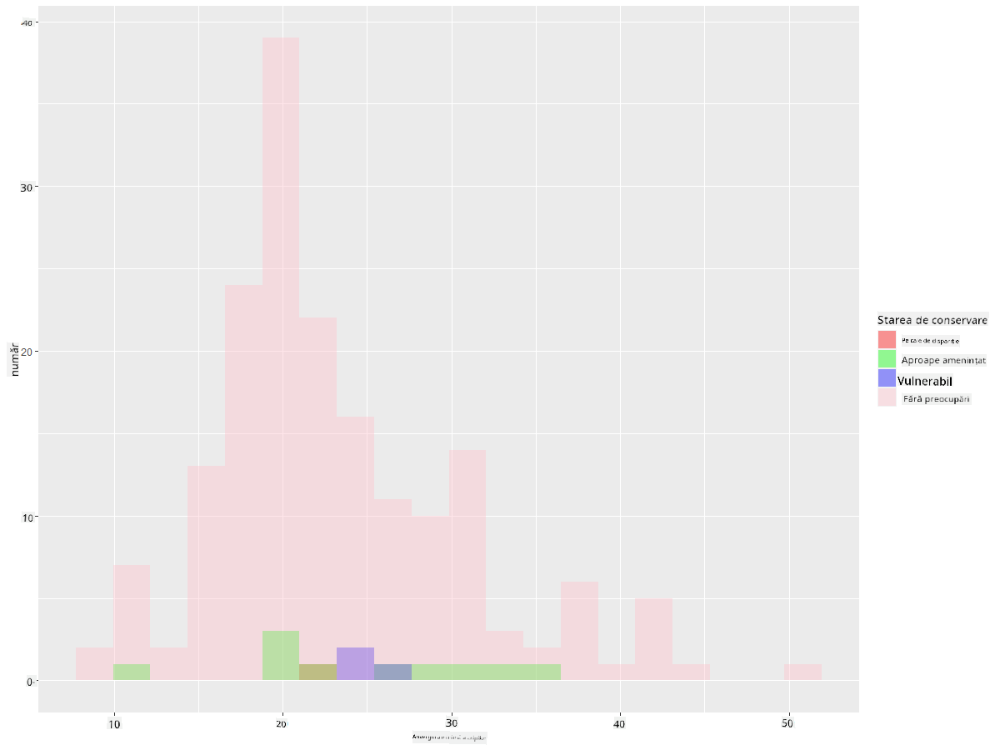
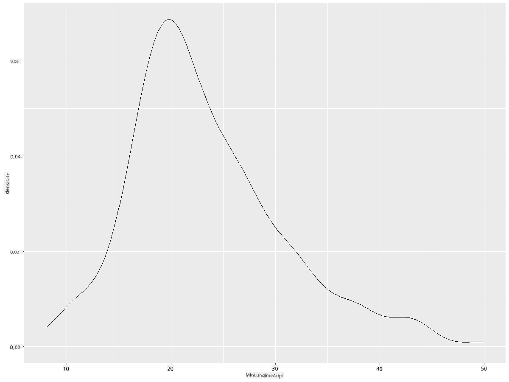
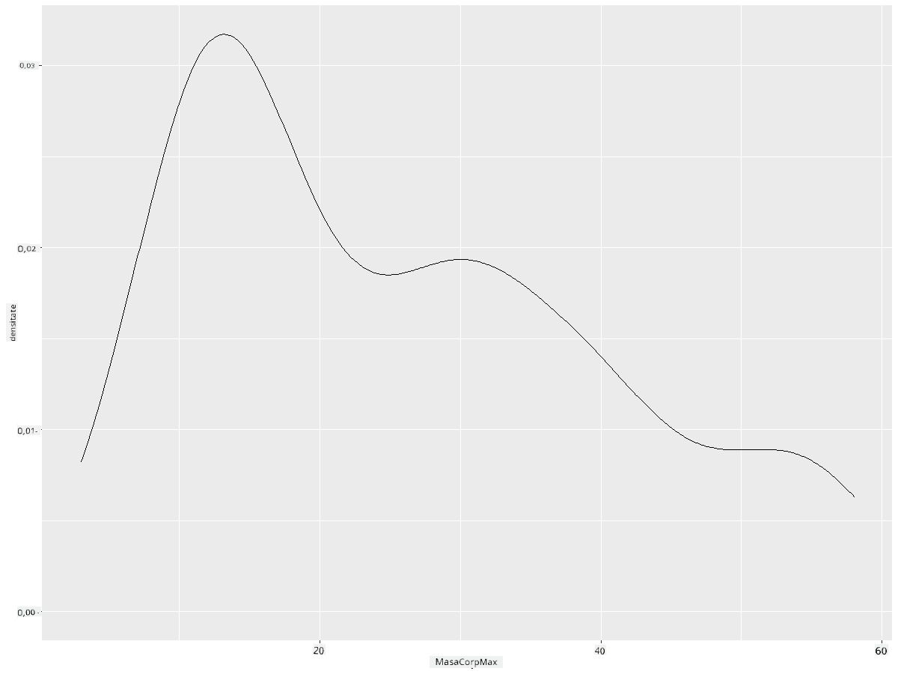
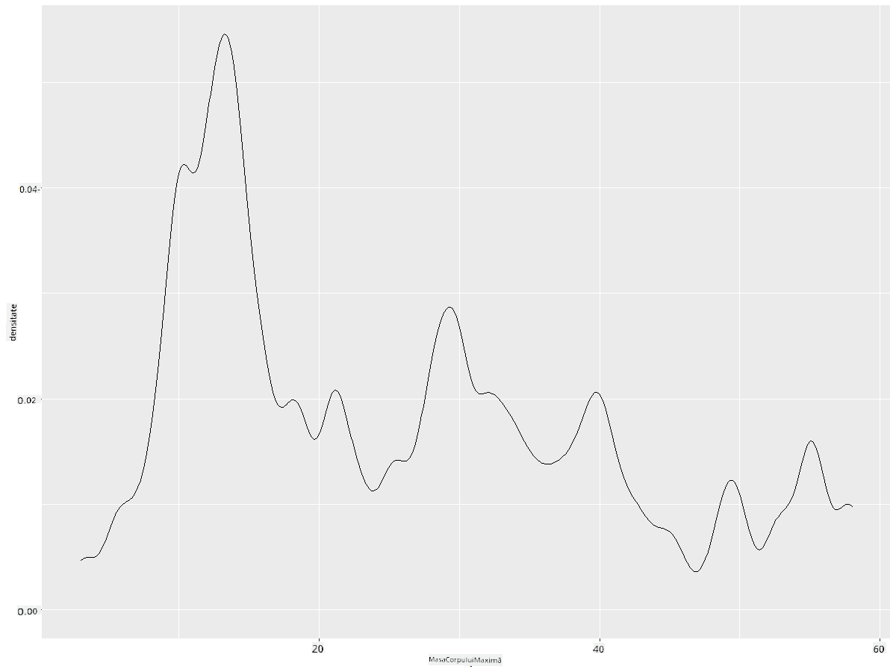
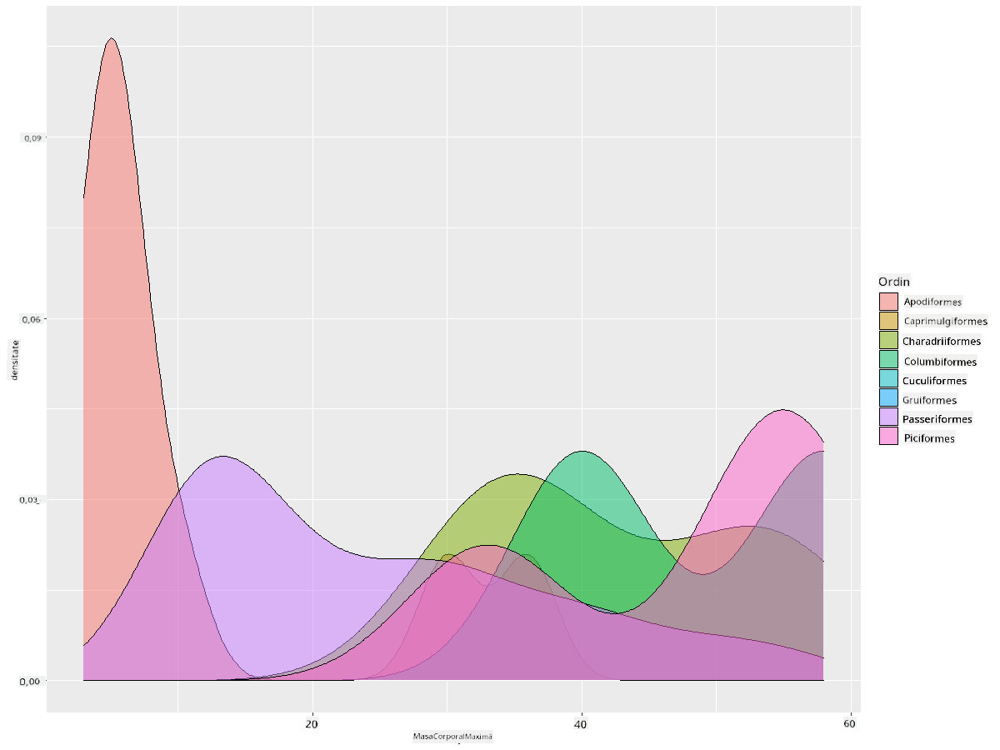

<!--
CO_OP_TRANSLATOR_METADATA:
{
  "original_hash": "ea67c0c40808fd723594de6896c37ccf",
  "translation_date": "2025-08-26T17:00:55+00:00",
  "source_file": "3-Data-Visualization/R/10-visualization-distributions/README.md",
  "language_code": "ro"
}
-->
# Vizualizarea distribuțiilor

| ](https://github.com/microsoft/Data-Science-For-Beginners/blob/main/sketchnotes/10-Visualizing-Distributions.png)|
|:---:|
| Vizualizarea distribuțiilor - _Sketchnote de [@nitya](https://twitter.com/nitya)_ |

În lecția anterioară, ai învățat câteva lucruri interesante despre un set de date despre păsările din Minnesota. Ai descoperit unele date eronate vizualizând valorile extreme și ai analizat diferențele dintre categoriile de păsări în funcție de lungimea lor maximă.

## [Chestionar înainte de lecție](https://purple-hill-04aebfb03.1.azurestaticapps.net/quiz/18)
## Explorează setul de date despre păsări

O altă modalitate de a analiza datele este prin examinarea distribuției lor, adică modul în care datele sunt organizate de-a lungul unui ax. Poate, de exemplu, ai vrea să afli despre distribuția generală, pentru acest set de date, a anvergurii maxime a aripilor sau a masei corporale maxime pentru păsările din Minnesota.

Hai să descoperim câteva informații despre distribuțiile datelor din acest set de date. În consola R, importă `ggplot2` și baza de date. Elimină valorile extreme din baza de date, la fel ca în subiectul anterior.

```r
library(ggplot2)

birds <- read.csv("../../data/birds.csv",fileEncoding="UTF-8-BOM")

birds_filtered <- subset(birds, MaxWingspan < 500)
head(birds_filtered)
```
|      | Nume                         | NumeȘtiințific         | Categorie             | Ordin        | Familie  | Gen         | StatusConservare    | LungimeMinimă | LungimeMaximă | MasăCorpMinimă | MasăCorpMaximă | AnvergurăMinimă | AnvergurăMaximă |
| ---: | :--------------------------- | :--------------------- | :-------------------- | :----------- | :------- | :---------- | :----------------- | ------------: | ------------: | -------------: | -------------: | --------------: | --------------: |
|    0 | Rața fluierătoare cu burtă neagră | Dendrocygna autumnalis | Rațe/Gâște/Păsări acvatice | Anseriformes | Anatidae | Dendrocygna | LC                 |            47 |            56 |             652 |            1020 |              76 |              94 |
|    1 | Rața fluierătoare fulvoasă       | Dendrocygna bicolor    | Rațe/Gâște/Păsări acvatice | Anseriformes | Anatidae | Dendrocygna | LC                 |            45 |            53 |             712 |            1050 |              85 |              93 |
|    2 | Gâsca de zăpadă                 | Anser caerulescens     | Rațe/Gâște/Păsări acvatice | Anseriformes | Anatidae | Anser       | LC                 |            64 |            79 |            2050 |            4050 |             135 |             165 |
|    3 | Gâsca lui Ross                 | Anser rossii           | Rațe/Gâște/Păsări acvatice | Anseriformes | Anatidae | Anser       | LC                 |          57.3 |            64 |            1066 |            1567 |             113 |             116 |
|    4 | Gâsca albă cu frunte mare      | Anser albifrons        | Rațe/Gâște/Păsări acvatice | Anseriformes | Anatidae | Anser       | LC                 |            64 |            81 |            1930 |            3310 |             130 |             165 |

În general, poți analiza rapid modul în care datele sunt distribuite utilizând un grafic de dispersie, așa cum am făcut în lecția anterioară:

```r
ggplot(data=birds_filtered, aes(x=Order, y=MaxLength,group=1)) +
  geom_point() +
  ggtitle("Max Length per order") + coord_flip()
```


Acest grafic oferă o privire de ansamblu asupra distribuției generale a lungimii corpului per Ordin de păsări, dar nu este cea mai bună modalitate de a afișa distribuțiile reale. Această sarcină este de obicei realizată prin crearea unui histogramă.
## Lucrul cu histograme

`ggplot2` oferă modalități foarte bune de a vizualiza distribuția datelor utilizând histograme. Acest tip de grafic este similar cu un grafic cu bare, unde distribuția poate fi observată prin creșterea și scăderea barelor. Pentru a construi o histogramă, ai nevoie de date numerice. Pentru a construi o histogramă, poți crea un grafic definind tipul ca 'hist' pentru histogramă. Acest grafic arată distribuția masei corporale maxime pentru întreaga gamă de date numerice din setul de date. Prin împărțirea array-ului de date în secțiuni mai mici, poate afișa distribuția valorilor datelor:

```r
ggplot(data = birds_filtered, aes(x = MaxBodyMass)) + 
  geom_histogram(bins=10)+ylab('Frequency')
```


După cum poți vedea, majoritatea celor 400+ păsări din acest set de date se încadrează în intervalul de sub 2000 pentru masa corporală maximă. Obține mai multe informații despre date modificând parametrul `bins` la un număr mai mare, cum ar fi 30:

```r
ggplot(data = birds_filtered, aes(x = MaxBodyMass)) + geom_histogram(bins=30)+ylab('Frequency')
```



Acest grafic arată distribuția într-un mod puțin mai detaliat. Un grafic mai puțin înclinat spre stânga ar putea fi creat asigurându-te că selectezi doar datele dintr-un anumit interval:

Filtrează datele pentru a obține doar acele păsări a căror masă corporală este sub 60 și afișează 30 de `bins`:

```r
birds_filtered_1 <- subset(birds_filtered, MaxBodyMass > 1 & MaxBodyMass < 60)
ggplot(data = birds_filtered_1, aes(x = MaxBodyMass)) + 
  geom_histogram(bins=30)+ylab('Frequency')
```



✅ Încearcă alte filtre și puncte de date. Pentru a vedea distribuția completă a datelor, elimină filtrul `['MaxBodyMass']` pentru a afișa distribuțiile etichetate.

Histogramele oferă și câteva îmbunătățiri de culoare și etichetare pe care le poți încerca:

Creează o histogramă 2D pentru a compara relația dintre două distribuții. Să comparăm `MaxBodyMass` vs. `MaxLength`. `ggplot2` oferă o modalitate integrată de a arăta convergența utilizând culori mai luminoase:

```r
ggplot(data=birds_filtered_1, aes(x=MaxBodyMass, y=MaxLength) ) +
  geom_bin2d() +scale_fill_continuous(type = "viridis")
```
Pare să existe o corelație așteptată între aceste două elemente de-a lungul unui ax previzibil, cu un punct de convergență deosebit de puternic:



Histogramele funcționează bine în mod implicit pentru date numerice. Ce se întâmplă dacă trebuie să vezi distribuții în funcție de date text? 
## Explorează setul de date pentru distribuții utilizând date text 

Acest set de date include, de asemenea, informații bune despre categoria păsării și genul, specia și familia acesteia, precum și statusul de conservare. Să analizăm aceste informații despre conservare. Care este distribuția păsărilor în funcție de statusul lor de conservare?

> ✅ În setul de date, sunt utilizate mai multe acronime pentru a descrie statusul de conservare. Aceste acronime provin de la [IUCN Red List Categories](https://www.iucnredlist.org/), o organizație care cataloghează statusul speciilor.
> 
> - CR: Critic Periclitat
> - EN: Periclitat
> - EX: Extinct
> - LC: Fără Griji
> - NT: Aproape Amenințat
> - VU: Vulnerabil

Acestea sunt valori bazate pe text, așa că va trebui să faci o transformare pentru a crea o histogramă. Utilizând dataframe-ul filteredBirds, afișează statusul de conservare alături de anvergura minimă a aripilor. Ce observi? 

```r
birds_filtered_1$ConservationStatus[birds_filtered_1$ConservationStatus == 'EX'] <- 'x1' 
birds_filtered_1$ConservationStatus[birds_filtered_1$ConservationStatus == 'CR'] <- 'x2'
birds_filtered_1$ConservationStatus[birds_filtered_1$ConservationStatus == 'EN'] <- 'x3'
birds_filtered_1$ConservationStatus[birds_filtered_1$ConservationStatus == 'NT'] <- 'x4'
birds_filtered_1$ConservationStatus[birds_filtered_1$ConservationStatus == 'VU'] <- 'x5'
birds_filtered_1$ConservationStatus[birds_filtered_1$ConservationStatus == 'LC'] <- 'x6'

ggplot(data=birds_filtered_1, aes(x = MinWingspan, fill = ConservationStatus)) +
  geom_histogram(position = "identity", alpha = 0.4, bins = 20) +
  scale_fill_manual(name="Conservation Status",values=c("red","green","blue","pink"),labels=c("Endangered","Near Threathened","Vulnerable","Least Concern"))
```



Nu pare să existe o corelație bună între anvergura minimă a aripilor și statusul de conservare. Testează alte elemente ale setului de date utilizând această metodă. Poți încerca diferite filtre. Găsești vreo corelație?

## Grafice de densitate

Poate ai observat că histogramele pe care le-am analizat până acum sunt „în trepte” și nu curg lin într-un arc. Pentru a afișa un grafic de densitate mai lin, poți încerca un grafic de densitate.

Să lucrăm acum cu grafice de densitate!

```r
ggplot(data = birds_filtered_1, aes(x = MinWingspan)) + 
  geom_density()
```


Poți vedea cum graficul reflectă cel anterior pentru datele despre anvergura minimă a aripilor; este doar puțin mai lin. Dacă ai vrea să revizitezi acea linie „în trepte” a masei corporale maxime din al doilea grafic pe care l-ai construit, ai putea să o netezești foarte bine recreând-o utilizând această metodă:

```r
ggplot(data = birds_filtered_1, aes(x = MaxBodyMass)) + 
  geom_density()
```


Dacă ai vrea o linie netedă, dar nu prea netedă, editează parametrul `adjust`: 

```r
ggplot(data = birds_filtered_1, aes(x = MaxBodyMass)) + 
  geom_density(adjust = 1/5)
```


✅ Citește despre parametrii disponibili pentru acest tip de grafic și experimentează!

Acest tip de grafic oferă vizualizări explicative frumoase. Cu câteva linii de cod, de exemplu, poți afișa densitatea masei corporale maxime per Ordin de păsări:

```r
ggplot(data=birds_filtered_1,aes(x = MaxBodyMass, fill = Order)) +
  geom_density(alpha=0.5)
```


## 🚀 Provocare

Histogramele sunt un tip de grafic mai sofisticat decât graficele de dispersie, graficele cu bare sau graficele liniare de bază. Caută pe internet exemple bune de utilizare a histogramelor. Cum sunt utilizate, ce demonstrează și în ce domenii sau arii de cercetare tind să fie utilizate?

## [Chestionar după lecție](https://purple-hill-04aebfb03.1.azurestaticapps.net/quiz/19)

## Recapitulare și Studiu Individual

În această lecție, ai utilizat `ggplot2` și ai început să creezi grafice mai sofisticate. Fă cercetări despre `geom_density_2d()`, o „curbă de densitate a probabilității continue într-una sau mai multe dimensiuni”. Citește [documentația](https://ggplot2.tidyverse.org/reference/geom_density_2d.html) pentru a înțelege cum funcționează.

## Temă

[Aplică-ți abilitățile](assignment.md)

---

**Declinare de responsabilitate**:  
Acest document a fost tradus folosind serviciul de traducere AI [Co-op Translator](https://github.com/Azure/co-op-translator). Deși ne străduim să asigurăm acuratețea, vă rugăm să fiți conștienți că traducerile automate pot conține erori sau inexactități. Documentul original în limba sa natală ar trebui considerat sursa autoritară. Pentru informații critice, se recomandă traducerea profesională realizată de un specialist uman. Nu ne asumăm responsabilitatea pentru eventualele neînțelegeri sau interpretări greșite care pot apărea din utilizarea acestei traduceri.