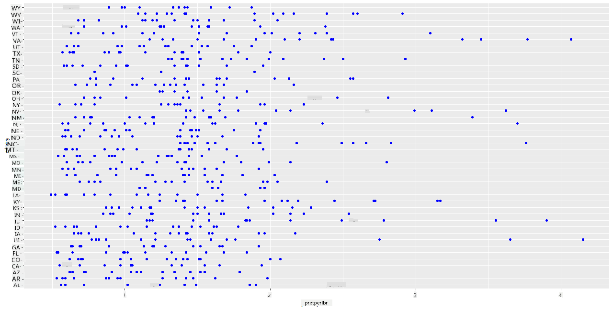
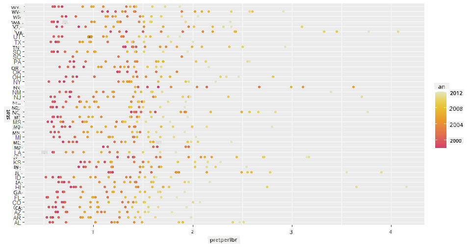
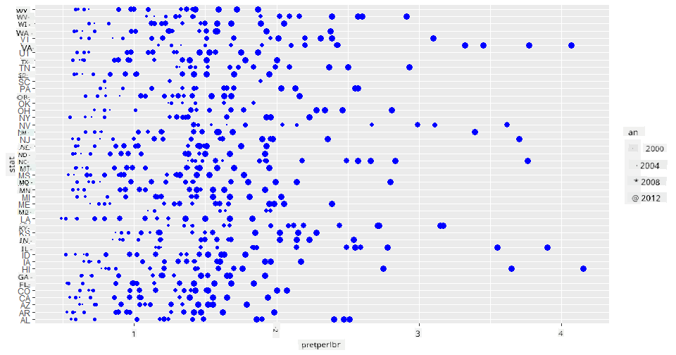
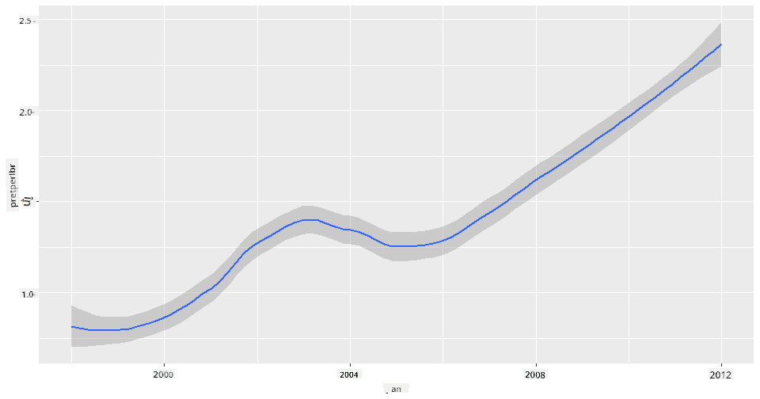
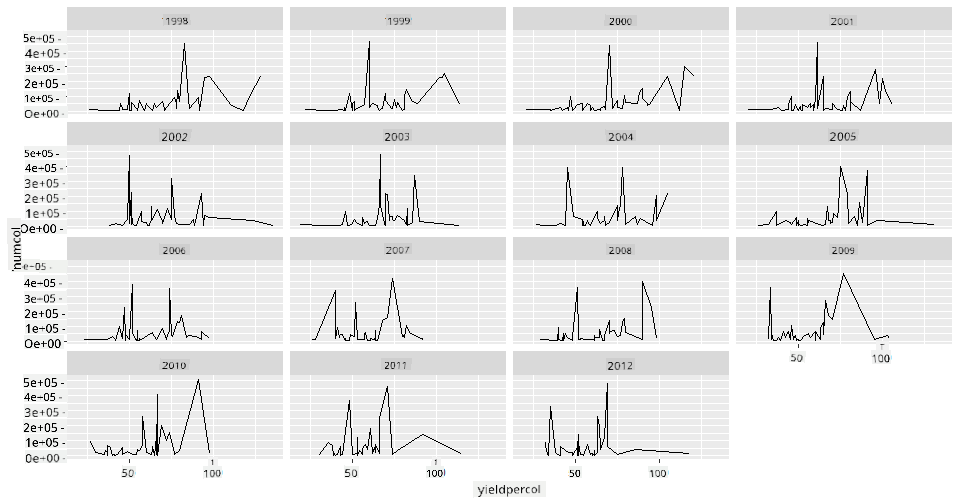
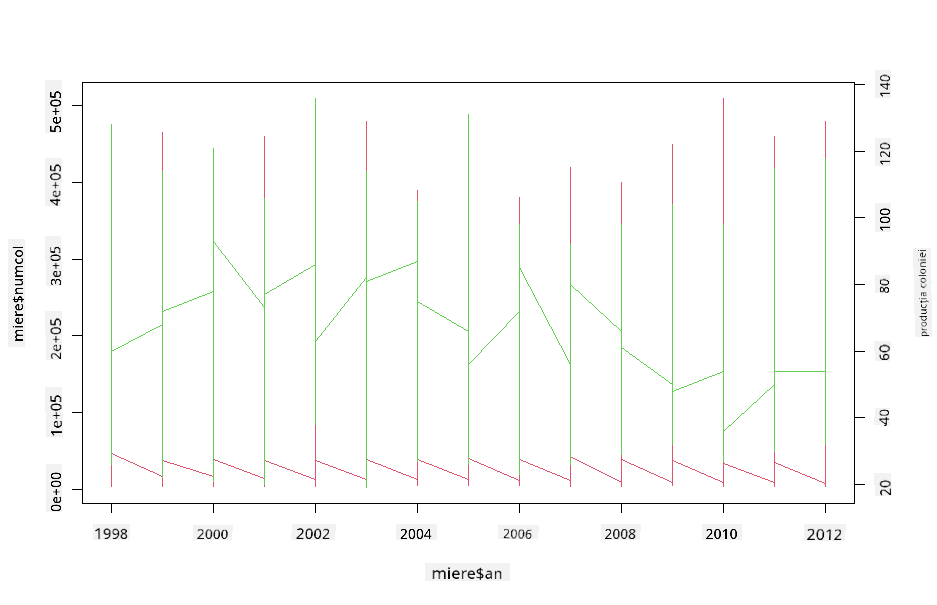

<!--
CO_OP_TRANSLATOR_METADATA:
{
  "original_hash": "a33c5d4b4156a2b41788d8720b6f724c",
  "translation_date": "2025-08-26T17:05:23+00:00",
  "source_file": "3-Data-Visualization/R/12-visualization-relationships/README.md",
  "language_code": "ro"
}
-->
# Vizualizarea Relațiilor: Totul Despre Miere 🍯

| ](../../../sketchnotes/12-Visualizing-Relationships.png)|
|:---:|
|Vizualizarea Relațiilor - _Sketchnote de [@nitya](https://twitter.com/nitya)_ |

Continuând cu tema naturii din cercetările noastre, să descoperim vizualizări interesante pentru a arăta relațiile dintre diferite tipuri de miere, conform unui set de date derivat de la [Departamentul de Agricultură al Statelor Unite](https://www.nass.usda.gov/About_NASS/index.php). 

Acest set de date, care conține aproximativ 600 de elemente, prezintă producția de miere în multe state americane. De exemplu, poți analiza numărul de colonii, producția per colonie, producția totală, stocurile, prețul per kilogram și valoarea mierii produse într-un anumit stat între anii 1998-2012, cu câte un rând pentru fiecare an și stat. 

Ar fi interesant să vizualizăm relația dintre producția anuală a unui stat și, de exemplu, prețul mierii în acel stat. Alternativ, ai putea vizualiza relația dintre producția per colonie în diferite state. Această perioadă acoperă devastatorul fenomen 'CCD' sau 'Colony Collapse Disorder', observat pentru prima dată în 2006 (http://npic.orst.edu/envir/ccd.html), ceea ce face ca acest set de date să fie unul emoționant de studiat. 🐝

## [Chestionar înainte de lecție](https://purple-hill-04aebfb03.1.azurestaticapps.net/quiz/22)

În această lecție, poți folosi ggplot2, pe care l-ai utilizat anterior, ca o bibliotecă excelentă pentru a vizualiza relațiile dintre variabile. Este deosebit de interesantă utilizarea funcțiilor `geom_point` și `qplot` din ggplot2, care permit realizarea de grafice de dispersie și grafice liniare pentru a vizualiza rapid '[relațiile statistice](https://ggplot2.tidyverse.org/)', ajutând astfel specialistul în date să înțeleagă mai bine cum se relaționează variabilele între ele.

## Grafice de dispersie

Folosește un grafic de dispersie pentru a arăta cum a evoluat prețul mierii, an după an, în fiecare stat. ggplot2, utilizând `ggplot` și `geom_point`, grupează convenabil datele pe state și afișează puncte de date atât pentru date categorice, cât și pentru date numerice. 

Să începem prin importarea datelor și a bibliotecii Seaborn:

```r
honey=read.csv('../../data/honey.csv')
head(honey)
```
Observi că datele despre miere au mai multe coloane interesante, inclusiv anul și prețul per kilogram. Să explorăm aceste date, grupate pe state americane:

| stat | numcol | yieldpercol | totalprod | stocks   | priceperlb | prodvalue | year |
| ----- | ------ | ----------- | --------- | -------- | ---------- | --------- | ---- |
| AL    | 16000  | 71          | 1136000   | 159000   | 0.72       | 818000    | 1998 |
| AZ    | 55000  | 60          | 3300000   | 1485000  | 0.64       | 2112000   | 1998 |
| AR    | 53000  | 65          | 3445000   | 1688000  | 0.59       | 2033000   | 1998 |
| CA    | 450000 | 83          | 37350000  | 12326000 | 0.62       | 23157000  | 1998 |
| CO    | 27000  | 72          | 1944000   | 1594000  | 0.7        | 1361000   | 1998 |
| FL    | 230000 | 98          |22540000   | 4508000  | 0.64       | 14426000  | 1998 |

Creează un grafic de dispersie de bază pentru a arăta relația dintre prețul per kilogram de miere și statul de origine al acesteia. Fă axa `y` suficient de înaltă pentru a afișa toate statele:

```r
library(ggplot2)
ggplot(honey, aes(x = priceperlb, y = state)) +
  geom_point(colour = "blue")
```


Acum, afișează aceleași date cu o schemă de culori inspirată de miere pentru a arăta cum evoluează prețul de-a lungul anilor. Poți face acest lucru adăugând un parametru 'scale_color_gradientn' pentru a arăta schimbarea, an după an:

> ✅ Află mai multe despre [scale_color_gradientn](https://www.rdocumentation.org/packages/ggplot2/versions/0.9.1/topics/scale_colour_gradientn) - încearcă o schemă de culori frumoasă, în stil curcubeu!

```r
ggplot(honey, aes(x = priceperlb, y = state, color=year)) +
  geom_point()+scale_color_gradientn(colours = colorspace::heat_hcl(7))
```


Cu această schimbare de schemă de culori, poți observa clar o progresie puternică de-a lungul anilor în ceea ce privește prețul mierii per kilogram. De fapt, dacă analizezi un set de date exemplu pentru a verifica (alege un stat, Arizona, de exemplu), poți observa un model de creștere a prețului an după an, cu câteva excepții:

| stat | numcol | yieldpercol | totalprod | stocks  | priceperlb | prodvalue | year |
| ----- | ------ | ----------- | --------- | ------- | ---------- | --------- | ---- |
| AZ    | 55000  | 60          | 3300000   | 1485000 | 0.64       | 2112000   | 1998 |
| AZ    | 52000  | 62          | 3224000   | 1548000 | 0.62       | 1999000   | 1999 |
| AZ    | 40000  | 59          | 2360000   | 1322000 | 0.73       | 1723000   | 2000 |
| AZ    | 43000  | 59          | 2537000   | 1142000 | 0.72       | 1827000   | 2001 |
| AZ    | 38000  | 63          | 2394000   | 1197000 | 1.08       | 2586000   | 2002 |
| AZ    | 35000  | 72          | 2520000   | 983000  | 1.34       | 3377000   | 2003 |
| AZ    | 32000  | 55          | 1760000   | 774000  | 1.11       | 1954000   | 2004 |
| AZ    | 36000  | 50          | 1800000   | 720000  | 1.04       | 1872000   | 2005 |
| AZ    | 30000  | 65          | 1950000   | 839000  | 0.91       | 1775000   | 2006 |
| AZ    | 30000  | 64          | 1920000   | 902000  | 1.26       | 2419000   | 2007 |
| AZ    | 25000  | 64          | 1600000   | 336000  | 1.26       | 2016000   | 2008 |
| AZ    | 20000  | 52          | 1040000   | 562000  | 1.45       | 1508000   | 2009 |
| AZ    | 24000  | 77          | 1848000   | 665000  | 1.52       | 2809000   | 2010 |
| AZ    | 23000  | 53          | 1219000   | 427000  | 1.55       | 1889000   | 2011 |
| AZ    | 22000  | 46          | 1012000   | 253000  | 1.79       | 1811000   | 2012 |

O altă modalitate de a vizualiza această progresie este să folosești dimensiunea, în loc de culoare. Pentru utilizatorii daltoniști, aceasta ar putea fi o opțiune mai bună. Modifică vizualizarea pentru a arăta creșterea prețului printr-o creștere a circumferinței punctelor:

```r
ggplot(honey, aes(x = priceperlb, y = state)) +
  geom_point(aes(size = year),colour = "blue") +
  scale_size_continuous(range = c(0.25, 3))
```
Poți observa cum dimensiunea punctelor crește treptat.



Este acesta un caz simplu de cerere și ofertă? Din cauza unor factori precum schimbările climatice și colapsul coloniilor, există mai puțină miere disponibilă pentru cumpărare an după an, iar astfel prețul crește?

Pentru a descoperi o corelație între unele dintre variabilele din acest set de date, să explorăm câteva grafice liniare.

## Grafice liniare

Întrebare: Există o creștere clară a prețului mierii per kilogram an după an? Poți descoperi cel mai ușor acest lucru creând un singur grafic liniar:

```r
qplot(honey$year,honey$priceperlb, geom='smooth', span =0.5, xlab = "year",ylab = "priceperlb")
```
Răspuns: Da, cu câteva excepții în jurul anului 2003:



Întrebare: Ei bine, în 2003 putem observa și o creștere a stocului de miere? Ce se întâmplă dacă analizezi producția totală an după an?

```python
qplot(honey$year,honey$totalprod, geom='smooth', span =0.5, xlab = "year",ylab = "totalprod")
```


Răspuns: Nu chiar. Dacă te uiți la producția totală, pare să fi crescut în acel an, deși, în general, cantitatea de miere produsă este în scădere în acești ani.

Întrebare: În acest caz, ce ar fi putut cauza acea creștere a prețului mierii în jurul anului 2003?

Pentru a descoperi acest lucru, poți explora o grilă de fațete.

## Grile de fațete

Grilele de fațete iau un aspect al setului tău de date (în cazul nostru, poți alege 'anul' pentru a evita producerea unui număr prea mare de fațete). Seaborn poate apoi să creeze un grafic pentru fiecare dintre aceste fațete ale coordonatelor x și y alese, pentru o comparație mai ușoară. Se remarcă anul 2003 în acest tip de comparație?

Creează o grilă de fațete folosind `facet_wrap`, așa cum este recomandat de [documentația ggplot2](https://ggplot2.tidyverse.org/reference/facet_wrap.html). 

```r
ggplot(honey, aes(x=yieldpercol, y = numcol,group = 1)) + 
  geom_line() + facet_wrap(vars(year))
```
În această vizualizare, poți compara producția per colonie și numărul de colonii an după an, alăturate, cu o grilă setată la 3 coloane:



Pentru acest set de date, nimic nu pare să iasă în evidență în ceea ce privește numărul de colonii și producția lor, an după an și stat după stat. Există o altă modalitate de a găsi o corelație între aceste două variabile?

## Grafice liniare duale

Încearcă un grafic multilinear prin suprapunerea a două grafice liniare unul peste celălalt, folosind funcțiile `par` și `plot` din R. Vom reprezenta anul pe axa x și vom afișa două axe y. Astfel, afișăm producția per colonie și numărul de colonii, suprapuse:

```r
par(mar = c(5, 4, 4, 4) + 0.3)              
plot(honey$year, honey$numcol, pch = 16, col = 2,type="l")              
par(new = TRUE)                             
plot(honey$year, honey$yieldpercol, pch = 17, col = 3,              
     axes = FALSE, xlab = "", ylab = "",type="l")
axis(side = 4, at = pretty(range(y2)))      
mtext("colony yield", side = 4, line = 3)   
```


Deși nimic nu sare în ochi în jurul anului 2003, acest lucru ne permite să încheiem lecția pe o notă puțin mai optimistă: deși numărul de colonii este în scădere, acesta pare să se stabilizeze, chiar dacă producția per colonie este în scădere.

Hai, albine, hai!

🐝❤️
## 🚀 Provocare

În această lecție, ai învățat mai multe despre alte utilizări ale graficelor de dispersie și grilelor liniare, inclusiv grilele de fațete. Provocarea ta este să creezi o grilă de fațete folosind un alt set de date, poate unul pe care l-ai utilizat anterior în aceste lecții. Observă cât timp durează să o creezi și cât de atent trebuie să fii în privința numărului de grile pe care trebuie să le desenezi folosind aceste tehnici.
## [Chestionar după lecție](https://purple-hill-04aebfb03.1.azurestaticapps.net/quiz/23)

## Recapitulare și Studiu Individual

Graficele liniare pot fi simple sau destul de complexe. Citește puțin din [documentația ggplot2](https://ggplot2.tidyverse.org/reference/geom_path.html#:~:text=geom_line()%20connects%20them%20in,which%20cases%20are%20connected%20together) despre diferitele moduri în care le poți construi. Încearcă să îmbunătățești graficele liniare pe care le-ai construit în această lecție cu alte metode listate în documentație.
## Temă

[Intră în stup](assignment.md)

---

**Declinare de responsabilitate**:  
Acest document a fost tradus folosind serviciul de traducere AI [Co-op Translator](https://github.com/Azure/co-op-translator). Deși ne străduim să asigurăm acuratețea, vă rugăm să rețineți că traducerile automate pot conține erori sau inexactități. Documentul original în limba sa natală ar trebui considerat sursa autoritară. Pentru informații critice, se recomandă traducerea profesională realizată de un specialist uman. Nu ne asumăm responsabilitatea pentru eventualele neînțelegeri sau interpretări greșite care pot apărea din utilizarea acestei traduceri.