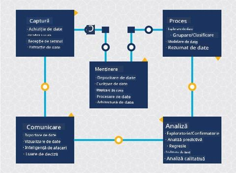
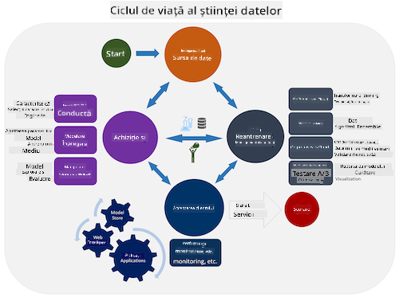
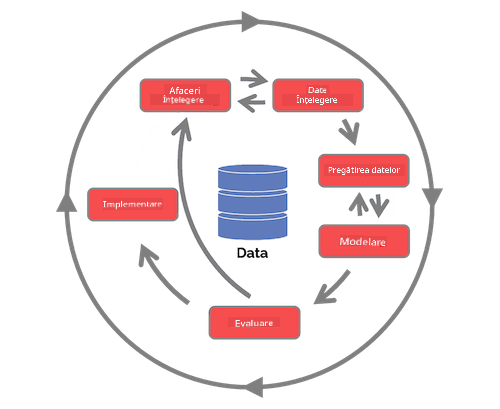

<!--
CO_OP_TRANSLATOR_METADATA:
{
  "original_hash": "07e12a25d20b8f191e3cb651c27fdb2b",
  "translation_date": "2025-09-06T21:35:48+00:00",
  "source_file": "4-Data-Science-Lifecycle/14-Introduction/README.md",
  "language_code": "ro"
}
-->
# Introducere în Ciclu de Viață al Științei Datelor

| ](../../sketchnotes/14-DataScience-Lifecycle.png)|
|:---:|
| Introducere în Ciclu de Viață al Științei Datelor - _Sketchnote de [@nitya](https://twitter.com/nitya)_ |

## [Chestionar înainte de lecție](https://ff-quizzes.netlify.app/en/ds/quiz/26)

Până în acest moment, probabil ai realizat că știința datelor este un proces. Acest proces poate fi împărțit în 5 etape:

- Capturare
- Procesare
- Analiză
- Comunicare
- Mentenanță

Această lecție se concentrează pe 3 părți ale ciclului de viață: capturare, procesare și mentenanță.

  
> Fotografie de [Berkeley School of Information](https://ischoolonline.berkeley.edu/data-science/what-is-data-science/)

## Capturare

Prima etapă a ciclului de viață este foarte importantă, deoarece următoarele etape depind de aceasta. Practic, este o combinație a două etape: achiziționarea datelor și definirea scopului și a problemelor care trebuie abordate.  
Definirea obiectivelor proiectului va necesita o înțelegere mai profundă a problemei sau întrebării. Mai întâi, trebuie să identificăm și să implicăm persoanele care au nevoie ca problema lor să fie rezolvată. Acestea pot fi părți interesate dintr-o afacere sau sponsori ai proiectului, care pot ajuta la identificarea celor care vor beneficia de acest proiect, precum și ce și de ce au nevoie. Un obiectiv bine definit ar trebui să fie măsurabil și cuantificabil pentru a defini un rezultat acceptabil.

Întrebări pe care un specialist în știința datelor le poate pune:
- A fost abordată această problemă înainte? Ce s-a descoperit?
- Este scopul și obiectivul înțeles de toți cei implicați?
- Există ambiguități și cum pot fi reduse?
- Care sunt constrângerile?
- Cum ar putea arăta rezultatul final?
- Câte resurse (timp, oameni, computaționale) sunt disponibile?

Următorul pas este identificarea, colectarea și, în final, explorarea datelor necesare pentru a atinge aceste obiective definite. În această etapă de achiziție, specialiștii în știința datelor trebuie să evalueze cantitatea și calitatea datelor. Acest lucru necesită o explorare a datelor pentru a confirma că ceea ce a fost achiziționat va sprijini atingerea rezultatului dorit.

Întrebări pe care un specialist în știința datelor le poate pune despre date:
- Ce date sunt deja disponibile pentru mine?
- Cine deține aceste date?
- Care sunt preocupările legate de confidențialitate?
- Am suficiente date pentru a rezolva această problemă?
- Sunt datele de o calitate acceptabilă pentru această problemă?
- Dacă descopăr informații suplimentare prin aceste date, ar trebui să luăm în considerare schimbarea sau redefinirea obiectivelor?

## Procesare

Etapa de procesare a ciclului de viață se concentrează pe descoperirea tiparelor din date, precum și pe modelare. Unele tehnici utilizate în această etapă necesită metode statistice pentru a descoperi tiparele. De obicei, aceasta ar fi o sarcină obositoare pentru un om să o facă pe un set mare de date, astfel că se bazează pe computere pentru a accelera procesul. Această etapă este, de asemenea, locul unde știința datelor și învățarea automată se intersectează. Așa cum ai învățat în prima lecție, învățarea automată este procesul de construire a modelelor pentru a înțelege datele. Modelele sunt o reprezentare a relației dintre variabilele din date care ajută la prezicerea rezultatelor.

Tehnici comune utilizate în această etapă sunt acoperite în curriculum-ul ML pentru Începători. Urmează linkurile pentru a afla mai multe despre ele:

- [Clasificare](https://github.com/microsoft/ML-For-Beginners/tree/main/4-Classification): Organizarea datelor în categorii pentru o utilizare mai eficientă.
- [Clustering](https://github.com/microsoft/ML-For-Beginners/tree/main/5-Clustering): Gruparea datelor în grupuri similare.
- [Regresie](https://github.com/microsoft/ML-For-Beginners/tree/main/2-Regression): Determinarea relațiilor dintre variabile pentru a prezice sau prognoza valori.

## Mentenanță

În diagrama ciclului de viață, este posibil să fi observat că mentenanța se află între capturare și procesare. Mentenanța este un proces continuu de gestionare, stocare și securizare a datelor pe parcursul procesului unui proiect și ar trebui luată în considerare pe întreaga durată a proiectului.

### Stocarea datelor

Considerațiile despre cum și unde sunt stocate datele pot influența costul stocării, precum și performanța accesării rapide a datelor. Decizii precum acestea nu sunt probabil luate doar de un specialist în știința datelor, dar acesta poate ajunge să facă alegeri despre cum să lucreze cu datele în funcție de modul în care sunt stocate.

Iată câteva aspecte ale sistemelor moderne de stocare a datelor care pot influența aceste alegeri:

**On premise vs off premise vs cloud public sau privat**

On premise se referă la găzduirea și gestionarea datelor pe propriul echipament, cum ar fi deținerea unui server cu hard disk-uri care stochează datele, în timp ce off premise se bazează pe echipamente pe care nu le deții, cum ar fi un centru de date. Cloud-ul public este o alegere populară pentru stocarea datelor care nu necesită cunoștințe despre cum sau unde sunt stocate exact datele, unde public se referă la o infrastructură unificată care este partajată de toți cei care folosesc cloud-ul. Unele organizații au politici stricte de securitate care necesită acces complet la echipamentele unde sunt găzduite datele și vor utiliza un cloud privat care oferă propriile servicii de cloud. Vei învăța mai multe despre datele în cloud în [lecțiile viitoare](https://github.com/microsoft/Data-Science-For-Beginners/tree/main/5-Data-Science-In-Cloud).

**Date reci vs date fierbinți**

Când îți antrenezi modelele, este posibil să ai nevoie de mai multe date de antrenament. Dacă ești mulțumit de modelul tău, mai multe date vor sosi pentru ca modelul să-și îndeplinească scopul. În orice caz, costul stocării și accesării datelor va crește pe măsură ce acumulezi mai multe. Separarea datelor rar utilizate, cunoscute sub numele de date reci, de datele accesate frecvent, cunoscute sub numele de date fierbinți, poate fi o opțiune mai ieftină de stocare a datelor prin hardware sau servicii software. Dacă datele reci trebuie accesate, poate dura puțin mai mult pentru a le recupera în comparație cu datele fierbinți.

### Gestionarea datelor

Pe măsură ce lucrezi cu date, este posibil să descoperi că unele dintre ele trebuie curățate folosind unele dintre tehnicile acoperite în lecția despre [pregătirea datelor](https://github.com/microsoft/Data-Science-For-Beginners/tree/main/2-Working-With-Data/08-data-preparation) pentru a construi modele precise. Când sosesc date noi, va fi nevoie de aceleași aplicații pentru a menține consistența calității. Unele proiecte vor implica utilizarea unui instrument automatizat pentru curățare, agregare și compresie înainte ca datele să fie mutate în locația lor finală. Azure Data Factory este un exemplu de astfel de instrument.

### Securizarea datelor

Unul dintre obiectivele principale ale securizării datelor este asigurarea că cei care lucrează cu ele controlează ceea ce este colectat și în ce context este utilizat. Menținerea securității datelor implică limitarea accesului doar la cei care au nevoie de ele, respectarea legilor și reglementărilor locale, precum și menținerea standardelor etice, așa cum este acoperit în [lecția despre etică](https://github.com/microsoft/Data-Science-For-Beginners/tree/main/1-Introduction/02-ethics).

Iată câteva lucruri pe care o echipă le poate face având în vedere securitatea:
- Confirmarea că toate datele sunt criptate
- Oferirea de informații clienților despre cum sunt utilizate datele lor
- Eliminarea accesului la date pentru cei care au părăsit proiectul
- Permisiunea doar anumitor membri ai proiectului să modifice datele

## 🚀 Provocare

Există multe versiuni ale Ciclului de Viață al Științei Datelor, unde fiecare pas poate avea nume diferite și un număr diferit de etape, dar va conține aceleași procese menționate în această lecție.

Explorează [Ciclul de viață al Procesului de Știința Datelor al Echipei](https://docs.microsoft.com/en-us/azure/architecture/data-science-process/lifecycle) și [Procesul standard inter-industrial pentru mineritul datelor](https://www.datascience-pm.com/crisp-dm-2/). Numește 3 asemănări și diferențe între cele două.

|Procesul de Știința Datelor al Echipei (TDSP)|Procesul standard inter-industrial pentru mineritul datelor (CRISP-DM)|
|--|--|
| |  |
| Imagine de [Microsoft](https://docs.microsoft.comazure/architecture/data-science-process/lifecycle) | Imagine de [Data Science Process Alliance](https://www.datascience-pm.com/crisp-dm-2/) |

## [Chestionar după lecție](https://ff-quizzes.netlify.app/en/ds/quiz/27)

## Recapitulare și Studiu Individual

Aplicarea Ciclului de Viață al Științei Datelor implică multiple roluri și sarcini, unde unii se pot concentra pe anumite părți ale fiecărei etape. Procesul de Știința Datelor al Echipei oferă câteva resurse care explică tipurile de roluri și sarcini pe care cineva le poate avea într-un proiect.

* [Roluri și sarcini în Procesul de Știința Datelor al Echipei](https://docs.microsoft.com/en-us/azure/architecture/data-science-process/roles-tasks)  
* [Executarea sarcinilor de știința datelor: explorare, modelare și implementare](https://docs.microsoft.com/en-us/azure/architecture/data-science-process/execute-data-science-tasks)

## Temă

[Evaluarea unui set de date](assignment.md)

---

**Declinare de responsabilitate**:  
Acest document a fost tradus folosind serviciul de traducere AI [Co-op Translator](https://github.com/Azure/co-op-translator). Deși ne străduim să asigurăm acuratețea, vă rugăm să rețineți că traducerile automate pot conține erori sau inexactități. Documentul original, în limba sa natală, ar trebui considerat sursa autoritară. Pentru informații critice, se recomandă traducerea profesională realizată de un specialist uman. Nu ne asumăm responsabilitatea pentru eventualele neînțelegeri sau interpretări greșite care pot apărea din utilizarea acestei traduceri.