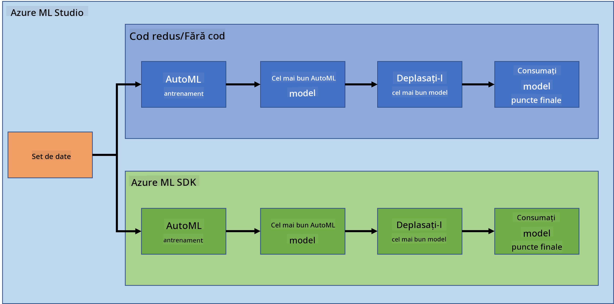

<!--
CO_OP_TRANSLATOR_METADATA:
{
  "original_hash": "8dfe141a0f46f7d253e07f74913c7f44",
  "translation_date": "2025-08-26T15:53:22+00:00",
  "source_file": "5-Data-Science-In-Cloud/README.md",
  "language_code": "ro"
}
-->
# Știința Datelor în Cloud

> Fotografie de [Jelleke Vanooteghem](https://unsplash.com/@ilumire) de pe [Unsplash](https://unsplash.com/s/photos/cloud?orientation=landscape)

Când vine vorba de realizarea științei datelor cu seturi mari de date, cloud-ul poate fi o schimbare majoră. În următoarele trei lecții, vom vedea ce este cloud-ul și de ce poate fi foarte util. De asemenea, vom explora un set de date despre insuficiența cardiacă și vom construi un model pentru a ajuta la evaluarea probabilității ca cineva să sufere de insuficiență cardiacă. Vom folosi puterea cloud-ului pentru a antrena, implementa și utiliza un model în două moduri diferite. Un mod folosind doar interfața utilizatorului într-un stil Low code/No code, iar celălalt mod folosind Azure Machine Learning Software Developer Kit (Azure ML SDK).

### Subiecte

1. [De ce să folosești Cloud pentru Știința Datelor?](17-Introduction/README.md)
2. [Știința Datelor în Cloud: Modul "Low code/No code"](18-Low-Code/README.md)
3. [Știința Datelor în Cloud: Modul "Azure ML SDK"](19-Azure/README.md)

### Credite
Aceste lecții au fost scrise cu ☁️ și 💕 de [Maud Levy](https://twitter.com/maudstweets) și [Tiffany Souterre](https://twitter.com/TiffanySouterre)

Datele pentru proiectul de Predicție a Insuficienței Cardiace sunt preluate de la [
Larxel](https://www.kaggle.com/andrewmvd) pe [Kaggle](https://www.kaggle.com/andrewmvd/heart-failure-clinical-data). Acestea sunt licențiate sub [Attribution 4.0 International (CC BY 4.0)](https://creativecommons.org/licenses/by/4.0/)

---

**Declinare de responsabilitate**:  
Acest document a fost tradus folosind serviciul de traducere AI [Co-op Translator](https://github.com/Azure/co-op-translator). Deși ne străduim să asigurăm acuratețea, vă rugăm să fiți conștienți că traducerile automate pot conține erori sau inexactități. Documentul original în limba sa natală ar trebui considerat sursa autoritară. Pentru informații critice, se recomandă traducerea profesională realizată de un specialist uman. Nu ne asumăm responsabilitatea pentru eventualele neînțelegeri sau interpretări greșite care pot apărea din utilizarea acestei traduceri.