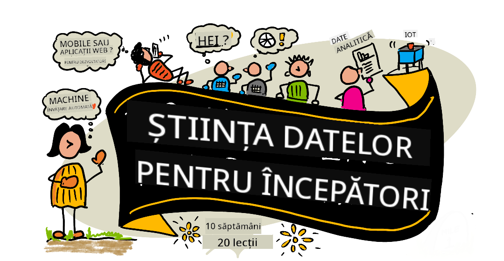

<!--
CO_OP_TRANSLATOR_METADATA:
{
  "original_hash": "dd9a1deb4da680b2cf11ba2e9f5a0a6e",
  "translation_date": "2025-09-29T22:08:22+00:00",
  "source_file": "README.md",
  "language_code": "ro"
}
-->
# Știința Datelor pentru Începători - Un Curriculum

Advocații Cloud Azure de la Microsoft sunt încântați să ofere un curriculum de 10 săptămâni, cu 20 de lecții, dedicat Științei Datelor. Fiecare lecție include chestionare înainte și după lecție, instrucțiuni scrise pentru completarea lecției, o soluție și o temă. Pedagogia noastră bazată pe proiecte vă permite să învățați construind, o metodă dovedită pentru a fixa noile abilități.

**Mulțumiri sincere autorilor noștri:** [Jasmine Greenaway](https://www.twitter.com/paladique), [Dmitry Soshnikov](http://soshnikov.com), [Nitya Narasimhan](https://twitter.com/nitya), [Jalen McGee](https://twitter.com/JalenMcG), [Jen Looper](https://twitter.com/jenlooper), [Maud Levy](https://twitter.com/maudstweets), [Tiffany Souterre](https://twitter.com/TiffanySouterre), [Christopher Harrison](https://www.twitter.com/geektrainer).

**🙏 Mulțumiri speciale 🙏 autorilor, recenzorilor și contributorilor de conținut [Microsoft Student Ambassador](https://studentambassadors.microsoft.com/),** printre care Aaryan Arora, [Aditya Garg](https://github.com/AdityaGarg00), [Alondra Sanchez](https://www.linkedin.com/in/alondra-sanchez-molina/), [Ankita Singh](https://www.linkedin.com/in/ankitasingh007), [Anupam Mishra](https://www.linkedin.com/in/anupam--mishra/), [Arpita Das](https://www.linkedin.com/in/arpitadas01/), ChhailBihari Dubey, [Dibri Nsofor](https://www.linkedin.com/in/dibrinsofor), [Dishita Bhasin](https://www.linkedin.com/in/dishita-bhasin-7065281bb), [Majd Safi](https://www.linkedin.com/in/majd-s/), [Max Blum](https://www.linkedin.com/in/max-blum-6036a1186/), [Miguel Correa](https://www.linkedin.com/in/miguelmque/), [Mohamma Iftekher (Iftu) Ebne Jalal](https://twitter.com/iftu119), [Nawrin Tabassum](https://www.linkedin.com/in/nawrin-tabassum), [Raymond Wangsa Putra](https://www.linkedin.com/in/raymond-wp/), [Rohit Yadav](https://www.linkedin.com/in/rty2423), Samridhi Sharma, [Sanya Sinha](https://www.linkedin.com/mwlite/in/sanya-sinha-13aab1200),
[Sheena Narula](https://www.linkedin.com/in/sheena-narua-n/), [Tauqeer Ahmad](https://www.linkedin.com/in/tauqeerahmad5201/), Yogendrasingh Pawar , [Vidushi Gupta](https://www.linkedin.com/in/vidushi-gupta07/), [Jasleen Sondhi](https://www.linkedin.com/in/jasleen-sondhi/)

||
|:---:|
| Știința Datelor pentru Începători - _Sketchnote de [@nitya](https://twitter.com/nitya)_ |

### 🌐 Suport Multi-Limbă

#### Suportat prin GitHub Action (Automat & Mereu Actualizat)

[Franceză](../fr/README.md) | [Spaniolă](../es/README.md) | [Germană](../de/README.md) | [Rusă](../ru/README.md) | [Arabă](../ar/README.md) | [Persană (Farsi)](../fa/README.md) | [Urdu](../ur/README.md) | [Chineză (Simplificată)](../zh/README.md) | [Chineză (Tradițională, Macau)](../mo/README.md) | [Chineză (Tradițională, Hong Kong)](../hk/README.md) | [Chineză (Tradițională, Taiwan)](../tw/README.md) | [Japoneză](../ja/README.md) | [Coreeană](../ko/README.md) | [Hindi](../hi/README.md) | [Bengali](../bn/README.md) | [Marathi](../mr/README.md) | [Nepaleză](../ne/README.md) | [Punjabi (Gurmukhi)](../pa/README.md) | [Portugheză (Portugalia)](../pt/README.md) | [Portugheză (Brazilia)](../br/README.md) | [Italiană](../it/README.md) | [Poloneză](../pl/README.md) | [Turcă](../tr/README.md) | [Greacă](../el/README.md) | [Thailandeză](../th/README.md) | [Suedeză](../sv/README.md) | [Daneză](../da/README.md) | [Norvegiană](../no/README.md) | [Finlandeză](../fi/README.md) | [Olandeză](../nl/README.md) | [Ebraică](../he/README.md) | [Vietnameză](../vi/README.md) | [Indoneziană](../id/README.md) | [Malayeză](../ms/README.md) | [Tagalog (Filipineză)](../tl/README.md) | [Swahili](../sw/README.md) | [Maghiară](../hu/README.md) | [Cehă](../cs/README.md) | [Slovacă](../sk/README.md) | [Română](./README.md) | [Bulgară](../bg/README.md) | [Sârbă (Chirilică)](../sr/README.md) | [Croată](../hr/README.md) | [Slovenă](../sl/README.md) | [Ucraineană](../uk/README.md) | [Birmaneză (Myanmar)](../my/README.md)

**Dacă doriți să aveți suport pentru alte limbi, acestea sunt listate [aici](https://github.com/Azure/co-op-translator/blob/main/getting_started/supported-languages.md)**

#### Alăturați-vă Comunității Noastre 

Avem o serie de învățare cu AI în desfășurare pe Discord, aflați mai multe și alăturați-vă la [Learn with AI Series](https://aka.ms/learnwithai/discord) între 18 - 30 septembrie, 2025. Veți primi sfaturi și trucuri despre utilizarea GitHub Copilot pentru Știința Datelor.

# Ești student?

Începeți cu următoarele resurse:

- [Pagina Hub pentru Studenți](https://docs.microsoft.com/en-gb/learn/student-hub?WT.mc_id=academic-77958-bethanycheum) Pe această pagină, veți găsi resurse pentru începători, pachete pentru studenți și chiar modalități de a obține un voucher gratuit pentru certificare. Aceasta este o pagină pe care doriți să o marcați și să o verificați periodic, deoarece schimbăm conținutul cel puțin lunar.
- [Microsoft Learn Student Ambassadors](https://studentambassadors.microsoft.com?WT.mc_id=academic-77958-bethanycheum) Alăturați-vă unei comunități globale de ambasadori studenți, aceasta ar putea fi calea voastră către Microsoft.

# Începeți

> **Profesori**: am [inclus câteva sugestii](for-teachers.md) despre cum să utilizați acest curriculum. Ne-ar plăcea să primim feedback-ul vostru [în forumul nostru de discuții](https://github.com/microsoft/Data-Science-For-Beginners/discussions)!

> **[Studenți](https://aka.ms/student-page)**: pentru a utiliza acest curriculum pe cont propriu, faceți fork la întregul repo și completați exercițiile pe cont propriu, începând cu un chestionar înainte de lecție. Apoi citiți lecția și completați restul activităților. Încercați să creați proiectele înțelegând lecțiile, mai degrabă decât copierea codului soluției; totuși, acel cod este disponibil în folderele /solutions din fiecare lecție bazată pe proiect. O altă idee ar fi să formați un grup de studiu cu prietenii și să parcurgeți conținutul împreună. Pentru studii suplimentare, recomandăm [Microsoft Learn](https://docs.microsoft.com/en-us/users/jenlooper-2911/collections/qprpajyoy3x0g7?WT.mc_id=academic-77958-bethanycheum).

## Cunoașteți Echipa

**Gif realizat de** [Mohit Jaisal](https://www.linkedin.com/in/mohitjaisal)

> 🎥 Faceți clic pe imaginea de mai sus pentru un video despre proiect și despre oamenii care l-au creat!

## Pedagogie

Am ales două principii pedagogice în construirea acestui curriculum: asigurarea că este bazat pe proiecte și includerea de chestionare frecvente. Până la sfârșitul acestei serii, studenții vor fi învățat principii de bază ale științei datelor, inclusiv concepte etice, pregătirea datelor, diferite moduri de a lucra cu datele, vizualizarea datelor, analiza datelor, cazuri reale de utilizare ale științei datelor și multe altele.

În plus, un chestionar cu miză redusă înainte de o clasă setează intenția studentului de a învăța un subiect, în timp ce un al doilea chestionar după clasă asigură o mai bună retenție. Acest curriculum a fost conceput să fie flexibil și distractiv și poate fi parcurs în întregime sau parțial. Proiectele încep mici și devin din ce în ce mai complexe până la sfârșitul ciclului de 10 săptămâni.

> Găsiți [Codul nostru de Conduită](CODE_OF_CONDUCT.md), [Contribuții](CONTRIBUTING.md), [Ghiduri de Traducere](TRANSLATIONS.md). Apreciem feedback-ul vostru constructiv!

## Fiecare lecție include:

- Sketchnote opțional
- Video suplimentar opțional
- Chestionar de încălzire înainte de lecție
- Lecție scrisă
- Pentru lecțiile bazate pe proiecte, ghiduri pas cu pas despre cum să construiți proiectul
- Verificări de cunoștințe
- O provocare
- Lectură suplimentară
- Temă
- [Chestionar după lecție](https://ff-quizzes.netlify.app/en/)

> **O notă despre chestionare**: Toate chestionarele sunt conținute în folderul Quiz-App, pentru un total de 40 de chestionare, fiecare cu trei întrebări. Ele sunt legate din lecții, dar aplicația de chestionare poate fi rulată local sau implementată pe Azure; urmați instrucțiunile din folderul `quiz-app`. Ele sunt treptat localizate.

## Lecții
||
|:---:|
| Data Science pentru Începători: Planificare - _Sketchnote de [@nitya](https://twitter.com/nitya)_ |

| Număr Lecție | Subiect | Grupare Lecții | Obiective de Învățare | Lecție Legată | Autor |
| :-----------: | :----------------------------------------: | :--------------------------------------------------: | :-----------------------------------------------------------------------------------------------------------------------------------------------------------------------: | :---------------------------------------------------------------------: | :----: |
| 01 | Definirea Științei Datelor | [Introducere](1-Introduction/README.md) | Învață conceptele de bază ale științei datelor și cum se leagă de inteligența artificială, învățarea automată și big data. | [lecție](1-Introduction/01-defining-data-science/README.md) [video](https://youtu.be/beZ7Mb_oz9I) | [Dmitry](http://soshnikov.com) |
| 02 | Etica în Știința Datelor | [Introducere](1-Introduction/README.md) | Concepte, provocări și cadre de etică a datelor. | [lecție](1-Introduction/02-ethics/README.md) | [Nitya](https://twitter.com/nitya) |
| 03 | Definirea Datelor | [Introducere](1-Introduction/README.md) | Cum sunt clasificate datele și sursele lor comune. | [lecție](1-Introduction/03-defining-data/README.md) | [Jasmine](https://www.twitter.com/paladique) |
| 04 | Introducere în Statistică și Probabilitate | [Introducere](1-Introduction/README.md) | Tehnici matematice de probabilitate și statistică pentru a înțelege datele. | [lecție](1-Introduction/04-stats-and-probability/README.md) [video](https://youtu.be/Z5Zy85g4Yjw) | [Dmitry](http://soshnikov.com) |
| 05 | Lucrul cu Date Relaționale | [Lucrul cu Date](2-Working-With-Data/README.md) | Introducere în date relaționale și elementele de bază ale explorării și analizei datelor relaționale cu Structured Query Language, cunoscut și sub numele de SQL (pronunțat „see-quell”). | [lecție](2-Working-With-Data/05-relational-databases/README.md) | [Christopher](https://www.twitter.com/geektrainer) | | |
| 06 | Lucrul cu Date NoSQL | [Lucrul cu Date](2-Working-With-Data/README.md) | Introducere în datele non-relaționale, tipurile lor diverse și elementele de bază ale explorării și analizei bazelor de date document. | [lecție](2-Working-With-Data/06-non-relational/README.md) | [Jasmine](https://twitter.com/paladique)|
| 07 | Lucrul cu Python | [Lucrul cu Date](2-Working-With-Data/README.md) | Elementele de bază ale utilizării Python pentru explorarea datelor cu biblioteci precum Pandas. Se recomandă o înțelegere fundamentală a programării în Python. | [lecție](2-Working-With-Data/07-python/README.md) [video](https://youtu.be/dZjWOGbsN4Y) | [Dmitry](http://soshnikov.com) |
| 08 | Pregătirea Datelor | [Lucrul cu Date](2-Working-With-Data/README.md) | Subiecte despre tehnici de curățare și transformare a datelor pentru a gestiona provocările datelor lipsă, inexacte sau incomplete. | [lecție](2-Working-With-Data/08-data-preparation/README.md) | [Jasmine](https://www.twitter.com/paladique) |
| 09 | Vizualizarea Cantităților | [Vizualizarea Datelor](3-Data-Visualization/README.md) | Învață cum să folosești Matplotlib pentru a vizualiza date despre păsări 🦆 | [lecție](3-Data-Visualization/09-visualization-quantities/README.md) | [Jen](https://twitter.com/jenlooper) |
| 10 | Vizualizarea Distribuțiilor Datelor | [Vizualizarea Datelor](3-Data-Visualization/README.md) | Vizualizarea observațiilor și tendințelor într-un interval. | [lecție](3-Data-Visualization/10-visualization-distributions/README.md) | [Jen](https://twitter.com/jenlooper) |
| 11 | Vizualizarea Proporțiilor | [Vizualizarea Datelor](3-Data-Visualization/README.md) | Vizualizarea procentajelor discrete și grupate. | [lecție](3-Data-Visualization/11-visualization-proportions/README.md) | [Jen](https://twitter.com/jenlooper) |
| 12 | Vizualizarea Relațiilor | [Vizualizarea Datelor](3-Data-Visualization/README.md) | Vizualizarea conexiunilor și corelațiilor între seturi de date și variabilele lor. | [lecție](3-Data-Visualization/12-visualization-relationships/README.md) | [Jen](https://twitter.com/jenlooper) |
| 13 | Vizualizări Semnificative | [Vizualizarea Datelor](3-Data-Visualization/README.md) | Tehnici și îndrumări pentru a face vizualizările tale valoroase pentru rezolvarea eficientă a problemelor și obținerea de perspective. | [lecție](3-Data-Visualization/13-meaningful-visualizations/README.md) | [Jen](https://twitter.com/jenlooper) |
| 14 | Introducere în ciclul de viață al Științei Datelor | [Ciclul de Viață](4-Data-Science-Lifecycle/README.md) | Introducere în ciclul de viață al științei datelor și primul său pas de achiziție și extragere a datelor. | [lecție](4-Data-Science-Lifecycle/14-Introduction/README.md) | [Jasmine](https://twitter.com/paladique) |
| 15 | Analiza | [Ciclul de Viață](4-Data-Science-Lifecycle/README.md) | Această fază a ciclului de viață al științei datelor se concentrează pe tehnici de analiză a datelor. | [lecție](4-Data-Science-Lifecycle/15-analyzing/README.md) | [Jasmine](https://twitter.com/paladique) | | |
| 16 | Comunicare | [Ciclul de Viață](4-Data-Science-Lifecycle/README.md) | Această fază a ciclului de viață al științei datelor se concentrează pe prezentarea perspectivelor din date într-un mod care să faciliteze înțelegerea pentru factorii de decizie. | [lecție](4-Data-Science-Lifecycle/16-communication/README.md) | [Jalen](https://twitter.com/JalenMcG) | | |
| 17 | Știința Datelor în Cloud | [Date în Cloud](5-Data-Science-In-Cloud/README.md) | Această serie de lecții introduce știința datelor în cloud și beneficiile acesteia. | [lecție](5-Data-Science-In-Cloud/17-Introduction/README.md) | [Tiffany](https://twitter.com/TiffanySouterre) și [Maud](https://twitter.com/maudstweets) |
| 18 | Știința Datelor în Cloud | [Date în Cloud](5-Data-Science-In-Cloud/README.md) | Antrenarea modelelor folosind instrumente Low Code. |[lecție](5-Data-Science-In-Cloud/18-Low-Code/README.md) | [Tiffany](https://twitter.com/TiffanySouterre) și [Maud](https://twitter.com/maudstweets) |
| 19 | Știința Datelor în Cloud | [Date în Cloud](5-Data-Science-In-Cloud/README.md) | Implementarea modelelor cu Azure Machine Learning Studio. | [lecție](5-Data-Science-In-Cloud/19-Azure/README.md)| [Tiffany](https://twitter.com/TiffanySouterre) și [Maud](https://twitter.com/maudstweets) |
| 20 | Știința Datelor în Lumea Reală | [În Lumea Reală](6-Data-Science-In-Wild/README.md) | Proiecte bazate pe știința datelor în lumea reală. | [lecție](6-Data-Science-In-Wild/20-Real-World-Examples/README.md) | [Nitya](https://twitter.com/nitya) |

## GitHub Codespaces

Urmează acești pași pentru a deschide acest exemplu într-un Codespace:
1. Fă clic pe meniul derulant Code și selectează opțiunea Open with Codespaces.
2. Selectează + New codespace în partea de jos a panoului.
Pentru mai multe informații, consultă [documentația GitHub](https://docs.github.com/en/codespaces/developing-in-codespaces/creating-a-codespace-for-a-repository#creating-a-codespace).

## VSCode Remote - Containers
Urmează acești pași pentru a deschide acest depozit într-un container folosind mașina ta locală și VSCode utilizând extensia VS Code Remote - Containers:

1. Dacă este prima dată când folosești un container de dezvoltare, asigură-te că sistemul tău îndeplinește cerințele preliminare (de exemplu, să ai Docker instalat) din [documentația de început](https://code.visualstudio.com/docs/devcontainers/containers#_getting-started).

Pentru a utiliza acest depozit, poți fie să deschizi depozitul într-un volum Docker izolat:

**Notă**: În fundal, aceasta va folosi comanda Remote-Containers: **Clone Repository in Container Volume...** pentru a clona codul sursă într-un volum Docker în loc de sistemul de fișiere local. [Volumurile](https://docs.docker.com/storage/volumes/) sunt mecanismul preferat pentru persistența datelor containerului.

Sau să deschizi o versiune clonată sau descărcată local a depozitului:

- Clonează acest depozit pe sistemul tău local.
- Apasă F1 și selectează comanda **Remote-Containers: Open Folder in Container...**.
- Selectează copia clonată a acestui folder, așteaptă ca containerul să pornească și încearcă lucrurile.

## Acces offline

Poți rula această documentație offline folosind [Docsify](https://docsify.js.org/#/). Clonează acest depozit, [instalează Docsify](https://docsify.js.org/#/quickstart) pe mașina ta locală, apoi în folderul rădăcină al acestui depozit, tastează `docsify serve`. Website-ul va fi servit pe portul 3000 pe localhost-ul tău: `localhost:3000`.

> Notă, notebook-urile nu vor fi afișate prin Docsify, așa că atunci când ai nevoie să rulezi un notebook, fă asta separat în VS Code rulând un kernel Python.

## Alte Curricule

Echipa noastră produce alte curricule! Consultă:

- [Edge AI pentru Începători](https://aka.ms/edgeai-for-beginners)
- [Agenți AI pentru Începători](https://aka.ms/ai-agents-beginners)
- [AI Generativ pentru Începători](https://aka.ms/genai-beginners)
- [AI Generativ pentru Începători .NET](https://github.com/microsoft/Generative-AI-for-beginners-dotnet)
- [AI Generativ cu JavaScript](https://github.com/microsoft/generative-ai-with-javascript)
- [AI Generativ cu Java](https://aka.ms/genaijava)
- [AI pentru Începători](https://aka.ms/ai-beginners)
- [Știința Datelor pentru Începători](https://aka.ms/datascience-beginners)
- [Bash pentru Începători](https://github.com/microsoft/bash-for-beginners)
- [ML pentru Începători](https://aka.ms/ml-beginners)
- [Securitate Cibernetică pentru Începători](https://github.com/microsoft/Security-101) 
- [Dezvoltare Web pentru Începători](https://aka.ms/webdev-beginners)
- [IoT pentru Începători](https://aka.ms/iot-beginners)
- [Învățare Automată pentru Începători](https://aka.ms/ml-beginners)
- [Dezvoltare XR pentru Începători](https://aka.ms/xr-dev-for-beginners)
- [Stăpânirea GitHub Copilot pentru Programare AI în Perechi](https://aka.ms/GitHubCopilotAI)
- [Dezvoltare XR pentru Începători](https://github.com/microsoft/xr-development-for-beginners)
- [Stăpânirea GitHub Copilot pentru Dezvoltatori C#/.NET](https://github.com/microsoft/mastering-github-copilot-for-dotnet-csharp-developers)
- [Alege-ți propria aventură Copilot](https://github.com/microsoft/CopilotAdventures)

---

**Declinare de responsabilitate**:  
Acest document a fost tradus folosind serviciul de traducere AI [Co-op Translator](https://github.com/Azure/co-op-translator). Deși ne străduim să asigurăm acuratețea, vă rugăm să fiți conștienți de faptul că traducerile automate pot conține erori sau inexactități. Documentul original în limba sa natală ar trebui considerat sursa autoritară. Pentru informații critice, se recomandă traducerea profesională realizată de un specialist. Nu ne asumăm responsabilitatea pentru eventualele neînțelegeri sau interpretări greșite care pot apărea din utilizarea acestei traduceri.