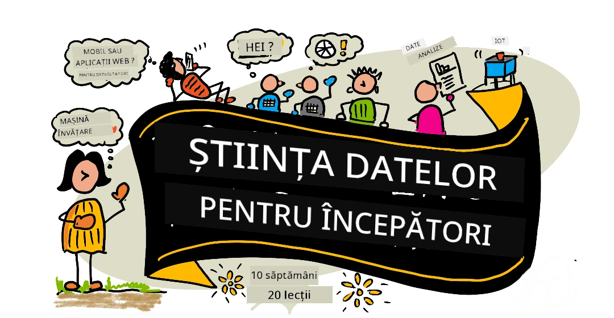
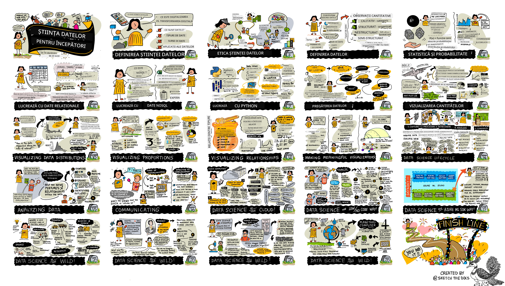

# Data Science pentru Începători - Un Curriculum

[](https://github.com/codespaces/new?hide_repo_select=true&ref=main&repo=344191198)

[](https://github.com/microsoft/Data-Science-For-Beginners/blob/master/LICENSE)
[](https://GitHub.com/microsoft/Data-Science-For-Beginners/graphs/contributors/)
[](https://GitHub.com/microsoft/Data-Science-For-Beginners/issues/)
[](https://GitHub.com/microsoft/Data-Science-For-Beginners/pulls/)
[](http://makeapullrequest.com)

[](https://GitHub.com/microsoft/Data-Science-For-Beginners/watchers/)
[](https://GitHub.com/microsoft/Data-Science-For-Beginners/network/)
[](https://GitHub.com/microsoft/Data-Science-For-Beginners/stargazers/)


[](https://discord.gg/nTYy5BXMWG)

[](https://aka.ms/foundry/forum)

Azure Cloud Advocates de la Microsoft sunt încântați să ofere un curriculum de 10 săptămâni, cu 20 de lecții despre Data Science. Fiecare lecție include chestionare înainte și după lecție, instrucțiuni scrise pentru finalizarea lecției, o soluție și o temă. Pedagogia noastră bazată pe proiecte vă permite să învățați în timp ce construiți, o metodă dovedită prin care noile abilități „se fixează”.

**Mulțumiri călduroase autorilor noștri:** [Jasmine Greenaway](https://www.twitter.com/paladique), [Dmitry Soshnikov](http://soshnikov.com), [Nitya Narasimhan](https://twitter.com/nitya), [Jalen McGee](https://twitter.com/JalenMcG), [Jen Looper](https://twitter.com/jenlooper), [Maud Levy](https://twitter.com/maudstweets), [Tiffany Souterre](https://twitter.com/TiffanySouterre), [Christopher Harrison](https://www.twitter.com/geektrainer).

**🙏 Mulțumiri speciale 🙏 autorilor, recenzorilor și contributorilor de conținut [Microsoft Student Ambassador](https://studentambassadors.microsoft.com/),** în special Aaryan Arora, [Aditya Garg](https://github.com/AdityaGarg00), [Alondra Sanchez](https://www.linkedin.com/in/alondra-sanchez-molina/), [Ankita Singh](https://www.linkedin.com/in/ankitasingh007), [Anupam Mishra](https://www.linkedin.com/in/anupam--mishra/), [Arpita Das](https://www.linkedin.com/in/arpitadas01/), ChhailBihari Dubey, [Dibri Nsofor](https://www.linkedin.com/in/dibrinsofor), [Dishita Bhasin](https://www.linkedin.com/in/dishita-bhasin-7065281bb), [Majd Safi](https://www.linkedin.com/in/majd-s/), [Max Blum](https://www.linkedin.com/in/max-blum-6036a1186/), [Miguel Correa](https://www.linkedin.com/in/miguelmque/), [Mohamma Iftekher (Iftu) Ebne Jalal](https://twitter.com/iftu119), [Nawrin Tabassum](https://www.linkedin.com/in/nawrin-tabassum), [Raymond Wangsa Putra](https://www.linkedin.com/in/raymond-wp/), [Rohit Yadav](https://www.linkedin.com/in/rty2423), Samridhi Sharma, [Sanya Sinha](https://www.linkedin.com/mwlite/in/sanya-sinha-13aab1200),
[Sheena Narula](https://www.linkedin.com/in/sheena-narua-n/), [Tauqeer Ahmad](https://www.linkedin.com/in/tauqeerahmad5201/), Yogendrasingh Pawar , [Vidushi Gupta](https://www.linkedin.com/in/vidushi-gupta07/), [Jasleen Sondhi](https://www.linkedin.com/in/jasleen-sondhi/)

||
|:---:|
| Data Science pentru Începători - _Sketchnote de [@nitya](https://twitter.com/nitya)_ |

### 🌐 Suport Multilingv

#### Suport prin GitHub Action (Automatizat și Mereu Actualizat)

<!-- CO-OP TRANSLATOR LANGUAGES TABLE START -->
[Arabic](../ar/README.md) | [Bengali](../bn/README.md) | [Bulgarian](../bg/README.md) | [Burmese (Myanmar)](../my/README.md) | [Chinese (Simplified)](../zh-CN/README.md) | [Chinese (Traditional, Hong Kong)](../zh-HK/README.md) | [Chinese (Traditional, Macau)](../zh-MO/README.md) | [Chinese (Traditional, Taiwan)](../zh-TW/README.md) | [Croatian](../hr/README.md) | [Czech](../cs/README.md) | [Danish](../da/README.md) | [Dutch](../nl/README.md) | [Estonian](../et/README.md) | [Finnish](../fi/README.md) | [French](../fr/README.md) | [German](../de/README.md) | [Greek](../el/README.md) | [Hebrew](../he/README.md) | [Hindi](../hi/README.md) | [Hungarian](../hu/README.md) | [Indonesian](../id/README.md) | [Italian](../it/README.md) | [Japanese](../ja/README.md) | [Kannada](../kn/README.md) | [Khmer](../km/README.md) | [Korean](../ko/README.md) | [Lithuanian](../lt/README.md) | [Malay](../ms/README.md) | [Malayalam](../ml/README.md) | [Marathi](../mr/README.md) | [Nepali](../ne/README.md) | [Nigerian Pidgin](../pcm/README.md) | [Norwegian](../no/README.md) | [Persian (Farsi)](../fa/README.md) | [Polish](../pl/README.md) | [Portuguese (Brazil)](../pt-BR/README.md) | [Portuguese (Portugal)](../pt-PT/README.md) | [Punjabi (Gurmukhi)](../pa/README.md) | [Romanian](./README.md) | [Russian](../ru/README.md) | [Serbian (Cyrillic)](../sr/README.md) | [Slovak](../sk/README.md) | [Slovenian](../sl/README.md) | [Spanish](../es/README.md) | [Swahili](../sw/README.md) | [Swedish](../sv/README.md) | [Tagalog (Filipino)](../tl/README.md) | [Tamil](../ta/README.md) | [Telugu](../te/README.md) | [Thai](../th/README.md) | [Turkish](../tr/README.md) | [Ukrainian](../uk/README.md) | [Urdu](../ur/README.md) | [Vietnamese](../vi/README.md)

> **Preferi să clonezi local?**
>
> Acest depozit include traduceri în peste 50 de limbi, ceea ce mărește semnificativ dimensiunea descărcării. Pentru a clona fără traduceri, folosește sparse checkout:
>
> **Bash / macOS / Linux:**
> ```bash
> git clone --filter=blob:none --sparse https://github.com/microsoft/Data-Science-For-Beginners.git
> cd Data-Science-For-Beginners
> git sparse-checkout set --no-cone '/*' '!translations' '!translated_images'
> ```
>
> **CMD (Windows):**
> ```cmd
> git clone --filter=blob:none --sparse https://github.com/microsoft/Data-Science-For-Beginners.git
> cd Data-Science-For-Beginners
> git sparse-checkout set --no-cone "/*" "!translations" "!translated_images"
> ```
>
> Aceasta îți oferă tot ce ai nevoie pentru a finaliza cursul cu o descărcare mult mai rapidă.
<!-- CO-OP TRANSLATOR LANGUAGES TABLE END -->

**Dacă dorești să sprijini limbile de traducere suplimentare, acestea sunt listate [aici](https://github.com/Azure/co-op-translator/blob/main/getting_started/supported-languages.md)**

#### Alătură-te Comunității Noastre  
[](https://discord.gg/nTYy5BXMWG)

Avem în desfășurare o serie pe Discord despre învățarea cu AI, află mai multe și alătură-te nouă la [Learn with AI Series](https://aka.ms/learnwithai/discord) în perioada 18 - 30 septembrie 2025. Vei primi sfaturi și trucuri despre utilizarea GitHub Copilot pentru Data Science.


# Ești student?

Începe cu următoarele resurse:

- [Pagina Student Hub](https://docs.microsoft.com/en-gb/learn/student-hub?WT.mc_id=academic-77958-bethanycheum) Pe această pagină vei găsi resurse pentru începători, pachete pentru studenți și chiar modalități de a obține un voucher gratuit pentru certificare. Aceasta este o pagină pe care vrei să o marchezi și să o verifici din când în când deoarece actualizăm conținutul cel puțin lunar.
- [Microsoft Learn Student Ambassadors](https://studentambassadors.microsoft.com?WT.mc_id=academic-77958-bethanycheum) Alătură-te unei comunități globale de ambasadori studenți, acest lucru ar putea fi calea ta spre Microsoft.

# Începutul

## 📚 Documentație

- **[Ghid de instalare](INSTALLATION.md)** - Instrucțiuni pas cu pas pentru configurarea începătorilor
- **[Ghid de utilizare](USAGE.md)** - Exemple și fluxuri comune de lucru
- **[Depanare](TROUBLESHOOTING.md)** - Soluții pentru probleme frecvente
- **[Ghid de contribuție](CONTRIBUTING.md)** - Cum să contribui la acest proiect
- **[Pentru profesori](for-teachers.md)** - Ghid didactic și resurse pentru clasă

## 👨‍🎓 Pentru Studenți
> **Începători Compleți**: Ești nou în data science? Începe cu [exemplele prietenoase pentru începători](examples/README.md)! Aceste exemple simple, bine comentate te vor ajuta să înțelegi elementele de bază înainte de a te aventura în curriculum complet.
> **[Studenți](https://aka.ms/student-page)**: pentru a folosi acest curriculum pe cont propriu, fă fork la întregul depozit și finalizează exercițiile singur, începând cu un chestionar înainte de lecție. Apoi citește lecția și finalizează restul activităților. Încearcă să creezi proiectele înțelegând lecțiile în loc să copiezi codul soluțiilor; totuși, acest cod este disponibil în folderele /solutions din fiecare lecție orientată pe proiecte. O altă idee ar fi să formezi un grup de studiu cu prietenii și să parcurgeți conținutul împreună. Pentru studii suplimentare, recomandăm [Microsoft Learn](https://docs.microsoft.com/en-us/users/jenlooper-2911/collections/qprpajyoy3x0g7?WT.mc_id=academic-77958-bethanycheum).

**Pornire rapidă:**
1. Verifică [Ghidul de instalare](INSTALLATION.md) pentru a-ți configura mediul
2. Consultă [Ghidul de utilizare](USAGE.md) pentru a învăța cum să folosești curriculumul
3. Începe cu Lecția 1 și parcurge-le în ordine
4. Alătură-te comunității noastre de pe [Discord](https://aka.ms/ds4beginners/discord) pentru suport

## 👩‍🏫 Pentru Profesori
> **Profesori**: am [inclus câteva sugestii](for-teachers.md) despre cum să folosiți acest curriculum. Ne-ar plăcea să primim feedback-ul vostru [în forumul nostru de discuții](https://github.com/microsoft/Data-Science-For-Beginners/discussions)!

## Cunoaște echipa

[](https://youtu.be/8mzavjQSMM4 "Video promoțional")

**Gif de** [Mohit Jaisal](https://www.linkedin.com/in/mohitjaisal)

> 🎥 Apasă pe imaginea de mai sus pentru un videoclip despre proiect și oamenii care l-au creat!

## Pedagogie

Am ales două principii pedagogice în construirea acestui curriculum: să fie bazat pe proiecte și să includă teste frecvente. La finalul acestei serii, studenții vor fi învățat principii de bază ale științei datelor, inclusiv concepte etice, pregătirea datelor, diferite moduri de a lucra cu datele, vizualizarea datelor, analiza datelor, cazuri reale de utilizare a științei datelor și altele.

În plus, un test cu mize scăzute înainte de o lecție setează intenția studentului de a învăța un subiect, în timp ce un al doilea test după lecție asigură o retenție suplimentară. Acest curriculum a fost proiectat să fie flexibil și distractiv și poate fi parcurs integral sau parțial. Proiectele încep mic și devin din ce în ce mai complexe până la finalul ciclului de 10 săptămâni.

> Găsiți [Codul nostru de conduită](CODE_OF_CONDUCT.md), [Ghidul de contribuție](CONTRIBUTING.md), [Ghidul de traduceri](TRANSLATIONS.md). Apreciem feedback-ul constructiv!

## Fiecare lecție include:

- Schiță opțională (sketchnote)
- Video suplimentar opțional
- Test de încălzire înainte de lecție
- Lecție scrisă
- Pentru lecțiile bazate pe proiecte, ghiduri pas cu pas pentru a construi proiectul
- Verificări de cunoștințe
- O provocare
- Lecturi suplimentare
- Temă
- [Test post-lecție](https://ff-quizzes.netlify.app/en/)

> **O notă despre teste**: Toate testele sunt conținute în folderul Quiz-App, în total 40 de teste a câte trei întrebări fiecare. Ele sunt legate din lecții, dar aplicația de teste poate fi rulată local sau implementată pe Azure; urmați instrucțiunile din folderul `quiz-app`. Sunt localizate treptat.

## 🎓 Exemple prietenoase pentru începători

**Ești nou în Știința datelor?** Am creat un director special de [exemple](examples/README.md) cu cod simplu și bine comentat pentru a te ajuta să începi:

- 🌟 **Hello World** - Primul tău program de știința datelor
- 📂 **Încărcarea datelor** - Învățarea modului de a citi și explora seturi de date
- 📊 **Analiză simplă** - Calcularea statisticilor și găsirea tiparelor
- 📈 **Vizualizare de bază** - Crearea de diagrame și grafice
- 🔬 **Proiect real** - Flux complet de muncă de la început până la sfârșit

Fiecare exemplu include comentarii detaliate care explică fiecare pas, fiind perfect pentru începători absoluti!

👉 **[Începe cu exemplele](examples/README.md)** 👈

## Lecții


||
|:---:|
| Știința datelor pentru începători: Foaie de parcurs - _Schiță de [@nitya](https://twitter.com/nitya)_ |


| Număr lecție | Subiect | Grupare lecție | Obiective de învățare | Lecție legată | Autor |
| :-----------: | :----------------------------------------: | :--------------------------------------------------: | :-----------------------------------------------------------------------------------------------------------------------------------------------------------------------: | :---------------------------------------------------------------------: | :----: |
| 01 | Definirea Științei datelor | [Introducere](1-Introduction/README.md) | Aflați conceptele de bază din spatele științei datelor și cum este legată de inteligența artificială, învățarea automată și big data. | [lecție](1-Introduction/01-defining-data-science/README.md) [video](https://youtu.be/beZ7Mb_oz9I) | [Dmitry](http://soshnikov.com) |
| 02 | Etica în Știința datelor | [Introducere](1-Introduction/README.md) | Concepute etice, provocări și cadre de etică a datelor. | [lecție](1-Introduction/02-ethics/README.md) | [Nitya](https://twitter.com/nitya) |
| 03 | Definirea datelor | [Introducere](1-Introduction/README.md) | Cum sunt clasificate datele și sursele lor comune. | [lecție](1-Introduction/03-defining-data/README.md) | [Jasmine](https://www.twitter.com/paladique) |
| 04 | Introducere în Statistică & Probabilitate | [Introducere](1-Introduction/README.md) | Tehnici matematice de probabilitate și statistică pentru a înțelege datele. | [lecție](1-Introduction/04-stats-and-probability/README.md) [video](https://youtu.be/Z5Zy85g4Yjw) | [Dmitry](http://soshnikov.com) |
| 05 | Lucrul cu date relaționale | [Lucru cu date](2-Working-With-Data/README.md) | Introducere în date relaționale și noțiuni de bază despre explorarea și analizarea datelor relaționale cu limbajul SQL (pronunțat "see-quell"). | [lecție](2-Working-With-Data/05-relational-databases/README.md) | [Christopher](https://www.twitter.com/geektrainer) | | |
| 06 | Lucrul cu date NoSQL | [Lucru cu date](2-Working-With-Data/README.md) | Introducere în date non-relaționale, tipurile lor diverse și noțiuni de bază despre explorarea și analizarea bazelor de date documentare. | [lecție](2-Working-With-Data/06-non-relational/README.md) | [Jasmine](https://twitter.com/paladique)|
| 07 | Lucrul cu Python | [Lucru cu date](2-Working-With-Data/README.md) | Bazele folosirii Python pentru explorarea datelor cu biblioteci precum Pandas. Este recomandată o înțelegere fundamentală a programării în Python. | [lecție](2-Working-With-Data/07-python/README.md) [video](https://youtu.be/dZjWOGbsN4Y) | [Dmitry](http://soshnikov.com) |
| 08 | Pregătirea datelor | [Lucru cu date](2-Working-With-Data/README.md) | Tehnici de curățare și transformare a datelor pentru a face față provocărilor datelor lipsă, inexacte sau incomplete. | [lecție](2-Working-With-Data/08-data-preparation/README.md) | [Jasmine](https://www.twitter.com/paladique) |
| 09 | Vizualizarea cantităților | [Vizualizarea datelor](3-Data-Visualization/README.md) | Învățați să folosiți Matplotlib pentru a vizualiza datele despre păsări 🦆 | [lecție](3-Data-Visualization/09-visualization-quantities/README.md) | [Jen](https://twitter.com/jenlooper) |
| 10 | Vizualizarea distribuțiilor datelor | [Vizualizarea datelor](3-Data-Visualization/README.md) | Vizualizarea observațiilor și tendințelor într-un interval. | [lecție](3-Data-Visualization/10-visualization-distributions/README.md) | [Jen](https://twitter.com/jenlooper) |
| 11 | Vizualizarea proporțiilor | [Vizualizarea datelor](3-Data-Visualization/README.md) | Vizualizarea procentajelor discrete și grupate. | [lecție](3-Data-Visualization/11-visualization-proportions/README.md) | [Jen](https://twitter.com/jenlooper) |
| 12 | Vizualizarea relațiilor | [Vizualizarea datelor](3-Data-Visualization/README.md) | Vizualizarea conexiunilor și corelațiilor între seturi de date și variabilele lor. | [lecție](3-Data-Visualization/12-visualization-relationships/README.md) | [Jen](https://twitter.com/jenlooper) |
| 13 | Vizualizări semnificative | [Vizualizarea datelor](3-Data-Visualization/README.md) | Tehnici și ghiduri pentru a face vizualizările valoroase pentru rezolvarea eficientă a problemelor și obținerea de informații. | [lecție](3-Data-Visualization/13-meaningful-visualizations/README.md) | [Jen](https://twitter.com/jenlooper) |
| 14 | Introducere în ciclul de viață al științei datelor | [Ciclul de viață](4-Data-Science-Lifecycle/README.md) | Introducere în ciclul de viață al științei datelor și prima etapă de achiziție și extragere a datelor. | [lecție](4-Data-Science-Lifecycle/14-Introduction/README.md) | [Jasmine](https://twitter.com/paladique) |
| 15 | Analiză | [Ciclul de viață](4-Data-Science-Lifecycle/README.md) | Această fază a ciclului de viață al științei datelor se concentrează pe tehnici de analiză a datelor. | [lecție](4-Data-Science-Lifecycle/15-analyzing/README.md) | [Jasmine](https://twitter.com/paladique) | | |
| 16 | Comunicare | [Ciclul de viață](4-Data-Science-Lifecycle/README.md) | Această fază a ciclului de viață al științei datelor se concentrează pe prezentarea informațiilor extrase din date într-un mod ușor de înțeles pentru factorii decizionali. | [lecție](4-Data-Science-Lifecycle/16-communication/README.md) | [Jalen](https://twitter.com/JalenMcG) | | |
| 17 | Știința datelor în Cloud | [Date în Cloud](5-Data-Science-In-Cloud/README.md) | Această serie de lecții introduce știința datelor în cloud și beneficiile sale. | [lecție](5-Data-Science-In-Cloud/17-Introduction/README.md) | [Tiffany](https://twitter.com/TiffanySouterre) și [Maud](https://twitter.com/maudstweets) |
| 18 | Știința datelor în Cloud | [Date în Cloud](5-Data-Science-In-Cloud/README.md) | Antrenarea modelelor folosind instrumente Low Code. |[lecție](5-Data-Science-In-Cloud/18-Low-Code/README.md) | [Tiffany](https://twitter.com/TiffanySouterre) și [Maud](https://twitter.com/maudstweets) |
| 19 | Știința datelor în Cloud | [Date în Cloud](5-Data-Science-In-Cloud/README.md) | Implementarea modelelor cu Azure Machine Learning Studio. | [lecție](5-Data-Science-In-Cloud/19-Azure/README.md)| [Tiffany](https://twitter.com/TiffanySouterre) și [Maud](https://twitter.com/maudstweets) |
| 20 | Știința datelor în mediul real | [În mediul real](6-Data-Science-In-Wild/README.md) | Proiecte de știința datelor aplicate în viața reală. | [lecție](6-Data-Science-In-Wild/20-Real-World-Examples/README.md) | [Nitya](https://twitter.com/nitya) |

## GitHub Codespaces

Urmați acești pași pentru a deschide acest exemplu într-un Codespace:
1. Apăsați meniul derulant Code și selectați opțiunea Open with Codespaces.
2. Selectați + New codespace în partea de jos a panoului.
Pentru mai multe informații, consultați [documentația GitHub](https://docs.github.com/en/codespaces/developing-in-codespaces/creating-a-codespace-for-a-repository#creating-a-codespace).

## VSCode Remote - Containers
Urmați acești pași pentru a deschide acest depozit într-un container utilizând mașina locală și VSCode cu extensia VS Code Remote - Containers:

1. Dacă este prima dată când folosiți un container de dezvoltare, asigurați-vă că sistemul îndeplinește cerințele (de exemplu, să aveți Docker instalat) din [documentația de început](https://code.visualstudio.com/docs/devcontainers/containers#_getting-started).

Pentru a folosi acest depozit, îl puteți fie deschide într-un volum Docker izolat:

**Notă**: Sub capotă, acest lucru va folosi comanda Remote-Containers: **Clone Repository in Container Volume...** pentru a clona codul sursă într-un volum Docker în loc de sistemul de fișiere local. [Volumele](https://docs.docker.com/storage/volumes/) sunt mecanismul preferat pentru persistarea datelor containerelor.

Sau deschideți o versiune clonată sau descărcată local a depozitului:

- Clonați acest depozit în sistemul de fișiere local.
- Apăsați F1 și selectați comanda **Remote-Containers: Open Folder in Container...**.
- Selectați copia clonată a acestui folder, așteptați pornirea containerului și testați.

## Acces offline

Puteți rula această documentație offline folosind [Docsify](https://docsify.js.org/#/). Faceți un fork al acestui repo, [instalați Docsify](https://docsify.js.org/#/quickstart) pe mașina locală, apoi în folderul rădăcină al acestui repo, tastați `docsify serve`. Site-ul web va fi servit pe portul 3000 pe localhost: `localhost:3000`.

> Notă, notebook-urile nu vor fi redrenderizate prin Docsify, așa că atunci când aveți nevoie să rulați un notebook, faceți asta separat în VS Code rulând un kernel Python.

## Alte curriculumuri

Echipa noastră produce și alte curriculumuri! Verificați:

<!-- CO-OP TRANSLATOR OTHER COURSES START -->
### LangChain
[](https://aka.ms/langchain4j-for-beginners)
[](https://aka.ms/langchainjs-for-beginners?WT.mc_id=m365-94501-dwahlin)
[](https://github.com/microsoft/langchain-for-beginners?WT.mc_id=m365-94501-dwahlin)
---

### Azure / Edge / MCP / Agenți
[](https://github.com/microsoft/AZD-for-beginners?WT.mc_id=academic-105485-koreyst)
[](https://github.com/microsoft/edgeai-for-beginners?WT.mc_id=academic-105485-koreyst)
[](https://github.com/microsoft/mcp-for-beginners?WT.mc_id=academic-105485-koreyst)
[](https://github.com/microsoft/ai-agents-for-beginners?WT.mc_id=academic-105485-koreyst)

---
 
### Seria AI Generativ
[](https://github.com/microsoft/generative-ai-for-beginners?WT.mc_id=academic-105485-koreyst)
[-9333EA?style=for-the-badge&labelColor=E5E7EB&color=9333EA)](https://github.com/microsoft/Generative-AI-for-beginners-dotnet?WT.mc_id=academic-105485-koreyst)
[-C084FC?style=for-the-badge&labelColor=E5E7EB&color=C084FC)](https://github.com/microsoft/generative-ai-for-beginners-java?WT.mc_id=academic-105485-koreyst)
[-E879F9?style=for-the-badge&labelColor=E5E7EB&color=E879F9)](https://github.com/microsoft/generative-ai-with-javascript?WT.mc_id=academic-105485-koreyst)

---
 
### Învățare de bază
[](https://aka.ms/ml-beginners?WT.mc_id=academic-105485-koreyst)
[](https://aka.ms/datascience-beginners?WT.mc_id=academic-105485-koreyst)
[](https://aka.ms/ai-beginners?WT.mc_id=academic-105485-koreyst)
[](https://github.com/microsoft/Security-101?WT.mc_id=academic-96948-sayoung)
[](https://aka.ms/webdev-beginners?WT.mc_id=academic-105485-koreyst)
[](https://aka.ms/iot-beginners?WT.mc_id=academic-105485-koreyst)
[](https://github.com/microsoft/xr-development-for-beginners?WT.mc_id=academic-105485-koreyst)

---
 
### Seria Copilot
[](https://aka.ms/GitHubCopilotAI?WT.mc_id=academic-105485-koreyst)
[](https://github.com/microsoft/mastering-github-copilot-for-dotnet-csharp-developers?WT.mc_id=academic-105485-koreyst)
[](https://github.com/microsoft/CopilotAdventures?WT.mc_id=academic-105485-koreyst)
<!-- CO-OP TRANSLATOR OTHER COURSES END -->

## Obținerea Ajutorului

**Întâmpinați probleme?** Consultați [Ghidul de depanare](TROUBLESHOOTING.md) pentru soluții la probleme comune.

Dacă aveți dificultăți sau întrebări despre construirea aplicațiilor AI, alăturați-vă colegilor cursanți și dezvoltatorilor experimentați în discuții despre MCP. Este o comunitate de susținere unde întrebările sunt binevenite și cunoștințele sunt împărtășite liber.

[](https://discord.gg/nTYy5BXMWG)

Dacă aveți sugestii privind produsul sau erori în timpul dezvoltării, vizitați:

[](https://aka.ms/foundry/forum)

---

<!-- CO-OP TRANSLATOR DISCLAIMER START -->
**Declinare a responsabilității**:  
Acest document a fost tradus folosind serviciul de traducere AI [Co-op Translator](https://github.com/Azure/co-op-translator). Deși ne străduim pentru acuratețe, vă rugăm să rețineți că traducerile automate pot conține erori sau inexactități. Documentul original în limba sa natală trebuie considerat sursa autorizată. Pentru informații critice, se recomandă utilizarea traducerii profesionale realizate de un traducător uman. Nu ne asumăm responsabilitatea pentru eventuale neînțelegeri sau interpretări greșite rezultate din utilizarea acestei traduceri.
<!-- CO-OP TRANSLATOR DISCLAIMER END -->