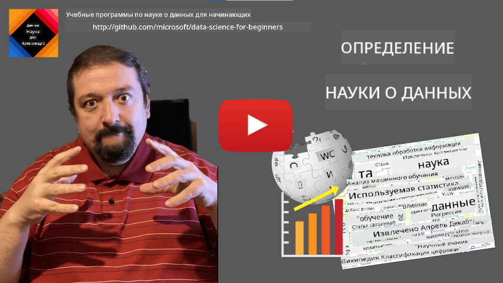
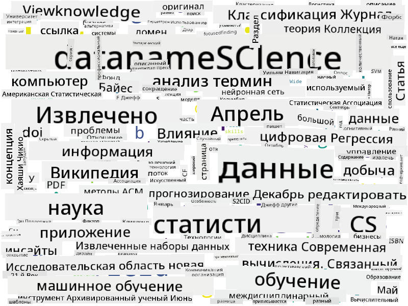

<!--
CO_OP_TRANSLATOR_METADATA:
{
  "original_hash": "2583a9894af7123b2fcae3376b14c035",
  "translation_date": "2025-08-27T08:57:25+00:00",
  "source_file": "1-Introduction/01-defining-data-science/README.md",
  "language_code": "ru"
}
-->
# Определение науки о данных

|  ](../../sketchnotes/01-Definitions.png) |
| :------------------------------------------------------------------------------------------------: |
|              Определение науки о данных - _Скетчноут от [@nitya](https://twitter.com/nitya)_        |

---

## [Тест перед лекцией](https://purple-hill-04aebfb03.1.azurestaticapps.net/quiz/0)

## Что такое данные?
В нашей повседневной жизни мы постоянно окружены данными. Текст, который вы сейчас читаете, — это данные. Список телефонных номеров ваших друзей в смартфоне — это данные, как и текущее время, отображаемое на ваших часах. Как люди, мы естественным образом оперируем данными, подсчитывая деньги или пишем письма друзьям.

Однако данные стали гораздо более важными с появлением компьютеров. Основная роль компьютеров — выполнять вычисления, но для этого им нужны данные. Поэтому нам нужно понять, как компьютеры хранят и обрабатывают данные.

С появлением Интернета роль компьютеров как устройств для работы с данными возросла. Если задуматься, мы все чаще используем компьютеры для обработки и передачи данных, а не для собственно вычислений. Когда мы пишем электронное письмо другу или ищем информацию в Интернете, мы, по сути, создаем, храним, передаем и манипулируем данными.
> Можете ли вы вспомнить, когда в последний раз использовали компьютер для выполнения именно вычислений?

## Что такое наука о данных?

На [Википедии](https://en.wikipedia.org/wiki/Data_science) **наука о данных** определяется как *научная область, использующая научные методы для извлечения знаний и инсайтов из структурированных и неструктурированных данных, а также для применения этих знаний и инсайтов в различных областях*. 

Это определение подчеркивает следующие важные аспекты науки о данных:

* Основная цель науки о данных — **извлечение знаний** из данных, другими словами, **понимание** данных, поиск скрытых взаимосвязей и построение **моделей**.
* Наука о данных использует **научные методы**, такие как теория вероятностей и статистика. На самом деле, когда термин *наука о данных* только появился, некоторые утверждали, что это просто новое модное название для статистики. Сегодня очевидно, что эта область гораздо шире.    
* Полученные знания должны быть применены для получения **практических инсайтов**, то есть таких, которые можно использовать в реальных бизнес-ситуациях.
* Мы должны уметь работать как со **структурированными**, так и с **неструктурированными** данными. Мы вернемся к обсуждению различных типов данных позже в курсе.
* **Область применения** — важное понятие, и ученым по данным часто требуется хотя бы базовое понимание предметной области, например: финансы, медицина, маркетинг и т.д.

> Еще один важный аспект науки о данных заключается в том, что она изучает, как данные могут быть собраны, сохранены и обработаны с помощью компьютеров. Если статистика дает нам математические основы, то наука о данных применяет математические концепции для извлечения инсайтов из данных.

Один из подходов (приписываемый [Джиму Грею](https://en.wikipedia.org/wiki/Jim_Gray_(computer_scientist))) к пониманию науки о данных — рассматривать ее как отдельную парадигму науки:
* **Эмпирическая**, где мы полагаемся в основном на наблюдения и результаты экспериментов
* **Теоретическая**, где новые концепции возникают из существующих научных знаний
* **Вычислительная**, где мы открываем новые принципы на основе вычислительных экспериментов
* **Данные-ориентированная**, основанная на обнаружении взаимосвязей и закономерностей в данных  

## Другие смежные области

Поскольку данные повсеместны, наука о данных также является широкой областью, затрагивающей многие другие дисциплины.

## Типы данных

Как мы уже упоминали, данные повсюду. Нам просто нужно правильно их зафиксировать! Полезно различать **структурированные** и **неструктурированные** данные. Первые обычно представлены в хорошо организованной форме, часто в виде таблицы или нескольких таблиц, тогда как вторые — это просто набор файлов. Иногда также можно говорить о **полуструктурированных** данных, которые имеют некоторую структуру, но она может значительно варьироваться.

| Структурированные                                                           | Полуструктурированные                                                                          | Неструктурированные                     |
| ---------------------------------------------------------------------------- | --------------------------------------------------------------------------------------------- | --------------------------------------- |
| Список людей с их номерами телефонов                                        | Страницы Википедии с ссылками                                                                 | Текст Энциклопедии Британника           |
| Температура во всех комнатах здания каждую минуту за последние 20 лет       | Коллекция научных статей в формате JSON с авторами, датой публикации и аннотацией             | Файловое хранилище с корпоративными документами |
| Данные о возрасте и поле всех людей, входящих в здание                      | Интернет-страницы                                                                             | Сырой видеопоток с камеры наблюдения    |

## Где взять данные

Существует множество возможных источников данных, и перечислить их все невозможно! Однако давайте упомянем некоторые типичные места, где можно получить данные:

* **Структурированные**
  - **Интернет вещей** (IoT), включая данные с различных датчиков, таких как датчики температуры или давления, предоставляет множество полезных данных. Например, если офисное здание оснащено IoT-датчиками, можно автоматически управлять отоплением и освещением для минимизации затрат. 
  - **Опросы**, которые мы просим пользователей заполнить после покупки или посещения сайта.
  - **Анализ поведения** может, например, помочь понять, насколько глубоко пользователь изучает сайт и что обычно заставляет его покинуть сайт.
* **Неструктурированные**
  - **Тексты** могут быть богатым источником инсайтов, таких как общий **оценочный тон**, или извлечение ключевых слов и семантического значения.
  - **Изображения** или **видео**. Видео с камеры наблюдения может быть использовано для оценки дорожного трафика и информирования людей о возможных пробках.
  - **Логи веб-сервера** могут помочь понять, какие страницы сайта посещаются чаще всего и как долго.
* **Полуструктурированные**
  - **Графы социальных сетей** могут быть отличным источником данных о личностях пользователей и их потенциальной эффективности в распространении информации.
  - Если у нас есть множество фотографий с вечеринки, мы можем попытаться извлечь данные о **групповой динамике**, построив граф людей, фотографирующихся вместе.

Зная о различных возможных источниках данных, вы можете подумать о различных сценариях, где методы науки о данных могут быть применены для лучшего понимания ситуации и улучшения бизнес-процессов.

## Что можно делать с данными

В науке о данных мы сосредотачиваемся на следующих этапах работы с данными:

Конечно, в зависимости от конкретных данных некоторые этапы могут отсутствовать (например, если данные уже находятся в базе данных или если обучение модели не требуется), а некоторые этапы могут повторяться несколько раз (например, обработка данных).

## Цифровизация и цифровая трансформация

В последнее десятилетие многие компании начали осознавать важность данных при принятии бизнес-решений. Чтобы применять принципы науки о данных в бизнесе, сначала нужно собрать данные, то есть перевести бизнес-процессы в цифровую форму. Это называется **цифровизацией**. Применение методов науки о данных к этим данным для принятия решений может привести к значительному росту производительности (или даже к изменению бизнес-модели), что называется **цифровой трансформацией**.

Рассмотрим пример. Допустим, у нас есть курс по науке о данных (например, этот), который мы проводим онлайн для студентов, и мы хотим использовать науку о данных для его улучшения. Как это можно сделать?

Мы можем начать с вопроса: "Что можно оцифровать?" Самый простой способ — измерить время, которое требуется каждому студенту для завершения каждого модуля, и оценить полученные знания, предложив тест с выбором ответа в конце каждого модуля. Усреднив время завершения по всем студентам, мы можем выяснить, какие модули вызывают наибольшие трудности, и поработать над их упрощением.
Вы можете возразить, что этот подход не является идеальным, потому что модули могут быть разной длины. Вероятно, было бы справедливее разделить время на длину модуля (в количестве символов) и сравнивать уже эти значения.
Когда мы начинаем анализировать результаты тестов с множественным выбором, мы можем попытаться определить, какие концепции вызывают трудности у студентов, и использовать эту информацию для улучшения содержания. Для этого необходимо разработать тесты таким образом, чтобы каждый вопрос соответствовал определенной концепции или части знаний.

Если мы хотим усложнить задачу, мы можем сопоставить время, затраченное на каждый модуль, с возрастной категорией студентов. Возможно, мы обнаружим, что для некоторых возрастных категорий выполнение модуля занимает неоправданно много времени или что студенты бросают его, не завершив. Это может помочь нам дать возрастные рекомендации для модуля и минимизировать неудовлетворенность людей из-за неверных ожиданий.

## 🚀 Задача

В этом задании мы попробуем найти концепции, связанные с областью Data Science, анализируя тексты. Мы возьмем статью из Википедии о Data Science, загрузим и обработаем текст, а затем создадим облако слов, похожее на это:

Посетите [`notebook.ipynb`](../../../../../../../../../1-Introduction/01-defining-data-science/notebook.ipynb ':ignore'), чтобы ознакомиться с кодом. Вы также можете запустить код и увидеть, как он выполняет все преобразования данных в реальном времени.

> Если вы не знаете, как запускать код в Jupyter Notebook, ознакомьтесь с [этой статьей](https://soshnikov.com/education/how-to-execute-notebooks-from-github/).

## [Тест после лекции](https://purple-hill-04aebfb03.1.azurestaticapps.net/quiz/1)

## Задания

* **Задача 1**: Измените приведенный выше код, чтобы найти связанные концепции для областей **Big Data** и **Machine Learning**.
* **Задача 2**: [Подумайте о сценариях Data Science](assignment.md)

## Благодарности

Этот урок был создан с ♥️ [Дмитрием Сошниковым](http://soshnikov.com)

---

**Отказ от ответственности**:  
Этот документ был переведен с использованием сервиса автоматического перевода [Co-op Translator](https://github.com/Azure/co-op-translator). Хотя мы стремимся к точности, пожалуйста, имейте в виду, что автоматические переводы могут содержать ошибки или неточности. Оригинальный документ на его исходном языке следует считать авторитетным источником. Для получения критически важной информации рекомендуется профессиональный перевод человеком. Мы не несем ответственности за любые недоразумения или неправильные толкования, возникшие в результате использования данного перевода.