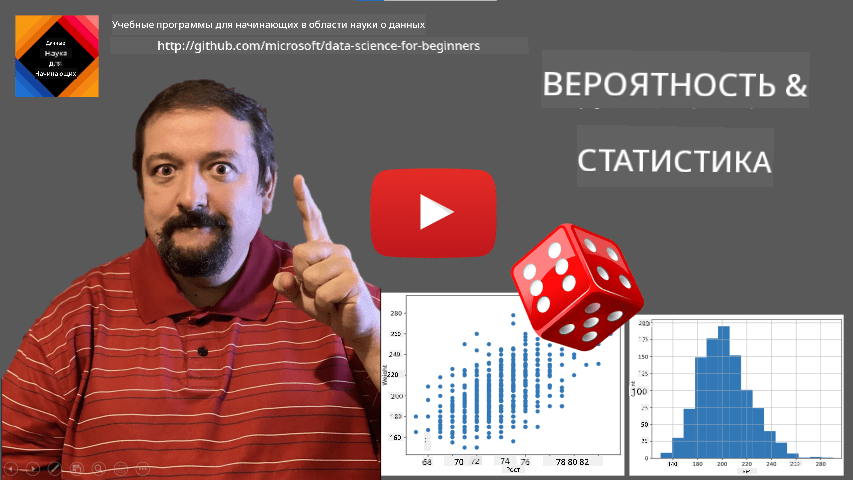
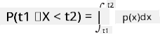
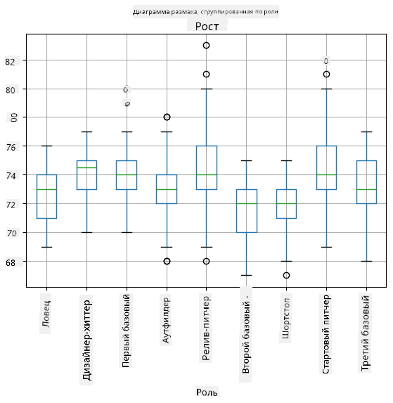
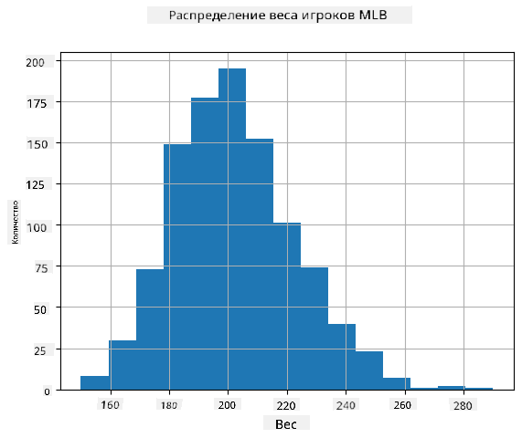
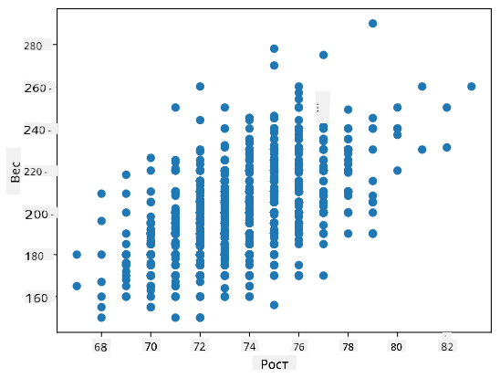

<!--
CO_OP_TRANSLATOR_METADATA:
{
  "original_hash": "b706a07cfa87ba091cbb91e0aa775600",
  "translation_date": "2025-08-27T09:08:53+00:00",
  "source_file": "1-Introduction/04-stats-and-probability/README.md",
  "language_code": "ru"
}
-->
# Краткое введение в статистику и теорию вероятностей

| ](../../sketchnotes/04-Statistics-Probability.png)|
|:---:|
| Статистика и теория вероятностей - _Скетчноут от [@nitya](https://twitter.com/nitya)_ |

Статистика и теория вероятностей — это две тесно связанные области математики, которые имеют большое значение для анализа данных. Можно работать с данными без глубоких знаний математики, но лучше знать хотя бы основные концепции. Здесь мы представим краткое введение, которое поможет вам начать.

[](https://youtu.be/Z5Zy85g4Yjw)

## [Тест перед лекцией](https://purple-hill-04aebfb03.1.azurestaticapps.net/quiz/6)

## Вероятность и случайные величины

**Вероятность** — это число от 0 до 1, которое выражает, насколько вероятно наступление **события**. Она определяется как количество положительных исходов (которые приводят к событию), деленное на общее количество исходов, при условии, что все исходы равновероятны. Например, если мы бросаем кубик, вероятность того, что выпадет четное число, равна 3/6 = 0.5.

Когда мы говорим о событиях, мы используем **случайные величины**. Например, случайная величина, представляющая число, выпавшее при броске кубика, принимает значения от 1 до 6. Множество чисел от 1 до 6 называется **пространством выборки**. Мы можем говорить о вероятности того, что случайная величина примет определенное значение, например P(X=3)=1/6.

Случайная величина в предыдущем примере называется **дискретной**, потому что ее пространство выборки можно пересчитать, то есть есть отдельные значения, которые можно перечислить. Бывают случаи, когда пространство выборки — это диапазон действительных чисел или весь набор действительных чисел. Такие величины называются **непрерывными**. Хорошим примером является время прибытия автобуса.

## Распределение вероятностей

В случае дискретных случайных величин легко описать вероятность каждого события с помощью функции P(X). Для каждого значения *s* из пространства выборки *S* она дает число от 0 до 1, такое, что сумма всех значений P(X=s) для всех событий будет равна 1.

Наиболее известное дискретное распределение — это **равномерное распределение**, в котором пространство выборки состоит из N элементов с равной вероятностью 1/N для каждого из них.

Описать распределение вероятностей непрерывной величины, значения которой берутся из некоторого интервала [a,b] или всего множества действительных чисел ℝ, сложнее. Рассмотрим случай времени прибытия автобуса. На самом деле вероятность того, что автобус прибудет точно в определенное время *t*, равна 0!

> Теперь вы знаете, что события с нулевой вероятностью случаются, и довольно часто! Например, каждый раз, когда прибывает автобус!

Мы можем говорить только о вероятности того, что величина попадет в заданный интервал значений, например P(t<sub>1</sub>≤X<t<sub>2</sub>). В этом случае распределение вероятностей описывается **функцией плотности вероятности** p(x), такой, что



Непрерывный аналог равномерного распределения называется **непрерывным равномерным распределением**, которое определяется на конечном интервале. Вероятность того, что значение X попадет в интервал длиной l, пропорциональна l и достигает 1.

Еще одно важное распределение — это **нормальное распределение**, о котором мы поговорим подробнее ниже.

## Среднее, дисперсия и стандартное отклонение

Предположим, мы берем последовательность из n выборок случайной величины X: x<sub>1</sub>, x<sub>2</sub>, ..., x<sub>n</sub>. Мы можем определить **среднее** (или **арифметическое среднее**) значение последовательности традиционным способом как (x<sub>1</sub>+x<sub>2</sub>+x<sub>n</sub>)/n. Если мы увеличим размер выборки (то есть возьмем предел при n→∞), мы получим среднее значение (также называемое **математическим ожиданием**) распределения. Мы будем обозначать ожидание как **E**(x).

> Можно показать, что для любого дискретного распределения с значениями {x<sub>1</sub>, x<sub>2</sub>, ..., x<sub>N</sub>} и соответствующими вероятностями p<sub>1</sub>, p<sub>2</sub>, ..., p<sub>N</sub>, математическое ожидание будет равно E(X)=x<sub>1</sub>p<sub>1</sub>+x<sub>2</sub>p<sub>2</sub>+...+x<sub>N</sub>p<sub>N</sub>.

Чтобы определить, насколько значения разбросаны, мы можем вычислить дисперсию σ<sup>2</sup> = ∑(x<sub>i</sub> - μ)<sup>2</sup>/n, где μ — это среднее значение последовательности. Значение σ называется **стандартным отклонением**, а σ<sup>2</sup> — **дисперсией**.

## Мода, медиана и квартили

Иногда среднее значение неадекватно представляет "типичное" значение данных. Например, если есть несколько экстремальных значений, которые полностью выходят за рамки, они могут повлиять на среднее. Хорошим показателем является **медиана** — значение, такое, что половина точек данных ниже него, а другая половина — выше.

Чтобы лучше понять распределение данных, полезно говорить о **квартилях**:

* Первый квартиль, или Q1, — это значение, такое, что 25% данных ниже него
* Третий квартиль, или Q3, — это значение, такое, что 75% данных ниже него

Графически мы можем представить связь между медианой и квартилями в диаграмме, называемой **ящик с усами**:


Здесь мы также вычисляем **межквартильный размах** IQR=Q3-Q1 и так называемые **выбросы** — значения, которые лежат за пределами [Q1-1.5*IQR,Q3+1.5*IQR].

Для конечного распределения, содержащего небольшое количество возможных значений, хорошим "типичным" значением является то, которое встречается чаще всего, и оно называется **модой**. Это часто применяется к категориальным данным, таким как цвета. Рассмотрим ситуацию, когда у нас есть две группы людей — одни сильно предпочитают красный цвет, а другие — синий. Если мы кодируем цвета числами, среднее значение для любимого цвета будет где-то в спектре оранжево-зеленого, что не отражает реальных предпочтений ни одной из групп. Однако мода будет либо одним из цветов, либо обоими цветами, если количество людей, голосующих за них, одинаково (в этом случае выборка называется **мультимодальной**).

## Данные из реального мира

Когда мы анализируем данные из реальной жизни, они часто не являются случайными величинами в строгом смысле, то есть мы не проводим эксперименты с неизвестным результатом. Например, рассмотрим команду бейсболистов и их физические данные, такие как рост, вес и возраст. Эти числа не совсем случайны, но мы все равно можем применять те же математические концепции. Например, последовательность весов людей можно рассматривать как последовательность значений, взятых из некоторой случайной величины. Ниже приведена последовательность весов реальных бейсболистов из [Major League Baseball](http://mlb.mlb.com/index.jsp), взятая из [этого набора данных](http://wiki.stat.ucla.edu/socr/index.php/SOCR_Data_MLB_HeightsWeights) (для удобства показаны только первые 20 значений):

```
[180.0, 215.0, 210.0, 210.0, 188.0, 176.0, 209.0, 200.0, 231.0, 180.0, 188.0, 180.0, 185.0, 160.0, 180.0, 185.0, 197.0, 189.0, 185.0, 219.0]
```

> **Примечание**: Чтобы увидеть пример работы с этим набором данных, посмотрите [сопутствующий ноутбук](notebook.ipynb). В этом уроке также есть ряд задач, которые вы можете выполнить, добавив немного кода в этот ноутбук. Если вы не уверены, как работать с данными, не переживайте — мы вернемся к работе с данными с использованием Python позже. Если вы не знаете, как запускать код в Jupyter Notebook, ознакомьтесь с [этой статьей](https://soshnikov.com/education/how-to-execute-notebooks-from-github/).

Вот диаграмма "ящик с усами", показывающая среднее, медиану и квартили для наших данных:


Поскольку наши данные содержат информацию о разных **ролях** игроков, мы также можем построить диаграмму "ящик с усами" по ролям — это позволит нам понять, как значения параметров различаются в зависимости от ролей. На этот раз мы рассмотрим рост:



Эта диаграмма предполагает, что, в среднем, рост игроков первой базы выше, чем рост игроков второй базы. Позже в этом уроке мы узнаем, как можно более формально проверить эту гипотезу и как показать, что наши данные статистически значимы для подтверждения этого.

> При работе с данными из реального мира мы предполагаем, что все точки данных — это выборки, взятые из некоторого распределения вероятностей. Это предположение позволяет нам применять методы машинного обучения и строить рабочие предсказательные модели.

Чтобы увидеть, как распределены наши данные, мы можем построить график, называемый **гистограммой**. Ось X будет содержать количество различных интервалов веса (так называемых **корзин**), а вертикальная ось будет показывать количество раз, когда выборка случайной величины попадала в данный интервал.



Из этой гистограммы видно, что все значения сосредоточены вокруг определенного среднего веса, и чем дальше мы отходим от этого веса, тем реже встречаются веса такого значения. То есть вероятность того, что вес бейсболиста будет сильно отличаться от среднего веса, очень мала. Дисперсия весов показывает степень, в которой веса могут отличаться от среднего.

> Если мы возьмем веса других людей, не из бейсбольной лиги, распределение, вероятно, будет другим. Однако форма распределения останется той же, но среднее и дисперсия изменятся. Таким образом, если мы обучим нашу модель на бейсболистах, она, скорее всего, даст неверные результаты при применении к студентам университета, потому что исходное распределение отличается.

## Нормальное распределение

Распределение весов, которое мы видели выше, очень типично, и многие измерения из реального мира следуют тому же типу распределения, но с разными средним и дисперсией. Это распределение называется **нормальным распределением**, и оно играет очень важную роль в статистике.

Использование нормального распределения — это правильный способ генерации случайных весов потенциальных бейсболистов. Как только мы знаем средний вес `mean` и стандартное отклонение `std`, мы можем сгенерировать 1000 выборок веса следующим образом:
```python
samples = np.random.normal(mean,std,1000)
``` 

Если мы построим гистограмму сгенерированных выборок, мы увидим картину, очень похожую на ту, что показана выше. А если мы увеличим количество выборок и количество корзин, мы можем получить изображение нормального распределения, которое будет ближе к идеальному:


*Нормальное распределение с mean=0 и std.dev=1*

## Доверительные интервалы

Когда мы говорим о весах бейсболистов, мы предполагаем, что существует определенная **случайная величина W**, которая соответствует идеальному распределению вероятностей весов всех бейсболистов (так называемой **популяции**). Наша последовательность весов соответствует подмножеству всех бейсболистов, которое мы называем **выборкой**. Интересный вопрос: можем ли мы узнать параметры распределения W, то есть среднее и дисперсию популяции?

Самый простой ответ — вычислить среднее и дисперсию нашей выборки. Однако может случиться так, что наша случайная выборка не точно представляет всю популяцию. Поэтому имеет смысл говорить о **доверительном интервале**.
> **Доверительный интервал** — это оценка истинного среднего значения генеральной совокупности на основе нашей выборки, которая является точной с определенной вероятностью (или **уровнем доверия**).
Предположим, у нас есть выборка X<sub>1</sub>, ..., X<sub>n</sub> из нашего распределения. Каждый раз, когда мы берем выборку из распределения, мы получаем разное среднее значение μ. Таким образом, μ можно считать случайной величиной. **Доверительный интервал** с уровнем доверия p — это пара значений (L<sub>p</sub>, R<sub>p</sub>), таких, что **P**(L<sub>p</sub>≤μ≤R<sub>p</sub>) = p, то есть вероятность того, что измеренное среднее значение попадет в интервал, равна p.

Детальное обсуждение того, как рассчитываются такие доверительные интервалы, выходит за рамки нашего краткого введения. Более подробную информацию можно найти [на Википедии](https://en.wikipedia.org/wiki/Confidence_interval). Вкратце, мы определяем распределение вычисленного среднего выборки относительно истинного среднего генеральной совокупности, которое называется **распределением Стьюдента**.

> **Интересный факт**: Распределение Стьюдента названо в честь математика Уильяма Сили Госета, который опубликовал свою работу под псевдонимом "Student". Он работал на пивоварне Guinness, и, согласно одной из версий, его работодатель не хотел, чтобы широкая общественность знала, что они используют статистические тесты для оценки качества сырья.

Если мы хотим оценить среднее значение μ нашей генеральной совокупности с уровнем доверия p, нам нужно взять *(1-p)/2-й процентиль* распределения Стьюдента A, который можно либо найти в таблицах, либо вычислить с помощью встроенных функций статистического программного обеспечения (например, Python, R и т.д.). Тогда интервал для μ будет задан как X±A*D/√n, где X — полученное среднее выборки, D — стандартное отклонение.

> **Примечание**: Мы также опускаем обсуждение важной концепции [степеней свободы](https://en.wikipedia.org/wiki/Degrees_of_freedom_(statistics)), которая имеет значение в контексте распределения Стьюдента. Вы можете обратиться к более полным книгам по статистике, чтобы глубже понять эту концепцию.

Пример расчета доверительного интервала для веса и роста приведен в [сопроводительных ноутбуках](notebook.ipynb).

| p    | Средний вес |
|------|-------------|
| 0.85 | 201.73±0.94 |
| 0.90 | 201.73±1.08 |
| 0.95 | 201.73±1.28 |

Обратите внимание, что чем выше вероятность доверия, тем шире доверительный интервал.

## Проверка гипотез

В нашем наборе данных о бейсболистах есть разные роли игроков, которые можно обобщить следующим образом (см. [сопроводительный ноутбук](notebook.ipynb), чтобы узнать, как можно рассчитать эту таблицу):

| Роль              | Рост       | Вес        | Количество |
|-------------------|------------|------------|------------|
| Ловец            | 72.723684  | 204.328947 | 76         |
| Назначенный бьющий | 74.222222  | 220.888889 | 18         |
| Первый базовый    | 74.000000  | 213.109091 | 55         |
| Аутфилдер         | 73.010309  | 199.113402 | 194        |
| Релив-питчер      | 74.374603  | 203.517460 | 315        |
| Второй базовый    | 71.362069  | 184.344828 | 58         |
| Шортстоп          | 71.903846  | 182.923077 | 52         |
| Стартовый питчер  | 74.719457  | 205.163636 | 221        |
| Третий базовый    | 73.044444  | 200.955556 | 45         |

Мы можем заметить, что средний рост первых базовых выше, чем у вторых базовых. Таким образом, мы можем прийти к выводу, что **первые базовые выше вторых базовых**.

> Это утверждение называется **гипотезой**, потому что мы не знаем, является ли этот факт действительно верным.

Однако не всегда очевидно, можем ли мы сделать такой вывод. Из обсуждения выше мы знаем, что каждое среднее значение имеет связанный с ним доверительный интервал, и эта разница может быть просто статистической ошибкой. Нам нужен более формальный способ проверки гипотезы.

Давайте вычислим доверительные интервалы отдельно для роста первых и вторых базовых:

| Уровень доверия | Первые базовые | Вторые базовые |
|------------------|----------------|----------------|
| 0.85            | 73.62..74.38   | 71.04..71.69   |
| 0.90            | 73.56..74.44   | 70.99..71.73   |
| 0.95            | 73.47..74.53   | 70.92..71.81   |

Мы видим, что при любом уровне доверия интервалы не пересекаются. Это доказывает нашу гипотезу, что первые базовые выше вторых базовых.

Более формально, проблема, которую мы решаем, заключается в том, чтобы определить, являются ли **два распределения одинаковыми**, или хотя бы имеют одинаковые параметры. В зависимости от распределения, для этого нужно использовать разные тесты. Если мы знаем, что наши распределения нормальные, мы можем применить **[t-тест Стьюдента](https://en.wikipedia.org/wiki/Student%27s_t-test)**.

В t-тесте Стьюдента мы вычисляем так называемое **t-значение**, которое указывает на разницу между средними значениями, учитывая дисперсию. Показано, что t-значение следует **распределению Стьюдента**, что позволяет нам получить пороговое значение для заданного уровня доверия **p** (это можно вычислить или найти в числовых таблицах). Затем мы сравниваем t-значение с этим порогом, чтобы подтвердить или отклонить гипотезу.

В Python мы можем использовать пакет **SciPy**, который включает функцию `ttest_ind` (в дополнение ко многим другим полезным статистическим функциям!). Она вычисляет t-значение за нас, а также выполняет обратный поиск p-значения доверия, чтобы мы могли просто посмотреть на уровень доверия и сделать вывод.

Например, наше сравнение роста первых и вторых базовых дает следующие результаты: 
```python
from scipy.stats import ttest_ind

tval, pval = ttest_ind(df.loc[df['Role']=='First_Baseman',['Height']], df.loc[df['Role']=='Designated_Hitter',['Height']],equal_var=False)
print(f"T-value = {tval[0]:.2f}\nP-value: {pval[0]}")
```
```
T-value = 7.65
P-value: 9.137321189738925e-12
```
В нашем случае p-значение очень низкое, что означает, что есть сильные доказательства в пользу того, что первые базовые выше.

Существуют также другие типы гипотез, которые мы можем захотеть проверить, например:
* Доказать, что данная выборка следует некоторому распределению. В нашем случае мы предположили, что рост распределен нормально, но это требует формальной статистической проверки.
* Доказать, что среднее значение выборки соответствует некоторому заданному значению.
* Сравнить средние значения нескольких выборок (например, различия в уровнях счастья среди разных возрастных групп).

## Закон больших чисел и центральная предельная теорема

Одна из причин, почему нормальное распределение так важно, — это так называемая **центральная предельная теорема**. Предположим, у нас есть большая выборка из независимых N значений X<sub>1</sub>, ..., X<sub>N</sub>, взятых из любого распределения с средним μ и дисперсией σ<sup>2</sup>. Тогда, при достаточно большом N (другими словами, когда N→∞), среднее Σ<sub>i</sub>X<sub>i</sub> будет нормально распределено, с средним μ и дисперсией σ<sup>2</sup>/N.

> Другой способ интерпретировать центральную предельную теорему — это сказать, что независимо от распределения, при вычислении среднего суммы любых значений случайной величины вы получаете нормальное распределение.

Из центральной предельной теоремы также следует, что, когда N→∞, вероятность того, что среднее выборки будет равно μ, становится равной 1. Это известно как **закон больших чисел**.

## Ковариация и корреляция

Одной из задач Data Science является поиск связей между данными. Мы говорим, что две последовательности **коррелируют**, когда они демонстрируют схожее поведение одновременно, то есть либо одновременно растут/падают, либо одна последовательность растет, когда другая падает, и наоборот. Другими словами, между двумя последовательностями, кажется, есть какая-то связь.

> Корреляция не обязательно указывает на причинно-следственную связь между двумя последовательностями; иногда обе переменные могут зависеть от какой-то внешней причины, или это может быть чисто случайным совпадением, что две последовательности коррелируют. Однако сильная математическая корреляция — хороший признак того, что две переменные как-то связаны.

Математически основным понятием, показывающим связь между двумя случайными величинами, является **ковариация**, которая вычисляется следующим образом: Cov(X,Y) = **E**\[(X-**E**(X))(Y-**E**(Y))\]. Мы вычисляем отклонение обеих переменных от их средних значений, а затем произведение этих отклонений. Если обе переменные отклоняются вместе, произведение всегда будет положительным значением, которое добавится к положительной ковариации. Если обе переменные отклоняются несинхронно (то есть одна падает ниже среднего, когда другая растет выше среднего), мы всегда получим отрицательные числа, которые добавятся к отрицательной ковариации. Если отклонения не зависят друг от друга, они будут примерно равны нулю.

Абсолютное значение ковариации не говорит нам много о том, насколько велика корреляция, потому что оно зависит от величины фактических значений. Чтобы нормализовать его, мы можем разделить ковариацию на стандартное отклонение обеих переменных, чтобы получить **корреляцию**. Хорошо то, что корреляция всегда находится в диапазоне [-1,1], где 1 указывает на сильную положительную корреляцию между значениями, -1 — на сильную отрицательную корреляцию, а 0 — на отсутствие корреляции (переменные независимы).

**Пример**: Мы можем вычислить корреляцию между весом и ростом бейсболистов из упомянутого выше набора данных:
```python
print(np.corrcoef(weights,heights))
```
В результате мы получаем **матрицу корреляции**, подобную этой:
```
array([[1.        , 0.52959196],
       [0.52959196, 1.        ]])
```

> Матрица корреляции C может быть вычислена для любого количества входных последовательностей S<sub>1</sub>, ..., S<sub>n</sub>. Значение C<sub>ij</sub> — это корреляция между S<sub>i</sub> и S<sub>j</sub>, а диагональные элементы всегда равны 1 (что также является самокорреляцией S<sub>i</sub>).

В нашем случае значение 0.53 указывает на то, что существует некоторая корреляция между весом и ростом человека. Мы также можем построить диаграмму рассеяния одного значения относительно другого, чтобы визуально увидеть связь:



> Больше примеров корреляции и ковариации можно найти в [сопроводительном ноутбуке](notebook.ipynb).

## Заключение

В этом разделе мы узнали:

* основные статистические свойства данных, такие как среднее, дисперсия, мода и квартили
* различные распределения случайных величин, включая нормальное распределение
* как найти корреляцию между различными свойствами
* как использовать математический и статистический аппарат для доказательства гипотез
* как вычислять доверительные интервалы для случайной величины на основе выборки данных

Хотя это, безусловно, не исчерпывающий список тем, существующих в рамках теории вероятностей и статистики, он должен быть достаточным для хорошего старта в этом курсе.

## 🚀 Задание

Используйте пример кода в ноутбуке, чтобы проверить другие гипотезы:
1. Первые базовые старше вторых базовых
2. Первые базовые выше третьих базовых
3. Шортстопы выше вторых базовых

## [Тест после лекции](https://purple-hill-04aebfb03.1.azurestaticapps.net/quiz/7)

## Обзор и самостоятельное изучение

Теория вероятностей и статистика — это настолько обширная тема, что она заслуживает отдельного курса. Если вы хотите углубиться в теорию, вам могут быть интересны следующие книги:

1. [Карлос Фернандес-Гранда](https://cims.nyu.edu/~cfgranda/) из Нью-Йоркского университета подготовил отличные лекционные материалы [Probability and Statistics for Data Science](https://cims.nyu.edu/~cfgranda/pages/stuff/probability_stats_for_DS.pdf) (доступны онлайн).
1. [Питер и Эндрю Брюс. Практическая статистика для специалистов по данным.](https://www.oreilly.com/library/view/practical-statistics-for/9781491952955/) [[пример кода на R](https://github.com/andrewgbruce/statistics-for-data-scientists)].
1. [Джеймс Д. Миллер. Статистика для специалистов по данным](https://www.packtpub.com/product/statistics-for-data-science/9781788290678) [[пример кода на R](https://github.com/PacktPublishing/Statistics-for-Data-Science)].

## Задание

[Малое исследование диабета](assignment.md)

## Благодарности

Этот урок был создан с ♥️ [Дмитрием Сошниковым](http://soshnikov.com).

---

**Отказ от ответственности**:  
Этот документ был переведен с помощью сервиса автоматического перевода [Co-op Translator](https://github.com/Azure/co-op-translator). Хотя мы стремимся к точности, пожалуйста, имейте в виду, что автоматические переводы могут содержать ошибки или неточности. Оригинальный документ на его родном языке следует считать авторитетным источником. Для получения критически важной информации рекомендуется профессиональный перевод человеком. Мы не несем ответственности за любые недоразумения или неправильные интерпретации, возникшие в результате использования данного перевода.