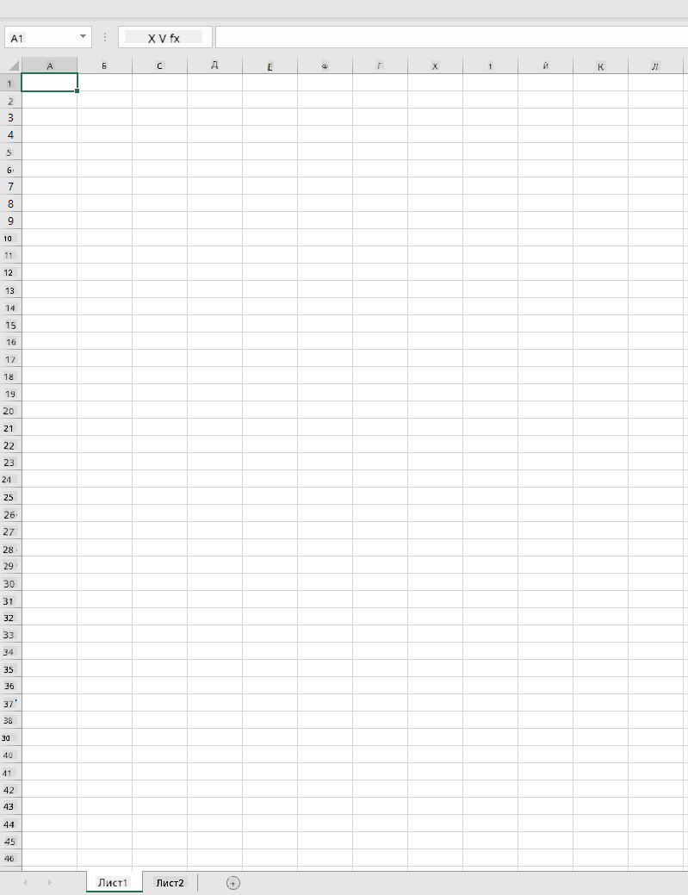
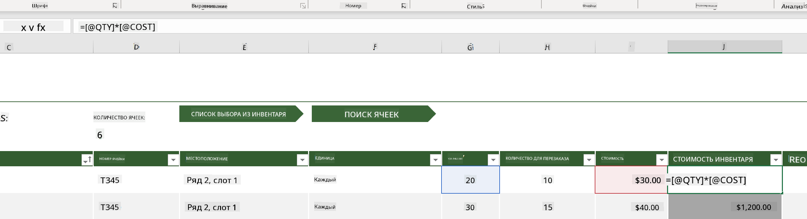
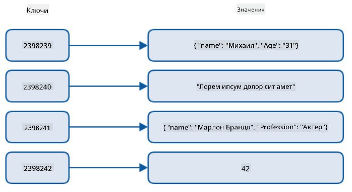
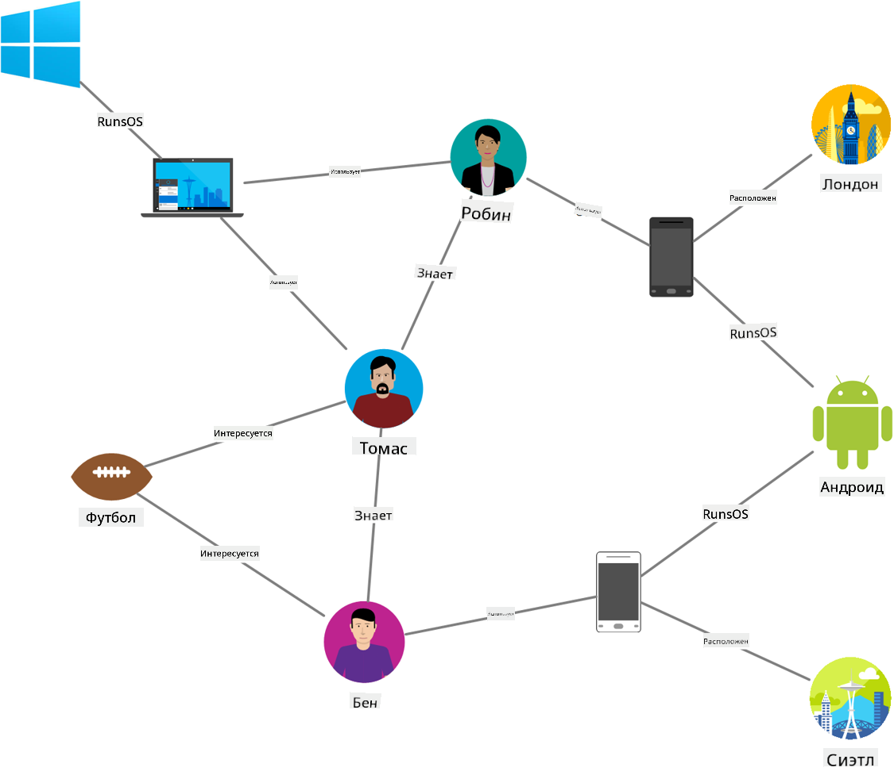
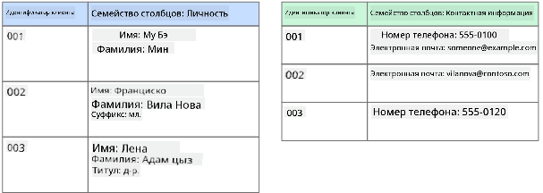
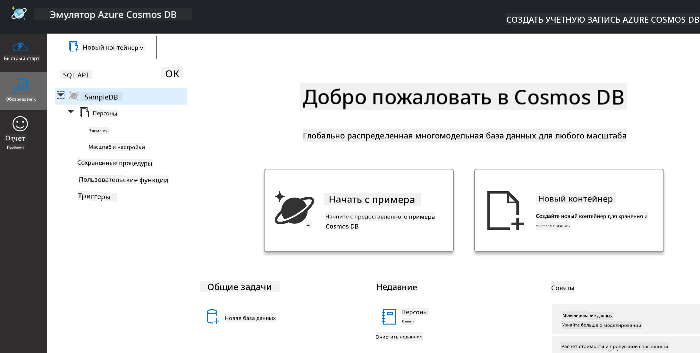
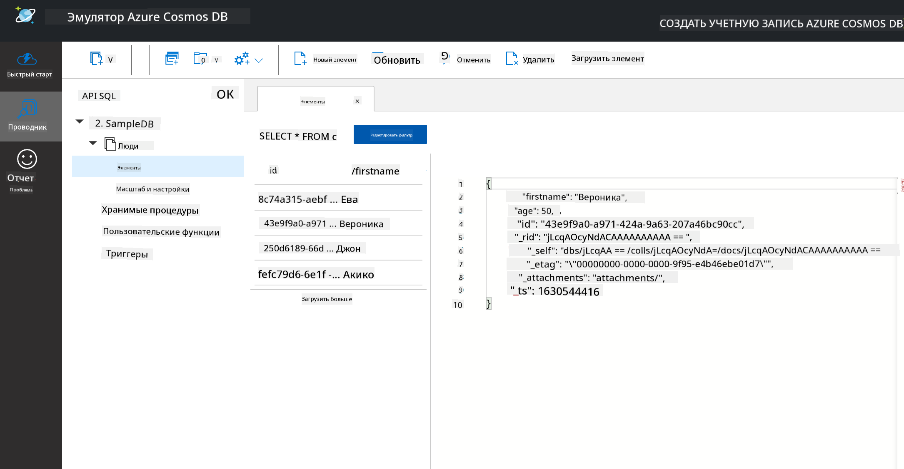
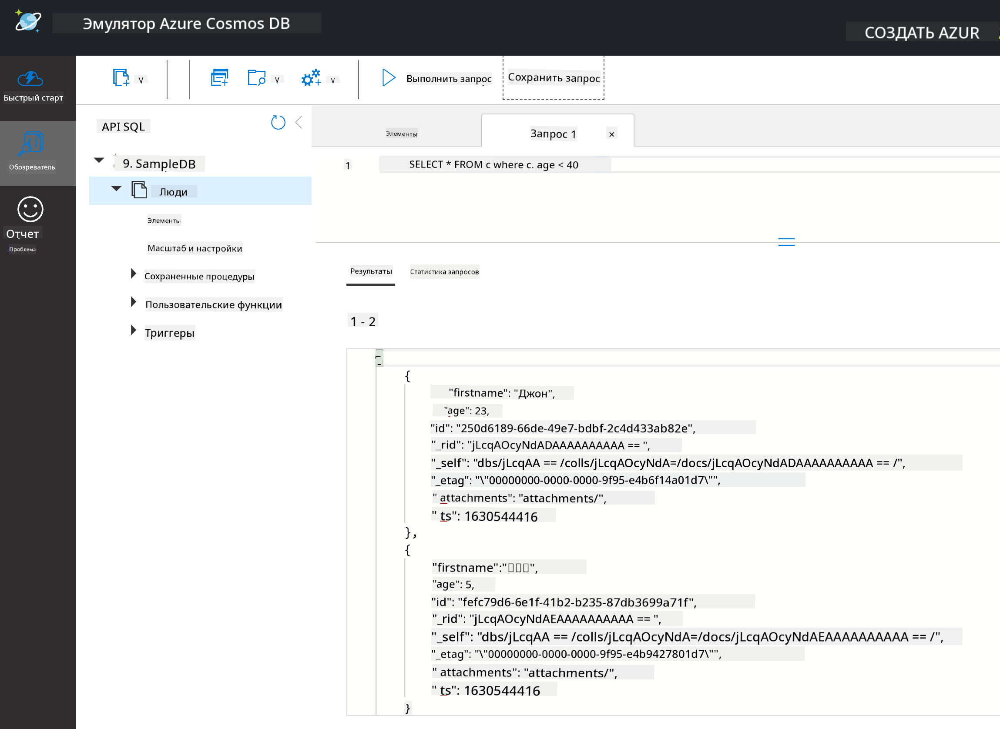

<!--
CO_OP_TRANSLATOR_METADATA:
{
  "original_hash": "54c5a1c74aecb69d2f9099300a4b7eea",
  "translation_date": "2025-09-04T15:27:58+00:00",
  "source_file": "2-Working-With-Data/06-non-relational/README.md",
  "language_code": "ru"
}
-->
# Работа с данными: Нереляционные данные

| ](../../sketchnotes/06-NoSQL.png)|
|:---:|
|Работа с NoSQL данными - _Скетчноут от [@nitya](https://twitter.com/nitya)_ |

## [Тест перед лекцией](https://purple-hill-04aebfb03.1.azurestaticapps.net/quiz/10)

Данные не ограничиваются только реляционными базами данных. Этот урок посвящен нереляционным данным и охватывает основы работы с электронными таблицами и NoSQL.

## Электронные таблицы

Электронные таблицы — это популярный способ хранения и анализа данных, так как для их настройки и начала работы требуется меньше усилий. В этом уроке вы узнаете основные компоненты электронной таблицы, а также формулы и функции. Примеры будут иллюстрироваться с использованием Microsoft Excel, но большинство элементов и тем будут иметь схожие названия и шаги в других программах для работы с электронными таблицами.



Электронная таблица — это файл, который доступен в файловой системе компьютера, устройства или облачного хранилища. Само программное обеспечение может быть браузерным или приложением, которое необходимо установить на компьютер или загрузить как приложение. В Excel такие файлы также называются **рабочими книгами**, и эта терминология будет использоваться в оставшейся части урока.

Рабочая книга содержит один или несколько **листов**, каждый из которых обозначен вкладками. Внутри листа находятся прямоугольники, называемые **ячейками**, которые содержат фактические данные. Ячейка — это пересечение строки и столбца, где столбцы обозначены буквами алфавита, а строки — числами. Некоторые электронные таблицы содержат заголовки в первых строках, чтобы описать данные в ячейке.

Используя эти базовые элементы рабочей книги Excel, мы рассмотрим пример из [Microsoft Templates](https://templates.office.com/), связанный с инвентаризацией, чтобы изучить дополнительные части электронной таблицы.

### Управление инвентаризацией

Файл электронной таблицы под названием "InventoryExample" — это форматированная таблица с элементами инвентаря, содержащая три листа, вкладки которых обозначены как "Inventory List", "Inventory Pick List" и "Bin Lookup". Строка 4 листа Inventory List — это заголовок, который описывает значение каждой ячейки в столбце заголовка.



Существуют случаи, когда значение ячейки зависит от значений других ячеек. В таблице Inventory List отслеживается стоимость каждого элемента инвентаря, но что, если нам нужно узнать общую стоимость всего инвентаря? [**Формулы**](https://support.microsoft.com/en-us/office/overview-of-formulas-34519a4e-1e8d-4f4b-84d4-d642c4f63263) выполняют действия с данными ячеек и используются для вычисления стоимости инвентаря в этом примере. В этой таблице используется формула в столбце Inventory Value для вычисления стоимости каждого элемента путем умножения количества из столбца QTY на стоимость из столбца COST. Дважды щелкнув или выделив ячейку, вы увидите формулу. Вы заметите, что формулы начинаются со знака равенства, за которым следует вычисление или операция.


Мы можем использовать другую формулу, чтобы сложить все значения столбца Inventory Value и получить их общую сумму. Это можно было бы сделать, складывая каждую ячейку, но это может быть утомительным процессом. В Excel есть [**функции**](https://support.microsoft.com/en-us/office/sum-function-043e1c7d-7726-4e80-8f32-07b23e057f89), или предопределенные формулы, для выполнения вычислений с данными ячеек. Функции требуют аргументов, которые являются необходимыми значениями для выполнения этих вычислений. Если функции требуется более одного аргумента, их нужно указывать в определенном порядке, иначе функция может не вычислить правильное значение. В этом примере используется функция SUM, которая принимает значения из столбца Inventory Value в качестве аргумента для вычисления общей суммы, указанной в строке 3, столбце B (также обозначается как B3).

## NoSQL

NoSQL — это обобщающий термин для различных способов хранения нереляционных данных, который можно интерпретировать как "non-SQL", "нереляционные" или "не только SQL". Эти системы баз данных можно разделить на 4 типа.


> Источник: [Блог Michał Białecki](https://www.michalbialecki.com/2018/03/18/azure-cosmos-db-key-value-database-cloud/)

[Базы данных типа ключ-значение](https://docs.microsoft.com/en-us/azure/architecture/data-guide/big-data/non-relational-data#keyvalue-data-stores) связывают уникальные ключи, которые являются уникальными идентификаторами, с определенными значениями. Эти пары хранятся с использованием [хэш-таблицы](https://www.hackerearth.com/practice/data-structures/hash-tables/basics-of-hash-tables/tutorial/) с соответствующей хэш-функцией.


> Источник: [Microsoft](https://docs.microsoft.com/en-us/azure/cosmos-db/graph/graph-introduction#graph-database-by-example)

[Графовые базы данных](https://docs.microsoft.com/en-us/azure/architecture/data-guide/big-data/non-relational-data#graph-data-stores) описывают отношения в данных и представлены в виде коллекции узлов и ребер. Узел представляет сущность, существующую в реальном мире, например, студента или банковскую выписку. Ребра представляют отношения между двумя сущностями. Каждый узел и ребро имеют свойства, которые предоставляют дополнительную информацию о них.



[Колоночные хранилища данных](https://docs.microsoft.com/en-us/azure/architecture/data-guide/big-data/non-relational-data#columnar-data-stores) организуют данные в столбцы и строки, как в реляционной структуре данных, но каждый столбец разделен на группы, называемые семействами столбцов, где все данные под одним столбцом связаны и могут быть извлечены и изменены как единое целое.

### Документные хранилища данных с Azure Cosmos DB

[Документные хранилища данных](https://docs.microsoft.com/en-us/azure/architecture/data-guide/big-data/non-relational-data#document-data-stores) основываются на концепции хранилища данных типа ключ-значение и состоят из серии полей и объектов. В этом разделе мы изучим документные базы данных с помощью эмулятора Cosmos DB.

База данных Cosmos DB соответствует определению "Не только SQL", где документная база данных Cosmos DB использует SQL для запросов к данным. [Предыдущий урок](../05-relational-databases/README.md) по SQL охватывает основы языка, и мы сможем применить некоторые из тех же запросов к документной базе данных здесь. Мы будем использовать эмулятор Cosmos DB, который позволяет создавать и исследовать документную базу данных локально на компьютере. Подробнее об эмуляторе можно прочитать [здесь](https://docs.microsoft.com/en-us/azure/cosmos-db/local-emulator?tabs=ssl-netstd21).

Документ — это коллекция полей и значений объектов, где поля описывают, что представляет значение объекта. Ниже приведен пример документа.

```json
{
    "firstname": "Eva",
    "age": 44,
    "id": "8c74a315-aebf-4a16-bb38-2430a9896ce5",
    "_rid": "bHwDAPQz8s0BAAAAAAAAAA==",
    "_self": "dbs/bHwDAA==/colls/bHwDAPQz8s0=/docs/bHwDAPQz8s0BAAAAAAAAAA==/",
    "_etag": "\"00000000-0000-0000-9f95-010a691e01d7\"",
    "_attachments": "attachments/",
    "_ts": 1630544034
}
```

Интересующие нас поля в этом документе: `firstname`, `id` и `age`. Остальные поля с подчеркиваниями были сгенерированы Cosmos DB.

#### Изучение данных с помощью эмулятора Cosmos DB

Вы можете скачать и установить эмулятор [для Windows здесь](https://aka.ms/cosmosdb-emulator). Ознакомьтесь с этой [документацией](https://docs.microsoft.com/en-us/azure/cosmos-db/local-emulator?tabs=ssl-netstd21#run-on-linux-macos) для вариантов запуска эмулятора на macOS и Linux.

Эмулятор открывает окно браузера, где в представлении Explorer можно изучать документы.



Если вы следуете за уроком, нажмите "Start with Sample", чтобы создать пример базы данных под названием SampleDB. Если вы развернете SampleDB, нажав на стрелку, вы найдете контейнер под названием `Persons`. Контейнер содержит коллекцию элементов, которые являются документами внутри контейнера. Вы можете изучить четыре отдельных документа в разделе `Items`.



#### Запрос данных документов с помощью эмулятора Cosmos DB

Мы также можем выполнять запросы к примерным данным, нажав на кнопку нового SQL-запроса (вторая кнопка слева).

`SELECT * FROM c` возвращает все документы в контейнере. Добавим условие where и найдем всех младше 40 лет.

`SELECT * FROM c where c.age < 40`



Запрос возвращает два документа, обратите внимание, что значение поля age в каждом документе меньше 40.

#### JSON и документы

Если вы знакомы с JavaScript Object Notation (JSON), вы заметите, что документы похожи на JSON. В этой директории есть файл `PersonsData.json` с дополнительными данными, которые вы можете загрузить в контейнер Persons в эмуляторе с помощью кнопки `Upload Item`.

В большинстве случаев API, возвращающие данные в формате JSON, могут быть напрямую переданы и сохранены в документных базах данных. Ниже приведен еще один документ, представляющий твиты с аккаунта Microsoft в Twitter, полученные с помощью Twitter API и затем добавленные в Cosmos DB.

```json
{
    "created_at": "2021-08-31T19:03:01.000Z",
    "id": "1432780985872142341",
    "text": "Blank slate. Like this tweet if you’ve ever painted in Microsoft Paint before. https://t.co/cFeEs8eOPK",
    "_rid": "dhAmAIUsA4oHAAAAAAAAAA==",
    "_self": "dbs/dhAmAA==/colls/dhAmAIUsA4o=/docs/dhAmAIUsA4oHAAAAAAAAAA==/",
    "_etag": "\"00000000-0000-0000-9f84-a0958ad901d7\"",
    "_attachments": "attachments/",
    "_ts": 1630537000
```

Интересующие нас поля в этом документе: `created_at`, `id` и `text`.

## 🚀 Задание

В директории есть файл `TwitterData.json`, который вы можете загрузить в базу данных SampleDB. Рекомендуется добавить его в отдельный контейнер. Это можно сделать следующим образом:

1. Нажмите кнопку нового контейнера в правом верхнем углу.
2. Выберите существующую базу данных (SampleDB), создайте идентификатор для контейнера.
3. Установите ключ раздела `/id`.
4. Нажмите OK (остальную информацию в этом представлении можно игнорировать, так как это небольшой набор данных, работающий локально на вашем компьютере).
5. Откройте новый контейнер и загрузите файл Twitter Data с помощью кнопки `Upload Item`.

Попробуйте выполнить несколько запросов SELECT, чтобы найти документы, содержащие слово Microsoft в поле text. Подсказка: попробуйте использовать [ключевое слово LIKE](https://docs.microsoft.com/en-us/azure/cosmos-db/sql/sql-query-keywords#using-like-with-the--wildcard-character).

## [Тест после лекции](https://ff-quizzes.netlify.app/en/ds/)

## Обзор и самостоятельное изучение

- В этой электронной таблице есть дополнительные форматы и функции, которые не рассматриваются в этом уроке. Microsoft предлагает [обширную библиотеку документации и видео](https://support.microsoft.com/excel) по Excel, если вы хотите узнать больше.

- Эта архитектурная документация описывает характеристики различных типов нереляционных данных: [Нереляционные данные и NoSQL](https://docs.microsoft.com/en-us/azure/architecture/data-guide/big-data/non-relational-data).

- Cosmos DB — это облачная нереляционная база данных, которая также может хранить различные типы NoSQL, упомянутые в этом уроке. Узнайте больше об этих типах в этом [учебном модуле Microsoft Learn по Cosmos DB](https://docs.microsoft.com/en-us/learn/paths/work-with-nosql-data-in-azure-cosmos-db/).

## Задание

[Soda Profits](assignment.md)

---

**Отказ от ответственности**:  
Этот документ был переведен с использованием сервиса автоматического перевода [Co-op Translator](https://github.com/Azure/co-op-translator). Несмотря на наши усилия обеспечить точность, автоматические переводы могут содержать ошибки или неточности. Оригинальный документ на его родном языке следует считать авторитетным источником. Для получения критически важной информации рекомендуется профессиональный перевод человеком. Мы не несем ответственности за любые недоразумения или неправильные интерпретации, возникающие в результате использования данного перевода.