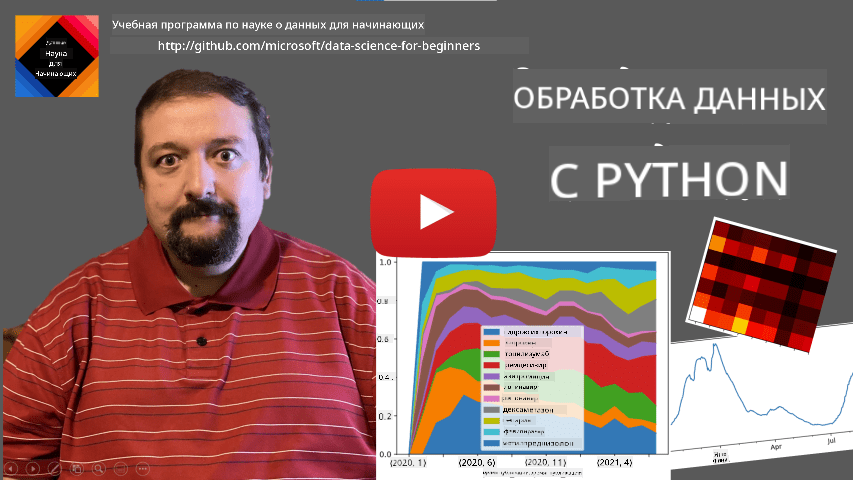
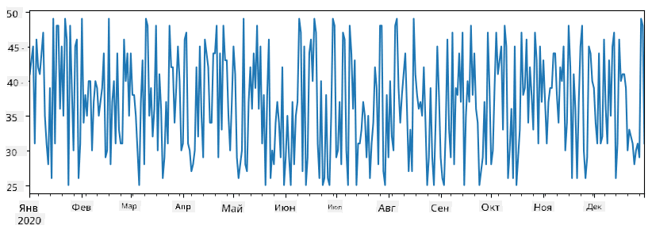
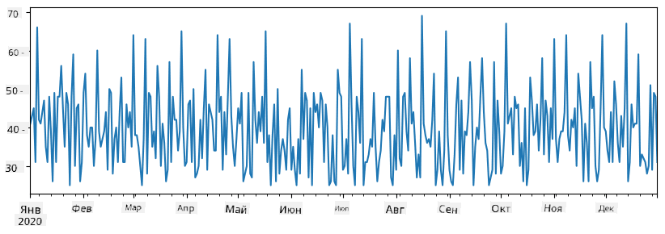
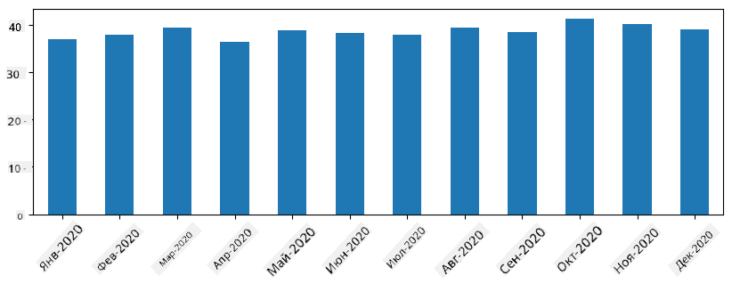
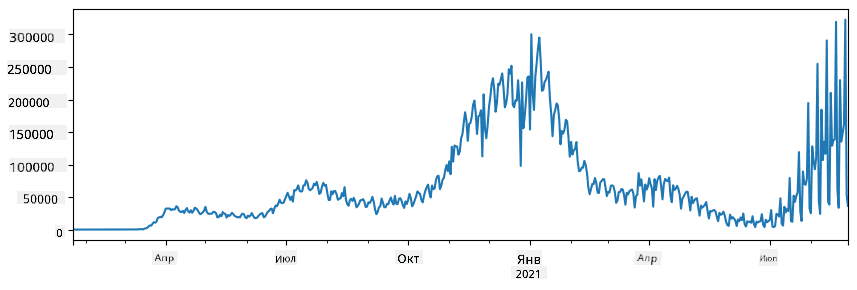
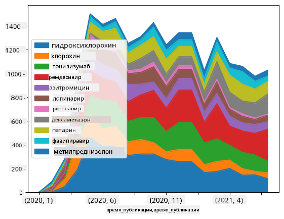

<!--
CO_OP_TRANSLATOR_METADATA:
{
  "original_hash": "7bfec050f4717dcc2dfd028aca9d21f3",
  "translation_date": "2025-09-06T15:22:44+00:00",
  "source_file": "2-Working-With-Data/07-python/README.md",
  "language_code": "ru"
}
-->
# Работа с данными: Python и библиотека Pandas

|  ](../../sketchnotes/07-WorkWithPython.png) |
| :-------------------------------------------------------------------------------------------------------: |
|                 Работа с Python - _Скетчноут от [@nitya](https://twitter.com/nitya)_                     |

[](https://youtu.be/dZjWOGbsN4Y)

Хотя базы данных предоставляют очень эффективные способы хранения данных и их запросов с использованием языков запросов, наиболее гибким способом обработки данных является написание собственной программы для их манипуляции. Во многих случаях запрос к базе данных будет более эффективным. Однако в некоторых случаях, когда требуется более сложная обработка данных, это не так просто сделать с помощью SQL.  
Обработка данных может быть запрограммирована на любом языке программирования, но существуют языки, которые считаются более высокоуровневыми для работы с данными. Специалисты по данным обычно предпочитают один из следующих языков:

* **[Python](https://www.python.org/)** — универсальный язык программирования, который часто считается одним из лучших вариантов для начинающих благодаря своей простоте. Python имеет множество дополнительных библиотек, которые могут помочь решить множество практических задач, таких как извлечение данных из ZIP-архива или преобразование изображения в оттенки серого. Помимо науки о данных, Python также часто используется для веб-разработки.  
* **[R](https://www.r-project.org/)** — традиционный инструмент, разработанный с учетом статистической обработки данных. Он также содержит большой репозиторий библиотек (CRAN), что делает его хорошим выбором для обработки данных. Однако R не является универсальным языком программирования и редко используется за пределами области науки о данных.  
* **[Julia](https://julialang.org/)** — еще один язык, разработанный специально для науки о данных. Он предназначен для обеспечения более высокой производительности, чем Python, что делает его отличным инструментом для научных экспериментов.

В этом уроке мы сосредоточимся на использовании Python для простой обработки данных. Мы предполагаем базовое знакомство с языком. Если вы хотите более глубокое погружение в Python, вы можете обратиться к одному из следующих ресурсов:

* [Изучите Python весело с помощью Turtle Graphics и фракталов](https://github.com/shwars/pycourse) — краткий вводный курс по программированию на Python на GitHub  
* [Сделайте первые шаги с Python](https://docs.microsoft.com/en-us/learn/paths/python-first-steps/?WT.mc_id=academic-77958-bethanycheum) — учебный путь на [Microsoft Learn](http://learn.microsoft.com/?WT.mc_id=academic-77958-bethanycheum)

Данные могут быть представлены в различных формах. В этом уроке мы рассмотрим три формы данных — **табличные данные**, **текст** и **изображения**.

Мы сосредоточимся на нескольких примерах обработки данных, вместо того чтобы давать полный обзор всех связанных библиотек. Это позволит вам понять основные возможности и оставит понимание того, где искать решения ваших задач, когда это потребуется.

> **Самый полезный совет**. Если вам нужно выполнить определенную операцию с данными, но вы не знаете, как это сделать, попробуйте поискать это в интернете. [Stackoverflow](https://stackoverflow.com/) обычно содержит множество полезных примеров кода на Python для многих типичных задач.

## [Тест перед лекцией](https://ff-quizzes.netlify.app/en/ds/quiz/12)

## Табличные данные и DataFrame

Вы уже сталкивались с табличными данными, когда мы говорили о реляционных базах данных. Когда у вас много данных, и они содержатся в нескольких связанных таблицах, определенно имеет смысл использовать SQL для работы с ними. Однако есть много случаев, когда у нас есть таблица данных, и нам нужно получить некоторое **понимание** или **инсайты** об этих данных, такие как распределение, корреляция между значениями и т. д. В науке о данных часто требуется выполнить некоторые преобразования исходных данных, а затем визуализировать их. Оба этих шага легко выполнить с помощью Python.

Существует две наиболее полезные библиотеки в Python, которые помогут вам работать с табличными данными:
* **[Pandas](https://pandas.pydata.org/)** позволяет манипулировать так называемыми **DataFrame**, которые аналогичны реляционным таблицам. Вы можете использовать именованные столбцы и выполнять различные операции над строками, столбцами и DataFrame в целом.  
* **[Numpy](https://numpy.org/)** — библиотека для работы с **тензорами**, то есть многомерными **массивами**. Массив содержит значения одного типа и проще, чем DataFrame, но предлагает больше математических операций и создает меньшую нагрузку.

Также есть несколько других библиотек, о которых стоит знать:
* **[Matplotlib](https://matplotlib.org/)** — библиотека для визуализации данных и построения графиков  
* **[SciPy](https://www.scipy.org/)** — библиотека с дополнительными научными функциями. Мы уже сталкивались с этой библиотекой, когда говорили о вероятности и статистике.

Вот пример кода, который обычно используется для импорта этих библиотек в начале программы на Python:
```python
import numpy as np
import pandas as pd
import matplotlib.pyplot as plt
from scipy import ... # you need to specify exact sub-packages that you need
``` 

Pandas основан на нескольких базовых концепциях.

### Series

**Series** — это последовательность значений, аналогичная списку или массиву numpy. Главное отличие состоит в том, что Series также имеет **индекс**, и при выполнении операций (например, сложении) индекс учитывается. Индекс может быть простым числовым номером строки (он используется по умолчанию при создании Series из списка или массива) или иметь сложную структуру, например, временной интервал.

> **Примечание**: В сопровождающем ноутбуке [`notebook.ipynb`](notebook.ipynb) есть вводный код для работы с Pandas. Здесь мы приводим только некоторые примеры, и вы, конечно, можете ознакомиться с полным ноутбуком.

Рассмотрим пример: мы хотим проанализировать продажи нашего магазина мороженого. Давайте создадим Series с числами продаж (количество проданных единиц в день) за определенный период времени:

```python
start_date = "Jan 1, 2020"
end_date = "Mar 31, 2020"
idx = pd.date_range(start_date,end_date)
print(f"Length of index is {len(idx)}")
items_sold = pd.Series(np.random.randint(25,50,size=len(idx)),index=idx)
items_sold.plot()
```


Теперь предположим, что каждую неделю мы устраиваем вечеринку для друзей и берем дополнительно 10 упаковок мороженого для вечеринки. Мы можем создать еще один Series, индексированный по неделям, чтобы это показать:
```python
additional_items = pd.Series(10,index=pd.date_range(start_date,end_date,freq="W"))
```
Когда мы складываем два Series, мы получаем общее количество:
```python
total_items = items_sold.add(additional_items,fill_value=0)
total_items.plot()
```


> **Примечание**: Мы не используем простую запись `total_items+additional_items`. Если бы мы это сделали, то получили бы много значений `NaN` (*Not a Number*) в результирующем Series. Это происходит из-за отсутствующих значений для некоторых точек индекса в Series `additional_items`, а сложение `NaN` с чем-либо дает `NaN`. Поэтому необходимо указать параметр `fill_value` при сложении.

С временными рядами мы также можем **пересчитывать** данные с разными временными интервалами. Например, если мы хотим вычислить средний объем продаж за месяц, мы можем использовать следующий код:
```python
monthly = total_items.resample("1M").mean()
ax = monthly.plot(kind='bar')
```


### DataFrame

DataFrame — это, по сути, коллекция Series с одинаковым индексом. Мы можем объединить несколько Series в один DataFrame:
```python
a = pd.Series(range(1,10))
b = pd.Series(["I","like","to","play","games","and","will","not","change"],index=range(0,9))
df = pd.DataFrame([a,b])
```
Это создаст горизонтальную таблицу, подобную этой:
|     | 0   | 1    | 2   | 3   | 4      | 5   | 6      | 7    | 8    |
| --- | --- | ---- | --- | --- | ------ | --- | ------ | ---- | ---- |
| 0   | 1   | 2    | 3   | 4   | 5      | 6   | 7      | 8    | 9    |
| 1   | I   | like | to  | use | Python | and | Pandas | very | much |

Мы также можем использовать Series в качестве столбцов и задавать имена столбцов с помощью словаря:
```python
df = pd.DataFrame({ 'A' : a, 'B' : b })
```
Это даст нам таблицу следующего вида:

|     | A   | B      |
| --- | --- | ------ |
| 0   | 1   | I      |
| 1   | 2   | like   |
| 2   | 3   | to     |
| 3   | 4   | use    |
| 4   | 5   | Python |
| 5   | 6   | and    |
| 6   | 7   | Pandas |
| 7   | 8   | very   |
| 8   | 9   | much   |

**Примечание**: Мы также можем получить такую таблицу, транспонируя предыдущую, например, написав 
```python
df = pd.DataFrame([a,b]).T..rename(columns={ 0 : 'A', 1 : 'B' })
```
Здесь `.T` означает операцию транспонирования DataFrame, то есть изменение строк и столбцов, а операция `rename` позволяет переименовать столбцы, чтобы они соответствовали предыдущему примеру.

Вот несколько наиболее важных операций, которые мы можем выполнять с DataFrame:

**Выбор столбцов**. Мы можем выбрать отдельные столбцы, написав `df['A']` — эта операция возвращает Series. Мы также можем выбрать подмножество столбцов в другой DataFrame, написав `df[['B','A']]` — это возвращает другой DataFrame.

**Фильтрация** строк по критериям. Например, чтобы оставить только строки, где столбец `A` больше 5, мы можем написать `df[df['A']>5]`.

> **Примечание**: Фильтрация работает следующим образом. Выражение `df['A']<5` возвращает булевый Series, который указывает, является ли выражение `True` или `False` для каждого элемента исходного Series `df['A']`. Когда булевый Series используется в качестве индекса, он возвращает подмножество строк в DataFrame. Таким образом, нельзя использовать произвольное булевое выражение Python, например, запись `df[df['A']>5 and df['A']<7]` будет неверной. Вместо этого следует использовать специальную операцию `&` для булевых Series, написав `df[(df['A']>5) & (df['A']<7)]` (*скобки здесь важны*).

**Создание новых вычисляемых столбцов**. Мы можем легко создавать новые вычисляемые столбцы для нашего DataFrame, используя интуитивно понятные выражения, например:
```python
df['DivA'] = df['A']-df['A'].mean() 
``` 
Этот пример вычисляет отклонение `A` от его среднего значения. На самом деле мы вычисляем Series, а затем присваиваем этот Series левой части, создавая новый столбец. Таким образом, нельзя использовать операции, несовместимые с Series, например, следующий код неверен:
```python
# Wrong code -> df['ADescr'] = "Low" if df['A'] < 5 else "Hi"
df['LenB'] = len(df['B']) # <- Wrong result
``` 
Последний пример, хотя и синтаксически корректен, дает неверный результат, так как он присваивает длину Series `B` всем значениям в столбце, а не длину отдельных элементов, как мы намеревались.

Если нам нужно вычислить сложные выражения, мы можем использовать функцию `apply`. Последний пример можно записать следующим образом:
```python
df['LenB'] = df['B'].apply(lambda x : len(x))
# or 
df['LenB'] = df['B'].apply(len)
```

После выполнения вышеуказанных операций мы получим следующий DataFrame:

|     | A   | B      | DivA | LenB |
| --- | --- | ------ | ---- | ---- |
| 0   | 1   | I      | -4.0 | 1    |
| 1   | 2   | like   | -3.0 | 4    |
| 2   | 3   | to     | -2.0 | 2    |
| 3   | 4   | use    | -1.0 | 3    |
| 4   | 5   | Python | 0.0  | 6    |
| 5   | 6   | and    | 1.0  | 3    |
| 6   | 7   | Pandas | 2.0  | 6    |
| 7   | 8   | very   | 3.0  | 4    |
| 8   | 9   | much   | 4.0  | 4    |

**Выбор строк по номерам** можно выполнить с помощью конструкции `iloc`. Например, чтобы выбрать первые 5 строк из DataFrame:
```python
df.iloc[:5]
```

**Группировка** часто используется для получения результата, аналогичного *сводным таблицам* в Excel. Предположим, что мы хотим вычислить среднее значение столбца `A` для каждого значения `LenB`. Тогда мы можем сгруппировать наш DataFrame по `LenB` и вызвать `mean`:
```python
df.groupby(by='LenB')[['A','DivA']].mean()
```
Если нам нужно вычислить среднее значение и количество элементов в группе, то мы можем использовать более сложную функцию `aggregate`:
```python
df.groupby(by='LenB') \
 .aggregate({ 'DivA' : len, 'A' : lambda x: x.mean() }) \
 .rename(columns={ 'DivA' : 'Count', 'A' : 'Mean'})
```
Это даст нам следующую таблицу:

| LenB | Count | Mean     |
| ---- | ----- | -------- |
| 1    | 1     | 1.000000 |
| 2    | 1     | 3.000000 |
| 3    | 2     | 5.000000 |
| 4    | 3     | 6.333333 |
| 6    | 2     | 6.000000 |

### Получение данных
Мы видели, как легко создавать Series и DataFrame из объектов Python. Однако данные обычно поступают в виде текстового файла или таблицы Excel. К счастью, Pandas предлагает простой способ загрузки данных с диска. Например, чтение CSV-файла настолько просто, как это:
```python
df = pd.read_csv('file.csv')
```
Мы рассмотрим больше примеров загрузки данных, включая их получение с внешних веб-сайтов, в разделе "Задание".

### Печать и визуализация

Датасаентисту часто приходится исследовать данные, поэтому важно уметь их визуализировать. Когда DataFrame большой, зачастую мы хотим просто убедиться, что всё делаем правильно, напечатав первые несколько строк. Это можно сделать, вызвав `df.head()`. Если вы запускаете это из Jupyter Notebook, он выведет DataFrame в удобной табличной форме.

Мы также видели использование функции `plot` для визуализации некоторых столбцов. Хотя `plot` очень полезен для многих задач и поддерживает множество различных типов графиков через параметр `kind=`, вы всегда можете использовать библиотеку `matplotlib` для построения чего-то более сложного. Мы подробно рассмотрим визуализацию данных в отдельных уроках курса.

Этот обзор охватывает самые важные концепции Pandas, однако библиотека очень богата, и нет предела тому, что вы можете с ней сделать! Давайте теперь применим эти знания для решения конкретной задачи.

## 🚀 Задание 1: Анализ распространения COVID

Первая задача, на которой мы сосредоточимся, — это моделирование распространения эпидемии COVID-19. Для этого мы будем использовать данные о количестве инфицированных людей в разных странах, предоставленные [Центром системной науки и инженерии](https://systems.jhu.edu/) (CSSE) при [Университете Джонса Хопкинса](https://jhu.edu/). Набор данных доступен в [этом репозитории GitHub](https://github.com/CSSEGISandData/COVID-19).

Поскольку мы хотим продемонстрировать, как работать с данными, мы приглашаем вас открыть [`notebook-covidspread.ipynb`](notebook-covidspread.ipynb) и прочитать его от начала до конца. Вы также можете выполнить ячейки и выполнить задания, которые мы оставили для вас в конце.



> Если вы не знаете, как запускать код в Jupyter Notebook, ознакомьтесь с [этой статьей](https://soshnikov.com/education/how-to-execute-notebooks-from-github/).

## Работа с неструктурированными данными

Хотя данные очень часто имеют табличную форму, в некоторых случаях нам приходится работать с менее структурированными данными, например, текстами или изображениями. В этом случае, чтобы применить методы обработки данных, которые мы рассмотрели выше, нам нужно каким-то образом **извлечь** структурированные данные. Вот несколько примеров:

* Извлечение ключевых слов из текста и анализ частоты их появления
* Использование нейронных сетей для извлечения информации об объектах на изображении
* Получение информации об эмоциях людей на видеопотоке с камеры

## 🚀 Задание 2: Анализ научных статей о COVID

В этом задании мы продолжим тему пандемии COVID и сосредоточимся на обработке научных статей по этой теме. Существует [набор данных CORD-19](https://www.kaggle.com/allen-institute-for-ai/CORD-19-research-challenge) с более чем 7000 (на момент написания) статей о COVID, доступных с метаданными и аннотациями (а для примерно половины из них также предоставлен полный текст).

Полный пример анализа этого набора данных с использованием когнитивного сервиса [Text Analytics for Health](https://docs.microsoft.com/azure/cognitive-services/text-analytics/how-tos/text-analytics-for-health/?WT.mc_id=academic-77958-bethanycheum) описан [в этом блоге](https://soshnikov.com/science/analyzing-medical-papers-with-azure-and-text-analytics-for-health/). Мы обсудим упрощённую версию этого анализа.

> **NOTE**: Мы не предоставляем копию набора данных в этом репозитории. Вам может понадобиться сначала скачать файл [`metadata.csv`](https://www.kaggle.com/allen-institute-for-ai/CORD-19-research-challenge?select=metadata.csv) из [этого набора данных на Kaggle](https://www.kaggle.com/allen-institute-for-ai/CORD-19-research-challenge). Для этого может потребоваться регистрация на Kaggle. Вы также можете скачать набор данных без регистрации [отсюда](https://ai2-semanticscholar-cord-19.s3-us-west-2.amazonaws.com/historical_releases.html), но он будет включать все полные тексты в дополнение к файлу метаданных.

Откройте [`notebook-papers.ipynb`](notebook-papers.ipynb) и прочитайте его от начала до конца. Вы также можете выполнить ячейки и выполнить задания, которые мы оставили для вас в конце.



## Обработка данных изображений

В последнее время были разработаны очень мощные модели ИИ, которые позволяют понимать изображения. Существует множество задач, которые можно решить с помощью предобученных нейронных сетей или облачных сервисов. Вот несколько примеров:

* **Классификация изображений**, которая помогает категоризировать изображение в одну из предопределённых категорий. Вы можете легко обучить свои собственные классификаторы изображений, используя такие сервисы, как [Custom Vision](https://azure.microsoft.com/services/cognitive-services/custom-vision-service/?WT.mc_id=academic-77958-bethanycheum)
* **Обнаружение объектов** для нахождения различных объектов на изображении. Такие сервисы, как [computer vision](https://azure.microsoft.com/services/cognitive-services/computer-vision/?WT.mc_id=academic-77958-bethanycheum), могут обнаруживать множество распространённых объектов, а вы можете обучить модель [Custom Vision](https://azure.microsoft.com/services/cognitive-services/custom-vision-service/?WT.mc_id=academic-77958-bethanycheum) для обнаружения специфических объектов.
* **Обнаружение лиц**, включая определение возраста, пола и эмоций. Это можно сделать с помощью [Face API](https://azure.microsoft.com/services/cognitive-services/face/?WT.mc_id=academic-77958-bethanycheum).

Все эти облачные сервисы можно вызывать с помощью [Python SDKs](https://docs.microsoft.com/samples/azure-samples/cognitive-services-python-sdk-samples/cognitive-services-python-sdk-samples/?WT.mc_id=academic-77958-bethanycheum), и их легко интегрировать в ваш процесс исследования данных.

Вот несколько примеров исследования данных из источников изображений:
* В блоге [Как изучать Data Science без программирования](https://soshnikov.com/azure/how-to-learn-data-science-without-coding/) мы исследуем фотографии из Instagram, пытаясь понять, что заставляет людей ставить больше лайков фотографии. Сначала мы извлекаем как можно больше информации из изображений, используя [computer vision](https://azure.microsoft.com/services/cognitive-services/computer-vision/?WT.mc_id=academic-77958-bethanycheum), а затем используем [Azure Machine Learning AutoML](https://docs.microsoft.com/azure/machine-learning/concept-automated-ml/?WT.mc_id=academic-77958-bethanycheum) для построения интерпретируемой модели.
* В [Мастерской по изучению лиц](https://github.com/CloudAdvocacy/FaceStudies) мы используем [Face API](https://azure.microsoft.com/services/cognitive-services/face/?WT.mc_id=academic-77958-bethanycheum) для извлечения эмоций людей на фотографиях с мероприятий, чтобы попытаться понять, что делает людей счастливыми.

## Заключение

Независимо от того, имеете ли вы уже структурированные или неструктурированные данные, с помощью Python вы можете выполнить все шаги, связанные с обработкой и пониманием данных. Это, вероятно, самый гибкий способ обработки данных, и именно поэтому большинство датасаентистов используют Python как основной инструмент. Изучение Python в глубину — это, вероятно, хорошая идея, если вы серьёзно относитесь к своему пути в Data Science!

## [Тест после лекции](https://ff-quizzes.netlify.app/en/ds/quiz/13)

## Обзор и самостоятельное изучение

**Книги**
* [Wes McKinney. Python for Data Analysis: Data Wrangling with Pandas, NumPy, and IPython](https://www.amazon.com/gp/product/1491957662)

**Онлайн-ресурсы**
* Официальный [10 минут с Pandas](https://pandas.pydata.org/pandas-docs/stable/user_guide/10min.html) учебник
* [Документация по визуализации в Pandas](https://pandas.pydata.org/pandas-docs/stable/user_guide/visualization.html)

**Изучение Python**
* [Изучайте Python весело с Turtle Graphics и фракталами](https://github.com/shwars/pycourse)
* [Сделайте первые шаги с Python](https://docs.microsoft.com/learn/paths/python-first-steps/?WT.mc_id=academic-77958-bethanycheum) на платформе [Microsoft Learn](http://learn.microsoft.com/?WT.mc_id=academic-77958-bethanycheum)

## Задание

[Проведите более детальное исследование данных для заданий выше](assignment.md)

## Благодарности

Этот урок был создан с ♥️ [Дмитрием Сошниковым](http://soshnikov.com)

---

**Отказ от ответственности**:  
Этот документ был переведен с помощью сервиса автоматического перевода [Co-op Translator](https://github.com/Azure/co-op-translator). Несмотря на наши усилия обеспечить точность, автоматические переводы могут содержать ошибки или неточности. Оригинальный документ на его родном языке следует считать авторитетным источником. Для получения критически важной информации рекомендуется профессиональный перевод человеком. Мы не несем ответственности за любые недоразумения или неправильные интерпретации, возникшие в результате использования данного перевода.