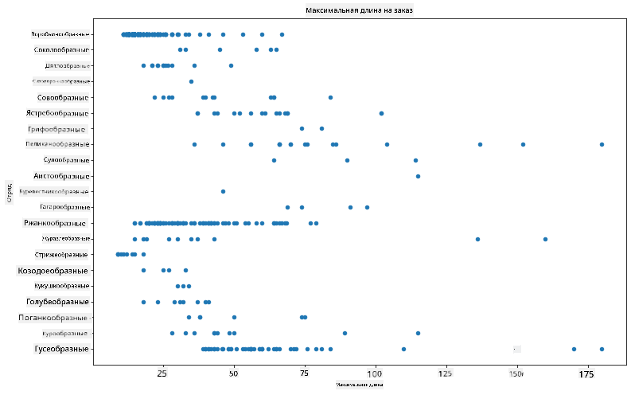
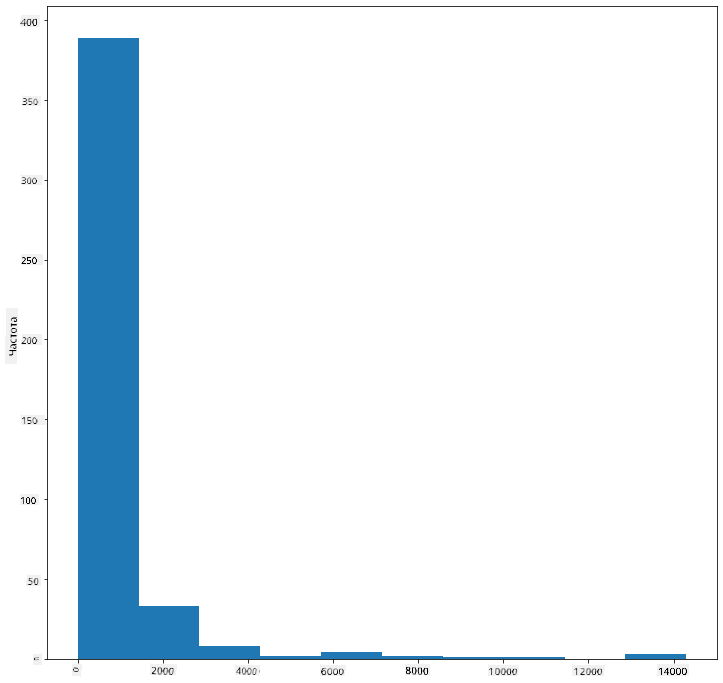
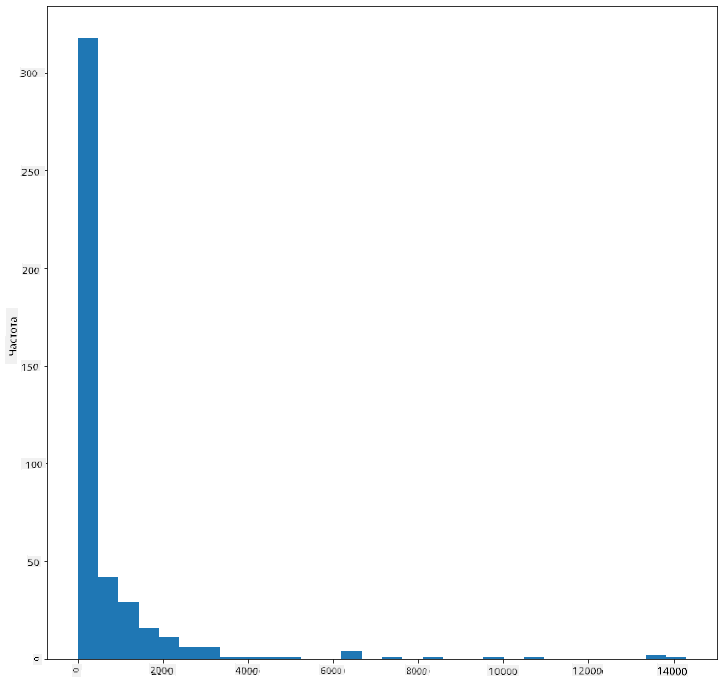
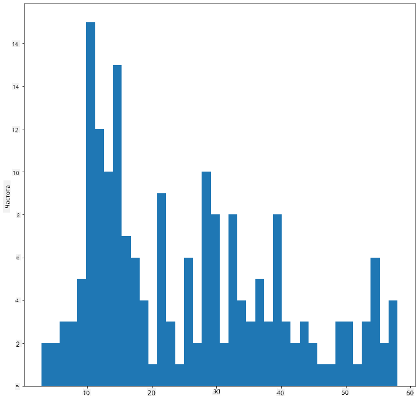
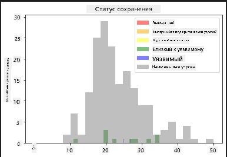
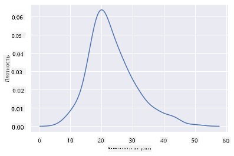
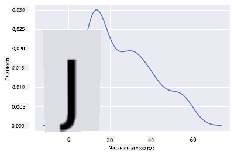
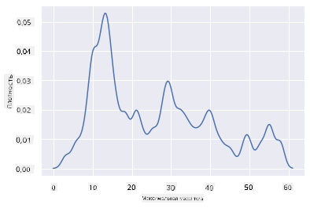
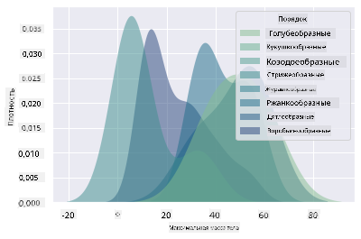
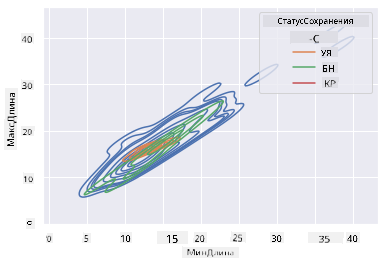

<!--
CO_OP_TRANSLATOR_METADATA:
{
  "original_hash": "87faccac113d772551486a67a607153e",
  "translation_date": "2025-08-27T10:12:26+00:00",
  "source_file": "3-Data-Visualization/10-visualization-distributions/README.md",
  "language_code": "ru"
}
-->
# Визуализация распределений

|](../../sketchnotes/10-Visualizing-Distributions.png)|
|:---:|
| Визуализация распределений - _Скетчноут от [@nitya](https://twitter.com/nitya)_ |

В предыдущем уроке вы узнали несколько интересных фактов о наборе данных о птицах Миннесоты. Вы обнаружили ошибочные данные, визуализировав выбросы, и изучили различия между категориями птиц по их максимальной длине.

## [Тест перед лекцией](https://purple-hill-04aebfb03.1.azurestaticapps.net/quiz/18)
## Исследование набора данных о птицах

Еще один способ изучить данные — это посмотреть на их распределение, то есть на то, как данные организованы вдоль оси. Например, вы можете захотеть узнать об общем распределении максимального размаха крыльев или максимальной массы тела для птиц Миннесоты.

Давайте узнаем несколько фактов о распределении данных в этом наборе. В файле _notebook.ipynb_, расположенном в корневой папке этого урока, импортируйте Pandas, Matplotlib и ваш набор данных:

```python
import pandas as pd
import matplotlib.pyplot as plt
birds = pd.read_csv('../../data/birds.csv')
birds.head()
```

|      | Название                     | Научное название       | Категория             | Отряд        | Семейство | Род         | Статус сохранности | Мин. длина | Макс. длина | Мин. масса тела | Макс. масса тела | Мин. размах крыльев | Макс. размах крыльев |
| ---: | :--------------------------- | :--------------------- | :-------------------- | :----------- | :------- | :---------- | :----------------- | --------: | --------: | ----------: | ----------: | ----------: | ----------: |
|    0 | Чернобрюхий свистун          | Dendrocygna autumnalis | Утки/Гуси/Водоплавающие | Anseriformes | Anatidae | Dendrocygna | LC                 |        47 |        56 |         652 |        1020 |          76 |          94 |
|    1 | Рыжий свистун                | Dendrocygna bicolor    | Утки/Гуси/Водоплавающие | Anseriformes | Anatidae | Dendrocygna | LC                 |        45 |        53 |         712 |        1050 |          85 |          93 |
|    2 | Белый гусь                   | Anser caerulescens     | Утки/Гуси/Водоплавающие | Anseriformes | Anatidae | Anser       | LC                 |        64 |        79 |        2050 |        4050 |         135 |         165 |
|    3 | Гусь Росса                   | Anser rossii           | Утки/Гуси/Водоплавающие | Anseriformes | Anatidae | Anser       | LC                 |      57.3 |        64 |        1066 |        1567 |         113 |         116 |
|    4 | Большой белолобый гусь       | Anser albifrons        | Утки/Гуси/Водоплавающие | Anseriformes | Anatidae | Anser       | LC                 |        64 |        81 |        1930 |        3310 |         130 |         165 |

В целом, вы можете быстро посмотреть, как распределены данные, используя диаграмму рассеяния, как мы делали в предыдущем уроке:

```python
birds.plot(kind='scatter',x='MaxLength',y='Order',figsize=(12,8))

plt.title('Max Length per Order')
plt.ylabel('Order')
plt.xlabel('Max Length')

plt.show()
```


Это дает обзор общего распределения длины тела по отрядам птиц, но это не самый оптимальный способ отображения истинных распределений. Для этой задачи обычно создается гистограмма.

## Работа с гистограммами

Matplotlib предлагает отличные способы визуализации распределения данных с помощью гистограмм. Этот тип диаграммы похож на столбчатую диаграмму, где распределение можно увидеть через подъем и спад столбцов. Чтобы построить гистограмму, вам нужны числовые данные. Для создания гистограммы можно построить диаграмму, определив тип как 'hist' для гистограммы. Эта диаграмма показывает распределение MaxBodyMass для всего диапазона числовых данных набора данных. Разделяя массив данных на более мелкие интервалы, она может отображать распределение значений данных:

```python
birds['MaxBodyMass'].plot(kind = 'hist', bins = 10, figsize = (12,12))
plt.show()
```


Как видно, большинство из 400+ птиц в этом наборе данных имеют массу тела менее 2000. Получите больше информации о данных, изменив параметр `bins` на большее число, например, 30:

```python
birds['MaxBodyMass'].plot(kind = 'hist', bins = 30, figsize = (12,12))
plt.show()
```


Эта диаграмма показывает распределение более детально. Менее смещенную влево диаграмму можно создать, выбрав данные только в заданном диапазоне:

Отфильтруйте данные, чтобы получить только тех птиц, чья масса тела меньше 60, и покажите 40 `bins`:

```python
filteredBirds = birds[(birds['MaxBodyMass'] > 1) & (birds['MaxBodyMass'] < 60)]      
filteredBirds['MaxBodyMass'].plot(kind = 'hist',bins = 40,figsize = (12,12))
plt.show()     
```


✅ Попробуйте другие фильтры и точки данных. Чтобы увидеть полное распределение данных, удалите фильтр `['MaxBodyMass']`, чтобы показать распределения с метками.

Гистограмма также предлагает интересные улучшения цвета и меток:

Создайте 2D-гистограмму, чтобы сравнить взаимосвязь между двумя распределениями. Давайте сравним `MaxBodyMass` и `MaxLength`. Matplotlib предлагает встроенный способ показать сходимость с использованием более ярких цветов:

```python
x = filteredBirds['MaxBodyMass']
y = filteredBirds['MaxLength']

fig, ax = plt.subplots(tight_layout=True)
hist = ax.hist2d(x, y)
```
Кажется, есть ожидаемая корреляция между этими двумя элементами вдоль ожидаемой оси, с одной особенно сильной точкой сходимости:


Гистограммы хорошо работают по умолчанию для числовых данных. А что, если вам нужно увидеть распределения по текстовым данным? 
## Исследование набора данных для распределений с использованием текстовых данных 

Этот набор данных также содержит полезную информацию о категории птиц, их роде, виде и семействе, а также о статусе сохранности. Давайте изучим информацию о статусе сохранности. Каково распределение птиц по их статусу сохранности?

> ✅ В наборе данных используются несколько аббревиатур для описания статуса сохранности. Эти аббревиатуры взяты из [Категорий Красного списка МСОП](https://www.iucnredlist.org/), организации, которая каталогизирует статус видов.
> 
> - CR: Находящиеся на грани исчезновения
> - EN: Исчезающие
> - EX: Вымершие
> - LC: Наименьшая угроза
> - NT: Близкие к уязвимому положению
> - VU: Уязвимые

Это текстовые значения, поэтому вам нужно будет преобразовать их, чтобы создать гистограмму. Используя dataframe filteredBirds, отобразите его статус сохранности вместе с минимальным размахом крыльев. Что вы видите?

```python
x1 = filteredBirds.loc[filteredBirds.ConservationStatus=='EX', 'MinWingspan']
x2 = filteredBirds.loc[filteredBirds.ConservationStatus=='CR', 'MinWingspan']
x3 = filteredBirds.loc[filteredBirds.ConservationStatus=='EN', 'MinWingspan']
x4 = filteredBirds.loc[filteredBirds.ConservationStatus=='NT', 'MinWingspan']
x5 = filteredBirds.loc[filteredBirds.ConservationStatus=='VU', 'MinWingspan']
x6 = filteredBirds.loc[filteredBirds.ConservationStatus=='LC', 'MinWingspan']

kwargs = dict(alpha=0.5, bins=20)

plt.hist(x1, **kwargs, color='red', label='Extinct')
plt.hist(x2, **kwargs, color='orange', label='Critically Endangered')
plt.hist(x3, **kwargs, color='yellow', label='Endangered')
plt.hist(x4, **kwargs, color='green', label='Near Threatened')
plt.hist(x5, **kwargs, color='blue', label='Vulnerable')
plt.hist(x6, **kwargs, color='gray', label='Least Concern')

plt.gca().set(title='Conservation Status', ylabel='Min Wingspan')
plt.legend();
```



Не кажется, что есть хорошая корреляция между минимальным размахом крыльев и статусом сохранности. Проверьте другие элементы набора данных, используя этот метод. Вы можете попробовать разные фильтры. Найдете ли вы какую-либо корреляцию?

## Плотностные графики

Вы могли заметить, что гистограммы, которые мы рассматривали до сих пор, имеют "ступенчатый" вид и не плавно переходят в дугу. Чтобы показать более плавный график плотности, вы можете попробовать плотностный график.

Для работы с плотностными графиками ознакомьтесь с новой библиотекой построения графиков, [Seaborn](https://seaborn.pydata.org/generated/seaborn.kdeplot.html). 

Загрузив Seaborn, попробуйте базовый плотностный график:

```python
import seaborn as sns
import matplotlib.pyplot as plt
sns.kdeplot(filteredBirds['MinWingspan'])
plt.show()
```


Вы можете увидеть, как график повторяет предыдущий для данных о минимальном размахе крыльев; он просто немного более плавный. Согласно документации Seaborn, "По сравнению с гистограммой, KDE может создать график, который менее загроможден и более интерпретируем, особенно при построении нескольких распределений. Но он может ввести искажения, если исходное распределение ограничено или не является плавным. Как и гистограмма, качество представления также зависит от выбора хороших параметров сглаживания." [источник](https://seaborn.pydata.org/generated/seaborn.kdeplot.html) Другими словами, выбросы, как всегда, могут негативно повлиять на ваши графики.

Если вы захотите вернуться к той зубчатой линии MaxBodyMass на втором графике, который вы построили, вы сможете сгладить ее, используя этот метод:

```python
sns.kdeplot(filteredBirds['MaxBodyMass'])
plt.show()
```


Если вы хотите получить гладкую, но не слишком гладкую линию, измените параметр `bw_adjust`: 

```python
sns.kdeplot(filteredBirds['MaxBodyMass'], bw_adjust=.2)
plt.show()
```


✅ Ознакомьтесь с доступными параметрами для этого типа графика и экспериментируйте!

Этот тип графика предлагает наглядные визуализации. Например, с помощью нескольких строк кода вы можете показать плотность максимальной массы тела по отрядам птиц:

```python
sns.kdeplot(
   data=filteredBirds, x="MaxBodyMass", hue="Order",
   fill=True, common_norm=False, palette="crest",
   alpha=.5, linewidth=0,
)
```



Вы также можете отобразить плотность нескольких переменных на одном графике. Сравните MaxLength и MinLength птицы с их статусом сохранности:

```python
sns.kdeplot(data=filteredBirds, x="MinLength", y="MaxLength", hue="ConservationStatus")
```



Возможно, стоит исследовать, имеет ли значение кластер уязвимых птиц в зависимости от их длины.

## 🚀 Задание

Гистограммы — это более сложный тип диаграмм, чем базовые диаграммы рассеяния, столбчатые диаграммы или линейные графики. Найдите в интернете хорошие примеры использования гистограмм. Как они используются, что они демонстрируют и в каких областях или сферах исследования они чаще всего применяются?

## [Тест после лекции](https://purple-hill-04aebfb03.1.azurestaticapps.net/quiz/19)

## Обзор и самостоятельное изучение

В этом уроке вы использовали Matplotlib и начали работать с Seaborn для создания более сложных диаграмм. Проведите исследование о `kdeplot` в Seaborn, "непрерывной кривой плотности вероятности в одном или нескольких измерениях". Ознакомьтесь с [документацией](https://seaborn.pydata.org/generated/seaborn.kdeplot.html), чтобы понять, как это работает.

## Задание

[Примените свои навыки](assignment.md)

---

**Отказ от ответственности**:  
Этот документ был переведен с использованием сервиса автоматического перевода [Co-op Translator](https://github.com/Azure/co-op-translator). Хотя мы стремимся к точности, пожалуйста, имейте в виду, что автоматические переводы могут содержать ошибки или неточности. Оригинальный документ на его исходном языке следует считать авторитетным источником. Для получения критически важной информации рекомендуется профессиональный перевод человеком. Мы не несем ответственности за любые недоразумения или неправильные интерпретации, возникшие в результате использования данного перевода.