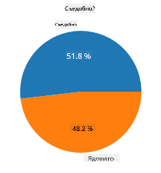
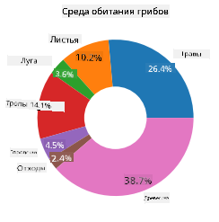
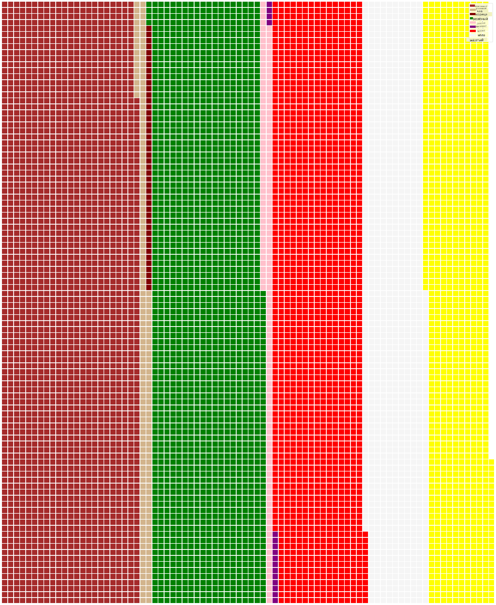

<!--
CO_OP_TRANSLATOR_METADATA:
{
  "original_hash": "af6a12015c6e250e500b570a9fa42593",
  "translation_date": "2025-08-27T10:47:00+00:00",
  "source_file": "3-Data-Visualization/11-visualization-proportions/README.md",
  "language_code": "ru"
}
-->
# Визуализация пропорций

|](../../sketchnotes/11-Visualizing-Proportions.png)|
|:---:|
|Визуализация пропорций - _Скетчноут от [@nitya](https://twitter.com/nitya)_ |

В этом уроке вы будете использовать другой набор данных, связанный с природой, чтобы визуализировать пропорции, например, сколько различных видов грибов представлено в наборе данных о грибах. Давайте изучим эти удивительные грибы, используя набор данных от Audubon, содержащий информацию о 23 видах пластинчатых грибов из семейств Agaricus и Lepiota. Вы попробуете аппетитные визуализации, такие как:

- Круговые диаграммы 🥧
- Кольцевые диаграммы 🍩
- Вафельные диаграммы 🧇

> 💡 Очень интересный проект [Charticulator](https://charticulator.com) от Microsoft Research предлагает бесплатный интерфейс для визуализации данных с функцией перетаскивания. В одном из их учебных пособий также используется этот набор данных о грибах! Вы можете изучить данные и одновременно освоить библиотеку: [Учебное пособие Charticulator](https://charticulator.com/tutorials/tutorial4.html).

## [Тест перед лекцией](https://purple-hill-04aebfb03.1.azurestaticapps.net/quiz/20)

## Узнайте больше о грибах 🍄

Грибы — это очень интересный объект для изучения. Давайте импортируем набор данных, чтобы изучить их:

```python
import pandas as pd
import matplotlib.pyplot as plt
mushrooms = pd.read_csv('../../data/mushrooms.csv')
mushrooms.head()
```
На экране выводится таблица с отличными данными для анализа:


| class     | cap-shape | cap-surface | cap-color | bruises | odor    | gill-attachment | gill-spacing | gill-size | gill-color | stalk-shape | stalk-root | stalk-surface-above-ring | stalk-surface-below-ring | stalk-color-above-ring | stalk-color-below-ring | veil-type | veil-color | ring-number | ring-type | spore-print-color | population | habitat |
| --------- | --------- | ----------- | --------- | ------- | ------- | --------------- | ------------ | --------- | ---------- | ----------- | ---------- | ------------------------ | ------------------------ | ---------------------- | ---------------------- | --------- | ---------- | ----------- | --------- | ----------------- | ---------- | ------- |
| Ядовитый  | Convex    | Smooth      | Brown     | Bruises | Pungent | Free            | Close        | Narrow    | Black      | Enlarging   | Equal      | Smooth                   | Smooth                   | White                  | White                  | Partial   | White      | One         | Pendant   | Black             | Scattered  | Urban   |
| Съедобный | Convex    | Smooth      | Yellow    | Bruises | Almond  | Free            | Close        | Broad     | Black      | Enlarging   | Club       | Smooth                   | Smooth                   | White                  | White                  | Partial   | White      | One         | Pendant   | Brown             | Numerous   | Grasses |
| Съедобный | Bell      | Smooth      | White     | Bruises | Anise   | Free            | Close        | Broad     | Brown      | Enlarging   | Club       | Smooth                   | Smooth                   | White                  | White                  | Partial   | White      | One         | Pendant   | Brown             | Numerous   | Meadows |
| Ядовитый  | Convex    | Scaly       | White     | Bruises | Pungent | Free            | Close        | Narrow    | Brown      | Enlarging   | Equal      | Smooth                   | Smooth                   | White                  | White                  | Partial   | White      | One         | Pendant   | Black             | Scattered  | Urban   |

Сразу видно, что все данные представлены в текстовом формате. Чтобы использовать их в диаграмме, необходимо преобразовать данные. Большая часть данных представлена в виде объекта:

```python
print(mushrooms.select_dtypes(["object"]).columns)
```

Результат:

```output
Index(['class', 'cap-shape', 'cap-surface', 'cap-color', 'bruises', 'odor',
       'gill-attachment', 'gill-spacing', 'gill-size', 'gill-color',
       'stalk-shape', 'stalk-root', 'stalk-surface-above-ring',
       'stalk-surface-below-ring', 'stalk-color-above-ring',
       'stalk-color-below-ring', 'veil-type', 'veil-color', 'ring-number',
       'ring-type', 'spore-print-color', 'population', 'habitat'],
      dtype='object')
```
Возьмите эти данные и преобразуйте столбец 'class' в категорию:

```python
cols = mushrooms.select_dtypes(["object"]).columns
mushrooms[cols] = mushrooms[cols].astype('category')
```

```python
edibleclass=mushrooms.groupby(['class']).count()
edibleclass
```

Теперь, если вы выведете данные о грибах, вы увидите, что они сгруппированы в категории по классам ядовитых/съедобных грибов:


|           | cap-shape | cap-surface | cap-color | bruises | odor | gill-attachment | gill-spacing | gill-size | gill-color | stalk-shape | ... | stalk-surface-below-ring | stalk-color-above-ring | stalk-color-below-ring | veil-type | veil-color | ring-number | ring-type | spore-print-color | population | habitat |
| --------- | --------- | ----------- | --------- | ------- | ---- | --------------- | ------------ | --------- | ---------- | ----------- | --- | ------------------------ | ---------------------- | ---------------------- | --------- | ---------- | ----------- | --------- | ----------------- | ---------- | ------- |
| class     |           |             |           |         |      |                 |              |           |            |             |     |                          |                        |                        |           |            |             |           |                   |            |         |
| Съедобный | 4208      | 4208        | 4208      | 4208    | 4208 | 4208            | 4208         | 4208      | 4208       | 4208        | ... | 4208                     | 4208                   | 4208                   | 4208      | 4208       | 4208        | 4208      | 4208              | 4208       | 4208    |
| Ядовитый  | 3916      | 3916        | 3916      | 3916    | 3916 | 3916            | 3916         | 3916      | 3916       | 3916        | ... | 3916                     | 3916                   | 3916                   | 3916      | 3916       | 3916        | 3916      | 3916              | 3916       | 3916    |

Если вы следуете порядку, представленному в этой таблице, чтобы создать метки категорий класса, вы можете построить круговую диаграмму:

## Круг!

```python
labels=['Edible','Poisonous']
plt.pie(edibleclass['population'],labels=labels,autopct='%.1f %%')
plt.title('Edible?')
plt.show()
```
Вуаля, круговая диаграмма, показывающая пропорции данных по двум классам грибов. Очень важно правильно задать порядок меток, особенно здесь, поэтому обязательно проверьте порядок, в котором создается массив меток!



## Кольца!

Более визуально интересной версией круговой диаграммы является кольцевая диаграмма, которая представляет собой круговую диаграмму с отверстием в центре. Давайте посмотрим на наши данные с помощью этого метода.

Посмотрите на различные места обитания грибов:

```python
habitat=mushrooms.groupby(['habitat']).count()
habitat
```
Здесь вы группируете данные по месту обитания. Их всего 7, поэтому используйте их в качестве меток для кольцевой диаграммы:

```python
labels=['Grasses','Leaves','Meadows','Paths','Urban','Waste','Wood']

plt.pie(habitat['class'], labels=labels,
        autopct='%1.1f%%', pctdistance=0.85)
  
center_circle = plt.Circle((0, 0), 0.40, fc='white')
fig = plt.gcf()

fig.gca().add_artist(center_circle)
  
plt.title('Mushroom Habitats')
  
plt.show()
```



Этот код рисует диаграмму и центральный круг, затем добавляет этот круг в диаграмму. Измените ширину центрального круга, изменив значение `0.40` на другое.

Кольцевые диаграммы можно настроить различными способами, чтобы изменить метки. Метки, в частности, можно выделить для улучшения читаемости. Узнайте больше в [документации](https://matplotlib.org/stable/gallery/pie_and_polar_charts/pie_and_donut_labels.html?highlight=donut).

Теперь, когда вы знаете, как группировать данные и отображать их в виде круговой или кольцевой диаграммы, вы можете изучить другие типы диаграмм. Попробуйте вафельную диаграмму, которая представляет собой другой способ изучения количества.
## Вафли!

Вафельная диаграмма — это другой способ визуализации количеств в виде двумерного массива квадратов. Попробуйте визуализировать различные количества цветов шляпок грибов в этом наборе данных. Для этого вам нужно установить вспомогательную библиотеку [PyWaffle](https://pypi.org/project/pywaffle/) и использовать Matplotlib:

```python
pip install pywaffle
```

Выберите сегмент данных для группировки:

```python
capcolor=mushrooms.groupby(['cap-color']).count()
capcolor
```

Создайте вафельную диаграмму, создав метки и затем сгруппировав данные:

```python
import pandas as pd
import matplotlib.pyplot as plt
from pywaffle import Waffle
  
data ={'color': ['brown', 'buff', 'cinnamon', 'green', 'pink', 'purple', 'red', 'white', 'yellow'],
    'amount': capcolor['class']
     }
  
df = pd.DataFrame(data)
  
fig = plt.figure(
    FigureClass = Waffle,
    rows = 100,
    values = df.amount,
    labels = list(df.color),
    figsize = (30,30),
    colors=["brown", "tan", "maroon", "green", "pink", "purple", "red", "whitesmoke", "yellow"],
)
```

С помощью вафельной диаграммы вы можете четко увидеть пропорции цветов шляпок грибов в этом наборе данных. Интересно, что существует много грибов с зелеными шляпками!



✅ PyWaffle поддерживает использование иконок в диаграммах, которые могут быть любыми доступными иконками из [Font Awesome](https://fontawesome.com/). Проведите эксперименты, чтобы создать еще более интересную вафельную диаграмму, используя иконки вместо квадратов.

В этом уроке вы узнали три способа визуализации пропорций. Сначала нужно сгруппировать данные в категории, а затем решить, какой способ отображения данных — круг, кольцо или вафля — подходит лучше всего. Все они аппетитны и дают пользователю мгновенное представление о наборе данных.

## 🚀 Задание

Попробуйте воссоздать эти аппетитные диаграммы в [Charticulator](https://charticulator.com).
## [Тест после лекции](https://purple-hill-04aebfb03.1.azurestaticapps.net/quiz/21)

## Обзор и самостоятельное изучение

Иногда бывает не очевидно, когда использовать круговую, кольцевую или вафельную диаграмму. Вот несколько статей на эту тему:

https://www.beautiful.ai/blog/battle-of-the-charts-pie-chart-vs-donut-chart

https://medium.com/@hypsypops/pie-chart-vs-donut-chart-showdown-in-the-ring-5d24fd86a9ce

https://www.mit.edu/~mbarker/formula1/f1help/11-ch-c6.htm

https://medium.datadriveninvestor.com/data-visualization-done-the-right-way-with-tableau-waffle-chart-fdf2a19be402

Проведите исследование, чтобы найти больше информации о выборе подходящего типа диаграммы.
## Задание

[Попробуйте в Excel](assignment.md)

---

**Отказ от ответственности**:  
Этот документ был переведен с использованием сервиса автоматического перевода [Co-op Translator](https://github.com/Azure/co-op-translator). Несмотря на наши усилия обеспечить точность, автоматические переводы могут содержать ошибки или неточности. Оригинальный документ на его исходном языке следует считать авторитетным источником. Для получения критически важной информации рекомендуется профессиональный перевод человеком. Мы не несем ответственности за любые недоразумения или неправильные интерпретации, возникшие в результате использования данного перевода.