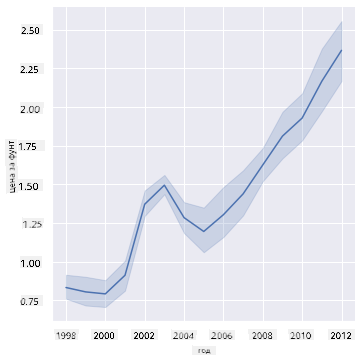
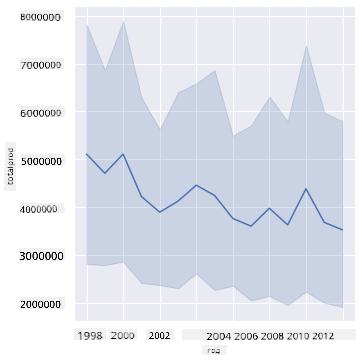
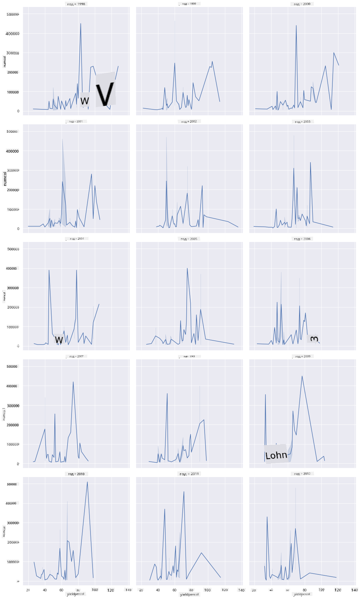
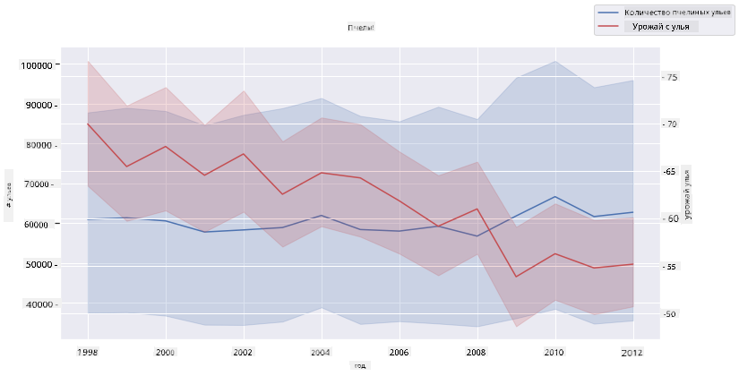

<!--
CO_OP_TRANSLATOR_METADATA:
{
  "original_hash": "b29e427401499e81f4af55a8c4afea76",
  "translation_date": "2025-09-04T15:35:27+00:00",
  "source_file": "3-Data-Visualization/12-visualization-relationships/README.md",
  "language_code": "ru"
}
-->
# Визуализация связей: всё о мёде 🍯

|](../../sketchnotes/12-Visualizing-Relationships.png)|
|:---:|
|Визуализация связей - _Скетчноут от [@nitya](https://twitter.com/nitya)_ |

Продолжая исследование, связанное с природой, давайте изучим интересные способы визуализации связей между различными типами мёда, основываясь на наборе данных, полученном из [Министерства сельского хозяйства США](https://www.nass.usda.gov/About_NASS/index.php).

Этот набор данных, содержащий около 600 записей, отображает производство мёда в различных штатах США. Например, можно изучить количество колоний, урожайность на одну колонию, общий объём производства, запасы, цену за фунт и стоимость произведённого мёда в каждом штате за период с 1998 по 2012 год, где каждая строка представляет данные за год для конкретного штата.

Будет интересно визуализировать связь между объёмом производства в штате за год и, например, ценой мёда в этом штате. Также можно визуализировать связь между урожайностью мёда на одну колонию в разных штатах. Этот временной период охватывает разрушительное явление «Синдром разрушения колоний» (CCD), впервые зафиксированное в 2006 году (http://npic.orst.edu/envir/ccd.html), что делает этот набор данных особенно значимым для изучения. 🐝

## [Тест перед лекцией](https://purple-hill-04aebfb03.1.azurestaticapps.net/quiz/22)

В этом уроке вы можете использовать библиотеку Seaborn, с которой вы уже знакомы, чтобы визуализировать связи между переменными. Особенно интересна функция `relplot` в Seaborn, которая позволяет создавать диаграммы рассеяния и линейные графики для быстрой визуализации '[статистических связей](https://seaborn.pydata.org/tutorial/relational.html?highlight=relationships)', что помогает дата-сайентисту лучше понять, как переменные связаны друг с другом.

## Диаграммы рассеяния

Используйте диаграмму рассеяния, чтобы показать, как цена мёда менялась год за годом в каждом штате. Seaborn, используя `relplot`, удобно группирует данные по штатам и отображает точки данных как для категориальных, так и для числовых данных.

Начнём с импорта данных и библиотеки Seaborn:

```python
import pandas as pd
import matplotlib.pyplot as plt
import seaborn as sns
honey = pd.read_csv('../../data/honey.csv')
honey.head()
```
Вы заметите, что данные о мёде содержат несколько интересных столбцов, включая год и цену за фунт. Давайте изучим эти данные, сгруппированные по штатам США:

| state | numcol | yieldpercol | totalprod | stocks   | priceperlb | prodvalue | year |
| ----- | ------ | ----------- | --------- | -------- | ---------- | --------- | ---- |
| AL    | 16000  | 71          | 1136000   | 159000   | 0.72       | 818000    | 1998 |
| AZ    | 55000  | 60          | 3300000   | 1485000  | 0.64       | 2112000   | 1998 |
| AR    | 53000  | 65          | 3445000   | 1688000  | 0.59       | 2033000   | 1998 |
| CA    | 450000 | 83          | 37350000  | 12326000 | 0.62       | 23157000  | 1998 |
| CO    | 27000  | 72          | 1944000   | 1594000  | 0.7        | 1361000   | 1998 |

Создайте базовую диаграмму рассеяния, чтобы показать связь между ценой за фунт мёда и его штатом происхождения. Сделайте ось `y` достаточно высокой, чтобы отобразить все штаты:

```python
sns.relplot(x="priceperlb", y="state", data=honey, height=15, aspect=.5);
```


Теперь покажите те же данные с цветовой схемой, напоминающей цвет мёда, чтобы отобразить, как цена меняется год за годом. Вы можете сделать это, добавив параметр 'hue', чтобы показать изменения:

> ✅ Узнайте больше о [цветовых палитрах, которые можно использовать в Seaborn](https://seaborn.pydata.org/tutorial/color_palettes.html) - попробуйте красивую радужную палитру!

```python
sns.relplot(x="priceperlb", y="state", hue="year", palette="YlOrBr", data=honey, height=15, aspect=.5);
```


С изменением цветовой схемы становится очевидным, что цена мёда за фунт значительно увеличивается с течением времени. Если вы проверите это на выборке данных (например, выберите штат Аризона), вы увидите закономерность роста цен год за годом, за редкими исключениями:

| state | numcol | yieldpercol | totalprod | stocks  | priceperlb | prodvalue | year |
| ----- | ------ | ----------- | --------- | ------- | ---------- | --------- | ---- |
| AZ    | 55000  | 60          | 3300000   | 1485000 | 0.64       | 2112000   | 1998 |
| AZ    | 52000  | 62          | 3224000   | 1548000 | 0.62       | 1999000   | 1999 |
| AZ    | 40000  | 59          | 2360000   | 1322000 | 0.73       | 1723000   | 2000 |
| AZ    | 43000  | 59          | 2537000   | 1142000 | 0.72       | 1827000   | 2001 |
| AZ    | 38000  | 63          | 2394000   | 1197000 | 1.08       | 2586000   | 2002 |
| AZ    | 35000  | 72          | 2520000   | 983000  | 1.34       | 3377000   | 2003 |
| AZ    | 32000  | 55          | 1760000   | 774000  | 1.11       | 1954000   | 2004 |
| AZ    | 36000  | 50          | 1800000   | 720000  | 1.04       | 1872000   | 2005 |
| AZ    | 30000  | 65          | 1950000   | 839000  | 0.91       | 1775000   | 2006 |
| AZ    | 30000  | 64          | 1920000   | 902000  | 1.26       | 2419000   | 2007 |
| AZ    | 25000  | 64          | 1600000   | 336000  | 1.26       | 2016000   | 2008 |
| AZ    | 20000  | 52          | 1040000   | 562000  | 1.45       | 1508000   | 2009 |
| AZ    | 24000  | 77          | 1848000   | 665000  | 1.52       | 2809000   | 2010 |
| AZ    | 23000  | 53          | 1219000   | 427000  | 1.55       | 1889000   | 2011 |
| AZ    | 22000  | 46          | 1012000   | 253000  | 1.79       | 1811000   | 2012 |

Другой способ визуализировать этот рост — использовать размер вместо цвета. Для пользователей с нарушением цветового восприятия это может быть более удобным вариантом. Измените визуализацию, чтобы показать увеличение цены через увеличение диаметра точек:

```python
sns.relplot(x="priceperlb", y="state", size="year", data=honey, height=15, aspect=.5);
```
Вы можете заметить, как размер точек постепенно увеличивается.


Это простой случай спроса и предложения? Из-за таких факторов, как изменение климата и разрушение колоний, становится ли мёда меньше с каждым годом, что приводит к росту цен?

Чтобы найти корреляцию между некоторыми переменными в этом наборе данных, давайте изучим линейные графики.

## Линейные графики

Вопрос: Наблюдается ли явный рост цены мёда за фунт год за годом? Это можно легко увидеть, создав один линейный график:

```python
sns.relplot(x="year", y="priceperlb", kind="line", data=honey);
```
Ответ: Да, с некоторыми исключениями около 2003 года:



✅ Поскольку Seaborn агрегирует данные в одну линию, он отображает «несколько измерений для каждого значения x, строя среднее значение и 95% доверительный интервал вокруг среднего». [Источник](https://seaborn.pydata.org/tutorial/relational.html). Это поведение можно отключить, добавив `ci=None`.

Вопрос: А в 2003 году можно также увидеть всплеск предложения мёда? Что если посмотреть на общий объём производства год за годом?

```python
sns.relplot(x="year", y="totalprod", kind="line", data=honey);
```



Ответ: Не совсем. Если посмотреть на общий объём производства, он, наоборот, кажется увеличившимся в этот год, хотя в целом объём производства мёда снижается в течение этих лет.

Вопрос: В таком случае, что могло вызвать всплеск цены мёда около 2003 года?

Чтобы выяснить это, можно использовать сетку фасетов.

## Сетки фасетов

Сетки фасетов позволяют выбрать одну грань вашего набора данных (в нашем случае можно выбрать 'год', чтобы избежать слишком большого количества фасетов). Seaborn затем создаёт график для каждого из этих фасетов, используя выбранные координаты x и y для более удобного визуального сравнения. Выделяется ли 2003 год в таком сравнении?

Создайте сетку фасетов, продолжая использовать `relplot`, как рекомендовано в [документации Seaborn](https://seaborn.pydata.org/generated/seaborn.FacetGrid.html?highlight=facetgrid#seaborn.FacetGrid).

```python
sns.relplot(
    data=honey, 
    x="yieldpercol", y="numcol",
    col="year", 
    col_wrap=3,
    kind="line"
```
В этой визуализации вы можете сравнить урожайность на одну колонию и количество колоний год за годом, рядом друг с другом, с wrap, установленным на 3 для столбцов:



Для этого набора данных ничего особенно не выделяется в отношении количества колоний и их урожайности год за годом и штат за штатом. Есть ли другой способ найти корреляцию между этими двумя переменными?

## Двухлинейные графики

Попробуйте многолинейный график, наложив два линейных графика друг на друга, используя функцию Seaborn 'despine', чтобы убрать верхние и правые границы, и `ax.twinx` [из библиотеки Matplotlib](https://matplotlib.org/stable/api/_as_gen/matplotlib.axes.Axes.twinx.html). Twinx позволяет графику делить ось x и отображать две оси y. Отобразите урожайность на одну колонию и количество колоний, наложив их друг на друга:

```python
fig, ax = plt.subplots(figsize=(12,6))
lineplot = sns.lineplot(x=honey['year'], y=honey['numcol'], data=honey, 
                        label = 'Number of bee colonies', legend=False)
sns.despine()
plt.ylabel('# colonies')
plt.title('Honey Production Year over Year');

ax2 = ax.twinx()
lineplot2 = sns.lineplot(x=honey['year'], y=honey['yieldpercol'], ax=ax2, color="r", 
                         label ='Yield per colony', legend=False) 
sns.despine(right=False)
plt.ylabel('colony yield')
ax.figure.legend();
```


Хотя ничего явно не выделяется около 2003 года, это позволяет завершить урок на более позитивной ноте: несмотря на общее снижение количества колоний, их число стабилизируется, даже если урожайность на одну колонию уменьшается.

Вперёд, пчёлы, вперёд!

🐝❤️
## 🚀 Задание

В этом уроке вы узнали немного больше о других способах использования диаграмм рассеяния и линейных сеток, включая сетки фасетов. Попробуйте создать сетку фасетов, используя другой набор данных, возможно, тот, который вы использовали ранее в этих уроках. Обратите внимание, сколько времени требуется для их создания и как важно учитывать количество сеток, которые нужно нарисовать, используя эти техники.

## [Тест после лекции](https://ff-quizzes.netlify.app/en/ds/)

## Обзор и самостоятельное изучение

Линейные графики могут быть простыми или довольно сложными. Почитайте [документацию Seaborn](https://seaborn.pydata.org/generated/seaborn.lineplot.html) о различных способах их построения. Попробуйте улучшить линейные графики, которые вы создали в этом уроке, используя другие методы, перечисленные в документации.

## Задание

[Погрузитесь в улей](assignment.md)

---

**Отказ от ответственности**:  
Этот документ был переведен с использованием сервиса автоматического перевода [Co-op Translator](https://github.com/Azure/co-op-translator). Хотя мы стремимся к точности, пожалуйста, имейте в виду, что автоматические переводы могут содержать ошибки или неточности. Оригинальный документ на его исходном языке следует считать авторитетным источником. Для получения критически важной информации рекомендуется профессиональный перевод человеком. Мы не несем ответственности за любые недоразумения или неправильные толкования, возникшие в результате использования данного перевода.